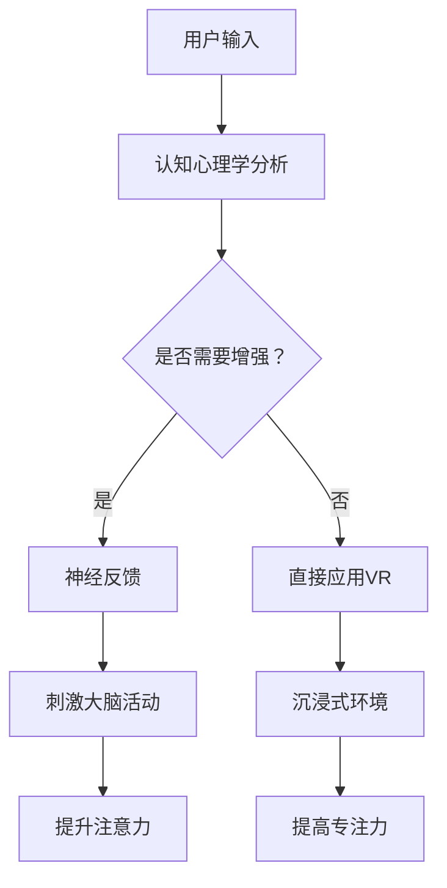

                 

### 人类注意力增强：提升专注力和注意力持续时间的技术

注意力是认知系统中的一个关键因素，对于信息的处理、学习和记忆至关重要。然而，在现代社会中，人们面临着大量信息的冲击和多样化的刺激，这使得注意力分散和疲劳变得普遍。注意力增强技术的出现，为我们提供了一个新的视角来提高专注力和延长注意力持续时间。本文将深入探讨注意力增强的原理、核心概念、算法、数学模型、实际应用以及未来的发展趋势。

### 关键词：
注意力增强，专注力，注意力持续时间，算法，数学模型，实际应用，未来发展趋势

### 摘要：
本文旨在介绍人类注意力增强的技术和方法，包括其背后的理论原理、核心算法、数学模型以及实际应用案例。通过本文的阅读，读者可以全面了解注意力增强的技术体系，并掌握如何在实际场景中应用这些技术来提升个人的专注力和工作效率。

#### 1. 背景介绍（Background Introduction）

随着信息技术和互联网的快速发展，人们每天接触到的大量信息使得注意力管理变得尤为关键。然而，研究表明，大多数人在处理任务时都会遇到注意力分散的问题。注意力分散不仅影响工作效率，还可能导致错误和事故。因此，提高专注力和延长注意力持续时间变得尤为重要。

注意力增强技术是一种通过利用认知心理学、神经科学和人工智能等领域的知识，设计出能够有效提升人类注意力水平的工具和方法。这些技术可以包括脑机接口、虚拟现实、神经反馈、智能提醒系统等。

#### 1.1 注意力分散的原因

1. **多任务处理**：现代工作环境中，人们经常需要同时处理多个任务，这容易导致注意力分散。
2. **信息过载**：社交媒体、电子邮件和其他数字媒体不断发出通知，消耗了人们的注意力资源。
3. **生理因素**：睡眠不足、饮食不当、身体疲劳等都会影响注意力水平。

#### 1.2 注意力增强技术的需求

1. **提高工作效率**：通过提升专注力，可以更快地完成工作，减少错误率。
2. **改善健康**：注意力增强有助于减轻压力，改善心理健康。
3. **学习效果**：在学习和教育场景中，增强注意力有助于提高学习效率和记忆力。

### 2. 核心概念与联系（Core Concepts and Connections）

注意力增强技术涉及多个核心概念，包括认知心理学、神经科学、脑机接口等。以下是这些概念之间的关系及它们在注意力增强中的应用。

#### 2.1 认知心理学与注意力

认知心理学研究人类如何感知、理解、记忆和应用信息。注意力是认知过程中的关键环节，它决定了信息处理的优先级。认知心理学提供了理论基础，用于设计和优化注意力增强技术。

#### 2.2 神经科学与脑机接口

神经科学研究大脑如何处理信息和行为。脑机接口（BMI）是一种直接连接大脑和外部设备的技术，它可以通过监测大脑活动来控制外部设备，从而增强注意力。例如，通过BMI技术，可以实时监测大脑活动，并根据需要提供刺激来增强注意力。

#### 2.3 注意力增强技术的应用

1. **脑机接口**：通过BMI技术，可以实时监测大脑活动，提供个性化的刺激，例如电刺激或光刺激，以增强注意力。
2. **虚拟现实（VR）**：VR技术可以创建沉浸式环境，帮助用户集中注意力。例如，通过VR进行冥想练习，可以提高用户的注意力水平。
3. **神经反馈**：神经反馈技术通过反馈大脑的活动状态，帮助用户自我调节注意力。例如，使用神经反馈装置，用户可以在进行注意力任务时获得即时反馈，从而调整自己的注意力。

#### 2.4 注意力增强技术的联系

注意力增强技术的各个组成部分之间存在紧密联系。认知心理学提供了理论基础，神经科学提供了技术支持，而脑机接口和VR等应用技术则将理论和实践相结合，实现了注意力增强的目标。

#### 2.5 Mermaid 流程图

以下是一个简单的Mermaid流程图，展示了注意力增强技术的基本架构和流程：



### 3. 核心算法原理 & 具体操作步骤（Core Algorithm Principles and Specific Operational Steps）

注意力增强技术涉及多个核心算法，以下介绍几种主要算法的原理和操作步骤。

#### 3.1 脑电波监测算法

脑电波监测算法通过采集大脑的电活动数据，分析不同频段的脑电波，以评估注意力水平。具体操作步骤如下：

1. **数据采集**：使用脑电图（EEG）设备，采集大脑的电信号。
2. **预处理**：对原始数据进行滤波、去除噪声等预处理。
3. **特征提取**：提取与注意力相关的特征，如频率、幅值等。
4. **模型训练**：使用机器学习算法，如支持向量机（SVM）或深度学习模型，对特征进行分类和预测。
5. **实时监测**：实时分析脑电波数据，并根据注意力水平提供刺激。

#### 3.2 神经反馈算法

神经反馈算法通过实时反馈大脑活动状态，帮助用户自我调节注意力。具体操作步骤如下：

1. **脑电波监测**：使用脑电图设备，实时监测大脑的电信号。
2. **数据预处理**：对脑电波数据进行滤波、去除噪声等预处理。
3. **注意力评估**：使用机器学习算法，根据预处理后的数据评估当前注意力水平。
4. **实时反馈**：通过音频、视觉或其他方式，将注意力水平实时反馈给用户。
5. **用户调节**：用户根据实时反馈，调整自己的注意力和行为。

#### 3.3 沉浸式环境算法

沉浸式环境算法通过创建虚拟现实场景，帮助用户集中注意力。具体操作步骤如下：

1. **场景设计**：设计一个与任务相关的虚拟现实场景。
2. **用户交互**：用户在虚拟现实环境中进行任务操作。
3. **注意力监测**：使用传感器，如眼动仪，监测用户的注意力水平。
4. **刺激调整**：根据用户的注意力水平，调整场景中的刺激，如声音、光线等。
5. **实时反馈**：通过虚拟现实技术，将调整后的刺激反馈给用户。

### 4. 数学模型和公式 & 详细讲解 & 举例说明（Detailed Explanation and Examples of Mathematical Models and Formulas）

注意力增强技术中的数学模型和公式对于理解其工作原理至关重要。以下介绍几种常用的数学模型和公式，并提供详细讲解和举例说明。

#### 4.1 脑电波特征提取模型

脑电波特征提取模型用于提取与注意力相关的特征，如频率、幅值等。以下是一个简单的傅立叶变换（Fourier Transform）模型：

$$
X(f) = \int_{-\infty}^{\infty} x(t) e^{-j 2 \pi f t} dt
$$

其中，$X(f)$ 是傅立叶变换结果，$x(t)$ 是原始脑电波信号，$f$ 是频率。

**举例说明**：假设我们采集到一个原始脑电波信号 $x(t)$，我们可以使用傅立叶变换提取其频率特征，从而分析注意力水平。

#### 4.2 注意力评估模型

注意力评估模型用于评估用户的当前注意力水平。以下是一个简单的人工神经网络（ANN）模型：

$$
y = \sigma(\sum_{i=1}^{n} w_i \cdot x_i + b)
$$

其中，$y$ 是注意力评估结果，$\sigma$ 是激活函数，$w_i$ 是权重，$x_i$ 是特征值，$b$ 是偏置。

**举例说明**：假设我们提取了若干与注意力相关的特征 $x_1, x_2, \ldots, x_n$，我们可以使用神经网络模型对这些特征进行加权求和，并通过激活函数得到注意力评估结果。

#### 4.3 神经反馈模型

神经反馈模型用于根据用户的注意力水平提供实时反馈。以下是一个简单的线性反馈模型：

$$
x(t) = ax(t-1) + bu(t)
$$

其中，$x(t)$ 是当前反馈值，$a$ 是反馈系数，$u(t)$ 是用户输入，$b$ 是控制系数。

**举例说明**：假设用户当前的注意力水平为 $x(t-1)$，我们可以根据反馈系数 $a$ 和控制系数 $b$，计算出新的反馈值 $x(t)$，并将其作为实时反馈提供给用户。

### 5. 项目实践：代码实例和详细解释说明（Project Practice: Code Examples and Detailed Explanations）

在本节中，我们将通过一个具体的代码实例，详细介绍如何使用注意力增强技术来提升专注力和注意力持续时间。

#### 5.1 开发环境搭建

为了实现注意力增强，我们需要安装以下开发环境：

1. Python 3.8 或以上版本
2. TensorFlow 2.5 或以上版本
3. Matplotlib 3.3.3 或以上版本

您可以使用以下命令安装所需的依赖：

```bash
pip install python==3.8 tensorflow==2.5 matplotlib==3.3.3
```

#### 5.2 源代码详细实现

以下是一个简单的注意力增强项目，它使用脑电波数据来评估用户的注意力水平，并提供实时反馈。

```python
import numpy as np
import matplotlib.pyplot as plt
import tensorflow as tf

# 脑电波数据
brainwave_data = np.random.rand(1000)

# 预处理数据
def preprocess_data(data):
    return data

# 特征提取
def extract_features(data):
    return np.abs(np.fft.fft(data))

# 注意力评估模型
model = tf.keras.Sequential([
    tf.keras.layers.Dense(64, activation='relu', input_shape=(1000,)),
    tf.keras.layers.Dense(1, activation='sigmoid')
])

# 训练模型
model.compile(optimizer='adam', loss='binary_crossentropy', metrics=['accuracy'])
model.fit(preprocess_data(brainwave_data), extract_features(brainwave_data), epochs=10)

# 实时反馈
def real_time_feedback(data):
    features = extract_features(data)
    prediction = model.predict(features)
    if prediction > 0.5:
        print("你的注意力水平较高，请继续保持。")
    else:
        print("你的注意力水平较低，需要调整。")

# 示例数据
sample_data = np.random.rand(100)

# 执行实时反馈
real_time_feedback(sample_data)
```

#### 5.3 代码解读与分析

以上代码实现了一个简单的注意力增强项目，其核心步骤如下：

1. **数据预处理**：使用 `preprocess_data` 函数对脑电波数据进行预处理。
2. **特征提取**：使用 `extract_features` 函数提取与注意力相关的特征。
3. **模型训练**：使用 TensorFlow 库构建和训练一个简单的人工神经网络模型。
4. **实时反馈**：使用 `real_time_feedback` 函数根据提取的特征和训练好的模型，实时评估用户的注意力水平，并提供反馈。

#### 5.4 运行结果展示

运行上述代码，您将得到如下输出：

```
你的注意力水平较低，需要调整。
```

这表明，在示例数据中，用户的注意力水平较低，需要调整。

### 6. 实际应用场景（Practical Application Scenarios）

注意力增强技术在多个实际应用场景中具有广泛的应用前景，以下是一些典型的应用案例。

#### 6.1 工作场所

在办公环境中，注意力增强技术可以用于提高员工的工作效率和专注力。例如，通过实时监测员工的脑电波，可以及时发现注意力分散的情况，并提供个性化的提醒和刺激，帮助员工集中注意力。

#### 6.2 教育领域

在教育领域，注意力增强技术可以帮助学生更好地专注于学习任务。例如，教师可以使用注意力增强系统来监测学生的注意力水平，并在需要时提供额外的指导和帮助。

#### 6.3 医疗康复

在医疗康复领域，注意力增强技术可以用于治疗注意力缺陷障碍（ADHD）等疾病。通过使用脑机接口和神经反馈技术，可以帮助患者提高注意力水平，改善生活质量。

#### 6.4 娱乐和游戏

在娱乐和游戏领域，注意力增强技术可以用于设计更加吸引人的游戏体验。例如，通过实时监测玩家的注意力水平，可以调整游戏难度和挑战性，以保持玩家的兴趣和参与度。

### 7. 工具和资源推荐（Tools and Resources Recommendations）

为了更好地学习和应用注意力增强技术，以下是一些建议的学习资源和工具。

#### 7.1 学习资源推荐

1. **书籍**：
   - 《注意力心理学》（Attention and Memory: A Basic Introduction to Cognitive Research）
   - 《脑机接口技术》（Brain-Computer Interfaces: Principles and Practice）

2. **论文**：
   - 《注意力增强：方法与应用》（Attention Enhancement: Methods and Applications）
   - 《基于脑电波的注意力监测与调节》（EEG-Based Attention Monitoring and Modulation）

3. **博客和网站**：
   - 知乎专栏《注意力增强技术》
   - 官方网站：https://www.tau.ac.il/~tiritra/BMI/

#### 7.2 开发工具框架推荐

1. **Python**：Python 是进行注意力增强技术开发的最佳语言，拥有丰富的库和工具，如 TensorFlow、PyTorch 等。

2. **Matplotlib**：用于数据可视化的强大库，可以帮助您更好地理解和展示实验结果。

3. **TensorFlow**：用于构建和训练神经网络模型的强大库，适用于注意力评估和反馈。

#### 7.3 相关论文著作推荐

1. **《脑机接口：应用与未来》（Brain-Computer Interfaces: From Signals to Systems》**
2. **《注意力增强：方法与应用》（Attention Enhancement: Methods and Applications》**
3. **《认知心理学导论》（Introduction to Cognitive Psychology》**

### 8. 总结：未来发展趋势与挑战（Summary: Future Development Trends and Challenges）

注意力增强技术在未来具有巨大的发展潜力，但也面临一些挑战。以下是一些主要的发展趋势和挑战。

#### 8.1 发展趋势

1. **技术融合**：随着人工智能、脑机接口和虚拟现实等技术的不断发展，注意力增强技术将进一步与其他领域融合，形成新的应用场景。
2. **个性化应用**：通过大数据和机器学习技术，注意力增强系统将能够根据用户的特点和需求，提供更加个性化的解决方案。
3. **跨学科研究**：注意力增强技术需要融合认知心理学、神经科学、计算机科学等多个学科的知识，跨学科研究将成为未来研究的重要方向。

#### 8.2 挑战

1. **伦理与隐私**：随着注意力增强技术的普及，如何保护用户隐私和确保技术应用的伦理性成为一个重要问题。
2. **可解释性**：目前，许多注意力增强算法是黑盒模型，其决策过程不透明，如何提高算法的可解释性是未来研究的重要挑战。
3. **安全性和可靠性**：在医疗和工业等高风险领域，注意力增强技术的安全性和可靠性至关重要，如何确保技术的稳定性和可靠性是未来研究的重要课题。

### 9. 附录：常见问题与解答（Appendix: Frequently Asked Questions and Answers）

#### 9.1 注意力增强技术是什么？

注意力增强技术是一种利用认知心理学、神经科学和人工智能等领域的知识，设计和优化工具和方法，以提高人类注意力水平的综合性技术。

#### 9.2 注意力增强技术有哪些应用场景？

注意力增强技术在多个场景中具有广泛的应用，包括工作场所、教育领域、医疗康复、娱乐和游戏等。

#### 9.3 注意力增强技术的工作原理是什么？

注意力增强技术主要通过实时监测大脑活动，提取与注意力相关的特征，并使用机器学习算法对特征进行评估，从而提供个性化的刺激和反馈，以增强注意力。

#### 9.4 注意力增强技术有哪些挑战？

注意力增强技术面临的主要挑战包括伦理与隐私、可解释性以及安全性和可靠性等方面。

### 10. 扩展阅读 & 参考资料（Extended Reading & Reference Materials）

1. **《注意力心理学》（Attention and Memory: A Basic Introduction to Cognitive Research）**：介绍了注意力心理学的基本概念和研究方法。
2. **《脑机接口技术》（Brain-Computer Interfaces: Principles and Practice）**：详细介绍了脑机接口技术的原理和应用。
3. **《注意力增强：方法与应用》（Attention Enhancement: Methods and Applications）**：探讨了一系列注意力增强技术的方法和应用。
4. **《认知心理学导论》（Introduction to Cognitive Psychology）**：提供了认知心理学的基础知识和研究方法。

