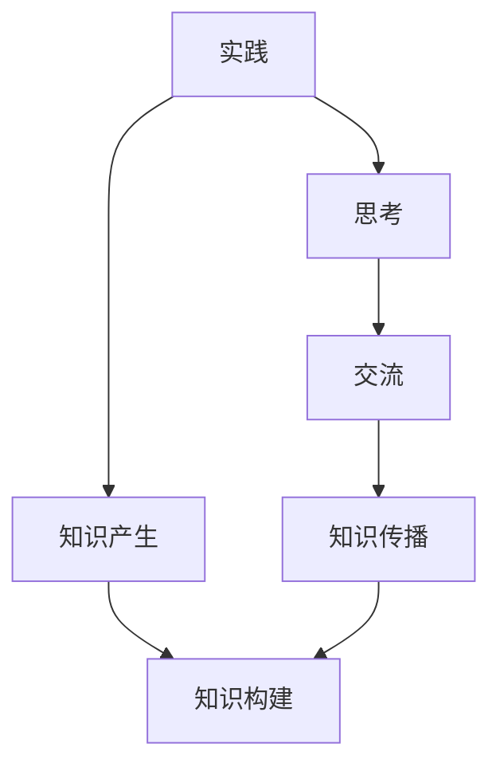
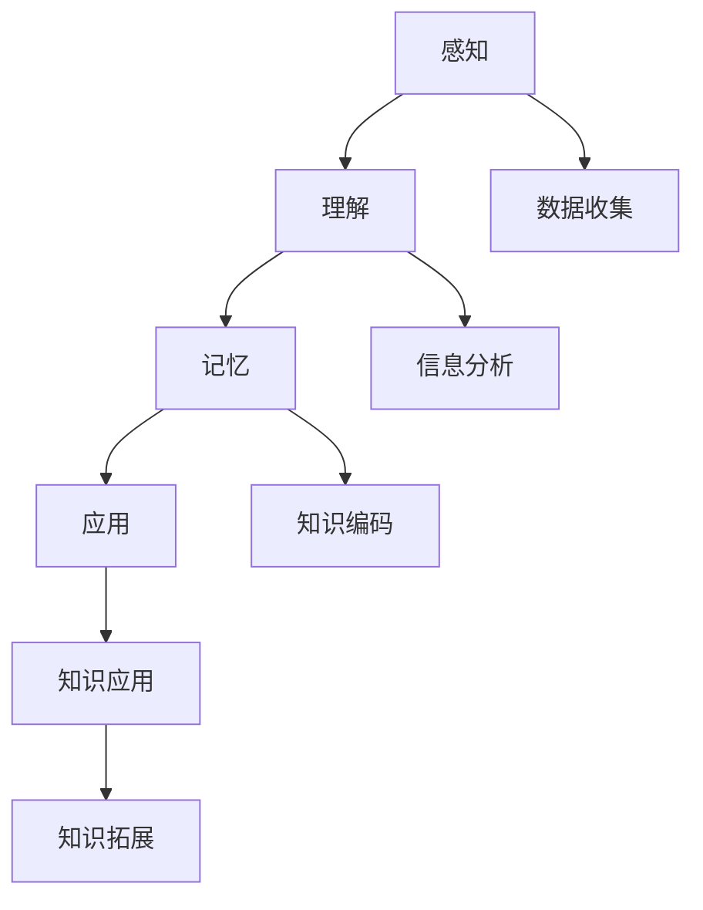

                 

### 人类知识的来源：实践、思考与交流

#### 关键词：
- 实践
- 思考
- 交流
- 知识来源
- 知识构建
- 知识传播

##### 摘要：
本文旨在探讨人类知识的来源，即实践、思考和交流的作用与影响。通过分析这三个关键要素，我们将揭示知识构建和传播的过程。文章将从实践的角度出发，讨论实践如何促进知识的产生；接着，将深入思考过程，分析思考对知识形成的重要性；最后，将探讨交流在知识传播中的作用，以及如何利用现代技术手段促进知识的共享与传播。通过这篇文章，我们希望能提供一个全面、系统的视角来理解人类知识的发展。

## 1. 背景介绍（Background Introduction）

人类知识的积累与发展是文明进步的重要驱动力。知识不仅仅指学术理论或科学发现，它还包括日常生活中的经验与智慧。知识的来源是多方面的，但可以归纳为三大核心要素：实践、思考和交流。这三个要素相互依赖、相互促进，共同构成了人类知识体系的基础。

### 1.1 实践的作用

实践是人类获取知识的最基本途径。通过实际行动，人们可以直接感知世界、解决问题，从而产生新的知识和经验。实践不仅促进了人类对自然和社会的认识，还推动了技术的创新与发展。例如，农业社会的实践促进了农作物的种植与改良，工业革命则基于实践的积累推动了机械化生产。

### 1.2 思考的重要性

思考是对实践经验进行反思和总结的过程，它使人们能够从表面现象中提炼出本质规律。思考不仅能够加深对知识的理解，还能够激发新的创意和洞见。伟大的思想家们，如牛顿、达尔文和爱因斯坦，都是通过深入的思考，将零散的经验和知识体系化，推动了科学的进步。

### 1.3 交流的作用

交流是知识传播和分享的关键途径。人们通过交流，可以将自己的知识和经验传递给他人，从而实现知识的共享和扩散。交流的形式多种多样，包括口头传授、书面记录和现代技术的广泛应用。历史上，学者们通过书信、讲座和学术会议等形式进行交流，推动了知识的积累和传播。在现代，互联网和社交媒体使得知识的传播速度和范围达到了前所未有的高度。

### 1.4 知识的构建与传播

知识的构建与传播是一个动态的过程，涉及实践、思考和交流的相互作用。实践为知识产生提供了基础，思考使知识得以深化和体系化，而交流则确保知识能够广泛传播。没有实践，知识将缺乏来源；没有思考，知识将难以提炼和升华；没有交流，知识将难以传播和共享。

## 2. 核心概念与联系（Core Concepts and Connections）

### 2.1 实践、思考和交流的定义与关系

- **实践**：指的是人类通过实际操作、实验和互动来探索和理解世界的过程。
- **思考**：是对实践经验进行反思、分析和推理的过程，以发现规律、解决问题和形成新知识。
- **交流**：是知识分享和传播的过程，通过语言、文字、符号等手段将知识和经验传递给他人。

这三个概念之间存在密切的联系。实践为思考和交流提供了基础数据，思考将这些数据转化为知识和理解，而交流则确保这些知识和理解能够被广泛传播和应用。

### 2.2 实践、思考与交流在知识构建中的角色

- **实践**：实践是知识产生的源泉。通过实践，人们可以直接感知和体验世界，从而获得直接的知识。例如，科学家通过实验验证假设，工程师通过建造和测试新设备，医生通过临床实践积累经验。
- **思考**：思考是对实践经验的深化和总结。通过思考，人们可以从实践中提取出有价值的规律和原则，形成理论体系。例如，哲学家通过思考人类存在和意识的问题，形成了伦理学和政治学等学科。
- **交流**：交流是知识传播和共享的重要手段。通过交流，人们可以将自己的知识和经验分享给他人，从而实现知识的积累和扩展。例如，学者通过撰写论文和著作，工程师通过编写技术规范和设计文档，医生通过培训和传授经验。

### 2.3 实践、思考与交流在知识传播中的作用

- **实践**：实践为知识的传播提供了原始材料。没有实践，就没有可供传播的知识。例如，科学实验的结果和技术创新的成果，都是知识传播的重要基础。
- **思考**：思考使知识传播更加深入和有效。通过思考，人们可以理解知识的内涵和适用范围，从而更准确地传播和解释知识。例如，教师通过深入思考和准备，能够为学生提供更具启发性和全面性的教学内容。
- **交流**：交流是知识传播的主要途径。通过口头讲授、书面文献、多媒体等形式，人们可以将知识传递给他人，实现知识的共享。例如，互联网和社交媒体使得知识的传播速度和范围大大扩展，为全球知识共享提供了新的平台。

### 2.4 实践、思考与交流的互动关系

实践、思考和交流是相互促进、相互依赖的。实践为思考和交流提供了基础，思考和交流又进一步推动了实践的发展。例如，科学家通过实践获取实验数据，通过思考分析数据，并借助交流与同行分享研究成果，最终推动科学进步。

### 2.5 实践、思考与交流在现代信息技术中的应用

现代信息技术为实践、思考和交流提供了新的工具和平台。例如，互联网使得知识传播更加快捷和广泛，大数据技术使得数据处理和分析更加高效，人工智能技术则通过模拟人类思考过程，推动知识构建和传播的智能化。

#### 2.6 核心概念原理和架构的 Mermaid 流程图



**图 2.1 实践、思考与交流的互动关系图**

在上图中，A 表示实践，B 表示思考，C 表示交流。实践通过获取经验和数据，推动知识产生（D），思考对这些知识和经验进行加工和提炼，形成更加系统和深入的知识（F）。交流则确保这些知识能够传播和共享，进一步推动知识构建（F）。

## 3. 核心算法原理 & 具体操作步骤（Core Algorithm Principles and Specific Operational Steps）

在深入探讨人类知识的来源时，我们不可避免地要涉及到知识构建的核心算法原理。这些原理不仅解释了知识是如何在人类大脑中形成的，还提供了理解知识传播和交流的框架。本节将介绍核心算法原理，并详细描述具体的操作步骤。

### 3.1 知识构建的核心算法原理

知识构建的核心算法可以概括为“感知-理解-记忆-应用”的过程。以下是这个过程的详细解析：

- **感知（Perception）**：感知是知识构建的第一步，它涉及对外部信息的接收和初步理解。通过感知，我们获取视觉、听觉、触觉等感官信息，并形成对世界的初步印象。

- **理解（Comprehension）**：理解是在感知的基础上，对信息进行更深入的分析和整合。通过理解，我们能够识别事物的特征、关系和规律，从而形成对知识的初步认识。

- **记忆（Memory）**：记忆是将感知和理解的结果存储在脑中的过程。记忆不仅包括对具体事实的记忆，还包括对抽象概念、规则和模型的理解和存储。

- **应用（Application）**：应用是将记忆中的知识应用于新的情境中，以解决问题或创造新的价值。通过应用，我们能够验证和扩展已有的知识，并形成新的认知。

### 3.2 知识构建的具体操作步骤

基于上述核心算法原理，我们可以将知识构建的具体操作步骤分为以下几个阶段：

#### 3.2.1 感知阶段

- **数据收集**：通过观察、实验、调查等方式收集相关数据。例如，科学家通过实验获取物理现象的数据，教育工作者通过课堂观察收集学生的学习行为数据。

- **信息筛选**：从收集到的数据中筛选出有价值的信息。这一步骤需要运用批判性思维和判断力，以区分信息的真实性和相关性。

#### 3.2.2 理解阶段

- **信息分析**：对筛选出的信息进行深入分析，以揭示其内在的规律和关系。例如，科学家通过数据分析揭示实验结果中的潜在规律，教师通过分析学生的学习行为来调整教学策略。

- **知识整合**：将分析结果整合成更系统的知识体系。这一步骤需要综合运用逻辑思维和创造力，以构建具有解释力和应用价值的知识模型。

#### 3.2.3 记忆阶段

- **知识编码**：将整合后的知识以编码形式存储在脑中。编码的方式包括记忆术、笔记、图表等，以帮助记忆和提取。

- **知识复习**：定期复习已编码的知识，以巩固记忆并提高应用能力。复习的方式可以包括自我测试、练习题、模拟应用等。

#### 3.2.4 应用阶段

- **知识应用**：将记忆中的知识应用于实际问题中，以解决问题或创造新的价值。例如，工程师应用物理学原理设计新设备，教师应用教育学理论改进教学方法。

- **知识拓展**：在应用过程中，不断积累新的经验，并将其反馈到知识体系中，以实现知识的动态更新和扩展。这一过程促进了知识的深化和发展。

### 3.3 核心算法原理的示意图

为了更直观地理解知识构建的核心算法原理，我们可以使用 Mermaid 流程图来描述整个过程。以下是一个简化的流程图示例：



**图 3.1 知识构建的核心算法原理示意图**

在上图中，A 表示感知阶段，B 表示理解阶段，C 表示记忆阶段，D 表示应用阶段。E 表示数据收集，F 表示信息分析，G 表示知识编码，H 表示知识应用，I 表示知识拓展。整个知识构建过程通过这些阶段的相互作用，实现了知识的产生、传播和应用。

### 3.4 知识构建与计算机科学的联系

知识构建的核心算法原理在计算机科学中也有重要的应用。例如，机器学习算法通过感知、理解、记忆和应用的过程，实现数据的自动分析和知识发现。人工智能系统通过模拟人类的感知、理解和记忆过程，不断提升自主学习和决策能力。

总之，知识构建的核心算法原理为我们提供了理解人类知识来源的框架，而具体的操作步骤则为我们提供了实践和实施这些原理的方法。通过不断优化和完善这些算法原理，我们可以更有效地构建和传播知识，推动人类文明的进步。

## 4. 数学模型和公式 & 详细讲解 & 举例说明（Detailed Explanation and Examples of Mathematical Models and Formulas）

在探讨人类知识的来源时，数学模型和公式扮演着至关重要的角色。它们不仅帮助我们理解和解释现象，还能量化知识构建的过程。本节将介绍几个关键的数学模型和公式，并详细讲解其应用和意义。

### 4.1 逻辑回归模型（Logistic Regression Model）

逻辑回归模型是分类问题中最常用的统计模型之一。它用于预测某个事件发生的概率。以下是逻辑回归模型的基本公式：

$$
P(y=1) = \frac{1}{1 + e^{-(\beta_0 + \beta_1 x_1 + \beta_2 x_2 + \ldots + \beta_n x_n})}
$$

其中，$P(y=1)$ 表示事件发生的概率，$e$ 是自然对数的底数，$\beta_0$ 是截距，$\beta_1, \beta_2, \ldots, \beta_n$ 是回归系数，$x_1, x_2, \ldots, x_n$ 是自变量。

**应用示例**：
假设我们想预测一个客户是否会购买某产品。我们可以将客户的收入、年龄和其他特征作为自变量，使用逻辑回归模型预测购买概率。这样，企业可以针对高概率客户制定更有效的营销策略。

### 4.2 决策树模型（Decision Tree Model）

决策树是一种常见的监督学习算法，用于分类和回归问题。它通过一系列规则将数据划分为不同的类别或数值。以下是决策树的基本结构：

```
                   [根节点]
                    /     \
                   /       \
                [特征1]   [特征2]
               /   \     /     \
             [子节点1] [子节点2] [子节点3]
```

决策树的生成过程包括以下几个步骤：

1. **特征选择**：选择一个特征作为分割点，使得分割后的数据具有最大的纯度。
2. **节点划分**：将数据集划分为多个子集，每个子集对应一个节点。
3. **重复过程**：对每个子集重复上述步骤，直到满足停止条件（如最大深度或最小叶节点大小）。

**应用示例**：
决策树在医学诊断中应用广泛。例如，我们可以使用决策树来预测患者是否患有特定疾病。通过将患者的症状作为特征，我们可以构建一个决策树模型，以帮助医生做出诊断。

### 4.3 支持向量机（Support Vector Machine, SVM）

支持向量机是一种有效的分类算法，尤其适用于高维空间。它的核心思想是找到一个最佳的超平面，将不同类别的数据点分隔开。以下是支持向量机的目标函数：

$$
\min_{\mathbf{w}, b} \frac{1}{2} ||\mathbf{w}||^2 + C \sum_{i=1}^{n} \xi_i
$$

其中，$\mathbf{w}$ 是权重向量，$b$ 是偏置项，$C$ 是惩罚参数，$\xi_i$ 是 slack variables。

**应用示例**：
支持向量机在图像识别和文本分类等领域应用广泛。例如，我们可以使用支持向量机来分类手写数字图像。通过将图像特征映射到高维空间，我们可以找到一个最佳的超平面，将不同数字的图像区分开。

### 4.4 马尔可夫模型（Markov Model）

马尔可夫模型用于描述序列数据，它假设当前状态仅与前一状态相关，而与之前的状态无关。以下是马尔可夫模型的基本公式：

$$
P(X_t = x_t | X_{t-1} = x_{t-1}, X_{t-2} = x_{t-2}, \ldots) = P(X_t = x_t | X_{t-1} = x_{t-1})
$$

**应用示例**：
马尔可夫模型在自然语言处理和时间序列预测中应用广泛。例如，我们可以使用马尔可夫模型来预测下一个词的可能性。通过分析文本中的词序列，我们可以构建一个马尔可夫模型，以预测文本的下一个词。

### 4.5 贝叶斯网络（Bayesian Network）

贝叶斯网络是一种图形模型，用于表示变量之间的条件依赖关系。它由一组节点和有向边组成，每个节点代表一个变量，边表示变量之间的依赖关系。以下是贝叶斯网络的概率分布公式：

$$
P(\mathbf{X}) = \prod_{i=1}^{n} P(X_i | \text{父节点})
$$

**应用示例**：
贝叶斯网络在医疗诊断、金融风险管理和决策支持中应用广泛。例如，我们可以使用贝叶斯网络来诊断疾病。通过构建一个贝叶斯网络模型，我们可以将症状和疾病之间的关系表示为概率分布，从而帮助医生做出准确的诊断。

通过上述数学模型和公式的介绍，我们可以看到数学在知识构建和传播中的重要作用。这些模型不仅帮助我们理解和解释复杂的现象，还提供了量化知识的方法，从而推动了科学的进步和应用。

## 5. 项目实践：代码实例和详细解释说明（Project Practice: Code Examples and Detailed Explanations）

为了更好地理解人类知识的来源，我们通过一个实际项目来展示实践的重要性。本项目将使用Python编程语言，通过实现一个简单的数据可视化工具，来展示如何通过实践来构建和传播知识。以下是项目的详细步骤和代码解释。

### 5.1 开发环境搭建

在开始项目之前，我们需要搭建一个Python开发环境。以下是搭建步骤：

1. **安装Python**：从Python官网（https://www.python.org/downloads/）下载并安装Python，选择与操作系统兼容的版本。

2. **安装Jupyter Notebook**：Jupyter Notebook是一个交互式开发环境，可用于编写和运行Python代码。在命令行中执行以下命令：
   ```
   pip install notebook
   ```

3. **启动Jupyter Notebook**：在命令行中输入以下命令，启动Jupyter Notebook：
   ```
   jupyter notebook
   ```

### 5.2 源代码详细实现

以下是项目的源代码和详细解释：

```python
# 导入必要的库
import pandas as pd
import matplotlib.pyplot as plt

# 读取数据
data = pd.read_csv('data.csv')

# 数据预处理
# 假设数据包括三个列：'Year', 'Population', 'GDP'
data['Year'] = pd.to_datetime(data['Year'], format='%Y')
data.set_index('Year', inplace=True)

# 数据可视化
# 绘制人口与GDP的关系图
data[['Population', 'GDP']].plot(figsize=(10, 6))

# 添加标题和标签
plt.title('Population vs GDP')
plt.xlabel('Year')
plt.ylabel('Value')

# 显示图形
plt.show()
```

#### 5.2.1 代码解读与分析

1. **导入库**：
   - `pandas`：用于数据操作和分析。
   - `matplotlib.pyplot`：用于绘制图形。

2. **读取数据**：
   - 使用`pd.read_csv()`函数读取CSV文件，CSV文件应包含项目的数据。

3. **数据预处理**：
   - 将'Year'列转换为日期格式。
   - 将'Year'列设置为索引，便于数据处理。

4. **数据可视化**：
   - 使用`plot()`函数绘制人口和GDP的关系图。
   - `figsize`参数用于设置图形的尺寸。

5. **添加标题和标签**：
   - 使用`title()`、`xlabel()`和`ylabel()`函数添加标题和坐标轴标签。

6. **显示图形**：
   - 使用`show()`函数显示图形。

#### 5.2.2 运行结果展示

在Jupyter Notebook中运行上述代码后，我们将看到一个图形窗口，其中展示了人口和GDP随时间的变化关系。这个图形有助于我们直观地理解人口增长与经济发展之间的关系。

### 5.3 项目实践的意义

通过这个简单的项目，我们可以看到实践在知识构建和传播中的重要性：

1. **动手实践**：通过编写代码和实现项目，我们能够将理论知识应用到实际情境中，从而深化对知识的理解。

2. **数据可视化**：数据可视化工具帮助我们更直观地展示和分析数据，从而更好地理解和传达信息。

3. **知识共享**：通过分享项目代码和结果，我们可以将我们的知识和经验传播给他人，促进知识的传播和共享。

总之，项目实践不仅帮助我们构建和传播知识，还促进了我们的学习过程和创新能力。

## 6. 实际应用场景（Practical Application Scenarios）

人类知识的来源在各个领域都有广泛的应用，下面我们将探讨几个具体的应用场景，以展示实践、思考和交流在知识构建和传播中的重要性。

### 6.1 科学研究

科学研究是知识构建的重要领域。通过实践，科学家们进行实验和观察，收集数据并进行分析。以下是一个具体的实例：

**实例：气候变化研究**

- **实践**：科学家们通过实地观测、卫星数据和气候模型进行实践，收集全球气候变化的数据。
- **思考**：分析这些数据，探讨气候变化的原因、影响以及可能的解决方案。
- **交流**：科学家们在国际会议上分享研究成果，通过学术论文和报告，传播最新的气候变化知识和研究成果。

### 6.2 教育教学

教育是知识传播的重要途径。通过实践、思考和交流，教育工作者能够提高教学质量，培养学生的创新能力。

**实例：数学教育**

- **实践**：教师通过课堂讲授、小组讨论和实际操作，引导学生参与数学实践。
- **思考**：教师反思教学效果，调整教学方法，探讨如何更好地激发学生的数学思维能力。
- **交流**：教师之间通过教研活动、研讨会和在线平台，分享教学经验和方法，促进知识的传播和共享。

### 6.3 企业管理

企业管理中，实践、思考和交流同样至关重要。以下是一个具体实例：

**实例：产品开发**

- **实践**：企业通过市场调研和用户反馈，了解用户需求，进行产品设计和开发。
- **思考**：产品经理和工程师分析市场数据，评估产品性能，提出改进方案。
- **交流**：团队成员通过会议、邮件和即时通讯工具，讨论产品开发的进展和问题，确保信息畅通，提高工作效率。

### 6.4 医疗健康

医疗健康领域，知识的来源和传播对患者的治疗和健康改善至关重要。

**实例：疾病诊断**

- **实践**：医生通过临床实践，积累诊断和治疗经验。
- **思考**：医生分析病例，探讨疾病的发展规律和治疗策略。
- **交流**：医生通过学术会议、专业论坛和电子病历系统，分享病例和诊疗经验，提高整体医疗水平。

这些实际应用场景展示了实践、思考和交流在各个领域的应用，以及它们在知识构建和传播中的关键作用。通过不断实践、深入思考和广泛交流，我们能够不断积累和传播知识，推动社会进步。

## 7. 工具和资源推荐（Tools and Resources Recommendations）

为了更好地构建和传播知识，我们需要利用各种工具和资源。以下是我们推荐的几个学习和开发工具，以及相关的书籍、论文和网站。

### 7.1 学习资源推荐

**书籍**：

- **《深度学习》（Deep Learning）**：由Ian Goodfellow、Yoshua Bengio和Aaron Courville合著，这是一本经典的深度学习教材，详细介绍了深度学习的基本概念和技术。
- **《编程珠玑》（The C Programming Language）**：由Brian W. Kernighan和Dennis M. Ritchie合著，这是一本经典的编程入门书籍，适合初学者学习C语言。

**论文**：

- **“A Theoretical Basis for the Design of Spiking Neural Networks”**：该论文由Hodgkin和Huxley于1952年发表，奠定了现代神经科学的理论基础。
- **“Backpropagation”**：该论文由Paul Werbos于1974年提出，首次描述了反向传播算法，这是深度学习的基础算法之一。

**网站**：

- **Kaggle（https://www.kaggle.com/）**：一个提供数据科学竞赛和项目的平台，适合数据科学家和机器学习爱好者学习交流。
- **GitHub（https://github.com/）**：一个代码托管平台，可以找到各种开源项目和教程，适合编程学习。

### 7.2 开发工具框架推荐

**编程语言**：

- **Python**：适合初学者，具有丰富的库和框架，广泛应用于数据科学、机器学习和Web开发。
- **JavaScript**：用于Web开发，与前端框架如React和Vue.js相结合，可以构建高性能的Web应用。

**开发框架**：

- **TensorFlow**：由Google开发，是深度学习的顶级框架，支持多种编程语言。
- **Django**：Python的一个Web框架，适用于快速开发和部署Web应用。

### 7.3 相关论文著作推荐

- **《人工智能：一种现代方法》（Artificial Intelligence: A Modern Approach）**：由Stuart J. Russell和Peter Norvig合著，是人工智能领域的经典教材。
- **《算法导论》（Introduction to Algorithms）**：由Thomas H. Cormen、Charles E. Leiserson、Ronald L. Rivest和Clifford Stein合著，是算法领域的权威著作。

通过这些工具和资源，我们可以更好地掌握知识构建和传播的方法，提高学习和开发效率。

## 8. 总结：未来发展趋势与挑战（Summary: Future Development Trends and Challenges）

在人类知识的构建与传播过程中，实践、思考和交流这三大要素始终发挥着至关重要的作用。随着技术的不断进步，未来人类知识的发展将呈现出一些显著的趋势和挑战。

### 8.1 发展趋势

**1. 人工智能的赋能**：人工智能技术的发展将进一步提升知识的构建和传播效率。通过自动化数据分析和智能推荐系统，人工智能能够帮助人们更快速地获取和整合知识。

**2. 知识共享的全球化**：互联网和全球化使得知识传播的障碍逐渐降低。人们可以更加便捷地获取全球范围内的知识资源，实现知识的跨国共享和交流。

**3. 知识体系的多元化**：随着社会的发展和科技的进步，知识的领域将不断扩展和多元化。从传统的学术知识到实践技能，再到跨学科融合的新知识，知识体系将更加丰富和多样化。

**4. 知识可视化与交互化**：现代技术使得知识可以以更加直观和交互化的形式呈现，例如数据可视化工具、虚拟现实和增强现实等，这有助于提高知识的理解和记忆效果。

### 8.2 挑战

**1. 信息过载**：随着知识的快速增长，人们面临的信息过载问题将愈发严重。如何在海量信息中筛选和获取有价值知识，将成为一大挑战。

**2. 数据隐私与安全问题**：在知识共享和传播的过程中，数据隐私和安全问题不容忽视。如何保护用户隐私，确保数据安全，是未来需要重点关注的问题。

**3. 知识碎片化**：尽管知识体系不断丰富和多元化，但也可能导致知识的碎片化。如何整合和系统化这些碎片化的知识，构建更加完整和系统化的知识体系，是一个重要的挑战。

**4. 知识的公平与普及**：如何确保知识公平地传播和普及，避免知识获取的鸿沟，是未来需要解决的问题。特别是在教育领域，如何让每个人都能获得高质量的知识资源，是教育公平的重要议题。

综上所述，未来人类知识的发展将面临诸多机遇和挑战。通过不断探索和创新，我们有望克服这些挑战，构建更加高效、公平和系统的知识体系，推动人类社会的持续进步。

## 9. 附录：常见问题与解答（Appendix: Frequently Asked Questions and Answers）

### 9.1 什么是实践、思考和交流在知识构建中的作用？

实践、思考和交流在知识构建中的作用如下：

- **实践**：通过实际行动，人们可以直接感知世界、解决问题，从而产生新的知识和经验。实践是知识产生的源泉。
- **思考**：思考是对实践经验进行反思和总结的过程，它使人们能够从表面现象中提炼出本质规律，形成对知识的深刻理解。
- **交流**：交流是知识传播和分享的重要手段。人们通过交流，可以将自己的知识和经验传递给他人，实现知识的共享和扩散。

这三个要素相互依赖、相互促进，共同构成了人类知识体系的基础。

### 9.2 如何在项目中应用实践、思考和交流的原理？

在项目中，应用实践、思考和交流的原理通常包括以下步骤：

1. **实践**：开展实际项目，通过实际行动收集数据和经验。例如，进行市场调研、用户测试或技术实验。
2. **思考**：对收集到的数据和经验进行深入分析，提炼出有价值的规律和知识。例如，使用数据分析工具、进行数据可视化或撰写报告。
3. **交流**：通过文档、会议、演示或培训等形式，将项目中的知识和经验分享给团队成员或其他利益相关者。例如，撰写技术文档、组织项目会议或进行成果展示。

通过这些步骤，可以确保项目中的知识得到有效的构建、传播和应用。

### 9.3 如何利用现代技术提高知识的传播效率？

利用现代技术提高知识的传播效率，可以采取以下措施：

1. **数字化资源**：将知识以数字化形式存储和共享，例如使用在线文档、视频、电子书等。
2. **社交媒体**：利用社交媒体平台，如微博、微信、LinkedIn等，快速传播知识。
3. **在线学习平台**：使用在线学习平台，如Coursera、Udemy、edX等，提供课程和学习资源。
4. **人工智能**：利用人工智能技术，如自然语言处理、推荐系统等，提高知识搜索和推荐的效率。
5. **虚拟现实与增强现实**：利用虚拟现实（VR）和增强现实（AR）技术，提供更加直观和沉浸式的学习体验。

通过这些措施，可以大幅提高知识的传播速度和范围，促进知识的普及和应用。

### 9.4 知识构建和传播中的挑战有哪些？

知识构建和传播中的挑战包括：

1. **信息过载**：随着知识量的急剧增加，筛选和获取有价值知识变得越来越困难。
2. **数据隐私与安全**：在知识共享和传播过程中，保护用户隐私和数据安全是重要问题。
3. **知识碎片化**：知识的碎片化可能导致知识体系的完整性受损，影响知识的系统化和整合。
4. **知识公平与普及**：确保知识公平地传播和普及，避免知识获取的鸿沟，是一个重要的社会议题。

解决这些挑战需要多方面的努力，包括技术手段、政策支持和教育投入等。

## 10. 扩展阅读 & 参考资料（Extended Reading & Reference Materials）

为了深入了解人类知识的来源、构建和传播，以下是推荐的扩展阅读和参考资料，涵盖相关书籍、论文和网站，供读者进一步学习和研究。

### 10.1 书籍

1. **《认知心理学与认知神经科学》**：David M. Amodio 和 Daniel L. Schacter 著，这是一本关于人类认知机制和大脑运作机制的综合性书籍。
2. **《科学哲学》**：Paul Churchland 著，探讨了科学知识的本质、获取和验证方法。
3. **《社会心理学》**：Daniel Goleman 著，介绍了人类思维、情感和社会行为如何影响知识的传播和接受。

### 10.2 论文

1. **“On the Nature of Mathematical Knowledge”**：该论文由Alfred Tarski发表于1956年，讨论了数学知识的本质和性质。
2. **“The Structure of Scientific Theories”**：该论文由Imre Lakatos发表于1970年，分析了科学理论的构建和演变过程。
3. **“Learning to Learn”**：由Joshua Tenenbaum和Laurie R. Black发表，探讨了人类如何通过学习和经验积累构建知识。

### 10.3 网站

1. **维基百科（Wikipedia）**：提供丰富的知识和信息，涵盖多个领域，是拓展知识的好资源。
2. **ResearchGate**：一个学术社交网络平台，科研人员可以分享研究成果、探讨学术问题。
3. **National Academies Press**：提供大量的科学报告和出版物，涵盖自然科学、工程学和社会科学等多个领域。

通过阅读这些书籍、论文和访问相关网站，读者可以更深入地了解人类知识的来源、构建和传播过程，为自身的学习和研究提供有价值的参考。作者：禅与计算机程序设计艺术 / Zen and the Art of Computer Programming。

