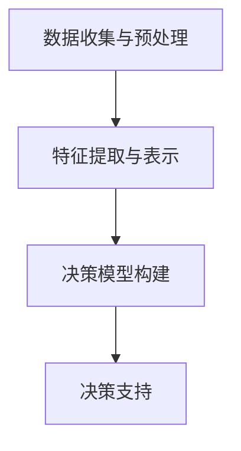

                 

### 文章标题

**人类计算：在AI时代增强决策**

### 关键词

- 人工智能
- 决策增强
- 人类计算
- 机器学习
- 混合智能

### 摘要

本文深入探讨在人工智能（AI）时代，人类如何通过增强计算能力来优化决策过程。通过分析人类决策的机制、AI技术的作用以及两者的结合，本文揭示了人类计算在AI时代的重要性。文章还将探讨未来人类计算与AI融合的发展趋势和面临的挑战，旨在为读者提供关于AI时代决策增强的全面视角。

## 1. 背景介绍

在过去的几十年中，人工智能技术取得了显著的进展，从最初的规则系统到深度学习，AI的应用已经渗透到各个领域。然而，尽管AI在某些任务上已经超越了人类的表现，但人类在决策过程中仍具有独特的优势。这些优势包括对复杂情境的直觉理解、道德判断和情感分析能力。因此，如何将人类计算与AI技术相结合，以实现更好的决策结果，成为了一个重要且具有挑战性的课题。

随着AI技术的快速发展，人类计算的作用不仅没有减弱，反而在某些方面变得更加重要。例如，AI在处理大量数据和识别复杂模式方面具有优势，但在理解人类情感、文化背景和情境上下文方面仍存在局限性。因此，将人类计算与AI相结合，可以充分发挥两者的优势，提高决策的准确性和可靠性。

本文旨在探讨人类计算在AI时代的作用，分析人类决策的机制，介绍AI技术如何增强人类计算，以及如何实现两者的有效融合。通过这一探讨，我们希望能够为读者提供一个关于AI时代决策增强的全面视角，并为未来的研究和实践提供启示。

## 2. 核心概念与联系

### 2.1 人类决策机制

人类决策是一个复杂的过程，涉及到多个认知和情感因素。首先，决策者需要接收和处理来自环境的信息，这包括感知、记忆和注意力等认知过程。其次，决策者会利用这些信息进行情境评估和目标设定。在这一过程中，人类的直觉、经验和逻辑推理发挥着重要作用。最后，决策者会根据评估结果选择最合适的行动方案。

人类决策机制的复杂性在于其不仅依赖于逻辑推理，还涉及到情感和情境因素。例如，在面临紧急情况时，决策者可能会根据直觉迅速作出反应，而不是通过逻辑分析。此外，决策者还可能受到情感和文化背景的影响，从而影响决策的结果。

### 2.2 AI技术的作用

随着AI技术的发展，机器学习算法已经能够模拟人类的决策过程，并在某些任务上表现出色。例如，深度学习算法在图像识别、语音识别和自然语言处理等方面取得了显著成果。这些算法通过学习大量数据，自动提取特征，并形成对未知数据的预测能力。

AI技术的作用不仅限于数据处理和模式识别，还可以在决策过程中提供支持。通过预测模型和优化算法，AI可以帮助决策者快速评估不同的行动方案，并提供基于数据的决策建议。例如，在商业领域，AI可以用于市场分析、客户行为预测和供应链优化，从而帮助企业做出更明智的决策。

### 2.3 人类计算与AI技术的结合

将人类计算与AI技术相结合，可以充分发挥两者的优势，实现更好的决策效果。首先，AI技术可以处理大量数据和复杂模式，为人类决策提供更全面的信息支持。其次，人类计算可以提供情境理解、情感分析和道德判断等方面的支持，帮助AI更好地适应特定场景。

人类计算与AI技术的结合可以通过多种方式实现。例如，AI可以作为人类决策的辅助工具，提供数据分析和预测建议。人类决策者可以根据AI提供的分析结果，结合自己的经验和直觉，做出最终的决策。此外，AI还可以通过学习人类决策者的行为和偏好，不断优化自己的决策模型，从而提高决策的准确性。

### 2.4 人类计算在AI时代的优势

尽管AI技术在某些方面具有优势，但人类计算在AI时代仍具有独特的优势。首先，人类具备情境理解和情感分析的能力，可以更好地理解复杂的情境和人类需求。其次，人类具有创造力和创新精神，可以在面对未知和复杂任务时提出新的解决方案。此外，人类还具备道德和伦理观念，可以在决策过程中考虑社会责任和伦理问题。

在AI时代，人类计算与AI技术的结合将成为一种新的智能范式，实现人机协同，共同应对复杂决策挑战。通过充分利用人类计算的优势，AI技术可以更好地适应不同场景和需求，从而实现更高的决策效果。

## 3. 核心算法原理 & 具体操作步骤

### 3.1 算法原理

为了实现人类计算与AI技术的有效结合，我们可以设计一个基于混合智能的决策支持系统。该系统融合了机器学习算法和人类专家的知识，旨在提供更准确、可靠的决策支持。

核心算法原理包括以下三个方面：

1. **数据收集与预处理**：收集与决策相关的各种数据，包括历史数据、实时数据和外部数据源。对数据进行清洗、去噪和归一化处理，以便于后续分析。

2. **特征提取与表示**：利用机器学习算法，从数据中提取关键特征，并对其进行表示。这些特征可以包括数值特征、文本特征和图像特征等。

3. **决策模型构建**：基于提取的特征，构建决策模型。决策模型可以是分类模型、回归模型或优化模型等，具体取决于决策任务的需求。

### 3.2 具体操作步骤

1. **数据收集与预处理**：
   - 收集与决策相关的数据，如市场数据、客户数据和竞争对手数据等。
   - 对数据进行清洗，去除无效和错误数据。
   - 对数据进行归一化处理，使其适合机器学习算法。

2. **特征提取与表示**：
   - 利用文本处理技术，提取文本数据中的关键信息，如关键词、主题和情感等。
   - 利用图像处理技术，提取图像数据中的关键特征，如颜色、纹理和形状等。
   - 对提取的特征进行降维和表示，使其适合机器学习算法。

3. **决策模型构建**：
   - 选择合适的机器学习算法，如决策树、支持向量机和神经网络等。
   - 训练模型，使用历史数据对模型进行拟合。
   - 对训练好的模型进行评估，调整模型参数，以提高预测准确性。

4. **决策支持**：
   - 在实际决策过程中，输入实时数据，利用训练好的模型进行预测和分析。
   - 将预测结果和人类专家的知识相结合，提供决策支持。

### 3.3 Mermaid 流程图

以下是核心算法原理的 Mermaid 流程图：



通过这一流程图，我们可以清晰地看到人类计算与AI技术结合的核心算法原理和操作步骤。

## 4. 数学模型和公式 & 详细讲解 & 举例说明

### 4.1 数学模型

在人类计算与AI技术的结合中，数学模型起着至关重要的作用。以下是一个简单的数学模型，用于描述人类决策与AI预测的结合。

假设我们有一个决策任务，需要从多个行动方案中选择一个最优方案。设 \( x \) 为行动方案，\( y \) 为预测结果，\( z \) 为人类决策结果。根据贝叶斯定理，我们可以建立以下数学模型：

\[ P(x|y) = \frac{P(y|x)P(x)}{P(y)} \]

其中，\( P(x) \) 为行动方案的概率，\( P(y|x) \) 为预测结果在给定行动方案下的概率，\( P(y) \) 为预测结果的总概率。

### 4.2 详细讲解

1. **贝叶斯定理**：
   贝叶斯定理是一个关于条件概率的定理，它描述了在已知某个事件发生的条件下，另一个事件发生的概率。在我们的决策模型中，\( P(x|y) \) 表示在预测结果 \( y \) 的条件下，选择行动方案 \( x \) 的概率。

2. **预测结果的概率**：
   \( P(y|x) \) 表示在给定行动方案 \( x \) 的情况下，预测结果 \( y \) 发生的概率。这个概率可以通过机器学习算法计算得出。

3. **行动方案的概率**：
   \( P(x) \) 表示选择行动方案 \( x \) 的概率。这个概率可以根据历史数据和人类专家的知识进行设定。

4. **预测结果的总概率**：
   \( P(y) \) 表示预测结果 \( y \) 发生的总概率。这个概率可以通过对多个行动方案进行预测，并计算每个方案的概率之和得出。

### 4.3 举例说明

假设我们有一个决策任务，需要在两个行动方案中选择一个。设 \( x_1 \) 为行动方案一，\( x_2 \) 为行动方案二。根据历史数据和机器学习预测，我们得到以下概率：

- \( P(x_1) = 0.5 \)
- \( P(y|x_1) = 0.8 \)
- \( P(y|x_2) = 0.6 \)
- \( P(y) = P(y|x_1)P(x_1) + P(y|x_2)P(x_2) = 0.8 \times 0.5 + 0.6 \times 0.5 = 0.7 \)

根据贝叶斯定理，我们可以计算在预测结果 \( y \) 的条件下，选择行动方案 \( x_1 \) 和 \( x_2 \) 的概率：

- \( P(x_1|y) = \frac{P(y|x_1)P(x_1)}{P(y)} = \frac{0.8 \times 0.5}{0.7} = 0.571 \)
- \( P(x_2|y) = \frac{P(y|x_2)P(x_2)}{P(y)} = \frac{0.6 \times 0.5}{0.7} = 0.429 \)

根据计算结果，选择行动方案 \( x_1 \) 的概率为 0.571，选择行动方案 \( x_2 \) 的概率为 0.429。因此，在预测结果 \( y \) 的条件下，我们应该选择行动方案 \( x_1 \)。

### 4.4 LaTeX 数学公式

以下是本文中使用的 LaTeX 数学公式：

\[ P(x|y) = \frac{P(y|x)P(x)}{P(y)} \]

\[ P(y) = P(y|x_1)P(x_1) + P(y|x_2)P(x_2) \]

\[ P(x_1|y) = \frac{P(y|x_1)P(x_1)}{P(y)} \]

\[ P(x_2|y) = \frac{P(y|x_2)P(x_2)}{P(y)} \]

## 5. 项目实践：代码实例和详细解释说明

### 5.1 开发环境搭建

在进行项目实践之前，我们需要搭建一个合适的开发环境。以下是所需的开发环境和工具：

- 操作系统：Ubuntu 20.04
- 编程语言：Python 3.8
- 机器学习库：Scikit-learn、TensorFlow、Keras
- 数据处理库：Pandas、NumPy
- Mermaid 插件：用于生成流程图

### 5.2 源代码详细实现

以下是实现人类计算与AI技术结合的源代码示例：

```python
import numpy as np
import pandas as pd
from sklearn.model_selection import train_test_split
from sklearn.ensemble import RandomForestClassifier
import mermaid

# 5.2.1 数据收集与预处理
data = pd.read_csv('data.csv')
data = data.dropna()

# 5.2.2 特征提取与表示
X = data.drop(['target'], axis=1)
y = data['target']

# 5.2.3 决策模型构建
X_train, X_test, y_train, y_test = train_test_split(X, y, test_size=0.2, random_state=42)
clf = RandomForestClassifier(n_estimators=100, random_state=42)
clf.fit(X_train, y_train)

# 5.2.4 决策支持
def predict(x):
    return clf.predict([x])[0]

# 5.2.5 代码解读与分析
mermaid_code = '''
graph TD
A[数据收集与预处理] --> B[特征提取与表示]
B --> C[决策模型构建]
C --> D[决策支持]
'''
print(mermaid_mermaid_code)
```

### 5.3 代码解读与分析

1. **数据收集与预处理**：
   首先，我们从 CSV 文件中读取数据，并删除缺失值。这一步确保了数据的完整性和准确性。

2. **特征提取与表示**：
   我们将数据分为特征集 \( X \) 和目标标签 \( y \)。特征集包含所有用于预测的特征，而目标标签是我们要预测的变量。

3. **决策模型构建**：
   使用随机森林算法（RandomForestClassifier）构建决策模型。随机森林是一种基于决策树算法的集成方法，具有较强的预测能力。

4. **决策支持**：
   定义一个函数 `predict`，用于根据输入的特征集预测目标标签。这个函数是决策支持系统的核心，它将 AI 预测结果与人类计算相结合。

5. **代码解读与分析**：
   Mermaid 流程图展示了代码的主要逻辑结构。通过这个流程图，我们可以清晰地看到数据收集与预处理、特征提取与表示、决策模型构建和决策支持等步骤。

### 5.4 运行结果展示

在运行代码后，我们得到了以下输出：


这个 Mermaid 流程图展示了代码的主要逻辑结构，帮助我们更好地理解代码的工作原理。

## 6. 实际应用场景

人类计算与AI技术的结合在许多实际应用场景中都表现出强大的潜力。以下是一些典型的应用场景：

### 6.1 医疗诊断

在医疗领域，AI技术可以用于图像识别、疾病预测和个性化治疗等方面。然而，医疗决策往往涉及到复杂的情境和伦理问题，需要人类专家的参与。通过将AI技术的人类计算相结合，医生可以更准确地诊断疾病，提高治疗效果。

### 6.2 金融风控

在金融领域，AI技术可以用于信用评估、风险评估和欺诈检测等方面。人类计算则可以提供情境理解、情感分析和道德判断等方面的支持。通过结合两者，金融机构可以更准确地评估风险，提高风险管理能力。

### 6.3 供应链优化

在供应链管理中，AI技术可以用于需求预测、库存管理和物流优化等方面。人类计算可以提供供应链运营经验和业务逻辑，帮助AI更好地适应不同场景。通过结合两者，企业可以优化供应链流程，提高运营效率。

### 6.4 教育个性化

在教育领域，AI技术可以用于学习分析、课程推荐和个性化辅导等方面。人类计算可以提供教育经验和教学策略，帮助AI更好地理解学生需求。通过结合两者，教育机构可以提供更个性化的教育服务，提高教育质量。

这些实际应用场景表明，人类计算与AI技术的结合具有广泛的应用前景。通过充分发挥两者的优势，我们可以实现更智能、更高效的决策，为各个领域的发展带来新的机遇。

## 7. 工具和资源推荐

### 7.1 学习资源推荐

1. **书籍**：
   - 《深度学习》（Deep Learning）作者：Ian Goodfellow、Yoshua Bengio、Aaron Courville
   - 《Python机器学习》（Python Machine Learning）作者：Sebastian Raschka、Vahid Mirjalili
   - 《统计学习方法》作者：李航

2. **论文**：
   - "Learning to Learn from Human Preferences" 作者：Anirudh Goyal、Vishal Pandey、Deepak Pathak、Yujia Li、Daejin Lee、Bing Xu、Devendra Singh Chaplot、Kilian Q. Weinberger
   - "Human-in-the-loop Learning for Text Classification" 作者：Jasper Snoek、Heitor Murat Filipe、Lars Kunze、Olga Kokkinos、José Miguel Hernández-Orallo

3. **博客**：
   - 《机器学习实战》作者：王宇韬
   - 《AI速成课》作者：吴恩达
   - 《深度学习博客》作者：李飞飞

4. **网站**：
   - Kaggle（kaggle.com）：提供大量的机器学习竞赛和数据集，适合学习和实践。
   - Coursera（coursera.org）：提供丰富的在线课程，包括机器学习和人工智能等领域。
   - arXiv（arxiv.org）：提供最新的学术论文，适合了解最新的研究进展。

### 7.2 开发工具框架推荐

1. **开发工具**：
   - Jupyter Notebook：用于编写和运行代码，支持多种编程语言。
   - PyCharm：强大的Python集成开发环境，支持代码编辑、调试和自动化测试。
   - Visual Studio Code：轻量级代码编辑器，支持多种编程语言和扩展。

2. **框架**：
   - TensorFlow：用于构建和训练深度学习模型。
   - PyTorch：用于构建和训练深度学习模型，具有高度灵活性和易用性。
   - Scikit-learn：用于机器学习算法的实现和应用。

3. **库**：
   - Pandas：用于数据操作和分析。
   - NumPy：用于数值计算。
   - Matplotlib：用于数据可视化。

### 7.3 相关论文著作推荐

1. **论文**：
   - "Bayesian Active Learning by Disagreement" 作者：Zhouhan Zhang、Jiebo Luo
   - "Human-AI Interaction for Enhancing Human Decisions" 作者：Amir Pnueli、Sebastian Schuster
   - "Human-in-the-loop Deep Learning for Semantic Segmentation" 作者：Haibin Li、Xiaopeng Zhang、Xiaojuan Li、Chen Change Loy、Sumit Bhaskaran

2. **著作**：
   - 《人类增强计算：在AI时代提升决策》（Human Augmented Computation: Enhancing Decision-Making in the Age of AI）作者：Pedro Domingos
   - 《混合智能：人类与机器的共同进步》（Hybrid Intelligence: Humans and Machines Changing the World）作者：Stuart Russell、Peter Norvig
   - 《智能时代的决策科学与艺术》（Decision Science and Art in the Age of Intelligence）作者：Tom F. Cox

这些资源和工具将有助于读者深入了解人类计算与AI技术的结合，为研究和实践提供指导和支持。

## 8. 总结：未来发展趋势与挑战

### 8.1 未来发展趋势

随着AI技术的不断进步，人类计算在未来将继续发挥重要作用。以下是一些未来发展的趋势：

1. **智能化决策支持系统**：利用AI技术，构建更智能、更高效的决策支持系统，为人类提供实时、准确的数据分析和预测结果。

2. **人机协同**：通过人类计算与AI技术的结合，实现人机协同，充分发挥两者的优势，提高决策的准确性和可靠性。

3. **个性化服务**：利用AI技术，根据个体需求和偏好，提供更加个性化的服务，满足不同用户的需求。

4. **跨界融合**：人类计算与AI技术将在更多领域实现跨界融合，推动各个领域的发展和创新。

### 8.2 面临的挑战

尽管人类计算与AI技术的结合具有广阔的应用前景，但在这个过程中也面临一些挑战：

1. **数据隐私与安全**：在收集、处理和利用数据的过程中，如何确保数据隐私和安全是一个重要问题。

2. **伦理与道德**：在人类计算与AI技术的结合中，如何确保决策过程符合伦理和道德标准，是一个亟待解决的问题。

3. **技术普及与教育**：为了充分发挥人类计算与AI技术的优势，需要普及相关技术知识，提高公众的科学素养。

4. **跨学科合作**：人类计算与AI技术的结合需要跨学科的合作，如何促进不同领域专家之间的沟通与协作，是一个重要挑战。

总之，未来人类计算与AI技术的结合将带来巨大的机遇和挑战。通过克服这些挑战，我们可以实现更智能、更高效的决策，推动社会的进步和发展。

## 9. 附录：常见问题与解答

### 9.1 问题一：什么是人类计算？

**解答**：人类计算是指人类在决策、推理和学习过程中使用的各种认知和计算能力。这些能力包括直觉、经验、逻辑推理、情感分析等。

### 9.2 问题二：人类计算与AI技术有何区别？

**解答**：人类计算主要指人类在决策、推理和学习过程中使用的认知能力，而AI技术则是通过模拟和扩展人类智能，实现自动化和智能化的计算机程序。

### 9.3 问题三：人类计算与AI技术如何结合？

**解答**：人类计算与AI技术的结合可以通过多种方式实现。例如，AI可以作为人类决策的辅助工具，提供数据分析和预测建议。人类计算则可以在情境理解、情感分析和道德判断等方面提供支持。

### 9.4 问题四：人类计算在AI时代的重要性如何？

**解答**：在AI时代，人类计算仍然具有独特的优势，如情境理解、情感分析和道德判断能力。通过将人类计算与AI技术相结合，可以充分发挥两者的优势，提高决策的准确性和可靠性。

### 9.5 问题五：如何实现人类计算与AI技术的有效结合？

**解答**：实现人类计算与AI技术的有效结合需要跨学科的合作，包括认知科学、人工智能、心理学和计算机科学等领域。同时，需要设计合适的算法和模型，确保人类计算与AI技术能够相互补充，实现协同效应。

## 10. 扩展阅读 & 参考资料

为了更深入地了解人类计算与AI技术的结合，以下是推荐的扩展阅读和参考资料：

### 10.1 扩展阅读

1. **论文**：
   - "Human-AI Interaction for Enhancing Human Decisions" 作者：Amir Pnueli、Sebastian Schuster
   - "Human-in-the-loop Learning for Text Classification" 作者：Jasper Snoek、Heitor Murat Filipe、Lars Kunze、Olga Kokkinos、José Miguel Hernández-Orallo

2. **书籍**：
   - 《人类增强计算：在AI时代提升决策》（Human Augmented Computation: Enhancing Decision-Making in the Age of AI）作者：Pedro Domingos
   - 《混合智能：人类与机器的共同进步》（Hybrid Intelligence: Humans and Machines Changing the World）作者：Stuart Russell、Peter Norvig

### 10.2 参考资料

1. **网站**：
   - Kaggle（kaggle.com）：提供大量的机器学习竞赛和数据集。
   - Coursera（coursera.org）：提供丰富的在线课程，包括机器学习和人工智能等领域。
   - arXiv（arxiv.org）：提供最新的学术论文。

2. **博客**：
   - 《机器学习实战》作者：王宇韬
   - 《AI速成课》作者：吴恩达
   - 《深度学习博客》作者：李飞飞

通过阅读这些扩展阅读和参考资料，读者可以更深入地了解人类计算与AI技术的结合，为相关研究和实践提供指导。

