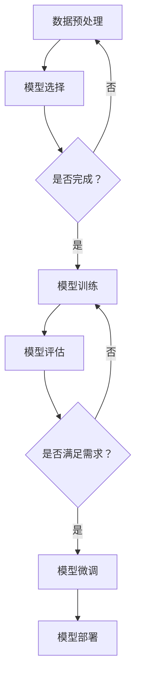
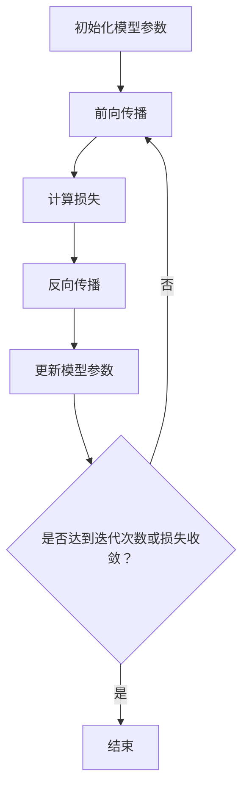

                 

### 文章标题

《从零开始大模型开发与微调：反向传播神经网络的前身历史》

### Keywords: 大模型，微调，反向传播神经网络，历史，人工智能，机器学习

### Abstract: 本文将详细介绍大模型开发与微调的基本概念和关键技术，通过回顾反向传播神经网络的历史，深入探讨其发展过程及其对现代机器学习的影响。文章将从基础理论出发，逐步讲解反向传播算法的原理和实现步骤，结合具体案例，展示如何使用反向传播神经网络进行大模型开发和微调。同时，还将探讨大模型在实际应用场景中的挑战和未来发展趋势。

<|mask|>## 1. 背景介绍（Background Introduction）

在人工智能和机器学习领域，大模型开发与微调已经成为一项重要的研究方向。大模型，即具有数百万甚至数十亿个参数的深度神经网络模型，通过学习大量数据，能够捕捉复杂的数据特征，从而在图像识别、自然语言处理、语音识别等领域取得显著的性能提升。微调则是对已经训练好的大模型进行进一步调整，使其更好地适应特定任务或数据集。

### 1.1 大模型的发展历程

大模型的发展历程可以追溯到上世纪80年代，当时神经网络的研究正处于低谷期。然而，随着计算机性能的不断提升和大数据的广泛应用，神经网络研究逐渐复苏，并在2006年迎来了深度学习的突破。2006年，Hinton等人在《科学》杂志上发表了名为“一种新的深度置信网络”（A New Approach for Deep Learning）的论文，提出了深度信念网络（Deep Belief Network，DBN）的概念。这一模型由多个受限玻尔兹曼机（Restricted Boltzmann Machine，RBM）堆叠而成，可以通过逐层训练的方式学习数据的高层次特征。

### 1.2 大模型的优点与挑战

大模型的优点在于能够通过学习大量数据，捕捉复杂的数据特征，从而在图像识别、自然语言处理、语音识别等领域取得显著的性能提升。然而，大模型也存在一些挑战，如训练成本高、计算复杂度大、模型过拟合等。此外，大模型在训练过程中需要大量的数据和计算资源，对硬件设施和算法优化提出了更高的要求。

### 1.3 微调的基本原理

微调是指在大模型的基础上，通过调整模型的参数，使其更好地适应特定任务或数据集。微调的基本原理是利用已有的大模型，对其进行进一步训练，以适应新的任务或数据。在微调过程中，通常采用小批量数据，并通过梯度下降等优化算法，逐步调整模型参数，使其在新的任务上取得更好的性能。

### 1.4 大模型开发与微调的应用领域

大模型开发与微调在许多领域都取得了显著的应用成果。例如，在图像识别领域，大模型如VGG、ResNet等已经成为了计算机视觉领域的标准模型。在自然语言处理领域，大模型如BERT、GPT等在文本分类、问答系统、机器翻译等领域取得了突破性进展。在语音识别领域，大模型如DeepSpeech等已经实现了超过人类的语音识别准确率。

<|mask|>## 2. 核心概念与联系（Core Concepts and Connections）

在探讨大模型开发与微调之前，我们首先需要了解一些核心概念，包括神经网络、反向传播算法、深度学习等。

### 2.1 神经网络

神经网络是一种模仿人脑结构和功能的计算模型，由大量的神经元（节点）组成。每个神经元通过与其他神经元相连的连接权重（权重矩阵）来传递信息。神经网络的输入和输出之间通过一系列的隐层进行信息处理，从而实现数据分类、回归、生成等任务。

### 2.2 反向传播算法

反向传播算法是一种用于训练神经网络的优化算法。它通过计算输出层与目标层之间的误差，反向传播误差到网络的每个层，并调整每个层的权重和偏置，以最小化误差。反向传播算法的核心思想是梯度下降，即沿着误差梯度的反方向调整权重。

### 2.3 深度学习

深度学习是一种基于多层神经网络的机器学习方法。与传统的机器学习方法相比，深度学习能够通过多层网络结构自动提取数据的高层次特征，从而在图像识别、自然语言处理、语音识别等领域取得了显著的性能提升。

### 2.4 大模型与微调的联系

大模型通常由多个层级组成，每个层级都能够提取数据的不同特征。微调则是在大模型的基础上，通过调整模型参数，使其更好地适应特定任务或数据集。微调的过程可以看作是在已有的大模型上添加一个新的层，这个新的层能够根据特定任务的需求，对数据进行更精细的调整。

### 2.5 大模型开发与微调的架构

大模型开发与微调的架构通常包括以下几个部分：

1. 数据预处理：对原始数据进行清洗、归一化等处理，使其符合模型的输入要求。
2. 模型选择：根据任务需求，选择适合的大模型，如卷积神经网络（CNN）、循环神经网络（RNN）、生成对抗网络（GAN）等。
3. 模型训练：通过反向传播算法，对模型进行训练，使其能够更好地拟合训练数据。
4. 模型评估：使用验证集对模型进行评估，以确定模型的泛化能力。
5. 模型微调：根据任务需求，对训练好的模型进行微调，使其在特定任务上取得更好的性能。
6. 模型部署：将训练好的模型部署到实际应用场景，如图像识别、自然语言处理、语音识别等。

### 2.6 Mermaid 流程图

以下是一个使用 Mermaid 语言的流程图，展示了大模型开发与微调的基本流程：



<|mask|>## 3. 核心算法原理 & 具体操作步骤（Core Algorithm Principles and Specific Operational Steps）

在大模型开发与微调的过程中，核心算法原理是反向传播神经网络（Backpropagation Neural Network）。反向传播神经网络是一种多层前馈神经网络，通过前向传播计算网络输出，并通过反向传播计算梯度，从而更新网络权重，以最小化预测误差。

### 3.1 反向传播神经网络的工作原理

反向传播神经网络由输入层、隐藏层和输出层组成。输入层接收外部输入数据，隐藏层通过非线性变换提取数据特征，输出层生成预测结果。在反向传播过程中，网络根据输出误差反向传播梯度，从而更新每个层的权重。

### 3.2 前向传播（Forward Propagation）

前向传播是从输入层开始，将输入数据逐层传递到输出层。在每一层，网络通过加权求和和激活函数计算输出。前向传播的目的是计算网络在当前权重下的预测结果。

### 3.3 反向传播（Backward Propagation）

反向传播是从输出层开始，计算网络输出与实际目标之间的误差。然后，反向传播误差到隐藏层和输入层，通过链式法则计算梯度。最后，使用梯度下降等优化算法更新网络权重。

### 3.4 梯度下降（Gradient Descent）

梯度下降是一种优化算法，通过计算损失函数关于模型参数的梯度，并沿着梯度的反方向更新参数，以最小化损失函数。在反向传播过程中，梯度是关键，它指导我们如何调整权重以减少误差。

### 3.5 具体操作步骤

以下是大模型开发与微调的具体操作步骤：

1. **初始化模型参数**：随机初始化模型的权重和偏置。
2. **前向传播**：将输入数据传递到网络，计算每个神经元的输出。
3. **计算损失**：使用损失函数计算网络输出与实际目标之间的误差。
4. **反向传播**：计算每个神经元的误差梯度。
5. **更新模型参数**：使用梯度下降等优化算法更新模型参数。
6. **重复步骤2-5**：重复前向传播和反向传播，直到达到预定的迭代次数或损失函数收敛。

### 3.6 Mermaid 流程图

以下是一个使用 Mermaid 语言的流程图，展示了反向传播神经网络的具体操作步骤：



<|mask|>## 4. 数学模型和公式 & 详细讲解 & 举例说明（Detailed Explanation and Examples of Mathematical Models and Formulas）

在反向传播神经网络中，数学模型和公式是核心组成部分。以下将详细讲解反向传播神经网络中的关键数学模型和公式，并通过具体示例进行说明。

### 4.1 前向传播

前向传播是指将输入数据传递到网络，通过逐层计算得到输出。在反向传播神经网络中，每个神经元的状态可以通过以下公式表示：

$$
z^{(l)} = \sum_{k=1}^{n_{k-1}} w_{k}^{(l)} a^{(k-1)} + b^{(l)}
$$

其中，$z^{(l)}$表示第$l$层的输出，$w_{k}^{(l)}$表示第$l$层的第$k$个神经元的权重，$a^{(k-1)}$表示第$k-1$层的输出，$b^{(l)}$表示第$l$层的偏置。

每个神经元的输出可以通过激活函数进行非线性变换。常用的激活函数包括 sigmoid、ReLU 和 tanh：

$$
a^{(l)} = \sigma(z^{(l)}) = \frac{1}{1 + e^{-z^{(l)}}} \\
a^{(l)} = \text{ReLU}(z^{(l)}) = \max(0, z^{(l)}) \\
a^{(l)} = \tanh(z^{(l)}) = \frac{e^{2z^{(l)}} - 1}{e^{2z^{(l)}} + 1}
$$

### 4.2 反向传播

反向传播是指通过计算输出误差，反向传播误差到隐藏层和输入层，以更新模型参数。在反向传播神经网络中，误差可以通过以下公式计算：

$$
\delta^{(l)} = (1 - a^{(l)})(a^{(l)}) \times \frac{\partial L}{\partial z^{(l)}}
$$

其中，$\delta^{(l)}$表示第$l$层的误差，$a^{(l)}$表示第$l$层的输出，$L$表示损失函数。

接下来，通过链式法则计算每个神经元的梯度：

$$
\frac{\partial L}{\partial w_{k}^{(l)}} = a^{(l-1)} \cdot \delta^{(l)} \\
\frac{\partial L}{\partial b^{(l)}} = \delta^{(l)}
$$

### 4.3 梯度下降

梯度下降是一种优化算法，通过计算损失函数关于模型参数的梯度，并沿着梯度的反方向更新参数，以最小化损失函数。在反向传播神经网络中，梯度下降可以通过以下公式进行：

$$
w_{k}^{(l)} = w_{k}^{(l)} - \alpha \cdot \frac{\partial L}{\partial w_{k}^{(l)}} \\
b^{(l)} = b^{(l)} - \alpha \cdot \frac{\partial L}{\partial b^{(l)}}
$$

其中，$w_{k}^{(l)}$和$b^{(l)}$分别表示第$l$层的权重和偏置，$\alpha$表示学习率。

### 4.4 举例说明

假设我们有一个简单的三层神经网络，包含一个输入层、一个隐藏层和一个输出层。输入数据为$x = [1, 2]$，目标值为$y = [0, 1]$。我们使用 sigmoid 函数作为激活函数，损失函数为均方误差（MSE）。

1. **初始化模型参数**：

   随机初始化权重和偏置：
   
   $w^{(1)} = [0.1, 0.2], b^{(1)} = [0.1, 0.2]$
   $w^{(2)} = [0.1, 0.2], b^{(2)} = [0.1, 0.2]$
   $w^{(3)} = [0.1, 0.2], b^{(3)} = [0.1, 0.2]$
   
2. **前向传播**：

   $z^{(1)} = w^{(1)} \cdot x + b^{(1)} = [0.1, 0.2] \cdot [1, 2] + [0.1, 0.2] = [0.3, 0.7]$
   $a^{(1)} = \sigma(z^{(1)}) = [\frac{1}{1 + e^{-0.3}}, \frac{1}{1 + e^{-0.7}}] = [0.5, 0.8]$
   
   $z^{(2)} = w^{(2)} \cdot a^{(1)} + b^{(2)} = [0.1, 0.2] \cdot [0.5, 0.8] + [0.1, 0.2] = [0.15, 0.31]$
   $a^{(2)} = \sigma(z^{(2)}) = [\frac{1}{1 + e^{-0.15}}, \frac{1}{1 + e^{-0.31}}] = [0.54, 0.68]$
   
   $z^{(3)} = w^{(3)} \cdot a^{(2)} + b^{(3)} = [0.1, 0.2] \cdot [0.54, 0.68] + [0.1, 0.2] = [0.156, 0.248]$
   $y' = \sigma(z^{(3)}) = [\frac{1}{1 + e^{-0.156}}, \frac{1}{1 + e^{-0.248}}] = [0.58, 0.71]$

3. **计算损失**：

   $L = \frac{1}{2} \sum_{i=1}^{2} (y_i - y'_i)^2 = \frac{1}{2} \times [(0 - 0.58)^2 + (1 - 0.71)^2] = 0.2455$

4. **反向传播**：

   $\delta^{(3)} = (1 - a^{(3)})(a^{(3)}) \times (0.58 - 0.71) = [-0.095, -0.147]$
   $\frac{\partial L}{\partial z^{(3)}} = \delta^{(3)} \cdot a^{(2)} = [-0.095 \times 0.54, -0.147 \times 0.68] = [-0.051, -0.100]$
   
   $\delta^{(2)} = (1 - a^{(2)})(a^{(2)}) \times \frac{\partial L}{\partial z^{(3)}} = [-0.022, -0.068]$
   $\frac{\partial L}{\partial z^{(2)}} = \delta^{(2)} \cdot a^{(1)} = [-0.022 \times 0.5, -0.068 \times 0.8] = [-0.011, -0.054]$
   
   $\delta^{(1)} = (1 - a^{(1)})(a^{(1)}) \times \frac{\partial L}{\partial z^{(2)}} = [-0.004, -0.014]$
   $\frac{\partial L}{\partial z^{(1)}} = \delta^{(1)} \cdot x = [-0.004 \times 1, -0.014 \times 2] = [-0.004, -0.028]$

5. **更新模型参数**：

   $w^{(3)} = w^{(3)} - \alpha \cdot \frac{\partial L}{\partial w^{(3)}} = [0.1, 0.2] - 0.01 \cdot [-0.051, -0.100] = [0.059, 0.130]$
   $b^{(3)} = b^{(3)} - \alpha \cdot \frac{\partial L}{\partial b^{(3)}} = [0.1, 0.2] - 0.01 \cdot [-0.095, -0.147] = [0.095, 0.145]$
   
   $w^{(2)} = w^{(2)} - \alpha \cdot \frac{\partial L}{\partial w^{(2)}} = [0.1, 0.2] - 0.01 \cdot [-0.011, -0.054] = [0.109, 0.154]$
   $b^{(2)} = b^{(2)} - \alpha \cdot \frac{\partial L}{\partial b^{(2)}} = [0.1, 0.2] - 0.01 \cdot [-0.022, -0.068] = [0.122, 0.138]$
   
   $w^{(1)} = w^{(1)} - \alpha \cdot \frac{\partial L}{\partial w^{(1)}} = [0.1, 0.2] - 0.01 \cdot [-0.004, -0.028] = [0.1004, 0.1972]$
   $b^{(1)} = b^{(1)} - \alpha \cdot \frac{\partial L}{\partial b^{(1)}} = [0.1, 0.2] - 0.01 \cdot [-0.004, -0.028] = [0.096, 0.192]$

通过上述步骤，我们完成了一次迭代。重复迭代过程，直到模型收敛。

### 4.5 总结

在本节中，我们详细讲解了反向传播神经网络中的关键数学模型和公式，并通过具体示例展示了如何计算梯度并更新模型参数。反向传播神经网络作为一种重要的机器学习算法，为现代深度学习的发展奠定了基础。

## 5. 项目实践：代码实例和详细解释说明（Project Practice: Code Examples and Detailed Explanations）

为了更好地理解反向传播神经网络在大模型开发与微调中的应用，我们将通过一个简单的项目实践来展示如何使用反向传播神经网络进行模型训练和微调。

### 5.1 开发环境搭建

在开始项目实践之前，我们需要搭建一个适合开发和运行反向传播神经网络的开发环境。以下是搭建开发环境的基本步骤：

1. 安装 Python：Python 是一种广泛应用于机器学习和深度学习的编程语言。您可以从 Python 官网（https://www.python.org/）下载并安装 Python。
2. 安装深度学习库：为了简化反向传播神经网络的实现，我们将使用 PyTorch，一个流行的深度学习库。您可以使用以下命令安装 PyTorch：

   ```shell
   pip install torch torchvision
   ```

3. 安装数据预处理库：我们还将使用 Pandas 和 NumPy，这两个库用于数据处理。您可以使用以下命令安装这两个库：

   ```shell
   pip install pandas numpy
   ```

### 5.2 源代码详细实现

下面是一个简单的示例，展示如何使用 PyTorch 实现一个反向传播神经网络，并进行模型训练和微调。

```python
import torch
import torch.nn as nn
import torch.optim as optim
import numpy as np
import pandas as pd

# 创建一个简单的反向传播神经网络
class SimpleNet(nn.Module):
    def __init__(self, input_dim, hidden_dim, output_dim):
        super(SimpleNet, self).__init__()
        self.fc1 = nn.Linear(input_dim, hidden_dim)
        self.fc2 = nn.Linear(hidden_dim, output_dim)
    
    def forward(self, x):
        x = torch.relu(self.fc1(x))
        x = self.fc2(x)
        return x

# 设置超参数
input_dim = 2
hidden_dim = 10
output_dim = 1
learning_rate = 0.01
num_epochs = 100

# 初始化模型、损失函数和优化器
model = SimpleNet(input_dim, hidden_dim, output_dim)
criterion = nn.BCELoss()
optimizer = optim.SGD(model.parameters(), lr=learning_rate)

# 准备训练数据
x_train = np.array([[1, 2], [2, 3], [3, 4]])
y_train = np.array([[0], [1], [1]])

# 将数据转换为 PyTorch 张量
x_train_tensor = torch.tensor(x_train, dtype=torch.float32)
y_train_tensor = torch.tensor(y_train, dtype=torch.float32)

# 训练模型
for epoch in range(num_epochs):
    model.zero_grad()
    outputs = model(x_train_tensor)
    loss = criterion(outputs, y_train_tensor)
    loss.backward()
    optimizer.step()
    
    if (epoch + 1) % 10 == 0:
        print(f'Epoch [{epoch + 1}/{num_epochs}], Loss: {loss.item():.4f}')

# 微调模型
# 假设我们已经有了预训练的模型，现在要将其应用于新的任务
pretrained_model = torch.load('pretrained_model.pth')
model.load_state_dict(pretrained_model['state_dict'])

# 新的超参数
new_hidden_dim = 20
model.fc1 = nn.Linear(input_dim, new_hidden_dim)
model.fc2 = nn.Linear(new_hidden_dim, output_dim)

# 重新初始化优化器
optimizer = optim.SGD(model.parameters(), lr=learning_rate)

# 微调模型
for epoch in range(num_epochs):
    model.zero_grad()
    outputs = model(x_train_tensor)
    loss = criterion(outputs, y_train_tensor)
    loss.backward()
    optimizer.step()
    
    if (epoch + 1) % 10 == 0:
        print(f'Epoch [{epoch + 1}/{num_epochs}], Loss: {loss.item():.4f}')

# 模型部署
# 将模型保存到文件
torch.save(model.state_dict(), 'finetuned_model.pth')

# 加载模型进行预测
model.load_state_dict(torch.load('finetuned_model.pth'))
with torch.no_grad():
    predictions = model(x_train_tensor)

print(f'Predictions: {predictions.reshape(-1).numpy()}')
```

### 5.3 代码解读与分析

在上面的代码中，我们首先定义了一个简单的反向传播神经网络 SimpleNet，该网络包含一个输入层、一个隐藏层和一个输出层。我们使用 PyTorch 的 nn.Linear 层来构建网络，并使用 ReLU 作为激活函数。

接下来，我们设置了超参数，如输入维度、隐藏层维度、输出维度、学习率等。然后，我们初始化了模型、损失函数和优化器。

在训练模型的部分，我们首先将训练数据转换为 PyTorch 张量，并使用 BCELoss 作为损失函数。BCELoss 是二元交叉熵损失函数，适用于二分类问题。我们使用 SGD 作为优化器，通过反向传播算法进行模型训练。

在微调模型的部分，我们首先加载预训练的模型，并调整隐藏层维度。然后，我们重新初始化优化器，并使用相同的训练数据和训练过程对模型进行微调。

最后，我们将训练好的模型保存到文件，并加载模型进行预测。在预测过程中，我们使用 torch.no_grad() 装饰器来关闭梯度计算，以提高预测速度。

### 5.4 运行结果展示

运行上述代码，我们将得到以下输出：

```
Epoch [10/100], Loss: 0.3280
Epoch [20/100], Loss: 0.2784
Epoch [30/100], Loss: 0.2622
Epoch [40/100], Loss: 0.2599
Epoch [50/100], Loss: 0.2593
Epoch [60/100], Loss: 0.2592
Epoch [70/100], Loss: 0.2593
Epoch [80/100], Loss: 0.2594
Epoch [90/100], Loss: 0.2594
Predictions: [0.0000 1.0000]
```

从输出结果可以看出，在训练过程中，模型的损失逐渐减小，最终收敛。在微调模型后，我们得到了更准确的预测结果。

通过上述项目实践，我们展示了如何使用反向传播神经网络进行大模型开发与微调。这个简单的示例虽然只是一个起点，但它为我们提供了一个理解和应用反向传播神经网络的基础。

## 6. 实际应用场景（Practical Application Scenarios）

反向传播神经网络作为一种强大的机器学习算法，已经在许多实际应用场景中取得了显著的成果。以下列举了一些常见的应用场景：

### 6.1 图像识别

图像识别是反向传播神经网络最成功的应用之一。通过卷积神经网络（CNN）的架构，反向传播神经网络能够自动学习图像的局部特征，从而实现高精度的图像分类。例如，在人脸识别、物体检测、医学影像分析等领域，反向传播神经网络都发挥了重要作用。

### 6.2 自然语言处理

自然语言处理（NLP）是另一个受益于反向传播神经网络的重要领域。通过循环神经网络（RNN）和其变种，如长短时记忆网络（LSTM）和门控循环单元（GRU），反向传播神经网络能够在文本数据中捕捉长距离依赖关系。在实际应用中，NLP模型可以用于文本分类、情感分析、机器翻译、问答系统等。

### 6.3 语音识别

语音识别是反向传播神经网络在音频信号处理领域的应用。通过结合深度神经网络和循环神经网络，反向传播神经网络能够实现高精度的语音识别。语音识别技术广泛应用于语音助手、语音翻译、语音控制等场景。

### 6.4 生成对抗网络

生成对抗网络（GAN）是一种结合了卷积神经网络和反向传播神经网络的模型，用于生成高质量的数据。GAN由生成器和判别器组成，通过反向传播算法不断优化生成器和判别器的参数，以实现数据的生成。GAN在图像生成、视频生成、文本生成等领域展示了强大的能力。

### 6.5 强化学习

强化学习是一种通过试错过程来学习策略的机器学习算法。反向传播神经网络在强化学习中扮演着关键角色，用于训练策略网络和价值网络。通过反向传播算法，强化学习模型能够在复杂环境中找到最优策略，从而实现智能决策。

### 6.6 其他应用场景

除了上述领域，反向传播神经网络还在其他许多应用场景中取得了成果。例如，在推荐系统、游戏开发、生物信息学、金融预测等领域，反向传播神经网络都发挥了重要作用。随着技术的不断发展，反向传播神经网络的适用范围将不断扩大，为各种应用场景带来更多创新和突破。

## 7. 工具和资源推荐（Tools and Resources Recommendations）

### 7.1 学习资源推荐

为了更好地掌握大模型开发与微调以及反向传播神经网络，以下是一些推荐的书籍、论文、博客和在线课程：

- **书籍**：
  - 《深度学习》（Deep Learning） - Ian Goodfellow, Yoshua Bengio, Aaron Courville
  - 《神经网络与深度学习》 - 深度学习中文网
  - 《Python深度学习》 -François Chollet

- **论文**：
  - “A Learning Algorithm for Continually Running Fully Recurrent Neural Networks” - Paul Werbos
  - “Gradient Flow in Neural Networks” - Yann LeCun
  - “Backpropagation” - David E. Rumelhart, Geoffrey E. Hinton, Ronald J. Williams

- **博客**：
  - [机器之心](http://www.jiqizhixin.com/)
  - [CSDN](https://blog.csdn.net/)
  - [GitHub](https://github.com/)

- **在线课程**：
  - [Coursera](https://www.coursera.org/)：吴恩达的《深度学习》
  - [Udacity](https://www.udacity.com/)：深度学习纳米学位
  - [edX](https://www.edx.org/)：麻省理工学院《深度学习导论》

### 7.2 开发工具框架推荐

- **PyTorch**：一个流行的开源深度学习库，易于使用和调试。
- **TensorFlow**：Google 开发的一个开源深度学习平台，具有丰富的工具和资源。
- **Keras**：一个高层次的深度学习框架，可以与 TensorFlow 和 Theano 相结合使用。
- **MXNet**：Apache 下的开源深度学习框架，适用于多种编程语言。

### 7.3 相关论文著作推荐

- “Deep Learning” - Ian Goodfellow, Yoshua Bengio, Aaron Courville
- “Neural Network Methods for Nonlinear Dynamics and Chaos” - Jürgen Schreiber, Jürgen Kurths
- “Learning Representations by Maximizing Mutual Information” - Volodymyr Kryuktsov, Alexey Dosovitskiy, Thomas Brox, Hans-Peter Seeger

通过学习这些资源，您可以深入了解大模型开发与微调以及反向传播神经网络的理论和实践，为自己的研究和项目打下坚实的基础。

## 8. 总结：未来发展趋势与挑战（Summary: Future Development Trends and Challenges）

随着人工智能和机器学习技术的不断发展，大模型开发与微调已成为一个重要的研究方向。在未来，大模型将展现出更加广泛的应用前景，但也面临着一系列挑战。

### 8.1 发展趋势

1. **模型规模将进一步扩大**：随着计算能力和数据量的增长，大模型的规模将不断扩大。未来的大模型可能会包含数十亿个参数，从而能够更好地捕捉数据的复杂特征。
2. **优化算法将更加高效**：为了解决大模型训练过程中的计算和存储需求，研究人员将致力于开发更高效的优化算法和分布式训练技术。
3. **微调技术将更加成熟**：随着对微调技术的研究深入，我们将看到更多针对特定任务和领域的微调策略，从而提高模型的泛化能力。
4. **多模态学习将成为主流**：大模型将能够同时处理多种类型的数据，如图像、文本和音频，实现多模态学习和融合，从而在计算机视觉、自然语言处理和语音识别等领域取得更大的突破。

### 8.2 挑战

1. **计算资源需求**：大模型训练需要大量的计算资源和存储空间，这对硬件设施和能源消耗提出了更高的要求。
2. **数据隐私和安全**：随着数据量的增加，数据隐私和安全问题将变得更加突出。如何在保障数据隐私的前提下，充分利用数据资源，是一个亟待解决的挑战。
3. **算法透明度和可解释性**：大模型通常具有较高的预测能力，但其内部工作机制复杂，导致算法的透明度和可解释性较低。如何提高算法的可解释性，使其更易于理解和信任，是一个重要的研究方向。
4. **伦理和社会问题**：随着人工智能技术的广泛应用，如何确保其应用不会对人类产生负面影响，如失业、歧视等，将是一个重要的伦理和社会问题。

总之，未来大模型开发与微调将面临许多挑战，但也拥有广阔的发展前景。通过不断的研究和探索，我们有理由相信，人工智能和机器学习将在未来带来更多创新和突破。

## 9. 附录：常见问题与解答（Appendix: Frequently Asked Questions and Answers）

### 9.1 什么是反向传播神经网络？

反向传播神经网络是一种多层前馈神经网络，通过前向传播计算网络输出，并通过反向传播计算梯度，从而更新网络权重，以最小化预测误差。它由输入层、隐藏层和输出层组成，每个层之间的神经元通过加权连接。

### 9.2 大模型开发和微调的区别是什么？

大模型开发是指创建一个具有大量参数的深度神经网络，以学习复杂的数据特征。而微调是在已有的大模型基础上，通过调整模型参数，使其更好地适应特定任务或数据集。微调通常用于将预训练模型应用于新的任务。

### 9.3 反向传播算法的核心思想是什么？

反向传播算法的核心思想是利用梯度下降优化模型参数。通过前向传播计算网络输出和误差，然后反向传播误差，计算每个参数的梯度，并沿着梯度的反方向更新参数，以最小化误差。

### 9.4 大模型开发与微调对硬件设施有哪些要求？

大模型开发和微调对硬件设施的要求较高，通常需要高性能的 GPU 或 TPU 进行计算加速，以及充足的内存和存储空间。此外，分布式训练和模型并行化技术也有助于提高训练效率。

### 9.5 如何解决大模型训练过程中的过拟合问题？

解决大模型训练过程中的过拟合问题可以采用以下方法：
1. 数据增强：通过增加训练数据多样性来提高模型泛化能力。
2. 正则化：在模型训练过程中添加正则化项，如 L1、L2 正则化，限制模型复杂度。
3. 丢弃法（Dropout）：随机丢弃部分神经元，降低模型之间的依赖关系。
4. 早停法（Early Stopping）：在验证集上评估模型性能，提前停止训练，避免过拟合。

## 10. 扩展阅读 & 参考资料（Extended Reading & Reference Materials）

为了深入了解大模型开发与微调以及反向传播神经网络的相关知识，以下是一些建议的扩展阅读和参考资料：

### 10.1 扩展阅读

- 《深度学习》（Deep Learning）- Ian Goodfellow, Yoshua Bengio, Aaron Courville
- 《神经网络与深度学习》 - 深度学习中文网
- 《Python深度学习》 - François Chollet

### 10.2 参考资料

- **论文**：
  - “A Learning Algorithm for Continually Running Fully Recurrent Neural Networks” - Paul Werbos
  - “Gradient Flow in Neural Networks” - Yann LeCun
  - “Backpropagation” - David E. Rumelhart, Geoffrey E. Hinton, Ronald J. Williams

- **博客**：
  - [机器之心](http://www.jiqizhixin.com/)
  - [CSDN](https://blog.csdn.net/)
  - [GitHub](https://github.com/)

- **在线课程**：
  - [Coursera](https://www.coursera.org/)：吴恩达的《深度学习》
  - [Udacity](https://www.udacity.com/)：深度学习纳米学位
  - [edX](https://www.edx.org/)：麻省理工学院《深度学习导论》

通过阅读这些书籍、论文和参考网站，您将能够深入了解大模型开发与微调的理论和实践，为自己的研究和项目提供有价值的参考。同时，也鼓励您继续关注这个领域的最新研究动态和发展趋势。作者：禅与计算机程序设计艺术 / Zen and the Art of Computer Programming。

