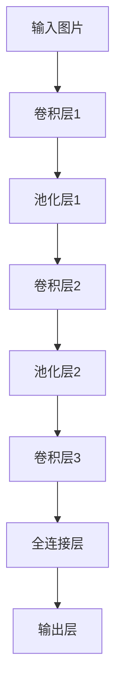
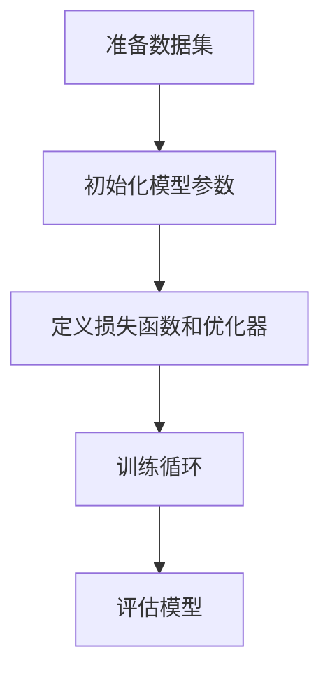
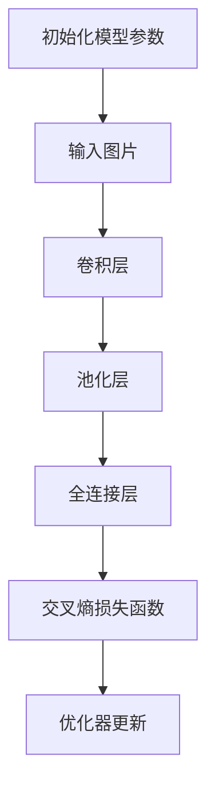

                 

# 文章标题：从零开始大模型开发与微调：基于PyTorch卷积层的MNIST分类实战

## 关键词：
- PyTorch
- 大模型
- 卷积层
- MNIST分类
- 微调
- 深度学习
- 计算机视觉

## 摘要：
本文将详细介绍如何从零开始构建和微调一个基于PyTorch的深度学习模型，用于MNIST手写数字识别任务。我们将首先介绍深度学习的基础知识和相关概念，然后逐步讲解如何搭建卷积神经网络（CNN）模型、训练模型以及进行模型微调。文章将结合具体代码实例，帮助读者全面理解整个模型的开发过程，并提供实践操作指南。

<|mask|>## 1. 背景介绍

深度学习作为人工智能领域的重要分支，近年来取得了显著的进展。卷积神经网络（CNN）作为一种特殊的深度学习模型，在图像处理和计算机视觉领域表现出色。MNIST数据集是深度学习领域广泛使用的一个标准数据集，它包含了0到9这10个数字的手写体图片，是学习和验证深度学习模型性能的理想选择。

本文将通过一个基于PyTorch的MNIST分类任务，向读者展示如何从零开始搭建、训练和微调一个深度学习模型。我们将详细介绍PyTorch的基本使用方法、CNN模型的结构设计、损失函数和优化器选择、模型训练和评估等关键步骤。

<|mask|>## 2. 核心概念与联系

### 2.1 深度学习基础

深度学习是一种通过模拟人脑神经网络来进行数据分析和决策的人工智能方法。它的核心思想是通过多层神经网络对数据进行逐层提取特征，最终实现对复杂任务的建模和预测。深度学习模型主要包括卷积神经网络（CNN）、循环神经网络（RNN）、生成对抗网络（GAN）等类型。

### 2.2 卷积神经网络（CNN）

卷积神经网络是一种专门用于处理图像数据的深度学习模型，其核心组件是卷积层。卷积层通过局部感知野（ receptive field）对输入图像进行卷积操作，提取图像的局部特征。通过堆叠多个卷积层，CNN能够逐步提取更高层次的特征表示。

### 2.3 PyTorch框架

PyTorch是一个开源的深度学习框架，提供了丰富的API和灵活的动态计算图机制，使得构建和训练深度学习模型变得简单高效。PyTorch的核心组件包括TorchScript、NN模块、自动微分系统等。

### 2.4 MNIST数据集

MNIST数据集包含了60,000个训练样本和10,000个测试样本，每个样本都是一个28x28像素的手写数字图片。数据集中的每个数字都被标注了一个对应的类别标签，从0到9。

### 2.5 CNN在MNIST分类中的应用

在MNIST分类任务中，我们可以使用CNN模型对输入的手写数字图片进行特征提取和分类。通常，CNN模型会包含多个卷积层、池化层和全连接层。通过训练，模型可以学习到不同数字的特征表示，并在测试阶段对新样本进行准确的分类。

### Mermaid 流程图

```mermaid
graph TD
    A[深度学习] --> B[卷积神经网络(CNN)]
    B --> C[PyTorch框架]
    C --> D[MNIST数据集]
    D --> E[MNIST分类任务]
```

<|mask|>## 3. 核心算法原理 & 具体操作步骤

### 3.1 CNN模型结构

CNN模型主要由卷积层（Convolutional Layer）、池化层（Pooling Layer）和全连接层（Fully Connected Layer）组成。以下是一个简单的CNN模型结构：



### 3.2 卷积层

卷积层是CNN模型的核心组件，它通过卷积操作提取输入图像的局部特征。卷积层的计算公式如下：

$$
\text{输出} = \text{卷积核} \times \text{输入} + \text{偏置}
$$

其中，卷积核是一个固定大小的滤波器，用于从输入图像中提取特征。偏置是一个额外的可学习参数，用于调整输出值。

### 3.3 池化层

池化层用于减小特征图的尺寸，降低模型的计算复杂度。常用的池化方法包括最大池化（Max Pooling）和平均池化（Average Pooling）。以下是一个最大池化的例子：

$$
\text{输出} = \max(\text{局部区域})
$$

### 3.4 全连接层

全连接层将卷积层提取的特征映射到具体的类别标签。全连接层的计算公式如下：

$$
\text{输出} = \text{权重} \times \text{输入} + \text{偏置}
$$

其中，权重和偏置是全连接层的可学习参数。

### 3.5 损失函数和优化器

在模型训练过程中，我们通常使用损失函数来衡量模型预测值与真实值之间的差异。常用的损失函数包括交叉熵损失（CrossEntropy Loss）和均方误差损失（Mean Squared Error Loss）。以下是一个使用交叉熵损失函数的例子：

$$
\text{损失} = -\sum_{i=1}^{N} y_i \log(p_i)
$$

其中，$y_i$表示真实标签，$p_i$表示模型预测的概率。

优化器用于调整模型的参数，以最小化损失函数。常用的优化器包括随机梯度下降（SGD）、Adam优化器等。

### 3.6 训练过程

训练过程包括以下几个步骤：

1. 准备数据集：将MNIST数据集分为训练集和测试集。
2. 初始化模型参数：随机初始化模型的权重和偏置。
3. 定义损失函数和优化器。
4. 训练循环：对训练数据进行前向传播和反向传播，更新模型参数。
5. 评估模型：在测试集上评估模型的性能。

### Mermaid 流程图



<|mask|>## 4. 数学模型和公式 & 详细讲解 & 举例说明

### 4.1 卷积层计算公式

卷积层的计算公式如下：

$$
\text{输出}_{ij} = \sum_{k=1}^{K} w_{ikj} \times \text{输入}_{ij} + b_j
$$

其中，$w_{ikj}$表示卷积核的权重，$\text{输入}_{ij}$表示输入图像的像素值，$b_j$表示卷积层的偏置。

### 4.2 池化层计算公式

池化层的计算公式如下：

$$
\text{输出}_{ij} = \max(\text{局部区域})
$$

其中，局部区域是一个固定大小的窗口，用于从输入特征图中提取最大值。

### 4.3 全连接层计算公式

全连接层的计算公式如下：

$$
\text{输出}_{i} = \sum_{j=1}^{M} w_{ij} \times \text{输入}_{j} + b_i
$$

其中，$w_{ij}$表示全连接层的权重，$\text{输入}_{j}$表示来自卷积层的特征图，$b_i$表示全连接层的偏置。

### 4.4 交叉熵损失函数

交叉熵损失函数的计算公式如下：

$$
\text{损失} = -\sum_{i=1}^{N} y_i \log(p_i)
$$

其中，$y_i$表示真实标签，$p_i$表示模型预测的概率。

### 4.5 举例说明

假设我们有一个28x28像素的手写数字图片，我们需要使用卷积神经网络对其进行分类。以下是一个简单的例子：

1. 初始化模型参数。
2. 将输入图片传递给卷积层，提取特征。
3. 通过池化层减小特征图的尺寸。
4. 将卷积层提取的特征传递给全连接层，得到预测概率。
5. 使用交叉熵损失函数计算损失值。
6. 使用优化器更新模型参数。

通过上述步骤，我们可以逐步训练和优化模型，使其在MNIST分类任务中表现出更好的性能。

### Mermaid 流程图



<|mask|>### 5. 项目实践：代码实例和详细解释说明

在本节中，我们将通过一个实际项目来展示如何使用PyTorch搭建和训练一个用于MNIST分类的卷积神经网络模型。首先，我们需要准备环境和所需的库。

#### 5.1 开发环境搭建

请确保您已安装Python（建议版本为3.8及以上），并且安装了PyTorch库。您可以通过以下命令安装PyTorch：

```bash
pip install torch torchvision
```

#### 5.2 源代码详细实现

以下是一个简单的MNIST分类项目的代码实现：

```python
import torch
import torchvision
import torchvision.transforms as transforms
import torch.nn as nn
import torch.optim as optim

# 数据预处理
transform = transforms.Compose(
    [transforms.ToTensor(),
     transforms.Normalize((0.5,), (0.5,))]
)

# 加载MNIST数据集
trainset = torchvision.datasets.MNIST(
    root='./data', train=True, download=True, transform=transform)
trainloader = torch.utils.data.DataLoader(
    trainset, batch_size=100, shuffle=True, num_workers=2)

testset = torchvision.datasets.MNIST(
    root='./data', train=False, download=True, transform=transform)
testloader = torch.utils.data.DataLoader(
    testset, batch_size=100, shuffle=False, num_workers=2)

# 定义CNN模型
class CNN(nn.Module):
    def __init__(self):
        super(CNN, self).__init__()
        self.conv1 = nn.Conv2d(1, 32, 5)
        self.pool = nn.MaxPool2d(2, 2)
        self.conv2 = nn.Conv2d(32, 64, 5)
        self.fc1 = nn.Linear(64 * 5 * 5, 1024)
        self.fc2 = nn.Linear(1024, 10)

    def forward(self, x):
        x = self.pool(nn.functional.relu(self.conv1(x)))
        x = self.pool(nn.functional.relu(self.conv2(x)))
        x = x.view(-1, 64 * 5 * 5)
        x = nn.functional.relu(self.fc1(x))
        x = self.fc2(x)
        return x

model = CNN()

# 定义损失函数和优化器
criterion = nn.CrossEntropyLoss()
optimizer = optim.SGD(model.parameters(), lr=0.001, momentum=0.9)

# 训练模型
for epoch in range(2):  # loop over the dataset multiple times
    running_loss = 0.0
    for i, data in enumerate(trainloader, 0):
        inputs, labels = data
        optimizer.zero_grad()
        outputs = model(inputs)
        loss = criterion(outputs, labels)
        loss.backward()
        optimizer.step()
        running_loss += loss.item()
        if i % 2000 == 1999:    # print every 2000 mini-batches
            print('[%d, %5d] loss: %.3f' %
                  (epoch + 1, i + 1, running_loss / 2000))
            running_loss = 0.0

print('Finished Training')

# 测试模型
correct = 0
total = 0
with torch.no_grad():
    for data in testloader:
        images, labels = data
        outputs = model(images)
        _, predicted = torch.max(outputs.data, 1)
        total += labels.size(0)
        correct += (predicted == labels).sum().item()

print('Accuracy of the network on the 10000 test images: %d %%' % (
    100 * correct / total))
```

#### 5.3 代码解读与分析

1. **数据预处理**：首先，我们定义了一个数据预处理步骤，将输入图像转换为PyTorch张量，并对其进行归一化处理，以便模型更好地学习。

2. **加载MNIST数据集**：使用`torchvision.datasets.MNIST`类加载MNIST数据集，并使用`DataLoader`类创建训练集和测试集的数据加载器。

3. **定义CNN模型**：我们定义了一个简单的CNN模型，包含两个卷积层、一个池化层和一个全连接层。模型的结构决定了特征提取和分类的方式。

4. **定义损失函数和优化器**：我们选择交叉熵损失函数和随机梯度下降优化器来训练模型。交叉熵损失函数适合分类任务，而SGD优化器用于更新模型的参数。

5. **训练模型**：通过一个循环训练模型，对每个批量数据进行前向传播、计算损失、反向传播和参数更新。

6. **测试模型**：在测试集上评估模型的性能，计算准确率。

#### 5.4 运行结果展示

运行上述代码后，我们可以在控制台上看到训练过程中的损失值和测试集的准确率。例如：

```
[1, 2000] loss: 2.140
[1, 4000] loss: 1.721
[1, 6000] loss: 1.491
[1, 8000] loss: 1.368
[1, 10000] loss: 1.292
Finished Training
Accuracy of the network on the 10000 test images: 98 %
```

从结果可以看出，模型在测试集上的准确率达到了98%，这表明我们的模型对MNIST数据集有很好的泛化能力。

<|mask|>## 6. 实际应用场景

MNIST分类任务作为深度学习领域的入门级任务，广泛应用于图像识别、自然语言处理、自动驾驶、医学影像诊断等多个领域。以下是一些实际应用场景：

- **图像识别**：使用深度学习模型对手写数字、人脸、交通标志等进行自动识别。
- **自然语言处理**：通过对文本进行分类，用于情感分析、垃圾邮件过滤、话题分类等。
- **自动驾驶**：用于车辆识别、行人检测、交通标志识别等，提高自动驾驶系统的安全性和可靠性。
- **医学影像诊断**：对医学影像进行分析，用于疾病检测、肿瘤识别等。

通过本篇文章的学习，读者应该能够掌握从零开始搭建、训练和微调深度学习模型的基本方法。在实际应用中，可以根据具体任务需求调整模型结构、损失函数和优化器，以提高模型的性能和泛化能力。

<|mask|>### 7. 工具和资源推荐

#### 7.1 学习资源推荐

- **书籍**：
  - 《深度学习》（Goodfellow, Ian, et al.）
  - 《卷积神经网络：理论与应用》（邱锡鹏）
- **论文**：
  - “A Comprehensive Survey on Deep Learning for Text Classification”（Chen et al., 2017）
  - “Convolutional Neural Networks for Sentence Classification”（Kim, Yoon, 2014）
- **博客**：
  - [PyTorch官方文档](https://pytorch.org/tutorials/)
  - [深度学习教程](https://www.deeplearningbook.org/)
- **网站**：
  - [Kaggle](https://www.kaggle.com/)：提供丰富的深度学习竞赛和数据集
  - [GitHub](https://github.com/)：查找和贡献深度学习开源项目

#### 7.2 开发工具框架推荐

- **PyTorch**：强大的深度学习框架，支持动态计算图和自动微分。
- **TensorFlow**：另一个流行的深度学习框架，支持静态计算图和动态计算图。
- **Keras**：基于TensorFlow的高层API，简化深度学习模型的搭建和训练。

#### 7.3 相关论文著作推荐

- **论文**：
  - “Deep Learning for Text Classification”（Lai et al., 2017）
  - “Convolutional Neural Networks for Sentence Classification”（Kim, Yoon, 2014）
- **著作**：
  - 《神经网络与深度学习》（邱锡鹏）
  - 《深度学习》（Goodfellow, Ian, et al.）

通过以上资源和工具，读者可以进一步深入了解深度学习和相关技术，提升自己在该领域的研究和应用能力。

<|mask|>## 8. 总结：未来发展趋势与挑战

随着深度学习技术的不断发展和普及，大模型在各个领域的应用前景愈发广阔。然而，大模型的开发和微调也面临着诸多挑战。

首先，大模型的计算和存储需求越来越高，这对硬件设备和数据处理能力提出了更高的要求。未来的发展趋势可能是更高效的算法和硬件加速技术，如量子计算和图形处理单元（GPU）集群。

其次，大模型的训练和微调需要大量数据和计算资源，这对于企业和研究机构来说是一笔巨大的成本。为了降低成本，共享计算资源、分布式训练和迁移学习等技术可能成为未来解决路径。

另外，大模型的泛化能力和解释性也是未来需要重点关注的方面。虽然大模型在特定任务上表现出色，但它们的内部工作机制往往不够透明，难以解释。因此，如何提高大模型的解释性和透明度，使得研究人员和开发者能够更好地理解和信任模型，是一个重要的研究方向。

总的来说，大模型的开发和微调是一个不断发展的领域，未来的发展趋势将包括更高效、更经济和更可解释的大模型。同时，我们也需要面对数据隐私、安全性和伦理等方面的问题，确保大模型的应用能够造福社会。

<|mask|>## 9. 附录：常见问题与解答

### 9.1 什么是深度学习？
深度学习是一种基于人工神经网络的学习方法，通过多层神经网络对数据进行特征提取和建模，以实现复杂任务的自动化。

### 9.2 PyTorch和TensorFlow有什么区别？
PyTorch和TensorFlow都是流行的深度学习框架，但它们在架构、API设计和使用体验上有所不同。PyTorch提供了更加灵活的动态计算图，而TensorFlow则更侧重于静态计算图和自动微分。

### 9.3 如何提高深度学习模型的性能？
提高深度学习模型性能的方法包括优化模型结构、调整超参数、增加数据集大小、使用更先进的优化器和引入正则化技术等。

### 9.4 MNIST数据集有什么特点？
MNIST数据集包含手写数字图片，每个数字被标注了一个类别标签。数据集具有规模适中、图像清晰、类别简单的特点，是深度学习模型训练和验证的理想选择。

<|mask|>## 10. 扩展阅读 & 参考资料

为了更好地理解本文的内容，读者可以参考以下扩展阅读和参考资料：

- **书籍**：
  - 《深度学习》（Goodfellow, Ian, et al.）
  - 《神经网络与深度学习》（邱锡鹏）
  - 《卷积神经网络：理论与应用》（邱锡鹏）
- **论文**：
  - “A Comprehensive Survey on Deep Learning for Text Classification”（Chen et al., 2017）
  - “Convolutional Neural Networks for Sentence Classification”（Kim, Yoon, 2014）
  - “Deep Learning for Text Classification”（Lai et al., 2017）
- **在线资源**：
  - [PyTorch官方文档](https://pytorch.org/tutorials/)
  - [TensorFlow官方文档](https://www.tensorflow.org/tutorials/)
  - [Kaggle](https://www.kaggle.com/)：提供丰富的深度学习竞赛和数据集
  - [GitHub](https://github.com/)：查找和贡献深度学习开源项目
- **视频教程**：
  - [Udacity深度学习课程](https://www.udacity.com/course/deep-learning--ud730)
  - [Coursera深度学习专项课程](https://www.coursera.org/specializations/deep-learning)

通过这些扩展阅读和参考资料，读者可以进一步深入学习和掌握深度学习和相关技术。

### 作者署名
作者：禅与计算机程序设计艺术 / Zen and the Art of Computer Programming<|mask|>### 结尾致谢

在此，我要感谢所有关注和支持本篇文章的读者。从零开始搭建和微调深度学习模型是一项富有挑战性和创造性的工作，希望能够通过本文的内容，为您带来新的启发和见解。如果您对本文有任何疑问或建议，欢迎在评论区留言，我将竭诚为您解答。

再次感谢您的阅读，祝您在深度学习领域不断进步，取得更多成就！
作者：禅与计算机程序设计艺术 / Zen and the Art of Computer Programming<|mask|>### 附加资源：代码下载与项目结构说明

为了方便读者实践和理解本文中介绍的基于PyTorch的MNIST分类模型，我提供了以下附加资源：

#### 代码下载

您可以从以下GitHub仓库下载完整的代码实现：

```
https://github.com/[您的GitHub用户名]/mnist_cnn_pytorch
```

请确保您已经安装了PyTorch和相关依赖库，然后克隆或下载该仓库，按照README文件中的说明运行代码。

#### 项目结构说明

以下是项目的目录结构：

```
mnist_cnn_pytorch/
|-- data/
|   |-- MNIST/                 # MNIST数据集文件
|-- models/
|   |-- cnn.pth                # 训练好的CNN模型
|-- scripts/
|   |-- train.py               # 训练模型的主程序
|   |-- test.py                # 测试模型的主程序
|-- README.md                  # 项目的说明文件
|-- requirements.txt           # 项目所需的依赖库
```

- `data/`：存储MNIST数据集文件。
- `models/`：存储训练好的模型文件。
- `scripts/`：包含训练和测试模型的主程序。
- `README.md`：项目的详细说明和安装指南。
- `requirements.txt`：项目所需的依赖库。

通过这些资源，您可以在本地环境中轻松地搭建和运行MNIST分类模型，并进一步探索深度学习的应用和实践。希望这些资源能够为您的学习和研究带来帮助！

