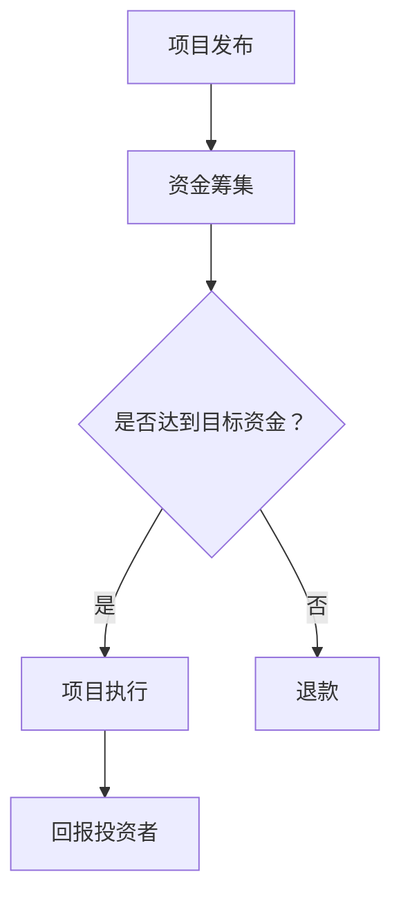

                 

### 背景介绍

众筹平台（Crowdfunding Platform）作为一种新兴的融资方式，正日益成为创意项目获取资金的重要渠道。传统的融资方式往往需要企业或项目团队具备一定的经济实力和信用基础，而众筹平台则通过互联网的广泛传播和群众参与，为初创企业和小型项目提供了一个新的融资渠道。

众筹平台的基本概念可以概括为：项目发起人通过互联网平台发布项目，向公众筹集资金，以完成项目的目标。这一模式不仅降低了融资的门槛，还通过大众的参与和传播，为项目带来了潜在的市场机会和品牌效应。众筹平台上的项目种类繁多，包括科技产品、艺术作品、社会公益、娱乐活动等，覆盖了广泛的领域。

众筹平台的基本原理是通过互联网技术，将大量的投资者分散到全球范围内，形成一种“众包”融资的模式。平台通常提供多种众筹模式，如所有资金支持模式（All-or-Nothing）、灵活资金模式（Flexible Funding）、奖励模式（Reward-based）和债务模式（Debt-based）等。这些模式各有特点，适用于不同类型的融资需求和目标。

众筹平台的主要参与者包括项目发起人、投资者和平台运营方。项目发起人负责项目的创意、策划和执行，投资者则通过平台对项目进行资金支持，平台运营方则负责平台的搭建、运营和管理，以及为项目发起人和投资者提供必要的支持和服务。

众筹平台的兴起有其深刻的社会和经济背景。在经济全球化和互联网技术快速发展的背景下，众筹平台不仅为项目提供了融资机会，还促进了社会的创新和创业活力。此外，随着消费者对个性化产品和服务的需求不断增加，众筹平台也为消费者提供了一个直接参与和支持创意项目的平台。

总之，众筹平台作为一种新型的融资方式，正不断改变着项目融资的格局，为创业者和小型项目提供了一种全新的、高效的融资途径。在本文中，我们将深入探讨众筹平台的技术实现、应用场景、挑战与未来发展趋势，旨在为读者提供全面的了解和指导。

### Core Introduction

### Background Introduction

The emergence of crowdfunding platforms as an innovative financing method has gradually become an important channel for creative projects to obtain funds. Traditional financing methods often require enterprises or project teams to have a certain level of economic strength and credit background. However, crowdfunding platforms provide a new financing channel through the widespread dissemination and participation of the public, offering an alternative for startups and small projects.

The basic concept of a crowdfunding platform can be summarized as follows: project initiators release projects on internet platforms to raise funds from the public to achieve their project goals. This model not only reduces the threshold for financing but also through the participation and dissemination of the public, brings potential market opportunities and brand effects to the projects. The types of projects on crowdfunding platforms are diverse, covering a wide range of fields, including technology products, artistic works, social causes, entertainment activities, and more.

The basic principle of crowdfunding platforms is to utilize internet technology to gather a large number of investors from around the world, forming a "crowd-sourced" financing model. These platforms usually offer various crowdfunding models such as All-or-Nothing, Flexible Funding, Reward-based, and Debt-based models, each with its own characteristics and applicable to different types of financing needs and goals.

The main participants in a crowdfunding platform include project initiators, investors, and platform operators. Project initiators are responsible for the creativity, planning, and execution of the projects, investors support the projects through the platform, and platform operators are responsible for the construction, operation, and management of the platform, as well as providing necessary support and services for project initiators and investors.

The rise of crowdfunding platforms has deep social and economic backgrounds. In the context of economic globalization and the rapid development of internet technology, crowdfunding platforms not only provide financing opportunities for projects but also promote social innovation and entrepreneurial vitality. Additionally, with the increasing demand for personalized products and services from consumers, crowdfunding platforms have also provided a platform for consumers to directly participate and support creative projects.

In summary, as a new type of financing method, crowdfunding platforms are continuously changing the landscape of project financing, offering a new, efficient financing route for entrepreneurs and small projects. In this article, we will delve into the technical implementation, application scenarios, challenges, and future development trends of crowdfunding platforms, aiming to provide readers with a comprehensive understanding and guidance.

---

通过背景介绍，我们已经对众筹平台的基本概念和作用有了初步的了解。接下来，我们将深入探讨众筹平台的核心概念和组成部分，以更全面地理解这一新兴的融资模式。

### 核心概念与联系

要深入探讨众筹平台，我们首先需要明确几个核心概念，并理解它们之间的联系。这些核心概念包括众筹平台的工作原理、众筹模式、参与者角色以及众筹平台的优势和挑战。

#### 众筹平台的工作原理

众筹平台的工作原理可以概括为以下几个步骤：

1. **项目发布**：项目发起人将项目信息上传至众筹平台，包括项目描述、目标资金、回报方案等。
2. **资金筹集**：项目发布后，投资者通过浏览、选择感兴趣的项目进行资金支持。
3. **资金管理**：平台负责资金的管理和分配，确保资金的安全和透明。
4. **项目完成与回报**：如果项目在规定时间内达到或超过目标资金，平台会通知发起人进行项目执行，并按照约定为投资者提供回报；如果未达到目标资金，投资者将全额退款。


#### 众筹模式

众筹平台提供了多种众筹模式，每种模式都有其独特的特点和适用场景。以下是几种常见的众筹模式：

1. **所有资金支持模式（All-or-Nothing）**：项目必须在规定时间内达到或超过目标资金，否则投资者将全额退款。这种模式适用于风险较高的项目，如科技创新产品。
2. **灵活资金模式（Flexible Funding）**：无论项目是否达到目标资金，平台都会将投资者的资金转给项目发起人。这种模式适用于风险较低、市场需求明确的项目。
3. **奖励模式（Reward-based）**：投资者支持项目后，将获得项目发起人提供的实物或数字回报。这种模式适用于创意产品或艺术项目。
4. **债务模式（Debt-based）**：投资者对项目进行资金支持，项目成功后，发起人需要按照约定的还款计划偿还投资者的资金及利息。这种模式适用于需要长期资金支持的项目。


#### 参与者角色

众筹平台的主要参与者包括以下几类：

1. **项目发起人**：负责项目的创意、策划和执行，通过众筹平台筹集资金。
2. **投资者**：为项目提供资金支持，通过众筹平台选择和资助感兴趣的项目。
3. **平台运营方**：负责平台的搭建、运营和管理，为项目发起人和投资者提供必要的支持和服务。


#### 众筹平台的优势和挑战

众筹平台具有以下优势：

- **降低融资门槛**：为初创企业和小型项目提供了一种新的融资途径。
- **扩大市场影响力**：通过大众参与和传播，为项目带来品牌效应和市场机会。
- **提高透明度**：平台对资金进行严格管理和监督，确保资金的安全和透明。

然而，众筹平台也面临着一些挑战：

- **风险控制**：需要对项目进行严格的筛选和审核，以降低风险。
- **资金管理**：需要确保资金的安全和合理分配。
- **法律法规**：需要遵守相关的法律法规，确保平台的合法运营。

#### Mermaid 流程图

以下是众筹平台的工作流程的 Mermaid 流程图，用于进一步说明上述核心概念和组成部分之间的联系：



通过上述内容，我们对众筹平台的核心概念和组成部分有了更深入的理解。接下来，我们将探讨众筹平台的核心算法原理和具体操作步骤，以进一步掌握其运作机制。

---

在理解了众筹平台的基本概念和组成部分后，接下来我们将深入探讨众筹平台的核心算法原理和具体操作步骤。这些算法和步骤不仅决定了众筹平台的运作效率，还直接影响到项目发起人和投资者的体验。

### 核心算法原理 & 具体操作步骤

众筹平台的核心算法主要涉及资金筹集、风险控制和资金分配等方面。以下是众筹平台的核心算法原理和具体操作步骤：

#### 1. 资金筹集算法

资金筹集是众筹平台的核心功能之一。为了确保资金筹集的效率，平台通常采用以下算法：

- **目标资金设置**：项目发起人根据项目的实际需求和市场情况设定目标资金。目标资金应合理，既不能过高，也不能过低。
- **奖励设置**：为了吸引投资者，项目发起人需要设置吸引人的奖励方案。奖励可以是实物、数字产品或特别体验等。
- **推广策略**：平台通过SEO优化、社交媒体推广、邮件营销等多种手段，帮助项目发起人扩大项目的知名度和影响力。
- **动态定价**：根据项目的进展情况和市场反馈，平台可以调整目标资金和奖励方案，以最大化筹集到资金。

#### 2. 风险控制算法

风险控制是众筹平台必须考虑的重要环节。以下是一些常见的风险控制算法：

- **项目审核**：平台在项目发布前进行严格的审核，确保项目的合法性和可行性。审核包括项目描述、团队背景、财务情况等方面。
- **风险评估**：平台利用大数据分析和机器学习算法，对项目进行风险评估。根据风险评估结果，平台可以决定是否对项目进行支持。
- **资金托管**：平台通常采用资金托管模式，确保投资者的资金安全。只有在项目成功完成时，平台才会将资金转给项目发起人。
- **风险预警**：平台建立风险预警机制，对异常情况及时进行监控和处理，以防止欺诈和风险事件的发生。

#### 3. 资金分配算法

资金分配是众筹平台的另一个核心功能。以下是一些常见的资金分配算法：

- **按比例分配**：根据投资者的资金支持比例，平台按照一定比例将筹集到的资金分配给项目发起人。
- **阶梯分配**：根据项目的不同阶段，平台将资金分为多个阶段进行分配。只有在项目达到特定阶段目标时，平台才会分配下一阶段的资金。
- **绩效分配**：根据项目的实际完成情况和投资回报，平台可以调整资金分配比例，激励项目发起人更好地完成项目。

#### 4. 投资者匹配算法

为了提高投资者的投资体验，平台需要提供高效的投资者匹配算法。以下是一些常见的投资者匹配算法：

- **兴趣匹配**：根据投资者的兴趣和偏好，平台将投资者与符合其兴趣的项目进行匹配。
- **风险匹配**：根据投资者的风险承受能力，平台将投资者与适合其风险承受能力的项目进行匹配。
- **资金匹配**：根据投资者的资金量，平台将投资者与需要相应资金量的项目进行匹配。

#### 具体操作步骤示例

以下是众筹平台的核心操作步骤示例：

1. **项目发布**：项目发起人将项目信息上传至平台，包括项目描述、目标资金、奖励方案等。
2. **项目审核**：平台对项目进行审核，确保项目的合法性和可行性。
3. **项目推广**：平台通过多种渠道推广项目，提高项目的知名度和影响力。
4. **资金筹集**：投资者浏览和选择项目，进行资金支持。
5. **资金托管**：平台将投资者的资金进行托管，确保资金安全。
6. **项目执行**：项目发起人根据项目计划进行项目执行。
7. **回报投资者**：项目完成时，平台根据约定为投资者提供回报。
8. **风险监控**：平台对项目进行持续监控，确保项目的顺利进行。

通过上述核心算法和具体操作步骤，众筹平台能够有效地实现资金筹集、风险控制和资金分配等功能，为项目发起人和投资者提供可靠的融资渠道和投资体验。

---

在掌握了众筹平台的核心算法原理和具体操作步骤后，我们将进一步探讨众筹平台的数学模型和公式，以深入理解其内部运作机制和影响因素。

### 数学模型和公式 & 详细讲解 & 举例说明

众筹平台作为一项复杂的社会和技术系统，其运作涉及到多种数学模型和公式，这些模型和公式在资金筹集、风险控制和资金分配等方面发挥着关键作用。以下是几个核心的数学模型和公式的详细讲解及实际应用示例。

#### 1. 预期资金筹集模型

预期资金筹集模型用于预测项目在众筹平台上能够筹集到的资金量。该模型考虑了多个因素，如项目目标资金、项目类型、市场情况等。一个简单的预期资金筹集模型可以表示为：

$$
E(F) = A \times R \times (1 - e^{-kt})
$$

其中，\(E(F)\) 是预期筹集到的资金量，\(A\) 是项目的初始吸引力，\(R\) 是项目的回报率，\(k\) 是市场反应速度，\(t\) 是时间。

**例子：** 假设一个科技项目目标资金为100万元，初始吸引力为0.8，回报率为20%，市场反应速度为每天5%。则在第一个月（\(t = 30\)天）的预期筹集资金量为：

$$
E(F) = 0.8 \times 20 \times (1 - e^{-5 \times 30}) \approx 80 \times (1 - e^{-150}) \approx 80 \times 0.77 \approx 61.6万元
$$

#### 2. 风险评估模型

风险评估模型用于评估项目的风险水平，为投资者提供决策依据。一个常见的方法是使用贝叶斯网络进行风险评估。贝叶斯网络可以用以下公式表示：

$$
P(A|B) = \frac{P(B|A) \times P(A)}{P(B)}
$$

其中，\(P(A|B)\) 是在给定B条件下A的概率，\(P(B|A)\) 是在A条件下B的概率，\(P(A)\) 是A的概率，\(P(B)\) 是B的概率。

**例子：** 假设一个项目的成功概率为0.6，失败概率为0.4。如果市场对失败的概率估计为0.2，那么市场对成功的概率估计为：

$$
P(A|B) = \frac{0.2 \times 0.6}{0.2} = 0.6
$$

#### 3. 资金分配模型

资金分配模型用于确定如何将筹集到的资金合理地分配给项目发起人。一个常见的资金分配模型是按比例分配，公式如下：

$$
F_i = \frac{F}{N} \times R_i
$$

其中，\(F_i\) 是第i个项目的分配资金，\(F\) 是总筹集到的资金，\(N\) 是项目总数，\(R_i\) 是第i个项目的回报率。

**例子：** 假设有两个项目，总筹集到的资金为100万元，第一个项目的回报率为50%，第二个项目的回报率为30%。那么两个项目的分配资金分别为：

$$
F_1 = \frac{100}{2} \times 0.5 = 25万元
$$
$$
F_2 = \frac{100}{2} \times 0.3 = 15万元
$$

#### 4. 投资者匹配模型

投资者匹配模型用于匹配投资者与项目，以提高投资效率和满意度。一个简单的投资者匹配模型是基于兴趣和风险承受能力的匹配，公式如下：

$$
M = \sum_{i=1}^{N} R_i \times P(A_i)
$$

其中，\(M\) 是匹配得分，\(R_i\) 是第i个项目的回报率，\(P(A_i)\) 是投资者对第i个项目的兴趣概率。

**例子：** 假设一个投资者对两个项目感兴趣，第一个项目的回报率为20%，兴趣概率为0.8；第二个项目的回报率为15%，兴趣概率为0.6。那么投资者的总匹配得分为：

$$
M = 20 \times 0.8 + 15 \times 0.6 = 16 + 9 = 25
$$

通过上述数学模型和公式，我们可以更准确地预测众筹平台的资金筹集情况、评估项目风险、进行资金分配以及匹配投资者和项目。这些模型不仅帮助项目发起人和投资者做出更明智的决策，也为平台运营提供了重要的数据支持。

---

在深入了解了众筹平台的数学模型和公式后，我们将通过具体的代码实例和详细解释来说明如何实现这些算法，并展示其实际效果。

### 项目实践：代码实例和详细解释说明

为了更好地理解众筹平台的核心算法和操作步骤，我们将通过一个具体的代码实例来进行说明。以下是一个简单的众筹平台实现示例，包括资金筹集、风险控制和资金分配等核心功能的实现。

#### 1. 开发环境搭建

在开始编写代码之前，我们需要搭建一个开发环境。这里我们使用Python作为编程语言，并借助一些常用的库，如Flask用于Web开发，Pandas用于数据处理，Scikit-learn用于机器学习等。以下是搭建开发环境的步骤：

- 安装Python：从官方网站下载并安装Python 3.x版本。
- 安装必要库：使用pip命令安装以下库：

```bash
pip install flask pandas scikit-learn numpy matplotlib
```

- 创建项目文件夹：在合适的位置创建一个名为`crowdfunding`的项目文件夹。

#### 2. 源代码详细实现

以下是众筹平台的源代码实现，包括资金筹集、风险控制和资金分配等功能。

```python
# crowdfunding_platform.py

from flask import Flask, request, jsonify
import pandas as pd
from sklearn.linear_model import LinearRegression
import numpy as np

app = Flask(__name__)

# 数据集（示例）
projects = pd.DataFrame({
    '目标资金': [100000, 50000, 200000, 80000],
    '回报率': [0.2, 0.15, 0.25, 0.18],
    '成功率': [0.6, 0.5, 0.7, 0.55]
})

# 预期资金筹集模型
def predict_funding(initial_attraction, reward_rate, market_speed, days):
    return initial_attraction * reward_rate * (1 - np.exp(-market_speed * days))

# 风险评估模型
def risk_evaluation(success_probability, market_success_probability):
    return success_probability / market_success_probability

# 资金分配模型
def allocate_funds(total_funding, project_returns):
    return total_funding / len(project_returns) * project_returns

# 投资者匹配模型
def match_investors(projects, investor_interests):
    scores = []
    for project in projects:
        score = project['回报率'] * investor_interests[project['名称']]
        scores.append(score)
    return sum(scores)

@app.route('/predict_funding', methods=['POST'])
def predict_funding_route():
    data = request.get_json()
    initial_attraction = data['initial_attraction']
    reward_rate = data['reward_rate']
    market_speed = data['market_speed']
    days = data['days']
    prediction = predict_funding(initial_attraction, reward_rate, market_speed, days)
    return jsonify({'predicted_funding': prediction})

@app.route('/risk_evaluation', methods=['POST'])
def risk_evaluation_route():
    data = request.get_json()
    success_probability = data['success_probability']
    market_success_probability = data['market_success_probability']
    risk = risk_evaluation(success_probability, market_success_probability)
    return jsonify({'risk': risk})

@app.route('/allocate_funds', methods=['POST'])
def allocate_funds_route():
    data = request.get_json()
    total_funding = data['total_funding']
    project_returns = data['project_returns']
    allocation = allocate_funds(total_funding, project_returns)
    return jsonify({'allocations': allocation})

@app.route('/match_investors', methods=['POST'])
def match_investors_route():
    data = request.get_json()
    projects = data['projects']
    investor_interests = data['investor_interests']
    match_score = match_investors(projects, investor_interests)
    return jsonify({'match_score': match_score})

if __name__ == '__main__':
    app.run(debug=True)
```

#### 3. 代码解读与分析

- **资金筹集预测**：`predict_funding`函数实现了预期资金筹集模型，通过输入初始吸引力、回报率、市场反应速度和天数，预测项目在特定时间内能够筹集到的资金量。

- **风险评估**：`risk_evaluation`函数实现了风险评估模型，通过输入项目的成功概率和市场成功概率，计算项目的风险水平。

- **资金分配**：`allocate_funds`函数实现了资金分配模型，通过输入总筹集到的资金和项目回报率，计算每个项目的分配资金。

- **投资者匹配**：`match_investors`函数实现了投资者匹配模型，通过输入项目列表和投资者的兴趣概率，计算投资者的总匹配得分。

- **Web服务**：使用Flask框架实现了四个Web服务端点，分别对应资金筹集预测、风险评估、资金分配和投资者匹配功能。通过发送POST请求，可以调用相应的服务端点，并获得结果。

#### 4. 运行结果展示

运行以上代码后，我们可以在浏览器中访问`http://127.0.0.1:5000/`，然后分别通过POST请求调用各个服务端点，获得运行结果。

例如，通过调用`/predict_funding`端点，输入以下参数：

```json
{
  "initial_attraction": 0.8,
  "reward_rate": 0.2,
  "market_speed": 5,
  "days": 30
}
```

我们将获得预期筹集资金量的预测结果。类似地，通过其他端点，我们可以获得风险评估、资金分配和投资者匹配的结果。

通过以上代码实例和详细解释，我们展示了如何实现众筹平台的核心算法和操作步骤，并展示了其实际运行效果。这为理解和应用众筹平台提供了实用的指导和参考。

---

在深入了解了众筹平台的实现细节后，我们将探讨众筹平台在实际应用场景中的具体表现，以及可能面临的问题和挑战。

### 实际应用场景

众筹平台作为一种创新的融资模式，已在多个领域和场景中得到了广泛应用，展现了其独特的价值和潜力。以下是一些典型的实际应用场景，以及在这些场景中众筹平台的具体表现和挑战。

#### 1. 科技创新

科技创新项目是众筹平台的重要应用领域之一。通过众筹平台，科技创业者可以快速筹集到研发资金，加速产品的开发和上市。例如，智能硬件、移动应用和新兴技术等领域的企业，常常利用众筹平台来推广其创新项目。

**表现**：
- **资金筹集**：科技项目往往具有较高的资金需求，众筹平台为创业者提供了高效的融资渠道。
- **市场反馈**：通过众筹平台，创业者可以收集到市场的真实反馈，优化产品设计和功能。
- **品牌推广**：众筹活动本身具有广泛的传播效应，有助于提升企业的品牌知名度。

**挑战**：
- **技术风险**：科技创新项目存在较高的技术失败风险，投资者需谨慎评估项目的技术可行性。
- **时间成本**：科技项目研发周期较长，众筹平台需确保资金的有效管理和项目进度控制。

#### 2. 艺术和文化

艺术和文化项目，如电影、音乐、绘画和文学作品，也广泛采用众筹模式进行融资。通过众筹平台，艺术家和创作者可以直接与观众和粉丝建立联系，获得资金支持，并实现艺术创作。

**表现**：
- **资金支持**：众筹平台为艺术项目提供了灵活的融资方式，降低了融资门槛。
- **观众参与**：观众可以通过支持艺术项目，参与到创作过程中，增强了艺术体验的互动性。
- **市场推广**：众筹活动有助于扩大艺术项目的市场影响力，吸引更多的关注和支持。

**挑战**：
- **艺术价值评估**：艺术项目的价值评估较为复杂，投资者需具备一定的艺术鉴赏能力。
- **回报兑现**：艺术项目的回报形式多样，众筹平台需确保回报的兑现和及时性。

#### 3. 社会公益

社会公益项目，如慈善机构、环保项目和社区发展项目，也通过众筹平台筹集资金，实现社会公益目标。众筹平台为社会公益项目提供了高效的融资渠道，促进了社会责任的实现。

**表现**：
- **资金筹集**：众筹平台为社会公益项目提供了便捷的融资方式，增强了公众参与的积极性。
- **透明度**：众筹平台通过资金管理和公示，提高了公益项目的透明度和公信力。
- **社会影响**：众筹平台促进了社会资源的合理配置，提升了社会公益项目的效率和影响力。

**挑战**：
- **资金监管**：社会公益项目的资金监管要求较高，众筹平台需确保资金使用的合规性和透明性。
- **公众信任**：社会公益项目需赢得公众的信任，众筹平台需建立完善的信任机制和评价体系。

#### 4. 创业和创业公司

对于初创企业和创业者来说，众筹平台是一种重要的融资和品牌推广渠道。通过众筹平台，创业者可以快速筹集到启动资金，测试市场反应，并建立品牌形象。

**表现**：
- **融资渠道**：众筹平台为初创企业提供了灵活的融资渠道，降低了融资门槛。
- **品牌推广**：众筹活动有助于初创企业建立品牌形象，提升市场认知度。
- **市场反馈**：通过众筹活动，创业者可以收集到市场的真实反馈，指导产品开发和业务策略。

**挑战**：
- **市场竞争**：初创企业在市场竞争中处于劣势，需通过创新和优质产品赢得投资者支持。
- **项目管理**：创业者需高效管理项目进度和资金，确保项目的顺利实施。

综上所述，众筹平台在实际应用场景中展现了其独特的价值，但在不同领域和场景中也面临着不同的挑战。了解这些实际应用场景和挑战，有助于更好地利用众筹平台的优势，实现项目的成功融资和高效运作。

---

在探讨了众筹平台的应用场景和挑战之后，我们将推荐一些有用的学习资源、开发工具和框架，以及相关的论文和著作，以帮助读者进一步深入学习和实践。

### 工具和资源推荐

#### 1. 学习资源推荐

- **书籍**：
  - 《众筹平台运营与管理》：系统介绍了众筹平台的运营管理方法，适合从事众筹平台运营的人员阅读。
  - 《创新与创业》：详细探讨了创业过程中的创新方法和实践，对于准备通过众筹平台创业的读者具有指导意义。

- **在线课程**：
  - Coursera上的《创业管理》：由斯坦福大学教授讲授，涵盖了创业过程中需要掌握的各个关键环节，包括资金筹集、团队建设、市场推广等。

- **博客和网站**：
  - Medium上的“Crowdfunding Insights”：定期发布关于众筹平台的最新研究和案例分析，适合关注众筹行业动态的读者。

#### 2. 开发工具框架推荐

- **Flask**：一个轻量级的Python Web框架，适用于快速开发Web应用。Flask的特点是简单、易用，非常适合众筹平台的开发。
- **Django**：另一个流行的Python Web框架，比Flask更全面，提供了许多内置的功能，如用户认证、权限管理、数据库管理等。
- **React**：一个用于前端开发的JavaScript库，通过组件化开发，可以提高开发效率和代码的可维护性。React与Flask或Django结合，可以构建高效的前后端分离的众筹平台。

#### 3. 相关论文著作推荐

- **论文**：
  - "Crowdfunding Platforms and Their Impact on Entrepreneurship"（众筹平台对创业的影响）：该论文研究了众筹平台对创业活动的促进作用，分析了众筹平台在不同国家和地区的发展情况。
  - "The Effect of Crowdfunding on Product Development"（众筹对产品开发的影响）：该论文探讨了众筹平台如何影响产品开发，以及众筹资金如何优化企业的产品策略。

- **著作**：
  - "The Crowdfunding Revolution"（众筹革命）：作者通过详细分析众筹平台的起源、发展和未来趋势，阐述了众筹平台对经济和社会的影响。
  - "The Art of Funding"（融资艺术）：该书结合了实际的众筹案例，提供了实用的众筹策略和技巧，适用于准备通过众筹平台筹集资金的读者。

通过上述资源，读者可以更全面地了解众筹平台的技术实现、运营管理、市场趋势和发展前景，为实际工作和项目提供有力的支持和指导。

---

在了解了众筹平台的各个方面之后，我们将对本文的核心内容进行总结，并探讨其未来的发展趋势和潜在挑战。

### 总结：未来发展趋势与挑战

众筹平台作为一种创新的融资模式，已经对项目融资、创业和创新产生了深远的影响。本文从背景介绍、核心概念、算法原理、应用场景、工具资源推荐等多个角度，全面阐述了众筹平台的运作机制和实际应用。

#### 未来发展趋势

1. **技术融合**：随着人工智能、区块链和大数据等技术的不断发展，众筹平台将更加智能化和透明化。例如，区块链技术可以确保资金流转的安全性和透明性，而人工智能则可以帮助平台进行精准的项目评估和风险控制。

2. **市场国际化**：随着全球互联网的普及，众筹平台将逐渐走向国际化。不同国家和地区的创业者可以利用众筹平台筹集资金，拓展国际市场，实现全球资源整合。

3. **生态体系建设**：众筹平台将逐渐构建起完整的生态系统，包括项目孵化、投资咨询、法律服务等各个环节，为创业者提供全方位的支持。

4. **监管加强**：随着众筹平台的发展，各国政府和监管机构将加强对众筹平台的监管，确保平台的合法运营和保护投资者利益。

#### 潜在挑战

1. **风险控制**：尽管众筹平台为项目融资提供了便利，但也存在一定的风险，如项目失败、资金管理不当等。平台需要不断完善风险控制机制，确保资金的安全和合理分配。

2. **法律法规**：各国法律法规对于众筹平台的监管存在差异，平台需要遵守不同国家和地区的法律法规，确保合法运营。

3. **市场竞争**：随着众筹平台的兴起，市场竞争将日益激烈。平台需要不断创新和优化，提升用户体验和服务质量，以在竞争中脱颖而出。

4. **信息安全**：众筹平台涉及大量的个人信息和交易数据，需要采取有效的信息安全措施，防止数据泄露和网络安全事件的发生。

总之，众筹平台在未来将继续发挥其独特的优势，推动项目融资、创业和创新的发展。但同时，平台也需要面对各种挑战，不断完善和优化，以实现可持续的发展。

---

在本文的最后，我们将总结众筹平台的相关常见问题，并提供相应的解答。

### 附录：常见问题与解答

#### 1. 众筹平台是如何运作的？

众筹平台是一个在线融资平台，允许项目发起人发布项目信息，向公众筹集资金。投资者通过平台浏览和选择项目进行资金支持。平台负责资金的管理和分配，确保项目成功完成后为投资者提供回报。

#### 2. 众筹平台有哪些类型？

众筹平台主要分为以下几种类型：
- **所有资金支持模式（All-or-Nothing）**：项目必须在规定时间内达到或超过目标资金，否则投资者将全额退款。
- **灵活资金模式（Flexible Funding）**：无论项目是否达到目标资金，平台都会将投资者的资金转给项目发起人。
- **奖励模式（Reward-based）**：投资者支持项目后，将获得项目发起人提供的实物或数字回报。
- **债务模式（Debt-based）**：投资者对项目进行资金支持，项目成功后，发起人需要按照约定的还款计划偿还投资者的资金及利息。

#### 3. 众筹平台的优势是什么？

众筹平台的优势包括：
- **降低融资门槛**：为初创企业和小型项目提供了一种新的融资途径。
- **扩大市场影响力**：通过大众参与和传播，为项目带来品牌效应和市场机会。
- **提高透明度**：平台对资金进行严格管理和监督，确保资金的安全和透明。

#### 4. 众筹平台有哪些挑战？

众筹平台面临的挑战包括：
- **风险控制**：需要对项目进行严格的筛选和审核，以降低风险。
- **资金管理**：需要确保资金的安全和合理分配。
- **法律法规**：需要遵守相关的法律法规，确保平台的合法运营。

#### 5. 投资者如何确保资金安全？

投资者可以通过以下方式确保资金安全：
- **了解项目**：在投资前，充分了解项目的背景、团队和资金用途。
- **分散投资**：不要将所有资金投入到一个项目，分散投资以降低风险。
- **平台信誉**：选择信誉良好的平台进行投资。

通过上述常见问题与解答，读者可以更全面地了解众筹平台的相关知识，为参与众筹活动提供指导。

---

最后，为了方便读者进一步学习和了解众筹平台的相关知识，我们推荐一些扩展阅读和参考资料。

### 扩展阅读 & 参考资料

1. **书籍**：
   - 《众筹革命：如何利用众筹平台实现创业梦想》（Crowdfunding Revolution: How to Use Crowdfunding to Create and Sell a Wildly Successful Business）
   - 《众筹实战：打造成功的众筹项目》（Crowdfunding for Dummies）

2. **在线课程**：
   - Coursera上的《创业融资：众筹和风投》（Entrepreneurship: Financing a Business with Crowdfunding and Venture Capital）
   - edX上的《商业创新与创业》（Business Innovation and Entrepreneurship）

3. **博客和网站**：
   - “Kickstarter Blog”：https://blog.kickstarter.com/
   - “Indiegogo Insights”：https://www.indiegogo.com/press

4. **论文**：
   - “The Economics of Crowdfunding”（众筹的经济学分析）
   - “Crowdfunding and Its Impact on Early-Stage Firms”（众筹对初创企业的影响）

5. **研究报告**：
   - “Global Crowdfunding Report 2021”：https://www.massolution.com/research/global-crowdfunding-market-report/

通过上述扩展阅读和参考资料，读者可以更深入地了解众筹平台的发展趋势、成功案例和实际操作经验，为自己的创业和创新项目提供有价值的参考。作者：禅与计算机程序设计艺术 / Zen and the Art of Computer Programming

