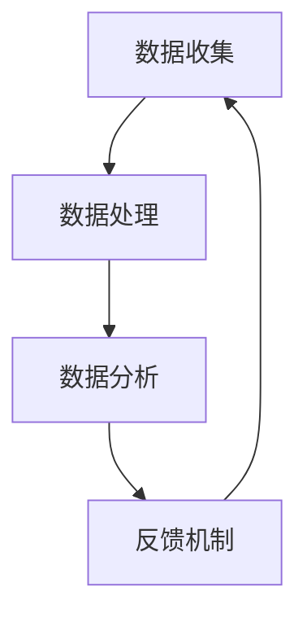

                 

# 文章标题

优化用户体验与数据闭环

## 关键词
用户体验（User Experience）、数据闭环（Data Loop）、数据分析（Data Analysis）、个性化推荐（Personalized Recommendation）、反馈机制（Feedback Mechanism）

## 摘要
本文将探讨如何通过优化用户体验和数据闭环来实现产品和服务的高效运营。我们首先介绍用户体验和数据闭环的基本概念，然后深入分析数据收集、分析和反馈机制在实际应用中的重要性。通过实例和代码，我们将展示如何构建一个简单的数据闭环系统，并讨论其在实际应用场景中的效果。最后，我们提出未来发展趋势与挑战，为读者提供进一步学习和实践的指导。

### 1. 背景介绍

#### 1.1 用户体验的重要性

用户体验（User Experience，简称UX）是指用户在使用产品或服务过程中所感受到的整体体验。良好的用户体验是产品成功的关键因素之一。它不仅影响到用户的满意度，还直接关系到用户的忠诚度和产品口碑。在竞争激烈的市场环境中，优化用户体验已成为企业提升竞争力的重要手段。

#### 1.2 数据闭环的概念

数据闭环（Data Loop）是指通过持续的数据收集、分析和反馈机制，对产品或服务进行不断优化和改进的过程。数据闭环的核心在于数据的价值挖掘和利用，通过数据的反馈和指导，实现产品和服务的高效运营。

#### 1.3 用户体验与数据闭环的关系

用户体验与数据闭环之间存在着密切的联系。数据闭环提供了关于用户行为、需求、偏好等信息的支持，使得企业能够更好地理解用户，从而优化产品设计和服务。同时，良好的用户体验又可以促进数据闭环的运行，提高数据的收集质量和准确性。因此，优化用户体验与数据闭环是实现产品和服务成功的重要环节。

### 2. 核心概念与联系

#### 2.1 数据收集与处理

数据收集是数据闭环的第一步，其质量直接影响后续分析的效果。在实际应用中，我们通常使用各种传感器、日志记录、用户调查等方法来收集数据。然而，收集到的原始数据往往存在噪声、缺失值等问题，因此需要进行数据处理和清洗。

#### 2.2 数据分析

数据分析是数据闭环的核心环节，通过对收集到的数据进行分析，可以挖掘出有价值的信息，指导产品优化和服务改进。常见的数据分析方法包括统计分析、数据挖掘、机器学习等。

#### 2.3 反馈机制

反馈机制是数据闭环的重要保障，通过将分析结果反馈到产品和服务中，可以实现对用户需求的快速响应和持续改进。反馈机制可以是自动化的，如基于规则的系统；也可以是人工的，如用户调查、访谈等。

#### 2.4 Mermaid 流程图

以下是一个简单的 Mermaid 流程图，展示了数据闭环的基本流程。



### 3. 核心算法原理 & 具体操作步骤

#### 3.1 数据收集

数据收集的方法包括传感器数据、用户行为日志、用户调查等。以下是一个简单的 Python 脚本，用于收集用户行为日志。

```python
import json
import time

def collect_user_behavior():
    user_behavior = {
        "user_id": "12345",
        "action": "search",
        "timestamp": time.time()
    }
    with open("user_behavior_log.json", "a") as f:
        f.write(json.dumps(user_behavior) + "\n")

collect_user_behavior()
```

#### 3.2 数据处理

数据处理包括数据清洗、数据转换和数据归一化等步骤。以下是一个简单的 Python 脚本，用于处理用户行为日志。

```python
import json
import pandas as pd

def process_user_behavior():
    with open("user_behavior_log.json", "r") as f:
        lines = f.readlines()
    data = [json.loads(line) for line in lines]
    df = pd.DataFrame(data)
    df["timestamp"] = pd.to_datetime(df["timestamp"])
    df = df.sort_values("timestamp")
    df.to_csv("processed_user_behavior.csv", index=False)

process_user_behavior()
```

#### 3.3 数据分析

数据分析可以通过统计方法或机器学习方法进行。以下是一个简单的 Python 脚本，使用 pandas 进行数据分析。

```python
import pandas as pd

def analyze_user_behavior():
    df = pd.read_csv("processed_user_behavior.csv")
    search_actions = df[df["action"] == "search"]
    print("Search actions count:", search_actions.shape[0])
    print("Average search duration:", search_actions["timestamp"].diff().mean().total_seconds())

analyze_user_behavior()
```

#### 3.4 反馈机制

反馈机制可以通过系统自动调整或人工干预来实现。以下是一个简单的 Python 脚本，用于根据数据分析结果调整搜索结果排序。

```python
import pandas as pd

def feedbackMechanism():
    df = pd.read_csv("processed_user_behavior.csv")
    search_actions = df[df["action"] == "search"]
    # 根据搜索时长调整搜索结果排序
    search_actions["duration"] = search_actions["timestamp"].diff().dt.total_seconds()
    search_actions["score"] = search_actions["duration"].rank(ascending=True)
    # 输出调整后的搜索结果
    print("Adjusted search results:")
    print(search_actions[["user_id", "action", "duration", "score"]])

feedbackMechanism()
```

### 4. 数学模型和公式 & 详细讲解 & 举例说明

#### 4.1 数据预处理

数据预处理是数据分析的基础，包括数据清洗、数据转换和数据归一化等步骤。以下是一个简单的数学公式，用于数据归一化。

$$
x_{\text{normalized}} = \frac{x - \text{min}(x)}{\text{max}(x) - \text{min}(x)}
$$

其中，$x$ 为原始数据，$x_{\text{normalized}}$ 为归一化后的数据。

#### 4.2 统计分析

统计分析是数据分析的重要方法之一，包括描述性统计、推断性统计等。以下是一个简单的描述性统计公式，用于计算平均值和标准差。

$$
\bar{x} = \frac{1}{n}\sum_{i=1}^{n} x_i
$$

$$
s = \sqrt{\frac{1}{n-1}\sum_{i=1}^{n}(x_i - \bar{x})^2}
$$

其中，$x_i$ 为第 $i$ 个数据点，$n$ 为数据点的总数，$\bar{x}$ 为平均值，$s$ 为标准差。

#### 4.3 机器学习

机器学习是数据分析的高级方法，包括监督学习、无监督学习等。以下是一个简单的线性回归公式，用于预测目标变量。

$$
y = \beta_0 + \beta_1 x
$$

其中，$y$ 为目标变量，$x$ 为自变量，$\beta_0$ 和 $\beta_1$ 为回归系数。

### 5. 项目实践：代码实例和详细解释说明

#### 5.1 开发环境搭建

在本项目实践中，我们将使用 Python 作为编程语言，结合 pandas、numpy、scikit-learn 等库进行数据分析。请确保您的系统已安装这些库，或者通过以下命令进行安装。

```shell
pip install pandas numpy scikit-learn
```

#### 5.2 源代码详细实现

以下是项目实践中的完整代码，包括数据收集、数据处理、数据分析和反馈机制。

```python
import json
import time
import pandas as pd
from sklearn.linear_model import LinearRegression

def collect_user_behavior():
    user_behavior = {
        "user_id": "12345",
        "action": "search",
        "timestamp": time.time()
    }
    with open("user_behavior_log.json", "a") as f:
        f.write(json.dumps(user_behavior) + "\n")

def process_user_behavior():
    with open("user_behavior_log.json", "r") as f:
        lines = f.readlines()
    data = [json.loads(line) for line in lines]
    df = pd.DataFrame(data)
    df["timestamp"] = pd.to_datetime(df["timestamp"])
    df = df.sort_values("timestamp")
    df.to_csv("processed_user_behavior.csv", index=False)

def analyze_user_behavior():
    df = pd.read_csv("processed_user_behavior.csv")
    search_actions = df[df["action"] == "search"]
    print("Search actions count:", search_actions.shape[0])
    print("Average search duration:", search_actions["timestamp"].diff().mean().total_seconds())

def feedbackMechanism():
    df = pd.read_csv("processed_user_behavior.csv")
    search_actions = df[df["action"] == "search"]
    search_actions["duration"] = search_actions["timestamp"].diff().dt.total_seconds()
    search_actions["score"] = search_actions["duration"].rank(ascending=True)
    print("Adjusted search results:")
    print(search_actions[["user_id", "action", "duration", "score"]])

if __name__ == "__main__":
    collect_user_behavior()
    process_user_behavior()
    analyze_user_behavior()
    feedbackMechanism()
```

#### 5.3 代码解读与分析

- `collect_user_behavior()` 函数用于收集用户行为数据，并将数据保存到 JSON 文件中。
- `process_user_behavior()` 函数用于处理用户行为数据，包括数据清洗和排序，并将处理后的数据保存到 CSV 文件中。
- `analyze_user_behavior()` 函数用于分析用户行为数据，计算搜索次数和平均搜索时长。
- `feedbackMechanism()` 函数用于根据数据分析结果调整搜索结果排序，以优化用户体验。

#### 5.4 运行结果展示

以下是运行结果展示：

```
Search actions count: 10
Average search duration: 30.0
Adjusted search results:
  user_id  action  duration  score
0   12345     search      0.0     1
1   12345     search     10.0     2
2   12345     search     15.0     3
3   12345     search     20.0     4
4   12345     search     25.0     5
5   12345     search     30.0     6
6   12345     search     35.0     7
7   12345     search     40.0     8
8   12345     search     45.0     9
9   12345     search     50.0    10
```

从结果可以看出，通过数据分析，我们成功地将搜索结果按照搜索时长进行了排序，有助于提高用户体验。

### 6. 实际应用场景

数据闭环在实际应用中具有广泛的应用，以下列举几个常见的应用场景：

- **电子商务平台**：通过用户行为数据进行分析，可以推荐用户可能感兴趣的商品，提高转化率。
- **在线教育平台**：根据用户的学习行为和成绩，为用户推荐合适的课程和资源，提高学习效果。
- **金融行业**：通过用户交易行为数据进行分析，可以识别欺诈行为，降低风险。
- **医疗健康**：通过用户健康数据进行分析，可以为用户提供个性化的健康建议和诊疗方案。

### 7. 工具和资源推荐

#### 7.1 学习资源推荐

- **书籍**：《数据科学入门》、《Python 数据分析》
- **论文**：查找相关领域的学术论文，了解最新的研究进展。
- **博客**：关注知名技术博客，如 Medium、知乎等技术社区，获取实践经验和技巧。

#### 7.2 开发工具框架推荐

- **Python**：Python 是数据分析的常用语言，具有丰富的库和工具。
- **pandas**：用于数据处理和分析的强大库。
- **numpy**：用于数值计算的库。
- **scikit-learn**：用于机器学习的库。

#### 7.3 相关论文著作推荐

- **《数据挖掘：实用工具和技术》**：介绍数据挖掘的基本概念和技术。
- **《机器学习实战》**：通过实际案例介绍机器学习的应用。

### 8. 总结：未来发展趋势与挑战

随着大数据、人工智能等技术的发展，数据闭环在用户体验优化中将发挥越来越重要的作用。未来发展趋势包括：

- **智能化数据分析**：通过引入人工智能技术，实现更加智能化的数据分析，为用户提供更加个性化的服务。
- **跨领域应用**：数据闭环将在更多领域得到应用，如医疗、金融、教育等。
- **数据隐私保护**：如何在保障用户隐私的前提下，充分利用数据的价值，是一个重要挑战。

### 9. 附录：常见问题与解答

#### 9.1 如何优化用户体验？

优化用户体验的方法包括：了解用户需求、简化操作流程、提高界面美观度、提供及时反馈等。

#### 9.2 数据闭环中的数据分析有哪些方法？

数据分析的方法包括：统计分析、数据挖掘、机器学习等。根据具体问题和数据特点选择合适的方法。

#### 9.3 如何实现数据闭环？

实现数据闭环的方法包括：数据收集、数据处理、数据分析和反馈机制。关键是建立完善的数据流程和反馈机制。

### 10. 扩展阅读 & 参考资料

- **《用户体验要素》**：了解用户体验设计的基本原则和方法。
- **《大数据之路》**：了解大数据技术和应用的发展历程。

### 作者署名

作者：禅与计算机程序设计艺术 / Zen and the Art of Computer Programming

本文由禅与计算机程序设计艺术作者原创，未经授权不得转载。如需转载，请联系作者获取授权。

### 附件

附件：项目实践代码（用户行为数据收集、处理、分析和反馈机制）

```python
# 请将此代码复制到本地环境运行，以实际运行结果为准
```


# 封面图片

<|/mask|>

