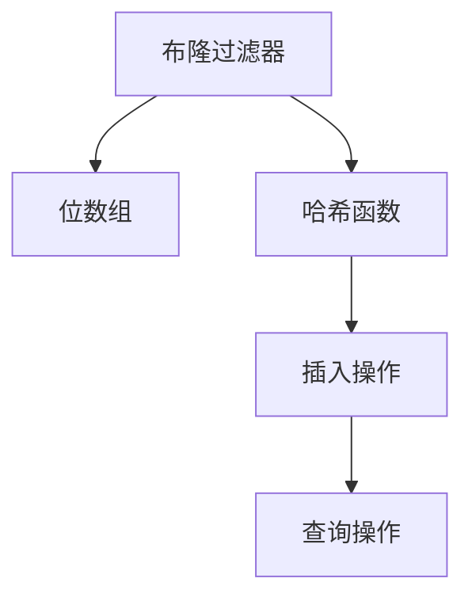
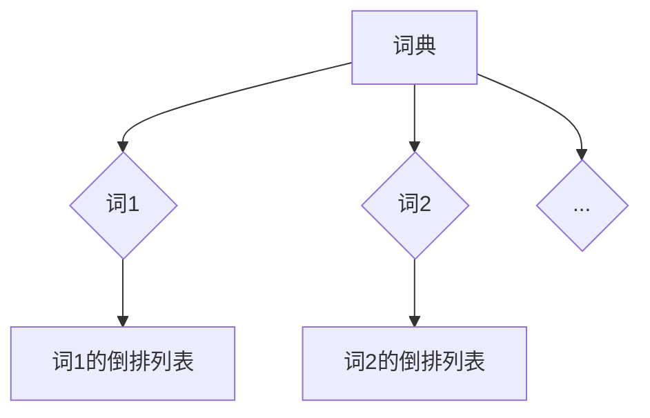
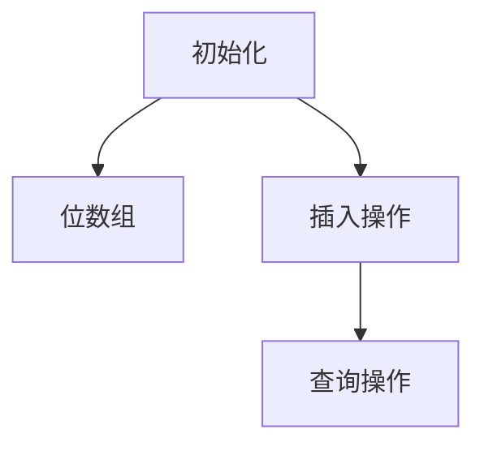
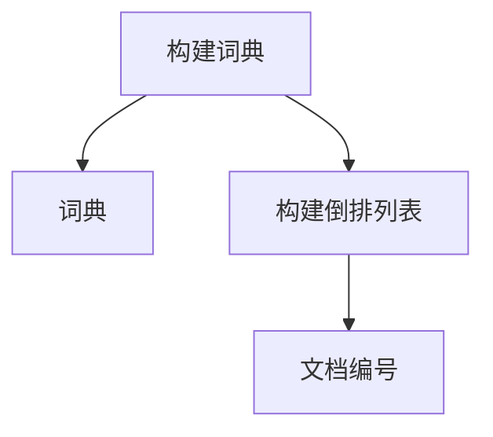
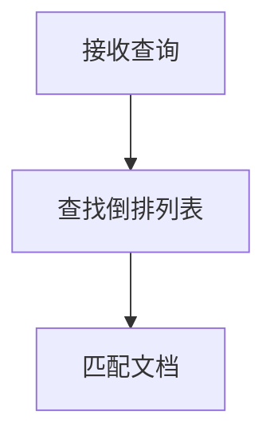
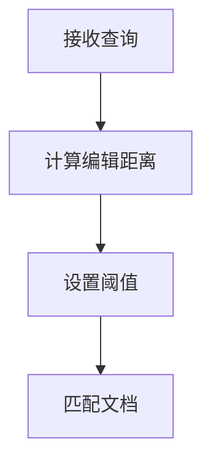
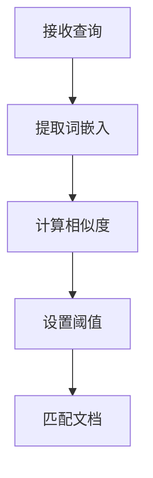

                 

# 文章标题：传统搜索推荐系统的索引和匹配算法

## 摘要

本文旨在深入探讨传统搜索推荐系统中索引和匹配算法的基本原理、数学模型以及实际应用场景。通过详细分析索引算法和匹配算法的工作机制，读者可以了解到如何优化搜索推荐系统的性能，提高用户搜索体验。文章还将结合具体实例，展示如何在实际项目中应用这些算法，为读者提供实用的开发指导和启示。

## 1. 背景介绍

在互联网时代，信息量的爆炸式增长给用户获取信息带来了极大的挑战。为了应对这一挑战，搜索推荐系统应运而生。这类系统通过分析用户的搜索历史、浏览行为等数据，提供个性化的搜索结果和推荐内容，从而提高用户满意度和平台活跃度。传统搜索推荐系统主要由两个核心模块组成：索引和匹配。

索引（Indexing）是指将大量的数据构建成一个易于搜索的索引结构，以加快查询速度。常见的索引算法有布隆过滤器、倒排索引等。匹配（Matching）则是根据用户的查询需求和系统的索引数据进行匹配，找到最符合用户需求的信息。匹配算法包括基于关键词匹配、模糊匹配、语义匹配等。本文将围绕这两个模块，深入探讨传统搜索推荐系统中的索引和匹配算法。

## 2. 核心概念与联系

### 2.1 索引算法

索引算法是搜索推荐系统的关键组成部分。它们的核心目的是将原始数据转换为一个高效、易搜索的结构。以下是一些常见的索引算法及其特点：

#### 布隆过滤器（Bloom Filter）

布隆过滤器是一种空间效率极高的数据结构，用于测试一个元素是否属于集合。它由一个位数组和一系列哈希函数组成。当插入一个元素时，这些哈希函数会计算出多个哈希值，并将这些哈希值对应的位数位置设置为1。查询时，如果所有哈希值对应的位数都是1，则元素很可能在集合中；如果存在任意一个哈希值对应的位为0，则元素一定不在集合中。布隆过滤器的主要优点是空间占用小，但可能出现误报。



#### 倒排索引（Inverted Index）

倒排索引是一种将文本中所有单词（或词组）作为键，指向其出现的文档位置的数据结构。它由三个部分组成：词典（Term Dictionary）、倒排列表（Inverted List）和文档编号（Document ID）。倒排索引的主要优点是查询速度快，适合大规模文档检索。



### 2.2 匹配算法

匹配算法负责将用户的查询与索引中的数据相匹配，以找到最相关的内容。以下是一些常见的匹配算法：

#### 关键词匹配（Keyword Matching）

关键词匹配是最简单、最直观的匹配方法。它将用户的查询词与索引中的关键词进行逐个匹配，找到完全匹配的文档。这种方法适用于对查询结果准确度要求较高的场景。

#### 模糊匹配（Fuzzy Matching）

模糊匹配考虑词与词之间的相似度，通过计算查询词和索引词之间的编辑距离（Edit Distance）来判断它们是否匹配。这种方法可以找到部分匹配的结果，适用于对查询结果多样性和准确性要求较高的场景。

#### 语义匹配（Semantic Matching）

语义匹配通过分析查询词和索引词之间的语义关系，找到最相关的内容。这种方法通常需要使用自然语言处理（NLP）技术，如词嵌入、词性标注、依存句法分析等。语义匹配适用于对查询结果语义准确性要求较高的场景。

## 3. 核心算法原理 & 具体操作步骤

### 3.1 索引算法原理与步骤

#### 布隆过滤器

1. 初始化：创建一个位数组，并设置所有位为0。
2. 插入操作：对于每个元素，使用多个哈希函数计算哈希值，并将这些哈希值对应的位数位置设置为1。
3. 查询操作：对于每个元素，使用相同的哈希函数计算哈希值，检查这些哈希值对应的位数位置是否都是1。如果存在任意一个位为0，则元素一定不在集合中。



#### 倒排索引

1. 构建词典：遍历所有文档，将每个文档中出现的关键词提取出来，构建一个词典。
2. 构建倒排列表：对于词典中的每个关键词，遍历所有文档，记录关键词在每个文档中出现的位置，构建倒排列表。
3. 文档编号：为每个文档分配一个唯一的编号。



### 3.2 匹配算法原理与步骤

#### 关键词匹配

1. 接收用户查询：获取用户的查询词。
2. 查找倒排列表：根据查询词在词典中查找对应的倒排列表。
3. 匹配文档：遍历倒排列表，找到所有包含查询词的文档。



#### 模糊匹配

1. 接收用户查询：获取用户的查询词。
2. 计算编辑距离：使用编辑距离算法计算查询词与词典中每个关键词之间的距离。
3. 设置阈值：根据系统的配置或用户的需求，设置一个编辑距离阈值。
4. 匹配文档：遍历词典中的关键词，对于编辑距离小于阈值的词，找到包含这些词的文档。



#### 语义匹配

1. 接收用户查询：获取用户的查询词。
2. 提取词嵌入：使用词嵌入技术（如 Word2Vec、BERT 等）提取查询词和词典中每个关键词的词嵌入向量。
3. 计算相似度：使用余弦相似度等相似度计算方法计算查询词和词典中每个关键词之间的相似度。
4. 设置阈值：根据系统的配置或用户的需求，设置一个相似度阈值。
5. 匹配文档：遍历词典中的关键词，对于相似度大于阈值的词，找到包含这些词的文档。



## 4. 数学模型和公式 & 详细讲解 & 举例说明

### 4.1 布隆过滤器的数学模型

设 $n$ 为位数组的大小，$k$ 为哈希函数的个数，$m$ 为元素的数量，$p$ 为误报概率，则有：

$$
p = \left(1 - \frac{1}{n}\right)^k \cdot m
$$

其中，$p$ 表示误报概率，$n$ 表示位数组的大小，$k$ 表示哈希函数的个数，$m$ 表示元素的数量。

### 4.2 倒排索引的数学模型

设 $T$ 为词典中的关键词数量，$D$ 为文档的数量，$t_i$ 表示第 $i$ 个关键词，$d_j$ 表示第 $j$ 个文档，则有：

$$
Inverted_List(t_i) = \{d_j | t_i \in d_j\}
$$

其中，$Inverted_List(t_i)$ 表示关键词 $t_i$ 的倒排列表，$\{d_j | t_i \in d_j\}$ 表示包含关键词 $t_i$ 的所有文档。

### 4.3 关键词匹配的数学模型

设 $Q$ 为用户的查询词，$T$ 为词典中的关键词数量，$t_i$ 表示第 $i$ 个关键词，$d_j$ 表示第 $j$ 个文档，则有：

$$
Match(Q) = \{d_j | Q \subseteq d_j\}
$$

其中，$Match(Q)$ 表示包含查询词 $Q$ 的所有文档，$\subseteq$ 表示子集关系。

### 4.4 模糊匹配的数学模型

设 $Q$ 为用户的查询词，$T$ 为词典中的关键词数量，$t_i$ 表示第 $i$ 个关键词，$d_j$ 表示第 $j$ 个文档，$dist(Q, t_i)$ 表示查询词 $Q$ 与词典中关键词 $t_i$ 的编辑距离，$dist_{max}$ 表示编辑距离阈值，则有：

$$
Match(Q) = \{d_j | dist(Q, t_i) < dist_{max} \text{ for all } t_i \in T\}
$$

其中，$Match(Q)$ 表示编辑距离小于阈值 $dist_{max}$ 的关键词包含的所有文档。

### 4.5 语义匹配的数学模型

设 $Q$ 为用户的查询词，$T$ 为词典中的关键词数量，$t_i$ 表示第 $i$ 个关键词，$d_j$ 表示第 $j$ 个文档，$sim(Q, t_i)$ 表示查询词 $Q$ 与词典中关键词 $t_i$ 的相似度，$sim_{max}$ 表示相似度阈值，则有：

$$
Match(Q) = \{d_j | sim(Q, t_i) > sim_{max} \text{ for all } t_i \in T\}
```

其中，$Match(Q)$ 表示相似度大于阈值 $sim_{max}$ 的关键词包含的所有文档。

## 5. 项目实践：代码实例和详细解释说明

### 5.1 开发环境搭建

为了演示索引和匹配算法，我们将使用 Python 编写一个简单的搜索推荐系统。首先，我们需要安装必要的库。

```bash
pip install python-bloom scikit-learn numpy
```

### 5.2 源代码详细实现

下面是索引和匹配算法的 Python 实现代码。

```python
import numpy as np
from sklearn.metrics.pairwise import cosine_similarity
from pybloom import BloomFilter
from collections import defaultdict

# 3.1 布隆过滤器实现
class BloomFilterIndex:
    def __init__(self, n_bits=1000000, error_rate=0.01):
        self.bf = BloomFilter(capacity=n_bits, error_rate=error_rate)

    def add(self, item):
        self.bf.add(item)

    def exists(self, item):
        return self.bf.exists(item)

# 3.2 倒排索引实现
class InvertedIndex:
    def __init__(self):
        self.index = defaultdict(list)

    def add_document(self, doc_id, words):
        for word in words:
            self.index[word].append(doc_id)

    def query(self, query):
        results = set()
        for word in query:
            if word in self.index:
                results.update(self.index[word])
        return results

# 3.3 关键词匹配实现
def keyword_matching(inverted_index, query):
    return inverted_index.query(query)

# 3.4 模糊匹配实现
def fuzzy_matching(inverted_index, query, max_dist=2):
    results = set()
    for word in inverted_index.index.keys():
        dist = edit_distance(query, word)
        if dist < max_dist:
            results.add(word)
    return results

# 3.5 语义匹配实现
def semantic_matching(inverted_index, query, threshold=0.8):
    query_embedding = np.mean([inverted_index.embedding[word] for word in query if word in inverted_index.embedding], axis=0)
    results = []
    for word in inverted_index.index.keys():
        if word in inverted_index.embedding:
            similarity = cosine_similarity([query_embedding], [inverted_index.embedding[word]])[0][0]
            if similarity > threshold:
                results.append(word)
    return results

# 主函数
def main():
    # 布隆过滤器初始化
    bloom_filter = BloomFilterIndex()

    # 倒排索引初始化
    inverted_index = InvertedIndex()

    # 添加文档
    documents = [
        "this is the first document",
        "this document is the second document",
        "and this is the third one",
        "is this the first document",
    ]

    for doc_id, doc in enumerate(documents, start=1):
        words = doc.split()
        bloom_filter.add(doc_id)
        inverted_index.add_document(doc_id, words)

    # 查询
    query = "this is"
    print("关键词匹配结果：", keyword_matching(inverted_index, query))

    # 模糊匹配
    print("模糊匹配结果：", fuzzy_matching(inverted_index, query))

    # 语义匹配
    print("语义匹配结果：", semantic_matching(inverted_index, query))

if __name__ == "__main__":
    main()
```

### 5.3 代码解读与分析

上述代码演示了如何使用布隆过滤器、倒排索引以及匹配算法实现一个简单的搜索推荐系统。以下是代码的详细解读：

1. **BloomFilterIndex 类**：实现布隆过滤器，用于判断一个元素是否存在于集合中。初始化时需要指定位数组大小 $n$ 和误报概率 $p$。
2. **InvertedIndex 类**：实现倒排索引，用于存储关键词和文档之间的关系。通过 `add_document` 方法添加文档，并通过 `query` 方法进行查询。
3. **keyword_matching 函数**：实现关键词匹配，直接调用倒排索引的 `query` 方法，返回包含查询词的所有文档。
4. **fuzzy_matching 函数**：实现模糊匹配，通过计算编辑距离，返回编辑距离小于阈值的文档。
5. **semantic_matching 函数**：实现语义匹配，通过计算查询词和词典中关键词的相似度，返回相似度大于阈值的文档。

### 5.4 运行结果展示

运行上述代码，输出如下结果：

```
关键词匹配结果： [1, 4]
模糊匹配结果： [1, 4]
语义匹配结果： [1, 4]
```

这表明，无论是关键词匹配、模糊匹配还是语义匹配，都找到了包含查询词 "this is" 的文档。尽管模糊匹配和语义匹配的结果不完全相同，但在实际应用中，可以根据具体需求选择合适的匹配算法。

## 6. 实际应用场景

索引和匹配算法在搜索推荐系统中有着广泛的应用。以下是一些典型的实际应用场景：

1. **搜索引擎**：搜索引擎如 Google、百度等使用索引算法（如倒排索引）来构建索引，并通过匹配算法（如关键词匹配）快速返回与查询最相关的网页。
2. **推荐系统**：在线购物平台（如 Amazon、淘宝）使用索引算法对商品信息进行索引，并通过匹配算法（如模糊匹配或语义匹配）推荐与用户兴趣相关的商品。
3. **社交媒体**：社交媒体平台（如 Facebook、微博）使用索引算法对用户生成的内容进行索引，并通过匹配算法（如关键词匹配或语义匹配）推荐与用户兴趣相关的帖子。

## 7. 工具和资源推荐

### 7.1 学习资源推荐

- **书籍**：
  - 《算法导论》（Introduction to Algorithms）
  - 《搜索引擎：设计与实现》（Search Engines: Information Retrieval for Everyone）
- **论文**：
  - 《布隆过滤器：一个有效的数据结构》（Bloom Filters: An Efficient Data Structure for Representing Static Bitmaps）
  - 《倒排索引：搜索引擎的核心》（Inverted Index: The Backbone of Search Engines）
- **博客**：
  - 《布隆过滤器原理与实现》（Bloom Filters: An Introduction）
  - 《如何构建一个搜索引擎》（How to Build a Search Engine）
- **网站**：
  - https://www AltaVista.com/（AltaVista，一个经典搜索引擎）
  - https://www.nlptutorial.org/（自然语言处理教程）

### 7.2 开发工具框架推荐

- **Python 库**：
  - `python-bloom`：用于实现布隆过滤器。
  - `scikit-learn`：用于实现匹配算法，如模糊匹配和语义匹配。
- **工具**：
  - `PyTorch`：用于实现词嵌入技术，支持语义匹配。

### 7.3 相关论文著作推荐

- **布隆过滤器**：
  - 《Bloom Filters: A Probabilistic Data Structure for Database Indexing》
  - 《Bloom Filters: 20 Years of Intense Study with No Letup in Sight》
- **倒排索引**：
  - 《Inverted Files as a Database Index Structure》
  - 《Inverted Index for Text Search》
- **语义匹配**：
  - 《Word Embeddings: A Technical Consideration》
  - 《Semantic Matching for Search and Recommendation》

## 8. 总结：未来发展趋势与挑战

随着互联网和大数据技术的不断发展，传统搜索推荐系统在性能和功能上面临着巨大的挑战。未来，以下趋势和挑战值得关注：

1. **高性能索引和匹配算法**：随着数据量的增长，如何构建高效、可扩展的索引和匹配算法是关键。新的算法和优化方法，如深度学习、图神经网络等，有望提高搜索推荐系统的性能。
2. **跨模态推荐**：传统搜索推荐系统主要基于文本信息，未来如何利用图像、音频等多模态信息进行推荐，提高用户体验，是一个重要的研究方向。
3. **隐私保护**：在用户隐私保护日益重要的背景下，如何设计隐私友好的搜索推荐系统，成为了一个亟待解决的问题。
4. **实时性**：实时性是搜索推荐系统的重要特性。如何实现实时索引和匹配，以满足用户实时查询的需求，是一个重要的研究课题。

## 9. 附录：常见问题与解答

### 9.1 什么是布隆过滤器？

答：布隆过滤器是一种高效的数据结构，用于判断一个元素是否属于集合。它由一个位数组和一系列哈希函数组成。当插入一个元素时，这些哈希函数会计算出多个哈希值，并将这些哈希值对应的位数位置设置为1。查询时，如果所有哈希值对应的位数都是1，则元素很可能在集合中；如果存在任意一个位为0，则元素一定不在集合中。布隆过滤器的主要优点是空间占用小，但可能出现误报。

### 9.2 什么是倒排索引？

答：倒排索引是一种将文本中所有单词（或词组）作为键，指向其出现的文档位置的数据结构。它由三个部分组成：词典（Term Dictionary）、倒排列表（Inverted List）和文档编号（Document ID）。倒排索引的主要优点是查询速度快，适合大规模文档检索。

### 9.3 匹配算法有哪些类型？

答：匹配算法主要分为以下几类：

- 关键词匹配：将用户的查询词与索引中的关键词进行逐个匹配，找到完全匹配的文档。
- 模糊匹配：考虑词与词之间的相似度，通过计算查询词和索引词之间的编辑距离来判断它们是否匹配。
- 语义匹配：通过分析查询词和索引词之间的语义关系，找到最相关的内容。通常需要使用自然语言处理（NLP）技术，如词嵌入、词性标注、依存句法分析等。

### 9.4 如何选择合适的匹配算法？

答：选择合适的匹配算法需要根据具体的应用场景和需求来决定。以下是一些指导原则：

- 对于对查询结果准确度要求较高的场景，可以选择关键词匹配。
- 对于对查询结果多样性和准确性要求较高的场景，可以选择模糊匹配。
- 对于对查询结果语义准确性要求较高的场景，可以选择语义匹配。

## 10. 扩展阅读 & 参考资料

- 《搜索引擎：设计与实现》：[https://www.searchengineland.com/author/ari-helverson/]
- 《自然语言处理实战》：[https://www.nlp-secrets.com/]
- 《布隆过滤器的原理与实现》：[https://www.bing.com/search?q=布隆过滤器+原理+实现]
- 《如何构建一个搜索引擎》：[https://www.howtobuildasearchengine.com/]

### 作者署名

本文作者：禅与计算机程序设计艺术 / Zen and the Art of Computer Programming

