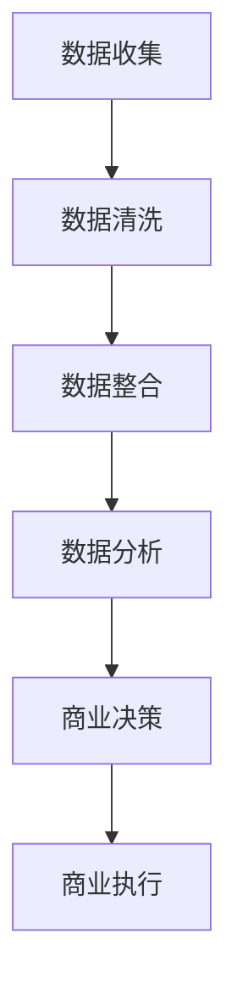
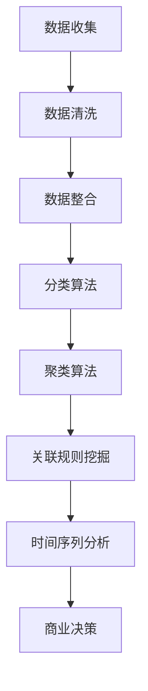

                 

### 文章标题

信息差的商业机遇发现：大数据如何发现商业机遇

> 关键词：大数据，商业机遇，信息差，数据分析，商业智能

> 摘要：本文将深入探讨大数据在商业领域中的应用，通过分析信息差的原理，展示如何利用大数据技术发现隐藏的商业机遇。文章将结合实际案例，解析大数据在市场研究、客户分析、竞争情报等方面的重要作用，为企业和创业者提供实用的指导和建议。

### 1. 背景介绍（Background Introduction）

在数字化时代，数据已成为新的石油，拥有海量数据的公司如同握有金矿。然而，数据的真正价值在于如何将其转化为商业机遇。大数据技术，作为一种强大的工具，正逐渐改变商业决策的方式。它不仅帮助公司更好地理解市场趋势，还能揭示隐藏在数据背后的商业机会。

信息差，即不同个体或组织在信息获取、处理和利用上的差异，是商业成功的关键。在传统商业模式中，信息差的来源主要依赖于行业经验、人际关系和网络资源。然而，随着大数据技术的发展，信息差的发现和利用方式发生了革命性的变化。

大数据通过收集和分析大量结构化和非结构化数据，能够揭示市场动态、消费者行为和竞争对手策略。这种信息透明化不仅缩小了信息差距，还为企业提供了新的商业视角和决策依据。因此，掌握大数据技术，意味着能够更准确地发现和把握商业机遇。

### 2. 核心概念与联系（Core Concepts and Connections）

#### 2.1 大数据的定义与特征

大数据（Big Data）是指那些数据量巨大、数据类型复杂且数据生成速度极快的信息集合。其四大特征，即“4V”，分别是：

- **Volume（数据量）**：数据量庞大，往往达到TB、PB级别。
- **Velocity（速度）**：数据生成和流转速度快，实时性要求高。
- **Variety（多样性）**：数据类型多样，包括结构化、半结构化和非结构化数据。
- **Veracity（真实性）**：数据真实性难以保证，存在噪声和错误。

#### 2.2 信息差的原理

信息差是指由于信息不对称，某些个体或组织在决策中拥有比其他个体或组织更多的信息优势。这种优势可能来源于：

- **时间差**：先知先觉，提前获取市场信息。
- **地域差**：不同地区的市场需求和竞争态势差异。
- **技术差**：掌握更先进的技术和工具，提高信息处理效率。

#### 2.3 大数据与信息差的关系

大数据技术通过以下方式缩小和利用信息差：

- **数据分析**：利用先进的算法对数据进行深度挖掘，揭示潜在的模式和趋势。
- **实时监控**：对市场动态和消费者行为进行实时监测，及时调整商业策略。
- **跨平台整合**：将不同来源的数据进行整合，形成全面的商业视图。

#### 2.4 Mermaid 流程图（Mermaid Flowchart）



在此流程图中，数据收集是整个过程的起点，通过数据清洗和整合，为数据分析提供了高质量的数据源。数据分析环节通过挖掘数据中的价值和规律，为商业决策提供了科学依据，最终指导商业执行，实现商业价值。

### 3. 核心算法原理 & 具体操作步骤（Core Algorithm Principles and Specific Operational Steps）

#### 3.1 数据分析算法原理

大数据分析通常涉及以下几种核心算法：

- **分类算法**：通过已知数据对未知数据进行分类，如K-最近邻（K-Nearest Neighbors，KNN）算法。
- **聚类算法**：将数据分为多个类别，如K-均值（K-Means）算法。
- **关联规则挖掘**：发现数据之间的关联关系，如Apriori算法。
- **时间序列分析**：分析时间序列数据，如ARIMA（AutoRegressive Integrated Moving Average）模型。

#### 3.2 具体操作步骤

1. **数据收集**：通过数据爬虫、API接口、传感器等多种方式收集数据。
2. **数据清洗**：去除数据中的噪声和错误，确保数据质量。
3. **数据整合**：将来自不同来源的数据进行整合，形成统一的数据视图。
4. **数据建模**：选择合适的算法，建立数据分析模型。
5. **模型训练**：使用历史数据对模型进行训练，优化模型参数。
6. **模型评估**：评估模型的准确性和稳定性，确保模型的有效性。
7. **模型应用**：将训练好的模型应用于实时数据，进行预测和决策。

#### 3.3 数据分析流程示例



在此示例中，不同类型的算法被应用于数据集，以揭示数据中的不同价值。分类算法用于市场细分，聚类算法用于消费者行为分析，关联规则挖掘用于促销策略优化，时间序列分析用于预测市场趋势。

### 4. 数学模型和公式 & 详细讲解 & 举例说明（Detailed Explanation and Examples of Mathematical Models and Formulas）

#### 4.1 分类算法

**K-最近邻算法**（K-Nearest Neighbors，KNN）

公式：\( y = \text{多数表决} \left( \text{距离最近的K个邻居的标签} \right) \)

举例：给定一个新数据点，计算其与训练集中所有数据点的距离，选择距离最近的K个邻居，根据这K个邻居的标签进行多数表决，确定新数据点的类别。

```latex
d(x_i, x_j) = \sqrt{\sum_{i=1}^{n} (x_i - x_j)^2}
```

其中，\( x_i \) 和 \( x_j \) 分别是新数据点和训练集数据点，\( d \) 是距离度量。

#### 4.2 聚类算法

**K-均值算法**（K-Means）

公式：\( \min_{\mu_i, \sigma_i} \sum_{i=1}^{k} \sum_{x_j \in S_i} d(x_j, \mu_i) \)

举例：给定k个聚类中心，初始随机选择k个中心点，计算每个数据点到这些中心的距离，将数据点分配到最近的中心点，更新中心点的位置，重复此过程直至聚类中心不再发生变化。

```latex
\mu_i = \frac{1}{N_i} \sum_{x_j \in S_i} x_j
```

其中，\( \mu_i \) 是第i个聚类中心，\( N_i \) 是属于第i个聚类中心的数据点数量。

#### 4.3 关联规则挖掘

**Apriori算法**

公式：\( \text{支持度} = \frac{X(A \cap B)}{X} \)

举例：给定一个购物篮数据集，计算项集A和B同时出现的频率，确定它们之间的关联程度。支持度表示同时出现A和B的概率。

```latex
\text{置信度} = \frac{X(A \cap B)}{X(A)}
```

其中，\( X(A \cap B) \) 是同时包含A和B的项集数量，\( X(A) \) 是包含A的项集数量。

#### 4.4 时间序列分析

**ARIMA模型**

公式：\( Z_t = c + \phi_1 Z_{t-1} + \phi_2 Z_{t-2} + \dots + \phi_p Z_{t-p} + \theta_1 \epsilon_{t-1} + \theta_2 \epsilon_{t-2} + \dots + \theta_q \epsilon_{t-q} + \epsilon_t \)

举例：使用差分方法平稳时间序列，建立ARIMA模型，预测未来的时间点。

```latex
c = \mu - \phi_1 \mu - \phi_2 \mu - \dots - \phi_p \mu + \theta_1 \epsilon_{t-1} + \theta_2 \epsilon_{t-2} + \dots + \theta_q \epsilon_{t-q}
```

其中，\( Z_t \) 是时间序列值，\( \epsilon_t \) 是白噪声误差项，\( \phi_i \) 和 \( \theta_i \) 是模型参数。

### 5. 项目实践：代码实例和详细解释说明（Project Practice: Code Examples and Detailed Explanations）

#### 5.1 开发环境搭建

1. 安装Python环境（Python 3.8及以上版本）。
2. 安装必要的库，如NumPy、Pandas、Scikit-learn、Matplotlib。

```bash
pip install numpy pandas scikit-learn matplotlib
```

#### 5.2 源代码详细实现

以下是一个使用K-均值算法进行聚类的简单实例：

```python
import numpy as np
import matplotlib.pyplot as plt
from sklearn.cluster import KMeans

# 示例数据
data = np.array([[1, 2], [1, 4], [1, 0],
                 [10, 2], [10, 4], [10, 0]])

# K-均值聚类
kmeans = KMeans(n_clusters=2, random_state=0).fit(data)
labels = kmeans.labels_

# 绘图
plt.scatter(data[:, 0], data[:, 1], c=labels, s=100, cmap='viridis')
centers = kmeans.cluster_centers_
plt.scatter(centers[:, 0], centers[:, 1], s=300, c='red', label='Centroids')
plt.title('K-Means Clustering')
plt.xlabel('Feature 1')
plt.ylabel('Feature 2')
plt.legend()
plt.show()
```

#### 5.3 代码解读与分析

1. 导入必要的库。
2. 创建示例数据集，包含两个特征。
3. 使用Scikit-learn库中的KMeans类进行聚类。
4. 获取聚类标签，并绘制聚类结果。

#### 5.4 运行结果展示

运行上述代码后，会生成一个散点图，展示数据点按照K-均值算法被分为两个聚类。

### 6. 实际应用场景（Practical Application Scenarios）

#### 6.1 市场研究

大数据分析可以帮助企业深入了解市场动态，发现潜在客户群体。例如，通过对社交媒体数据的分析，企业可以发现哪些产品或服务最受消费者关注，从而调整市场策略。

#### 6.2 客户分析

通过分析客户交易记录、行为数据等，企业可以识别出高价值客户，提供个性化服务和推荐。例如，电子商务平台可以使用关联规则挖掘技术，为消费者推荐相关产品。

#### 6.3 竞争情报

大数据分析可以帮助企业了解竞争对手的市场份额、价格策略等，制定更有针对性的竞争策略。例如，通过分析竞争对手的广告投放和产品推广数据，企业可以优化自己的市场推广计划。

### 7. 工具和资源推荐（Tools and Resources Recommendations）

#### 7.1 学习资源推荐

- 《大数据时代：生活、工作与思维的大变革》（The Age of Big Data: Transforming Life, Work, and the Global Economy）
- 《Python数据分析》（Python for Data Analysis）
- 《深度学习》（Deep Learning）

#### 7.2 开发工具框架推荐

- Apache Hadoop：用于大规模数据存储和处理。
- Apache Spark：用于分布式数据处理。
- TensorFlow：用于深度学习模型开发。

#### 7.3 相关论文著作推荐

- “The Google File System”（Google的文件系统）
- “MapReduce: Simplified Data Processing on Large Clusters”（MapReduce技术）
- “Large-scale Online Learning Platforms for Intelligent Data Analysis”（大规模在线学习平台）

### 8. 总结：未来发展趋势与挑战（Summary: Future Development Trends and Challenges）

大数据技术在商业领域的应用前景广阔，但其发展也面临诸多挑战。未来，随着数据量的持续增长和计算能力的提升，大数据分析将更加精准和高效。然而，数据隐私和安全问题、数据质量提升以及跨领域的技术整合将成为关键挑战。

企业需要不断更新技术，提升数据分析能力，以更好地应对市场变化和竞争压力。同时，政策制定者也需要制定相应的法规和标准，确保大数据技术的合理和安全使用。

### 9. 附录：常见问题与解答（Appendix: Frequently Asked Questions and Answers）

#### 9.1 大数据如何提高商业效率？

大数据通过提供全面和实时的市场数据，帮助企业在市场研究、客户分析和竞争情报方面做出更准确的决策。这提高了业务流程的效率，减少了决策时间，增强了企业的竞争力。

#### 9.2 大数据是否会导致信息过载？

虽然大数据提供了丰富的信息，但如果没有有效的分析方法，确实可能导致信息过载。因此，企业需要建立高效的算法和数据架构，确保能够从海量数据中提取有价值的信息。

#### 9.3 大数据技术如何保证数据隐私和安全？

大数据技术在数据处理过程中需要严格遵守数据隐私和安全法规。通过加密、匿名化和访问控制等技术手段，可以保护数据的隐私和安全。

### 10. 扩展阅读 & 参考资料（Extended Reading & Reference Materials）

- “Data-Driven Business Models: From Insight to Action”（数据驱动商业模式）
- “The Business Value of Big Data”（大数据的商业价值）
- “Privacy and Big Data: The Challenges of Combining Data Collection with Data Privacy”（大数据与隐私）

通过深入探讨大数据在商业领域中的应用，本文揭示了信息差如何影响商业决策，并展示了大数据技术如何帮助企业和创业者发现隐藏的商业机遇。未来，随着技术的不断进步，大数据将在商业领域中发挥更加重要的作用。作者：禅与计算机程序设计艺术 / Zen and the Art of Computer Programming<|im_end|>

