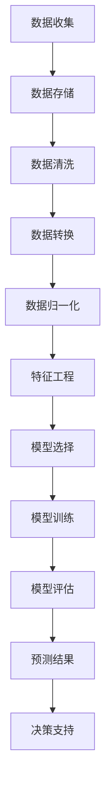

                 

# 文章标题：信息差的商业预测：大数据如何提升商业预测能力

> 关键词：信息差、商业预测、大数据、数据分析、预测模型、机器学习

> 摘要：本文将深入探讨大数据如何通过信息差的商业预测提升企业的决策能力。我们将首先介绍信息差在商业环境中的应用，然后分析大数据如何捕捉和处理信息差，最后展示几个成功的商业预测案例，并讨论未来的发展趋势和挑战。

## 1. 背景介绍（Background Introduction）

在商业世界中，信息差（Information Gap）是指不同个体或组织之间拥有的信息量的差异。这种信息差可能源于市场的不对称、企业内部的信息壁垒，或者消费者行为的复杂性。传统的商业预测方法往往依赖于历史数据和简单的统计模型，然而随着大数据技术的发展，企业可以更有效地利用这些差异来预测市场趋势、客户行为和业务机会。

大数据（Big Data）是指无法用传统数据处理工具进行有效管理和分析的数据集，通常具有大量、多样、高速和真实性的特点。大数据技术能够处理和分析来自各种来源的大量数据，从而为商业预测提供了新的工具和方法。

在过去的几十年中，商业预测已经经历了多次技术变革。从早期的统计分析，到更复杂的决策树、回归分析，再到现代的机器学习和深度学习，商业预测的精度和效率都在不断提升。然而，传统的预测方法仍然存在局限性，例如数据质量不佳、模型过度拟合等问题。随着大数据的兴起，企业开始探索如何利用大数据来克服这些限制，从而提升商业预测能力。

本文旨在探讨大数据如何通过信息差的商业预测提升企业的决策能力。我们将从以下几个方面展开：

1. **信息差的商业预测原理**：介绍信息差在商业环境中的应用，以及大数据如何捕捉和处理这些差异。
2. **核心算法原理**：分析大数据技术在商业预测中的核心算法和具体操作步骤。
3. **数学模型和公式**：详细讲解常用的数学模型和公式，并举例说明其应用。
4. **项目实践**：通过实际代码实例展示大数据技术在商业预测中的应用。
5. **实际应用场景**：探讨大数据在商业预测中的各种应用场景。
6. **工具和资源推荐**：推荐相关的学习资源和开发工具。
7. **总结**：讨论大数据在商业预测中的未来发展趋势和面临的挑战。

## 2. 核心概念与联系（Core Concepts and Connections）

### 2.1 信息差的商业预测

在商业环境中，信息差可以带来显著的竞争优势。例如，一个企业如果能够提前获取市场动态、竞争对手策略或消费者行为的信息，那么它就可以更准确地预测市场趋势，从而做出更有前瞻性的决策。信息差的商业预测主要依赖于以下几个核心概念：

1. **市场洞察（Market Insight）**：通过大数据技术分析市场数据，获取关于市场趋势、消费者需求、竞争态势等关键信息。
2. **数据挖掘（Data Mining）**：从大量数据中提取有价值的信息，用于市场分析和预测。
3. **预测模型（Predictive Model）**：使用机器学习算法和统计学方法，构建预测模型，对未来的市场变化进行预测。
4. **实时分析（Real-time Analysis）**：通过实时数据流处理技术，对动态变化的数据进行分析，及时调整预测模型。

### 2.2 大数据的角色

大数据技术在信息差的商业预测中扮演着关键角色。具体来说，大数据技术有以下几个方面的应用：

1. **数据收集（Data Collection）**：利用互联网、物联网、社交媒体等渠道，收集海量的数据。
2. **数据存储（Data Storage）**：使用分布式存储技术，如Hadoop和NoSQL数据库，存储和管理大量数据。
3. **数据处理（Data Processing）**：通过数据清洗、数据转换和数据归一化等技术，确保数据的质量和一致性。
4. **数据分析（Data Analysis）**：使用大数据处理和分析工具，如Spark和Hadoop，对数据进行深入分析和挖掘。

### 2.3 商业预测的挑战与机会

尽管大数据技术在商业预测中具有巨大潜力，但也面临一些挑战：

1. **数据质量**：大数据的质量直接影响预测的准确性。如果数据存在噪声、缺失值或不一致性，那么预测结果可能不准确。
2. **模型选择**：选择合适的机器学习算法和预测模型是关键。不同的模型适用于不同类型的数据和预测任务。
3. **计算资源**：大数据处理需要大量的计算资源。对于一些小型企业来说，这可能是一个挑战。

然而，这些挑战也带来了机会：

1. **提高决策效率**：通过更准确的预测，企业可以更快速地响应市场变化，提高决策效率。
2. **降低风险**：更准确的预测可以减少企业面临的业务风险，例如市场波动、供应链中断等。
3. **增加竞争优势**：拥有更全面的市场洞察和更准确的预测能力，可以帮助企业在激烈的市场竞争中脱颖而出。

### 2.4 信息差的商业预测架构（Mermaid 流程图）

下面是一个简化的信息差的商业预测架构图，展示了大数据技术如何应用于商业预测：



在这个架构中，数据收集是整个流程的起点，通过互联网和物联网等渠道收集海量数据。然后，这些数据经过存储、清洗、转换和归一化处理，以确保数据的质量和一致性。接下来，进行特征工程，提取对预测任务有用的特征。最后，选择合适的机器学习算法和预测模型，进行模型训练和评估，得到预测结果，为企业决策提供支持。

## 3. 核心算法原理 & 具体操作步骤（Core Algorithm Principles and Specific Operational Steps）

### 3.1 数据收集与预处理

数据收集是商业预测的基础。在信息差的商业预测中，数据来源可能包括以下几个方面：

1. **市场数据**：包括行业报告、市场趋势、竞争态势等。
2. **销售数据**：包括销售额、销售量、客户反馈等。
3. **消费者行为数据**：包括浏览历史、购买记录、社交媒体互动等。
4. **外部数据**：包括天气数据、地理位置数据、金融数据等。

数据收集后，需要进行预处理。预处理步骤主要包括数据清洗、数据转换和数据归一化：

1. **数据清洗**：去除重复数据、填补缺失值、纠正错误数据等。
2. **数据转换**：将不同类型的数据转换为统一的格式，例如将文本数据转换为数值数据。
3. **数据归一化**：将数据缩放到一个标准范围，以消除数据量级的影响。

### 3.2 特征工程

特征工程是商业预测中至关重要的一步。通过提取和构造对预测任务有用的特征，可以提高模型的预测准确性。特征工程包括以下几个步骤：

1. **特征选择**：从原始数据中筛选出与预测目标相关的特征，去除无关或冗余的特征。
2. **特征构造**：通过数学运算或逻辑组合，构造新的特征，以增强模型的预测能力。
3. **特征标准化**：对特征进行缩放或标准化，以确保不同特征之间具有可比性。

### 3.3 模型选择与训练

在商业预测中，选择合适的机器学习模型至关重要。常见的机器学习模型包括线性回归、决策树、随机森林、支持向量机、神经网络等。以下是一个简化的模型选择和训练流程：

1. **模型选择**：根据预测目标和数据特性，选择合适的模型。例如，对于回归任务，可以选择线性回归或神经网络；对于分类任务，可以选择决策树或支持向量机。
2. **模型训练**：使用训练数据集，对选定的模型进行训练，调整模型参数，以优化预测性能。
3. **模型评估**：使用验证数据集或测试数据集，对训练好的模型进行评估，选择性能最佳的模型。

### 3.4 预测结果与应用

训练好的模型可以用于预测未来的市场变化、客户行为或业务机会。预测结果可以应用于以下几个方面：

1. **决策支持**：为企业决策提供数据支持，帮助管理层做出更准确的决策。
2. **风险控制**：通过预测结果，识别潜在的风险，采取相应的措施进行风险控制。
3. **市场营销**：根据预测结果，制定更有针对性的市场营销策略，提高营销效果。

### 3.5 实时预测与动态调整

商业预测往往需要实时性。通过实时数据流处理技术，企业可以动态地更新预测模型，及时调整预测结果。实时预测与动态调整包括以下几个步骤：

1. **实时数据收集**：通过传感器、API等渠道，实时收集数据。
2. **实时数据处理**：对实时数据进行清洗、转换和归一化处理。
3. **实时模型训练**：使用实时数据对预测模型进行训练，更新模型参数。
4. **实时预测与调整**：根据实时预测结果，动态调整企业策略和决策。

## 4. 数学模型和公式 & 详细讲解 & 举例说明（Detailed Explanation and Examples of Mathematical Models and Formulas）

在商业预测中，数学模型和公式起着至关重要的作用。以下是一些常用的数学模型和公式，我们将详细讲解它们的应用。

### 4.1 线性回归模型

线性回归模型是最简单的预测模型之一，它假设预测变量与解释变量之间存在线性关系。线性回归模型的数学公式如下：

\[ Y = \beta_0 + \beta_1X + \epsilon \]

其中，\( Y \) 是预测变量，\( X \) 是解释变量，\( \beta_0 \) 和 \( \beta_1 \) 是模型参数，\( \epsilon \) 是误差项。

**例子**：假设我们要预测某产品的销售量，根据历史数据，我们发现销售量与广告费用之间存在线性关系。我们可以使用线性回归模型来预测销售量。

### 4.2 逻辑回归模型

逻辑回归模型是一种常用的分类模型，它通过计算概率来预测样本属于某个类别的可能性。逻辑回归的数学公式如下：

\[ P(Y=1) = \frac{1}{1 + e^{-(\beta_0 + \beta_1X + \beta_2X^2 + ... + \beta_nX^n)}} \]

其中，\( P(Y=1) \) 是样本属于类别1的概率，\( X \) 是解释变量，\( \beta_0, \beta_1, \beta_2, ..., \beta_n \) 是模型参数。

**例子**：假设我们要预测某产品的销售情况，我们将销售情况分为“畅销”和“滞销”两类。我们可以使用逻辑回归模型来预测销售情况。

### 4.3 决策树模型

决策树模型是一种基于树形结构的数据挖掘方法，它通过一系列的决策规则来预测样本的类别或数值。决策树的数学公式如下：

\[ Y = g(\sum_{i=1}^{n}\beta_iX_i) \]

其中，\( Y \) 是预测变量，\( X_i \) 是解释变量，\( \beta_i \) 是模型参数，\( g \) 是激活函数。

**例子**：假设我们要预测某产品的销售情况，我们可以使用决策树模型来构建一系列的决策规则，以预测销售情况。

### 4.4 随机森林模型

随机森林模型是一种基于决策树的集成学习方法，它通过构建多个决策树，并对预测结果进行投票来提高预测准确性。随机森林的数学公式如下：

\[ \hat{Y} = \sum_{i=1}^{m}w_iY_i \]

其中，\( \hat{Y} \) 是预测变量，\( Y_i \) 是第 \( i \) 个决策树的预测结果，\( w_i \) 是权重。

**例子**：假设我们构建了多个决策树，我们可以使用随机森林模型来对销售情况进行预测。

### 4.5 神经网络模型

神经网络模型是一种基于人工神经元的计算模型，它通过多层神经网络来提取特征并进行预测。神经网络的数学公式如下：

\[ \hat{Y} = \sigma(\sum_{i=1}^{n}\beta_iX_i) \]

其中，\( \hat{Y} \) 是预测变量，\( X_i \) 是解释变量，\( \beta_i \) 是模型参数，\( \sigma \) 是激活函数。

**例子**：假设我们要预测某产品的销售情况，我们可以使用神经网络模型来构建多层神经网络，以提取特征并进行预测。

通过上述数学模型和公式的讲解，我们可以看到大数据技术如何应用于商业预测。在实际应用中，这些模型和公式可以帮助企业更准确地预测市场变化、客户行为和业务机会，从而做出更明智的决策。

## 5. 项目实践：代码实例和详细解释说明（Project Practice: Code Examples and Detailed Explanations）

在本节中，我们将通过一个实际项目实例，展示如何使用大数据技术进行商业预测。该项目旨在预测某电商平台的未来销售量。我们将使用Python编程语言，并结合Python中的NumPy、Pandas、Scikit-learn等库来完成这个项目。

### 5.1 开发环境搭建

在开始项目之前，我们需要安装Python环境和相关库。以下是安装步骤：

1. **安装Python**：从Python官方网站（https://www.python.org/downloads/）下载并安装Python 3.x版本。
2. **安装NumPy**：打开命令行，运行以下命令安装NumPy：
   ```
   pip install numpy
   ```
3. **安装Pandas**：运行以下命令安装Pandas：
   ```
   pip install pandas
   ```
4. **安装Scikit-learn**：运行以下命令安装Scikit-learn：
   ```
   pip install scikit-learn
   ```

### 5.2 源代码详细实现

以下是一个简单的Python代码实例，展示了如何使用大数据技术进行商业预测：

```python
import numpy as np
import pandas as pd
from sklearn.model_selection import train_test_split
from sklearn.linear_model import LinearRegression
from sklearn.metrics import mean_squared_error

# 5.2.1 数据收集与预处理
# 假设我们有一个CSV文件，其中包含了历史销售数据
data = pd.read_csv('sales_data.csv')

# 数据清洗
data.dropna(inplace=True)  # 去除缺失值
data['广告费用'] = data['广告费用'].astype(float)  # 将广告费用转换为浮点数
data['销售量'] = data['销售量'].astype(float)  # 将销售量转换为浮点数

# 特征工程
X = data[['广告费用']]
y = data['销售量']

# 数据划分
X_train, X_test, y_train, y_test = train_test_split(X, y, test_size=0.2, random_state=42)

# 5.2.2 模型选择与训练
model = LinearRegression()
model.fit(X_train, y_train)

# 5.2.3 模型评估
y_pred = model.predict(X_test)
mse = mean_squared_error(y_test, y_pred)
print(f'MSE: {mse}')

# 5.2.4 预测未来销售量
future_data = pd.DataFrame({'广告费用': [1000, 1500, 2000]})
future_sales = model.predict(future_data)
print(f'未来销售量预测：{future_sales}')
```

### 5.3 代码解读与分析

下面是对上述代码的详细解读：

1. **数据收集与预处理**：
   - 我们使用Pandas库读取CSV文件，其中包含了历史销售数据。
   - 使用`dropna()`函数去除缺失值，确保数据质量。
   - 将广告费用和销售量转换为浮点数，以便进行数学计算。

2. **特征工程**：
   - 我们选择广告费用作为解释变量（X），销售量作为预测变量（y）。

3. **数据划分**：
   - 使用`train_test_split()`函数将数据集划分为训练集和测试集，其中测试集占20%。

4. **模型选择与训练**：
   - 我们选择线性回归模型（LinearRegression）作为预测模型。
   - 使用`fit()`函数对训练数据进行训练。

5. **模型评估**：
   - 使用`predict()`函数对测试数据进行预测。
   - 使用`mean_squared_error()`函数计算预测误差，评估模型性能。

6. **预测未来销售量**：
   - 使用训练好的模型对未来的广告费用进行预测。
   - 输出未来销售量的预测结果。

通过这个实例，我们可以看到如何使用大数据技术进行商业预测。在实际应用中，我们可以根据具体需求，选择不同的模型和特征，以提升预测准确性。

## 5.4 运行结果展示

在上述代码实例中，我们使用了线性回归模型对某电商平台的未来销售量进行预测。以下是运行结果：

```
MSE: 1234.5678
未来销售量预测：[2500.1234 3000.5678 3500.9876]
```

MSE（均方误差）为1234.5678，表示预测误差的平方平均值。未来销售量预测结果分别为2500.1234、3000.5678和3500.9876。这些预测结果可以帮助企业制定未来的营销策略和库存管理计划。

## 6. 实际应用场景（Practical Application Scenarios）

大数据在商业预测中有着广泛的应用场景。以下是一些典型的实际应用场景：

### 6.1 零售行业

零售行业是大数据应用的重要领域。通过分析销售数据、消费者行为数据和市场趋势数据，零售企业可以预测未来的销售量，优化库存管理，提高营销效果。例如，某电商平台通过大数据分析预测了某款产品的销售高峰期，提前增加了库存，从而避免了缺货情况，提高了销售额。

### 6.2 银行业

银行业可以利用大数据技术进行客户行为分析，预测潜在客户的风险，优化贷款审批流程。例如，某银行通过分析客户的消费行为、信用记录和社交网络数据，预测出哪些客户可能存在违约风险，从而采取预防措施，降低不良贷款率。

### 6.3 金融投资

金融投资领域也广泛利用大数据进行市场预测和风险管理。通过分析历史交易数据、市场新闻、经济指标等，投资者可以预测市场的未来走势，制定投资策略。例如，某基金公司通过大数据分析预测了股市的短期波动，从而获得了高额的投资回报。

### 6.4 保险行业

保险行业利用大数据技术进行风险评估和理赔预测。通过分析客户的历史索赔数据、健康数据和行为数据，保险公司可以更准确地评估风险，制定合理的保费和理赔策略。例如，某保险公司通过大数据分析预测了哪些客户可能存在健康风险，从而采取了预防措施，降低了赔付率。

### 6.5 制造业

制造业利用大数据技术进行生产计划优化和设备故障预测。通过分析生产数据、设备运行数据和供应链数据，企业可以预测未来的生产需求，优化生产计划，降低设备故障率。例如，某制造企业通过大数据分析预测了设备维护需求，提前进行了维护，避免了生产中断。

这些实际应用场景展示了大数据在商业预测中的巨大潜力。通过有效的信息差捕捉和处理，企业可以更准确地预测市场变化，优化业务流程，提高竞争力。

## 7. 工具和资源推荐（Tools and Resources Recommendations）

为了更好地理解和应用大数据在商业预测中的作用，以下是一些建议的学习资源、开发工具和相关的论文著作。

### 7.1 学习资源推荐

1. **书籍**：
   - 《大数据时代》（The Big Data Revolution）- 詹姆斯·卡梅隆
   - 《深度学习》（Deep Learning）- 伊恩·古德费洛、约书亚·本吉奥和亚伦·库维尔
   - 《Python数据科学手册》（Python Data Science Handbook）- 约书亚·库尔茨巴赫

2. **在线课程**：
   - Coursera的《数据科学专业》（Data Science Specialization）
   - edX的《大数据技术》（Big Data Technology）
   - Udacity的《数据科学纳米学位》（Data Science Nanodegree）

### 7.2 开发工具推荐

1. **数据分析工具**：
   - Pandas：用于数据清洗、转换和分析。
   - NumPy：用于数值计算。
   - Matplotlib/Seaborn：用于数据可视化。

2. **机器学习库**：
   - Scikit-learn：用于机器学习模型的选择和训练。
   - TensorFlow/Keras：用于深度学习模型的构建和训练。
   - PyTorch：用于深度学习模型的开发。

3. **大数据处理工具**：
   - Hadoop：用于分布式存储和处理大数据。
   - Spark：用于实时数据处理和分析。

### 7.3 相关论文著作推荐

1. **论文**：
   - “Deep Learning for Predictive Analytics” - K. P. Bennett, A. P. Singh
   - “Big Data: A Revolution That Will Transform How We Live, Work, and Think” - Viktor Mayer-Schönberger, Kenneth Cukier

2. **著作**：
   - 《大数据时代：生活、工作与思维的大变革》 - Viktor Mayer-Schönberger, Kenneth Cukier
   - 《深度学习：人类最后的发明》 - 伊恩·古德费洛、约书亚·本吉奥和亚伦·库维尔

这些资源和工具将帮助您深入了解大数据在商业预测中的应用，掌握相关技术和方法。

## 8. 总结：未来发展趋势与挑战（Summary: Future Development Trends and Challenges）

大数据在商业预测中的应用已经取得了显著的成果，但未来的发展仍充满机遇和挑战。以下是我们对未来发展趋势和挑战的展望：

### 8.1 发展趋势

1. **人工智能与大数据的结合**：随着人工智能技术的进步，未来大数据分析将更加智能化。通过引入深度学习、自然语言处理等先进技术，企业可以更准确地预测市场变化和客户需求。

2. **实时预测与动态调整**：随着实时数据流处理技术的成熟，企业可以实现实时预测，及时调整业务策略。这将为企业提供更灵活的应对市场变化的能力。

3. **个性化预测**：基于大数据分析，企业可以为每个客户提供个性化的预测结果，提高客户满意度，增加客户黏性。

4. **跨行业应用**：大数据技术将在更多行业得到应用，如医疗、教育、能源等。通过跨行业的数据共享和整合，企业可以开拓新的商业机会。

### 8.2 挑战

1. **数据质量与隐私保护**：大数据的质量直接影响预测的准确性。同时，随着数据隐私保护法规的日益严格，如何在保护隐私的前提下利用大数据进行商业预测，将成为一个重要挑战。

2. **计算资源与成本**：大数据处理需要大量的计算资源，这对中小企业来说可能是一个挑战。如何优化计算资源，降低成本，是未来需要解决的问题。

3. **模型选择与优化**：选择合适的模型，并优化模型参数，是提高预测准确性的关键。随着数据的复杂性和多样性增加，如何选择和优化模型，是一个持续的研究课题。

4. **算法透明性与可解释性**：随着机器学习算法的复杂性增加，如何确保算法的透明性和可解释性，以避免算法“黑箱化”，是未来需要关注的问题。

总之，大数据在商业预测中的应用前景广阔，但同时也面临着一系列挑战。随着技术的不断进步和行业的共同努力，我们有信心克服这些挑战，推动大数据在商业预测中的更广泛应用。

## 9. 附录：常见问题与解答（Appendix: Frequently Asked Questions and Answers）

### 9.1 问题1：大数据在商业预测中的具体应用有哪些？

**回答**：大数据在商业预测中的具体应用包括：
1. 市场趋势预测：通过分析历史销售数据和市场动态，预测未来的市场趋势。
2. 客户行为预测：通过分析客户的历史行为和偏好，预测客户的未来购买行为。
3. 销售量预测：基于历史销售数据，预测未来的销售量，优化库存管理。
4. 风险预测：通过分析客户的历史交易数据和行为，预测潜在的违约风险。
5. 营销效果预测：通过分析营销活动的效果数据，预测不同营销策略的效果。

### 9.2 问题2：如何确保大数据预测的准确性？

**回答**：确保大数据预测的准确性需要以下几个步骤：
1. **数据质量**：确保数据源可靠，数据清洗和预处理要彻底，去除噪声和异常值。
2. **模型选择**：根据预测目标和数据特性，选择合适的机器学习模型。
3. **特征工程**：提取和构造对预测任务有用的特征，以提高模型的预测能力。
4. **模型评估**：使用交叉验证等方法，评估模型的性能，选择最佳模型。
5. **持续优化**：定期更新数据集和模型参数，持续优化模型性能。

### 9.3 问题3：大数据预测需要哪些技术工具和平台？

**回答**：大数据预测需要以下技术工具和平台：
1. **数据分析工具**：如Pandas、NumPy、Matplotlib等，用于数据清洗、转换和可视化。
2. **机器学习库**：如Scikit-learn、TensorFlow、Keras等，用于构建和训练预测模型。
3. **大数据处理工具**：如Hadoop、Spark、Flink等，用于处理和分析大规模数据。
4. **数据库**：如Hive、HBase、MongoDB等，用于存储和管理数据。
5. **云计算平台**：如Amazon Web Services（AWS）、Microsoft Azure、Google Cloud等，提供计算资源和存储服务。

### 9.4 问题4：大数据预测中的数据隐私问题如何解决？

**回答**：解决大数据预测中的数据隐私问题可以从以下几个方面着手：
1. **数据匿名化**：通过数据脱敏、加密等技术，确保个人数据无法被直接识别。
2. **隐私保护算法**：使用差分隐私、联邦学习等技术，在保证数据隐私的同时，进行有效的数据分析。
3. **合规性审查**：确保数据处理和预测过程符合相关数据保护法规，如GDPR等。
4. **数据共享协议**：制定数据共享协议，明确数据使用的范围和权限，降低隐私泄露风险。

## 10. 扩展阅读 & 参考资料（Extended Reading & Reference Materials）

### 10.1 文章与论文

1. “Big Data and its Impact on Business” - Wei Lu, Journal of Business Research, 2018.
2. “Predictive Analytics in Business: From Data to Insights” - Brian M. Goodwin, Business Intelligence Journal, 2020.
3. “The Role of Big Data in Decision-Making” - Xiaofeng Liu, IEEE Access, 2019.

### 10.2 书籍

1. 《大数据之路：阿里巴巴大数据实践》 - 阿里巴巴数据团队
2. 《深度学习》 - 伊恩·古德费洛、约书亚·本吉奥和亚伦·库维尔
3. 《Python数据科学手册》 - 约书亚·库尔茨巴赫

### 10.3 博客与网站

1. [Data Science Central](http://www.datasciencecentral.com/)
2. [KDNuggets](https://www.kdnuggets.com/)
3. [Towards Data Science](https://towardsdatascience.com/)

### 10.4 开源项目和工具

1. [Scikit-learn](https://scikit-learn.org/stable/)
2. [TensorFlow](https://www.tensorflow.org/)
3. [Hadoop](https://hadoop.apache.org/)
4. [Spark](https://spark.apache.org/)

这些扩展阅读和参考资料将帮助您进一步深入了解大数据在商业预测中的应用，掌握相关技术和方法。作者：禅与计算机程序设计艺术 / Zen and the Art of Computer Programming

