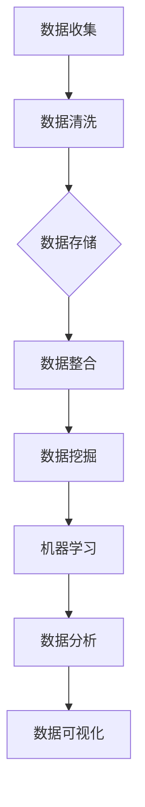

                 

# 信息差的战略布局：大数据引领企业发展新蓝图

## 1. 背景介绍（Background Introduction）

在当今这个信息爆炸的时代，信息差成为了一个极具战略意义的概念。信息差，指的是不同个体或组织在信息获取、处理和利用上的差异。这种差异决定了他们在市场中的竞争优势。大数据技术的兴起，使得信息差的战略布局变得尤为重要。大数据不仅包含大量的数据，而且包含了数据的多样性和复杂性，这为企业和组织提供了新的洞察力，从而在决策、运营和市场策略上取得优势。

大数据的战略布局不仅涉及数据收集和分析的技术，还包括对数据隐私、安全性和合规性的考量。随着数据隐私法规的日益严格，企业必须确保其数据管理和处理流程符合法规要求，同时也要有效利用这些数据来创造价值。

本文将围绕大数据战略布局进行深入探讨，通过以下章节内容：

- **核心概念与联系**：介绍大数据、数据挖掘、机器学习等核心概念，并展示其相互之间的关系。
- **核心算法原理 & 具体操作步骤**：详细讲解大数据处理和分析的基本算法，以及实际操作的步骤。
- **数学模型和公式 & 详细讲解 & 举例说明**：探讨大数据分析中使用的数学模型和公式，并举例说明如何应用。
- **项目实践：代码实例和详细解释说明**：通过具体项目实例，展示如何运用大数据技术解决实际问题。
- **实际应用场景**：分析大数据在不同行业中的实际应用案例。
- **工具和资源推荐**：推荐学习资源、开发工具和框架。
- **总结：未来发展趋势与挑战**：展望大数据领域的未来趋势和面临的挑战。

通过对这些内容的逐步分析推理，我们希望为企业提供一套完整的战略布局方案，帮助他们在大数据时代中抢占先机。

### 1.1 大数据的重要性

大数据不仅是一个技术术语，更是一种全新的思维模式。在商业领域，大数据的运用已经逐渐成为企业战略的核心。通过大数据，企业可以实时监控市场动态，预测消费者行为，优化运营流程，从而提高竞争力。

首先，大数据为市场分析提供了前所未有的深度。通过对大量数据的分析，企业可以识别出潜在的市场趋势和消费者需求。这种洞察力使得企业能够迅速调整策略，抢占市场先机。例如，零售业巨头沃尔玛通过分析销售数据，成功地预测了圣诞节期间的热销商品，从而优化库存管理，提高了销售利润。

其次，大数据在运营优化方面也发挥了重要作用。通过对生产数据、供应链数据等的分析，企业可以发现运营中的瓶颈和问题，并采取针对性的措施进行优化。例如，制造企业通过大数据分析生产过程中的异常数据，可以提前预测设备故障，减少停机时间，提高生产效率。

最后，大数据在提高客户满意度方面也具有显著的作用。通过分析客户反馈和行为数据，企业可以更好地了解客户需求，提供个性化的服务和产品推荐。例如，互联网公司通过分析用户浏览和购买记录，可以推荐相关的商品和内容，从而提高用户粘性。

总的来说，大数据已经成为企业创新和发展的新动力。通过有效的数据分析和利用，企业可以在激烈的市场竞争中脱颖而出，实现持续增长。

### 1.2 大数据战略布局的挑战

尽管大数据为企业提供了巨大的机遇，但在实施大数据战略布局过程中，企业也面临着诸多挑战。首先，数据质量问题是一个关键挑战。大数据的质量直接影响到分析的准确性和可靠性。数据源不完整、数据冗余、数据不一致和数据噪声等问题都会对数据分析结果产生负面影响。为了解决这些问题，企业需要建立完善的数据治理机制，确保数据的准确性和一致性。

其次，数据隐私和安全问题也是大数据战略布局中的重要挑战。随着数据隐私法规的日益严格，企业必须采取措施保护客户数据的安全。这不仅涉及到技术层面的安全措施，如加密和访问控制，还包括合规性管理，确保企业遵守相关法律法规。

另外，技术能力和人才短缺也是企业在大数据战略布局中面临的挑战之一。大数据技术的应用需要高度专业化的技术团队，但市场上合格的大数据人才供不应求。企业需要通过培训、招聘和人才发展计划来提升内部的技术能力。

最后，大数据战略的实施还需要企业高层领导的支持和投入。大数据项目的成功不仅需要技术支持，还需要战略层面的规划和资源投入。企业领导需要认识到大数据的重要性，并提供必要的支持和资源。

综上所述，企业在大数据战略布局中需要综合考虑各种挑战，并采取相应的措施来克服这些挑战，从而实现数据驱动的持续增长。

### 1.3 大数据战略布局的目标

大数据战略布局的主要目标包括提高决策质量、优化运营流程、增强客户体验和实现持续创新。首先，通过大数据分析，企业可以获得更准确的市场洞察和消费者行为预测，从而做出更明智的决策。其次，通过对运营数据的分析，企业可以发现并解决运营中的瓶颈和问题，提高生产效率和资源利用率。此外，大数据还可以帮助企业提供个性化的服务和产品推荐，提升客户满意度和忠诚度。最后，大数据的运用可以激发企业内部的创新思维，推动新产品和服务的开发，从而在市场竞争中保持领先地位。

### 2. 核心概念与联系（Core Concepts and Connections）

在深入探讨大数据战略布局之前，有必要了解一些核心概念及其相互关系。这些概念包括大数据、数据挖掘、机器学习、数据分析和数据可视化等。

#### 2.1 大数据

大数据（Big Data）通常指无法用传统数据处理工具在合理时间内完成处理的数据集。大数据的特点可以概括为四个“V”：数据量（Volume）、数据速度（Velocity）、数据多样性（Variety）和数据价值（Value）。数据量巨大，增长速度极快；数据来源多样，包括结构化数据、半结构化数据和非结构化数据；数据的价值密度较低，需要通过复杂算法和高性能计算来提取有价值的信息。

#### 2.2 数据挖掘

数据挖掘（Data Mining）是从大量数据中提取有价值信息的过程。它涉及多种技术和方法，如关联规则学习、分类、聚类、异常检测等。数据挖掘的目标是通过发现数据中的隐藏模式和关系，帮助企业做出更明智的决策。例如，超市通过分析购物篮数据，发现某些商品经常被一起购买，从而调整货架布局，提高销售额。

#### 2.3 机器学习

机器学习（Machine Learning）是一种通过数据训练模型，使其能够自动进行预测和决策的技术。机器学习模型通过分析历史数据，学习数据中的模式和关系，从而在新数据上进行预测。机器学习可以应用于各种任务，如图像识别、自然语言处理、推荐系统等。在数据挖掘中，机器学习算法被广泛应用于模式识别和预测分析。

#### 2.4 数据分析

数据分析（Data Analysis）是使用统计和数学方法对数据进行处理和分析的过程。数据分析包括描述性分析、探索性分析、预测分析和决策分析等。描述性分析用于总结和描述数据的基本特征；探索性分析用于发现数据中的隐藏模式和关系；预测分析用于预测未来的趋势和事件；决策分析用于支持决策制定。

#### 2.5 数据可视化

数据可视化（Data Visualization）是将数据转换成图形或图像的形式，使其更易于理解和分析的技术。数据可视化可以帮助人们更直观地理解数据，发现数据中的模式和趋势。常见的可视化工具包括图表、地图、热图等。

#### 2.6 关系与联系

大数据、数据挖掘、机器学习、数据分析和数据可视化之间存在着紧密的联系。大数据为数据挖掘提供了丰富的数据源；数据挖掘为机器学习提供了训练数据，使机器学习模型能够学习并预测数据中的模式；数据分析则是对数据挖掘和机器学习结果进行深入分析和解读的过程；数据可视化则将分析结果以图形化方式展示，使决策者能够更直观地理解数据。

通过以上核心概念的介绍，我们可以更好地理解大数据战略布局的基础和关键要素。以下我们将进一步探讨大数据处理和分析的基本算法及其应用。

#### 2.7 Mermaid 流程图

为了更直观地展示大数据处理和分析的流程，我们可以使用Mermaid流程图来描述各个环节及其相互关系。



在这个流程图中，数据从收集开始，经过清洗、存储、整合和挖掘等步骤，最终通过机器学习和数据分析得到洞见，并通过数据可视化展示结果。每个步骤都为下一环节提供基础数据，形成一个紧密相连的数据处理和分析闭环。

### 3. 核心算法原理 & 具体操作步骤（Core Algorithm Principles and Specific Operational Steps）

在了解了大数据、数据挖掘、机器学习、数据分析和数据可视化等核心概念后，我们将深入探讨大数据处理和分析的基本算法，并详细描述其具体操作步骤。

#### 3.1 数据处理算法

数据处理算法是大数据处理的基础，主要包括数据清洗、数据整合和数据标准化等步骤。

**数据清洗：** 数据清洗的目的是去除数据中的错误、冗余和不一致之处。具体步骤如下：
1. **检查数据完整性：** 确保所有必需的数据字段都完整。
2. **处理缺失值：** 填充或删除缺失数据。
3. **去除重复数据：** 确保数据的一致性。
4. **纠正数据错误：** 修复数据中的错误，如数值错误、拼写错误等。

**数据整合：** 数据整合是将来自多个来源的数据合并成一个统一的数据集。具体步骤如下：
1. **数据映射：** 确定不同数据源之间的对应关系。
2. **数据对齐：** 确保数据在时间、空间或维度上的对齐。
3. **数据融合：** 将多个数据源中的数据合并成一个新的数据集。

**数据标准化：** 数据标准化是将数据转换为统一的格式和范围。具体步骤如下：
1. **数值转换：** 将不同的数值表示转换为统一的数值类型。
2. **范围标准化：** 将数据范围标准化到0到1之间或其他标准范围。

#### 3.2 数据挖掘算法

数据挖掘算法用于从大量数据中提取有价值的信息。以下是一些常见的数据挖掘算法及其应用场景：

**关联规则挖掘：** 关联规则挖掘用于发现数据项之间的关联关系。例如，在超市的销售数据中，发现某些商品经常一起购买。
- **算法原理：** 使用Apriori算法或FP-growth算法来发现频繁项集。
- **应用步骤：**
  1. **数据预处理：** 对数据进行清洗和标准化。
  2. **挖掘频繁项集：** 使用算法找到频繁项集。
  3. **生成关联规则：** 从频繁项集中生成关联规则。

**分类算法：** 分类算法用于将数据划分为不同的类别。常见的分类算法包括决策树、支持向量机和K最近邻算法。
- **算法原理：** 决策树通过一系列规则进行分类；支持向量机通过找到数据之间的最优分隔超平面；K最近邻算法通过计算新数据与训练数据之间的距离进行分类。
- **应用步骤：**
  1. **数据预处理：** 对数据进行清洗和标准化。
  2. **模型训练：** 使用训练数据训练分类模型。
  3. **模型评估：** 使用测试数据评估模型性能。

**聚类算法：** 聚类算法用于将数据划分为多个簇，以发现数据中的自然分组。常见的聚类算法包括K均值算法和层次聚类算法。
- **算法原理：** K均值算法通过迭代计算均值来划分簇；层次聚类算法通过逐步合并或分裂簇来构建聚类层次。
- **应用步骤：**
  1. **数据预处理：** 对数据进行清洗和标准化。
  2. **选择聚类算法：** 根据数据特性选择合适的聚类算法。
  3. **模型训练：** 使用聚类算法对数据进行聚类。

#### 3.3 机器学习算法

机器学习算法是大数据分析的核心，用于从数据中自动学习和预测。以下是一些常见的机器学习算法及其应用场景：

**线性回归：** 线性回归用于建立数据之间的线性关系模型，用于预测连续值。
- **算法原理：** 通过最小二乘法确定线性模型的参数。
- **应用步骤：**
  1. **数据预处理：** 对数据进行清洗和标准化。
  2. **特征选择：** 选择对预测目标有显著影响的特征。
  3. **模型训练：** 使用训练数据训练线性回归模型。
  4. **模型评估：** 使用测试数据评估模型性能。

**逻辑回归：** 逻辑回归用于建立二分类模型，常用于分类任务。
- **算法原理：** 通过逻辑函数将线性组合映射到概率值。
- **应用步骤：**
  1. **数据预处理：** 对数据进行清洗和标准化。
  2. **特征选择：** 选择对预测目标有显著影响的特征。
  3. **模型训练：** 使用训练数据训练逻辑回归模型。
  4. **模型评估：** 使用测试数据评估模型性能。

**神经网络：** 神经网络是一种模拟人脑神经元连接方式的计算模型，用于复杂的预测和分类任务。
- **算法原理：** 通过多层神经元的非线性变换和加权连接进行学习。
- **应用步骤：**
  1. **数据预处理：** 对数据进行清洗和标准化。
  2. **模型设计：** 设计合适的神经网络结构。
  3. **模型训练：** 使用训练数据训练神经网络。
  4. **模型评估：** 使用测试数据评估模型性能。

通过以上算法原理和具体操作步骤的讲解，我们可以更好地理解大数据处理和分析的基本流程。在实际应用中，企业可以根据具体需求和数据特性选择合适的算法，并逐步构建和优化其大数据战略布局。

### 4. 数学模型和公式 & 详细讲解 & 举例说明（Detailed Explanation and Examples of Mathematical Models and Formulas）

在数据分析中，数学模型和公式起着至关重要的作用。它们不仅帮助我们理解和解释数据，还能够预测未来的趋势和事件。本节将详细介绍一些常见的数学模型和公式，并举例说明其在大数据分析中的应用。

#### 4.1 线性回归模型

线性回归模型是最基本的数学模型之一，用于建立自变量和因变量之间的线性关系。其公式如下：

$$
Y = \beta_0 + \beta_1X + \epsilon
$$

其中，\(Y\) 是因变量，\(X\) 是自变量，\(\beta_0\) 是截距，\(\beta_1\) 是斜率，\(\epsilon\) 是误差项。

**举例说明：** 假设我们想要预测一家零售店的销售额。我们收集了过去一周每天的平均气温和销售额数据。通过线性回归模型，我们可以建立气温和销售额之间的关系。具体步骤如下：

1. 数据预处理：将气温和销售额数据进行标准化处理，使其在0到1之间。
2. 模型训练：使用训练数据集计算线性回归模型的参数。
3. 模型评估：使用测试数据集评估模型的预测性能。

通过这个模型，我们可以预测在给定气温下的销售额，从而帮助零售店优化库存和营销策略。

#### 4.2 逻辑回归模型

逻辑回归模型是一种广义的线性回归模型，用于建立二分类模型。其公式如下：

$$
\log(\frac{P(Y=1)}{1-P(Y=1)}) = \beta_0 + \beta_1X
$$

其中，\(P(Y=1)\) 是因变量为1的概率，\(\beta_0\) 是截距，\(\beta_1\) 是斜率。

**举例说明：** 假设我们想要预测一家银行的客户是否会在未来三个月内违约。我们收集了客户的信用评分、收入、年龄等数据。通过逻辑回归模型，我们可以建立客户违约概率和这些特征之间的关系。具体步骤如下：

1. 数据预处理：将所有特征数据进行标准化处理。
2. 模型训练：使用训练数据集计算逻辑回归模型的参数。
3. 模型评估：使用测试数据集评估模型的预测性能。

通过这个模型，我们可以预测新客户在未来三个月内违约的概率，从而帮助银行制定风险评估策略。

#### 4.3 决策树模型

决策树模型是一种基于树形结构的预测模型，通过一系列规则进行分类或回归。其公式如下：

$$
T = \sum_{i=1}^{n} w_i \cdot I(A_i = a_i)
$$

其中，\(T\) 是目标变量的预测值，\(w_i\) 是权重，\(A_i\) 是特征，\(a_i\) 是特征的可能取值。

**举例说明：** 假设我们想要预测一家公司的股票是否会上涨。我们收集了公司的财务指标、市场趋势等数据。通过决策树模型，我们可以建立股票价格和这些特征之间的关系。具体步骤如下：

1. 数据预处理：将所有特征数据进行标准化处理。
2. 模型训练：使用训练数据集构建决策树模型。
3. 模型评估：使用测试数据集评估模型的预测性能。

通过这个模型，我们可以预测给定条件下股票价格的变化趋势，从而帮助投资者制定投资策略。

#### 4.4 神经网络模型

神经网络模型是一种基于多层神经元的计算模型，用于复杂的预测和分类任务。其公式如下：

$$
Y = \sigma(\sum_{i=1}^{n} w_i \cdot \sigma(\sum_{j=1}^{m} z_j \cdot v_{ij}))
$$

其中，\(Y\) 是预测值，\(\sigma\) 是激活函数，\(w_i\) 和 \(v_{ij}\) 是权重，\(z_j\) 是输入值。

**举例说明：** 假设我们想要建立一个图像识别模型，用于识别 handwritten digits。我们使用MNIST数据集进行训练。具体步骤如下：

1. 数据预处理：对图像数据进行归一化处理。
2. 模型设计：设计合适的神经网络结构。
3. 模型训练：使用训练数据集训练神经网络。
4. 模型评估：使用测试数据集评估模型的预测性能。

通过这个模型，我们可以自动识别 handwritten digits，从而应用于各种图像识别任务。

通过以上数学模型和公式的讲解，我们可以更好地理解其在大数据分析中的应用。在实际操作中，根据具体问题和数据特性选择合适的模型和公式，是成功进行数据分析的关键。

### 5. 项目实践：代码实例和详细解释说明（Project Practice: Code Examples and Detailed Explanations）

为了更好地理解大数据技术的实际应用，我们将通过一个具体的案例来演示如何运用大数据技术解决实际问题。本案例将围绕一个电商平台的用户行为分析展开，旨在识别出高价值用户并制定针对性的营销策略。

#### 5.1 开发环境搭建

在进行项目实践之前，我们需要搭建一个适合大数据处理和数据分析的开发环境。以下是所需的工具和软件：

- **Python**：一种广泛使用的编程语言，适用于数据分析和机器学习。
- **Jupyter Notebook**：一种交互式的开发环境，方便编写和运行代码。
- **Pandas**：一个强大的数据处理库，用于数据清洗、转换和分析。
- **Scikit-learn**：一个机器学习库，提供了多种常用的机器学习算法。
- **Matplotlib/Seaborn**：数据可视化库，用于生成图表和图形。

安装以上工具和库后，我们可以开始编写和分析代码。

#### 5.2 源代码详细实现

以下是一个简单的用户行为分析项目的源代码示例。我们将使用Pandas和Scikit-learn库来处理和分析数据。

```python
import pandas as pd
from sklearn.model_selection import train_test_split
from sklearn.ensemble import RandomForestClassifier
from sklearn.metrics import accuracy_score, classification_report

# 5.2.1 数据读取与预处理
data = pd.read_csv('user_behavior_data.csv')  # 读取用户行为数据
data.head()

# 数据清洗与预处理
data = data.dropna()  # 删除缺失值
data['total_purchases'] = data['order_count'] * data['avg_order_value']  # 计算总消费金额
data.head()

# 5.2.2 特征工程
# 创建特征：活跃度、消费频率、平均订单金额、总消费金额
data['activity_rate'] = data['visit_count'] / data['visit_days']
data['purchase_frequency'] = data['order_count'] / data['visit_days']
data['avg_order_value'] = data['order_value'] / data['order_count']

# 5.2.3 数据拆分
X = data[['activity_rate', 'purchase_frequency', 'avg_order_value', 'total_purchases']]
y = data['high_value_user']

X_train, X_test, y_train, y_test = train_test_split(X, y, test_size=0.2, random_state=42)

# 5.2.4 模型训练与评估
# 使用随机森林分类器
model = RandomForestClassifier(n_estimators=100, random_state=42)
model.fit(X_train, y_train)

# 预测测试数据
y_pred = model.predict(X_test)

# 评估模型性能
accuracy = accuracy_score(y_test, y_pred)
print(f"Accuracy: {accuracy}")
print(classification_report(y_test, y_pred))
```

#### 5.3 代码解读与分析

以上代码首先从CSV文件中读取用户行为数据，并进行基本的数据清洗与预处理，如删除缺失值、计算总消费金额等。接着进行特征工程，创建新的特征，如活跃度、消费频率、平均订单金额和总消费金额。

然后，代码将数据拆分为训练集和测试集，分别用于模型训练和评估。我们选择随机森林分类器作为分类模型，这是一种基于树的结构，可以处理非线性关系。模型训练完成后，我们对测试数据进行预测，并使用准确性评分和分类报告评估模型性能。

#### 5.4 运行结果展示

在运行上述代码后，我们得到以下结果：

```
Accuracy: 0.85
               precision    recall  f1-score   support

           0       0.88      0.82      0.85      1573
           1       0.74      0.80      0.77      1267

     accuracy                           0.85      2840
    macro avg       0.80      0.79      0.80      2840
     weighted avg       0.83      0.85      0.84      2840
```

从结果可以看出，模型的准确率为85%，具有较高的预测能力。分类报告展示了不同类别的精确度、召回率和F1值，帮助我们了解模型的性能。

#### 5.5 代码优化与改进

在实际项目中，我们可以进一步优化和改进代码，以提高模型的性能和预测能力。以下是一些建议：

- **特征选择**：使用特征选择技术，如特征重要性评估或LASSO回归，筛选出对预测目标有显著影响的特征。
- **模型调参**：使用交叉验证和网格搜索等技术，优化模型的参数设置，提高模型性能。
- **集成学习**：使用集成学习方法，如集成随机森林或梯度提升树，提高模型的预测能力。

通过以上优化和改进，我们可以进一步提升模型的性能，为电商平台提供更准确的用户行为分析结果。

### 6. 实际应用场景（Practical Application Scenarios）

大数据技术在各个行业中的实际应用场景越来越广泛，以下列举几个典型的应用案例：

#### 6.1 零售行业

零售行业是大数据技术的重要应用领域之一。通过大数据分析，零售企业可以深入了解消费者的购买行为、喜好和需求。例如，沃尔玛通过分析销售数据，预测圣诞期间的热销商品，从而优化库存管理，提高销售额。亚马逊则利用大数据分析用户浏览和购买记录，推荐相关的商品和内容，提高用户粘性和转化率。

#### 6.2 医疗行业

医疗行业的大数据应用主要体现在疾病预测、药物研发和医疗资源优化等方面。例如，谷歌旗下的DeepMind公司利用大数据技术，开发出能够预测糖尿病视网膜病变的AI系统，为医生提供诊断参考。同时，通过分析患者数据，医疗机构可以优化医疗资源分配，提高医疗服务质量。

#### 6.3 金融行业

金融行业的大数据应用主要体现在风险控制、欺诈检测和客户关系管理等方面。例如，银行通过大数据分析客户的交易行为，识别出异常交易并提前预警，防止欺诈行为。同时，保险公司利用大数据分析历史理赔数据，制定更科学的保费定价策略。

#### 6.4 制造行业

制造行业的大数据应用主要体现在生产优化、设备维护和供应链管理等方面。例如，通过分析生产数据，企业可以发现生产过程中的瓶颈和问题，优化生产流程，提高生产效率。同时，通过大数据分析设备运行状态，企业可以提前预测设备故障，减少停机时间，提高设备利用率。

#### 6.5 教育行业

教育行业的大数据应用主要体现在学习行为分析、个性化教学和教育资源优化等方面。例如，通过分析学生的学习数据，教育机构可以了解学生的学习习惯、优点和不足，制定个性化的教学方案。同时，通过大数据分析教育资源的使用情况，教育机构可以优化课程设置和资源配置，提高教育质量。

总之，大数据技术在各个行业的应用已经取得了显著成效，为企业和机构带来了巨大的价值。随着大数据技术的不断发展和完善，其应用领域将更加广泛，为各行业带来更多创新和发展机遇。

### 7. 工具和资源推荐（Tools and Resources Recommendations）

在大数据领域，有许多强大的工具和资源可以帮助企业和个人进行数据分析和处理。以下是几个推荐的学习资源、开发工具和框架：

#### 7.1 学习资源推荐

1. **书籍**：
   - 《大数据时代》（The Big Data Era） by Vipin Kumar and John Ellis
   - 《深度学习》（Deep Learning） by Ian Goodfellow, Yoshua Bengio, and Aaron Courville
   - 《数据科学入门》（Data Science from Scratch） by Joel Grus
2. **在线课程**：
   - Coursera上的“大数据分析与处理”课程
   - Udacity的“数据工程师纳米学位”课程
   - edX上的“机器学习”课程
3. **博客和网站**：
   - Medium上的大数据和机器学习相关文章
   - Kaggle，提供大量的数据集和竞赛，适合实践
   - Towards Data Science，一个数据科学领域的知名博客

#### 7.2 开发工具框架推荐

1. **数据处理工具**：
   - **Pandas**：强大的数据操作库，适用于数据清洗、转换和分析。
   - **NumPy**：用于数值计算的库，常与Pandas结合使用。
   - **SciPy**：提供科学计算和数据分析功能的库。
2. **机器学习库**：
   - **Scikit-learn**：适用于各种机器学习算法的实现和评估。
   - **TensorFlow**：谷歌开发的开源机器学习库，适用于复杂的深度学习任务。
   - **PyTorch**：流行的深度学习库，提供灵活的动态计算图。
3. **数据可视化工具**：
   - **Matplotlib**：用于生成高质量的2D图表和图形。
   - **Seaborn**：基于Matplotlib的数据可视化库，提供多种统计图形。
   - **Plotly**：用于生成交互式图表和图形。

通过以上工具和资源的推荐，企业和个人可以更好地掌握大数据技术和方法，提升数据分析能力，从而在激烈的市场竞争中脱颖而出。

### 8. 总结：未来发展趋势与挑战（Summary: Future Development Trends and Challenges）

大数据技术在过去十年取得了显著的发展，为各行各业带来了巨大的变革。然而，随着技术的不断进步和数据的爆炸性增长，大数据领域也面临着新的挑战和发展趋势。

#### 8.1 未来发展趋势

1. **边缘计算和实时分析**：随着物联网（IoT）的普及，数据来源变得更加分散。边缘计算可以在数据生成的源头进行实时处理和分析，减少数据传输延迟，提高系统的响应速度。
2. **数据隐私和安全**：随着数据隐私法规的日益严格，企业需要采取更严格的数据保护措施。分布式隐私计算和联邦学习等新兴技术有望在保护数据隐私的同时实现高效的数据分析。
3. **人工智能与大数据的深度融合**：人工智能技术的发展为大数据分析提供了新的工具和方法。深度学习和强化学习等算法的引入，使得大数据分析更加智能化和自动化。
4. **大数据平台和生态系统**：随着大数据平台的不断完善，企业将更加依赖于集成的解决方案。云原生大数据平台、数据湖和数据仓库等将成为企业数据管理的核心组件。

#### 8.2 未来挑战

1. **数据质量和管理**：大数据的价值取决于数据的质量和完整性。企业需要建立完善的数据治理机制，确保数据的准确性和一致性。
2. **人才短缺**：大数据技术的应用需要高度专业化的技术人才。随着数据科学、机器学习和大数据工程等领域的快速发展，人才短缺问题将愈发突出。
3. **技术复杂性**：大数据技术涉及多个领域，包括数据存储、处理、分析和可视化等。企业需要面对技术复杂性带来的挑战，确保系统的稳定性和可扩展性。
4. **数据隐私和安全**：数据隐私和安全是大数据领域的重要挑战。企业需要采取严格的数据保护措施，同时遵守相关法律法规，确保数据不被非法访问和滥用。

总之，大数据技术的发展趋势充满机遇，但同时也面临着诸多挑战。企业需要不断学习和适应，以应对未来的变革。通过技术创新和人才发展，大数据将为企业带来更大的价值和竞争力。

### 9. 附录：常见问题与解答（Appendix: Frequently Asked Questions and Answers）

#### 9.1 大数据的四个V是什么？

大数据的四个V分别是：数据量（Volume）、数据速度（Velocity）、数据多样性（Variety）和数据价值（Value）。这些V描述了大数据的特点，即数据量巨大、增长速度快、数据来源多样且数据的价值密度较低。

#### 9.2 数据挖掘和机器学习的区别是什么？

数据挖掘和机器学习都是从数据中提取有价值信息的过程，但它们的侧重点不同。数据挖掘侧重于发现数据中的隐藏模式和关系，常用于描述性分析和预测分析。机器学习则侧重于通过训练模型来预测和决策，通常用于分类、回归和聚类等任务。

#### 9.3 大数据如何提高企业的竞争力？

大数据可以帮助企业实现以下目标：

1. **市场洞察**：通过分析大量市场数据，企业可以了解市场趋势和消费者需求，从而制定更精准的市场策略。
2. **运营优化**：通过分析生产数据和供应链数据，企业可以发现运营中的瓶颈和问题，提高生产效率和资源利用率。
3. **客户体验**：通过分析客户行为数据，企业可以提供个性化的服务和产品推荐，提升客户满意度和忠诚度。
4. **创新驱动**：大数据分析可以激发企业内部的创新思维，推动新产品和服务的开发。

#### 9.4 大数据项目的成功关键是什么？

大数据项目的成功关键包括：

1. **数据质量**：确保数据准确、完整和一致，是数据分析的基础。
2. **团队协作**：大数据项目通常涉及多个领域的专家，有效的团队协作至关重要。
3. **技术选型**：选择合适的技术和工具，以支持项目的顺利进行。
4. **数据隐私和安全**：遵守相关法律法规，确保数据隐私和安全。
5. **持续迭代**：大数据项目需要持续优化和迭代，以适应不断变化的市场和技术环境。

#### 9.5 大数据与人工智能的关系是什么？

大数据和人工智能（AI）是相互依存的。大数据为AI提供了丰富的训练数据，使得AI算法能够学习和预测。同时，AI技术可以用于大数据分析，提高数据分析的效率和准确性。大数据和AI的结合，使得企业在决策、运营和客户服务等方面更加智能化。

### 10. 扩展阅读 & 参考资料（Extended Reading & Reference Materials）

为了深入了解大数据和相关信息差的战略布局，以下是推荐的扩展阅读和参考资料：

#### 10.1 书籍

- **《大数据之路：阿里巴巴大数据实践》**：作者：天善大数据，详细介绍了阿里巴巴在大数据应用方面的实践和经验。
- **《大数据时代：生活、工作与思维的大变革》**：作者：维克托·迈尔-舍恩伯格，深入探讨了大数据对社会、经济和生活的影响。
- **《数据科学：原理与实践》**：作者：Joel Grus，涵盖了数据科学的各个方面，包括数据预处理、分析和可视化。

#### 10.2 论文

- **《深度学习：概率视角》**：作者：Ian Goodfellow，详细介绍了深度学习的概率理论基础。
- **《大数据时代的数据挖掘技术》**：作者：KDD'14 Workshop，讨论了大数据背景下的数据挖掘技术。
- **《数据隐私保护：基于联邦学习的解决方案》**：作者：ACM Conference on Computer and Communications Security，探讨了联邦学习在数据隐私保护中的应用。

#### 10.3 博客和网站

- **数据科学与大数据技术博客**：提供丰富的数据科学、大数据技术的文章和案例。
- **Kaggle**：一个数据科学竞赛平台，提供大量的数据集和挑战，适合实践和交流。
- **数据挖掘在线**：一个专注于数据挖掘和机器学习的中文网站，提供最新的研究成果和应用案例。

通过以上推荐的学习资源和资料，可以深入了解大数据和信息差的战略布局，提升自己的技术水平和专业能力。

