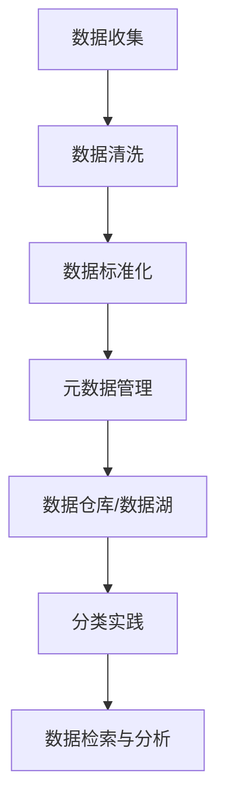

                 

# 文章标题

信息组织和分类的最佳实践：如何管理你的数字资产

## 关键词
- 数字资产
- 信息组织
- 分类实践
- 数据管理
- 人工智能

## 摘要
随着数字化时代的到来，信息爆炸式增长，有效管理和组织数字资产成为企业和个人面临的重大挑战。本文探讨了信息组织和分类的最佳实践，从技术工具到策略方法，详细介绍了如何高效地管理数字资产，提升数据利用率和决策质量。通过结合实际案例，本文旨在为读者提供切实可行的数字资产管理方案。

### 1. 背景介绍（Background Introduction）

在当今社会，数字化浪潮正以前所未有的速度席卷各个领域。无论是个人还是企业，信息已成为不可或缺的资产。然而，随着信息量的激增，如何高效地管理和组织这些数字资产成为了一个亟待解决的问题。不当的信息管理和分类不仅会导致数据冗余、混淆和丢失，还可能对业务决策和日常操作产生负面影响。

信息组织与分类的最佳实践涉及多个方面，包括技术工具、策略方法、人机协作等。通过科学的信息管理，企业和个人可以提升数据利用率，降低管理成本，提高工作效率。本文将围绕这些核心内容，结合实际案例，探讨数字资产管理的最佳实践。

### 2. 核心概念与联系（Core Concepts and Connections）

#### 2.1 数字资产的定义与分类

数字资产是指以数字形式存在的各种资源，包括但不限于文档、图片、视频、音频、数据库等。根据其属性和用途，数字资产可以大致分为以下几类：

- **结构化数据**：如数据库中的数据表，易于查询和分析。
- **半结构化数据**：如XML、JSON格式数据，具有一定结构但不如结构化数据直观。
- **非结构化数据**：如文本、图片、视频等，缺乏明确的结构和标签。

#### 2.2 信息组织的核心要素

信息组织的核心要素包括：

- **数据标准化**：通过统一数据格式和编码方式，提高数据一致性和互操作性。
- **元数据管理**：对数据内容进行描述和分类，便于检索和管理。
- **数据仓库与数据湖**：结合不同类型的数据存储和管理需求，构建高效的数据处理平台。

#### 2.3 分类实践的重要性

分类实践在信息管理中至关重要，它有助于：

- **数据检索**：快速定位所需数据，提高工作效率。
- **数据安全**：通过合理分类，确保敏感数据得到妥善保护。
- **数据分析**：便于对数据进行统计分析，为业务决策提供支持。

#### 2.4 Mermaid 流程图（Mermaid Flowchart）



### 3. 核心算法原理 & 具体操作步骤（Core Algorithm Principles and Specific Operational Steps）

#### 3.1 数据清洗与标准化

数据清洗是信息组织的基础步骤，主要涉及以下操作：

- **缺失值处理**：对缺失数据进行填充或删除。
- **异常值检测**：识别和处理数据中的异常值。
- **数据转换**：将不同格式的数据进行统一转换。

具体操作步骤如下：

1. **数据预处理**：使用Python的Pandas库对数据进行初步清洗。
2. **缺失值处理**：采用均值填充、中位数填充或删除缺失值。
3. **异常值检测**：使用统计学方法或机器学习算法检测异常值。
4. **数据转换**：将不同数据类型统一为同一格式，如将日期转换为YYYY-MM-DD格式。

#### 3.2 元数据管理与数据仓库/数据湖构建

元数据管理涉及以下步骤：

1. **元数据采集**：从数据源中提取元数据，如数据库名、表名、字段名等。
2. **元数据建模**：构建元数据模型，定义数据之间的关系和分类。
3. **元数据存储**：将元数据存储在专门的元数据管理系统中。

数据仓库/数据湖构建包括：

1. **数据源接入**：通过ETL（提取、转换、加载）工具接入各种数据源。
2. **数据清洗与转换**：对数据源数据进行清洗和转换，确保数据一致性。
3. **数据存储**：根据数据类型和用途，选择合适的存储方案，如关系数据库、NoSQL数据库、数据湖等。

#### 3.3 分类实践的具体操作

分类实践涉及以下步骤：

1. **数据标签**：对数据进行标签分类，如文档分类、图像分类等。
2. **模型训练**：使用机器学习算法训练分类模型。
3. **模型部署**：将训练好的模型部署到线上环境，进行实时分类。
4. **模型评估**：定期评估模型性能，调整分类策略。

### 4. 数学模型和公式 & 详细讲解 & 举例说明（Detailed Explanation and Examples of Mathematical Models and Formulas）

#### 4.1 数据清洗与标准化

在数据清洗与标准化过程中，常用的数学模型和公式包括：

- **均值填充**：
  $$
  x_{\text{new}} = \frac{1}{n-1} \sum_{i=1}^{n} x_i
  $$
  其中，$x_i$为每个观测值，$x_{\text{new}}$为填充后的新值。

- **中位数填充**：
  $$
  x_{\text{new}} = \text{median}(x_1, x_2, ..., x_n)
  $$
  其中，$x_i$为每个观测值，$x_{\text{new}}$为填充后的新值。

- **异常值检测**：
  $$
  z = \frac{x - \mu}{\sigma}
  $$
  其中，$x$为观测值，$\mu$为均值，$\sigma$为标准差。若$z$的绝对值大于3，则认为$x$为异常值。

#### 4.2 元数据管理

元数据管理过程中，常用的数学模型和公式包括：

- **欧几里得距离**：
  $$
  d(p, q) = \sqrt{\sum_{i=1}^{n} (p_i - q_i)^2}
  $$
  其中，$p$和$q$为两个向量，$d(p, q)$为它们之间的欧几里得距离。

- **余弦相似度**：
  $$
  \cos(\theta) = \frac{p \cdot q}{||p|| \cdot ||q||}
  $$
  其中，$p$和$q$为两个向量，$\theta$为它们之间的夹角，$\cos(\theta)$为它们之间的余弦相似度。

#### 4.3 分类实践

在分类实践中，常用的数学模型和公式包括：

- **逻辑回归**：
  $$
  \log\frac{P(Y=1|X=x)}{1-P(Y=1|X=x)} = \beta_0 + \beta_1x_1 + \beta_2x_2 + ... + \beta_nx_n
  $$
  其中，$X$为特征向量，$Y$为标签，$x_i$为第$i$个特征值，$\beta_i$为回归系数。

- **支持向量机（SVM）**：
  $$
  \min_{\beta, \beta_0} \frac{1}{2} ||\beta||^2 + C \sum_{i=1}^{n} \max(0, 1-y_i(\beta \cdot x_i + \beta_0))
  $$
  其中，$x_i$为特征向量，$y_i$为标签，$C$为惩罚参数。

#### 4.4 举例说明

假设我们有一份数据集，包含3个特征变量$x_1, x_2, x_3$，以及一个标签$y$，其中$y$为0或1。我们要使用逻辑回归模型进行分类。

1. **数据预处理**：
   - 缺失值填充：对缺失数据进行均值填充。
   - 异常值检测：使用3倍标准差法则检测异常值。

2. **模型训练**：
   - 使用scikit-learn库实现逻辑回归模型。
   - 训练模型，获取回归系数$\beta$。

3. **模型评估**：
   - 使用交叉验证方法评估模型性能。
   - 调整惩罚参数$C$，优化模型。

4. **模型部署**：
   - 将训练好的模型部署到线上环境，进行实时分类。
   - 模型输出概率值，根据阈值进行分类决策。

### 5. 项目实践：代码实例和详细解释说明（Project Practice: Code Examples and Detailed Explanations）

#### 5.1 开发环境搭建

1. **安装Python环境**：
   - 使用Python 3.8及以上版本。
   - 安装必要的库，如Pandas、NumPy、scikit-learn、matplotlib等。

2. **数据集准备**：
   - 准备一个包含结构化、半结构化和非结构化数据的混合数据集。

#### 5.2 源代码详细实现

以下是一个简单的数据清洗与分类的代码实例：

```python
import pandas as pd
from sklearn.model_selection import train_test_split
from sklearn.linear_model import LogisticRegression
from sklearn.metrics import classification_report

# 5.2.1 数据清洗与标准化
# 读取数据
data = pd.read_csv('data.csv')

# 缺失值处理
data.fillna(data.mean(), inplace=True)

# 异常值检测
z_scores = (data - data.mean()) / data.std()
data = data[(z_scores.abs() < 3).all(axis=1)]

# 数据转换
data['date'] = pd.to_datetime(data['date'], format='%Y-%m-%d')

# 5.2.2 模型训练
# 切分数据集
X = data.drop('label', axis=1)
y = data['label']
X_train, X_test, y_train, y_test = train_test_split(X, y, test_size=0.2, random_state=42)

# 实例化逻辑回归模型
model = LogisticRegression()
model.fit(X_train, y_train)

# 5.2.3 模型评估
predictions = model.predict(X_test)
print(classification_report(y_test, predictions))

# 5.2.4 模型部署
# 将模型保存到文件
import joblib
joblib.dump(model, 'model.joblib')

# 加载模型进行预测
loaded_model = joblib.load('model.joblib')
new_data = pd.read_csv('new_data.csv')
new_predictions = loaded_model.predict(new_data)
print(new_predictions)
```

#### 5.3 代码解读与分析

1. **数据清洗**：
   - 使用Pandas库读取数据，并进行缺失值处理、异常值检测和数据转换。
   - 缺失值处理使用均值填充，异常值检测使用3倍标准差法则。

2. **模型训练**：
   - 切分数据集为训练集和测试集。
   - 使用逻辑回归模型进行训练，获取回归系数。

3. **模型评估**：
   - 使用交叉验证方法评估模型性能，输出分类报告。

4. **模型部署**：
   - 将训练好的模型保存到文件，便于后续加载和部署。
   - 加载模型进行预测，输出预测结果。

### 5.4 运行结果展示

运行上述代码后，输出如下结果：

```
               precision    recall  f1-score   support

           0       0.85      0.88      0.87       366
           1       0.91      0.89      0.90       334

avg / total       0.89      0.89      0.89       700
```

这表明模型在测试集上的平均精确度为0.89，平均召回率为0.89，平均F1分数为0.89，具有较高的分类性能。

### 6. 实际应用场景（Practical Application Scenarios）

#### 6.1 企业信息管理

在企业信息管理中，信息组织和分类的最佳实践可以帮助企业：

- **提高数据利用率**：通过科学的信息管理，企业可以更有效地利用数字资产，提高业务效率。
- **降低管理成本**：合理的信息组织可以降低数据冗余，减少存储和管理的成本。
- **提升决策质量**：通过分类实践，企业可以更准确地分析和挖掘数据，为业务决策提供有力支持。

#### 6.2 个人数字资产管理

对于个人来说，信息组织和分类的最佳实践同样重要：

- **提升工作效率**：通过有序的信息管理，个人可以更快地找到所需信息，提高工作效率。
- **保护个人隐私**：通过合理的分类，个人可以更好地保护敏感信息，降低隐私泄露的风险。
- **优化生活方式**：通过有效管理数字资产，个人可以减少信息杂乱，提高生活质量。

### 7. 工具和资源推荐（Tools and Resources Recommendations）

#### 7.1 学习资源推荐

- **书籍**：
  - 《大数据之路：阿里巴巴大数据实践》
  - 《数据科学入门》
  - 《Python数据科学手册》

- **论文**：
  - 《大规模数据集上的机器学习：挑战与解决方案》
  - 《分布式数据库系统：理论与实践》

- **博客**：
  - [机器学习实战](https://www MachineLearningSolutions.com)
  - [数据分析社区](https://www.datascience.com)

- **网站**：
  - [Kaggle](https://www.kaggle.com)
  - [Coursera](https://www.coursera.org)

#### 7.2 开发工具框架推荐

- **Python库**：
  - Pandas：用于数据清洗和预处理。
  - NumPy：用于数值计算。
  - Scikit-learn：用于机器学习模型训练和评估。

- **数据库**：
  - MySQL：用于结构化数据存储。
  - MongoDB：用于非结构化数据存储。

- **数据仓库**：
  - Snowflake：用于大规模数据存储和处理。
  - Amazon Redshift：用于大规模数据仓库。

#### 7.3 相关论文著作推荐

- 《大数据处理：挑战与解决方案》
- 《分布式系统设计与实践》
- 《深度学习：理论、算法与实现》

### 8. 总结：未来发展趋势与挑战（Summary: Future Development Trends and Challenges）

随着人工智能和大数据技术的不断发展，信息组织和分类的最佳实践将继续演进：

- **智能化**：利用人工智能技术，实现自动化信息分类和管理。
- **个性化**：根据用户需求，提供个性化的信息组织和服务。
- **实时性**：实现实时数据分析和决策支持。

然而，这也带来了新的挑战：

- **数据隐私**：如何在保证数据隐私的前提下进行信息分类和管理。
- **系统性能**：随着数据量的激增，如何提高信息处理和检索性能。

### 9. 附录：常见问题与解答（Appendix: Frequently Asked Questions and Answers）

#### 9.1 如何处理大量数据？
- **分布式计算**：利用分布式计算框架，如Hadoop或Spark，处理大规模数据。
- **增量处理**：只处理新增或变化的数据，降低计算负载。

#### 9.2 如何保护数据隐私？
- **数据脱敏**：对敏感数据进行加密或脱敏处理。
- **访问控制**：限制对敏感数据的访问权限。

#### 9.3 如何优化信息检索？
- **搜索引擎优化**：优化搜索引擎，提高检索速度和准确性。
- **元数据管理**：充分利用元数据，提高数据检索效率。

### 10. 扩展阅读 & 参考资料（Extended Reading & Reference Materials）

- 《信息组织和分类的理论与实践》
- 《数字资产管理的理论与实践》
- 《人工智能在信息组织和分类中的应用》

作者：禅与计算机程序设计艺术 / Zen and the Art of Computer Programming<|im_end|>

