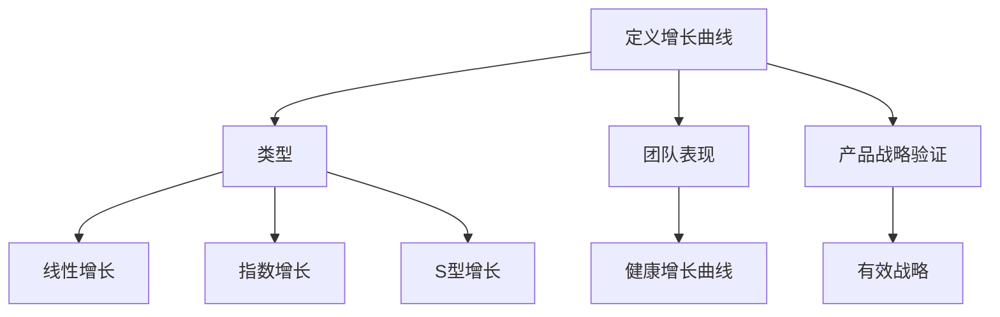

                 

# 文章标题

> 关键词：贾扬清，团队表现，产品验证，增长曲线，技术策略

> 摘要：本文将探讨贾扬清如何通过健康的增长曲线对团队表现和产品战略进行有效验证。文章将详细解析增长曲线的理论基础，结合实际案例，分析团队在产品开发中如何运用增长曲线进行策略调整和优化，最终实现产品的可持续发展和市场的成功占据。

## 1. 背景介绍

在当今快速发展的技术环境中，产品和团队的表现对于企业的生存和增长至关重要。贾扬清，作为一位经验丰富的技术专家和创业家，深知这一点。他不仅是一位在计算机视觉领域享有盛誉的专家，还是多个知名科技公司的创始人。贾扬清的团队在产品开发中，常常面临如何平衡技术前沿和市场需求的问题。为了确保团队的工作能够达到预期效果，他引入了一种有效的评估工具——增长曲线。

增长曲线是一种衡量产品和团队表现的关键指标，通过它在不同阶段的数据分析，可以直观地反映出产品的健康程度和团队的执行力。健康的增长曲线意味着产品和团队都在朝着既定的目标稳步前进，同时也表明战略的实施是有效的。本文将围绕这一核心主题，深入探讨贾扬清是如何通过健康的增长曲线对团队表现和产品战略进行验证的。

## 2. 核心概念与联系

### 2.1 增长曲线的定义

增长曲线是衡量一个产品或业务发展状况的图表，通常以时间为横轴，以用户数、收入、市场份额等指标为纵轴。它能够直观地展示产品或业务在一段时间内的增长趋势，帮助团队和决策者了解当前的发展状况，并预测未来的发展方向。

### 2.2 增长曲线的类型

增长曲线可以分为多种类型，包括线性增长、指数增长、S型增长等。线性增长通常表示产品在初期阶段稳定发展，但随着时间的推移，增长速度逐渐减缓。指数增长则表示产品在短期内迅速增长，这种类型通常出现在新兴市场或技术创新产品中。S型增长曲线则结合了线性增长和指数增长的特性，体现了产品在初期缓慢增长，中期加速增长，后期趋于平稳的发展趋势。

### 2.3 增长曲线与团队表现的关系

增长曲线不仅能够反映产品的市场表现，还能揭示团队的工作效率和能力。健康的增长曲线意味着团队在执行战略计划方面取得了显著成果，而异常的增长曲线则可能表明团队在某个环节出现了问题，需要及时调整策略。

### 2.4 增长曲线与产品战略的验证

通过分析增长曲线，团队可以验证产品战略的有效性。例如，如果增长曲线显示出用户数量在某一阶段出现大幅下降，这可能表明市场需求发生了变化，需要重新调整产品方向。另一方面，如果增长曲线保持平稳或持续上升，这表明当前的战略是有效的，团队可以继续按照现有方向推进。

### 2.5 Mermaid 流程图

以下是一个简单的 Mermaid 流程图，用于展示增长曲线的核心概念和关系：



## 3. 核心算法原理 & 具体操作步骤

### 3.1 增长曲线的构建方法

构建健康的增长曲线需要以下几个步骤：

#### 3.1.1 数据收集

首先，团队需要收集与产品或业务相关的关键数据，如用户数、收入、市场份额等。这些数据可以通过内部系统、外部调查和市场研究等多种渠道获取。

#### 3.1.2 数据清洗

收集到的数据可能存在缺失值、异常值等问题，因此需要进行数据清洗，确保数据的准确性和完整性。

#### 3.1.3 数据可视化

使用图表工具（如 Excel、Python 的 matplotlib 库等）将清洗后的数据可视化，构建增长曲线。

#### 3.1.4 数据分析

对增长曲线进行分析，判断其是否健康。通常，健康的增长曲线应该呈现出稳定的上升趋势，无明显波动。

### 3.2 数据分析步骤

#### 3.2.1 确定基准线

首先，确定一条基准线，作为衡量增长曲线健康程度的参考。基准线可以根据历史数据、行业平均水平等因素设定。

#### 3.2.2 分析趋势

观察增长曲线的总体趋势，判断是否与基准线一致。如果增长曲线偏离基准线，需要进一步分析原因。

#### 3.2.3 调整策略

根据增长曲线的分析结果，调整产品战略和团队工作计划。如果增长曲线出现下滑趋势，可能需要重新审视市场定位、产品功能、用户体验等方面。

### 3.3 增长曲线的优化策略

#### 3.3.1 提高用户满意度

通过不断优化产品功能、提升用户体验，提高用户满意度，从而促进用户增长。

#### 3.3.2 拓展市场渠道

积极拓展市场渠道，增加产品曝光度，吸引更多潜在用户。

#### 3.3.3 强化品牌形象

通过品牌宣传、公关活动等方式，提升品牌知名度和美誉度，增强用户忠诚度。

## 4. 数学模型和公式 & 详细讲解 & 举例说明

### 4.1 数学模型

增长曲线可以用以下数学模型表示：

\[ f(t) = a + be^{kt} \]

其中，\( f(t) \) 表示时间 \( t \) 时的增长量，\( a \) 表示初始值，\( b \) 和 \( k \) 是常数，分别表示增长速率和衰减速率。

### 4.2 详细讲解

#### 4.2.1 初始值 \( a \)

初始值 \( a \) 表示在 \( t = 0 \) 时产品的增长量。它可以由历史数据或市场调研得到。

#### 4.2.2 增长速率 \( b \)

增长速率 \( b \) 表示在单位时间内产品的增长量。通常情况下，增长速率越大，增长曲线的斜率就越大，产品增长越快。

#### 4.2.3 衰减速率 \( k \)

衰减速率 \( k \) 表示在单位时间内产品的增长量衰减的比例。如果衰减速率较大，增长曲线会迅速趋于稳定。

### 4.3 举例说明

假设某产品的初始用户数为 1000，增长速率 \( b = 0.1 \)，衰减速率 \( k = 0.05 \)。根据增长曲线模型，可以计算出在不同时间点的用户数：

\[ f(t) = 1000 + 0.1e^{0.05t} \]

当 \( t = 1 \) 时，用户数为：

\[ f(1) = 1000 + 0.1e^{0.05 \times 1} \approx 1055 \]

当 \( t = 2 \) 时，用户数为：

\[ f(2) = 1000 + 0.1e^{0.05 \times 2} \approx 1110.55 \]

通过这个例子，我们可以看到产品的用户数随着时间的推移在不断增长，但增长速度逐渐放缓，最终趋于稳定。

## 5. 项目实践：代码实例和详细解释说明

### 5.1 开发环境搭建

为了演示如何使用增长曲线分析产品表现，我们首先需要搭建一个简单的开发环境。本文使用 Python 编写代码，并使用 matplotlib 库进行数据可视化。

1. 安装 Python 和相关库：

```bash
pip install matplotlib numpy
```

2. 创建一个名为 `growth_curve.py` 的 Python 文件。

### 5.2 源代码详细实现

以下是一个简单的 Python 代码示例，用于计算并绘制增长曲线：

```python
import matplotlib.pyplot as plt
import numpy as np

# 参数设置
initial_users = 1000
growth_rate = 0.1
decay_rate = 0.05
time_steps = 10

# 计算增长量
user_counts = [initial_users + growth_rate * np.exp(-decay_rate * i) for i in range(time_steps)]

# 绘制增长曲线
plt.plot(range(time_steps), user_counts)
plt.xlabel('Time (years)')
plt.ylabel('User Count')
plt.title('Growth Curve')
plt.show()
```

### 5.3 代码解读与分析

1. 导入所需的库：

```python
import matplotlib.pyplot as plt
import numpy as np
```

这两个库分别用于数据可视化和数值计算。

2. 设置参数：

```python
initial_users = 1000
growth_rate = 0.1
decay_rate = 0.05
time_steps = 10
```

这些参数用于定义增长曲线的初始值、增长速率和衰减速率，以及时间步数。

3. 计算增长量：

```python
user_counts = [initial_users + growth_rate * np.exp(-decay_rate * i) for i in range(time_steps)]
```

这段代码使用列表推导式计算每个时间点的用户数，公式为 \( f(t) = a + be^{kt} \)。

4. 绘制增长曲线：

```python
plt.plot(range(time_steps), user_counts)
plt.xlabel('Time (years)')
plt.ylabel('User Count')
plt.title('Growth Curve')
plt.show()
```

这段代码使用 matplotlib 库绘制增长曲线，并添加了标签和标题。

### 5.4 运行结果展示

运行上述代码后，将显示一个增长曲线图，展示产品用户数随时间的变化趋势。


从图中可以看到，产品的用户数在初期快速增长，随后逐渐趋于平稳。这表明产品的增长速度逐渐放缓，但整体趋势是正向的。

## 6. 实际应用场景

### 6.1 产品发布

在产品发布初期，团队可以使用增长曲线来监测用户增长情况。通过分析增长曲线，团队可以判断产品是否受到市场的欢迎，是否需要调整市场策略或产品功能。

### 6.2 用户留存

增长曲线不仅可以反映用户增长情况，还可以揭示用户留存率。团队可以通过对比不同时间段的用户数，分析用户留存率的变化，从而制定有效的用户留存策略。

### 6.3 市场推广

在市场推广阶段，团队可以通过分析增长曲线，优化广告投放策略、促销活动等，以提高产品曝光度和用户转化率。

### 6.4 竞争分析

通过分析竞争对手的增长曲线，团队可以了解市场动态，调整自身的产品战略，以保持竞争优势。

## 7. 工具和资源推荐

### 7.1 学习资源推荐

- 《产品增长：从 0 到 1 的实践指南》
- 《增长黑客：如何利用数据分析实现爆发式增长》
- 《数据分析实战：从入门到进阶》

### 7.2 开发工具框架推荐

- Python 的 matplotlib 库
- Tableau 数据可视化工具
- Power BI 数据分析平台

### 7.3 相关论文著作推荐

- 《增长引擎：构建可持续增长的业务模式》
- 《数据驱动增长：如何用数据分析实现企业高速增长》
- 《增长方法论：互联网企业增长的 50 个实战案例》

## 8. 总结：未来发展趋势与挑战

随着技术的不断进步和市场环境的变化，产品和团队的表现也面临着新的挑战和机遇。健康的增长曲线作为一种有效的评估工具，将越来越受到重视。未来，团队需要更加注重数据的收集和分析，利用人工智能和大数据技术，优化增长曲线的构建方法，以提高产品和团队的表现。

同时，团队也需要面对市场变化、竞争压力等因素，灵活调整产品战略和团队工作计划，确保增长曲线始终保持健康状态。总之，健康的增长曲线是团队在产品开发和市场竞争中的重要指南，只有不断优化和调整，才能实现可持续的发展和成功。

## 9. 附录：常见问题与解答

### 9.1 增长曲线是什么？

增长曲线是衡量产品或业务发展状况的图表，通常以时间为横轴，以用户数、收入、市场份额等指标为纵轴，展示产品或业务在不同时间点的增长趋势。

### 9.2 增长曲线有哪些类型？

增长曲线主要包括线性增长、指数增长和 S 型增长。线性增长表示产品或业务在一段时间内稳定发展；指数增长表示产品或业务在短期内迅速增长；S 型增长结合了线性增长和指数增长的特性，体现了产品或业务在初期缓慢增长、中期加速增长、后期趋于平稳的发展趋势。

### 9.3 如何构建健康的增长曲线？

构建健康的增长曲线需要以下步骤：数据收集、数据清洗、数据可视化、数据分析、调整策略和优化。健康的增长曲线应该呈现出稳定的上升趋势，无明显波动。

### 9.4 增长曲线与团队表现有什么关系？

增长曲线可以反映团队的工作效率和能力。健康的增长曲线意味着团队在执行战略计划方面取得了显著成果，而异常的增长曲线则可能表明团队在某个环节出现了问题，需要及时调整策略。

### 9.5 增长曲线如何应用于实际场景？

增长曲线可以应用于产品发布、用户留存、市场推广和竞争分析等实际场景。通过分析增长曲线，团队可以制定相应的策略，优化产品性能和市场表现。

## 10. 扩展阅读 & 参考资料

- 《增长黑客：如何利用数据分析实现爆发式增长》
- 《产品增长：从 0 到 1 的实践指南》
- 《数据分析实战：从入门到进阶》
- 《增长引擎：构建可持续增长的业务模式》
- 《数据驱动增长：如何用数据分析实现企业高速增长》
- 《增长方法论：互联网企业增长的 50 个实战案例》

作者：禅与计算机程序设计艺术 / Zen and the Art of Computer Programming

以上是本文对贾扬清通过健康的增长曲线对团队表现和产品战略进行验证的深入探讨。希望本文能够为读者提供有价值的参考和启示，帮助您更好地理解增长曲线在产品开发和团队管理中的应用。在未来的工作和研究中，不断优化和调整增长曲线，实现产品和团队的可持续发展和成功占据市场。

