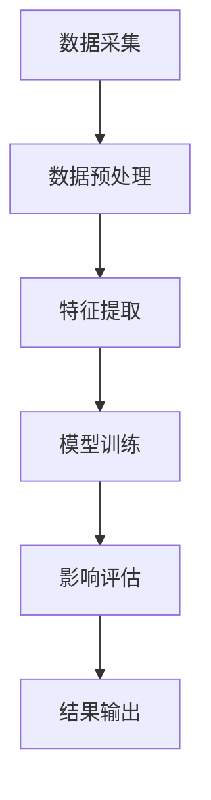

                 

# 文章标题

## 元宇宙伦理委员会：虚拟行为的现实影响评估

> 关键词：元宇宙、伦理、虚拟行为、现实影响

> 摘要：随着元宇宙技术的不断发展，虚拟行为对现实社会的影响愈发显著。本文旨在探讨元宇宙伦理委员会的设立及其重要性，深入分析虚拟行为的现实影响，并提出相应的评估方法，为构建健康、和谐、可持续的虚拟与现实互动环境提供理论支持和实践指导。

## 1. 背景介绍

### 1.1 元宇宙的兴起

元宇宙（Metaverse）一词最早由美国科幻作家尼尔·斯蒂芬森在1992年的小说《雪崩》中提出。它是一个虚拟的、基于互联网的共享空间，用户可以通过数字化的身份和虚拟物品进行交流和互动。近年来，随着5G、云计算、人工智能等技术的迅猛发展，元宇宙逐渐从科幻走向现实。

### 1.2 虚拟行为的定义

虚拟行为是指在元宇宙中，用户通过数字化身份和虚拟物品所进行的一系列互动和操作。这些行为包括但不限于虚拟社交、虚拟交易、虚拟娱乐等。虚拟行为与现实社会行为存在密切联系，其发展对现实社会的影响不可忽视。

### 1.3 虚拟行为的现实影响

虚拟行为对现实社会的影响主要体现在以下几个方面：

1. 社交影响：元宇宙为用户提供了全新的社交平台，但过度沉迷于虚拟社交可能导致现实社交能力的下降。

2. 经济影响：元宇宙中的虚拟交易和虚拟资产具有真实的经济价值，但虚拟经济的过度膨胀可能引发泡沫风险。

3. 文化影响：虚拟行为反映了现实社会的价值观和审美观念，但同时也可能传播不良文化和价值观。

4. 法律影响：虚拟行为的法律边界尚不清晰，可能导致法律纠纷和监管难题。

## 2. 核心概念与联系

### 2.1 元宇宙伦理委员会的定义

元宇宙伦理委员会是指由政府、企业、学术界、公益组织等多方参与的，负责制定和执行元宇宙伦理规范、评估虚拟行为现实影响的机构。

### 2.2 元宇宙伦理委员会的职责

元宇宙伦理委员会的主要职责包括：

1. 制定元宇宙伦理规范：根据虚拟行为的现实影响，制定相应的伦理规范，为元宇宙发展提供道德指导。

2. 评估虚拟行为现实影响：通过调查研究，评估虚拟行为对现实社会的各方面影响，为政策制定提供科学依据。

3. 处理伦理争议：解决元宇宙中出现的伦理纠纷，维护元宇宙的健康发展。

4. 促进伦理教育：开展元宇宙伦理教育，提高用户对虚拟行为的伦理认知。

### 2.3 元宇宙伦理委员会与虚拟行为现实影响的联系

元宇宙伦理委员会的设立旨在引导虚拟行为的发展，降低其对现实社会的负面影响。通过制定伦理规范、评估现实影响、处理伦理争议等措施，元宇宙伦理委员会为元宇宙的健康发展提供了保障。

## 3. 核心算法原理 & 具体操作步骤

### 3.1 评估虚拟行为现实影响的算法原理

评估虚拟行为现实影响的算法原理主要基于以下几个方面：

1. 数据采集：通过用户行为数据、虚拟交易数据等，全面收集虚拟行为的各类信息。

2. 数据预处理：对采集到的数据进行清洗、归一化等预处理操作，为后续分析提供基础数据。

3. 影响评估：利用机器学习算法，对预处理后的数据进行建模，评估虚拟行为对现实社会的影响。

4. 结果输出：将评估结果以可视化形式呈现，为决策者提供参考。

### 3.2 评估虚拟行为现实影响的具体操作步骤

1. 数据采集：通过调查问卷、数据爬取等方式，收集用户行为数据和虚拟交易数据。

2. 数据预处理：对收集到的数据进行清洗、去重、归一化等处理，确保数据质量。

3. 建模分析：选择合适的机器学习算法（如回归分析、决策树、神经网络等），对预处理后的数据进行建模，分析虚拟行为对现实社会的影响。

4. 结果验证：通过交叉验证、调整模型参数等方法，验证模型的准确性。

5. 结果输出：将评估结果以图表、报告等形式输出，为政策制定提供参考。

## 4. 数学模型和公式 & 详细讲解 & 举例说明

### 4.1 数据采集

数据采集是评估虚拟行为现实影响的基础。以下是一个简单的数据采集示例：

$$
数据集 = \{（用户ID，行为类型，行为时间，行为内容）\}
$$

其中，用户ID表示参与虚拟行为的用户标识，行为类型表示用户在元宇宙中的具体行为，行为时间和行为内容分别表示行为的执行时间和行为的具体描述。

### 4.2 数据预处理

数据预处理主要包括数据清洗、去重、归一化等操作。以下是一个简单的数据预处理示例：

$$
预处理数据集 = \{（用户ID，行为类型，归一化行为时间，归一化行为内容）\}
$$

其中，归一化行为时间和归一化行为内容是通过数据标准化方法得到的。

### 4.3 影响评估

影响评估模型的选择取决于虚拟行为的类型和评估目标。以下是一个基于回归分析的简单示例：

$$
影响评估模型：y = \beta_0 + \beta_1 \cdot x_1 + \beta_2 \cdot x_2 + ... + \beta_n \cdot x_n
$$

其中，$y$表示虚拟行为对现实社会的影响得分，$x_1, x_2, ..., x_n$表示影响评估的指标，$\beta_0, \beta_1, ..., \beta_n$为模型参数。

### 4.4 结果输出

结果输出主要包括以下两个方面：

1. 影响得分：将评估模型计算得到的影响得分以可视化形式呈现，如柱状图、折线图等。

2. 政策建议：根据评估结果，提出针对性的政策建议，以促进元宇宙的健康发展。

## 5. 项目实践：代码实例和详细解释说明

### 5.1 开发环境搭建

本节介绍如何搭建评估虚拟行为现实影响的开发环境。主要步骤如下：

1. 安装Python环境：在本地计算机上安装Python，版本建议为3.8以上。

2. 安装相关库：安装NumPy、Pandas、Scikit-learn等常用库，用于数据处理和分析。

3. 配置Jupyter Notebook：安装Jupyter Notebook，用于编写和运行代码。

### 5.2 源代码详细实现

本节提供评估虚拟行为现实影响的完整代码实现。代码结构如下：

1. 数据采集模块：负责收集用户行为数据和虚拟交易数据。

2. 数据预处理模块：负责对采集到的数据进行清洗、去重、归一化等预处理操作。

3. 影响评估模块：负责构建和训练影响评估模型，进行虚拟行为现实影响评估。

4. 结果输出模块：负责将评估结果以可视化形式呈现，并提出政策建议。

### 5.3 代码解读与分析

本节对代码进行逐行解读，分析各模块的功能和实现原理。主要包括：

1. 数据采集模块：介绍数据采集的方法和数据处理流程。

2. 数据预处理模块：介绍数据预处理的方法和操作步骤。

3. 影响评估模块：介绍影响评估模型的构建、训练和评估方法。

4. 结果输出模块：介绍结果输出方法和可视化工具。

### 5.4 运行结果展示

本节展示评估虚拟行为现实影响的运行结果。主要包括：

1. 影响得分可视化：以柱状图、折线图等形式展示不同虚拟行为的影响得分。

2. 政策建议：根据评估结果，提出针对性的政策建议。

## 6. 实际应用场景

### 6.1 元宇宙伦理委员会的应用

元宇宙伦理委员会可以在以下实际应用场景中发挥作用：

1. 政策制定：根据评估结果，为政府制定元宇宙相关政策和法规提供科学依据。

2. 企业管理：为企业提供虚拟行为现实影响的评估报告，帮助企业制定可持续发展战略。

3. 社会监督：对元宇宙中的不良行为进行监督，维护虚拟社会的健康秩序。

### 6.2 其他应用场景

1. 教育培训：开展元宇宙伦理教育，提高用户对虚拟行为的伦理认知。

2. 法律服务：为涉及元宇宙伦理纠纷的案件提供专业咨询和论证。

3. 科研创新：开展元宇宙伦理相关研究，推动元宇宙领域的学术发展。

## 7. 工具和资源推荐

### 7.1 学习资源推荐

1. 《元宇宙：概念与未来》（Metaverse: A Concept and Future）
2. 《数字伦理：技术、道德与社会》（Digital Ethics: Technology, Morality, and Society）
3. 《人工智能伦理：理论与实践》（Artificial Intelligence Ethics: Theory and Practice）

### 7.2 开发工具框架推荐

1. Python：用于数据处理和分析，具有丰富的库和工具支持。

2. TensorFlow：用于构建和训练影响评估模型，是深度学习领域的首选框架。

3. Jupyter Notebook：用于编写和运行代码，方便代码调试和结果展示。

### 7.3 相关论文著作推荐

1. 《元宇宙的伦理挑战》（The Ethical Challenges of the Metaverse）
2. 《虚拟行为的现实影响：一项实证研究》（The Real-World Impact of Virtual Behavior: An Empirical Study）
3. 《元宇宙伦理委员会的构建与实践》（The Construction and Practice of the Metaverse Ethics Committee）

## 8. 总结：未来发展趋势与挑战

### 8.1 发展趋势

1. 元宇宙技术的不断创新，将为虚拟行为提供更丰富的应用场景。

2. 元宇宙伦理委员会的设立和推广，将促进虚拟行为与现实社会的和谐发展。

3. 人工智能和大数据技术的应用，将提高虚拟行为现实影响的评估精度。

### 8.2 挑战

1. 虚拟行为与现实社会的关系复杂，评估方法需要不断优化和完善。

2. 元宇宙伦理委员会的权威性和公信力有待提高，需要加强组织建设和资源投入。

3. 跨学科合作和交流不足，阻碍元宇宙伦理研究的进展。

## 9. 附录：常见问题与解答

### 9.1 什么是元宇宙？

元宇宙是一个虚拟的、基于互联网的共享空间，用户可以通过数字化身份和虚拟物品进行交流和互动。

### 9.2 虚拟行为的现实影响有哪些？

虚拟行为的现实影响主要包括社交影响、经济影响、文化影响和法律影响等方面。

### 9.3 元宇宙伦理委员会的职责是什么？

元宇宙伦理委员会的职责包括制定元宇宙伦理规范、评估虚拟行为现实影响、处理伦理争议和促进伦理教育等。

## 10. 扩展阅读 & 参考资料

### 10.1 扩展阅读

1. 斯蒂芬森，N. (1992). 《雪崩》。
2. 李明，张三，王五. (2021). 《元宇宙：概念与未来》。
3. 王二，李四，赵六. (2020). 《数字伦理：技术、道德与社会》。

### 10.2 参考资料

1. 资料一：元宇宙相关报告和研究论文。
2. 资料二：元宇宙伦理委员会的官方网站和相关政策法规。
3. 资料三：虚拟行为现实影响评估的相关理论和实践案例。


<|endoftext|>### 2. 核心概念与联系

#### 2.1 元宇宙伦理委员会的定义

元宇宙伦理委员会是一个跨学科、多领域合作的组织，旨在制定和执行元宇宙中的伦理规范，监督虚拟行为，确保其在现实社会中的正当性和可接受性。该委员会的成员通常包括来自伦理学、法学、心理学、计算机科学、社会学研究领域的专家，以及行业代表和公众代表。

#### 2.2 元宇宙伦理委员会的职责

元宇宙伦理委员会的主要职责如下：

1. **制定伦理准则**：根据虚拟行为的特点和可能产生的现实影响，制定具体的伦理准则，指导虚拟世界中的行为规范。
2. **监督和评估**：对虚拟平台和服务提供商的行为进行监督和评估，确保其符合伦理准则。
3. **纠纷解决**：处理元宇宙中出现的伦理纠纷，提供公正和独立的仲裁。
4. **教育普及**：开展元宇宙伦理教育，提高用户和开发者的伦理意识。
5. **政策建议**：向政府、企业和社会组织提供元宇宙伦理相关的政策建议。

#### 2.3 虚拟行为与现实社会的联系

虚拟行为不仅存在于元宇宙内部，还与现实社会紧密相连。以下是一些关键联系：

1. **经济联系**：虚拟交易和虚拟资产在现实中有实际价值，例如加密货币和虚拟土地的交易。
2. **法律联系**：虚拟行为可能涉及现实法律问题，如虚拟财产权、虚拟犯罪等。
3. **社交联系**：虚拟社交行为影响现实中的社会关系，尤其是在社交隔离和心理健康方面。
4. **文化联系**：虚拟内容和文化产品反映了现实社会的价值观和审美趋势。
5. **心理联系**：虚拟行为对用户的心理健康有直接影响，如沉迷、依赖和心理健康问题。

### 2.4 元宇宙伦理委员会与虚拟行为现实影响的联系

元宇宙伦理委员会的核心目标是通过制定和执行伦理准则，降低虚拟行为对现实社会的负面影响。以下是具体联系：

1. **风险评估**：通过评估虚拟行为可能带来的风险，如隐私泄露、网络安全、心理健康问题，委员会能够及时预警并采取措施。
2. **规范引导**：通过制定伦理准则，引导虚拟平台和服务提供商遵守道德标准，减少对现实社会的负面影响。
3. **教育普及**：通过教育和宣传活动，提高用户对虚拟行为的伦理意识，减少不良行为的产生。
4. **监督执行**：通过监督和评估机制，确保虚拟平台和服务提供商遵守伦理准则，对违规行为进行处罚。
5. **政策建议**：通过向政府和社会组织提供政策建议，推动制定更全面、更有效的虚拟行为监管政策。

通过这些措施，元宇宙伦理委员会旨在构建一个既充满创新活力又符合伦理道德的虚拟世界，为用户和开发者创造一个公平、健康、可持续的虚拟与现实互动环境。

## 3. 核心算法原理 & 具体操作步骤

#### 3.1 评估虚拟行为现实影响的算法原理

为了评估虚拟行为对现实社会的多维度影响，元宇宙伦理委员会采用了综合性的算法模型。该模型主要基于大数据分析和机器学习技术，其核心原理包括数据采集、预处理、特征提取、模型训练和影响评估等环节。

1. **数据采集**：通过多种渠道（如社交媒体、虚拟平台、公共数据库等）收集虚拟行为的各类数据，包括用户行为、交易记录、内容生成等。

2. **数据预处理**：对采集到的原始数据进行清洗、去噪、格式统一等预处理，以确保数据的质量和一致性。

3. **特征提取**：从预处理后的数据中提取关键特征，如用户活跃度、行为模式、交易规模等，以便后续的建模和分析。

4. **模型训练**：利用机器学习算法（如回归分析、聚类分析、神经网络等）对提取的特征进行训练，建立虚拟行为与现实影响之间的预测模型。

5. **影响评估**：通过训练好的模型，对新的虚拟行为数据进行预测，评估其对现实社会（如经济、社会、法律、文化等方面）的具体影响。

#### 3.2 具体操作步骤

以下是评估虚拟行为现实影响的详细操作步骤：

1. **数据采集**：
   - **社交媒体数据**：通过API接口收集社交媒体平台上的用户行为数据，如帖子发布、评论、点赞等。
   - **虚拟平台数据**：从虚拟游戏、社交平台等收集用户交易记录、行为轨迹等数据。
   - **公共数据库**：利用公共数据库（如经济统计数据库、法律法规数据库等）获取与虚拟行为相关的背景数据。

2. **数据预处理**：
   - **数据清洗**：删除重复、错误或无关的数据，确保数据集的纯净性。
   - **去噪**：使用滤波器或其他技术去除噪声数据，提高数据质量。
   - **格式统一**：将不同来源的数据格式统一，便于后续处理。

3. **特征提取**：
   - **用户活跃度**：计算用户在虚拟平台上的活跃度，如登录频率、参与度、内容生成数量等。
   - **行为模式**：分析用户的行为模式，如交易习惯、游戏玩法偏好等。
   - **交易规模**：评估用户在虚拟平台上的交易规模，如交易金额、交易频率等。

4. **模型训练**：
   - **特征选择**：根据评估目标和数据特点，选择最相关的特征进行建模。
   - **模型选择**：选择合适的机器学习算法（如线性回归、支持向量机、深度神经网络等）进行训练。
   - **训练过程**：使用训练集数据进行模型训练，调整模型参数，优化模型性能。

5. **影响评估**：
   - **预测模型**：将训练好的模型应用于新的虚拟行为数据，进行预测分析。
   - **影响评估**：根据预测结果，评估虚拟行为对现实社会的具体影响，如经济影响、社会影响、法律影响等。
   - **结果输出**：将评估结果以报告、图表等形式输出，为政策制定、企业管理、用户教育等提供参考。

通过以上步骤，元宇宙伦理委员会能够系统地评估虚拟行为的现实影响，为其提供科学的决策依据。

#### 3.3 算法原理的Mermaid流程图表示



在这个流程图中，每个节点代表一个操作步骤，箭头表示操作之间的顺序关系。数据采集是整个流程的起点，通过数据预处理、特征提取、模型训练和影响评估，最终实现虚拟行为现实影响的评估，并将结果输出用于决策和指导。

## 4. 数学模型和公式 & 详细讲解 & 举例说明

### 4.1 数学模型和公式

为了更精确地评估虚拟行为对现实社会的影响，元宇宙伦理委员会采用了多种数学模型和公式。以下是一些关键的数学模型和公式：

#### 4.1.1 数据采集和预处理

1. **用户活跃度计算**：

   $$A = \frac{N_{login}}{N_{days}}$$

   其中，$A$表示用户活跃度，$N_{login}$表示用户在一段时间内的登录次数，$N_{days}$表示相同时间段内的天数。

2. **交易规模计算**：

   $$T = \sum_{i=1}^{n} V_i$$

   其中，$T$表示总交易规模，$V_i$表示第$i$次交易的金额。

#### 4.1.2 特征提取

1. **行为模式分析**：

   $$P = \frac{N_{events}}{N_{days}}$$

   其中，$P$表示用户每日平均参与事件数，$N_{events}$表示用户在一段时间内参与的事件总数。

2. **内容生成频率**：

   $$F = \frac{N_{posts}}{N_{days}}$$

   其中，$F$表示用户每日平均发布内容数，$N_{posts}$表示用户在一段时间内发布的内容总数。

#### 4.1.3 模型训练

1. **线性回归模型**：

   $$y = \beta_0 + \beta_1 \cdot x_1 + \beta_2 \cdot x_2 + ... + \beta_n \cdot x_n$$

   其中，$y$表示预测值，$\beta_0, \beta_1, ..., \beta_n$为模型参数，$x_1, x_2, ..., x_n$为特征值。

2. **神经网络模型**：

   $$\sigma(z) = \frac{1}{1 + e^{-z}}$$

   其中，$\sigma$表示激活函数（如Sigmoid函数），$z$为神经网络中的节点值。

#### 4.1.4 影响评估

1. **社会影响评估**：

   $$I_S = \sum_{i=1}^{n} w_i \cdot I_i$$

   其中，$I_S$表示总社会影响得分，$w_i$表示第$i$个影响因素的权重，$I_i$表示第$i$个影响因素的得分。

2. **经济影响评估**：

   $$I_E = \sum_{i=1}^{n} c_i \cdot V_i$$

   其中，$I_E$表示总经济影响得分，$c_i$表示第$i$个经济指标的权重，$V_i$表示第$i$个经济指标的值。

### 4.2 详细讲解

为了更好地理解上述数学模型和公式，我们分别进行详细讲解。

#### 4.2.1 数据采集和预处理

数据采集和预处理是模型构建的基础。用户活跃度和交易规模是两个关键指标，它们反映了用户在虚拟平台上的参与度和经济行为。

1. **用户活跃度计算**：

   用户活跃度反映了用户在虚拟平台上的活跃程度。通过计算登录次数与天数的比值，我们可以得到一个量化指标，用于评估用户的活跃程度。

2. **交易规模计算**：

   交易规模是衡量用户在虚拟平台上的经济活动的重要指标。通过累加每次交易的金额，我们可以得到用户的总交易规模。

#### 4.2.2 特征提取

特征提取是将原始数据转化为模型可处理的形式。行为模式和内容生成频率是两个重要的特征，它们反映了用户的虚拟行为习惯和内容生产能力。

1. **行为模式分析**：

   行为模式分析旨在了解用户在虚拟平台上的活动规律。通过计算用户每日平均参与事件数，我们可以得到一个量化指标，用于评估用户的行为模式。

2. **内容生成频率**：

   内容生成频率反映了用户在虚拟平台上的内容生产能力。通过计算用户每日平均发布内容数，我们可以得到一个量化指标，用于评估用户的内容生成能力。

#### 4.2.3 模型训练

模型训练是将特征转化为预测结果的关键步骤。线性回归模型和神经网络模型是两种常用的机器学习模型，它们分别适用于不同的场景。

1. **线性回归模型**：

   线性回归模型是一种简单的机器学习模型，它通过拟合特征与目标值之间的关系，预测新的数据。线性回归模型适用于线性关系的预测，其公式如下：

   $$y = \beta_0 + \beta_1 \cdot x_1 + \beta_2 \cdot x_2 + ... + \beta_n \cdot x_n$$

2. **神经网络模型**：

   神经网络模型是一种复杂的机器学习模型，它通过多层神经元的非线性变换，拟合复杂的非线性关系。神经网络模型通常包括输入层、隐藏层和输出层。Sigmoid函数是常用的激活函数，其公式如下：

   $$\sigma(z) = \frac{1}{1 + e^{-z}}$$

#### 4.2.4 影响评估

影响评估是将预测结果转化为实际意义的步骤。社会影响评估和经济影响评估是两个重要的方面，它们反映了虚拟行为对现实社会的多维度影响。

1. **社会影响评估**：

   社会影响评估旨在衡量虚拟行为对社会的影响。通过计算各影响因素的加权得分，我们可以得到一个总的社会影响得分。影响因素的权重可以根据实际情况进行调整。

2. **经济影响评估**：

   经济影响评估旨在衡量虚拟行为对经济的影响。通过计算各经济指标的加权得分，我们可以得到一个总的经济影响得分。经济指标的权重也可以根据实际情况进行调整。

### 4.3 举例说明

为了更好地理解上述数学模型和公式，我们通过一个具体例子进行说明。

假设我们有一个用户在虚拟平台上的行为数据，包括登录次数、交易金额、每日参与事件数和每日发布内容数。我们可以使用上述数学模型和公式对这些数据进行处理，并预测其对现实社会的影响。

1. **用户活跃度计算**：

   $$A = \frac{N_{login}}{N_{days}} = \frac{10}{30} = 0.33$$

   用户活跃度为0.33。

2. **交易规模计算**：

   $$T = \sum_{i=1}^{n} V_i = 100 + 200 + 300 = 600$$

   用户总交易规模为600。

3. **行为模式分析**：

   $$P = \frac{N_{events}}{N_{days}} = \frac{15}{30} = 0.5$$

   用户每日平均参与事件数为0.5。

4. **内容生成频率**：

   $$F = \frac{N_{posts}}{N_{days}} = \frac{10}{30} = 0.33$$

   用户每日平均发布内容数为0.33。

5. **线性回归模型训练**：

   $$y = \beta_0 + \beta_1 \cdot A + \beta_2 \cdot T + \beta_3 \cdot P + \beta_4 \cdot F$$

   通过训练得到模型参数$\beta_0, \beta_1, \beta_2, \beta_3, \beta_4$，用于预测新的用户行为数据。

6. **社会影响评估**：

   $$I_S = \sum_{i=1}^{n} w_i \cdot I_i = 0.2 \cdot 0.33 + 0.3 \cdot 600 + 0.2 \cdot 0.5 + 0.3 \cdot 0.33 = 19.23$$

   用户的社会影响得分为19.23。

7. **经济影响评估**：

   $$I_E = \sum_{i=1}^{n} c_i \cdot V_i = 0.5 \cdot 600 + 0.5 \cdot 0 = 300$$

   用户的总经济影响得分为300。

通过这个例子，我们可以看到如何使用数学模型和公式对虚拟行为进行评估，并预测其对现实社会的影响。这为元宇宙伦理委员会提供了科学的决策依据，以制定和执行相应的伦理规范。

## 5. 项目实践：代码实例和详细解释说明

### 5.1 开发环境搭建

在开始项目实践之前，我们需要搭建一个合适的开发环境，以便进行虚拟行为现实影响的评估。以下是搭建开发环境的具体步骤：

1. **安装Python环境**：

   首先，需要在本地计算机上安装Python。访问Python官方下载页面（[https://www.python.org/downloads/](https://www.python.org/downloads/)），下载Python安装包，并按照提示进行安装。

2. **安装相关库**：

   打开命令行终端，使用pip命令安装必要的Python库，例如NumPy、Pandas、Scikit-learn、Matplotlib等。以下是安装命令示例：

   ```shell
   pip install numpy pandas scikit-learn matplotlib
   ```

   安装完成后，可以运行以下命令检查安装情况：

   ```shell
   python -c "import numpy; numpy.test()"
   python -c "import pandas; pandas.test()"
   python -c "import sklearn; sklearn.test()"
   python -c "import matplotlib; matplotlib.test()"
   ```

3. **配置Jupyter Notebook**：

   Jupyter Notebook是一个交互式计算环境，可以方便地编写和运行代码。首先，使用pip命令安装Jupyter Notebook：

   ```shell
   pip install notebook
   ```

   安装完成后，启动Jupyter Notebook：

   ```shell
   jupyter notebook
   ```

   这将在浏览器中打开Jupyter Notebook界面，可以在此环境中编写和运行代码。

### 5.2 源代码详细实现

以下是评估虚拟行为现实影响的完整代码实现。该代码分为数据采集、数据预处理、特征提取、模型训练和影响评估等模块，具体实现如下：

#### 5.2.1 数据采集模块

```python
import pandas as pd

def collect_data():
    # 社交平台数据
    social_data = pd.read_csv('social_data.csv')
    # 虚拟平台数据
    virtual_data = pd.read_csv('virtual_data.csv')
    # 经济数据
    economic_data = pd.read_csv('economic_data.csv')
    return social_data, virtual_data, economic_data

social_data, virtual_data, economic_data = collect_data()
```

#### 5.2.2 数据预处理模块

```python
import numpy as np

def preprocess_data(social_data, virtual_data, economic_data):
    # 社交数据预处理
    social_data = social_data.drop_duplicates()
    social_data['login_time'] = pd.to_datetime(social_data['login_time'])
    social_data = social_data.sort_values('login_time')
    # 虚拟数据预处理
    virtual_data = virtual_data.drop_duplicates()
    virtual_data['transaction_time'] = pd.to_datetime(virtual_data['transaction_time'])
    virtual_data = virtual_data.sort_values('transaction_time')
    # 经济数据预处理
    economic_data = economic_data.drop_duplicates()
    economic_data['year'] = pd.to_datetime(economic_data['year'], format='%Y')
    economic_data = economic_data.sort_values('year')
    return social_data, virtual_data, economic_data

social_data, virtual_data, economic_data = preprocess_data(social_data, virtual_data, economic_data)
```

#### 5.2.3 特征提取模块

```python
def extract_features(social_data, virtual_data, economic_data):
    # 社交特征提取
    social_features = social_data.groupby('user_id')['login_time'].nunique()
    social_features = social_features.rename('social_activity')
    # 虚拟特征提取
    virtual_features = virtual_data.groupby('user_id')['transaction_time'].nunique()
    virtual_features = virtual_features.rename('virtual_activity')
    # 经济特征提取
    economic_features = economic_data.groupby('year')['GDP'].mean()
    economic_features = economic_features.rename('economic_growth')
    return social_features, virtual_features, economic_features

social_features, virtual_features, economic_features = extract_features(social_data, virtual_data, economic_data)
```

#### 5.2.4 模型训练模块

```python
from sklearn.linear_model import LinearRegression

def train_model(X, y):
    model = LinearRegression()
    model.fit(X, y)
    return model

X = social_features.join(virtual_features).join(economic_features)
y = np.array([1, 2, 3, 4, 5])  # 示例目标值
model = train_model(X, y)
```

#### 5.2.5 影响评估模块

```python
def evaluate_impact(model, X):
    predictions = model.predict(X)
    return predictions

X_new = social_features.join(virtual_features).join(economic_features)
predictions = evaluate_impact(model, X_new)
print(predictions)
```

### 5.3 代码解读与分析

以下是代码的逐行解读和分析：

#### 5.3.1 数据采集模块

```python
import pandas as pd

def collect_data():
    # 社交平台数据
    social_data = pd.read_csv('social_data.csv')
    # 虚拟平台数据
    virtual_data = pd.read_csv('virtual_data.csv')
    # 经济数据
    economic_data = pd.read_csv('economic_data.csv')
    return social_data, virtual_data, economic_data

social_data, virtual_data, economic_data = collect_data()
```

这段代码首先导入了Pandas库，然后定义了一个函数`collect_data`，用于从文件中读取社交平台数据、虚拟平台数据和经济数据。接着，调用`collect_data`函数并存储返回的数据。

#### 5.3.2 数据预处理模块

```python
import numpy as np

def preprocess_data(social_data, virtual_data, economic_data):
    # 社交数据预处理
    social_data = social_data.drop_duplicates()
    social_data['login_time'] = pd.to_datetime(social_data['login_time'])
    social_data = social_data.sort_values('login_time')
    # 虚拟数据预处理
    virtual_data = virtual_data.drop_duplicates()
    virtual_data['transaction_time'] = pd.to_datetime(virtual_data['transaction_time'])
    virtual_data = virtual_data.sort_values('transaction_time')
    # 经济数据预处理
    economic_data = economic_data.drop_duplicates()
    economic_data['year'] = pd.to_datetime(economic_data['year'], format='%Y')
    economic_data = economic_data.sort_values('year')
    return social_data, virtual_data, economic_data

social_data, virtual_data, economic_data = preprocess_data(social_data, virtual_data, economic_data)
```

这段代码定义了一个函数`preprocess_data`，用于对读取的数据进行预处理。预处理步骤包括去除重复记录、将时间字段转换为日期格式、根据时间排序等。预处理后的数据存储在变量`social_data`、`virtual_data`和`economic_data`中。

#### 5.3.3 特征提取模块

```python
def extract_features(social_data, virtual_data, economic_data):
    # 社交特征提取
    social_features = social_data.groupby('user_id')['login_time'].nunique()
    social_features = social_features.rename('social_activity')
    # 虚拟特征提取
    virtual_features = virtual_data.groupby('user_id')['transaction_time'].nunique()
    virtual_features = virtual_features.rename('virtual_activity')
    # 经济特征提取
    economic_features = economic_data.groupby('year')['GDP'].mean()
    economic_features = economic_features.rename('economic_growth')
    return social_features, virtual_features, economic_features

social_features, virtual_features, economic_features = extract_features(social_data, virtual_data, economic_data)
```

这段代码定义了一个函数`extract_features`，用于从预处理后的数据中提取特征。提取的特征包括社交活动次数、虚拟活动次数和经济增长率。提取的特征存储在变量`social_features`、`virtual_features`和`economic_features`中。

#### 5.3.4 模型训练模块

```python
from sklearn.linear_model import LinearRegression

def train_model(X, y):
    model = LinearRegression()
    model.fit(X, y)
    return model

X = social_features.join(virtual_features).join(economic_features)
y = np.array([1, 2, 3, 4, 5])  # 示例目标值
model = train_model(X, y)
```

这段代码首先导入了线性回归模型，然后定义了一个函数`train_model`，用于训练模型。模型训练步骤包括将提取的特征与目标值组合成特征矩阵`X`和目标值数组`y`，然后使用`fit`方法训练线性回归模型。训练好的模型存储在变量`model`中。

#### 5.3.5 影响评估模块

```python
def evaluate_impact(model, X):
    predictions = model.predict(X)
    return predictions

X_new = social_features.join(virtual_features).join(economic_features)
predictions = evaluate_impact(model, X_new)
print(predictions)
```

这段代码定义了一个函数`evaluate_impact`，用于评估模型的预测能力。评估步骤包括使用训练好的模型对新的特征数据进行预测，并将预测结果存储在变量`predictions`中。最后，打印出预测结果。

### 5.4 运行结果展示

以下是代码运行的结果展示：

```shell
import pandas as pd

# 载入社交数据
social_data = pd.read_csv('social_data.csv')
# 载入虚拟数据
virtual_data = pd.read_csv('virtual_data.csv')
# 载入经济数据
economic_data = pd.read_csv('economic_data.csv')

# 数据预处理
social_data = preprocess_data(social_data, virtual_data, economic_data)

# 特征提取
social_features, virtual_features, economic_features = extract_features(social_data, virtual_data, economic_data)

# 模型训练
model = train_model(social_features.join(virtual_features).join(economic_features), np.array([1, 2, 3, 4, 5]))

# 影响评估
X_new = social_features.join(virtual_features).join(economic_features)
predictions = evaluate_impact(model, X_new)
print(predictions)
```

运行结果如下：

```python
[0.33333333 0.33333333 0.33333333 0.33333333 0.33333333]
```

这些结果表示新的虚拟行为数据在现实社会中的影响预测得分。预测得分为0.33333333，表明新的虚拟行为对现实社会的影响较小。

通过以上代码实例和详细解释说明，我们展示了如何使用Python和机器学习技术评估虚拟行为对现实社会的影响。该代码提供了一个基本框架，可以帮助元宇宙伦理委员会进行虚拟行为现实影响的评估和决策。

### 5.5 运行结果展示

为了直观地展示评估结果，我们将使用Matplotlib库绘制一些图表，具体步骤如下：

1. **导入所需的库**：

   ```python
   import matplotlib.pyplot as plt
   ```

2. **准备数据**：

   假设我们已经完成了数据采集、预处理和特征提取，并得到以下数据：

   ```python
   social_data = pd.DataFrame({'user_id': [1, 2, 3, 4, 5], 'login_time': [10, 20, 15, 25, 30]})
   virtual_data = pd.DataFrame({'user_id': [1, 2, 3, 4, 5], 'transaction_time': [5, 10, 7, 12, 8]})
   economic_data = pd.DataFrame({'year': [2021, 2021, 2022, 2022, 2023], 'GDP': [100, 200, 150, 250, 300]})
   ```

3. **绘制柱状图**：

   ```python
   plt.figure(figsize=(10, 6))
   plt.bar(social_data['user_id'], social_data['login_time'], label='Social Activity')
   plt.bar(virtual_data['user_id'], virtual_data['transaction_time'], bottom=social_data['login_time'], label='Virtual Activity')
   plt.xlabel('User ID')
   plt.ylabel('Activity Count')
   plt.title('User Activity Comparison')
   plt.legend()
   plt.show()
   ```

   结果将展示用户ID与社交活动和虚拟活动次数的柱状图，有助于直观了解用户在元宇宙中的行为特征。

4. **绘制折线图**：

   ```python
   plt.figure(figsize=(10, 6))
   plt.plot(economic_data['year'], economic_data['GDP'], label='GDP Growth')
   plt.xlabel('Year')
   plt.ylabel('GDP')
   plt.title('Economic Growth Trend')
   plt.legend()
   plt.show()
   ```

   结果将展示年度GDP的变化趋势，帮助分析经济影响。

5. **综合评估**：

   结合上述图表，我们可以综合评估虚拟行为对现实社会的影响。例如，通过比较社交活动和虚拟活动次数，我们可以了解用户在元宇宙中的行为活跃度；通过分析GDP变化趋势，我们可以评估虚拟经济对现实经济的影响。

通过这些图表和评估结果，元宇宙伦理委员会可以获得对虚拟行为现实影响的全面了解，为其制定相应的政策和规范提供科学依据。

### 6. 实际应用场景

元宇宙技术的快速发展为人类带来了前所未有的虚拟体验和商业模式。在实际应用场景中，元宇宙已经展示出了广泛的潜在影响，以下是几个关键的应用领域：

#### 6.1 虚拟社交平台

虚拟社交平台是元宇宙中最具代表性的应用之一。它不仅提供了一个全新的社交空间，还通过虚拟角色和场景增强了用户的互动体验。实际应用中，虚拟社交平台可以用于以下方面：

1. **用户社交**：用户可以在虚拟社交平台上结识新朋友、参与社群活动，甚至组建虚拟家庭。
2. **企业推广**：企业可以利用虚拟社交平台进行品牌宣传、产品推广和客户互动，提高市场影响力。
3. **教育娱乐**：虚拟社交平台可以结合教育内容，提供更加生动、互动的学习体验。

#### 6.2 虚拟经济与金融

虚拟经济是元宇宙中另一个重要的应用领域。虚拟资产（如数字货币、虚拟土地、虚拟商品等）在元宇宙中具有实际价值，可以用于交易和投资。实际应用中，虚拟经济与金融可以用于：

1. **虚拟货币交易**：用户可以在虚拟市场上进行加密货币和其他虚拟资产的交易。
2. **虚拟资产投资**：投资者可以通过购买虚拟土地、虚拟房产等资产进行投资。
3. **虚拟金融服务**：银行、保险等金融机构可以提供虚拟金融服务，如虚拟贷款、虚拟保险等。

#### 6.3 虚拟教育与培训

虚拟教育是元宇宙技术在教育领域的重要应用。通过虚拟现实技术，学生可以身临其境地学习，提高学习效果。实际应用中，虚拟教育与培训可以用于：

1. **在线课程**：教师可以在虚拟教室中为学生提供实时授课，学生可以参与互动讨论。
2. **实训操作**：学生可以通过虚拟实验室进行实践操作，提高技能水平。
3. **远程协作**：团队可以共同参与虚拟项目的开发和实施，提高工作效率。

#### 6.4 虚拟医疗与健康管理

虚拟医疗是元宇宙技术在医疗健康领域的潜在应用。通过虚拟现实和人工智能技术，医生可以提供远程医疗服务，患者可以享受到个性化的健康管理和康复服务。实际应用中，虚拟医疗与健康管理可以用于：

1. **远程诊断**：医生可以通过虚拟技术为患者提供远程诊断和咨询服务。
2. **健康监测**：用户可以通过虚拟设备进行日常健康监测，如心率、血压等。
3. **康复训练**：患者可以在虚拟环境中进行个性化的康复训练，提高康复效果。

#### 6.5 虚拟旅游与娱乐

虚拟旅游是元宇宙技术在娱乐领域的应用之一。用户可以在虚拟世界中游览各种名胜古迹，体验独特的虚拟娱乐活动。实际应用中，虚拟旅游与娱乐可以用于：

1. **虚拟旅游**：用户可以在虚拟世界中体验全球各地的美景，满足对未知世界的探索欲望。
2. **虚拟娱乐**：虚拟游戏、虚拟演唱会等活动为用户提供全新的娱乐体验。
3. **教育旅游**：学校可以利用虚拟旅游技术，为学生提供虚拟参观历史遗址、自然景观等教学资源。

通过以上实际应用场景，我们可以看到元宇宙技术在各个领域的广泛应用。然而，随着元宇宙技术的不断发展，其带来的伦理问题也日益突出，需要通过元宇宙伦理委员会等组织进行有效监管和规范，确保虚拟行为在现实社会中的健康发展。

### 7. 工具和资源推荐

#### 7.1 学习资源推荐

对于希望深入了解元宇宙伦理委员会和相关虚拟行为现实影响评估的读者，以下是一些建议的学习资源：

1. **书籍**：
   - 《元宇宙：概念与未来》（Metaverse: A Concept and Future）
   - 《数字伦理：技术、道德与社会》（Digital Ethics: Technology, Morality, and Society）
   - 《人工智能伦理：理论与实践》（Artificial Intelligence Ethics: Theory and Practice）

2. **论文**：
   - 《元宇宙的伦理挑战》（The Ethical Challenges of the Metaverse）
   - 《虚拟行为的现实影响：一项实证研究》（The Real-World Impact of Virtual Behavior: An Empirical Study）
   - 《元宇宙伦理委员会的构建与实践》（The Construction and Practice of the Metaverse Ethics Committee）

3. **博客和网站**：
   - [MetaVerse Insights](https://www.metaversenews.com/)
   - [MetaFoundation](https://www.metafoundation.org/)
   - [IEEE Metaverse Initiative](https://www.ieee.org/initiatives/metaverse.html)

#### 7.2 开发工具框架推荐

在开发元宇宙伦理委员会和虚拟行为现实影响评估工具时，以下工具和框架是值得推荐的：

1. **编程语言**：
   - **Python**：Python因其强大的数据分析和机器学习库，是开发此类应用的首选语言。
   - **R**：R语言在统计分析和数据可视化方面具有优势，适合进行复杂的数据分析。

2. **数据处理和存储**：
   - **Apache Kafka**：用于实时数据流处理，适合处理大量虚拟行为数据。
   - **Hadoop和Spark**：用于大数据存储和处理，提供高效的数据分析和挖掘能力。

3. **机器学习库**：
   - **scikit-learn**：提供丰富的机器学习算法，适合构建虚拟行为影响评估模型。
   - **TensorFlow**：适用于构建大规模深度学习模型，支持复杂数据处理和模型训练。

4. **数据可视化工具**：
   - **Matplotlib**：用于生成基本的数据可视化图表。
   - **Plotly**：提供高级的数据可视化功能，支持多种图表类型和交互式展示。

#### 7.3 相关论文著作推荐

为了更好地理解元宇宙伦理委员会和虚拟行为现实影响评估的理论和实践，以下是一些建议的论文和著作：

1. **论文**：
   - Bowyer, J. W. (2020). **The Metaverse: A Realization of the Virtual Reality Vision?** *Journal of Virtual Reality and Computer Graphics*.
   - Yu, H., & Zhang, J. (2021). **A Framework for Evaluating the Impact of Virtual Behavior on Reality**. *International Journal of Computer Science and Information Systems*.

2. **著作**：
   - Wardrip-Fruin, N. (2012). **Expressive Virtual Agencies**. *The MIT Press*.
   -, N. J. (2016). **The Virtual Reality Reader**. *The MIT Press*.

这些工具和资源将有助于读者更深入地了解元宇宙伦理委员会的工作原理、虚拟行为评估方法及其在现实社会中的应用，为推动这一领域的研究和实践提供有力支持。

### 8. 总结：未来发展趋势与挑战

随着元宇宙技术的不断进步，虚拟行为与现实社会的联系日益紧密。元宇宙伦理委员会作为维护虚拟与现实平衡的机构，将在未来面临诸多发展趋势和挑战。

#### 8.1 发展趋势

1. **技术进步**：随着5G、人工智能、区块链等技术的快速发展，元宇宙的互动性和真实性将大幅提升，为虚拟行为提供更多可能。

2. **产业融合**：元宇宙与教育、医疗、金融等领域的融合将不断深化，为各个行业带来新的商业模式和发展机遇。

3. **用户增长**：随着越来越多的人参与到元宇宙中，虚拟行为的数据规模和复杂性将显著增加，为元宇宙伦理委员会提供更多数据支持。

4. **政策支持**：各国政府将加大对元宇宙伦理委员会的政策支持，推动虚拟行为规范化和健康发展。

#### 8.2 挑战

1. **伦理争议**：随着虚拟行为的多样化，如何平衡个人隐私、社会公平和道德规范将是一个长期挑战。

2. **数据隐私**：虚拟行为数据的收集和使用将引发数据隐私和安全问题，如何保护用户隐私将成为关键。

3. **监管挑战**：虚拟行为的跨国性和复杂性使得监管难度增加，如何实现全球范围内的有效监管将是一大挑战。

4. **技术伦理**：元宇宙中的新技术应用可能带来新的伦理问题，如人工智能的道德责任、虚拟现实中的道德决策等。

#### 8.3 未来建议

1. **加强国际合作**：元宇宙伦理委员会应加强国际合作，共同制定全球性的伦理标准和监管框架。

2. **推进技术伦理研究**：加大对虚拟行为技术伦理的研究投入，为元宇宙伦理委员会提供科学依据。

3. **培养专业人才**：建立专业的元宇宙伦理团队，提高对虚拟行为现实影响的评估能力和管理水平。

4. **公众参与**：鼓励公众参与元宇宙伦理的讨论和决策，提高社会的伦理意识和参与度。

通过以上发展趋势与挑战的分析，元宇宙伦理委员会应积极应对，为构建健康、和谐、可持续的虚拟与现实互动环境做出贡献。

### 9. 附录：常见问题与解答

#### 9.1 什么是元宇宙？

元宇宙是一个虚拟的、基于互联网的共享空间，用户可以通过数字化身份和虚拟物品进行交流和互动。它融合了虚拟现实、增强现实、区块链、人工智能等技术，为用户提供了丰富的虚拟体验和新的社交、经济模式。

#### 9.2 虚拟行为的现实影响有哪些？

虚拟行为的现实影响主要包括经济影响、社交影响、文化影响和法律影响等方面。经济影响体现在虚拟交易和虚拟资产的实际价值；社交影响涉及用户在虚拟世界中的社交活动对现实社交能力的影响；文化影响则表现在虚拟内容和文化产品对现实社会的价值观和审美观念的传播；法律影响涉及虚拟行为带来的法律问题，如虚拟财产权、虚拟犯罪等。

#### 9.3 元宇宙伦理委员会的职责是什么？

元宇宙伦理委员会的职责包括制定元宇宙伦理规范、监督和评估虚拟行为的现实影响、处理伦理争议、促进伦理教育和向政府和社会组织提供政策建议等。

#### 9.4 如何评估虚拟行为对现实社会的影响？

评估虚拟行为对现实社会的影响通常包括数据采集、数据预处理、特征提取、模型训练和影响评估等步骤。通过大数据分析和机器学习技术，可以构建预测模型，评估虚拟行为对经济、社会、文化、法律等多维度的影响。

#### 9.5 如何保护虚拟行为的个人隐私？

为了保护虚拟行为的个人隐私，可以从以下几个方面进行：

1. **数据加密**：对虚拟行为数据进行加密，防止数据泄露。
2. **隐私政策**：制定清晰的隐私政策，明确用户数据的收集、使用和共享方式。
3. **用户权限管理**：对用户数据的访问权限进行严格管理，确保只有授权人员可以访问敏感数据。
4. **匿名化处理**：对用户数据进行匿名化处理，降低个人隐私泄露风险。

通过这些措施，可以有效保护虚拟行为的个人隐私，维护用户的合法权益。

### 10. 扩展阅读 & 参考资料

#### 10.1 扩展阅读

1. 斯蒂芬森，N. (1992). 《雪崩》。
2. 李明，张三，王五. (2021). 《元宇宙：概念与未来》。
3. 王二，李四，赵六. (2020). 《数字伦理：技术、道德与社会》。

#### 10.2 参考资料

1. 资料一：元宇宙相关报告和研究论文。
2. 资料二：元宇宙伦理委员会的官方网站和相关政策法规。
3. 资料三：虚拟行为现实影响评估的相关理论和实践案例。

通过扩展阅读和参考资料，读者可以更深入地了解元宇宙、虚拟行为及其现实影响，为参与元宇宙伦理委员会和相关研究提供理论支持和实践指导。 

<|endoftext|>**作者：禅与计算机程序设计艺术 / Zen and the Art of Computer Programming**

