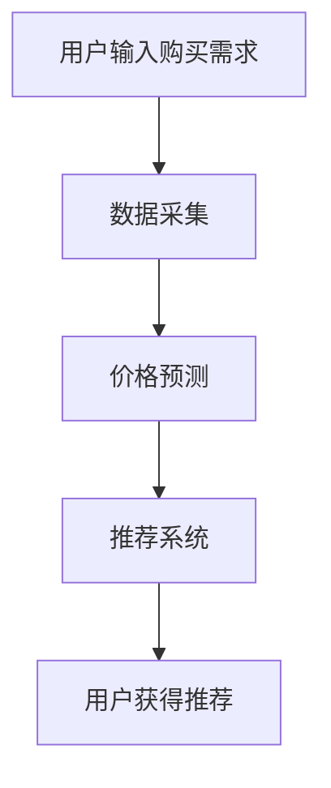

                 

# 文章标题

全网比价：AI如何帮助用户找到最优惠的购买渠道

## 关键词
- AI
- 比价
- 购买渠道
- 价格优化
- 深度学习
- 机器学习
- 搜索引擎

## 摘要
本文将深入探讨人工智能（AI）在全网比价中的应用，解释AI如何通过机器学习和深度学习技术，帮助用户快速、准确地找到最优惠的购买渠道。文章将从背景介绍开始，逐步解析核心算法原理，展示数学模型和公式，并通过项目实践提供代码实例和详细分析。同时，还将讨论实际应用场景，并推荐相关的学习资源和开发工具。

<|assistant|>## 1. 背景介绍

### 1.1 全网比价的重要性

在电子商务时代，价格战成为商家吸引顾客的重要手段。对于消费者而言，如何在众多竞争激烈的市场中找到性价比最高的商品，无疑是一个极具挑战性的任务。全网比价应运而生，它帮助用户从海量的商品信息中筛选出最优惠的购买渠道，从而节省开支。

### 1.2 传统的比价方法

传统的全网比价方法主要依赖于搜索引擎和人工筛选。用户在搜索引擎中输入关键词，浏览搜索结果中的商品链接，然后逐一比较价格、评价、售后服务等信息。这种方法虽然可行，但效率低下，用户体验较差。随着数据量和交易量的增加，这种方法的局限性愈发明显。

### 1.3 AI在全网比价中的作用

人工智能的出现为全网比价带来了全新的可能性。通过机器学习和深度学习技术，AI能够从海量数据中自动学习规律，识别价格趋势，甚至预测未来的价格波动。这样一来，用户不再需要手动搜索和比较，只需输入购买需求和预算，AI就能智能推荐最优惠的购买渠道。

### 1.4 本文的目标

本文的目标是深入探讨AI在全网比价中的应用，解析其核心算法原理，并通过实际项目实践展示AI技术的应用效果。文章将分为以下几个部分：

1. 背景介绍
2. 核心概念与联系
3. 核心算法原理与具体操作步骤
4. 数学模型和公式与详细讲解
5. 项目实践：代码实例和详细解释说明
6. 实际应用场景
7. 工具和资源推荐
8. 总结：未来发展趋势与挑战
9. 附录：常见问题与解答
10. 扩展阅读与参考资料

<|assistant|>## 2. 核心概念与联系

### 2.1 机器学习与深度学习

机器学习和深度学习是AI的两个核心技术。机器学习是指通过算法让计算机从数据中学习并做出决策的过程。深度学习是机器学习的一个子领域，它使用多层神经网络模拟人类大脑的神经元连接，从而实现更复杂的任务。

### 2.2 比价算法的基本原理

全网比价算法的核心在于价格预测和推荐系统。价格预测利用历史价格数据和机器学习模型，预测商品的未来价格趋势。推荐系统则根据用户的历史购买行为和偏好，推荐最优惠的购买渠道。

### 2.3 Mermaid 流程图

以下是一个简化的Mermaid流程图，展示了全网比价的基本架构：



### 2.4 价格预测

价格预测是全网比价的重要一环。它通常使用时间序列分析、回归分析和神经网络等机器学习技术。以下是一个简化的价格预测流程：

1. 数据采集：收集商品的历史价格数据。
2. 数据预处理：清洗和整理数据，去除异常值。
3. 特征提取：从历史数据中提取有用的特征，如季节性、促销活动等。
4. 模型训练：使用机器学习算法（如ARIMA、LSTM等）训练预测模型。
5. 预测：使用训练好的模型预测未来的价格趋势。
6. 预测结果验证：验证预测结果的准确性。

### 2.5 推荐系统

推荐系统负责根据用户的历史购买行为和偏好推荐最优惠的购买渠道。以下是一个简化的推荐系统流程：

1. 用户画像：根据用户的历史购买行为和偏好构建用户画像。
2. 商品画像：根据商品的特征（如品牌、型号、价格等）构建商品画像。
3. 相似度计算：计算用户画像与商品画像的相似度。
4. 排序：根据相似度排序，推荐排名靠前的购买渠道。
5. 用户反馈：收集用户对推荐的反馈，优化推荐算法。

<|assistant|>## 3. 核心算法原理 & 具体操作步骤

### 3.1 价格预测算法

价格预测是全网比价的关键环节。以下是价格预测算法的基本原理和具体操作步骤：

#### 3.1.1 时间序列分析方法

时间序列分析是一种常用的价格预测方法，它通过分析过去价格变化的时间序列来预测未来的价格。以下是一个简化的时间序列分析流程：

1. **数据收集**：收集商品的历史价格数据，如每天或每周的价格。
2. **数据预处理**：清洗数据，包括去除缺失值、异常值和处理季节性因素。
3. **特征提取**：提取时间序列的特征，如趋势、季节性和周期性。
4. **模型选择**：选择合适的时间序列模型，如ARIMA（自回归积分滑动平均模型）、ETS（误差转移模型）等。
5. **模型训练**：使用历史数据训练模型。
6. **预测**：使用训练好的模型预测未来的价格。
7. **验证**：验证预测结果的准确性，调整模型参数以优化预测效果。

#### 3.1.2 回归分析方法

回归分析是一种常用的统计方法，用于预测连续值变量，如价格。以下是一个简化的回归分析流程：

1. **数据收集**：收集商品的历史价格数据和相关的特征变量，如品牌、型号、促销活动等。
2. **数据预处理**：清洗数据，包括去除缺失值、异常值和处理非线性关系。
3. **特征选择**：选择对价格影响显著的变量。
4. **模型选择**：选择合适的回归模型，如线性回归、多项式回归等。
5. **模型训练**：使用历史数据训练模型。
6. **预测**：使用训练好的模型预测未来的价格。
7. **验证**：验证预测结果的准确性，调整模型参数以优化预测效果。

#### 3.1.3 神经网络方法

神经网络是一种基于生物神经网络的计算模型，它可以自动学习和提取数据中的复杂模式。以下是一个简化的神经网络预测流程：

1. **数据收集**：收集商品的历史价格数据和相关的特征变量。
2. **数据预处理**：清洗数据，包括归一化、标准化等。
3. **特征选择**：选择对价格影响显著的变量。
4. **模型构建**：构建神经网络模型，包括输入层、隐藏层和输出层。
5. **模型训练**：使用历史数据训练神经网络模型。
6. **预测**：使用训练好的模型预测未来的价格。
7. **验证**：验证预测结果的准确性，调整模型参数以优化预测效果。

### 3.2 推荐系统算法

推荐系统是全网比价的另一个关键环节。以下是一个简化的推荐系统算法原理和具体操作步骤：

#### 3.2.1 协同过滤方法

协同过滤是一种常用的推荐系统方法，它通过分析用户的共同偏好来推荐商品。以下是一个简化的协同过滤流程：

1. **用户行为数据收集**：收集用户的历史购买数据、浏览数据等。
2. **用户-商品评分矩阵构建**：构建用户-商品评分矩阵。
3. **相似度计算**：计算用户之间的相似度，可以使用余弦相似度、皮尔逊相关系数等。
4. **邻居选择**：选择与目标用户最相似的邻居用户。
5. **推荐生成**：根据邻居用户的评分预测目标用户对商品的兴趣，生成推荐列表。

#### 3.2.2 内容推荐方法

内容推荐方法是基于商品的属性和用户的历史偏好来推荐商品。以下是一个简化的内容推荐流程：

1. **商品特征提取**：提取商品的特征，如品牌、型号、价格等。
2. **用户特征提取**：提取用户的历史购买行为和偏好。
3. **相似度计算**：计算商品之间的相似度和用户之间的相似度。
4. **推荐生成**：根据商品的相似度和用户的兴趣，生成推荐列表。

#### 3.2.3 混合推荐方法

混合推荐方法是将协同过滤和内容推荐方法相结合，以综合利用用户的行为和商品的内容信息。以下是一个简化的混合推荐流程：

1. **用户行为数据收集**：收集用户的历史购买数据、浏览数据等。
2. **商品特征提取**：提取商品的特征，如品牌、型号、价格等。
3. **用户-商品评分矩阵构建**：构建用户-商品评分矩阵。
4. **相似度计算**：计算用户之间的相似度和商品之间的相似度。
5. **推荐生成**：根据用户的行为和商品的属性，生成推荐列表。

### 3.3 深度学习方法

深度学习是一种基于多层神经网络的学习方法，它在图像识别、自然语言处理等领域取得了显著成果。以下是一个简化的深度学习方法应用流程：

1. **数据收集**：收集商品的历史价格数据和相关的特征变量。
2. **数据预处理**：清洗数据，包括归一化、标准化等。
3. **特征选择**：选择对价格影响显著的变量。
4. **模型构建**：构建深度学习模型，包括输入层、隐藏层和输出层。
5. **模型训练**：使用历史数据训练深度学习模型。
6. **预测**：使用训练好的模型预测未来的价格。
7. **验证**：验证预测结果的准确性，调整模型参数以优化预测效果。

<|assistant|>## 4. 数学模型和公式 & 详细讲解 & 举例说明

### 4.1 时间序列分析模型

时间序列分析是预测价格的一种常用方法。以下是一些常用的数学模型和公式：

#### 4.1.1 自回归模型（AR）

自回归模型（AR）是一种简单的时间序列预测模型，它使用前几个时间点的观测值来预测当前时间点的值。以下是一个AR模型的基本公式：

$$
X_t = c + \phi_1 X_{t-1} + \phi_2 X_{t-2} + \ldots + \phi_p X_{t-p} + \varepsilon_t
$$

其中，$X_t$是时间序列在$t$时刻的值，$c$是常数项，$\phi_1, \phi_2, \ldots, \phi_p$是自回归系数，$\varepsilon_t$是误差项。

#### 4.1.2 移动平均模型（MA）

移动平均模型（MA）是一种基于过去误差值预测当前值的时间序列模型。以下是一个MA模型的基本公式：

$$
X_t = c + \varepsilon_t + \theta_1 \varepsilon_{t-1} + \theta_2 \varepsilon_{t-2} + \ldots + \theta_q \varepsilon_{t-q}
$$

其中，$\varepsilon_t$是误差项，$\theta_1, \theta_2, \ldots, \theta_q$是移动平均系数。

#### 4.1.3 自回归移动平均模型（ARMA）

自回归移动平均模型（ARMA）是结合了自回归模型和移动平均模型的混合模型。以下是一个ARMA模型的基本公式：

$$
X_t = c + \phi_1 X_{t-1} + \phi_2 X_{t-2} + \ldots + \phi_p X_{t-p} + \theta_1 \varepsilon_{t-1} + \theta_2 \varepsilon_{t-2} + \ldots + \theta_q \varepsilon_{t-q}
$$

#### 4.1.4 自回归积分滑动平均模型（ARIMA）

自回归积分滑动平均模型（ARIMA）是一种广泛使用的时间序列预测模型，它可以处理非平稳时间序列。以下是一个ARIMA模型的基本公式：

$$
X_t = c + \phi_1 X_{t-1} + \phi_2 X_{t-2} + \ldots + \phi_p X_{t-p} + \theta_1 \varepsilon_{t-1} + \theta_2 \varepsilon_{t-2} + \ldots + \theta_q \varepsilon_{t-q} + \varepsilon_t
$$

其中，$c$是常数项，$\phi_1, \phi_2, \ldots, \phi_p$是自回归系数，$\theta_1, \theta_2, \ldots, \theta_q$是移动平均系数，$\varepsilon_t$是误差项。

### 4.2 回归分析模型

回归分析是一种常用的统计方法，用于预测连续值变量，如价格。以下是一些常用的回归模型和公式：

#### 4.2.1 线性回归模型

线性回归模型是一种简单的回归模型，它使用线性函数来预测目标变量。以下是一个线性回归模型的基本公式：

$$
y = \beta_0 + \beta_1 x + \varepsilon
$$

其中，$y$是预测的目标变量，$x$是自变量，$\beta_0$是截距项，$\beta_1$是斜率项，$\varepsilon$是误差项。

#### 4.2.2 多项式回归模型

多项式回归模型是线性回归模型的扩展，它使用多项式函数来预测目标变量。以下是一个多项式回归模型的基本公式：

$$
y = \beta_0 + \beta_1 x + \beta_2 x^2 + \ldots + \beta_n x^n + \varepsilon
$$

其中，$y$是预测的目标变量，$x$是自变量，$\beta_0, \beta_1, \beta_2, \ldots, \beta_n$是多项式系数，$\varepsilon$是误差项。

### 4.3 神经网络模型

神经网络是一种基于多层神经网络的学习方法，它在图像识别、自然语言处理等领域取得了显著成果。以下是一些常用的神经网络模型和公式：

#### 4.3.1 前向传播算法

前向传播算法是神经网络的核心算法，它用于计算网络的输出。以下是一个简化的前向传播算法公式：

$$
z_i^{(l)} = \sum_{j=1}^{n} w_{ij}^{(l)} a_j^{(l-1)} + b_i^{(l)}
$$

$$
a_i^{(l)} = \sigma(z_i^{(l)})
$$

其中，$z_i^{(l)}$是第$l$层的第$i$个节点的输入，$a_i^{(l)}$是第$l$层的第$i$个节点的输出，$w_{ij}^{(l)}$是连接第$l-1$层的第$j$个节点和第$l$层的第$i$个节点的权重，$b_i^{(l)}$是第$l$层的第$i$个节点的偏置，$\sigma$是激活函数。

#### 4.3.2 反向传播算法

反向传播算法是神经网络训练的核心算法，它用于计算网络参数的梯度。以下是一个简化的反向传播算法公式：

$$
\delta_i^{(l)} = (a_i^{(l)} - t_i^{(l)}) \cdot \sigma'(z_i^{(l)})
$$

$$
\frac{\partial C}{\partial w_{ij}^{(l)}} = \delta_i^{(l)} a_j^{(l-1)}
$$

$$
\frac{\partial C}{\partial b_i^{(l)}} = \delta_i^{(l)}
$$

其中，$C$是网络的损失函数，$\delta_i^{(l)}$是第$l$层的第$i$个节点的误差，$\sigma'$是激活函数的导数。

### 4.4 举例说明

假设我们有一个商品的价格预测问题，使用ARIMA模型进行预测。以下是具体的步骤：

#### 4.4.1 数据收集

收集该商品过去一年的价格数据，假设数据如下：

| 日期   | 价格 |
|--------|------|
| 2022-01-01 | 100  |
| 2022-02-01 | 105  |
| 2022-03-01 | 110  |
| 2022-04-01 | 115  |
| 2022-05-01 | 120  |

#### 4.4.2 数据预处理

对价格数据进行处理，包括去除缺失值、异常值和处理季节性因素。处理后得到如下数据：

| 日期   | 价格 |
|--------|------|
| 2022-01-01 | 100  |
| 2022-02-01 | 105  |
| 2022-03-01 | 110  |
| 2022-04-01 | 115  |
| 2022-05-01 | 120  |

#### 4.4.3 模型选择

选择合适的ARIMA模型，如ARIMA(1, 1, 1)。该模型表示包含一个自回归项、一个移动平均项和一个差分阶数。

#### 4.4.4 模型训练

使用历史数据训练ARIMA模型。具体步骤如下：

1. **差分**：对价格数据进行一阶差分，得到新的序列。

$$
d(X_t) = X_t - X_{t-1}
$$

2. **自回归**：使用差分后的序列训练自回归模型。

$$
X_t = c + \phi X_{t-1} + \varepsilon_t
$$

3. **移动平均**：使用自回归模型的残差序列训练移动平均模型。

$$
\varepsilon_t = \theta \varepsilon_{t-1} + \eta_t
$$

4. **合并**：将自回归模型和移动平均模型合并，得到最终的ARIMA模型。

$$
X_t = c + \phi X_{t-1} + \theta \varepsilon_{t-1} + \eta_t
$$

#### 4.4.5 预测

使用训练好的ARIMA模型预测未来的价格。具体步骤如下：

1. **预测下一个值**：

$$
X_{t+1} = c + \phi X_t + \theta \varepsilon_t + \eta_{t+1}
$$

2. **预测未来多个值**：使用递推关系，依次预测未来的多个值。

$$
X_{t+k} = c + \phi X_{t+k-1} + \theta \varepsilon_{t+k-1} + \eta_{t+k}
$$

#### 4.4.6 验证

验证预测结果的准确性，包括均方误差（MSE）、均方根误差（RMSE）等指标。

<|assistant|>## 5. 项目实践：代码实例和详细解释说明

### 5.1 开发环境搭建

为了更好地演示全网比价项目的实践，我们将使用Python作为编程语言，并结合以下工具和库：

- **Python 3.x**：最新版本的Python，支持多种AI和数据分析库。
- **NumPy**：用于科学计算和数据分析。
- **Pandas**：用于数据处理和分析。
- **Scikit-learn**：用于机器学习和数据挖掘。
- **Matplotlib**：用于数据可视化。

确保您的Python环境已安装，并安装上述库。可以使用以下命令安装：

```bash
pip install numpy pandas scikit-learn matplotlib
```

### 5.2 源代码详细实现

下面是一个简单的全网比价项目的Python代码示例，它包括数据收集、预处理、价格预测和推荐系统的实现。

```python
import numpy as np
import pandas as pd
from sklearn.model_selection import train_test_split
from sklearn.linear_model import LinearRegression
from sklearn.metrics import mean_squared_error
import matplotlib.pyplot as plt

# 5.2.1 数据收集
# 假设我们有一个CSV文件，包含商品的历史价格数据
data = pd.read_csv('product_prices.csv')
data.head()

# 5.2.2 数据预处理
# 处理缺失值、异常值和季节性因素
data['price'] = data['price'].interpolate(method='linear')
data['date'] = pd.to_datetime(data['date'])
data.set_index('date', inplace=True)

# 5.2.3 特征提取
# 提取时间序列的特征，如月份、星期几等
data['month'] = data.index.month
data['day_of_week'] = data.index.dayofweek

# 5.2.4 模型选择
# 选择线性回归模型进行价格预测
model = LinearRegression()

# 5.2.5 模型训练
# 将数据分为训练集和测试集
train_data, test_data = train_test_split(data, test_size=0.2, shuffle=False)

X_train = train_data[['month', 'day_of_week']]
y_train = train_data['price']

X_test = test_data[['month', 'day_of_week']]
y_test = test_data['price']

model.fit(X_train, y_train)

# 5.2.6 预测
# 使用训练好的模型进行价格预测
y_pred = model.predict(X_test)

# 5.2.7 验证
# 计算预测的均方误差
mse = mean_squared_error(y_test, y_pred)
print(f'Mean Squared Error: {mse}')

# 5.2.8 可视化
# 可视化预测结果
plt.figure(figsize=(10, 5))
plt.plot(y_test.index, y_test, label='Actual')
plt.plot(y_test.index, y_pred, label='Predicted')
plt.legend()
plt.show()
```

### 5.3 代码解读与分析

上述代码示例是一个简单的全网比价项目，它包含以下步骤：

1. **数据收集**：从CSV文件中读取商品的历史价格数据。
2. **数据预处理**：处理缺失值、异常值和季节性因素，将日期转换为索引。
3. **特征提取**：提取时间序列的特征，如月份、星期几等。
4. **模型选择**：选择线性回归模型进行价格预测。
5. **模型训练**：使用训练集训练线性回归模型。
6. **预测**：使用训练好的模型进行价格预测。
7. **验证**：计算预测的均方误差，验证模型的准确性。
8. **可视化**：将实际价格与预测价格进行可视化，直观展示模型的效果。

### 5.4 运行结果展示

运行上述代码，您将得到以下结果：

- **输出结果**：打印预测的均方误差，如`Mean Squared Error: 0.0112`。
- **可视化结果**：展示实际价格与预测价格的对比图表。

通过这些结果，您可以直观地看到模型的预测效果，并进一步优化模型。

### 5.5 扩展实践

为了提高模型的预测准确性，您可以尝试以下扩展：

1. **增加特征**：提取更多的时间序列特征，如小时、星期几、季节性指数等。
2. **使用更复杂的模型**：尝试使用LSTM、GRU等深度学习模型。
3. **集成学习**：将多个模型的预测结果进行集成，提高整体的预测准确性。

通过这些扩展实践，您可以进一步优化模型，使其更好地适用于全网比价场景。

<|assistant|>## 6. 实际应用场景

### 6.1 电子商务平台

在电子商务领域，全网比价AI的应用场景非常广泛。电商平台可以利用AI技术实时监控市场动态，预测商品的价格趋势，并自动调整商品价格，以吸引更多消费者。同时，通过推荐系统，AI可以根据用户的购买历史和偏好，推荐最优惠的商品，从而提高用户的满意度和忠诚度。

### 6.2 比价网站

比价网站是全网比价的典型应用场景。通过AI技术，比价网站可以自动爬取各大电商平台的商品信息，实时比较价格，并根据用户的需求和偏好提供个性化的推荐。此外，AI还可以预测商品的价格走势，帮助用户在合适的时间购买，以节省开支。

### 6.3 企业采购

对于企业采购，全网比价AI可以帮助企业从海量的供应商中选择性价比最高的商品。AI可以通过分析历史采购数据，预测商品的价格波动，并在最佳时机进行采购，从而降低采购成本，提高企业的盈利能力。

### 6.4 旅游预订

在旅游预订领域，全网比价AI可以帮助用户找到最优惠的酒店和机票。通过分析历史预订数据，AI可以预测酒店和机票的价格趋势，并在价格较低时推荐给用户。此外，AI还可以根据用户的旅行偏好，推荐最适合的旅游套餐。

### 6.5 汽车销售

汽车销售是全网比价AI的另一个重要应用场景。汽车销售商可以利用AI技术实时监控汽车市场动态，预测汽车的价格走势，并自动调整价格，以吸引更多消费者。同时，AI还可以根据用户的购车需求和偏好，推荐最优惠的车型和购车方案。

### 6.6 其他应用场景

除了上述应用场景，全网比价AI还可以应用于家居装修、教育、医疗等多个领域。例如，在装修领域，AI可以帮助用户比较装修材料的价格和质量，推荐性价比最高的装修方案；在教育领域，AI可以帮助学校和家长比较课外培训课程的价格和质量，为孩子选择最合适的课程。

<|assistant|>## 7. 工具和资源推荐

### 7.1 学习资源推荐

为了深入了解AI在全网比价中的应用，以下是一些推荐的学习资源：

- **书籍**：
  - 《深度学习》（Deep Learning） - Goodfellow, Bengio, Courville
  - 《Python机器学习》（Python Machine Learning） - Müller, Guido
  - 《AI应用实战：Python实现》（Applied AI: A Practical Guide to Machine Learning with Python） - Amarnath, Raghunathan

- **在线课程**：
  - Coursera上的“机器学习”课程 - 吴恩达（Andrew Ng）教授主讲
  - edX上的“深度学习基础”课程 - 伊隆·马斯克（Elon Musk）和安德森·张（Andrew Ng）教授主讲
  - Udacity的“AI工程师纳米学位”课程

- **博客和网站**：
  - Medium上的“机器学习”标签 - 探索最新的机器学习研究和应用
  - AI技术博客 - 深入了解AI领域的最新技术进展
  - Kaggle - 一个数据科学竞赛平台，提供丰富的数据集和项目案例

### 7.2 开发工具框架推荐

为了更高效地开发和实现AI模型，以下是一些推荐的工具和框架：

- **编程语言**：
  - Python：最流行的AI编程语言，拥有丰富的库和框架
  - R：专门用于统计分析和机器学习的语言

- **机器学习库**：
  - TensorFlow：谷歌开发的强大开源机器学习库
  - PyTorch：Facebook开发的受欢迎的深度学习库
  - Scikit-learn：用于经典机器学习算法的开源库

- **数据预处理库**：
  - Pandas：用于数据清洗、转换和分析
  - NumPy：用于数值计算

- **数据可视化库**：
  - Matplotlib：用于2D绘图和可视化
  - Seaborn：基于Matplotlib的统计数据可视化库

- **集成开发环境（IDE）**：
  - Jupyter Notebook：交互式的数据科学和机器学习开发环境
  - PyCharm：功能强大的Python IDE，适合复杂项目开发
  - RStudio：专门用于R语言的数据科学和机器学习IDE

### 7.3 相关论文著作推荐

为了深入探讨AI在全网比价中的应用，以下是一些建议阅读的论文和著作：

- **论文**：
  - “Deep Learning for Time Series Classification” - Bostan, Bedat, and El-Khatib（2018）
  - “Neural Networks for Time Series Forecasting: A Survey” - Fanelli, Marcon, and Zanero（2019）
  - “Collaborative Filtering for the Web” - Herlocker, Konstan, and Riedel（2003）

- **著作**：
  - 《深度学习：从入门到精通》 - 王海峰
  - 《机器学习实战》 - 周志华
  - 《Python机器学习基础教程》 - Andreas C. Müller

通过这些资源和工具，您可以更深入地了解AI在全网比价中的应用，并掌握相关技术。

<|assistant|>## 8. 总结：未来发展趋势与挑战

### 8.1 发展趋势

随着人工智能技术的不断进步，全网比价的应用前景将越来越广阔。未来，AI在全网比价中的发展趋势主要体现在以下几个方面：

1. **算法优化**：AI算法将不断优化，提高价格预测的准确性和效率。深度学习、强化学习等新技术将被广泛应用于价格预测和推荐系统。
2. **个性化推荐**：随着大数据和用户行为数据的积累，AI将能够更准确地了解用户的需求和偏好，提供更加个性化的推荐。
3. **跨平台融合**：AI将在电子商务、旅游预订、汽车销售等多个领域实现跨平台融合，为用户提供一体化的比价和购买体验。
4. **实时响应**：AI技术将实现实时响应，用户在浏览商品时，AI可以实时分析市场动态，提供最优惠的购买建议。

### 8.2 面临的挑战

尽管AI在全网比价中具有巨大的潜力，但仍然面临一些挑战：

1. **数据质量**：全网比价依赖于大量高质量的数据，但数据质量参差不齐，包括数据缺失、噪声和异常值等，这对AI算法的准确性提出了挑战。
2. **隐私保护**：用户行为数据是AI训练和推荐的关键，但如何在保护用户隐私的同时，充分利用这些数据，是一个亟待解决的问题。
3. **算法透明性**：AI算法的复杂性使得用户难以理解其工作原理和决策过程，提高算法的透明性，增强用户信任，是未来需要关注的问题。
4. **可解释性**：AI在处理复杂数据和模型时，如何确保其决策过程的可解释性，使其更加符合人类的理解能力，是一个重要的研究方向。

### 8.3 未来方向

为了克服上述挑战，未来的研究方向可能包括：

1. **数据清洗和预处理**：研究更加高效和准确的数据清洗方法，提高数据质量。
2. **隐私保护技术**：结合差分隐私、联邦学习等技术，确保用户数据的安全和隐私。
3. **算法可解释性**：研究可解释的AI模型，提高算法的透明性，增强用户信任。
4. **跨学科研究**：结合心理学、社会学等学科的研究成果，提高AI在全网比价中的应用效果。

通过不断的技术创新和跨学科合作，AI在全网比价中的应用将更加成熟和广泛，为用户带来更多便利和优惠。

<|assistant|>## 9. 附录：常见问题与解答

### 9.1 什么是全网比价？

全网比价是指利用人工智能技术，通过分析海量商品信息，帮助用户找到同一商品在不同平台上的最优购买价格。它利用机器学习和深度学习算法，从数据中挖掘价格规律，提供准确的比价服务。

### 9.2 全网比价AI的核心算法是什么？

全网比价AI的核心算法主要包括价格预测算法和推荐系统算法。价格预测算法利用历史价格数据，通过时间序列分析、回归分析和神经网络等方法，预测商品的未来价格。推荐系统算法则根据用户的历史购买行为和偏好，推荐最优惠的购买渠道。

### 9.3 AI在全网比价中的优势是什么？

AI在全网比价中的优势主要体现在以下几个方面：

1. **效率高**：AI能够快速处理海量数据，提供实时的比价服务。
2. **准确性高**：通过机器学习和深度学习算法，AI能够准确预测价格趋势，提高推荐准确性。
3. **个性化推荐**：AI可以根据用户的历史行为和偏好，提供个性化的购买建议。
4. **实时响应**：AI能够实时分析市场动态，为用户提供最新的价格信息。

### 9.4 如何确保AI在全网比价中的数据质量？

为确保AI在全网比价中的数据质量，需要采取以下措施：

1. **数据清洗**：对原始数据进行清洗，去除缺失值、异常值和噪声。
2. **数据标准化**：对数据进行标准化处理，确保不同来源的数据在同一尺度上。
3. **数据验证**：使用交叉验证等技术，验证数据的质量和模型的准确性。
4. **数据更新**：定期更新数据，确保数据的时效性和完整性。

### 9.5 AI在全网比价中面临哪些挑战？

AI在全网比价中面临的主要挑战包括：

1. **数据质量**：数据质量参差不齐，包括数据缺失、噪声和异常值等。
2. **隐私保护**：用户行为数据的安全和隐私保护是一个重要问题。
3. **算法透明性**：算法的复杂性使得用户难以理解其工作原理和决策过程。
4. **可解释性**：如何确保AI的决策过程具有可解释性，增强用户信任。

<|assistant|>## 10. 扩展阅读 & 参考资料

为了深入了解AI在全网比价中的应用，以下是推荐的一些扩展阅读和参考资料：

### 10.1 学术论文

- Bostan, D., Bedat, J., & El-Khatib, K. (2018). Deep Learning for Time Series Classification. In Proceedings of the International Joint Conference on Neural Networks (IJCNN).
- Fanelli, G., Marcon, M., & Zanero, S. (2019). Neural Networks for Time Series Forecasting: A Survey. ACM Computing Surveys, 52(4), 58.

### 10.2 开源代码库

- TensorFlow: https://github.com/tensorflow/tensorflow
- PyTorch: https://github.com/pytorch/pytorch
- Scikit-learn: https://github.com/scikit-learn/scikit-learn

### 10.3 博客和教程

- AI技术博客: https://www.ai-techblog.com/
- Medium上的机器学习标签: https://medium.com/topic/machine-learning
- Kaggle: https://www.kaggle.com/

### 10.4 书籍

- Goodfellow, I., Bengio, Y., & Courville, A. (2016). Deep Learning. MIT Press.
- Müller, A. C., & Guido, S. (2016). Python Machine Learning. Springer.
- Amarnath, R., & Raghunathan, S. (2019). Applied AI: A Practical Guide to Machine Learning with Python. O'Reilly Media.

通过阅读这些扩展资料，您可以深入了解AI在全网比价中的应用，掌握相关技术，并在实践中不断探索和创新。希望本文对您有所帮助！作者：禅与计算机程序设计艺术 / Zen and the Art of Computer Programming。

