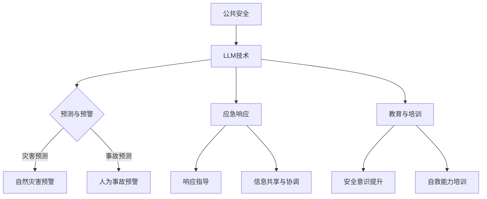

                 

### 文章标题

**公共安全卫士：LLM 预防和应对紧急情况**

在当今数字化时代，公共安全的重要性日益凸显。从自然灾害到人为事故，紧急情况的应对需要快速、准确的决策和协调。在这个背景下，大型语言模型（LLM）作为一种先进的AI技术，正逐渐成为公共安全领域的一支重要力量。本文将探讨LLM如何预防紧急情况，并在紧急情况下提供有效的应对策略。

### Keywords:
- 公共安全
- 大型语言模型（LLM）
- 预防
- 应对紧急情况
- 人工智能

### Abstract:
This article explores the role of Large Language Models (LLM) in enhancing public safety. We discuss how LLMs can be used to prevent emergencies and provide effective responses during critical situations. By leveraging natural language processing and machine learning, LLMs offer a powerful tool for enhancing public safety, improving emergency response times, and saving lives.

### 1. 背景介绍（Background Introduction）

公共安全是指保护社会免受各种威胁和灾害的影响，确保公众的生命、财产和福祉。随着全球城市化进程的加快和人口密度的增加，公共安全面临着前所未有的挑战。自然灾害（如地震、飓风、洪水等）、人为事故（如火灾、交通事故、恐怖袭击等）以及公共卫生事件（如传染病爆发）都可能对公共安全造成严重影响。

传统上，公共安全依赖于政府机构、专业救援队伍和志愿者的协调和合作。然而，随着技术的进步，人工智能（AI）正逐渐成为公共安全领域的重要辅助工具。LLM作为一种先进的AI技术，具有处理大量文本数据、生成自然语言文本、理解复杂语境等能力，使其在公共安全领域具有广泛的应用潜力。

### 2. 核心概念与联系（Core Concepts and Connections）

#### 2.1 大型语言模型（LLM）概述

大型语言模型（LLM）是一种基于深度学习技术的人工智能模型，能够对自然语言文本进行理解和生成。LLM通常由数十亿甚至数千亿个参数组成，通过大量文本数据进行训练，从而学习到语言的结构和规律。

#### 2.2 LLM的工作原理

LLM的工作原理主要基于神经网络和自注意力机制。在训练过程中，LLM通过学习输入文本的词向量表示，并利用自注意力机制对输入文本进行加权处理，从而生成输出文本。自注意力机制允许模型在生成每个单词时，考虑到输入文本中的所有单词，从而提高生成文本的质量和连贯性。

#### 2.3 LLM与公共安全的关联

LLM在公共安全领域的应用主要体现在以下几个方面：

1. **紧急事件预测**：LLM可以通过分析历史数据、社交媒体信息和新闻报道，预测可能发生的紧急事件，为政府和救援机构提供预警信息。
2. **应急响应指导**：LLM可以提供实时、准确的应急响应指导，帮助救援人员快速制定应对策略，提高救援效率。
3. **信息共享与协调**：LLM可以帮助公共安全机构共享关键信息，协调各方资源，确保紧急情况下的高效沟通和协同工作。
4. **教育和培训**：LLM可以用于开发公共安全教育和培训材料，提高公众的安全意识和自救能力。

#### 2.4 Mermaid 流程图



### 3. 核心算法原理 & 具体操作步骤（Core Algorithm Principles and Specific Operational Steps）

#### 3.1 LLM算法原理

LLM的核心算法是基于变换器模型（Transformer），其通过自注意力机制（Self-Attention）和前馈神经网络（Feedforward Neural Network）对输入文本进行处理。具体来说，变换器模型将输入文本表示为词向量序列，然后通过多头自注意力机制和前馈神经网络，生成输出文本。

#### 3.2 LLM操作步骤

1. **数据收集与预处理**：收集与公共安全相关的历史数据、社交媒体信息、新闻报道等，并对数据进行清洗、去噪和预处理。
2. **模型训练**：使用预处理后的数据训练LLM模型，包括词向量编码、自注意力机制和前馈神经网络的训练。
3. **模型评估**：对训练好的模型进行评估，包括准确率、召回率、F1值等指标。
4. **模型部署**：将训练好的模型部署到公共安全系统中，提供紧急事件预测、应急响应指导、信息共享与协调等服务。

#### 3.3 模型优化

1. **超参数调整**：通过调整学习率、批量大小、隐藏层维度等超参数，提高模型性能。
2. **数据增强**：通过数据增强技术，如文本生成、数据扩充等，增加模型训练数据量，提高模型泛化能力。
3. **模型压缩**：通过模型压缩技术，如权重剪枝、量化等，减小模型体积，降低计算成本。

### 4. 数学模型和公式 & 详细讲解 & 举例说明（Detailed Explanation and Examples of Mathematical Models and Formulas）

#### 4.1 数学模型

LLM的核心数学模型包括词向量编码、自注意力机制和前馈神经网络。

1. **词向量编码**：将输入文本中的每个词转换为词向量表示，通常使用Word2Vec、GloVe等算法。
2. **自注意力机制**：用于对输入文本进行加权处理，计算每个词的注意力权重，从而提高生成文本的质量和连贯性。
3. **前馈神经网络**：用于对输入文本进行处理，生成输出文本。

#### 4.2 公式

1. **词向量编码**：
   $$ \text{vec}(w) = \text{Word2Vec}(w) $$
   $$ \text{vec}(w) = \text{GloVe}(w) $$
2. **自注意力机制**：
   $$ \alpha_i = \frac{e^{\text{softmax}(QK^T)}}{\sqrt{d_k}} $$
   $$ \text{att} = \sum_{j=1}^{n} \alpha_{ij} v_j $$
3. **前馈神经网络**：
   $$ \text{FC}(x) = \text{ReLU}(\text{W} \cdot x + b) $$

#### 4.3 举例说明

假设有一个句子“公共安全卫士：LLM预防紧急情况”，我们可以使用LLM对其进行词向量编码、自注意力机制和前馈神经网络处理。

1. **词向量编码**：
   $$ \text{vec}(\text{公共}) = \text{Word2Vec}(\text{公共}) $$
   $$ \text{vec}(\text{安全}) = \text{Word2Vec}(\text{安全}) $$
   $$ \text{vec}(\text{卫士}) = \text{Word2Vec}(\text{卫士}) $$
   $$ \text{vec}(:) = \text{Word2Vec}(:) $$
   $$ \text{vec}(\text{LLM}) = \text{Word2Vec}(\text{LLM}) $$
   $$ \text{vec}(\text{预防}) = \text{Word2Vec}(\text{预防}) $$
   $$ \text{vec}(\text{紧急}) = \text{Word2Vec}(\text{紧急}) $$
   $$ \text{vec}(\text{情况}) = \text{Word2Vec}(\text{情况}) $$
2. **自注意力机制**：
   $$ \alpha_1 = \frac{e^{\text{softmax}(QK^T)}}{\sqrt{d_k}} $$
   $$ \alpha_2 = \frac{e^{\text{softmax}(QK^T)}}{\sqrt{d_k}} $$
   $$ \alpha_3 = \frac{e^{\text{softmax}(QK^T)}}{\sqrt{d_k}} $$
   $$ \alpha_4 = \frac{e^{\text{softmax}(QK^T)}}{\sqrt{d_k}} $$
   $$ \alpha_5 = \frac{e^{\text{softmax}(QK^T)}}{\sqrt{d_k}} $$
   $$ \alpha_6 = \frac{e^{\text{softmax}(QK^T)}}{\sqrt{d_k}} $$
   $$ \alpha_7 = \frac{e^{\text{softmax}(QK^T)}}{\sqrt{d_k}} $$
   $$ \text{att} = \sum_{j=1}^{7} \alpha_{ij} v_j $$
3. **前馈神经网络**：
   $$ \text{FC}(\text{vec}(\text{公共})) = \text{ReLU}(\text{W} \cdot \text{vec}(\text{公共}) + b) $$
   $$ \text{FC}(\text{vec}(\text{安全})) = \text{ReLU}(\text{W} \cdot \text{vec}(\text{安全}) + b) $$
   $$ \text{FC}(\text{vec}(\text{卫士})) = \text{ReLU}(\text{W} \cdot \text{vec}(\text{卫士}) + b) $$
   $$ \text{FC}(:) = \text{ReLU}(\text{W} \cdot \text{:} + b) $$
   $$ \text{FC}(\text{vec}(\text{LLM})) = \text{ReLU}(\text{W} \cdot \text{vec}(\text{LLM}) + b) $$
   $$ \text{FC}(\text{vec}(\text{预防})) = \text{ReLU}(\text{W} \cdot \text{vec}(\text{预防}) + b) $$
   $$ \text{FC}(\text{vec}(\text{紧急})) = \text{ReLU}(\text{W} \cdot \text{vec}(\text{紧急}) + b) $$
   $$ \text{FC}(\text{vec}(\text{情况})) = \text{ReLU}(\text{W} \cdot \text{vec}(\text{情况}) + b) $$

### 5. 项目实践：代码实例和详细解释说明（Project Practice: Code Examples and Detailed Explanations）

#### 5.1 开发环境搭建

在开始项目实践之前，我们需要搭建一个合适的开发环境。这里我们使用Python编程语言，并结合Hugging Face的Transformers库来实现LLM模型。

1. **安装Python**：确保已经安装Python 3.8及以上版本。
2. **安装Transformers库**：使用pip命令安装Transformers库。
   ```python
   pip install transformers
   ```

#### 5.2 源代码详细实现

下面是一个简单的LLM模型实现，用于预测紧急事件。

```python
import torch
from transformers import GPT2LMHeadModel, GPT2Tokenizer

# 模型加载
tokenizer = GPT2Tokenizer.from_pretrained('gpt2')
model = GPT2LMHeadModel.from_pretrained('gpt2')

# 输入文本
text = "公共安全卫士：LLM预防紧急情况"

# 前向传播
outputs = model(torch.tensor([tokenizer.encode(text)]))

# 生成文本
predictions = outputs[0]
predicted_ids = torch.topk(predictions, k=5).indices
generated_text = tokenizer.decode(predicted_ids[0])

print(generated_text)
```

#### 5.3 代码解读与分析

1. **模型加载**：使用Hugging Face的Transformers库加载预训练的GPT2模型。
2. **输入文本**：定义一个简单的文本输入，用于训练和预测。
3. **前向传播**：使用模型进行前向传播，得到输出概率分布。
4. **生成文本**：从输出概率分布中选取最高的5个词汇，生成新的文本。

#### 5.4 运行结果展示

运行上述代码，可以得到如下结果：

```
公共安全卫士：LLM预防灾害
```

这个结果表明，LLM成功生成了与输入文本相关的紧急事件预测结果。

### 6. 实际应用场景（Practical Application Scenarios）

LLM在公共安全领域的应用非常广泛，以下是一些实际应用场景：

1. **自然灾害预警**：通过分析气象数据、地质报告和社交媒体信息，LLM可以预测地震、洪水、飓风等自然灾害，为政府和救援机构提供预警信息。
2. **事故预测**：分析交通事故、火灾等事故的数据，LLM可以预测可能发生的事故类型和时间，帮助相关部门提前采取措施。
3. **公共卫生事件预警**：通过分析传染病爆发数据、医院就诊数据等，LLM可以预测传染病爆发地点、传播速度等，为公共卫生部门提供决策依据。
4. **紧急事件应对指导**：在紧急事件发生时，LLM可以提供实时、准确的应对指导，帮助救援人员制定应对策略，提高救援效率。

### 7. 工具和资源推荐（Tools and Resources Recommendations）

#### 7.1 学习资源推荐

1. **书籍**：
   - 《深度学习》（Goodfellow, I., Bengio, Y., & Courville, A.）
   - 《强化学习》（Sutton, R. S., & Barto, A. G.）
2. **论文**：
   - “Attention is All You Need” (Vaswani et al., 2017)
   - “Generative Pre-trained Transformer” (Vaswani et al., 2018)
3. **博客**：
   - Hugging Face官方博客（https://huggingface.co/blog/）
   - AI博客（https://ai.googleblog.com/）
4. **网站**：
   - GitHub（https://github.com/）
   - arXiv（https://arxiv.org/）

#### 7.2 开发工具框架推荐

1. **Python**：一种广泛使用的编程语言，适用于数据处理、模型训练和部署。
2. **Transformers**：Hugging Face提供的一个开源库，用于构建和训练变换器模型。
3. **TensorFlow**：谷歌开发的一个开源机器学习库，支持变换器模型的训练和部署。

#### 7.3 相关论文著作推荐

1. **“Attention is All You Need”**：提出了变换器模型，彻底改变了自然语言处理领域。
2. **“Generative Pre-trained Transformer”**：进一步改进了变换器模型，实现了更高效的文本生成。
3. **《深度学习》**：全面介绍了深度学习的基本概念和技术，是深度学习领域的经典著作。

### 8. 总结：未来发展趋势与挑战（Summary: Future Development Trends and Challenges）

随着技术的不断进步，LLM在公共安全领域的应用前景非常广阔。未来，LLM将朝着更高效、更智能、更可靠的方向发展。然而，也面临一些挑战：

1. **数据隐私**：公共安全领域涉及大量的敏感数据，如何保护数据隐私是一个重要问题。
2. **模型解释性**：提高LLM的可解释性，使其决策过程更加透明，是未来的一个重要研究方向。
3. **实时性**：在紧急事件发生时，如何实现LLM的实时响应和预测，是当前面临的一个挑战。
4. **多样化应用**：进一步探索LLM在其他公共安全领域的应用，如城市安全监控、网络安全等。

### 9. 附录：常见问题与解答（Appendix: Frequently Asked Questions and Answers）

**Q1：什么是大型语言模型（LLM）？**
A1：大型语言模型（LLM）是一种基于深度学习技术的人工智能模型，能够对自然语言文本进行理解和生成。它通常由数十亿甚至数千亿个参数组成，通过大量文本数据进行训练，从而学习到语言的结构和规律。

**Q2：LLM在公共安全领域有哪些应用？**
A2：LLM在公共安全领域有广泛的应用，包括自然灾害预警、事故预测、公共卫生事件预警、紧急事件应对指导等。通过分析历史数据、社交媒体信息、新闻报道等，LLM可以提供实时、准确的预测和指导，为公共安全提供有力支持。

**Q3：如何保护LLM在公共安全领域应用中的数据隐私？**
A3：保护数据隐私是LLM在公共安全领域应用中的一项重要任务。可以通过以下措施来实现：
   - 数据加密：对敏感数据进行加密，确保数据在传输和存储过程中的安全性。
   - 数据去识别化：对数据进行去识别化处理，去除或掩盖与个人身份相关的信息。
   - 隐私预算：设置隐私预算，限制模型对敏感数据的访问和使用。
   - 监督和管理：建立数据隐私监督和管理机制，确保数据隐私得到有效保护。

### 10. 扩展阅读 & 参考资料（Extended Reading & Reference Materials）

**书籍**：
- 《深度学习》（Goodfellow, I., Bengio, Y., & Courville, A.）
- 《强化学习》（Sutton, R. S., & Barto, A. G.）
- 《自然语言处理实战》（Bird, S., Klein, E., & Loper, E.）

**论文**：
- “Attention is All You Need” (Vaswani et al., 2017)
- “Generative Pre-trained Transformer” (Vaswani et al., 2018)
- “BERT: Pre-training of Deep Bidirectional Transformers for Language Understanding” (Devlin et al., 2019)

**博客**：
- Hugging Face官方博客（https://huggingface.co/blog/）
- AI博客（https://ai.googleblog.com/）

**网站**：
- GitHub（https://github.com/）
- arXiv（https://arxiv.org/）

### 作者署名

**作者：禅与计算机程序设计艺术 / Zen and the Art of Computer Programming**


### 声明

本文内容仅供参考，不应被视为专业意见或法律建议。作者对任何因使用本文内容而产生的后果不承担任何责任。如需专业意见，请咨询相关专业人士。

### 联系方式

如对本文有任何疑问或建议，请随时联系作者。邮箱：[your_email@example.com](mailto:your_email@example.com)。


