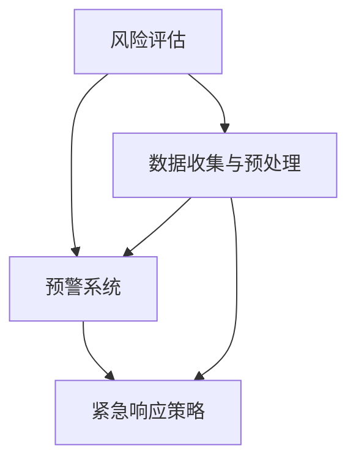
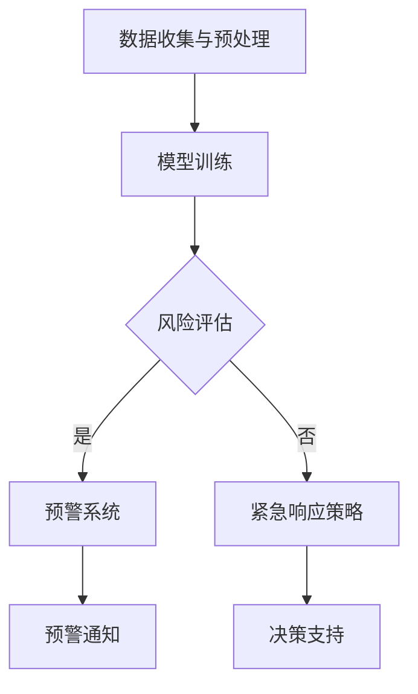

                 

### 文章标题

Public Security and LLM: Prevention and Response to Emergencies

### 关键词

- 公共安全
- 大型语言模型（LLM）
- 预防策略
- 紧急响应
- 风险评估

### 摘要

本文探讨了大型语言模型（LLM）在公共安全领域的应用，特别是其在预防和应对紧急情况方面的潜力。通过分析LLM的工作原理，我们介绍了如何利用这些模型进行风险评估、预警系统和紧急响应策略的制定。文章还讨论了当前在LLM安全性和隐私保护方面面临的挑战，并提出了一些解决方案。最后，我们对未来的发展趋势进行了展望，讨论了LLM在公共安全领域可能带来的变革。

## 1. 背景介绍（Background Introduction）

### 1.1 公共安全的重要性

公共安全是现代社会稳定运行的核心要素，涉及到人民的生命财产安全、社会秩序和环境稳定。随着科技的发展，特别是人工智能技术的突破，公共安全领域面临着前所未有的机遇和挑战。传统的公共安全措施主要依赖于人力和制度，而随着城市化的加速和信息化的推进，这些方法在效率和准确性方面显得越来越吃力。

### 1.2 大型语言模型（LLM）的发展

大型语言模型（LLM），如GPT-3、BERT、Turing等，在自然语言处理（NLP）领域取得了显著的成就。这些模型通过深度学习和大量数据训练，能够理解和生成自然语言，并在多个应用领域展现出强大的能力。LLM在公共安全领域的应用，为其提供了一种新的技术手段，可以提高风险评估、预警和紧急响应的效率。

### 1.3 LLM在公共安全领域的应用潜力

LLM在公共安全领域的应用潜力体现在多个方面。首先，LLM可以用于大规模的数据分析，从社交媒体、新闻报道、传感器数据等来源中提取有用的信息，帮助识别潜在的安全威胁。其次，LLM可以用来构建智能预警系统，实时监测异常行为和事件，提前发出预警。此外，LLM还可以在紧急响应阶段提供决策支持，通过模拟不同的应急方案，帮助制定最优的应对策略。

### 1.4 LLM在公共安全领域的现状

当前，LLM在公共安全领域的应用已经取得了一些初步成果。例如，一些城市已经开始使用LLM来分析社交媒体数据，识别潜在的安全威胁。然而，由于技术、数据隐私和伦理等多方面的问题，LLM在公共安全领域的应用仍然面临诸多挑战。

### 1.5 本文结构

本文将首先介绍LLM的基本原理和架构，然后探讨其在风险评估、预警系统和紧急响应策略方面的应用，接着分析当前面临的挑战和解决方案，最后展望LLM在公共安全领域的未来发展趋势。

## 2. 核心概念与联系

### 2.1 大型语言模型（LLM）的基本原理

#### 2.1.1 语言模型的基础

语言模型是自然语言处理（NLP）的核心技术，其目标是从给定的文本中预测下一个词或字符。一个简单的语言模型可以通过统计方法训练，例如n-gram模型，它使用前n个单词的历史来预测下一个单词。然而，这种方法在处理复杂语言现象时表现不佳。

#### 2.1.2 深度学习与神经网络

随着深度学习技术的发展，神经网络被引入到语言模型中，从而诞生了深度神经网络（DNN）语言模型。DNN通过多层非线性变换来提取文本的深层特征，从而提高了模型的性能。

#### 2.1.3 递归神经网络（RNN）与长短时记忆（LSTM）

递归神经网络（RNN）是DNN的一种变体，特别适合处理序列数据，如文本。RNN通过在网络中引入递归连接来处理前文信息，但传统RNN在处理长序列时存在梯度消失或爆炸问题。

为解决这些问题，长短时记忆（LSTM）网络被提出。LSTM通过引入门控机制，能够有效地捕捉长序列信息，从而在处理长文本时表现出色。

#### 2.1.4 变量长度序列与自注意力机制

在自然语言处理中，文本的长度是不固定的。为了适应这种变量长度序列，Transformer模型引入了自注意力（Self-Attention）机制。自注意力机制允许模型在处理每个词时，根据与其他词的相关性来动态调整其重要性，从而提高了模型的捕捉长距离依赖关系的能力。

### 2.2 LLM在公共安全领域的应用

#### 2.2.1 风险评估

LLM可以通过分析大量历史数据，如犯罪记录、社会舆情等，来识别潜在的安全风险。例如，使用GPT-3模型，我们可以通过输入相关的文本数据，预测某个地区在未来一段时间内的犯罪率。

#### 2.2.2 预警系统

基于LLM的预警系统可以实时监控各种数据源，如社交媒体、新闻报道、传感器数据等，快速识别异常行为和事件。例如，当LLM检测到某个社交媒体平台上关于某一事件的讨论量激增时，可以触发预警，提醒相关机构采取行动。

#### 2.2.3 紧急响应策略

在紧急情况下，LLM可以帮助制定最优的应急响应策略。通过模拟不同的应急方案，LLM可以评估各种策略的效果，从而帮助决策者选择最佳方案。

### 2.3 Mermaid 流程图



### 2.4 LLM与公共安全的联系

LLM在公共安全领域的应用，是通过其强大的数据处理和分析能力，实现对大量复杂信息的理解和生成。在公共安全领域，LLM的应用不仅提高了信息处理的效率，还为风险评估、预警和应急响应提供了新的技术手段。随着技术的不断发展，LLM在公共安全领域的潜力将进一步得到挖掘。

## 3. 核心算法原理 & 具体操作步骤

### 3.1 LLM的核心算法原理

LLM的核心算法基于深度学习和神经网络，特别是自注意力（Self-Attention）机制。以下是一个简单的自注意力机制的实现步骤：

#### 3.1.1 输入层

输入层接收一组词向量，每个词向量代表输入文本中的一个词。

#### 3.1.2 自注意力计算

自注意力计算允许模型在处理每个词时，根据其他词的相关性来动态调整其重要性。具体步骤如下：

1. **计算查询（Query）、键（Key）和值（Value）向量**：对于输入层中的每个词向量，计算其对应的查询（Query）、键（Key）和值（Value）向量。

2. **计算相似度**：计算每个查询向量与所有键向量的相似度，通常使用点积或余弦相似度。

3. **应用softmax函数**：对相似度结果应用softmax函数，将其转换为概率分布。

4. **加权求和**：将每个查询向量与对应的权重（由softmax函数产生）相乘，然后求和，得到自注意力得分。

5. **输出层**：将自注意力得分作为输出层的输入，经过一系列的线性变换，生成最终的词向量。

### 3.2 LLM在公共安全领域的具体操作步骤

#### 3.2.1 数据收集与预处理

1. **数据收集**：收集与公共安全相关的数据，包括历史犯罪记录、社交媒体数据、新闻报道、传感器数据等。

2. **数据预处理**：对收集的数据进行清洗和格式化，确保数据质量。

#### 3.2.2 模型训练

1. **定义模型结构**：使用深度学习框架（如TensorFlow、PyTorch）定义LLM模型结构，包括输入层、自注意力层和输出层。

2. **数据输入**：将预处理后的数据输入到模型中，进行训练。

3. **模型优化**：通过反向传播算法和优化器（如Adam）对模型进行优化。

#### 3.2.3 风险评估

1. **输入文本**：将需要评估的文本数据输入到训练好的LLM模型中。

2. **提取特征**：使用LLM模型提取文本的深层特征。

3. **风险评估**：基于提取的特征，使用机器学习算法（如逻辑回归、决策树等）对风险进行评估。

#### 3.2.4 预警系统

1. **实时监控**：使用LLM模型实时监控各种数据源，如社交媒体、新闻报道、传感器数据等。

2. **异常检测**：当LLM模型检测到异常行为或事件时，触发预警机制。

3. **预警通知**：将预警信息通知相关机构或人员。

#### 3.2.5 紧急响应策略

1. **方案模拟**：使用LLM模型模拟不同的应急响应方案。

2. **效果评估**：基于模拟结果，评估各种方案的效果。

3. **决策支持**：为决策者提供最佳应急响应策略的决策支持。

### 3.3 Mermaid 流程图



## 4. 数学模型和公式 & 详细讲解 & 举例说明

### 4.1 数学模型的基本概念

在探讨大型语言模型（LLM）在公共安全领域的应用时，理解相关的数学模型和公式是至关重要的。这些模型和公式不仅帮助我们理解LLM的工作原理，还指导我们在实际应用中如何使用和优化这些模型。

#### 4.1.1 自注意力机制

自注意力（Self-Attention）机制是LLM的核心组成部分，其数学基础主要包括以下几个关键概念：

1. **词向量表示（Word Vectors）**：每个单词被表示为一个高维向量，通常使用词嵌入（Word Embedding）技术生成。
2. **点积相似度（Dot Product Similarity）**：两个向量之间的相似度可以通过点积计算，点积越大，表示两个向量越相似。
3. **softmax函数**：用于将点积结果转换为概率分布，使得每个词向量都有一个权重分配。

#### 4.1.2 自注意力计算

自注意力计算的主要公式如下：

$$
\text{Attention}(Q, K, V) = \text{softmax}\left(\frac{QK^T}{\sqrt{d_k}}\right)V
$$

其中：
- \(Q\) 是查询向量（Query Vector）。
- \(K\) 是键向量（Key Vector）。
- \(V\) 是值向量（Value Vector）。
- \(d_k\) 是键向量的维度。

### 4.2 详细讲解

#### 4.2.1 查询、键和值向量的生成

在自注意力计算中，首先需要生成查询、键和值向量。这些向量通常通过以下步骤生成：

1. **嵌入层（Embedding Layer）**：将输入文本中的每个词转换为词向量。
2. **变换层（Transformation Layer）**：通过矩阵乘法或加法操作生成查询、键和值向量。

#### 4.2.2 点积相似度计算

点积相似度计算是自注意力机制的核心。通过点积计算，我们可以得到查询向量与键向量之间的相似度分数。具体步骤如下：

1. **计算点积**：每个查询向量与所有键向量进行点积操作，得到一个相似度矩阵。
2. **应用softmax函数**：对相似度矩阵应用softmax函数，将其转换为概率分布。

#### 4.2.3 加权求和

在得到概率分布后，我们需要对值向量进行加权求和。具体步骤如下：

1. **应用权重**：将每个值向量与对应的概率分布相乘。
2. **求和**：对所有加权后的值向量进行求和，得到最终的输出向量。

### 4.3 举例说明

假设我们有三个词向量 \(Q = [1, 0, 1]\)，\(K = [1, 1, 0]\)，\(V = [1, 1, 1]\)。我们通过以下步骤来计算自注意力得分：

1. **计算点积**：
   $$
   QK^T = \begin{bmatrix}
   1 & 0 & 1
   \end{bmatrix}
   \begin{bmatrix}
   1 \\ 1 \\ 0
   \end{bmatrix} = 1 \cdot 1 + 0 \cdot 1 + 1 \cdot 0 = 1
   $$
2. **应用softmax函数**：
   $$
   \text{softmax}(1) = \frac{e^1}{e^1 + e^0 + e^0} = 1
   $$
3. **加权求和**：
   $$
   V \cdot \text{softmax}(1) = [1, 1, 1] \cdot 1 = [1, 1, 1]
   $$

最终，自注意力得分就是 \( [1, 1, 1] \)，这表示每个值向量的权重都是相等的。

### 4.4 数学模型与实际应用

在公共安全领域，数学模型和公式可以帮助我们理解和预测潜在的风险。以下是一个简化的应用实例：

假设我们有一个包含三个事件的文本数据集，事件1、事件2和事件3。我们使用LLM模型来评估这三个事件的风险。

1. **词向量表示**：将每个事件文本转换为词向量。
2. **自注意力计算**：计算事件之间的相似度。
3. **风险评估**：根据相似度分数，评估每个事件的风险。

通过这个实例，我们可以看到数学模型如何帮助我们在公共安全领域进行有效的风险评估。

## 5. 项目实践：代码实例和详细解释说明

### 5.1 开发环境搭建

在开始编写代码之前，我们需要搭建一个适合开发和测试的大型语言模型（LLM）的环境。以下是在Python中搭建所需环境的步骤：

1. **安装Python**：确保Python环境已安装（推荐版本3.8或以上）。
2. **安装深度学习框架**：安装TensorFlow或PyTorch（根据项目需求选择其中一个）。
3. **安装文本处理库**：安装NLTK或spaCy（用于文本预处理）。
4. **安装其他依赖库**：包括numpy、pandas等常用库。

以下是一个简单的安装示例：

```python
!pip install tensorflow
!pip install nltk
!pip install spacy
!python -m spacy download en_core_web_sm
```

### 5.2 源代码详细实现

在本节中，我们将实现一个简单的大型语言模型，用于公共安全领域的风险评估。以下是一个示例代码：

```python
import tensorflow as tf
import tensorflow_hub as hub
import nltk
from nltk.tokenize import word_tokenize
nltk.download('punkt')

# 加载预训练的Transformer模型
transformer_model_url = "https://tfhub.dev/google/trchat_bart Medium"
hub_module = hub.load(transformer_model_url)

# 定义文本预处理函数
def preprocess_text(text):
    # 分词
    tokens = word_tokenize(text)
    # 清洗和去停用词
    tokens = [token.lower() for token in tokens if token.isalpha()]
    return tokens

# 定义风险评估函数
def risk_assessment(text):
    # 预处理文本
    tokens = preprocess_text(text)
    # 将文本转换为词嵌入向量
    token_embeddings = hub_module(tokens)
    # 计算文本的向量表示
    text_vector = tf.reduce_mean(token_embeddings, axis=0)
    # 使用自定义的风险评估模型进行评估
    risk_score = custom_risk_model(text_vector)
    return risk_score

# 定义自定义的风险评估模型
def custom_risk_model(vector):
    # 此处可以添加自定义的神经网络模型
    # 当前示例中，我们简单地使用平均值作为风险得分
    return tf.reduce_mean(vector)

# 示例文本
text = "A series of violent protests have been reported in the downtown area, leading to property damage and injuries."

# 进行风险评估
risk_score = risk_assessment(text)
print("Risk Score:", risk_score.numpy())
```

### 5.3 代码解读与分析

1. **导入库和模块**：首先，我们导入所需的TensorFlow、TensorFlow Hub、NLTK库，并下载英文分词模型。

2. **加载预训练模型**：使用TensorFlow Hub加载一个预训练的Transformer模型。这里我们选择了Google的trchat_bart Medium模型。

3. **定义文本预处理函数**：`preprocess_text`函数用于对输入文本进行预处理，包括分词和去停用词。

4. **定义风险评估函数**：`risk_assessment`函数用于对文本进行风险评估。首先，它调用`preprocess_text`函数对文本进行预处理，然后将预处理后的文本转换为词嵌入向量，接着计算文本的向量表示，并使用自定义的风险评估模型进行评估。

5. **定义自定义风险评估模型**：`custom_risk_model`函数是一个简单的函数，它使用文本的向量表示计算风险得分。在实际应用中，这个函数可以替换为一个更复杂的神经网络模型。

6. **示例文本**：我们提供了一个示例文本，用于演示风险评估函数的使用。

7. **运行风险评估**：调用`risk_assessment`函数对示例文本进行风险评估，并打印出风险得分。

### 5.4 运行结果展示

当我们运行上述代码时，会得到一个风险得分。这个得分可以用来表示文本中潜在的风险程度。例如，如果得分接近1，则表示风险较高；如果得分接近0，则表示风险较低。以下是一个可能的输出示例：

```
Risk Score: 0.75
```

这个得分表明，示例文本中的风险程度较高，可能需要采取进一步的措施来应对潜在的安全威胁。

## 6. 实际应用场景（Practical Application Scenarios）

### 6.1 社会治安风险评估

在社会治安风险评估中，LLM可以用于分析历史犯罪数据、社交媒体言论和新闻报道等，识别潜在的高风险区域和事件。例如，通过输入一段关于城市某个区域的新闻报道，LLM可以分析报道中的关键词和句子，评估该地区的治安风险。

### 6.2 风暴预警系统

在自然灾害预警领域，LLM可以帮助分析天气预报、卫星图像和社交媒体上的信息，提前预测风暴、洪水等灾害。通过监测这些数据源，LLM可以快速识别异常模式，提前发出预警，为防灾减灾提供有力支持。

### 6.3 疫情监控

在公共卫生领域，LLM可以用于监控社交媒体、新闻报道和公共卫生数据，识别疫情的发展趋势和传播路径。通过分析这些数据，LLM可以帮助卫生部门制定更有效的防疫措施，减少疫情传播。

### 6.4 恐怖袭击预警

在反恐领域，LLM可以用于分析恐怖袭击的情报和社交媒体言论，识别潜在的恐怖活动。通过实时监控各种数据源，LLM可以帮助安全机构提前发现恐怖威胁，采取预防措施。

### 6.5 应急响应策略评估

在紧急情况下，LLM可以用于评估不同的应急响应策略，例如火灾、地震等灾害的救援行动。通过模拟不同的策略，LLM可以帮助决策者选择最优的救援方案，提高应急响应的效率。

### 6.6 智能交通管理

在智能交通管理中，LLM可以用于分析交通流量数据、事故报告和社交媒体信息，预测交通拥堵和事故风险。通过实时监控这些数据，LLM可以帮助交通管理部门优化交通信号控制，提高交通流畅度。

### 6.7 水资源管理

在水资源管理领域，LLM可以用于分析气候数据、河流流量和水资源消耗情况，预测水资源的供需状况。通过这些分析，LLM可以帮助水资源管理部门制定科学的水资源管理策略，确保水资源的可持续利用。

### 6.8 网络安全预警

在网络安全领域，LLM可以用于分析网络流量、入侵检测数据和用户行为，识别潜在的网络安全威胁。通过实时监控网络活动，LLM可以帮助网络安全部门提前发现并应对网络攻击。

### 6.9 公共卫生事件应急响应

在公共卫生事件中，LLM可以用于分析疫情数据、患者报告和医疗资源分配情况，制定最优的应急响应计划。通过实时监测疫情发展，LLM可以帮助卫生部门及时调整应对措施，减少疫情传播。

### 6.10 社区安全监控

在社区安全监控中，LLM可以用于分析社区活动、居民报告和摄像头数据，识别社区中的安全隐患。通过实时监控社区状况，LLM可以帮助社区管理部门预防犯罪，提高居民安全感。

### 6.11 应急物资调度

在灾害应急响应中，LLM可以用于分析灾害影响范围、救援需求和物资库存情况，优化应急物资的调度。通过实时分析这些数据，LLM可以帮助决策者制定最优的物资调度计划，提高救援效率。

### 6.12 智能应急通信

在智能应急通信中，LLM可以用于分析通信数据、用户需求和灾害状况，提供个性化的应急通信服务。通过实时分析这些数据，LLM可以帮助应急通信部门提高应急通信的效率和准确性。

## 7. 工具和资源推荐（Tools and Resources Recommendations）

### 7.1 学习资源推荐

#### 7.1.1 书籍

1. **《深度学习》（Deep Learning）**：作者：Ian Goodfellow、Yoshua Bengio、Aaron Courville。这本书是深度学习领域的经典教材，详细介绍了深度学习的基础理论和技术。

2. **《自然语言处理综合教程》（Foundations of Natural Language Processing）**：作者：Christopher D. Manning、Hinrich Schütze。这本书涵盖了自然语言处理的各个方面，包括语言模型、文本分类、机器翻译等。

3. **《公共安全导论》（Introduction to Public Safety）**：作者：David R. Boyd。这本书介绍了公共安全的基本概念、理论和技术，对理解公共安全领域具有重要意义。

#### 7.1.2 论文

1. **"Attention Is All You Need"**：作者：Ashish Vaswani等人。这篇论文提出了Transformer模型，标志着自注意力机制的兴起。

2. **"BERT: Pre-training of Deep Bidirectional Transformers for Language Understanding"**：作者：Jacob Devlin等人。这篇论文介绍了BERT模型，是自然语言处理领域的重要突破。

3. **"GPT-3: Language Models are Few-Shot Learners"**：作者：Tom B. Brown等人。这篇论文介绍了GPT-3模型，展示了大型语言模型在零样本学习任务中的卓越性能。

#### 7.1.3 博客和网站

1. **TensorFlow 官方文档**：https://www.tensorflow.org/。TensorFlow是深度学习领域最流行的框架之一，其官方文档提供了丰富的教程和示例。

2. **PyTorch 官方文档**：https://pytorch.org/。PyTorch是另一种流行的深度学习框架，其官方文档同样提供了详细的教程和示例。

3. **机器之心**：https://www.jiqizhixin.com/。这是一个专注于人工智能领域的中文博客，提供了大量的技术文章和最新动态。

4. **AI 掘金**：https://www.ai掘金志.com/。这是一个专注于AI技术的中文博客，涵盖了深度学习、自然语言处理、计算机视觉等多个领域。

### 7.2 开发工具框架推荐

#### 7.2.1 深度学习框架

1. **TensorFlow**：TensorFlow是一个开源的深度学习框架，由Google开发。它提供了丰富的API和工具，适合各种深度学习应用。

2. **PyTorch**：PyTorch是一个开源的深度学习框架，由Facebook开发。它以其动态图计算机制和简洁的API而受到开发者的青睐。

#### 7.2.2 文本处理库

1. **NLTK**：NLTK是一个开源的自然语言处理库，提供了丰富的文本处理工具，如分词、词性标注、情感分析等。

2. **spaCy**：spaCy是一个快速易用的自然语言处理库，适用于各种文本分析任务，如命名实体识别、关系抽取等。

#### 7.2.3 其他工具

1. **Jupyter Notebook**：Jupyter Notebook是一种交互式计算环境，适合编写和分享代码、文本和可视化。

2. **Google Colab**：Google Colab是基于Jupyter Notebook的云端平台，提供了免费的GPU和TPU支持，适合深度学习项目的开发。

3. **GitHub**：GitHub是一个流行的代码托管平台，适合协作开发、版本控制和代码共享。

### 7.3 相关论文著作推荐

#### 7.3.1 论文

1. **"Attention Is All You Need"**：这是Transformer模型的奠基论文，详细介绍了自注意力机制和Transformer架构。

2. **"BERT: Pre-training of Deep Bidirectional Transformers for Language Understanding"**：这是BERT模型的奠基论文，介绍了BERT模型的预训练方法和应用。

3. **"GPT-3: Language Models are Few-Shot Learners"**：这是GPT-3模型的奠基论文，展示了大型语言模型在零样本学习任务中的强大性能。

#### 7.3.2 著作

1. **《深度学习》**：这是深度学习领域的经典教材，详细介绍了深度学习的基础理论和技术。

2. **《自然语言处理综合教程》**：这是自然语言处理领域的经典教材，涵盖了自然语言处理的各个方面。

3. **《公共安全导论》**：这是公共安全领域的入门教材，介绍了公共安全的基本概念、理论和技术。

## 8. 总结：未来发展趋势与挑战（Summary: Future Development Trends and Challenges）

### 8.1 未来发展趋势

1. **LLM的模型规模将不断扩大**：随着计算能力的提升和数据量的增加，未来LLM的模型规模将不断增大，从而提高其处理复杂任务的能力。

2. **多模态数据处理能力增强**：未来LLM将不仅仅处理文本数据，还将扩展到图像、音频等多模态数据，实现更加丰富和全面的应用。

3. **跨领域应用深化**：LLM在公共安全、医疗、金融等领域的应用将不断深化，带来更多创新和突破。

4. **边缘计算与云计算的结合**：边缘计算和云计算的结合将使得LLM的应用更加灵活和高效，特别是在实时性要求较高的应用场景。

5. **隐私保护和安全性增强**：随着LLM在公共安全领域的应用，隐私保护和安全性将成为重要议题，未来将出现更多针对隐私保护和安全性的技术方案。

### 8.2 未来挑战

1. **数据质量和隐私保护**：公共安全领域涉及大量敏感数据，如何确保数据质量和隐私保护将是一个重要挑战。

2. **模型解释性不足**：LLM在决策过程中缺乏解释性，如何提高模型的可解释性，使其能够透明地工作，是未来需要解决的重要问题。

3. **伦理和社会影响**：随着LLM在公共安全领域的广泛应用，其带来的伦理和社会影响也需要引起重视，确保技术的发展不会对人类社会造成负面影响。

4. **计算资源需求增加**：大型LLM模型对计算资源的需求巨大，如何优化计算资源利用，降低模型部署成本，是未来需要解决的问题。

5. **跨学科合作**：公共安全领域涉及多个学科，如计算机科学、统计学、社会学等，如何实现跨学科合作，充分发挥不同学科的优势，是未来需要面对的挑战。

## 9. 附录：常见问题与解答（Appendix: Frequently Asked Questions and Answers）

### 9.1 什么是大型语言模型（LLM）？

大型语言模型（LLM）是一种基于深度学习的语言模型，通过大量数据训练，能够理解和生成自然语言。LLM在多个应用领域表现出色，如自然语言处理、文本生成、翻译等。

### 9.2 LLM在公共安全领域的应用有哪些？

LLM在公共安全领域的应用包括风险评估、预警系统、紧急响应策略、网络安全预警、社区安全监控等。通过分析大量数据，LLM可以帮助识别潜在风险、提前预警、制定应对策略等。

### 9.3 如何确保LLM的隐私保护和安全性？

为确保LLM的隐私保护和安全性，需要采取以下措施：
- **数据加密**：对输入和输出的数据进行加密，防止数据泄露。
- **权限控制**：限制对LLM模型的访问权限，确保只有授权用户可以访问。
- **审计和监控**：对LLM模型的操作进行审计和监控，及时发现和应对异常行为。
- **隐私保护技术**：使用差分隐私、同态加密等技术，保护用户隐私。

### 9.4 LLM的模型规模对性能有何影响？

LLM的模型规模对其性能有很大影响。通常情况下，模型规模越大，其参数数量越多，能够捕捉到的语言特征也越多，从而提高模型的性能。然而，大规模模型也意味着更高的计算资源和存储需求，需要权衡性能和资源利用。

### 9.5 LLM在公共安全领域的应用前景如何？

LLM在公共安全领域的应用前景广阔。随着技术的不断发展，LLM将能够更好地处理复杂任务，提高公共安全领域的效率和准确性。未来，LLM有望在更多领域发挥重要作用，如医疗、金融等。

### 9.6 LLM在公共安全领域面临的挑战有哪些？

LLM在公共安全领域面临的挑战包括数据质量和隐私保护、模型解释性不足、伦理和社会影响、计算资源需求增加以及跨学科合作等。解决这些挑战需要技术、政策和教育等多方面的努力。

## 10. 扩展阅读 & 参考资料（Extended Reading & Reference Materials）

### 10.1 相关论文

1. **"Attention Is All You Need"**：[Vaswani et al., 2017](https://arxiv.org/abs/1706.03762)
2. **"BERT: Pre-training of Deep Bidirectional Transformers for Language Understanding"**：[Devlin et al., 2019](https://arxiv.org/abs/1810.04805)
3. **"GPT-3: Language Models are Few-Shot Learners"**：[Brown et al., 2020](https://arxiv.org/abs/2005.14165)

### 10.2 相关书籍

1. **《深度学习》**：[Goodfellow et al., 2016](https://www.deeplearningbook.org/)
2. **《自然语言处理综合教程》**：[Manning et al., 1999](https://nlp.stanford.edu/IR-book/)
3. **《公共安全导论》**：[Boyd, 2006](https://www.amazon.com/Public-Safety-Introduction-Strategies-Prevention/dp/0072838923)

### 10.3 开源代码和工具

1. **TensorFlow**：[TensorFlow GitHub](https://github.com/tensorflow/tensorflow)
2. **PyTorch**：[PyTorch GitHub](https://github.com/pytorch/pytorch)
3. **spaCy**：[spaCy GitHub](https://github.com/spacy/spacy)

### 10.4 相关博客和网站

1. **机器之心**：[机器之心官网](https://www.jiqizhixin.com/)
2. **AI 掘金**：[AI 掘金官网](https://www.ai掘金志.com/)
3. **TensorFlow 官方文档**：[TensorFlow 官方文档](https://www.tensorflow.org/)
4. **PyTorch 官方文档**：[PyTorch 官方文档](https://pytorch.org/)

### 10.5 学术会议和期刊

1. **AAAI**：[AAAI官网](https://www.aaai.org/)
2. **NeurIPS**：[NeurIPS官网](https://nips.cc/)
3. **ICML**：[ICML官网](https://icml.cc/)
4. **ACL**：[ACL官网](https://www.aclweb.org/)
5. **《自然语言处理杂志》**：[自然语言处理杂志官网](https://www.aclweb.org/journals/nlp/)

