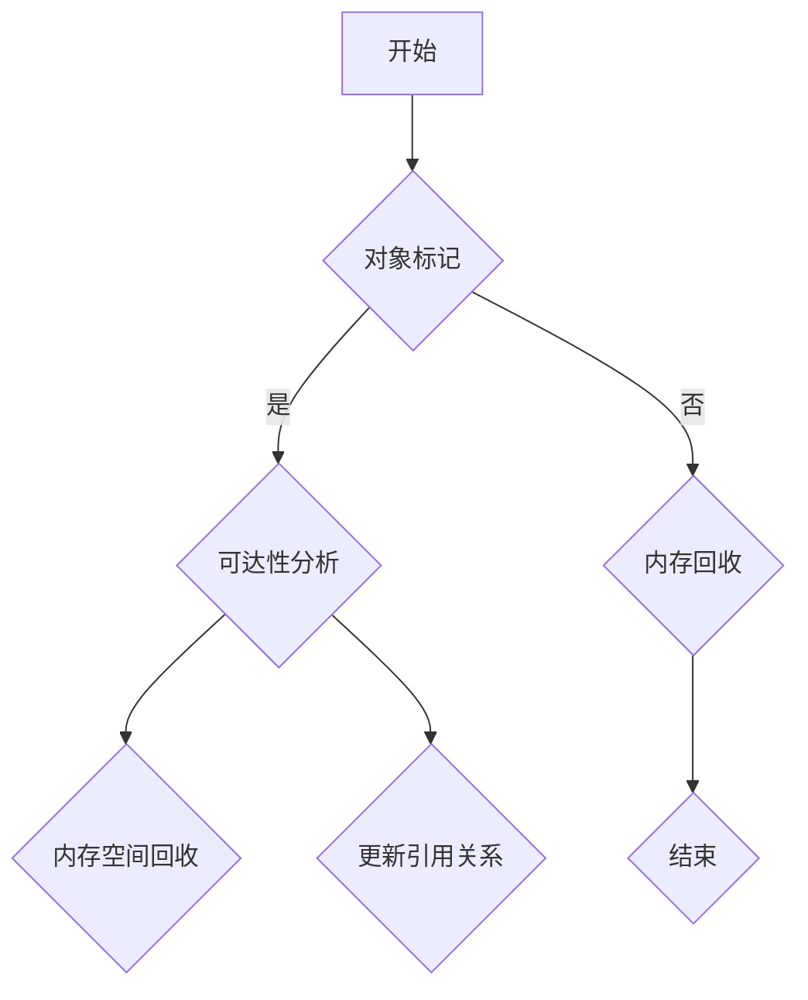

                 

# 内存管理：垃圾回收机制解析

## 1. 背景介绍

### 1.1 内存管理的重要性

内存管理是计算机系统中的核心组成部分，它直接影响系统的性能、稳定性和内存利用率。随着计算机应用的日益复杂，内存管理变得越来越重要。内存管理的目标是在满足程序需求的同时，尽可能高效地利用内存资源。

### 1.2 垃圾回收机制的概念

垃圾回收（Garbage Collection，GC）是一种自动内存管理机制，用于跟踪内存中的对象，并回收那些不再被使用的内存空间。垃圾回收机制的引入，极大地简化了程序员在内存管理方面的任务，同时提高了程序的稳定性和运行效率。

### 1.3 本文目标

本文将深入探讨垃圾回收机制的工作原理、算法及其在编程中的应用。通过本文的阅读，读者将能够理解垃圾回收的基本概念，并掌握其在实际编程中的运用方法。

## 2. 核心概念与联系

### 2.1 垃圾回收的基本原理

垃圾回收的核心思想是识别并回收不再使用的内存。为了实现这一目标，垃圾回收机制需要完成以下任务：

1. **对象的标记**：对内存中的对象进行标记，区分哪些对象还在被使用，哪些对象已经不再使用。
2. **可达性分析**：通过分析对象之间的引用关系，确定哪些对象是可达的，哪些对象是不可达的。
3. **内存回收**：回收不可达对象的内存空间。

### 2.2 垃圾回收机制与其他内存管理技术的联系

垃圾回收机制与内存分配、内存释放等传统内存管理技术密切相关。传统内存管理技术主要依赖于程序员手动分配和释放内存，而垃圾回收机制则通过自动化的方式来实现内存管理。两者之间的联系在于，垃圾回收机制需要依赖于内存分配和释放机制来获取和释放内存空间。

### 2.3 Mermaid 流程图

为了更好地理解垃圾回收机制的工作原理，我们使用 Mermaid 流程图来展示其核心过程。以下是垃圾回收机制的 Mermaid 流程图：



## 3. 核心算法原理 & 具体操作步骤

### 3.1 对象标记

对象标记是垃圾回收的第一步。在标记过程中，垃圾回收器遍历所有活跃的线程，找到这些线程所引用的对象，并将它们标记为“可达”。以下是一个简化的对象标记算法：

1. 初始化：设置一个标志位，用于标记对象是否已被访问。
2. 遍历活跃线程：对于每个线程，遍历其栈和栈帧中的局部变量。
3. 标记引用对象：如果发现某个对象没有被标记，则将其标记为“可达”。
4. 递归处理：如果被标记的对象内部还包含其他对象，则递归地对这些对象进行标记。

### 3.2 可达性分析

在完成对象标记后，垃圾回收器需要通过可达性分析来确定哪些对象是可达的，哪些对象是不可达的。以下是可达性分析的具体步骤：

1. 初始化：设置一个集合，用于存储所有“根对象”，即那些直接或间接引用全局变量的对象。
2. 遍历根对象：对于每个根对象，将其引用的对象加入到集合中。
3. 递归处理：对于每个新加入的对象，如果其内部还包含其他对象，则递归地对这些对象进行遍历。
4. 确定可达性：如果一个对象被加入到集合中，则认为它是可达的；否则，认为它是不可达的。

### 3.3 内存回收

在完成可达性分析后，垃圾回收器需要回收所有不可达对象的内存空间。以下是内存回收的具体步骤：

1. 清理不可达对象：遍历所有对象，对于每个不可达对象，将其所占用的内存空间释放。
2. 更新引用关系：在回收内存空间后，需要更新引用关系，以避免产生内存泄漏。

## 4. 数学模型和公式 & 详细讲解 & 举例说明

### 4.1 数学模型

垃圾回收机制的核心在于对象的标记和可达性分析。为了描述这一过程，我们可以引入以下数学模型：

- **可达性矩阵**：一个二维矩阵，用于表示对象之间的可达性关系。如果对象 A 可达对象 B，则矩阵中的对应元素为 1；否则为 0。
- **根集合**：一个集合，用于存储所有根对象。

### 4.2 公式

根据可达性矩阵和根集合，我们可以定义以下公式：

- **可达性关系**：如果对象 A 可达对象 B，则可达性矩阵中的对应元素为 1。
- **根集合更新**：在每次遍历根对象后，需要更新根集合，将新发现的可达对象加入其中。

### 4.3 举例说明

假设我们有一个简单的对象图，如下所示：

```
  A
  |
  B
  |
  C
```

其中，A、B、C 是三个对象，A 引用了 B，B 引用了 C。现在，我们进行垃圾回收，以下是一个简化的步骤：

1. 对象标记：首先，对 A、B、C 进行标记，标记结果如下：

   ```
   A: 已标记
   B: 已标记
   C: 未标记
   ```

2. 可达性分析：接下来，对 A、B、C 进行可达性分析，根集合为 {A}。遍历根集合中的对象 A，将其引用的对象 B 加入根集合。现在，根集合更新为 {A, B}。继续遍历根集合中的对象 B，将其引用的对象 C 加入根集合。现在，根集合更新为 {A, B, C}。由于没有新的对象加入根集合，可达性分析结束。

3. 内存回收：最后，回收所有不可达对象的内存空间。在这个例子中，只有对象 C 是不可达的，因此，我们回收对象 C 的内存空间。

## 5. 项目实践：代码实例和详细解释说明

### 5.1 开发环境搭建

为了演示垃圾回收机制，我们需要一个支持垃圾回收的语言环境。在这里，我们选择 Java 作为编程语言，因为 Java 具有内置的垃圾回收机制。

### 5.2 源代码详细实现

以下是一个简单的 Java 程序，用于演示垃圾回收机制的基本过程：

```java
public class GarbageCollectionDemo {
    public static void main(String[] args) {
        // 创建对象 A
        Object objA = new Object();
        
        // 创建对象 B，引用对象 A
        Object objB = objA;
        
        // 删除引用，使对象 A 不可达
        objA = null;
        
        // 进行垃圾回收
        System.gc();
        
        // 打印结果
        System.out.println("objB 引用的对象：" + objB);
    }
}
```

### 5.3 代码解读与分析

1. **对象创建**：首先，我们创建了一个名为 `objA` 的对象。
2. **引用关系**：接着，我们创建了一个名为 `objB` 的对象，并将其引用指向 `objA`。这意味着 `objA` 是可达的。
3. **删除引用**：然后，我们将 `objA` 的引用设置为 `null`，使其成为不可达对象。
4. **垃圾回收**：调用 `System.gc()` 方法，触发垃圾回收过程。
5. **打印结果**：最后，我们打印 `objB` 引用的对象。由于 `objB` 仍然引用 `objA`，所以 `objA` 不会在垃圾回收过程中被回收。

### 5.4 运行结果展示

当我们运行这个程序时，输出结果为：

```
objB 引用的对象：java.lang.Object@1b25c1a0
```

这表明，尽管 `objA` 已被设置为 `null`，但由于 `objB` 仍然引用它，`objA` 仍然存在于内存中。

## 6. 实际应用场景

垃圾回收机制在许多实际应用场景中都非常重要。以下是一些典型的应用场景：

1. **大型应用程序**：对于大型应用程序，内存管理变得尤为重要。垃圾回收机制可以自动回收不再使用的内存，从而提高应用程序的稳定性和性能。
2. **实时系统**：在实时系统中，内存占用和性能优化是关键。垃圾回收机制可以确保系统在运行时始终保持高效，同时避免内存泄漏等问题。
3. **嵌入式系统**：在嵌入式系统中，内存资源通常非常有限。垃圾回收机制可以帮助系统更有效地利用内存，从而延长设备的寿命。

## 7. 工具和资源推荐

### 7.1 学习资源推荐

- **书籍**：
  - 《Java 虚拟机规范》：深入了解 Java 内存管理和垃圾回收机制。
  - 《垃圾回收：算法与原理》：全面介绍垃圾回收的各种算法和原理。
- **论文**：
  - 《A Generational Garbage Collector for the JavaTM Programming Language》：介绍了一种用于 Java 的生成式垃圾回收器。
- **博客**：
  - [Java 垃圾回收机制详解](https://www.cnblogs.com/puloon/p/12309368.html)：详细介绍了 Java 的垃圾回收机制。
- **网站**：
  - [Java Memory Model](https://www.oracle.com/java/technologies/javase/memory-model.html)：Oracle 提供的 Java 内存模型文档。

### 7.2 开发工具框架推荐

- **垃圾回收分析工具**：
  - VisualVM：一款功能强大的 Java 性能分析工具，可用于分析垃圾回收的性能。
  - GCVisualizer：一款可视化垃圾回收过程的工具，有助于理解垃圾回收的原理。
- **内存管理框架**：
  - Apache Commons Lang：提供了一些实用的内存管理工具类。
  - Guava：包含了许多用于内存管理的库，如缓存、池等。

### 7.3 相关论文著作推荐

- **论文**：
  - "Stop-the-World Garbage Collection in the Java Virtual Machine"：介绍了一种在 Java 虚拟机中实现的非阻塞垃圾回收算法。
  - "A Survey of Garbage Collection Algorithms"：全面综述了各种垃圾回收算法。

## 8. 总结：未来发展趋势与挑战

### 8.1 未来发展趋势

- **智能化**：随着人工智能技术的发展，垃圾回收机制有望变得更加智能化，能够更好地适应不同的应用场景和内存需求。
- **实时性**：为了满足实时系统的要求，垃圾回收机制需要具备更高的实时性，以避免对系统性能的负面影响。
- **多样性**：未来的垃圾回收机制将支持更多类型的内存管理，如非易失性存储器（NVM）等。

### 8.2 未来挑战

- **性能优化**：如何进一步提高垃圾回收的性能，减少其对系统性能的影响，是一个重要的挑战。
- **内存泄漏检测**：如何有效地检测和解决内存泄漏问题，是另一个重要的挑战。
- **兼容性**：如何确保垃圾回收机制在不同平台和编程语言中的一致性和兼容性，也是一个挑战。

## 9. 附录：常见问题与解答

### 9.1 什么是内存泄漏？

内存泄漏是指程序中存在的内存分配无法被垃圾回收器回收的情况。内存泄漏可能导致程序逐渐占用越来越多的内存，最终导致系统崩溃。

### 9.2 如何检测内存泄漏？

检测内存泄漏的方法包括：

- **静态分析**：通过分析源代码，查找可能的内存泄漏点。
- **动态分析**：使用内存分析工具，如 Valgrind、MAT 等，对程序运行过程中进行实时监控。
- **日志分析**：通过分析程序日志，查找与内存泄漏相关的错误信息。

### 9.3 垃圾回收机制会降低程序性能吗？

垃圾回收机制本身可能会对程序性能产生一定的影响，但这种影响通常是微小的。通过优化垃圾回收算法和策略，可以最大限度地减少其对程序性能的影响。

## 10. 扩展阅读 & 参考资料

- **书籍**：
  - 《Java 虚拟机原理探秘》
  - 《深入理解 Java 虚拟机》
- **论文**：
  - "Stop-the-World Garbage Collection in the JavaTM Programming Language"
  - "A Generational Garbage Collector for the JavaTM Programming Language"
- **在线资源**：
  - [Java Memory Model](https://www.oracle.com/java/technologies/javase/memory-model.html)
  - [Garbage Collection in the Java Virtual Machine](https://www.oracle.com/java/technologies/gc.html)

作者：禅与计算机程序设计艺术 / Zen and the Art of Computer Programming

