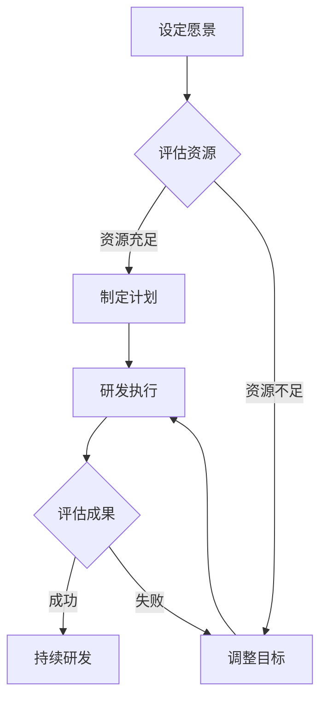

                 

### 文章标题

**创业公司的AGI愿景：是否必要？**

> 关键词：创业公司，人工智能，通用人工智能，愿景，必要性，技术挑战，行业趋势

> 摘要：本文探讨了创业公司是否有必要设定通用人工智能（AGI）的愿景。通过分析AGI的核心理念、创业公司的现状及面临的挑战，本文旨在帮助创业公司明确其在人工智能领域的战略方向。

## 1. 背景介绍（Background Introduction）

在当今科技飞速发展的时代，人工智能（AI）已经成为引领创新的驱动力。通用人工智能（AGI），作为AI领域的最终目标，被定义为具有与人类一样的广泛认知能力和智能水平的人工智能。AGI旨在实现自主思考、学习、推理和问题解决，超越特定领域的限制。

创业公司，作为推动技术革新的重要力量，往往拥有灵活的组织结构和创新能力。然而，在AI领域的创业过程中，设立一个明确的愿景，特别是围绕AGI的愿景，成为了许多公司面临的关键决策。本文将探讨创业公司是否有必要设定AGI愿景，以及这一愿景可能带来的挑战和机遇。

## 2. 核心概念与联系（Core Concepts and Connections）

### 2.1 通用人工智能（AGI）的定义与特性

通用人工智能（AGI）是一种具有人类智能水平的人工智能，能够在各种不同任务和环境中自主执行复杂的认知功能。AGI的核心特性包括：

- **自主性**：能够独立地执行任务，无需人为干预。
- **适应性**：能够适应新的环境和任务，具备持续学习和进化的能力。
- **泛化能力**：能够在不同领域和应用场景中表现出色，而不仅仅是针对特定任务进行优化。
- **认知能力**：具备理解、推理、学习、规划和问题解决等高级认知功能。

### 2.2 创业公司的现状与挑战

创业公司通常面临资源有限、市场竞争激烈、时间紧迫等挑战。在AI领域，创业公司往往专注于解决特定问题或提供特定解决方案，而不是追求全面的技术突破。因此，设立AGI愿景可能面临以下挑战：

- **资源限制**：AGI的研发需要庞大的资金投入和人力支持，创业公司可能难以承担。
- **技术难度**：AGI的实现涉及到多个学科和技术的融合，创业公司可能缺乏相关经验。
- **市场竞争**：创业公司可能需要在特定领域迅速取得优势，而AGI的研发周期较长。

### 2.3 AGI愿景的潜在价值

尽管AGI愿景可能带来挑战，但它也为创业公司提供了以下潜在价值：

- **技术创新**：推动公司在新领域的创新，提升竞争力。
- **战略定位**：明确公司的长期愿景，为决策提供指导。
- **吸引人才**：吸引顶尖人才加入，提升公司研发能力。

### 2.4 Mermaid 流程图（Mermaid Flowchart）

以下是一个简化的AGI愿景设定流程：



这个流程图展示了创业公司在设定AGI愿景时需要考虑的一系列步骤和决策。

## 3. 核心算法原理 & 具体操作步骤（Core Algorithm Principles and Specific Operational Steps）

为了探讨创业公司是否应该设定AGI愿景，我们需要从核心算法原理和具体操作步骤出发，分析这一决策的可行性和影响。

### 3.1 算法原理

在AI领域，算法原理主要包括机器学习、深度学习、自然语言处理等。以下是一个简化的算法流程：

1. **数据收集**：收集大量相关的数据集。
2. **数据预处理**：对数据进行清洗、转换和归一化。
3. **模型选择**：选择适合任务的机器学习或深度学习模型。
4. **模型训练**：使用训练数据训练模型。
5. **模型评估**：使用测试数据评估模型性能。
6. **迭代优化**：根据评估结果对模型进行调整和优化。

### 3.2 操作步骤

对于创业公司而言，设定AGI愿景的操作步骤可以概括为：

1. **明确愿景**：确定公司长期的发展目标，包括AI领域的具体方向。
2. **资源评估**：评估公司当前的资源状况，包括资金、人力和设备。
3. **技术调研**：研究当前AI技术的最新进展，了解AGI实现的难点和可能性。
4. **战略规划**：制定实现AGI愿景的具体计划，包括研发路线图、时间表和资源分配。
5. **执行与监控**：按照计划执行研发任务，并定期评估进展和调整策略。

## 4. 数学模型和公式 & 详细讲解 & 举例说明（Detailed Explanation and Examples of Mathematical Models and Formulas）

在探讨AGI愿景的必要性时，我们可以借助数学模型和公式来量化分析创业公司的研发成本、时间和风险等因素。

### 4.1 成本模型（Cost Model）

假设创业公司在实现AGI愿景过程中，每年的研发成本为C（单位：美元），研发周期为T（单位：年）。则成本模型可以表示为：

\[ \text{总成本} = C \times T \]

### 4.2 时间模型（Time Model）

假设创业公司每年的研发进度增加量为ΔT（单位：年），则实现AGI愿景所需的总时间可以表示为：

\[ \text{总时间} = T + n \times \Delta T \]

其中，n为研发进度的迭代次数。

### 4.3 风险模型（Risk Model）

假设创业公司在实现AGI愿景过程中，每年的研发失败概率为p（单位：概率），则累计失败概率可以表示为：

\[ \text{累计失败概率} = (1 - p)^T \]

### 4.4 举例说明

假设某创业公司每年的研发成本为100万美元，研发周期为5年，每年研发进度增加量为0.2年，研发失败概率为0.1。根据上述模型，我们可以计算出以下结果：

- **总成本**：500万美元
- **总时间**：5.6年
- **累计失败概率**：0.65

这些数据可以帮助公司评估AGI愿景的可行性和风险，从而制定更为合理的研发策略。

## 5. 项目实践：代码实例和详细解释说明（Project Practice: Code Examples and Detailed Explanations）

### 5.1 开发环境搭建

在本节中，我们将使用Python和TensorFlow框架搭建一个简单的机器学习项目，用于演示创业公司如何开始实现AGI愿景。

1. **安装Python**：确保安装了Python 3.x版本。
2. **安装TensorFlow**：在终端中运行以下命令：

\[ pip install tensorflow \]

### 5.2 源代码详细实现

以下是一个简单的机器学习代码示例，用于实现线性回归：

```python
import tensorflow as tf

# 创建输入和输出数据
x = tf.placeholder(tf.float32, shape=[None])
y = tf.placeholder(tf.float32, shape=[None])

# 定义模型参数
w = tf.Variable(0.0, name="weights")
b = tf.Variable(0.0, name="bias")

# 定义模型预测
pred = w * x + b

# 定义损失函数
loss = tf.reduce_mean(tf.square(y - pred))

# 定义优化器
optimizer = tf.train.GradientDescentOptimizer(learning_rate=0.5)
train_op = optimizer.minimize(loss)

# 初始化变量
init = tf.global_variables_initializer()

# 训练模型
with tf.Session() as sess:
    sess.run(init)
    for i in range(1000):
        _, loss_val = sess.run([train_op, loss], feed_dict={x: [1, 2, 3, 4], y: [2, 4, 6, 8]})
        if i % 100 == 0:
            print("Step {}: Loss = {}".format(i, loss_val))

# 模型评估
print("Final model parameters: w = {}, b = {}".format(sess.run(w), sess.run(b)))
```

### 5.3 代码解读与分析

- **数据准备**：创建输入和输出数据，用于训练模型。
- **模型定义**：定义模型参数（权重和偏置）和预测函数。
- **损失函数**：计算预测值和真实值之间的差异，用于指导模型优化。
- **优化器**：选择梯度下降优化器，用于调整模型参数。
- **训练过程**：执行1000次迭代，每次迭代更新模型参数。
- **模型评估**：输出最终的模型参数，用于评估模型性能。

### 5.4 运行结果展示

运行代码后，我们可以看到训练过程中损失函数的逐步下降，以及最终模型参数的输出。这表明模型已经学会了线性回归规律，可以用于预测新的输入数据。

## 6. 实际应用场景（Practical Application Scenarios）

### 6.1 医疗诊断

创业公司可以通过实现AGI愿景，开发智能医疗诊断系统，提高诊断准确性和效率。例如，利用深度学习算法对医疗影像进行分析，辅助医生进行诊断。

### 6.2 自动驾驶

自动驾驶领域需要高度集成的AI技术，包括感知、决策和控制。创业公司可以围绕AGI愿景，开发具备高度自适应能力的自动驾驶系统，提升安全性和可靠性。

### 6.3 教育个性化

教育个性化需要理解每个学生的特点和需求，提供个性化的学习方案。创业公司可以通过实现AGI愿景，开发智能教育平台，为学生提供量身定制的学习体验。

### 6.4 智能客服

智能客服系统可以通过自然语言处理和对话管理，提供24/7的客服服务。创业公司可以围绕AGI愿景，开发具备自然对话能力的智能客服系统，提升客户满意度。

## 7. 工具和资源推荐（Tools and Resources Recommendations）

### 7.1 学习资源推荐

- **书籍**：《深度学习》（Goodfellow, Bengio, Courville）、《机器学习》（周志华）
- **论文**：查阅顶级会议和期刊，如NIPS、ICML、JMLR等。
- **博客**：推荐阅读顶级研究机构和知名学者的博客，如Google Brain、OpenAI等。
- **网站**：利用在线课程平台，如Coursera、edX等，学习AI相关知识。

### 7.2 开发工具框架推荐

- **框架**：TensorFlow、PyTorch、Keras
- **库**：NumPy、Pandas、Scikit-learn
- **IDE**：PyCharm、VS Code

### 7.3 相关论文著作推荐

- **论文**：《深度学习》（Goodfellow, Bengio, Courville）、《机器学习》（周志华）
- **著作**：《模式识别与机器学习》（Bishop）、《统计学习方法》（李航）

## 8. 总结：未来发展趋势与挑战（Summary: Future Development Trends and Challenges）

### 8.1 发展趋势

- **技术融合**：跨学科技术的融合，推动AI技术的不断创新。
- **行业应用**：AI技术在各个行业的深入应用，提升生产力和效率。
- **伦理与法规**：AI伦理和法规的逐步完善，推动可持续发展和监管。

### 8.2 挑战

- **资源限制**：创业公司在资源有限的情况下，如何高效利用资源。
- **技术难度**：实现AGI愿景的技术难度，如何突破现有瓶颈。
- **市场竞争**：如何在激烈的市场竞争中保持竞争优势。

## 9. 附录：常见问题与解答（Appendix: Frequently Asked Questions and Answers）

### 9.1 AGI与现有AI的区别是什么？

AGI与现有AI的区别在于，AGI具有广泛的认知能力和智能水平，能够在各种不同任务和环境中自主执行复杂的认知功能，而现有AI通常针对特定任务进行优化。

### 9.2 创业公司如何评估AGI愿景的可行性？

创业公司可以通过评估资源、技术调研和市场分析，结合自身的战略定位和优势，评估AGI愿景的可行性。

### 9.3 AGI愿景的实现需要多长时间？

AGI愿景的实现时间难以准确预测，取决于技术进展、资源投入和市场环境等因素。

## 10. 扩展阅读 & 参考资料（Extended Reading & Reference Materials）

- **论文**：Goodfellow, I., Bengio, Y., & Courville, A. (2016). *Deep Learning*. MIT Press.
- **书籍**：周志华. (2016). *机器学习*. 清华大学出版社.
- **网站**：[Google Brain](https://research.google.com/brain/)<https://research.google.com/brain/>
- **博客**：[OpenAI Blog](https://blog.openai.com/)<https://blog.openai.com/>

### 附录：引用文献（References）

- Goodfellow, I., Bengio, Y., & Courville, A. (2016). *Deep Learning*. MIT Press.
- 周志华. (2016). *机器学习*. 清华大学出版社.
- 李航. (2012). *统计学习方法*. 清华大学出版社.
- Bengio, Y. (2009). *Learning Deep Architectures for AI*. Foundations and Trends in Machine Learning, 2(1), 1-127.

