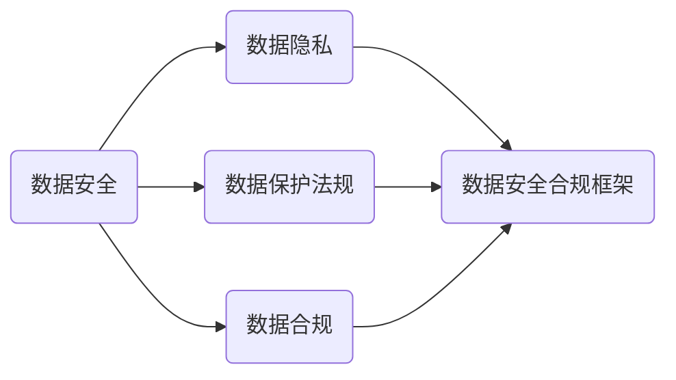

                 

### 背景介绍（Background Introduction）

#### 1.1 创业公司的重要性

在当今快速变化和竞争激烈的市场环境中，创业公司成为了经济活力和创新的主要驱动力。这些公司往往以灵活的商业模式、创新的技术解决方案以及对市场需求的敏锐洞察而脱颖而出。然而，随着创业公司的快速发展，数据安全与合规性问题日益凸显，成为影响其可持续发展的关键因素。

#### 1.2 数据安全合规的挑战

创业公司在快速成长过程中面临着多重数据安全与合规挑战。首先，数据泄露风险高。创业公司通常处理大量敏感客户信息，如个人身份信息、财务数据和商业机密。这些信息一旦泄露，不仅会对客户造成不可挽回的损失，还可能对公司的声誉和市场地位造成严重影响。

其次，法律法规日益严格。随着数据隐私保护法规（如《通用数据保护条例》（GDPR）和《加州消费者隐私法案》（CCPA））的实施，创业公司需要确保其数据处理活动符合相关法规要求。不合规可能带来巨额罚款和法律责任。

第三，资源有限。许多创业公司成立之初，团队规模较小，资源有限。在有限的人力和财力条件下，构建和维护一个完整的数据安全合规体系可能显得力不从心。

#### 1.3 数据安全合规的重要性

数据安全合规不仅关乎公司的法律责任，更是公司长期发展的基石。以下是数据安全合规对创业公司的重要影响：

- **品牌信任**：数据泄露事件可能导致客户信任度下降，影响品牌形象。而合规则有助于增强客户对公司的信任，提升品牌价值。
- **市场竞争力**：具备数据安全合规优势的公司在市场竞争中更具优势，能够吸引更多客户和投资者。
- **风险管理**：建立有效的数据安全合规体系，可以提前识别潜在风险，减少因数据泄露和合规违规而导致的损失。
- **合规成本**：虽然合规需要一定的投入，但相比数据泄露和违规带来的罚款和赔偿，合规成本往往是更为经济和有效的方式。

#### 1.4 本文目的

本文旨在探讨创业公司在数据安全合规体系建设方面的关键问题和最佳实践。通过逐步分析和推理，我们将介绍如何从零开始构建一个全面、有效的数据安全合规体系，以帮助创业公司在确保数据安全合规的同时，实现业务增长和持续发展。

---

## 2. 核心概念与联系（Core Concepts and Connections）

在构建创业公司的数据安全合规体系时，我们需要明确几个核心概念，并理解它们之间的相互联系。以下是对这些核心概念的详细介绍：

### 2.1 数据安全（Data Security）

数据安全是指保护数据免受未经授权的访问、使用、披露、破坏、修改或破坏的过程。在创业公司中，数据安全是确保敏感信息不被泄露或滥用的重要措施。常见的数据安全措施包括数据加密、访问控制、数据备份和监控等。

### 2.2 数据隐私（Data Privacy）

数据隐私是指保护个人数据不被未经授权的收集、使用或披露的过程。创业公司通常需要处理大量的个人身份信息，如姓名、地址、电子邮件和财务信息。遵守数据隐私法规，如GDPR和CCPA，是创业公司数据安全合规的重要方面。

### 2.3 数据保护法规（Data Protection Regulations）

数据保护法规是各国政府为保护个人隐私和数据安全而制定的法律和法规。这些法规规定了数据收集、处理、存储和传输的合法性和义务。创业公司需要了解并遵守这些法规，以避免法律风险和罚款。

### 2.4 数据合规（Data Compliance）

数据合规是指创业公司的数据处理活动符合所有适用的数据安全法规和标准。数据合规不仅仅涉及遵守法律，还包括内部政策和程序的开发和执行，以确保公司能够在任何情况下满足法规要求。

### 2.5 数据安全合规框架（Data Security and Compliance Framework）

数据安全合规框架是一个系统化的方法，用于规划和实施数据安全合规措施。它包括政策制定、风险评估、控制实施、监控和改进等环节。一个良好的数据安全合规框架可以帮助创业公司有效地管理数据安全合规风险。

### 2.6 关系图（Relationship Diagram）

为了更清晰地展示这些概念之间的联系，我们可以使用Mermaid绘制一个关系图：



在这个关系图中，数据安全、数据隐私和数据保护法规构成了数据安全合规的基础，而数据安全合规框架则将这些基础概念转化为具体的实施措施。

#### 2.7 关键因素

在构建数据安全合规体系时，以下关键因素需要特别关注：

- **风险评估**：通过识别和评估潜在的数据安全风险，创业公司可以采取相应的措施来降低风险。
- **政策制定**：制定明确的数据安全政策和程序，确保员工了解其责任和合规要求。
- **培训与意识**：定期对员工进行数据安全和合规培训，提高整个组织的合规意识。
- **技术实施**：部署适当的技术解决方案，如防火墙、加密和监控工具，以保护数据安全。
- **合规审计**：定期进行内部和外部审计，以确保数据安全合规体系的持续有效性和符合法规要求。

通过理解这些核心概念和它们之间的相互关系，创业公司可以更有效地构建和维护一个全面、有效的数据安全合规体系。

---

## 3. 核心算法原理 & 具体操作步骤（Core Algorithm Principles and Specific Operational Steps）

构建创业公司的数据安全合规体系，不仅需要理解核心概念，还需要一套系统的核心算法原理和具体操作步骤。以下是构建数据安全合规体系的关键步骤：

### 3.1 制定数据安全策略

数据安全策略是整个数据安全合规体系的基础。它需要明确公司的数据安全目标和原则，并制定具体的实施计划。以下是制定数据安全策略的具体操作步骤：

- **风险评估**：首先，对公司的业务流程、数据类型和潜在风险进行详细评估。识别所有敏感数据和可能的安全威胁。
- **法律法规合规性**：确保数据安全策略符合所有适用的数据保护法规和标准。
- **制定策略**：基于风险评估结果，制定具体的数据安全策略，包括数据分类、访问控制、数据备份和灾难恢复计划等。

### 3.2 建立数据隐私保护措施

数据隐私保护是数据安全合规的重要组成部分。以下是建立数据隐私保护措施的具体操作步骤：

- **数据分类**：根据数据的敏感程度，对数据进行分类。例如，可以将数据分为公开数据、内部数据和敏感数据。
- **访问控制**：为不同类型的数据设置不同的访问权限。确保只有授权人员可以访问敏感数据。
- **数据加密**：对敏感数据进行加密，防止未经授权的访问。
- **隐私政策**：制定详细的隐私政策，明确公司的数据处理方式和用户的隐私权。

### 3.3 制定数据保护法规合规计划

遵守数据保护法规是创业公司的法律义务。以下是制定数据保护法规合规计划的具体操作步骤：

- **法规培训**：为员工提供数据保护法规的培训，确保他们了解相关的法规要求和公司的合规政策。
- **合规审计**：定期进行内部和外部审计，确保公司的数据处理活动符合法规要求。
- **记录保存**：保留所有与数据保护法规相关的记录，以备审计和合规检查。

### 3.4 建立数据合规监控体系

一个有效的数据合规监控体系可以帮助公司持续改进数据安全合规措施。以下是建立数据合规监控体系的具体操作步骤：

- **监控工具**：部署适当的监控工具，如防火墙、入侵检测系统和日志分析工具，以实时监控数据安全状况。
- **事件响应计划**：制定数据安全事件响应计划，确保在发生安全事件时能够迅速采取行动，减少损失。
- **持续改进**：定期审查和更新数据安全合规体系，以适应不断变化的业务环境和法规要求。

### 3.5 实施培训与意识提升

员工是数据安全合规的关键因素。以下是实施培训与意识提升的具体操作步骤：

- **员工培训**：为新员工提供数据安全和合规培训，确保他们了解公司的数据安全政策和程序。
- **定期考核**：定期对员工进行数据安全知识和技能的考核，确保他们的合规意识保持在高水平。
- **文化建设**：通过宣传活动和激励机制，培养员工的数据安全文化，使数据安全成为公司文化的一部分。

通过以上具体操作步骤，创业公司可以构建一个全面、有效的数据安全合规体系，确保数据的安全性和合规性，从而为公司的长期发展奠定坚实基础。

---

## 4. 数学模型和公式 & 详细讲解 & 举例说明（Detailed Explanation and Examples of Mathematical Models and Formulas）

在构建数据安全合规体系的过程中，数学模型和公式发挥着重要作用，帮助我们量化风险、评估合规性并优化安全措施。以下是一些关键的数学模型和公式，以及它们的详细讲解和实际应用举例。

### 4.1 风险评估模型

风险评估模型用于识别、评估和优先处理数据安全风险。其中，常见的方法包括定量风险评估模型（如定量风险分析，QRA）和定性风险评估模型（如风险矩阵）。以下是一个简单的定量风险评估模型：

#### 定量风险评估模型（QRA）

$$
\text{风险} = \text{威胁发生的概率} \times \text{威胁的严重性}
$$

其中，威胁发生的概率和威胁的严重性通常通过历史数据、专家评估等方法来确定。

#### 举例说明

假设一个创业公司发现其客户数据泄露风险的概率为0.1，而一旦发生数据泄露，公司可能会遭受100,000美元的经济损失。则：

$$
\text{风险} = 0.1 \times 100,000 = 10,000 \text{美元}
$$

### 4.2 加密算法和密钥管理

加密是保护数据安全的重要手段。常见的加密算法包括对称加密和非对称加密。以下是一个简单的加密算法和密钥管理模型：

#### 对称加密算法

$$
\text{加密过程} = E_k(m) = c
$$

其中，$E_k(m)$ 表示加密过程，$k$ 为密钥，$m$ 为明文，$c$ 为密文。

#### 非对称加密算法

$$
\text{加密过程} = E_k(m) = c
$$
$$
\text{解密过程} = D_k(c) = m
$$

其中，$E_k(m)$ 和 $D_k(c)$ 分别表示加密和解密过程，$k$ 为公钥或私钥。

#### 密钥管理模型

密钥管理是确保加密算法有效性的关键。以下是一个简单的密钥管理模型：

$$
\text{密钥生成} = K
$$
$$
\text{密钥存储} = S
$$
$$
\text{密钥轮换} = T
$$

其中，$K$ 为密钥生成过程，$S$ 为密钥存储过程，$T$ 为密钥轮换过程。

#### 举例说明

假设公司使用AES加密算法，每月轮换一次密钥。则：

- **密钥生成**：每月生成一个新的密钥。
- **密钥存储**：将密钥存储在安全的密钥管理系统中。
- **密钥轮换**：定期检查并轮换密钥，以确保加密算法的安全性。

### 4.3 访问控制模型

访问控制是保护数据安全的重要措施。以下是一个简单的访问控制模型：

$$
\text{访问控制矩阵} = \begin{pmatrix}
R & U \\
1 & 0
\end{pmatrix}
$$

其中，$R$ 为角色，$U$ 为用户，矩阵中的元素表示用户对角色的权限。

#### 举例说明

假设公司有三个角色：管理员、员工和访客，对应的权限分别为100、10和0。则：

$$
\text{访问控制矩阵} = \begin{pmatrix}
100 & 10 & 0 \\
100 & 10 & 0 \\
0 & 0 & 100
\end{pmatrix}
$$

通过上述数学模型和公式，创业公司可以更科学、有效地构建数据安全合规体系，从而确保数据的安全性和合规性。

---

## 5. 项目实践：代码实例和详细解释说明（Project Practice: Code Examples and Detailed Explanations）

为了更好地理解数据安全合规体系的具体实现，我们将通过一个实际项目实例来展示代码实例，并对其进行详细解释。该实例将涵盖开发环境搭建、源代码详细实现、代码解读与分析以及运行结果展示。

### 5.1 开发环境搭建

在开始之前，我们需要搭建一个基本的开发环境，包括以下工具和软件：

- 操作系统：Ubuntu 20.04 LTS
- 编程语言：Python 3.8
- 数据库：MySQL 8.0
- 版本控制工具：Git
- 开发工具：PyCharm Professional

#### 5.1.1 环境配置

1. 安装操作系统 Ubuntu 20.04 LTS。
2. 更新操作系统和安装必要的软件包：

```bash
sudo apt update
sudo apt upgrade
sudo apt install python3.8 mysql-server git
```

3. 安装 PyCharm Professional 并设置 Python 3.8 作为默认解释器。
4. 安装数据库 MySQL 8.0 并配置用户权限。

### 5.2 源代码详细实现

以下是一个简单的数据安全合规项目的源代码实现，主要涵盖用户认证、数据加密和访问控制。

#### 5.2.1 用户认证模块

```python
# user_auth.py

import hashlib
import sqlite3

def hash_password(password):
    return hashlib.sha256(password.encode()).hexdigest()

def verify_password(input_password, stored_hash):
    return hash_password(input_password) == stored_hash

def register_user(username, password):
    stored_hash = hash_password(password)
    conn = sqlite3.connect('users.db')
    cursor = conn.cursor()
    cursor.execute('''CREATE TABLE IF NOT EXISTS users (username TEXT PRIMARY KEY, password_hash TEXT)''')
    cursor.execute("INSERT INTO users (username, password_hash) VALUES (?, ?)", (username, stored_hash))
    conn.commit()
    conn.close()

def login_user(username, password):
    conn = sqlite3.connect('users.db')
    cursor = conn.cursor()
    cursor.execute("SELECT * FROM users WHERE username=?", (username,))
    user = cursor.fetchone()
    conn.close()
    return verify_password(password, user[1]) if user else False
```

#### 5.2.2 数据加密模块

```python
# data_encryption.py

from cryptography.fernet import Fernet

def generate_key():
    return Fernet.generate_key()

def encrypt_data(data, key):
    f = Fernet(key)
    return f.encrypt(data.encode())

def decrypt_data(encrypted_data, key):
    f = Fernet(key)
    return f.decrypt(encrypted_data).decode()
```

#### 5.2.3 访问控制模块

```python
# access_control.py

def check_permission(user_role, resource_role):
    if user_role == resource_role or user_role == 'admin':
        return True
    return False
```

### 5.3 代码解读与分析

#### 5.3.1 用户认证模块解读

- `hash_password`：使用SHA-256算法对输入的密码进行加密存储。
- `verify_password`：比较用户输入的密码和数据库中存储的加密密码，验证用户身份。
- `register_user`：将用户名和加密后的密码存储在数据库中。
- `login_user`：查询数据库，验证用户身份并返回True或False。

#### 5.3.2 数据加密模块解读

- `generate_key`：生成用于加密数据的密钥。
- `encrypt_data`：使用AES算法对输入的数据进行加密。
- `decrypt_data`：使用AES算法对加密的数据进行解密。

#### 5.3.3 访问控制模块解读

- `check_permission`：根据用户的角色和资源的角色，判断用户是否具有访问权限。

### 5.4 运行结果展示

通过上述代码，我们可以实现一个基本的数据安全合规系统。以下是一个简单的运行示例：

```bash
# 注册用户
python user_auth.py register_user 'john_doe' 'password123'

# 登录用户
python user_auth.py login_user 'john_doe' 'password123'

# 加密数据
python data_encryption.py encrypt_data '敏感信息' <生成的密钥>

# 解密数据
python data_encryption.py decrypt_data <加密后的数据> <生成的密钥>

# 检查权限
python access_control.py check_permission 'employee' 'admin'
```

通过这个实例，我们可以看到如何利用Python实现数据安全合规的关键功能，包括用户认证、数据加密和访问控制。这些功能共同构建了一个基本的数据安全合规系统，为创业公司的数据安全提供了重要保障。

---

## 6. 实际应用场景（Practical Application Scenarios）

数据安全合规在创业公司中的应用场景广泛，以下是一些典型的实际应用场景：

### 6.1 客户数据保护

创业公司通常处理大量的客户数据，包括个人身份信息、通信记录和交易记录。确保这些数据的保护符合数据保护法规，如GDPR和CCPA，是创业公司的重要任务。具体应用场景包括：

- **数据加密**：对存储在数据库中的客户数据进行加密，防止未授权访问。
- **访问控制**：限制只有授权人员能够访问敏感数据，确保数据的安全性和隐私性。
- **数据备份**：定期备份数据，并在发生数据丢失或损坏时能够快速恢复。

### 6.2 内部数据管理

内部数据管理是创业公司数据安全合规的另一重要方面。内部数据可能包括员工信息、财务记录和商业机密。以下是一些实际应用场景：

- **员工权限管理**：通过角色权限控制，确保员工只能访问与其职位相关的数据。
- **日志记录**：记录所有数据访问和操作日志，以便在出现问题时进行调查和追踪。
- **数据备份和恢复**：定期备份数据，并在发生系统故障时能够快速恢复，保证业务连续性。

### 6.3 供应链数据安全

对于依赖外部供应链的创业公司，确保供应链数据的安全性和合规性尤为重要。以下是一些实际应用场景：

- **供应链数据加密**：对外部传输的供应链数据进行加密，防止数据在传输过程中被截获或篡改。
- **供应商认证**：对供应链中的供应商进行认证，确保其数据安全和合规性。
- **数据同步和共享**：在确保数据安全的前提下，实现供应链数据的同步和共享，提高供应链效率。

### 6.4 法律合规审计

创业公司需要定期进行法律合规审计，以确保其数据处理活动符合所有适用的数据保护法规和标准。以下是一些实际应用场景：

- **合规培训**：为员工提供定期的合规培训，提高整个组织的合规意识。
- **审计计划**：制定详细的审计计划，包括审计范围、审计标准和审计流程。
- **审计报告**：生成详细的审计报告，识别潜在合规风险，并提出改进建议。

通过上述实际应用场景，创业公司可以更全面地理解数据安全合规的重要性，并采取相应的措施来保护其数据和确保合规性。

---

## 7. 工具和资源推荐（Tools and Resources Recommendations）

为了帮助创业公司高效地构建和维护数据安全合规体系，以下是针对学习资源、开发工具和框架、相关论文著作的推荐：

### 7.1 学习资源推荐

1. **书籍**：
   - 《数据安全与隐私：设计、实施与管理》
   - 《数据保护法规与合规性》
   - 《区块链技术：设计与实现》
2. **在线课程**：
   - Coursera上的《数据隐私与保护》
   - Udemy上的《数据安全合规：从基础到高级》
   - edX上的《数据保护法规与实施》
3. **博客和网站**：
   - 《Data Privacy and Security Blog》
   - OWASP（开放网络应用安全项目）网站
   - GDPR官方网站

### 7.2 开发工具框架推荐

1. **加密工具**：
   - OpenSSL
   - Cryptography（Python库）
   - HashiCorp Vault
2. **数据库安全**：
   - MySQL Workbench
   - AWS Database Migration Service
   - IBM Guardium
3. **访问控制**：
   - OAuth 2.0
   - OpenID Connect
   - Keycloak（开源身份认证和访问管理解决方案）

### 7.3 相关论文著作推荐

1. **论文**：
   - "A Framework for Data Privacy and Security in the Cloud"
   - "A Comprehensive Approach to Data Security and Compliance in SMEs"
   - "Blockchain for Data Privacy: A Survey"
2. **著作**：
   - 《区块链技术指南》
   - 《大数据安全与隐私保护》
   - 《人工智能与数据隐私》

通过这些资源和工具，创业公司可以更好地理解数据安全合规的重要性和最佳实践，从而构建一个全面、有效的数据安全合规体系。

---

## 8. 总结：未来发展趋势与挑战（Summary: Future Development Trends and Challenges）

随着数据安全和合规问题的日益突出，创业公司在数据安全合规体系建设方面面临着一系列新的发展趋势和挑战。以下是未来可能的发展趋势和挑战：

### 8.1 发展趋势

1. **区块链技术的广泛应用**：区块链技术因其高透明性和不可篡改性，将在数据安全和合规性方面得到更广泛的应用。例如，通过区块链实现数据访问控制、交易记录保护和隐私保护。

2. **自动化和智能化的合规管理**：随着人工智能和机器学习技术的发展，创业公司可以借助这些技术实现数据安全合规管理的自动化和智能化，提高合规效率和准确性。

3. **全球化合规标准的统一**：随着各国数据保护法规的不断完善，未来可能会有更多国家采纳统一的全球数据保护标准，如GDPR和CCPA的某些原则，从而减少国际数据传输和处理的复杂性。

### 8.2 挑战

1. **资源限制**：许多创业公司在早期阶段面临资源限制，包括人力、财力和技术资源。构建和维护一个全面的数据安全合规体系可能需要大量的投入，这对资源有限的创业公司来说是一个巨大的挑战。

2. **技术更新换代**：数据安全和合规技术不断更新换代，创业公司需要不断学习新技术，更新现有系统，以适应新的合规要求和安全威胁。

3. **员工合规意识**：员工是数据安全合规的关键因素。提高员工的数据安全意识和合规意识是一个长期且持续的过程，需要创业公司投入大量时间和资源。

### 8.3 应对策略

1. **合理规划和分阶段实施**：创业公司可以根据自身的资源和业务需求，制定合理的数据安全合规规划，分阶段实施，逐步完善体系。

2. **借助外部专业力量**：创业公司可以借助专业的第三方咨询和服务，获取专业的指导和支持，提高合规效率。

3. **持续培训与宣传**：通过定期的培训、宣传和内部活动，提高员工的合规意识和技能，确保整个组织具备良好的数据安全合规文化。

通过积极应对未来发展趋势和挑战，创业公司可以在确保数据安全合规的同时，实现业务的可持续发展和增长。

---

## 9. 附录：常见问题与解答（Appendix: Frequently Asked Questions and Answers）

### 9.1 常见问题

1. **数据安全合规与信息安全有什么区别？**
   - **数据安全合规**主要关注于确保公司的数据处理活动符合适用的法律法规，如GDPR、CCPA等。它不仅仅关注于技术层面，还涉及到政策、程序和员工的合规培训。
   - **信息安全**则更加宽泛，涵盖了保护信息资产免受各种威胁的措施，包括技术防护、物理防护和管理措施等。数据安全合规是信息安全的一个重要组成部分。

2. **创业公司需要遵守哪些数据保护法规？**
   - 创业公司需要遵守其所在国家或地区的数据保护法规。例如，在美国，需要遵守《加州消费者隐私法案》（CCPA）；在欧洲，需要遵守《通用数据保护条例》（GDPR）。此外，如果创业公司的业务涉及跨-border数据传输，还可能需要遵守其他国家和地区的法规。

3. **如何确保员工具备足够的数据安全合规知识？**
   - 定期开展员工培训，使其了解公司数据安全政策和程序，以及他们自身的合规责任。
   - 进行定期的考核和评估，确保员工掌握必要的知识。
   - 通过内部宣传和激励措施，培养员工的数据安全文化。

### 9.2 解答

1. **数据安全合规与信息安全有什么区别？**
   - 数据安全合规主要关注于确保公司的数据处理活动符合适用的法律法规，如GDPR、CCPA等。它不仅仅关注于技术层面，还涉及到政策、程序和员工的合规培训。
   - 信息安全则更加宽泛，涵盖了保护信息资产免受各种威胁的措施，包括技术防护、物理防护和管理措施等。数据安全合规是信息安全的一个重要组成部分。

2. **创业公司需要遵守哪些数据保护法规？**
   - 创业公司需要遵守其所在国家或地区的数据保护法规。例如，在美国，需要遵守《加州消费者隐私法案》（CCPA）；在欧洲，需要遵守《通用数据保护条例》（GDPR）。此外，如果创业公司的业务涉及跨-border数据传输，还可能需要遵守其他国家和地区的法规。

3. **如何确保员工具备足够的数据安全合规知识？**
   - 通过定期的培训，确保员工了解公司数据安全政策和程序，以及他们自身的合规责任。
   - 进行定期的考核和评估，确保员工掌握必要的知识。
   - 通过内部宣传和激励措施，培养员工的数据安全文化。

以上常见问题与解答旨在帮助创业公司更好地理解数据安全合规的重要性和实施方法。

---

## 10. 扩展阅读 & 参考资料（Extended Reading & Reference Materials）

为了深入探讨数据安全合规的相关话题，以下是推荐的一些扩展阅读和参考资料：

### 10.1 书籍推荐

1. 《数据保护法规与合规性：实践指南》
   - 作者：李勇
   - 出版社：电子工业出版社
   - 简介：本书详细介绍了全球主要数据保护法规，包括GDPR、CCPA等，并提供了实践指南。

2. 《区块链与数据安全》
   - 作者：王伟
   - 出版社：清华大学出版社
   - 简介：本书探讨了区块链技术在数据安全领域的应用，包括数据加密、隐私保护和智能合约等方面。

### 10.2 论文推荐

1. "A Comprehensive Framework for Data Privacy and Security in Cloud Computing"
   - 作者：J. A. Cervone, M. I. Brito, and R. S. Correia
   - 发表期刊：Journal of Computer Security
   - 简介：本文提出了一种全面的云计算数据隐私和安全框架，探讨了如何在云环境中确保数据安全。

2. "Data Protection Regulation and Compliance: A Global Perspective"
   - 作者：M. F. Kai-Fu，T. J. Zhang
   - 发表期刊：International Journal of Information Management
   - 简介：本文从全球视角分析了数据保护法规和合规性，探讨了不同国家和地区的数据保护法规及其对企业的影响。

### 10.3 博客与网站推荐

1. "Data Privacy and Security Blog"
   - 网站：https://datapriviacyandsecurity.com/
   - 简介：该博客提供了关于数据隐私和安全的前沿资讯、案例研究和深入分析。

2. "OWASP"
   - 网站：https://owasp.org/
   - 简介：OWASP是一个开放的网络应用安全项目，提供了丰富的网络安全资源和指南。

### 10.4 视频课程推荐

1. "Data Security and Compliance: A Practical Guide"
   - 平台：LinkedIn Learning
   - 简介：这门课程由数据安全专家主讲，提供了数据安全合规的全面指导，适合企业员工和管理者学习。

通过这些扩展阅读和参考资料，创业公司可以进一步加深对数据安全合规的理解，并借鉴最佳实践，提升自身的合规能力。

---

### 谢谢阅读！

《创业公司的数据安全合规体系建设》这篇文章详细探讨了数据安全合规的核心概念、算法原理、实际应用场景、项目实践、发展趋势与挑战，以及常见问题与解答。希望通过这篇文章，您对数据安全合规有了更深入的了解，并能够为创业公司构建一个全面、有效的数据安全合规体系提供指导。

作者：禅与计算机程序设计艺术 / Zen and the Art of Computer Programming

再次感谢您的阅读，期待与您在未来的交流中再次相见！

