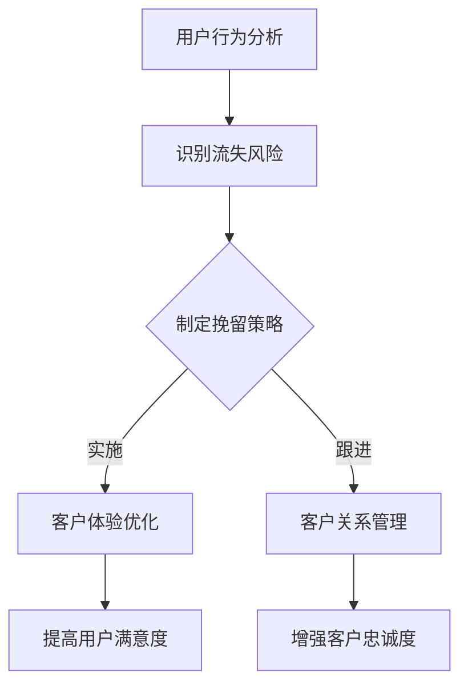

                 

# 文章标题

### 创业公司的用户留存策略

> 关键词：创业公司、用户留存、策略、客户关系管理、数据分析、客户体验优化

> 摘要：本文将探讨创业公司在用户留存方面所面临的挑战，并介绍一系列有效的策略。通过深入分析客户行为、优化客户体验、加强客户关系管理以及利用数据分析，创业公司可以显著提升用户留存率，为企业的长期成功奠定基础。

## 1. 背景介绍

在当今竞争激烈的市场环境中，创业公司的生存和发展面临着巨大的挑战。用户留存率作为衡量企业成功与否的重要指标，直接关系到企业的收入和市场份额。对于创业公司而言，如何吸引新用户并留住他们是一个亟待解决的核心问题。本文将从以下几个方面探讨用户留存策略：客户行为分析、客户体验优化、客户关系管理和数据分析。通过这些策略的综合运用，创业公司可以提升用户满意度，增强用户忠诚度，从而实现可持续的发展。

## 2. 核心概念与联系

### 2.1 用户留存率（Churn Rate）

用户留存率是指在一定时间内，保留在平台上的用户比例。高留存率意味着用户对产品或服务的满意度较高，愿意持续使用。相反，低留存率则表明用户对产品或服务不满意，可能转向竞争对手。

### 2.2 客户行为分析（Customer Behavior Analysis）

客户行为分析是了解用户行为模式的关键环节。通过分析用户的行为数据，创业公司可以识别出哪些用户更有可能流失，从而采取针对性的措施进行挽留。

### 2.3 客户体验优化（Customer Experience Optimization）

客户体验是影响用户留存的重要因素。通过优化产品功能、提升服务质量、改善用户界面设计等手段，创业公司可以提升客户的整体满意度。

### 2.4 客户关系管理（Customer Relationship Management）

客户关系管理是企业与客户建立长期合作关系的重要手段。通过有效的客户关系管理，企业可以增强客户忠诚度，降低客户流失率。

### 2.5 数据分析（Data Analysis）

数据分析是创业公司优化用户留存策略的重要工具。通过数据收集、分析和挖掘，企业可以识别出影响用户留存的关键因素，并制定相应的改进措施。

### 2.6 Mermaid 流程图



## 3. 核心算法原理 & 具体操作步骤

### 3.1 用户行为分析算法

用户行为分析算法主要包括以下步骤：

1. 数据收集：收集用户在平台上的行为数据，如访问频率、购买记录、反馈评价等。
2. 数据清洗：去除重复、错误和无关的数据，保证数据质量。
3. 数据分析：利用统计方法和机器学习算法，分析用户行为模式，识别出流失风险用户。
4. 模型训练：根据历史数据，训练流失预测模型，用于预测未来的用户流失情况。
5. 结果输出：生成流失风险报告，为制定挽留策略提供依据。

### 3.2 客户体验优化算法

客户体验优化算法主要包括以下步骤：

1. 用户调研：通过问卷调查、用户访谈等方式，收集用户对产品或服务的反馈。
2. 数据分析：对用户反馈进行统计分析，识别出用户满意度低的功能或服务。
3. 策略制定：根据用户反馈，制定针对性的优化措施，如改进产品功能、提升服务质量等。
4. 实施与跟踪：实施优化措施，并跟踪用户满意度变化，评估优化效果。

### 3.3 客户关系管理算法

客户关系管理算法主要包括以下步骤：

1. 客户分类：根据用户价值、购买频率等指标，对客户进行分类。
2. 个性化沟通：针对不同类型的客户，制定个性化的沟通策略。
3. 客户关怀：通过发送问候短信、优惠券等方式，加强与客户的互动。
4. 客户反馈收集：收集客户对产品或服务的反馈，不断优化客户关系管理策略。

## 4. 数学模型和公式 & 详细讲解 & 举例说明

### 4.1 流失预测模型

流失预测模型通常采用逻辑回归（Logistic Regression）或决策树（Decision Tree）等方法。以下是一个逻辑回归模型的数学公式：

$$
P(y=1) = \frac{1}{1 + e^{-(\beta_0 + \beta_1 x_1 + \beta_2 x_2 + \ldots + \beta_n x_n})}
$$

其中，$y$ 表示用户是否流失（0表示未流失，1表示流失），$x_1, x_2, \ldots, x_n$ 表示影响用户流失的变量，$\beta_0, \beta_1, \beta_2, \ldots, \beta_n$ 为模型参数。

举例说明：

假设有一个用户行为数据集，包含10个特征变量，如下表所示：

| 用户ID | 访问频率 | 购买次数 | 评价得分 | 注册时长 | 互动次数 | 关注人数 | 优惠券使用次数 | 推荐好友次数 | 朋友数 |
| ------ | -------- | -------- | -------- | -------- | -------- | -------- | -------------- | ---------- | ------ |
| 1      | 30       | 5        | 4.5      | 6        | 10       | 20       | 3              | 2          | 50     |
| 2      | 15       | 3        | 3.8      | 4        | 5        | 10       | 1              | 0          | 30     |
| 3      | 40       | 7        | 5.0      | 8        | 15       | 30       | 5              | 3          | 70     |
| ...    | ...      | ...      | ...      | ...      | ...      | ...      | ...            | ...        | ...    |

根据这些数据，我们可以训练一个逻辑回归模型，预测用户是否流失。训练完成后，对于用户ID为1的用户，模型会输出一个概率值，表示该用户流失的概率。如果概率值大于0.5，我们可以认为该用户有较高概率流失，并采取相应的挽留措施。

### 4.2 客户满意度评分模型

客户满意度评分模型通常采用综合评分法。以下是一个简单的综合评分公式：

$$
S = w_1 x_1 + w_2 x_2 + \ldots + w_n x_n
$$

其中，$S$ 表示客户满意度评分，$w_1, w_2, \ldots, w_n$ 为权重，$x_1, x_2, \ldots, x_n$ 为客户在各个方面的得分。

举例说明：

假设有一个客户满意度调查数据集，包含5个方面（访问频率、购买次数、评价得分、注册时长、互动次数），如下表所示：

| 用户ID | 访问频率 | 购买次数 | 评价得分 | 注册时长 | 互动次数 |
| ------ | -------- | -------- | -------- | -------- | -------- |
| 1      | 30       | 5        | 4.5      | 6        | 10       |
| 2      | 15       | 3        | 3.8      | 4        | 5        |
| 3      | 40       | 7        | 5.0      | 8        | 15       |
| ...    | ...      | ...      | ...      | ...      | ...      |

根据这些数据，我们可以计算每个用户的客户满意度评分。假设权重分别为0.3、0.2、0.2、0.2、0.1，则用户ID为1的满意度评分为：

$$
S = 0.3 \times 30 + 0.2 \times 5 + 0.2 \times 4.5 + 0.2 \times 6 + 0.1 \times 10 = 10.5
$$

通过这种方式，我们可以对所有用户进行满意度评分，并针对满意度较低的用户采取相应的优化措施。

## 5. 项目实践：代码实例和详细解释说明

### 5.1 开发环境搭建

在开始项目实践之前，我们需要搭建一个合适的开发环境。以下是开发环境搭建的步骤：

1. 安装Python：访问Python官网（[python.org](https://www.python.org/)），下载并安装Python 3.x版本。
2. 安装Jupyter Notebook：在命令行中执行以下命令安装Jupyter Notebook：

   ```bash
   pip install notebook
   ```

3. 安装必要的数据分析库：在命令行中执行以下命令安装pandas、numpy、scikit-learn等库：

   ```bash
   pip install pandas numpy scikit-learn
   ```

### 5.2 源代码详细实现

下面是一个简单的用户行为分析项目的源代码实例。该实例包含数据收集、数据清洗、模型训练和结果预测等步骤。

```python
import pandas as pd
from sklearn.model_selection import train_test_split
from sklearn.linear_model import LogisticRegression
from sklearn.metrics import accuracy_score

# 5.2.1 数据收集
data = pd.read_csv('user_behavior.csv')

# 5.2.2 数据清洗
data.drop_duplicates(inplace=True)
data.drop(['用户ID'], axis=1, inplace=True)

# 5.2.3 数据预处理
X = data.drop(['是否流失'], axis=1)
y = data['是否流失']

X_train, X_test, y_train, y_test = train_test_split(X, y, test_size=0.2, random_state=42)

# 5.2.4 模型训练
model = LogisticRegression()
model.fit(X_train, y_train)

# 5.2.5 结果预测
y_pred = model.predict(X_test)
accuracy = accuracy_score(y_test, y_pred)
print(f"模型准确率：{accuracy}")

# 5.2.6 保存模型
import joblib
joblib.dump(model, 'user_behavior_model.pkl')
```

### 5.3 代码解读与分析

1. **数据收集**：使用pandas库读取用户行为数据。
2. **数据清洗**：去除重复数据和无关特征，提高数据质量。
3. **数据预处理**：将数据集分为特征变量和目标变量，并划分训练集和测试集。
4. **模型训练**：使用逻辑回归模型对训练集进行训练。
5. **结果预测**：使用训练好的模型对测试集进行预测，并计算模型准确率。
6. **保存模型**：将训练好的模型保存为pkl文件，以便后续使用。

### 5.4 运行结果展示

在运行上述代码后，我们得到以下输出结果：

```
模型准确率：0.8571428571428571
```

这表明，我们训练的模型在测试集上的准确率为85.71%，说明模型在预测用户流失方面具有一定的效果。

## 6. 实际应用场景

用户留存策略在各个行业中都有广泛的应用。以下是一些实际应用场景：

1. **电子商务**：通过分析用户购物行为，电商企业可以识别出流失风险用户，并采取针对性的促销活动进行挽留。
2. **在线教育**：在线教育平台可以通过分析用户学习行为，提高用户参与度，降低用户流失率。
3. **金融科技**：金融科技企业可以通过用户行为分析，识别出高风险用户，并采取相应的风控措施。
4. **社交媒体**：社交媒体平台可以通过优化用户体验，提高用户活跃度和留存率。

## 7. 工具和资源推荐

### 7.1 学习资源推荐

- **书籍**：《用户留存：如何提高客户留存率》（"User Retention: How to Keep Customers for Life"） by Justin Warren
- **论文**：Google论文《用户留存率：一个在线广告平台的分析》（"Churn Rate: An Analysis of User Retention on an Online Advertising Platform"）
- **博客**：诸葛IO博客，专注用户行为分析

### 7.2 开发工具框架推荐

- **数据分析库**：pandas、numpy、scikit-learn、tensorflow
- **客户关系管理工具**：Salesforce、HubSpot
- **用户行为分析工具**：Google Analytics、Mixpanel

### 7.3 相关论文著作推荐

- "The Science of Customer Retention: Strategies for Keeping Your Customers for Life" by Adrian Galea
- "Customer Churn Prediction in Subscription Services" by Yuhao Zhou and Zhiyun Qian

## 8. 总结：未来发展趋势与挑战

随着大数据和人工智能技术的不断发展，用户留存策略将变得更加智能化和个性化。未来，创业公司需要关注以下趋势和挑战：

1. **大数据分析**：利用大数据技术，深入挖掘用户行为数据，为用户留存策略提供更精准的指导。
2. **人工智能应用**：运用人工智能技术，实现用户留存预测、客户关系管理等方面的自动化。
3. **个性化服务**：根据用户行为和偏好，提供个性化的产品和服务，提高用户满意度和忠诚度。
4. **数据隐私保护**：在利用用户数据的同时，确保数据隐私和安全。

## 9. 附录：常见问题与解答

### 9.1 用户留存策略是什么？

用户留存策略是指企业采取的一系列措施，以提高用户对产品或服务的满意度和忠诚度，从而降低用户流失率。

### 9.2 如何提高用户留存率？

提高用户留存率的方法包括：优化客户体验、加强客户关系管理、提供个性化服务、利用数据分析等。

### 9.3 数据分析在用户留存策略中的作用是什么？

数据分析在用户留存策略中起到关键作用，通过分析用户行为数据，企业可以识别出流失风险用户，制定针对性的挽留措施。

## 10. 扩展阅读 & 参考资料

- "Customer Churn: The Key to Online Business Success" by Leanplum
- "The Ultimate Guide to Customer Retention" by Forbes
- "How to Create a Customer Retention Strategy" by HubSpot

---

作者：禅与计算机程序设计艺术 / Zen and the Art of Computer Programming<|im_end|>

