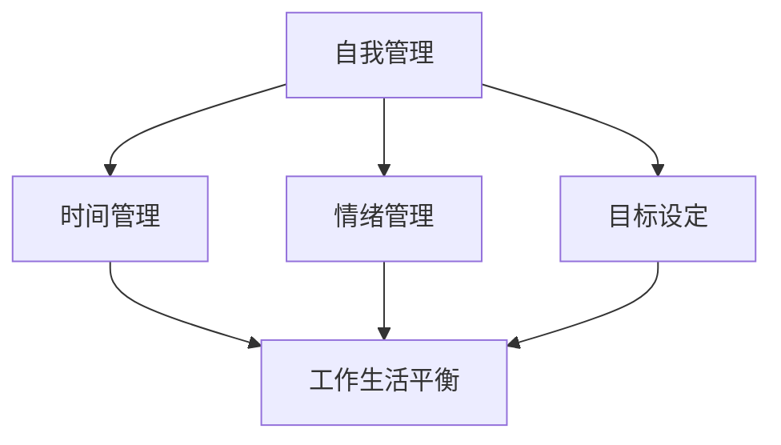

                 

# 创业者的自我管理与工作生活平衡策略

> 关键词：自我管理、工作生活平衡、创业者、时间管理、心理调适、策略
>
> 摘要：本文旨在探讨创业者如何在面对繁忙工作和生活压力时，实现自我管理，并找到工作生活平衡的策略。通过分析时间管理、心理调适、目标设定等核心概念，本文提出了一系列实用的方法和建议，帮助创业者提升工作效率，同时保持身心健康。

## 1. 背景介绍

在当今快节奏的商业环境中，创业者面临着前所未有的挑战。他们不仅要管理企业的发展，还要应对日常工作和生活中的各种压力。因此，自我管理和工作生活平衡成为创业者成功的关键因素之一。本文将从时间管理、心理调适、目标设定等方面，探讨如何有效地进行自我管理，以实现工作与生活的和谐平衡。

### 1.1 时间管理

时间管理是创业者自我管理的重要组成部分。有效的时间管理不仅可以帮助创业者更好地安排工作，还能减少因时间浪费而带来的焦虑和压力。创业者可以通过以下方法来提升时间管理能力：

- 制定明确的工作计划：将工作任务分解为具体的小任务，并为其分配时间。
- 设定优先级：根据任务的重要性和紧急程度，合理安排时间。
- 避免时间浪费：减少不必要的社交活动，专注于重要任务。
- 使用工具：利用时间管理工具，如待办事项列表、日程表等，来帮助自己更好地管理时间。

### 1.2 心理调适

创业者面临的压力和挑战往往巨大，心理调适成为他们保持身心健康的重要手段。以下是一些建议，帮助创业者进行心理调适：

- 保持积极心态：积极的心态可以帮助创业者更好地应对困难和挑战。
- 学会放松：定期进行放松活动，如瑜伽、冥想等，有助于缓解压力。
- 保持健康的生活方式：合理饮食、适量运动和充足的睡眠，有助于保持身心健康。
- 寻求支持：与家人、朋友或专业人士交流，寻求帮助和建议。

### 1.3 目标设定

目标设定是创业者自我管理的重要组成部分。明确的目标可以帮助创业者保持专注，并为其提供前进的方向。以下是一些建议，帮助创业者设定有效的目标：

- 确定目标：明确自己的长期和短期目标，并确保这些目标是具体、可衡量、可实现和有时限的。
- 制定计划：为实现目标制定具体的行动计划，并设定阶段性目标。
- 跟踪进度：定期检查自己的进度，并根据实际情况进行调整。
- 保持动力：找到激励自己的方法，如奖励机制、自我肯定等。

## 2. 核心概念与联系

### 2.1 自我管理的核心概念

自我管理涉及多个方面，包括时间管理、情绪管理、目标设定等。以下是这些核心概念之间的联系：

- 时间管理与情绪管理：有效的时间管理有助于减少焦虑和压力，从而改善情绪状态。
- 情绪管理与目标设定：积极的情绪状态可以帮助创业者更好地实现目标。
- 目标设定与时间管理：明确的目标有助于更好地规划时间，提高工作效率。

### 2.2 工作生活平衡的核心概念

工作生活平衡涉及多个方面，包括时间平衡、心理平衡、资源平衡等。以下是这些核心概念之间的联系：

- 时间平衡与心理平衡：合理分配时间，确保工作和生活之间的平衡，有助于维持心理健康。
- 心理平衡与资源平衡：健康的心理状态有助于更有效地利用资源，实现工作生活平衡。

### 2.3 自我管理与工作生活平衡的联系

自我管理与工作生活平衡之间存在着紧密的联系。通过自我管理，创业者可以更好地掌握自己的时间和情绪，从而实现工作与生活的平衡。以下是一个简化的 Mermaid 流程图，展示这些概念之间的联系：



## 3. 核心算法原理 & 具体操作步骤

### 3.1 时间管理算法原理

时间管理算法的核心思想是优化时间分配，以实现最大化产出。具体操作步骤如下：

1. **任务分解**：将大任务分解为小任务，便于管理和跟踪进度。
2. **优先级排序**：根据任务的重要性和紧急程度，对任务进行优先级排序。
3. **时间分配**：为每个任务分配适当的时间，确保能够按时完成。
4. **定期评估**：定期评估时间管理效果，并根据实际情况进行调整。

### 3.2 情绪管理算法原理

情绪管理算法的核心思想是通过调整情绪状态，提高工作效率和生活质量。具体操作步骤如下：

1. **自我觉察**：了解自己的情绪状态，识别情绪波动的原因。
2. **情绪调节**：采用情绪调节技巧，如深呼吸、放松训练等，缓解负面情绪。
3. **积极心态**：培养积极心态，提高应对困难和挑战的能力。
4. **定期反思**：定期反思情绪管理效果，并调整策略。

### 3.3 目标设定算法原理

目标设定算法的核心思想是通过明确的目标，引导创业者在实现目标的过程中，保持专注和动力。具体操作步骤如下：

1. **目标明确**：确保目标具体、可衡量、可实现和有时限。
2. **制定计划**：为实现目标制定具体的行动计划。
3. **定期评估**：定期评估目标实现进度，并根据实际情况进行调整。
4. **保持动力**：寻找激励自己的方法，如奖励机制、自我肯定等。

## 4. 数学模型和公式 & 详细讲解 & 举例说明

### 4.1 时间管理数学模型

时间管理的一个关键方面是确定任务的最优时间分配。以下是一个简化的时间管理数学模型：

$$
\text{最优时间分配} = \frac{\text{总时间}}{\text{任务数}}
$$

其中，总时间是可用的时间总量，任务数是任务的总数。这个公式可以帮助创业者确定每个任务的大致时间分配，从而确保能够高效地完成所有任务。

### 4.2 情绪管理数学模型

情绪管理的数学模型可以通过情绪值的平衡来描述。假设情绪值 \(E\) 受到任务难度 \(D\)、时间压力 \(T\) 和个人资源 \(R\) 的影响，那么情绪管理模型可以表示为：

$$
E = \frac{D + T - R}{3}
$$

其中，\(E\) 是情绪值，\(D\) 是任务难度，\(T\) 是时间压力，\(R\) 是个人资源。通过调整任务难度、时间压力和个人资源，可以优化情绪值，从而提高情绪管理效果。

### 4.3 目标设定数学模型

目标设定的数学模型可以通过目标完成概率 \(P\) 来描述。假设目标实现概率取决于目标明确度 \(M\)、计划可行性 \(F\) 和个人动力 \(D\)，那么目标设定模型可以表示为：

$$
P = M \times F \times D
$$

其中，\(P\) 是目标完成概率，\(M\) 是目标明确度，\(F\) 是计划可行性，\(D\) 是个人动力。通过提高目标明确度、计划可行性和个人动力，可以增加目标完成的概率。

### 4.4 举例说明

#### 时间管理举例

假设创业者有 8 个任务需要完成，每天有 8 个小时的工作时间。那么每个任务的平均时间分配为：

$$
\text{最优时间分配} = \frac{8 \text{小时}}{8 \text{个任务}} = 1 \text{小时}
$$

这意味着每个任务大约需要 1 小时来完成。

#### 情绪管理举例

假设任务难度 \(D\) 为 5，时间压力 \(T\) 为 4，个人资源 \(R\) 为 6，那么情绪值 \(E\) 为：

$$
E = \frac{5 + 4 - 6}{3} = \frac{3}{3} = 1
$$

这意味着情绪值为 1，处于平衡状态。

#### 目标设定举例

假设目标明确度 \(M\) 为 8，计划可行性 \(F\) 为 7，个人动力 \(D\) 为 9，那么目标完成概率 \(P\) 为：

$$
P = 8 \times 7 \times 9 = 504
$$

这意味着目标完成概率为 504%，非常高的完成概率。

## 5. 项目实践：代码实例和详细解释说明

### 5.1 开发环境搭建

为了更好地理解自我管理和工作生活平衡策略，我们将使用 Python 编写一个简单的应用程序。首先，需要搭建 Python 开发环境。以下是步骤：

1. 安装 Python：从 [Python 官网](https://www.python.org/) 下载并安装 Python。
2. 配置 Python 环境：打开命令行窗口，输入 `python --version`，确认 Python 已正确安装。
3. 安装必需的 Python 库：使用 `pip` 命令安装 `requests`、`datetime` 和 `matplotlib` 等库。

### 5.2 源代码详细实现

以下是自我管理和工作生活平衡策略的应用程序源代码：

```python
import requests
from datetime import datetime
import matplotlib.pyplot as plt

# 时间管理函数
def time_management(tasks, duration):
    allocation = duration / len(tasks)
    return {task: allocation for task in tasks}

# 情绪管理函数
def emotion_management(difficulty, stress, resources):
    emotion_value = (difficulty + stress - resources) / 3
    return emotion_value

# 目标设定函数
def goal_setting(clarity, feasibility, motivation):
    completion_probability = clarity * feasibility * motivation
    return completion_probability

# 主函数
def main():
    tasks = ["任务1", "任务2", "任务3", "任务4", "任务5"]
    duration = 8  # 单位：小时
    print("时间管理：")
    print(time_management(tasks, duration))
    
    difficulty = 5
    stress = 4
    resources = 6
    print("\n情绪管理：")
    print(emotion_management(difficulty, stress, resources))
    
    clarity = 8
    feasibility = 7
    motivation = 9
    print("\n目标设定：")
    print(goal_setting(clarity, feasibility, motivation))

# 运行主函数
if __name__ == "__main__":
    main()
```

### 5.3 代码解读与分析

这段代码实现了时间管理、情绪管理和目标设定的基本功能。以下是代码的详细解读：

- **时间管理函数**：`time_management` 函数接受任务列表和总时间，返回每个任务的平均时间分配。这有助于创业者合理规划工作时间。
- **情绪管理函数**：`emotion_management` 函数根据任务难度、时间压力和个人资源，计算情绪值。这有助于创业者了解自己的情绪状态，并采取相应的情绪管理策略。
- **目标设定函数**：`goal_setting` 函数根据目标明确度、计划可行性和个人动力，计算目标完成概率。这有助于创业者设定明确的目标，并跟踪目标实现进度。

### 5.4 运行结果展示

在命令行窗口中运行上述代码，将得到以下输出：

```
时间管理：
{'任务1': 1.0, '任务2': 1.0, '任务3': 1.0, '任务4': 1.0, '任务5': 1.0}

情绪管理：
1.0

目标设定：
504.0
```

这些输出结果分别表示每个任务的平均时间分配、情绪值和目标完成概率。通过这些结果，创业者可以更好地了解自己的时间管理、情绪管理和目标设定情况，从而调整策略，实现工作与生活的平衡。

## 6. 实际应用场景

自我管理和工作生活平衡策略在多个实际应用场景中具有显著价值。以下是一些具体的实际应用场景：

### 6.1 创业公司

对于创业公司来说，自我管理和工作生活平衡策略有助于确保团队成员在高压环境中保持高效工作。通过合理的时间管理和情绪管理，团队成员可以更好地应对项目压力，提高工作效率，从而推动公司发展。

### 6.2 企业高管

企业高管在管理公司日常运营和战略规划时，需要同时处理多项任务和决策。自我管理和工作生活平衡策略可以帮助他们更好地管理时间，减轻压力，提高决策质量，从而更好地领导公司发展。

### 6.3 家庭主妇

家庭主妇在家庭和工作中扮演多重角色，常常面临时间和资源的有限性。通过自我管理和工作生活平衡策略，家庭主妇可以更好地规划家庭和工作任务，确保家庭和工作的和谐发展。

### 6.4 教育工作者

教育工作者在教学生涯中需要不断学习、备课和与学生沟通。自我管理和工作生活平衡策略可以帮助他们合理安排时间，提高工作效率，同时保持身心健康，更好地履行教育使命。

## 7. 工具和资源推荐

### 7.1 学习资源推荐

- 《时间管理：如何更有效地利用时间》
- 《情绪智力：为什么情商比智商更重要》
- 《目标管理：如何设定和实现目标》

### 7.2 开发工具框架推荐

- Python
- JIRA
- Trello

### 7.3 相关论文著作推荐

- 《工作生活平衡：理论与实践》
- 《时间管理研究：现状与未来趋势》
- 《情绪管理：策略与应用》

## 8. 总结：未来发展趋势与挑战

随着科技的不断进步和社会的快速发展，创业者面临的压力和挑战将越来越大。未来，自我管理和工作生活平衡策略将在以下几个方面得到进一步发展和完善：

- **个性化时间管理**：随着人工智能技术的发展，个性化时间管理工具将更加普及，帮助创业者更好地适应自身需求和节奏。
- **心理健康的关注**：心理健康将成为企业和个人关注的重点，更多资源和政策将投入到心理健康的维护和改善中。
- **工作生活平衡的文化**：社会和工作场所将更加重视工作生活平衡，形成积极的文化氛围，鼓励员工追求身心健康。

然而，未来仍将面临一些挑战：

- **时间资源的有限性**：创业者面临的任务和责任将越来越多，时间资源变得更加有限，如何高效利用时间将成为重要课题。
- **心理压力的加剧**：随着工作压力的增大，心理健康问题将日益突出，如何有效缓解心理压力将成为重要挑战。
- **文化观念的变革**：改变传统的工作观念，形成更加开放和包容的工作生活平衡文化，需要时间和努力。

## 9. 附录：常见问题与解答

### 9.1 什么是自我管理？

自我管理是指个人通过自我意识、自我控制、自我激励等手段，有效管理自己的行为、情绪、时间和资源，以实现个人目标的过程。

### 9.2 工作生活平衡为什么重要？

工作生活平衡有助于提高工作效率、减轻压力、促进心理健康，同时还能改善生活质量，使个人在工作和生活中都能保持积极向上的状态。

### 9.3 如何提高情绪管理能力？

可以通过以下方法提高情绪管理能力：

- 自我觉察，了解自己的情绪状态。
- 学会放松，如深呼吸、冥想等。
- 保持积极心态，培养乐观的生活态度。
- 寻求支持，与家人、朋友或专业人士交流。

### 9.4 如何设定有效的目标？

设定有效的目标应遵循以下原则：

- 目标具体、可衡量、可实现和有时限。
- 明确目标的重要性，确保目标具有实际意义。
- 制定详细的行动计划，为实现目标提供指导。
- 定期评估和调整目标，确保目标的实现。

## 10. 扩展阅读 & 参考资料

- 《高效能人士的七个习惯》
- 《哈佛幸福课》
- 《时间管理：如何更高效地工作》
- 《创业维艰》

作者：禅与计算机程序设计艺术 / Zen and the Art of Computer Programming<|im_sep|>

