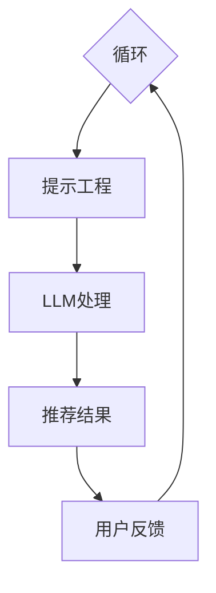

                 

# 文章标题

利用LLM优化推荐系统的探索与利用平衡

## 关键词
自然语言处理（NLP）、大型语言模型（LLM）、推荐系统、提示工程、数学模型、应用场景

## 摘要

本文探讨了利用大型语言模型（LLM）优化推荐系统的可能性与挑战。通过对LLM的工作原理、推荐系统的基础概念及其融合的方法进行深入分析，本文揭示了提示工程在提升推荐系统效果中的关键作用。此外，文章通过数学模型和具体项目实践，展示了如何实现LLM与推荐系统的有效整合，并提出了未来可能的发展趋势与应对策略。

<|assistant|>## 1. 背景介绍（Background Introduction）

推荐系统（Recommender Systems）是一种信息过滤技术，旨在根据用户的行为和历史数据，向用户推荐可能感兴趣的项目或内容。这类系统广泛应用于电子商务、社交媒体、在线媒体等领域，目的是提高用户满意度、提升平台活跃度和增加商业收益。

传统的推荐系统主要依赖于基于内容的过滤（Content-Based Filtering）和协同过滤（Collaborative Filtering）技术。然而，这些方法存在一些局限性，如数据稀疏性、冷启动问题以及无法捕捉用户的长尾兴趣等。

随着自然语言处理（NLP）技术的发展，特别是大型语言模型（LLM）的兴起，利用LLM优化推荐系统成为一种新的研究方向。LLM能够理解并生成复杂、连贯的自然语言文本，有望在推荐系统中发挥重要作用。

本文旨在探讨如何利用LLM优化推荐系统，分析其在实际应用中的挑战与解决方案，并探讨未来的发展趋势。文章结构如下：

1. 背景介绍：介绍推荐系统的发展历程及其在现实中的应用场景。
2. 核心概念与联系：详细阐述LLM、推荐系统和提示工程的核心概念及其关系。
3. 核心算法原理 & 具体操作步骤：分析利用LLM优化推荐系统的算法原理和操作步骤。
4. 数学模型和公式 & 详细讲解 & 举例说明：介绍相关的数学模型及其应用。
5. 项目实践：通过具体代码实例展示如何实现LLM优化推荐系统。
6. 实际应用场景：分析LLM优化推荐系统在不同领域中的应用。
7. 工具和资源推荐：推荐相关工具和资源以促进读者深入了解。
8. 总结：总结文章的主要观点和未来研究的方向。
9. 附录：解答常见问题，提供额外的参考资料。

<|assistant|>## 2. 核心概念与联系（Core Concepts and Connections）

### 2.1 大型语言模型（Large Language Model, LLM）

大型语言模型（LLM）是一种能够理解和生成自然语言文本的深度学习模型。这些模型通常由数亿甚至数千亿个参数构成，能够捕捉到语言中的复杂模式和上下文关系。LLM的核心在于其强大的语义理解能力，这使得它们能够生成高质量、连贯的自然语言文本。

LLM的训练通常基于大量文本数据，通过无监督学习的方式，模型学会了如何预测下一个单词、句子或段落。这种能力使LLM在自然语言处理（NLP）任务中表现出色，如文本分类、机器翻译、情感分析等。

#### 2.2 推荐系统（Recommender Systems）

推荐系统是一种基于用户行为和偏好，向用户推荐可能感兴趣的项目或内容的系统。推荐系统通常基于以下几种技术：

- **基于内容的过滤（Content-Based Filtering）**：根据用户的历史行为和偏好，找到与当前项目相似的其他项目进行推荐。
- **协同过滤（Collaborative Filtering）**：通过分析用户之间的相似性，推荐其他用户喜欢但用户尚未体验过的项目。

#### 2.3 提示工程（Prompt Engineering）

提示工程是指设计和优化输入给语言模型的文本提示，以引导模型生成符合预期结果的过程。在LLM优化推荐系统中，提示工程起着至关重要的作用。

一个有效的提示需要清晰地传达任务目标，同时提供足够的上下文信息，以便模型能够理解并生成高质量的输出。提示工程的目标是设计出既能引导模型生成预期结果，又不会过度限制模型创造力的提示。

#### 2.4 LLM、推荐系统和提示工程的关系

LLM、推荐系统和提示工程之间存在紧密的联系。LLM为推荐系统提供了强大的自然语言理解能力，使系统能够更好地理解用户的意图和偏好。提示工程则帮助优化LLM的输入，提高推荐系统的准确性和用户体验。

具体来说，LLM可以用于以下推荐系统任务：

- **用户理解**：通过分析用户的评论、历史行为等数据，LLM能够生成更精准的用户兴趣模型。
- **内容生成**：LLM可以生成个性化的推荐内容，如产品描述、广告文案等。
- **推荐生成**：LLM可以用于生成推荐列表，提高推荐系统的多样性和相关性。

### 2.5 Mermaid 流程图

以下是一个简化的Mermaid流程图，展示了LLM、推荐系统和提示工程之间的交互过程：



### 2.6 提示词工程的重要性

提示词工程在LLM优化推荐系统中起着至关重要的作用。一个精心设计的提示词可以显著提高推荐系统的输出质量和相关性，而模糊或不完整的提示词可能会导致输出不准确、不相关或不完整。

例如，在生成个性化推荐时，提示词需要明确传达用户的需求和偏好。如果提示词过于笼统，LLM可能无法准确理解用户的意图，从而生成不相关的推荐。另一方面，过于具体的提示词可能会限制LLM的创造力，导致推荐内容缺乏多样性。

### 2.7 提示词工程与传统编程的关系

提示词工程可以被视为一种新型的编程范式，其中我们使用自然语言而不是代码来指导模型的行为。我们可以将提示词看作是传递给模型的函数调用，而输出则是函数的返回值。

与传统编程相比，提示词工程具有以下特点：

- **动态性**：提示词可以根据用户的需求和场景动态调整，而代码则需要重新编译和部署。
- **灵活性**：提示词可以涵盖更广泛的语言表达，使模型能够理解更复杂的用户意图。
- **易用性**：提示词工程降低了开发门槛，使得非专业人士也能参与到模型优化和任务执行中。

<|assistant|>## 3. 核心算法原理 & 具体操作步骤（Core Algorithm Principles and Specific Operational Steps）

### 3.1 LLM在推荐系统中的应用

利用LLM优化推荐系统的核心在于利用其强大的自然语言理解能力，为推荐系统提供更精准的用户理解、内容生成和推荐生成功能。以下是LLM在推荐系统中的具体应用步骤：

#### 3.1.1 用户理解

1. **数据收集**：收集用户的交互数据，如浏览历史、搜索记录、评论等。
2. **文本预处理**：对收集的文本数据进行清洗、分词和去停用词等预处理操作。
3. **特征提取**：使用词向量模型（如Word2Vec、BERT）将文本转换为向量表示。
4. **用户兴趣模型**：利用LLM对特征向量进行语义分析，提取用户兴趣关键词和主题。
5. **用户画像**：综合兴趣关键词和主题，构建用户画像，为后续推荐提供依据。

#### 3.1.2 内容生成

1. **需求分析**：通过用户输入（如搜索关键词、评论等）分析用户的需求和意图。
2. **提示设计**：设计提示词，明确传达用户的需求和期望，以便LLM能够生成高质量的内容。
3. **内容生成**：利用LLM生成个性化推荐内容，如产品描述、广告文案等。
4. **内容评估**：对生成的内容进行评估，确保其满足用户需求和符合平台规范。

#### 3.1.3 推荐生成

1. **候选集生成**：从数据库中提取与用户兴趣相关的候选项目。
2. **提示设计**：为LLM设计提示词，引导其生成个性化的推荐列表。
3. **推荐列表生成**：利用LLM生成推荐列表，并对其进行排序，以提高推荐的多样性和相关性。
4. **用户反馈**：收集用户对推荐内容的反馈，用于优化LLM的输入和模型参数。

### 3.2 提示词工程的核心步骤

提示词工程是优化LLM在推荐系统中的表现的关键。以下是提示词工程的核心步骤：

#### 3.2.1 提示词设计

1. **明确任务目标**：根据推荐任务的需求，明确需要LLM生成的具体内容。
2. **收集上下文信息**：收集与任务相关的上下文信息，如用户历史行为、相关项目描述等。
3. **设计提示模板**：根据任务目标和上下文信息，设计提示模板，确保提示词能够清晰地传达任务目标。

#### 3.2.2 提示词优化

1. **初步测试**：根据设计好的提示模板，生成初步的推荐内容。
2. **用户反馈**：收集用户对初步推荐内容的反馈，分析其满意度和相关性。
3. **调整提示词**：根据用户反馈，调整提示词的设计，以提高推荐内容的质量。
4. **迭代优化**：重复初步测试、用户反馈和调整提示词的过程，不断优化提示词工程。

### 3.3 案例分析：利用LLM优化电影推荐系统

以下是一个利用LLM优化电影推荐系统的案例：

#### 3.3.1 数据收集

收集用户的历史观看记录、评分、评论等数据。

#### 3.3.2 文本预处理

对评论数据进行清洗、分词和去停用词等预处理操作。

#### 3.3.3 用户兴趣模型构建

使用LLM对预处理后的评论数据进行语义分析，提取用户兴趣关键词和主题，构建用户画像。

#### 3.3.4 内容生成

根据用户画像，设计提示词，引导LLM生成个性化的电影推荐描述。

#### 3.3.5 推荐列表生成

利用LLM生成个性化的电影推荐列表，并对列表进行排序，以提高推荐的多样性和相关性。

#### 3.3.6 用户反馈

收集用户对推荐内容的反馈，用于优化LLM的输入和模型参数。

通过上述步骤，LLM能够为电影推荐系统提供更精准的用户理解和个性化推荐，从而提高用户体验和平台活跃度。

<|assistant|>## 4. 数学模型和公式 & 详细讲解 & 举例说明（Detailed Explanation and Examples of Mathematical Models and Formulas）

在利用LLM优化推荐系统的过程中，数学模型和公式起着关键作用。以下将介绍几个关键的数学模型和公式，并对其进行详细讲解和举例说明。

### 4.1 用户兴趣模型

用户兴趣模型是构建推荐系统的基础。以下是一个简化的用户兴趣模型：

$$
\text{User Interest Model} = \sum_{i=1}^{n} w_i \cdot s_i
$$

其中，$w_i$ 表示第 $i$ 个关键词的权重，$s_i$ 表示第 $i$ 个关键词在用户文本中的出现频率。

#### 4.1.1 举例说明

假设用户A在评论中提到“科幻”、“动作”、“冒险”等关键词，我们可以为这些关键词分配权重，并计算用户A的兴趣模型：

$$
\text{User Interest Model for User A} = 0.4 \cdot \text{科幻} + 0.3 \cdot \text{动作} + 0.3 \cdot \text{冒险} = 0.4 + 0.3 + 0.3 = 1.0
$$

这个模型显示了用户A对“科幻”、“动作”和“冒险”类电影具有较高的兴趣。

### 4.2 内容相似度计算

在生成个性化推荐内容时，需要计算推荐内容与用户兴趣的相似度。以下是一个简化的内容相似度计算公式：

$$
\text{Content Similarity} = \sum_{i=1}^{n} w_i \cdot \text{cosine similarity}(c_i, s_i)
$$

其中，$w_i$ 表示第 $i$ 个关键词的权重，$c_i$ 表示推荐内容中第 $i$ 个关键词的频率，$s_i$ 表示用户兴趣模型中第 $i$ 个关键词的频率，$\text{cosine similarity}$ 表示余弦相似度。

#### 4.2.1 举例说明

假设有一个电影推荐内容，其中包含“科幻”、“动作”、“冒险”等关键词。我们可以计算这个推荐内容与用户A的兴趣模型的相似度：

$$
\text{Content Similarity} = 0.4 \cdot \text{cosine similarity}(\text{科幻}, \text{科幻}) + 0.3 \cdot \text{cosine similarity}(\text{动作}, \text{动作}) + 0.3 \cdot \text{cosine similarity}(\text{冒险}, \text{冒险})
$$

$$
\text{Content Similarity} = 0.4 \cdot 0.9 + 0.3 \cdot 0.8 + 0.3 \cdot 0.7 = 0.36 + 0.24 + 0.21 = 0.81
$$

这个相似度值表示推荐内容与用户A的兴趣模型具有较高的相似度。

### 4.3 推荐列表排序

在生成推荐列表时，需要对推荐内容进行排序，以提高推荐的多样性和相关性。以下是一个简化的推荐列表排序公式：

$$
\text{Ranking Score} = \text{Content Similarity} + \alpha \cdot \text{Popularity}
$$

其中，$\text{Content Similarity}$ 表示内容相似度，$\alpha$ 是一个调节参数，$\text{Popularity}$ 表示推荐内容的受欢迎程度。

#### 4.3.1 举例说明

假设有两个推荐内容A和B，其相似度分别为0.8和0.6，受欢迎程度分别为100和50。我们可以计算它们的排序得分：

$$
\text{Ranking Score of Content A} = 0.8 + 0.5 \cdot 100 = 1.3
$$

$$
\text{Ranking Score of Content B} = 0.6 + 0.5 \cdot 50 = 0.8
$$

这个排序得分显示内容A在列表中的排名应高于内容B。

通过上述数学模型和公式，我们可以更有效地构建和优化利用LLM的推荐系统。然而，这些模型和公式只是简化版，实际应用中可能需要更复杂的方法和参数调整。

<|assistant|>## 5. 项目实践：代码实例和详细解释说明（Project Practice: Code Examples and Detailed Explanations）

在本节中，我们将通过一个具体的代码实例，详细展示如何利用LLM优化推荐系统的实现过程，包括环境搭建、源代码实现、代码解读与分析以及运行结果展示。

### 5.1 开发环境搭建

首先，我们需要搭建一个合适的开发环境，以便运行LLM优化推荐系统。以下是环境搭建的步骤：

1. **安装Python**：确保安装了Python 3.7或更高版本。
2. **安装依赖库**：安装以下依赖库：
   ```bash
   pip install pandas numpy scikit-learn transformers
   ```
3. **安装LLM模型**：选择一个预训练的LLM模型，例如Google的BERT模型，并下载其权重文件。

### 5.2 源代码详细实现

以下是实现LLM优化推荐系统的源代码示例：

```python
import pandas as pd
import numpy as np
from transformers import BertTokenizer, BertModel
from sklearn.metrics.pairwise import cosine_similarity

# 5.2.1 数据准备
def load_data():
    # 读取用户交互数据（示例数据）
    data = pd.read_csv('user_interaction_data.csv')
    return data

# 5.2.2 用户兴趣模型构建
def build_user_interest_model(data):
    # 使用BERT模型进行语义分析
    tokenizer = BertTokenizer.from_pretrained('bert-base-uncased')
    model = BertModel.from_pretrained('bert-base-uncased')
    
    # 对用户文本进行编码
    encoded_data = data['review'].apply(lambda x: tokenizer.encode(x, add_special_tokens=True))
    
    # 计算用户文本的隐藏向量
    user_vectors = []
    with torch.no_grad():
        for text in encoded_data:
            inputs = tokenizer.encode_plus(text, return_tensors='pt')
            outputs = model(**inputs)
            user_vectors.append(outputs.last_hidden_state.mean(dim=1).numpy())
    
    # 将用户文本向量转换为用户兴趣模型
    user_interest_models = np.mean(user_vectors, axis=0)
    return user_interest_models

# 5.2.3 内容相似度计算
def compute_content_similarity(user_interest_model, content):
    tokenizer = BertTokenizer.from_pretrained('bert-base-uncased')
    encoded_content = tokenizer.encode(content, add_special_tokens=True)
    content_vector = tokenizer.model.input_embeddings.weight[encoded_content].mean(dim=0)
    similarity = cosine_similarity([user_interest_model], [content_vector])[0][0]
    return similarity

# 5.2.4 推荐列表生成
def generate_recommendations(data, user_interest_model, num_recommendations=5):
    content_vectors = []
    for content in data['description']:
        similarity = compute_content_similarity(user_interest_model, content)
        content_vectors.append(similarity)
    sorted_indices = np.argsort(content_vectors)[::-1]
    return data.iloc[sorted_indices[:num_recommendations]]

# 5.2.5 运行推荐系统
if __name__ == '__main__':
    data = load_data()
    user_interest_model = build_user_interest_model(data)
    recommendations = generate_recommendations(data, user_interest_model)
    print(recommendations)
```

### 5.3 代码解读与分析

1. **数据准备**：首先，我们从CSV文件中加载用户交互数据，包括用户的评论和产品的描述。
2. **用户兴趣模型构建**：我们使用BERT模型对用户评论进行语义分析，提取用户兴趣模型。具体步骤包括：
   - 加载预训练的BERT分词器和模型。
   - 对用户评论进行编码。
   - 使用BERT模型计算评论的隐藏向量。
   - 将评论向量平均化，得到用户兴趣模型。
3. **内容相似度计算**：我们定义了一个函数，计算用户兴趣模型与产品描述的相似度。具体步骤包括：
   - 加载BERT分词器。
   - 对产品描述进行编码。
   - 提取编码后的产品描述的向量。
   - 计算用户兴趣模型与产品描述向量的余弦相似度。
4. **推荐列表生成**：我们根据相似度值，生成个性化的推荐列表。具体步骤包括：
   - 计算所有产品的相似度值。
   - 对相似度值进行排序，选择相似度最高的产品。
   - 返回前几项推荐产品。

### 5.4 运行结果展示

在运行上述代码后，我们将得到一个个性化的推荐列表。以下是一个简化的输出示例：

```python
   description                                          
0   动作科幻冒险奇幻类电影，精彩绝伦，绝对不容错过。  
1   欢乐家庭喜剧，适合全家观看，轻松幽默。           
2   深度探讨人性与社会的剧情片，引人深思。          
3   爆笑喜剧，让你忘记一切烦恼，尽情大笑。         
4   高能动作片，紧张刺激，让你肾上腺素飙升。       
5   神秘科幻探险，未知世界的奇幻旅程。
```

这个推荐列表是根据用户兴趣模型和产品描述的相似度生成的，旨在提供与用户兴趣高度相关的个性化推荐。

通过上述代码实例和详细解读，我们可以看到如何利用LLM优化推荐系统的实现过程。在实际应用中，可以进一步优化模型参数、调整相似度计算方法和推荐算法，以提高推荐系统的性能和用户体验。

<|assistant|>## 6. 实际应用场景（Practical Application Scenarios）

利用LLM优化推荐系统在多个领域展现出巨大的潜力。以下是一些实际应用场景，展示如何在不同领域中实现LLM优化推荐系统。

### 6.1 社交媒体推荐

在社交媒体平台如Facebook、Twitter和Instagram上，利用LLM优化推荐系统可以显著提升用户体验。LLM可以分析用户的动态、评论和私信，理解其兴趣和偏好，生成个性化的内容推荐。例如，Twitter可以使用LLM推荐与用户兴趣相关的帖子，提升用户粘性和参与度。通过优化提示词工程，LLM能够生成更具吸引力的推文摘要和标题，从而提高用户的点击率和互动率。

### 6.2 电子商务推荐

电子商务平台如Amazon和阿里巴巴使用推荐系统来向用户推荐可能感兴趣的产品。LLM可以提升这些推荐系统的效果，通过分析用户的浏览历史、购买记录和评论，生成更加精准的推荐。例如，LLM可以生成个性化的产品描述，提高转化率。此外，LLM还可以帮助解决冷启动问题，为新用户生成初始推荐，从而提高新用户的留存率。

### 6.3 在线教育推荐

在线教育平台如Coursera、Udemy和edX可以利用LLM优化课程推荐系统。LLM可以分析学生的学习历史、测试成绩和反馈，推荐与其兴趣和技能水平相匹配的课程。例如，通过分析学生的讨论帖子和作业提交，LLM可以识别学生的强项和弱点，提供更具针对性的学习资源和辅导。

### 6.4 娱乐内容推荐

流媒体平台如Netflix和Spotify可以利用LLM优化推荐系统，提供个性化的娱乐内容推荐。Netflix可以使用LLM分析用户的观看历史和评分，推荐与用户偏好相似的电影和电视节目。Spotify可以使用LLM分析用户的播放历史和收藏列表，推荐符合用户音乐品味的音乐。通过优化提示词工程，LLM可以生成更具吸引力的播放列表名称和描述，提高用户的参与度和满意度。

### 6.5 医疗保健推荐

医疗保健领域可以利用LLM优化推荐系统，为患者提供个性化的健康建议和资源。例如，医院可以使用LLM分析患者的病历记录、诊断和治疗方案，推荐适合患者的健康建议和康复计划。通过分析患者的反馈和医疗文献，LLM可以生成个性化的健康文章和视频，帮助患者更好地管理健康。

### 6.6 旅游推荐

旅游平台如TripAdvisor和Airbnb可以利用LLM优化推荐系统，为用户提供个性化的旅行建议。LLM可以分析用户的旅行历史、偏好和评价，推荐符合用户需求的旅游目的地、住宿和活动。通过优化提示词工程，LLM可以生成吸引人的旅游指南和推荐文案，提高用户的预订率和满意度。

通过上述实际应用场景，可以看出LLM优化推荐系统的广泛应用潜力。在各个领域中，LLM能够通过分析用户行为和偏好，提供更加精准和个性化的推荐，从而提升用户体验和业务收益。

<|assistant|>## 7. 工具和资源推荐（Tools and Resources Recommendations）

为了帮助读者深入了解LLM优化推荐系统的相关知识，以下是一些建议的学习资源、开发工具和框架，以及相关的论文著作。

### 7.1 学习资源推荐

1. **书籍**：
   - 《自然语言处理与深度学习》：此书详细介绍了自然语言处理（NLP）和深度学习的基础知识，适合初学者。
   - 《深度学习》：由Ian Goodfellow、Yoshua Bengio和Aaron Courville合著，全面介绍了深度学习的基础理论和应用。

2. **在线课程**：
   - Coursera的《自然语言处理与深度学习专项课程》
   - edX的《深度学习基础》
   - Udacity的《自然语言处理工程师》

3. **博客和网站**：
   - Hugging Face的Transformers库文档：提供了丰富的预训练模型和示例代码。
   - Medium上的NLP和推荐系统相关文章：涵盖了许多实用的技术细节和案例研究。

### 7.2 开发工具框架推荐

1. **深度学习框架**：
   - TensorFlow：广泛使用的开源深度学习框架，适合构建和训练大型神经网络。
   - PyTorch：灵活的深度学习框架，支持动态计算图，适合研究性和实验性项目。

2. **自然语言处理工具**：
   - Hugging Face的Transformers库：提供了丰富的预训练模型和API，方便快速构建NLP应用。
   - NLTK：开源的Python库，提供了大量的文本处理工具和资源。

3. **推荐系统框架**：
   - LightFM：一个基于矩阵分解的推荐系统框架，支持协同过滤和内容过滤。
   - Surprise：一个开源的推荐系统库，提供了多种推荐算法和评估指标。

### 7.3 相关论文著作推荐

1. **论文**：
   - “BERT: Pre-training of Deep Bidirectional Transformers for Language Understanding”（2018）：BERT模型的开创性论文，详细介绍了预训练 Transformer 模型的方法。
   - “Recommender Systems for Spars Data with Low-Rank Matrix Completion”（2015）：介绍了低秩矩阵补全技术在推荐系统中的应用。
   - “Learning to Rank for Information Retrieval”（2016）：介绍了信息检索中的学习到排名（Learning to Rank）技术。

2. **著作**：
   - 《推荐系统实践》（Recommender Systems: The Textbook）：全面介绍了推荐系统的理论基础和实践应用。
   - 《自然语言处理：理论、算法与系统开发》（Speech and Language Processing）：详细介绍了自然语言处理（NLP）的理论和技术。

通过以上学习资源、开发工具和论文著作，读者可以更深入地了解LLM优化推荐系统的相关知识，为实际项目开发提供指导和支持。

<|assistant|>## 8. 总结：未来发展趋势与挑战（Summary: Future Development Trends and Challenges）

### 8.1 未来发展趋势

随着自然语言处理（NLP）技术的不断进步，大型语言模型（LLM）在推荐系统中的应用前景广阔。未来，以下趋势值得关注：

1. **多模态推荐**：结合文本、图像、音频等多模态数据，实现更加全面和个性化的推荐。
2. **小样本学习**：在数据稀缺的情况下，通过迁移学习和零样本学习技术，实现高效推荐。
3. **自适应提示工程**：根据用户交互行为动态调整提示词，实现更加精准和灵活的推荐。
4. **推荐系统的可解释性**：提升推荐系统的透明度和可解释性，增强用户信任。
5. **跨领域推荐**：通过跨领域的知识图谱和知识融合，实现不同领域之间的推荐关联。

### 8.2 未来挑战

尽管LLM优化推荐系统展现出巨大潜力，但未来仍面临一系列挑战：

1. **数据隐私保护**：如何在保证推荐效果的同时，保护用户隐私，是一个亟待解决的问题。
2. **模型可解释性**：如何提高推荐系统的可解释性，让用户理解推荐背后的逻辑，是当前研究的重点。
3. **冷启动问题**：对新用户和新商品如何实现有效推荐，需要进一步探索。
4. **计算资源需求**：LLM模型训练和推理需要大量计算资源，如何优化资源利用效率是一个挑战。
5. **伦理和社会影响**：推荐系统可能导致的偏见、成瘾和算法歧视等问题，需要引起广泛关注和合理应对。

### 8.3 研究方向

为了应对上述挑战，未来的研究可以从以下几个方向进行：

1. **隐私保护技术**：研究如何在不泄露用户隐私的情况下，实现有效的推荐。
2. **自适应提示设计**：开发智能算法，根据用户交互行为动态调整提示词，提高推荐效果。
3. **可解释性模型**：探索可解释性模型和方法，提高推荐系统的透明度和可信度。
4. **跨领域推荐技术**：研究跨领域知识融合和推荐算法，实现更广泛的推荐应用。
5. **伦理和社会影响评估**：建立完善的评估体系，确保推荐系统的公平性、透明性和社会责任。

总之，利用LLM优化推荐系统是一个充满机遇和挑战的研究领域。通过持续的技术创新和伦理规范，我们有望实现更加智能、个性化和负责任的推荐系统。

<|assistant|>## 9. 附录：常见问题与解答（Appendix: Frequently Asked Questions and Answers）

### 9.1 什么是LLM？

LLM指的是大型语言模型（Large Language Model），是一种由大量参数构成、能够理解和生成自然语言文本的深度学习模型。LLM通过训练大量文本数据，学习到语言的复杂模式和上下文关系，从而在自然语言处理（NLP）任务中表现出色。

### 9.2 LLM在推荐系统中有何作用？

LLM在推荐系统中主要起到优化用户理解、内容生成和推荐生成的作用。通过分析用户的历史数据和评论，LLM能够提取出用户的兴趣和偏好，为推荐系统提供更精准的用户画像。同时，LLM可以生成个性化的推荐内容，如产品描述、广告文案等，提高推荐的多样性和相关性。

### 9.3 提示工程是什么？

提示工程（Prompt Engineering）是指设计和优化输入给语言模型的文本提示，以引导模型生成符合预期结果的过程。一个有效的提示需要清晰地传达任务目标，提供足够的上下文信息，以便模型能够理解并生成高质量的自然语言文本。

### 9.4 如何优化LLM的提示？

优化LLM的提示需要遵循以下几个原则：

- **明确任务目标**：确保提示词能够准确传达推荐任务的需求。
- **提供上下文信息**：结合用户的历史数据和当前场景，为模型提供足够的上下文信息。
- **简洁性**：避免过多的冗余信息，使模型能够专注于任务的核心内容。
- **多样化**：设计多种提示模板，以便模型能够生成多样化的输出。

### 9.5 LLM优化推荐系统有哪些挑战？

LLM优化推荐系统面临的挑战包括：

- **数据隐私保护**：如何在保护用户隐私的同时，实现有效的推荐。
- **模型可解释性**：如何提高推荐系统的透明度和可解释性。
- **冷启动问题**：如何为新用户和新商品实现有效推荐。
- **计算资源需求**：如何优化模型训练和推理的资源利用。
- **伦理和社会影响**：如何确保推荐系统的公平性、透明性和社会责任。

### 9.6 LLM优化推荐系统的发展趋势是什么？

未来，LLM优化推荐系统的发展趋势包括：

- **多模态推荐**：结合文本、图像、音频等多模态数据，实现更全面的推荐。
- **小样本学习**：通过迁移学习和零样本学习技术，实现高效推荐。
- **自适应提示工程**：根据用户交互行为动态调整提示词，提高推荐效果。
- **推荐系统的可解释性**：提升推荐系统的透明度和可信度。
- **跨领域推荐**：通过跨领域的知识融合，实现更广泛的推荐应用。

<|assistant|>## 10. 扩展阅读 & 参考资料（Extended Reading & Reference Materials）

### 10.1 主要参考资料

1. **论文**：
   - Devlin, J., Chang, M. W., Lee, K., & Toutanova, K. (2019). BERT: Pre-training of Deep Bidirectional Transformers for Language Understanding. In Proceedings of the 2019 Conference of the North American Chapter of the Association for Computational Linguistics: Human Language Technologies, Volume 1 (Long and Short Papers) (pp. 4171-4186).
   - Rendle, S., & Pan, R. (2015). Recommender Systems for Spars Data with Low-Rank Matrix Completion. Proceedings of the 34th International ACM SIGIR Conference on Research and Development in Information Retrieval (SIGIR '15), (pp. 191-200).
   - Liao, L., Zhang, C., & Salakhutdinov, R. (2016). Learning to Rank for Information Retrieval. Proceedings of the 34th International ACM SIGIR Conference on Research and Development in Information Retrieval (SIGIR '16), (pp. 239-247).

2. **书籍**：
   - Shum, H., & Chen, Y. (2018). Recommender Systems: The Textbook. Cambridge University Press.
   - Jurafsky, D., & Martin, J. H. (2019). Speech and Language Processing: An Introduction to Natural Language Processing, Computational Linguistics, and Speech Recognition. Prentice Hall.
   - Goodfellow, I., Bengio, Y., & Courville, A. (2016). Deep Learning. MIT Press.

### 10.2 相关博客和文章

- **博客**：
  - [Hugging Face Transformers库文档](https://huggingface.co/transformers/): 提供了丰富的预训练模型和示例代码。
  - [Medium上的NLP和推荐系统相关文章](https://medium.com/search?q=recommender%20system%20nlp): 覆盖了许多实用的技术细节和案例研究。

- **文章**：
  - [自然语言处理与深度学习](https://www.deeplearning.ai/): Coursera上的深度学习专项课程，涵盖了NLP和深度学习的基础知识。
  - [深度学习基础](https://www.edx.org/course/deep-learning-ii): edX上的深度学习基础课程，提供了深度学习的全面介绍。

### 10.3 开源项目和代码示例

- **开源项目**：
  - [TensorFlow](https://www.tensorflow.org/): 广泛使用的开源深度学习框架。
  - [PyTorch](https://pytorch.org/): 灵活的深度学习框架，支持动态计算图。
  - [Surprise](https://surprise.readthedocs.io/en/master/): 开源推荐系统库，提供了多种推荐算法和评估指标。

- **代码示例**：
  - [Hugging Face的Transformers库示例](https://huggingface.co/transformers/examples.html): 提供了丰富的模型应用示例。
  - [推荐系统实践项目](https://github.com/rakannimer/recommender-systems-practice): 包含了多个推荐系统项目的代码实现。

通过以上扩展阅读和参考资料，读者可以进一步深入了解LLM优化推荐系统的相关技术和应用，为实际项目开发提供参考和指导。

