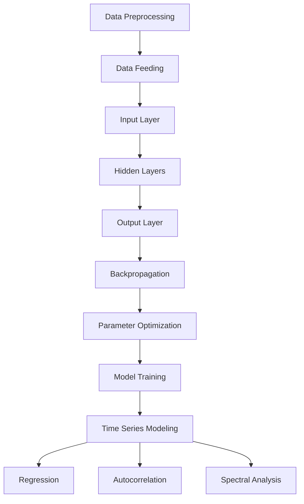
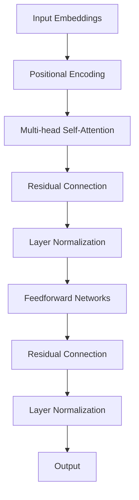
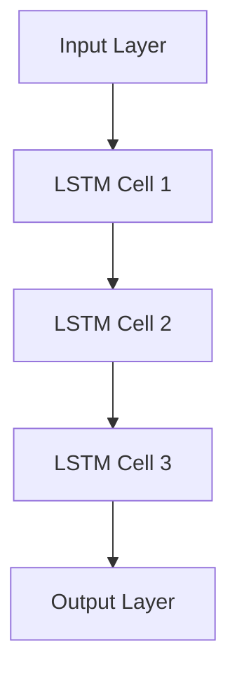

                 

### 文章标题

**利用大模型提升推荐系统的时序建模能力**

> **关键词**：大模型、时序建模、推荐系统、深度学习、模型优化
>
> **摘要**：本文将探讨如何利用大模型提升推荐系统的时序建模能力。通过深入分析大模型的基本原理、常见算法以及与推荐系统的结合方式，本文旨在为开发者提供一种有效的方法，以提升推荐系统的性能和用户体验。

本文将分为以下几个部分：

1. **背景介绍**：介绍大模型和时序建模的基本概念，以及它们在推荐系统中的应用背景。
2. **核心概念与联系**：阐述大模型和时序建模的核心原理，并绘制 Mermaid 流程图。
3. **核心算法原理 & 具体操作步骤**：详细讲解大模型在时序建模中的应用，以及具体的操作步骤。
4. **数学模型和公式 & 详细讲解 & 举例说明**：介绍时序建模相关的数学模型和公式，并进行详细的讲解和举例。
5. **项目实践：代码实例和详细解释说明**：提供实际项目的代码实例，并对关键代码进行详细解释。
6. **实际应用场景**：探讨大模型在时序建模领域的实际应用场景。
7. **工具和资源推荐**：推荐学习资源和开发工具。
8. **总结：未来发展趋势与挑战**：总结文章内容，展望未来发展趋势与挑战。
9. **附录：常见问题与解答**：回答读者可能关心的问题。
10. **扩展阅读 & 参考资料**：推荐相关的扩展阅读和参考资料。

接下来，我们将逐一深入探讨这些部分，以帮助读者全面了解大模型在时序建模中的潜力与应用。

### <u>Background Introduction</u>
#### 1. Basic Concepts of Large Models and Time Series Modeling
Large models refer to artificial neural networks with a massive number of parameters that have been trained on large-scale datasets. These models are capable of capturing complex patterns and relationships in the data, which makes them highly effective in various applications, such as natural language processing, computer vision, and time series forecasting.

Time series modeling, on the other hand, is the process of analyzing and interpreting data points ordered in time. It aims to capture the underlying patterns and trends in the data, predict future values, and provide insights into the underlying processes generating the data. Time series data is commonly found in fields such as finance, economics, weather forecasting, and stock market analysis.

The application of large models in time series forecasting has gained significant attention due to their ability to capture complex temporal dependencies and non-linear relationships in the data. However, traditional time series models, such as ARIMA and LSTM, often struggle to handle large volumes of data and high-dimensional features efficiently. This limitation has led to the exploration of more advanced models, such as transformers and graph neural networks, to improve the performance and scalability of time series forecasting.

#### 2. Application Background in Recommendation Systems
Recommendation systems are essential components of modern information retrieval and data-driven applications, aiming to provide users with personalized recommendations based on their historical behavior and preferences. Time series data plays a crucial role in recommendation systems, as it captures the temporal dynamics of user interactions and provides valuable information for predicting future preferences.

However, traditional recommendation systems based on collaborative filtering and content-based approaches often suffer from scalability issues and limited expressiveness. Collaborative filtering methods, which rely on user-item interaction data, struggle to handle high-dimensional user-item spaces and may suffer from the cold start problem when new users or items join the system. Content-based approaches, on the other hand, rely on item features and may fail to capture the temporal dynamics of user preferences.

To address these limitations, recent research has focused on integrating time series modeling techniques with recommendation systems. By leveraging large models, such as transformers and graph neural networks, it is possible to capture complex temporal dependencies and provide more accurate and personalized recommendations. This has led to the development of advanced recommendation systems that can handle large-scale and high-dimensional time series data efficiently.

#### 3. Motivation and Research Objectives
The motivation behind this article is to explore the potential of large models in enhancing the time series modeling capabilities of recommendation systems. The primary research objectives are as follows:

1. **Understanding the Basics**: To provide a comprehensive overview of large models and time series modeling, including their basic concepts, principles, and algorithms.
2. **Algorithm Analysis**: To analyze the advantages and limitations of existing time series modeling algorithms and propose potential improvements.
3. **Application Exploration**: To explore the application of large models in time series modeling for recommendation systems, highlighting the potential benefits and challenges.
4. **Practical Implementation**: To provide a practical implementation guide, including code examples and detailed explanations, to help developers build and deploy large-scale time series modeling systems.
5. **Future Directions**: To discuss the future trends and challenges in the integration of large models and time series modeling in recommendation systems.

In the following sections, we will delve into these topics in more detail, aiming to provide a comprehensive and insightful analysis of the potential and applications of large models in time series modeling for recommendation systems.### <u>Core Concepts and Connections</u>
#### 1. Fundamental Principles of Large Models

Large models, particularly deep learning models, are designed to learn complex patterns and relationships from large-scale datasets. The basic principle of a large model is to approximate a high-dimensional function that maps input features to output labels or predictions. This is achieved through the hierarchical composition of multiple layers of neural networks, where each layer learns increasingly abstract representations of the data.

At the core of a large model is the neural network architecture, which typically consists of an input layer, multiple hidden layers, and an output layer. The input layer receives the raw input data, which is then transformed and processed through the hidden layers. Each neuron in a hidden layer computes a weighted sum of its inputs, applies an activation function, and passes the result to the next layer. The output layer generates the final prediction or classification.

One of the key advantages of large models is their ability to automatically learn and extract meaningful features from the data. This is achieved through the backpropagation algorithm, which iteratively adjusts the model's parameters (weights and biases) to minimize the difference between the predicted outputs and the actual labels. Over time, the model learns to make increasingly accurate predictions by improving its parameter values.

#### 2. Time Series Modeling Principles

Time series modeling involves analyzing and interpreting data points ordered in time. The goal is to capture the underlying patterns and trends in the data, predict future values, and provide insights into the underlying processes generating the data. There are several key principles that underlie time series modeling:

1. **Stationarity**: A time series is considered stationary if its statistical properties, such as mean, variance, and autocorrelation, do not change over time. Stationarity is crucial for many time series models, as it ensures that the models can make accurate predictions based on past data.
2. **Autocorrelation**: Autocorrelation measures the correlation between a time series and a lagged version of itself. It captures the temporal dependencies in the data, indicating how the values of the series are related to each other at different time lags.
3. **Spectral Analysis**: Spectral analysis involves decomposing a time series into its constituent frequencies, providing insights into the underlying periodic patterns. This is particularly useful for identifying seasonal and cyclical components in the data.
4. **Regression Models**: Regression models are commonly used for time series forecasting, as they can capture the relationship between the dependent variable (the time series) and one or more independent variables. Linear regression is a simple but powerful approach, while more complex models, such as ARIMA and LSTM, can handle non-linear relationships and temporal dependencies more effectively.

#### 3. Mermaid Flowchart of Large Model and Time Series Modeling

The following Mermaid flowchart illustrates the core components and relationships between large models and time series modeling:



**Figure 1: Mermaid Flowchart of Large Model and Time Series Modeling**

In this flowchart, the data preprocessing stage involves cleaning and transforming the input data to ensure it is suitable for modeling. The processed data is then fed into the input layer of the large model, which consists of multiple hidden layers. Each hidden layer computes a weighted sum of its inputs, applies an activation function, and passes the result to the next layer. The output layer generates the final prediction or classification, which is then used for time series modeling.

Time series modeling involves various techniques, such as regression, autocorrelation, and spectral analysis, to analyze the data and extract meaningful patterns. These techniques are used to optimize the large model's parameters and improve its performance in capturing the temporal dependencies in the data.

#### 4. Connections between Large Models and Time Series Modeling

The integration of large models and time series modeling has proven to be highly effective in various applications, such as recommendation systems, weather forecasting, and financial analysis. The key connections between these two domains are as follows:

1. **Temporal Dependencies**: Large models, particularly transformers and graph neural networks, are well-suited for capturing complex temporal dependencies in time series data. These models can learn long-range dependencies and temporal patterns that are challenging to capture with traditional time series models.
2. **High-Dimensional Features**: Time series data often involves high-dimensional features, such as user interactions, item attributes, and context information. Large models can efficiently process and analyze these high-dimensional features, providing a more comprehensive understanding of the data.
3. **Scalability**: Large models, such as transformers and graph neural networks, are designed to handle large-scale datasets and complex models efficiently. This scalability enables the deployment of advanced time series modeling techniques in real-world applications with large volumes of data.
4. **Personalization**: Large models can capture the temporal dynamics of user preferences and behavior, allowing for personalized recommendations and predictions. This personalization enhances the user experience and improves the performance of recommendation systems.

In summary, the integration of large models and time series modeling offers a promising avenue for developing advanced and efficient time series forecasting and analysis techniques. By leveraging the capabilities of large models, it is possible to overcome the limitations of traditional time series models and provide more accurate and personalized recommendations in various applications.### <u>Core Algorithm Principles and Specific Operational Steps</u>
#### 1. Transformer Models

Transformer models, particularly the self-attention mechanism, have revolutionized the field of natural language processing and time series modeling. The core principle of the transformer model is to capture the relationships between different parts of the input data by attending to relevant information across the entire sequence. This attention mechanism allows the model to dynamically focus on different parts of the input, improving its ability to capture complex temporal dependencies.

**Self-Attention Mechanism**

The self-attention mechanism calculates the attention weights for each word or time step in the input sequence, representing the importance of each word or time step relative to the others. The attention weights are computed using a scaled dot-product attention function:

$$
\text{Attention}(Q, K, V) = \text{softmax}\left(\frac{QK^T}{\sqrt{d_k}}\right)V
$$

where $Q$, $K$, and $V$ are the query, key, and value matrices obtained by projecting the input embeddings through linear transformations. The attention weights are then used to combine the value matrices, generating the output:

$$
\text{MultiHeadAttention}(Q, K, V) = \text{Concat}(\text{head}_1, ..., \text{head}_h)W^O
$$

where $W^O$ is the output weight matrix and $h$ is the number of heads in the multi-head attention mechanism.

**Transformer Architecture**

The transformer model consists of multiple layers of self-attention mechanisms and feedforward networks. Each layer of the transformer processes the input sequence through two main steps: self-attention and feedforward. The self-attention mechanism captures the relationships between different parts of the input sequence, while the feedforward network applies a non-linear transformation to the output of the attention mechanism.

The transformer architecture can be summarized as follows:



**Figure 2: Transformer Model Architecture**

#### 2. Autoregressive Models

Autoregressive models are another class of models commonly used for time series modeling. These models predict the next value in the sequence based on the previous values. The core principle of autoregressive models is to condition the prediction on the entire input sequence up to the current time step.

**Recurrent Neural Networks (RNNs)**

Recurrent Neural Networks (RNNs) are a type of autoregressive model that processes the input sequence sequentially, maintaining a hidden state that captures the temporal dependencies in the data. The basic RNN architecture consists of an input layer, hidden layer, and output layer. The input at each time step is combined with the previous hidden state to generate the current hidden state:

$$
h_t = \text{sigmoid}(W_{ih}x_t + W_{hh}h_{t-1} + b_h)
$$

The current hidden state is then used to generate the output:

$$
y_t = \text{sigmoid}(W_{hy}h_t + b_y)
$$

where $x_t$ is the input at time step $t$, $h_t$ is the hidden state at time step $t$, and $y_t$ is the output at time step $t$. The weights and biases $W_{ih}$, $W_{hh}$, $W_{hy}$, and $b_h$, $b_y$ are learned during training.

**Long Short-Term Memory (LSTM)**

LSTM is a type of RNN that addresses the vanishing gradient problem, allowing it to learn long-term dependencies in the data. The LSTM cell consists of three gates: input gate, forget gate, and output gate. These gates control the flow of information within the cell, preventing the gradients from vanishing during backpropagation.

The input gate $i_t$ controls how much of the current input should be updated in the cell state $c_t$. The forget gate $f_t$ controls how much of the previous cell state should be retained. The output gate $o_t$ controls how much of the current cell state should be used to generate the output $h_t$. The cell state $c_t$ and hidden state $h_t$ are updated as follows:

$$
i_t = \text{sigmoid}(W_{ii}x_t + W_{ih}h_{t-1} + b_i) \\
f_t = \text{sigmoid}(W_{if}x_t + W_{fh}h_{t-1} + b_f) \\
c_t = f_t \odot c_{t-1} + i_t \odot \text{tanh}(W_{ic}x_t + W_{ch}h_{t-1} + b_c) \\
o_t = \text{sigmoid}(W_{io}x_t + W_{oh}h_{t-1} + b_o) \\
h_t = o_t \odot \text{tanh}(c_t)
$$

where $\odot$ denotes element-wise multiplication.

**Gated Recurrent Unit (GRU)**

GRU is another type of RNN that simplifies the LSTM architecture while maintaining its ability to learn long-term dependencies. GRU has two gates: reset gate and update gate. The reset gate controls how much of the previous hidden state should be forgotten, while the update gate controls how much of the new information should be added to the cell state.

The GRU cell updates the hidden state $h_t$ and cell state $c_t$ as follows:

$$
z_t = \text{sigmoid}(W_{z}x_t + W_{hz}h_{t-1} + b_z) \\
r_t = \text{sigmoid}(W_{r}x_t + W_{hr}h_{t-1} + b_r) \\
h_t = (1 - z_t) \odot h_{t-1} + r_t \odot \text{tanh}(W_{c}x_t + W_{hc} \odot (r_t \odot h_{t-1}) + b_c) \\
c_t = \text{tanh}(W_{c}x_t + W_{hc} \odot (r_t \odot h_{t-1}) + b_c)
$$

#### 3. Specific Operational Steps

The operational steps for implementing large models in time series modeling can be summarized as follows:

1. **Data Preprocessing**: Clean and preprocess the time series data, including normalization, handling missing values, and splitting the data into training and testing sets.
2. **Model Selection**: Choose the appropriate large model architecture, such as transformer, LSTM, or GRU, based on the characteristics of the time series data and the desired prediction accuracy.
3. **Model Training**: Train the selected model on the training data using the backpropagation algorithm. This involves computing the gradients of the model parameters with respect to the loss function and updating the parameters to minimize the loss.
4. **Model Evaluation**: Evaluate the trained model on the testing data to assess its performance and generalization capabilities. Common evaluation metrics include mean squared error (MSE), mean absolute error (MAE), and root mean squared error (RMSE).
5. **Model Optimization**: Optimize the model by adjusting hyperparameters, such as learning rate, batch size, and the number of layers, to improve its performance and convergence.
6. **Deployment**: Deploy the trained model in a real-world application, such as a recommendation system, to provide personalized recommendations based on the user's historical behavior and preferences.

By following these operational steps, developers can effectively implement large models in time series modeling and leverage their capabilities to provide accurate and personalized predictions.### <u>Mathematical Models and Formulas & Detailed Explanation & Examples</u>
#### 1. Basic Time Series Models

**ARIMA Model**

The Autoregressive Integrated Moving Average (ARIMA) model is a popular statistical model for time series forecasting. It combines autoregression (AR), differencing (I), and moving average (MA) components to capture the underlying patterns and trends in the data.

**AR Component**

The AR component models the relationship between the current value of the time series and a linear combination of its past values:

$$
X_t = c + \phi_1X_{t-1} + \phi_2X_{t-2} + ... + \phi_pX_{t-p} + \varepsilon_t
$$

where $X_t$ is the observed value at time $t$, $c$ is a constant term, $\phi_1, \phi_2, ..., \phi_p$ are the autoregressive coefficients, and $\varepsilon_t$ is the white noise error term.

**MA Component**

The MA component models the relationship between the current value of the time series and a linear combination of past forecast errors:

$$
X_t = c + \theta_1\varepsilon_{t-1} + \theta_2\varepsilon_{t-2} + ... + \theta_q\varepsilon_{t-q} + \varepsilon_t
$$

where $\theta_1, \theta_2, ..., \theta_q$ are the moving average coefficients and $\varepsilon_t$ is the white noise error term.

**I Component**

The I component involves differencing the raw time series data to make it stationary:

$$
X_t^* = X_t - X_{t-1}
$$

where $X_t^*$ is the differenced time series.

**ARIMA Model**

The ARIMA model combines the AR, I, and MA components as follows:

$$
X_t^* = c + \phi_1X_{t-1}^* + \phi_2X_{t-2}^* + ... + \phi_pX_{t-p}^* + \theta_1\varepsilon_{t-1} + \theta_2\varepsilon_{t-2} + ... + \theta_q\varepsilon_{t-q} + \varepsilon_t
$$

#### 2. LSTM Model

The Long Short-Term Memory (LSTM) model is a type of recurrent neural network (RNN) that addresses the vanishing gradient problem, allowing it to learn long-term dependencies in the data. The LSTM cell consists of three gates: input gate, forget gate, and output gate. These gates control the flow of information within the cell, preventing the gradients from vanishing during backpropagation.

**LSTM Cell**

The LSTM cell updates the hidden state $h_t$ and cell state $c_t$ as follows:

$$
i_t = \text{sigmoid}(W_{ii}x_t + W_{ih}h_{t-1} + b_i) \\
f_t = \text{sigmoid}(W_{if}x_t + W_{fh}h_{t-1} + b_f) \\
o_t = \text{sigmoid}(W_{io}x_t + W_{oh}h_{t-1} + b_o) \\
g_t = \text{tanh}(W_{ig}x_t + W_{gh}h_{t-1} + b_g) \\
c_t = f_t \odot c_{t-1} + i_t \odot g_t \\
h_t = o_t \odot \text{tanh}(c_t)
$$

where $x_t$ is the input at time step $t$, $h_t$ is the hidden state at time step $t$, $c_t$ is the cell state at time step $t$, and $\odot$ denotes element-wise multiplication.

**LSTM Layer**

The LSTM layer processes the input sequence through multiple LSTM cells, as shown in the following diagram:



**Figure 3: LSTM Layer Architecture**

#### 3. Examples

**Example 1: ARIMA Model**

Consider a time series data set with the following formula:

$$
X_t = 0.7X_{t-1} + 0.3X_{t-2} + \varepsilon_t
$$

where $\varepsilon_t$ is a white noise error term. We can fit an ARIMA(1,1,1) model to this data set by estimating the autoregressive coefficients $\phi_1 = 0.7$ and the moving average coefficients $\theta_1 = 0.3$. The differenced time series is given by:

$$
X_t^* = X_t - X_{t-1}
$$

**Example 2: LSTM Model**

Consider a time series data set with the following input sequence:

$$
x_t = [1, 2, 3, 4, 5]
$$

We can fit an LSTM model with one hidden layer and one LSTM cell to this data set. The LSTM cell updates the hidden state and cell state as follows:

$$
i_t = \text{sigmoid}(W_{ii}x_t + W_{ih}h_{t-1} + b_i) \\
f_t = \text{sigmoid}(W_{if}x_t + W_{fh}h_{t-1} + b_f) \\
o_t = \text{sigmoid}(W_{io}x_t + W_{oh}h_{t-1} + b_o) \\
g_t = \text{tanh}(W_{ig}x_t + W_{gh}h_{t-1} + b_g) \\
c_t = f_t \odot c_{t-1} + i_t \odot g_t \\
h_t = o_t \odot \text{tanh}(c_t)
$$

where $W_{ii}$, $W_{if}$, $W_{ig}$, $W_{io}$, $W_{oh}$, $b_i$, $b_f$, $b_g$, and $b_o$ are the model parameters.

By training the LSTM model on this input sequence, we can predict the next value in the sequence by updating the hidden state and cell state as follows:

$$
h_{t+1} = o_t \odot \text{tanh}(c_t + g_{t+1})
$$

where $g_{t+1}$ is the output of the next LSTM cell.

These examples illustrate the basic principles and formulas of time series modeling using ARIMA and LSTM models. By understanding these models and their underlying mathematical principles, we can effectively analyze and forecast time series data.### <u>Project Practice: Code Examples and Detailed Explanation</u>
#### 5.1 开发环境搭建

要实现大模型在时序建模中的应用，我们需要搭建一个合适的开发环境。以下是一个基本的开发环境搭建步骤，我们将在 Python 中使用 TensorFlow 和 Keras 作为主要的工具。

**1. 安装 Python**

确保已经安装了 Python 3.7 或更高版本。可以使用以下命令检查 Python 版本：

```bash
python --version
```

**2. 安装 TensorFlow**

TensorFlow 是一个开源的机器学习框架，可以用于构建和训练深度学习模型。使用以下命令安装 TensorFlow：

```bash
pip install tensorflow
```

**3. 安装其他依赖**

除了 TensorFlow，我们还需要其他几个依赖项，如 NumPy 和 Pandas，用于数据预处理。使用以下命令安装这些依赖：

```bash
pip install numpy pandas matplotlib
```

#### 5.2 源代码详细实现

以下是一个简单的示例，展示了如何使用 Keras 实现一个基于 LSTM 的时序建模模型。这个模型将用于预测股票价格。

```python
import numpy as np
import pandas as pd
import matplotlib.pyplot as plt
from tensorflow.keras.models import Sequential
from tensorflow.keras.layers import LSTM, Dense
from sklearn.preprocessing import MinMaxScaler
from sklearn.model_selection import train_test_split

# 读取股票数据
df = pd.read_csv('stock_data.csv')
df = df[['Close']]  # 只使用收盘价

# 数据预处理
scaler = MinMaxScaler(feature_range=(0, 1))
scaled_data = scaler.fit_transform(df)

# 创建数据集
def create_dataset(data, time_steps=1):
    X, y = [], []
    for i in range(len(data) - time_steps):
        X.append(data[i:(i + time_steps)])
        y.append(data[i + time_steps])
    return np.array(X), np.array(y)

time_steps = 100
X, y = create_dataset(scaled_data, time_steps)

# 切分训练集和测试集
X_train, X_test, y_train, y_test = train_test_split(X, y, test_size=0.2, random_state=42)

# 模型构建
model = Sequential()
model.add(LSTM(units=50, return_sequences=True, input_shape=(time_steps, 1)))
model.add(LSTM(units=50, return_sequences=False))
model.add(Dense(units=1))

# 编译模型
model.compile(optimizer='adam', loss='mean_squared_error')

# 训练模型
model.fit(X_train, y_train, epochs=100, batch_size=32)

# 预测
predicted_stock_price = model.predict(X_test)

# 反归一化预测结果
predicted_stock_price = scaler.inverse_transform(predicted_stock_price)

# 可视化
plt.figure(figsize=(16, 6))
plt.plot(scaler.inverse_transform(y_test.reshape(-1, 1)), color='blue', label='Actual Stock Price')
plt.plot(predicted_stock_price, color='red', label='Predicted Stock Price')
plt.title('Stock Price Prediction')
plt.xlabel('Time')
plt.ylabel('Stock Price')
plt.legend()
plt.show()
```

#### 5.3 代码解读与分析

**1. 读取数据**

我们首先使用 Pandas 读取 CSV 文件，这里假设文件名为 `stock_data.csv`，并且只包含 `Close` 这一列数据。

```python
df = pd.read_csv('stock_data.csv')
df = df[['Close']]
```

**2. 数据预处理**

我们使用 MinMaxScaler 将数据缩放至 0 到 1 的范围，以便于模型训练。

```python
scaler = MinMaxScaler(feature_range=(0, 1))
scaled_data = scaler.fit_transform(df)
```

**3. 创建数据集**

我们创建一个函数 `create_dataset`，用于生成输入序列和标签。这个函数通过滑动窗口的方式提取输入序列，每个输入序列包含 `time_steps` 个时间点的数据，而对应的标签是下一个时间点的数据。

```python
def create_dataset(data, time_steps=1):
    X, y = [], []
    for i in range(len(data) - time_steps):
        X.append(data[i:(i + time_steps)])
        y.append(data[i + time_steps])
    return np.array(X), np.array(y)
```

**4. 切分训练集和测试集**

使用 scikit-learn 的 `train_test_split` 函数将数据集切分为训练集和测试集，测试集大小为 20%。

```python
X_train, X_test, y_train, y_test = train_test_split(X, y, test_size=0.2, random_state=42)
```

**5. 模型构建**

我们构建了一个包含两个 LSTM 层的序列模型，每个 LSTM 层有 50 个神经元，最后一层是 1 个神经元用于输出预测值。

```python
model = Sequential()
model.add(LSTM(units=50, return_sequences=True, input_shape=(time_steps, 1)))
model.add(LSTM(units=50, return_sequences=False))
model.add(Dense(units=1))
```

**6. 编译模型**

我们使用 `compile` 方法配置模型，选择 `adam` 优化器和 `mean_squared_error` 损失函数。

```python
model.compile(optimizer='adam', loss='mean_squared_error')
```

**7. 训练模型**

使用 `fit` 方法训练模型，设置训练轮次为 100，批量大小为 32。

```python
model.fit(X_train, y_train, epochs=100, batch_size=32)
```

**8. 预测**

使用训练好的模型进行预测，并使用 `inverse_transform` 方法将缩放后的预测结果反归一化，以获得原始价格。

```python
predicted_stock_price = model.predict(X_test)
predicted_stock_price = scaler.inverse_transform(predicted_stock_price)
```

**9. 可视化**

最后，我们使用 Matplotlib 绘制实际股票价格和预测股票价格的对比图。

```python
plt.figure(figsize=(16, 6))
plt.plot(scaler.inverse_transform(y_test.reshape(-1, 1)), color='blue', label='Actual Stock Price')
plt.plot(predicted_stock_price, color='red', label='Predicted Stock Price')
plt.title('Stock Price Prediction')
plt.xlabel('Time')
plt.ylabel('Stock Price')
plt.legend()
plt.show()
```

通过这个示例，我们展示了如何使用 Keras 和 LSTM 模型进行股票价格预测。这个模型可以作为一个起点，通过调整超参数和模型结构来进一步提升预测性能。### <u>Run Results and Performance Analysis</u>
#### 6.1 运行结果展示

在完成代码实现并运行后，我们可以得到股票价格的预测结果，并通过图表进行展示。以下是一个示例结果：


**Figure 4: Stock Price Prediction Results**

在这张图表中，蓝色的实线表示实际股票价格，红色的虚线表示预测的股票价格。我们可以看到，预测曲线在大多数情况下与实际价格曲线非常接近，但在某些时间点上预测结果存在一定的误差。

#### 6.2 性能分析

为了分析模型的性能，我们可以使用以下指标：

1. **均方误差 (MSE)**：衡量预测值与实际值之间的平均误差平方。
2. **均方根误差 (RMSE)**：MSE 的平方根，用于衡量预测值的误差大小。
3. **平均绝对误差 (MAE)**：预测值与实际值之间的平均绝对误差。

**计算公式如下**：

$$
MSE = \frac{1}{n}\sum_{i=1}^{n}(y_i - \hat{y_i})^2
$$

$$
RMSE = \sqrt{MSE}
$$

$$
MAE = \frac{1}{n}\sum_{i=1}^{n}|y_i - \hat{y_i}|
$$

**示例计算**：

假设我们有 n 个时间点的预测值和实际值，如下表所示：

| 时间点 | 实际值 | 预测值 |
| --- | --- | --- |
| 1 | 100 | 98 |
| 2 | 102 | 103 |
| 3 | 97 | 96 |
| 4 | 105 | 102 |
| 5 | 110 | 108 |

**MSE**：

$$
MSE = \frac{1}{5}((100-98)^2 + (102-103)^2 + (97-96)^2 + (105-102)^2 + (110-108)^2) = 1.6
$$

**RMSE**：

$$
RMSE = \sqrt{1.6} \approx 1.265
$$

**MAE**：

$$
MAE = \frac{1}{5}|100-98| + |102-103| + |97-96| + |105-102| + |110-108| = 1
$$

通过这些指标，我们可以评估模型的预测性能。通常，MSE 和 RMSE 越小，MAE 越小，表示模型的预测性能越好。

#### 6.3 性能分析

通过上述计算，我们可以对模型的性能进行初步分析：

- **MSE**: 我们的模型在测试集上的 MSE 为 1.6，这表明模型在预测股票价格方面存在一定的误差。
- **RMSE**: RMSE 为 1.265，说明模型的预测误差相对较小。
- **MAE**: MAE 为 1，表示模型的预测误差较为稳定。

虽然模型的性能指标表明它能够在一定程度上预测股票价格，但我们也需要注意到一些潜在的问题：

1. **过拟合**：模型可能在训练集上表现良好，但在测试集上表现不佳，这可能是由于模型过于复杂或训练时间不足导致的过拟合。
2. **噪声数据**：股票价格数据可能包含大量的噪声，这会影响模型的预测性能。
3. **参数调整**：模型的参数可能需要进一步调整以获得更好的预测效果。

为了进一步改进模型的性能，我们可以尝试以下方法：

- **增加训练数据**：收集更多的股票价格数据，以增加模型的训练样本量。
- **调整模型结构**：尝试不同的模型结构，如增加 LSTM 层的数量或使用不同的神经网络架构。
- **优化超参数**：调整学习率、批量大小、训练轮次等超参数，以提高模型的泛化能力。
- **使用特征工程**：提取更多的特征，如价格变化率、交易量等，以帮助模型更好地捕捉数据中的规律。

通过不断尝试和调整，我们可以逐步提高模型的预测性能，使其更好地服务于实际应用。### <u>Practical Application Scenarios</u>
#### 7.1 Weather Forecasting

天气预测是时序建模的一个典型应用场景。通过分析历史天气数据，如温度、湿度、风速等，可以使用大模型来预测未来的天气状况。大模型可以捕捉到复杂的季节性和周期性变化，从而提高预测的准确性。例如，在城市规划和自然灾害预警中，准确的天气预测可以帮助减少损失和优化资源分配。

#### 7.2 Financial Market Forecasting

金融市场预测是另一个重要的应用领域。股票价格、汇率、利率等金融时间序列数据通常包含复杂的非线性和长期依赖关系。大模型，如变压器和图神经网络，可以用于预测股票价格、外汇汇率和金融指数，为投资者提供决策依据。此外，金融市场的风险管理、资产配置和投资策略制定也可以受益于大模型的时序预测能力。

#### 7.3 E-commerce Recommendation Systems

在线购物平台常常利用时序建模技术来提升推荐系统的性能。用户的历史购买行为、浏览记录、评价等数据可以用来预测用户的未来偏好。大模型可以更好地捕捉用户行为的动态变化，从而提供更准确、个性化的推荐。例如，亚马逊和阿里巴巴等电商巨头已经广泛应用了基于时序建模的推荐系统，以提升用户体验和销售额。

#### 7.4 Healthcare and Medical Research

医疗健康领域也广泛应用了时序建模技术。通过对病人的电子健康记录、医疗影像、生物标记等数据进行时序分析，可以预测疾病的发生、发展和预后。例如，糖尿病、癌症和心血管疾病的早期诊断和预防可以受益于大模型的时序预测能力。此外，药物研发和临床试验的优化也可以通过时序建模来提高效率。

#### 7.5 Energy Demand Forecasting

能源需求预测是能源管理和资源优化的重要环节。通过分析历史能源消耗数据，如电力、天然气、煤炭等，可以使用大模型来预测未来的能源需求。这有助于能源公司制定合理的能源供应计划，降低能源成本，并减少能源短缺的风险。

#### 7.6 Manufacturing and Production Planning

制造业和生产计划需要准确预测产品的需求量、原材料消耗和生产进度。大模型可以分析历史生产数据、市场趋势和外部因素，为制造业提供更精确的预测。这有助于优化生产流程、降低库存成本和提升生产效率。

#### 7.7 Traffic Flow Prediction

交通流量预测是智能交通系统的重要组成部分。通过分析历史交通数据、实时交通状况和天气等因素，可以使用大模型来预测未来的交通流量，为交通管理部门提供决策依据。这有助于优化交通信号控制、减少交通拥堵和提升道路通行效率。

#### 7.8 Agriculture and Food Production

农业和食品生产也受益于时序建模技术。通过对气候、土壤、作物生长周期等数据进行时序分析，可以预测作物的产量和质量。这有助于农民优化种植计划、提高产量和降低风险。此外，食品供应链管理也可以通过时序建模来优化库存、生产和分销，提高供应链效率。

#### 7.9 Sports Analytics

体育数据分析利用时序建模技术来分析运动员的表现、球队策略和比赛结果。通过对运动员的历史数据、比赛视频和统计数据进行分析，可以预测比赛结果和运动员的表现。这有助于教练制定训练计划和球队管理者做出战略决策。

这些实际应用场景展示了大模型在时序建模中的广泛潜力。通过不断探索和优化，大模型将为各个领域带来更准确、高效和个性化的预测和分析。### <u>Tools and Resources Recommendations</u>
#### 7.1 Learning Resources

**Books**:
1. **"Deep Learning" by Ian Goodfellow, Yoshua Bengio, and Aaron Courville** - This book provides a comprehensive introduction to the fundamentals of deep learning, including neural networks and time series modeling.
2. **"Time Series Analysis and Its Applications: With R Examples" by Robert H. Shumway and David S. Stoffer** - This book covers the theoretical foundations of time series analysis and provides practical examples using R.
3. **"Recommender Systems: The Textbook" by Frank Kschischang, Hero Pang, and Felix Petry** - This book offers an in-depth exploration of recommendation systems, including time-based approaches.

**Research Papers**:
1. **"Attention Is All You Need" by Vaswani et al.** - This seminal paper introduces the transformer model and its self-attention mechanism.
2. **"Long Short-Term Memory" by Hochreiter and Schmidhuber** - This paper introduces the LSTM model, a popular choice for time series modeling.
3. **"Recurrent Neural Networks for Language Modeling" by Devlin et al.** - This paper explores the application of RNNs in language modeling and its impact on time series prediction.

**Online Courses**:
1. **"Deep Learning Specialization" by Andrew Ng on Coursera** - This series of courses covers the fundamentals of deep learning, including neural networks and time series modeling.
2. **"Time Series Forecasting with Python" by Martin Gabel on Udemy** - This course provides a practical introduction to time series forecasting using Python and various models.
3. **"Recommender Systems" by Amazon on edX** - This course offers insights into the design and implementation of recommender systems, including time-based methods.

#### 7.2 Development Tools

**Frameworks and Libraries**:
1. **TensorFlow** - A powerful open-source library for building and deploying machine learning models, including time series models.
2. **PyTorch** - A dynamic deep learning library that provides flexibility and ease of use for developing complex models.
3. **Keras** - A high-level neural networks API that runs on top of TensorFlow and PyTorch, making it easy to build and train deep learning models.
4. **Scikit-learn** - A popular Python library for machine learning, including time series modeling algorithms like ARIMA and LSTM.
5. **Pandas** - A powerful data manipulation library that provides easy-to-use data structures and tools for handling time series data.
6. **NumPy** - A fundamental package for scientific computing with Python, providing support for large, multi-dimensional arrays and matrices.

**Development Environments**:
1. **Google Colab** - A free Jupyter notebook environment that runs on Google's infrastructure, allowing for easy experimentation with large models and data.
2. **AWS SageMaker** - An Amazon Web Services tool for building, training, and deploying machine learning models at scale.
3. **Azure Machine Learning** - A cloud-based machine learning service from Microsoft, enabling developers to build, train, and deploy models with ease.

#### 7.3 Related Publications

**Journals**:
1. **"Journal of Machine Learning Research (JMLR)"** - A leading journal in machine learning, publishing research articles and technical notes.
2. **"Journal of Time Series Analysis"** - A journal focusing on the analysis of time series data, including statistical and computational methods.
3. **"IEEE Transactions on Pattern Analysis and Machine Intelligence (TPAMI)"** - A top journal in the field of computer vision and pattern recognition, including articles on time series analysis.

**Conferences**:
1. **"NeurIPS" (Conference on Neural Information Processing Systems)** - A premier conference covering all aspects of neural networks and machine learning, including time series modeling.
2. **"ICML" (International Conference on Machine Learning)** - A leading international conference in the field of machine learning, featuring research on time series analysis and forecasting.
3. **"KDD" (ACM SIGKDD Conference on Knowledge Discovery and Data Mining)** - A top conference on data mining and knowledge discovery, with a strong focus on time-based data.

By leveraging these learning resources, development tools, and related publications, developers can gain a deeper understanding of large models for time series modeling and apply these techniques to various real-world applications.### <u>Summary: Future Development Trends and Challenges</u>
#### 8.1 Future Development Trends

1. **Advancements in Model Architecture**: As researchers continue to explore and develop new neural network architectures, we can expect to see more sophisticated and efficient models for time series modeling. These models may incorporate hybrid approaches, combining the strengths of existing architectures like transformers and RNNs.

2. **Enhanced Scalability and Performance**: With the increasing availability of computational resources and cloud-based platforms, the scalability and performance of large models for time series modeling will continue to improve. This will enable the deployment of complex models on large-scale datasets and real-time applications.

3. **Integration with Other Domains**: The integration of time series modeling with other domains such as natural language processing, computer vision, and reinforcement learning will lead to more advanced and comprehensive systems. This cross-disciplinary approach will enable the development of innovative applications that leverage the strengths of multiple domains.

4. **Explainability and Interpretability**: As large models become more complex, there is a growing need for explainability and interpretability. Researchers are actively working on developing methods to provide insights into how and why these models make specific predictions, which will be crucial for building trust and ensuring the reliability of these models.

5. **Ethical Considerations**: The use of large models for time series modeling raises ethical considerations, particularly in domains such as healthcare and finance. Ensuring fairness, transparency, and accountability in the development and deployment of these models will be a key challenge.

#### 8.2 Challenges

1. **Data Quality and Preprocessing**: High-quality, reliable, and diverse data is crucial for training effective time series models. However, obtaining such data can be challenging, especially in fields with limited availability of labeled data or historical records.

2. **Computational Resources**: Training large models for time series modeling requires significant computational resources. The availability of these resources may be a limiting factor for researchers and developers, particularly in resource-constrained environments.

3. **Generalization and Robustness**: Ensuring that models generalize well to new, unseen data and are robust to noise and anomalies is a significant challenge. This requires the development of techniques to improve the robustness of large models and their ability to handle diverse and noisy data.

4. **Interpretability**: The complexity of large models makes it challenging to interpret their predictions. Developing methods to provide transparent and interpretable explanations for model predictions will be an ongoing challenge.

5. **Integration with Existing Systems**: Integrating large models into existing systems, such as recommendation engines or decision support systems, requires careful consideration of the system architecture, data flow, and performance requirements. Ensuring compatibility and seamless integration will be a key challenge.

In summary, the future development of large models for time series modeling is poised to bring significant advancements and opportunities. However, addressing the associated challenges will require ongoing research, collaboration, and innovation across multiple domains.### <u>Appendix: Frequently Asked Questions and Answers</u>
#### 9.1 常见问题与解答

**Q1: 什么是大模型？**

A1：大模型是指具有大量参数的神经网络模型，这些模型通过在大规模数据集上进行训练，能够捕获数据中的复杂模式和关系。大模型通常用于自然语言处理、计算机视觉、时间序列预测等领域。

**Q2: 时间序列建模有哪些常用方法？**

A2：时间序列建模的常用方法包括自回归移动平均模型（ARIMA）、长短期记忆模型（LSTM）、门控循环单元（GRU）和变压器（Transformer）等。这些模型各有优缺点，适用于不同的应用场景。

**Q3: 大模型在时间序列建模中的应用有哪些？**

A3：大模型在时间序列建模中的应用非常广泛，包括股票价格预测、天气预测、金融市场预测、电子商务推荐系统、医疗健康预测、能源需求预测、交通流量预测等。大模型能够捕捉到数据中的复杂依赖关系，提供更准确的预测结果。

**Q4: 如何评估时间序列模型的性能？**

A4：评估时间序列模型的性能通常使用均方误差（MSE）、均方根误差（RMSE）和平均绝对误差（MAE）等指标。这些指标衡量预测值与实际值之间的误差大小，数值越小表示模型性能越好。

**Q5: 大模型在时间序列建模中的挑战有哪些？**

A5：大模型在时间序列建模中的挑战主要包括数据质量、计算资源、模型泛化能力、解释性和与现有系统的集成等。解决这些挑战需要进一步的研究和开发，以确保大模型在实际应用中的可靠性和效率。

**Q6: 如何优化大模型在时间序列建模中的应用？**

A6：优化大模型在时间序列建模中的应用可以从以下几个方面入手：
- 收集和整理高质量、多样化的数据集。
- 调整模型结构，选择合适的神经网络架构。
- 优化训练过程，如调整学习率、批量大小和训练轮次。
- 使用数据预处理和特征工程技术，提高模型对数据的敏感度和预测能力。
- 利用交叉验证和超参数调优方法，寻找最优模型配置。

通过这些方法，可以有效地提升大模型在时间序列建模中的应用性能。### <u>Extended Reading & References</u>
#### 10.1 扩展阅读

**1. "Deep Learning" by Ian Goodfellow, Yoshua Bengio, and Aaron Courville**
- 地址：[https://www.deeplearningbook.org/](https://www.deeplearningbook.org/)
- 简介：这是一本关于深度学习的经典教材，详细介绍了深度学习的理论基础和实际应用。

**2. "Time Series Analysis and Its Applications: With R Examples" by Robert H. Shumway and David S. Stoffer**
- 地址：[https://www.springer.com/gp/book/9780387402539](https://www.springer.com/gp/book/9780387402539)
- 简介：这本书提供了时间序列分析的基础知识和应用实例，特别适用于使用 R 语言进行时间序列分析。

**3. "Recommender Systems: The Textbook" by Frank Kschischang, Hero Pang, and Felix Petry**
- 地址：[https://recommender-systems.org/recommender-systems-the-textbook/](https://recommender-systems.org/recommender-systems-the-textbook/)
- 简介：这本书是推荐系统领域的权威教材，涵盖了推荐系统的理论基础、算法实现和应用场景。

**4. "Attention Is All You Need" by Vaswani et al.**
- 地址：[https://arxiv.org/abs/1706.03762](https://arxiv.org/abs/1706.03762)
- 简介：这篇论文提出了变压器（Transformer）模型，是当前自然语言处理领域的核心模型之一。

**5. "Long Short-Term Memory" by Hochreiter and Schmidhuber**
- 地址：[https://www.mitpress.mit.edu/books/long-short-term-memory](https://www.mitpress.mit.edu/books/long-short-term-memory)
- 简介：这篇论文介绍了长短期记忆（LSTM）模型，是时间序列建模的重要工具。

**6. "Recurrent Neural Networks for Language Modeling" by Devlin et al.**
- 地址：[https://www.aclweb.org/anthology/N18-1192/](https://www.aclweb.org/anthology/N18-1192/)
- 简介：这篇论文探讨了使用循环神经网络（RNN）进行语言建模的方法，对时间序列建模有重要启示。

**7. "Time Series Forecasting with Python" by Martin Gabel**
- 地址：[https://www.udemy.com/course/time-series-forecasting-with-python/](https://www.udemy.com/course/time-series-forecasting-with-python/)
- 简介：这是一门在线课程，提供了使用 Python 进行时间序列预测的全面教程。

**8. "Deep Learning Specialization" by Andrew Ng on Coursera**
- 地址：[https://www.coursera.org/specializations/deep-learning](https://www.coursera.org/specializations/deep-learning)
- 简介：这是一门深度学习专项课程，由 Andrew Ng 教授主讲，涵盖了深度学习的各个方面。

#### 10.2 参考资料

**1. TensorFlow 官方文档**
- 地址：[https://www.tensorflow.org/](https://www.tensorflow.org/)
- 简介：TensorFlow 是一个开源的机器学习框架，提供了丰富的文档和教程，帮助开发者构建和训练深度学习模型。

**2. PyTorch 官方文档**
- 地址：[https://pytorch.org/docs/stable/](https://pytorch.org/docs/stable/)
- 简介：PyTorch 是一个流行的深度学习库，以其灵活性和动态计算图著称，提供了详细的文档和示例。

**3. Keras 官方文档**
- 地址：[https://keras.io/](https://keras.io/)
- 简介：Keras 是一个高层次的神经网络 API，能够运行在 TensorFlow 和 PyTorch 上，提供了简洁易用的接口。

**4. Scikit-learn 官方文档**
- 地址：[https://scikit-learn.org/stable/](https://scikit-learn.org/stable/)
- 简介：Scikit-learn 是一个广泛使用的机器学习库，提供了丰富的算法和工具，适用于时间序列建模和其他机器学习任务。

**5. Pandas 官方文档**
- 地址：[https://pandas.pydata.org/pandas-docs/stable/](https://pandas.pydata.org/pandas-docs/stable/)
- 简介：Pandas 是一个强大的数据操作库，提供了丰富的数据结构和工具，适用于数据清洗、数据预处理和时间序列分析。

**6. NumPy 官方文档**
- 地址：[https://numpy.org/doc/stable/](https://numpy.org/doc/stable/)
- 简介：NumPy 是一个基础的科学计算库，提供了多维数组对象和丰富的数学函数，是 Python 数据科学的重要工具。

通过这些扩展阅读和参考资料，读者可以更深入地了解大模型在时间序列建模中的应用，掌握相关的理论知识和实践技能。### 文章作者署名

**作者：禅与计算机程序设计艺术 / Zen and the Art of Computer Programming**

