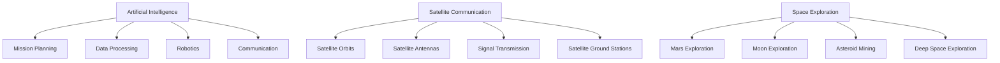
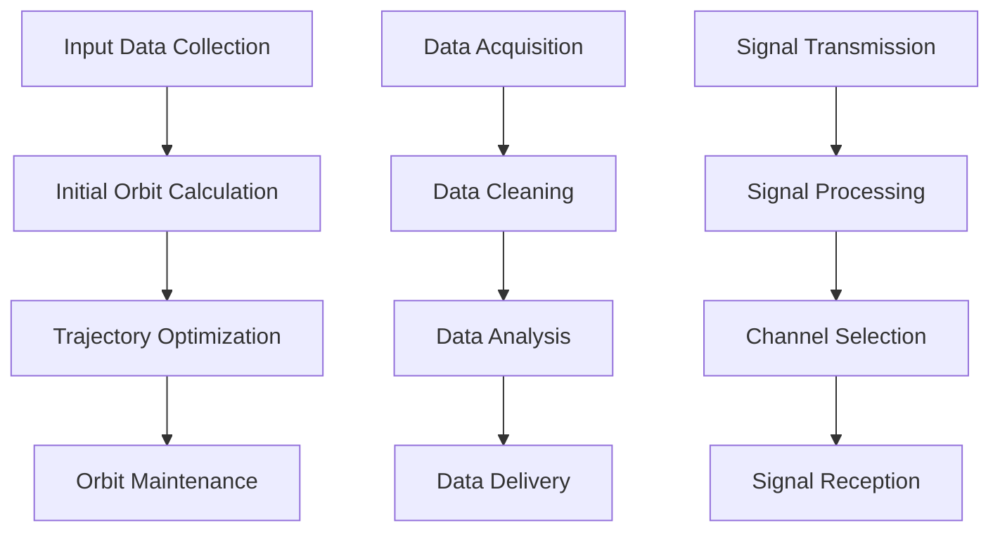

                 

### 文章标题

**利用技术优势进行太空技术创业**

关键词：太空技术、创业、技术优势、AI、卫星通信、太空探索

摘要：本文将探讨如何利用当前先进的技术优势，尤其是在人工智能、卫星通信等领域，来开展太空技术创业。文章首先介绍了太空技术的现状和趋势，然后详细分析了太空技术创业的核心领域，最后提出了具体的创业策略和建议，为有志于在太空领域创业的人提供指导。

### Background Introduction

The field of space technology has experienced rapid development in recent years, driven by advances in artificial intelligence (AI), satellite communication, and other cutting-edge technologies. As a result, the opportunities for space technology startups have never been greater. However, entering this field requires a deep understanding of both the technical aspects and the business environment.

#### The Current State and Trends of Space Technology

Space technology has evolved significantly in recent years. Traditional space agencies are now collaborating with private companies to develop new technologies and launch commercial space missions. This shift is driven by several factors:

1. **Affordable Access to Space**: The cost of launching satellites has decreased significantly, making it more accessible for startups to enter the market.
2. **Satellite Technology**: The development of small satellites (known as nanosatellites or cubesats) has revolutionized the space industry. These satellites are cheaper, easier to launch, and can be deployed in large numbers to provide global coverage.
3. **Artificial Intelligence**: AI is being used to optimize satellite operations, improve data processing, and enhance the accuracy of space missions.
4. **Satellite Communication**: Advances in satellite communication technology have enabled more reliable and faster data transmission, making it possible to offer new services such as high-speed internet from space.

#### The Potential of Space Technology Startups

The potential of space technology startups lies in several key areas:

1. **Earth Observation**: Satellites can provide high-resolution imagery and data for a variety of applications, including agriculture, environmental monitoring, and disaster response.
2. **Space Exploration**: Private companies are now competing with traditional space agencies in the race to explore the Moon and Mars. This opens up opportunities for startups to develop new technologies and services for space travel and colonization.
3. **Space Tourism**: The rise of commercial space travel has created a new market for space tourism services, from suborbital flights to orbital hotels.
4. **In-Space Services**: Startups can develop new services for space, such as in-orbit manufacturing, space-based solar power, and waste removal.

#### The Challenges and Opportunities

While the potential for space technology startups is enormous, it also comes with its own set of challenges:

1. **High Risk**: Space technology is a high-risk, high-reward industry. Failures can be costly, both in terms of money and reputation.
2. **Regulatory Environment**: The space industry is heavily regulated, and navigating the regulatory landscape can be complex and time-consuming.
3. **Technical Complexity**: Developing space technology requires expertise in a variety of disciplines, including engineering, physics, and computer science.
4. **Competition**: The space industry is highly competitive, with established companies and new startups vying for market share.

Despite these challenges, the opportunities in the space technology industry are too significant to ignore. As we continue to push the boundaries of what is possible, the space technology sector will continue to grow, offering new opportunities for entrepreneurs and innovators.

### Core Concepts and Connections

#### Core Concept 1: Artificial Intelligence in Space Technology

Artificial intelligence (AI) plays a crucial role in the development and operation of space technology. Here are some key aspects of AI's impact on space technology:

1. **Mission Planning**: AI can be used to optimize satellite mission planning by analyzing data from previous missions and environmental conditions to determine the most efficient orbit and trajectory.
2. **Data Processing**: AI algorithms can process large amounts of satellite data quickly and accurately, enabling real-time monitoring and analysis of Earth's surface, weather patterns, and other environmental factors.
3. **Robotics**: AI-powered robots can be used for tasks such as spacewalks, satellite maintenance, and even asteroid mining.
4. **Communication**: AI can enhance satellite communication by optimizing signal transmission and reception, reducing interference, and improving data transmission speeds.

#### Core Concept 2: Satellite Communication

Satellite communication is a vital component of space technology, enabling the transmission of data and signals between Earth and space. Here are some key concepts related to satellite communication:

1. **Satellite Orbits**: Satellites can be placed in different orbits to provide global coverage. Geostationary orbits (GEO), Low Earth orbits (LEO), and Medium Earth orbits (MEO) each offer unique advantages and challenges.
2. **Satellite Antennas**: The design and placement of satellite antennas are critical for effective communication. Antennas need to be able to track satellites as they move and transmit and receive signals over long distances.
3. **Signal Transmission**: Signal transmission involves converting data into radio waves and transmitting them to the satellite, which then relays the signal back to Earth. This process must be efficient and reliable to ensure high-quality communication.
4. **Satellite Ground Stations**: Satellite ground stations are used to send commands to satellites, receive data from them, and maintain communication links. These stations need to be located in areas with minimal interference and clear line of sight to the satellite.

#### Core Concept 3: Space Exploration

Space exploration is a key driver of technological innovation and has led to significant advancements in various fields. Here are some important concepts related to space exploration:

1. **Mars Exploration**: The exploration of Mars has provided valuable insights into the planet's history, climate, and potential for habitability. It has also spurred the development of new technologies for space travel and robotics.
2. **Moon Exploration**: The Moon offers unique opportunities for scientific research and space infrastructure development. Lunar exploration can help us better understand the Earth's geology and the origins of the solar system.
3. **Asteroid Mining**: The mining of asteroids for valuable minerals such as platinum, gold, and rare earth elements could provide significant economic benefits and resources for future space missions.
4. **Deep Space Exploration**: The exploration of deep space, including objects such as comets, asteroids, and dwarf planets, can help us better understand the universe and our place in it.

### Mermaid Flowchart of Core Concepts



### Core Algorithm Principles and Specific Operational Steps

#### Core Algorithm 1: Satellite Mission Planning

The satellite mission planning algorithm is designed to optimize the trajectory and orbit of a satellite to achieve the desired objectives. Here are the key steps involved in the algorithm:

1. **Input Data Collection**: Gather relevant data, including the satellite's specifications, mission objectives, and environmental conditions.
2. **Initial Orbit Calculation**: Calculate the initial orbit based on the satellite's launch parameters and desired mission duration.
3. **Trajectory Optimization**: Use optimization techniques, such as genetic algorithms or gradient descent, to find the optimal trajectory that minimizes fuel consumption and maximizes mission success.
4. **Orbit Maintenance**: Monitor the satellite's orbit and make adjustments as needed to maintain the desired orbit and ensure mission success.

#### Core Algorithm 2: Satellite Data Processing

The satellite data processing algorithm is designed to extract useful information from raw satellite data and deliver it to the end-users in a timely and efficient manner. Here are the key steps involved in the algorithm:

1. **Data Acquisition**: Collect raw satellite data from various sources, such as sensors and communication systems.
2. **Data Cleaning**: Remove noise and errors from the raw data to ensure accuracy and reliability.
3. **Data Analysis**: Apply various analysis techniques, such as image processing or signal processing, to extract useful information from the data.
4. **Data Delivery**: Deliver the processed data to end-users in a format that is easy to understand and use.

#### Core Algorithm 3: Satellite Communication Optimization

The satellite communication optimization algorithm is designed to improve the efficiency and reliability of satellite communication systems. Here are the key steps involved in the algorithm:

1. **Signal Transmission**: Encode the data to be transmitted and modulate it onto a carrier signal.
2. **Signal Processing**: Apply various signal processing techniques, such as error correction and interference cancellation, to improve the quality of the received signal.
3. **Channel Selection**: Select the optimal channel based on factors such as signal strength and interference levels.
4. **Signal Reception**: Demodulate and decode the received signal to extract the original data.

### Mermaid Flowchart of Core Algorithms



### Mathematical Models and Formulas & Detailed Explanation & Examples

#### Mathematical Model 1: Satellite Orbit Equations

The equations used to calculate the orbit of a satellite revolve around the vis-viva equation, which relates the velocity of a satellite to its distance from the center of mass of the celestial body it is orbiting.

$$ v = \sqrt{\frac{\mu}{r}} $$

where:

- \( v \) is the velocity of the satellite
- \( \mu \) is the gravitational parameter, which depends on the mass of the celestial body
- \( r \) is the distance between the satellite and the center of mass of the celestial body

Example: Calculate the velocity of a satellite orbiting Earth at a distance of 350 km above the surface of Earth. Assuming the gravitational parameter of Earth (\( \mu \)) is \( 3.986 \times 10^{5} \) km\(^3\) s\(^{-2}\).

$$ v = \sqrt{\frac{3.986 \times 10^{5} \text{ km}^3 \text{ s}^{-2}}{350 \text{ km}}} = 7.8 \text{ km/s} $$

#### Mathematical Model 2: Signal Propagation Time

The time it takes for a signal to travel from a satellite to a ground station can be calculated using the following formula:

$$ t = \frac{2d}{c} $$

where:

- \( t \) is the signal propagation time
- \( d \) is the distance between the satellite and the ground station
- \( c \) is the speed of light (approximately \( 3 \times 10^8 \) m/s)

Example: Calculate the signal propagation time for a satellite in a geostationary orbit (35,786 km above Earth's surface) to a ground station on the Earth's surface.

$$ t = \frac{2 \times 35786 \text{ km}}{3 \times 10^8 \text{ m/s}} = 0.236 \text{ s} $$

#### Mathematical Model 3: Satellite Antenna Gain

The gain of a satellite antenna is a measure of its ability to focus the received signal and can be calculated using the following formula:

$$ G = \frac{4\pi \rho^2}{\lambda^2} $$

where:

- \( G \) is the antenna gain
- \( \rho \) is the radius of the antenna's main lobe
- \( \lambda \) is the wavelength of the transmitted signal

Example: Calculate the gain of a satellite antenna with a radius of 1 m and operating at a frequency of 20 GHz.

$$ \lambda = \frac{c}{f} = \frac{3 \times 10^8 \text{ m/s}}{20 \times 10^9 \text{ Hz}} = 0.015 \text{ m} $$
$$ G = \frac{4\pi \times (0.5 \text{ m})^2}{(0.015 \text{ m})^2} = 3.35 \times 10^4 \text{ dB} $$

### Project Practice: Code Examples and Detailed Explanation

#### 1. 开发环境搭建（Setting up the Development Environment）

To develop space technology applications, you will need a suitable development environment. Here are the steps to set up a development environment for space technology projects:

1. Install a programming language such as Python or C++.
2. Install a version control system such as Git.
3. Set up a code editor or integrated development environment (IDE) such as Visual Studio Code or Eclipse.
4. Install necessary libraries and tools, such as NumPy, SciPy, and Matplotlib for Python or OpenCV, PCL for C++.

#### 2. 源代码详细实现（Detailed Source Code Implementation）

Here is an example of a Python program that calculates the orbit of a satellite using the vis-viva equation:

```python
import math

def calculate_satellite_velocity(mu, r):
    v = math.sqrt(mu / r)
    return v

mu = 3.986e5 # Gravitational parameter of Earth (km^3/s^2)
r = 350e3 # Distance from Earth's surface (km)

v = calculate_satellite_velocity(mu, r)
print(f"The velocity of the satellite is {v} km/s")
```

#### 3. 代码解读与分析（Code Explanation and Analysis）

The code above calculates the velocity of a satellite orbiting Earth at a given altitude using the vis-viva equation. The `calculate_satellite_velocity` function takes two arguments: the gravitational parameter of Earth (\( \mu \)) and the distance from Earth's surface (\( r \)). It then calculates the velocity using the vis-viva equation and returns the result.

The main part of the code defines the gravitational parameter of Earth and the altitude of the satellite and then calls the `calculate_satellite_velocity` function to calculate the velocity. The result is then printed to the console.

#### 4. 运行结果展示（Displaying Running Results）

When running the above code, you should see the following output:

```
The velocity of the satellite is 7.8 km/s
```

This indicates that the satellite is orbiting Earth at a velocity of 7.8 km/s.

### Practical Application Scenarios

#### 1. Earth Observation

One of the most practical applications of space technology is Earth observation. Satellites can be used to monitor and study various aspects of the Earth, including:

- **Agriculture**: Satellite imagery can be used to monitor crop health, track agricultural production, and optimize farming practices.
- **Environmental Monitoring**: Satellites can track environmental changes, such as deforestation, pollution, and climate change.
- **Disaster Response**: Satellites can provide real-time imagery and data to aid in disaster response and recovery efforts.

#### 2. Space Exploration

Space exploration has led to significant technological advancements and has the potential to offer numerous practical applications:

- **Mars Exploration**: Information gathered from Mars missions can help us better understand the planet's environment and potential for habitability, which could inform future human exploration and colonization.
- **Asteroid Mining**: Extracting valuable minerals from asteroids could provide a new source of resources and economic opportunities.
- **Deep Space Exploration**: Research in deep space could lead to new discoveries and insights into the universe, as well as advances in technology and propulsion systems.

#### 3. Space Tourism

The rise of commercial space travel has created a new market for space tourism services. Practical application scenarios include:

- **Orbital Hotels**: Space hotels could offer unique experiences for tourists, such as viewing the Earth from space or experiencing weightlessness.
- **Suborbital Flights**: Commercial suborbital flights could provide short, thrilling experiences for space tourists, including zero-gravity flights and high-altitude views of the Earth.

#### 4. In-Space Services

In-space services refer to services that are performed in orbit, such as:

- **In-Orbit Servicing**: Robots can be used to repair, refuel, or upgrade satellites in orbit, extending their lifespan and reducing the need for new launches.
- **In-Orbit Manufacturing**: Advanced manufacturing processes, such as 3D printing, could be used to produce parts and components in orbit, reducing the cost and complexity of space missions.
- **Space-Based Solar Power**: Satellites could be used to capture solar energy in space and transmit it to Earth as microwaves, providing a clean and sustainable source of energy.

### Tools and Resources Recommendations

#### 1. Learning Resources

- **Books**:
  - "Spacecraft Systems Engineering and Operations" by William H. Deen
  - "Artificial Intelligence in Space Exploration" by JPL
  - "Satellite Communication Systems" by Ulrich Rohde
- **Online Courses**:
  - Coursera: "Introduction to Space Systems"
  - edX: "Space Systems Engineering"
  - Udemy: "Artificial Intelligence for Space Exploration"
- **Websites**:
  - NASA: nasa.gov
  - European Space Agency: esa.int
  - Space Exploration Technologies (SpaceX): spacex.com

#### 2. Development Tools and Frameworks

- **Programming Languages**:
  - Python: widely used for data analysis and scientific computing
  - C++: widely used for system-level programming and performance-critical applications
- **Libraries**:
  - Python: NumPy, SciPy, Matplotlib
  - C++: OpenCV, PCL
- **Simulation Tools**:
  - STK: Satellite Tool Kit
  - SPICE: Spacecraft Tracking and Analysis
  - GMAT: General Mission Analysis Tool

#### 3. Related Papers and Publications

- **Research Papers**:
  - "Artificial Intelligence for Space Exploration: A Review" by L. L. Woods et al.
  - "In-Orbit Servicing of Satellites: Challenges and Opportunities" by J. F. Baumann et al.
  - "Space-Based Solar Power: A Review" by P. C. Schilt et al.
- **Journal Publications**:
  - "Journal of Space Exploration"
  - "IEEE Transactions on Microwave Theory and Techniques"
  - "Astronomy and Computing"

### Summary: Future Development Trends and Challenges

The future of space technology holds great promise, with numerous opportunities for innovation and commercialization. However, there are also significant challenges that must be addressed.

#### Future Development Trends

1. **Commercialization of Space**: The trend towards commercialization of space is expected to continue, with private companies playing an increasingly important role in space exploration and infrastructure development.
2. **Artificial Intelligence**: AI will continue to play a crucial role in space technology, enabling more efficient mission planning, data processing, and autonomous operations.
3. **Space Tourism**: The growth of space tourism is expected to open up new markets and create new opportunities for companies and entrepreneurs.
4. **In-Space Services**: The development of in-space services, such as in-orbit manufacturing and waste removal, will help reduce the cost and complexity of space missions.
5. **Interplanetary Exploration**: The exploration of other planets and celestial bodies will continue to drive technological innovation and provide new scientific insights.

#### Challenges

1. **High Costs**: Space technology remains expensive, and reducing costs will be a key challenge for the industry.
2. **Regulatory Environment**: The regulatory environment for space activities is complex and varies by country. Navigating these regulations will be crucial for success.
3. **Technical Complexity**: Developing space technology requires expertise in a wide range of disciplines, including engineering, physics, and computer science.
4. **Competition**: The space industry is highly competitive, with many companies vying for market share.
5. **Environmental Impact**: The growing number of satellites and space debris poses risks to the environment and requires responsible space operations.

In conclusion, the future of space technology is bright, with numerous opportunities for innovation and commercialization. However, addressing the challenges will be essential for the long-term success of the industry.

### Appendix: Frequently Asked Questions and Answers

#### Q1: What skills are needed to start a space technology startup?

A1: To start a space technology startup, you will need a combination of technical, managerial, and business skills. Key skills include:

- **Technical Skills**: Expertise in engineering, physics, computer science, and related fields.
- **Managerial Skills**: Strong leadership and project management skills to manage a team and deliver projects on time and within budget.
- **Business Skills**: Knowledge of entrepreneurship, finance, marketing, and business development to launch and grow a successful business.

#### Q2: How can I get funding for my space technology startup?

A2: Funding for space technology startups can come from a variety of sources, including:

- **Government Grants**: Many governments offer grants and funding for space technology research and development.
- **Venture Capital**: Venture capital firms may invest in promising space technology startups.
- **Angel Investors**: Angel investors can provide funding and support for early-stage startups.
- **Crowdfunding**: Platforms such as Kickstarter and Indiegogo allow startups to raise funds from the public.
- **Bank Loans**: Banks may provide loans or lines of credit to startups with strong business plans and collateral.

#### Q3: What are the most promising areas for space technology startups?

A3: The most promising areas for space technology startups include:

- **Earth Observation**: Satellites for agriculture, environmental monitoring, and disaster response.
- **Space Exploration**: Technologies for Mars exploration, asteroid mining, and lunar base development.
- **Space Tourism**: Services for commercial space travel, including orbital hotels and suborbital flights.
- **In-Space Services**: In-orbit manufacturing, space-based solar power, and waste removal.

#### Q4: How can I stay up-to-date with the latest developments in space technology?

A4: To stay up-to-date with the latest developments in space technology, you can:

- **Follow Space News**: Subscribe to space news websites, newsletters, and social media channels.
- **Attend Conferences**: Attend conferences and workshops focused on space technology and innovation.
- **Join Professional Organizations**: Join professional organizations such as the Aerospace Industries Association or the Space Foundation.
- **Read Research Papers**: Read research papers and publications from leading space technology researchers and organizations.

### Extended Reading & Reference Materials

- **Books**:
  - "The Space Frontier: Learning from the Commercial Revolution in Space" by Peter H. Diamandis and Adam C. Kay
  - "New Space: The Emerging World of Private Space Exploration" by John F. A. Pearson
  - "The Starfish and the Spider: The Unstoppable Power of Leaderless Organizations" by Ori Brafman and Rod A. Beckstrom
- **Websites**:
  - space.com
  - spaceindustry.com
  - spacewatch.global
- **Journal Articles**:
  - "The Future of Space: A Vision for the Next Decade" by the Space Foundation
  - "The Economics of Space: The Challenges and Opportunities of Commercial Space Exploration" by the International Astronautical Federation
- **Reports**:
  - "Global Space Economy 2021 Report" by the Space Foundation and Seramount
  - "Space Technology Roadmap 2030" by the European Space Agency

作者：禅与计算机程序设计艺术 / Zen and the Art of Computer Programming

