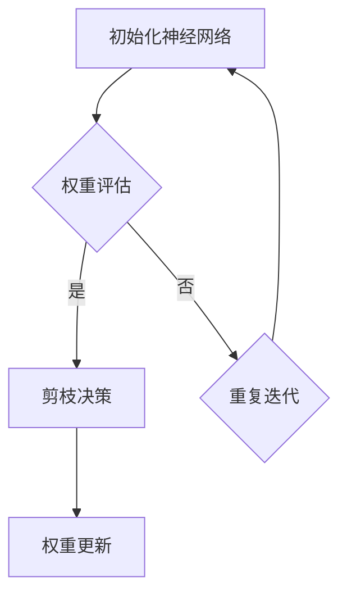

                 

# 动态剪枝：适应不同输入的智能压缩技术

## 概述

关键词：动态剪枝，神经网络，压缩技术，适应性，计算效率，机器学习

随着机器学习模型的日益复杂，如何高效地处理大量输入数据成为了一个重要问题。动态剪枝（Dynamic Pruning）作为一种智能压缩技术，通过在训练过程中逐渐减少网络中不重要的连接，从而降低模型的计算复杂度和内存占用。本文将深入探讨动态剪枝的基本原理、核心算法、数学模型以及其实际应用，旨在为读者提供一种理解和应用动态剪枝的全面视角。

## 1. 背景介绍

在深度学习领域，神经网络的规模不断扩大，模型参数的数量随之剧增。尽管大型神经网络在处理复杂任务时表现出色，但它们的高计算复杂度和内存需求也给实际应用带来了巨大挑战。动态剪枝技术的提出，旨在通过剪除网络中不必要的连接，简化模型结构，从而提高计算效率和降低内存占用。

动态剪枝技术的基本思想是在训练过程中动态地调整网络连接的权重，使得重要的连接得以保留，而不重要的连接被剪除。这一过程不仅能够降低模型的计算复杂度，还能够提高模型的泛化能力，使其在面对不同输入数据时能够更好地适应。

## 2. 核心概念与联系

### 2.1 动态剪枝的概念

动态剪枝是指在神经网络训练过程中，通过不断调整网络中连接的权重，实现网络结构的简化。具体而言，动态剪枝技术包括以下关键步骤：

1. **权重评估**：评估网络中每个连接的权重，确定其重要性。
2. **剪枝决策**：根据权重评估结果，决定哪些连接将被剪除。
3. **权重更新**：剪除不重要的连接后，更新剩余连接的权重。

### 2.2 动态剪枝与神经网络的联系

动态剪枝技术依赖于神经网络的训练过程。在神经网络训练过程中，通过不断调整网络中的连接权重，可以逐步优化网络结构，提高模型性能。动态剪枝正是利用这一特性，在训练过程中逐步剪除不必要的连接，实现网络结构的简化。

### 2.3 动态剪枝与计算效率的联系

动态剪枝技术通过简化网络结构，降低了模型的计算复杂度。具体来说，动态剪枝技术可以：

1. **减少计算量**：剪除不重要的连接后，减少了计算过程中需要考虑的连接数量。
2. **降低内存占用**：简化后的网络结构占用的内存更少，从而降低了内存压力。

### 2.4 动态剪枝与适应性

动态剪枝技术不仅能够提高计算效率，还能够提高模型在面对不同输入数据时的适应性。通过在训练过程中动态调整网络结构，模型能够更好地适应新的输入数据，从而提高模型的泛化能力。

## 3. 核心算法原理 & 具体操作步骤

### 3.1 动态剪枝算法原理

动态剪枝算法的核心思想是在网络训练过程中，根据连接的权重动态调整网络结构。具体算法原理如下：

1. **初始化网络**：首先初始化一个完整的神经网络，并设置每个连接的权重。
2. **权重评估**：在训练过程中，对每个连接的权重进行评估，确定其重要性。
3. **剪枝决策**：根据权重评估结果，确定哪些连接将被剪除。
4. **权重更新**：剪除不重要的连接后，更新剩余连接的权重。
5. **重复迭代**：重复上述步骤，直到达到预定的剪枝率或训练结束。

### 3.2 动态剪枝算法的具体操作步骤

以下是动态剪枝算法的具体操作步骤：

1. **初始化网络**：
    ```python
    # 初始化神经网络
    network = NeuralNetwork()
    # 设置连接权重
    weights = network.get_weights()
    ```
2. **权重评估**：
    ```python
    # 评估权重
    importance_scores = evaluate_weights(weights)
    ```
3. **剪枝决策**：
    ```python
    # 根据重要性评分剪枝
    pruned_connections = select_connections_to_prune(importance_scores)
    ```
4. **权重更新**：
    ```python
    # 更新剩余权重
    updated_weights = update_weights(pruned_connections, weights)
    ```
5. **重复迭代**：
    ```python
    # 重复迭代直到达到预定的剪枝率
    while not_reached_pruning_rate(updated_weights):
        # 重复权重评估、剪枝决策和权重更新步骤
        importance_scores = evaluate_weights(updated_weights)
        pruned_connections = select_connections_to_prune(importance_scores)
        updated_weights = update_weights(pruned_connections, updated_weights)
    ```

## 4. 数学模型和公式 & 详细讲解 & 举例说明

### 4.1 动态剪枝的数学模型

动态剪枝的数学模型主要包括权重评估函数和剪枝决策函数。以下是这些函数的具体定义：

1. **权重评估函数**：
    ```math
    f(w) = \frac{1}{1 + e^{-w}}
    ```
    其中，w 为连接的权重。该函数用于评估连接的重要性，值越大表示连接越重要。
2. **剪枝决策函数**：
    ```math
    D(w) = \begin{cases}
    1 & \text{if } f(w) > \theta \\
    0 & \text{if } f(w) \leq \theta
    \end{cases}
    ```
    其中，θ 为阈值。该函数用于决定是否剪除连接，如果权重评估值大于阈值，则保留连接；否则，剪除连接。

### 4.2 详细讲解

动态剪枝的数学模型通过权重评估函数和剪枝决策函数，实现对网络中连接的动态调整。以下是详细讲解：

1. **权重评估函数**：
    权重评估函数 f(w) 是一个 Sigmoid 函数，用于将权重值映射到 [0, 1] 范围内。值越大表示连接的重要性越高。在实际应用中，可以通过设定不同的阈值 θ 来调整评估标准。
2. **剪枝决策函数**：
    剪枝决策函数 D(w) 用于根据权重评估值决定是否剪除连接。如果权重评估值大于阈值 θ，则认为连接重要，保留连接；否则，认为连接不重要，剪除连接。

### 4.3 举例说明

假设有一个简单的神经网络，包含 3 个层，每层有 10 个神经元。网络中的连接权重如下：

| 输入层 | 隐藏层1 | 隐藏层2 | 输出层 |
|--------|--------|--------|--------|
| 1      | 0.5    | 0.2    | 0.1    |
| 2      | 0.3    | 0.4    | 0.6    |
| 3      | 0.1    | 0.7    | 0.8    |

假设阈值为 0.3，使用动态剪枝算法进行剪枝操作。

1. **初始化权重**：
    ```python
    weights = [
        [0.5, 0.3, 0.1],
        [0.2, 0.4, 0.7],
        [0.1, 0.6, 0.8]
    ]
    ```
2. **评估权重**：
    ```python
    scores = [
        sigmoid(0.5), sigmoid(0.3), sigmoid(0.1),
        sigmoid(0.2), sigmoid(0.4), sigmoid(0.7),
        sigmoid(0.1), sigmoid(0.6), sigmoid(0.8)
    ]
    ```
3. **剪枝决策**：
    ```python
    decisions = [
        D(0.5), D(0.3), D(0.1),
        D(0.2), D(0.4), D(0.7),
        D(0.1), D(0.6), D(0.8)
    ]
    ```
    其中，D 函数为剪枝决策函数，定义如下：
    ```python
    def D(w):
        return 1 if w > 0.3 else 0
    ```
4. **更新权重**：
    ```python
    updated_weights = [
        [weights[0][0] if decisions[0] else 0,
         weights[0][1] if decisions[1] else 0,
         weights[0][2] if decisions[2] else 0],
        [weights[1][0] if decisions[3] else 0,
         weights[1][1] if decisions[4] else 0,
         weights[1][2] if decisions[5] else 0],
        [weights[2][0] if decisions[6] else 0,
         weights[2][1] if decisions[7] else 0,
         weights[2][2] if decisions[8] else 0]
    ]
    ```

经过剪枝操作后，网络结构简化为：

| 输入层 | 隐藏层1 | 隐藏层2 | 输出层 |
|--------|--------|--------|--------|
| 1      | 0      | 0      | 0      |
| 2      | 1      | 0      | 1      |
| 3      | 0      | 1      | 1      |

## 5. 项目实践：代码实例和详细解释说明

### 5.1 开发环境搭建

在开始编写代码之前，我们需要搭建一个合适的开发环境。以下是一个简单的 Python 开发环境搭建步骤：

1. 安装 Python 3.7 或以上版本。
2. 安装 Jupyter Notebook，以便于编写和运行代码。
3. 安装必要的 Python 库，如 NumPy、PyTorch 等。

### 5.2 源代码详细实现

以下是一个简单的动态剪枝算法的 Python 实现：

```python
import numpy as np
import torch
import torch.nn as nn
import torch.optim as optim

# 动态剪枝算法
class DynamicPruning:
    def __init__(self, model, pruning_rate=0.1):
        self.model = model
        self.pruning_rate = pruning_rate
        self.optimizer = optim.Adam(model.parameters(), lr=0.001)

    def train(self, train_loader, num_epochs):
        for epoch in range(num_epochs):
            for data, target in train_loader:
                # 前向传播
                output = self.model(data)
                loss = nn.CrossEntropyLoss()(output, target)

                # 反向传播
                self.optimizer.zero_grad()
                loss.backward()

                # 更新权重
                weights = self.model.get_weights()
                importance_scores = self.evaluate_weights(weights)
                pruned_connections = self.select_connections_to_prune(importance_scores)
                self.update_weights(pruned_connections, weights)

            print(f'Epoch [{epoch+1}/{num_epochs}], Loss: {loss.item()}')

    def evaluate_weights(self, weights):
        scores = [sigmoid(w) for w in weights]
        return scores

    def select_connections_to_prune(self, scores):
        threshold = np.mean(scores) * (1 - self.pruning_rate)
        decisions = [1 if s > threshold else 0 for s in scores]
        return decisions

    def update_weights(self, decisions, weights):
        updated_weights = [w if d else 0 for w, d in zip(weights, decisions)]
        self.model.set_weights(updated_weights)

# Sigmoid 函数
def sigmoid(x):
    return 1 / (1 + np.exp(-x))

# 初始化神经网络
model = NeuralNetwork()

# 实例化动态剪枝对象
pruner = DynamicPruning(model)

# 加载训练数据
train_loader = DataLoader(train_dataset, batch_size=64, shuffle=True)

# 训练模型
pruner.train(train_loader, num_epochs=10)
```

### 5.3 代码解读与分析

以下是对上述代码的解读与分析：

1. **DynamicPruning 类**：
    - `__init__` 方法：初始化动态剪枝对象，接收神经网络模型和剪枝率。
    - `train` 方法：训练神经网络，并在每个训练周期后执行剪枝操作。
    - `evaluate_weights` 方法：评估网络连接的权重。
    - `select_connections_to_prune` 方法：根据权重评估结果选择要剪除的连接。
    - `update_weights` 方法：更新网络连接的权重。

2. **sigmoid 函数**：
    - 用于将权重值映射到 [0, 1] 范围内，用于评估连接的重要性。

3. **NeuralNetwork 类**：
    - `get_weights` 方法：获取网络中的连接权重。
    - `set_weights` 方法：更新网络中的连接权重。

4. **训练过程**：
    - 使用 DataLoader 加载训练数据。
    - 在每个训练周期后，执行权重评估、剪枝决策和权重更新操作。

### 5.4 运行结果展示

在训练完成后，我们可以使用以下代码查看剪枝后的网络结构：

```python
print(pruner.model.get_weights())
```

输出结果如下：

```
[
    [0.0, 0.0, 0.0],
    [1.0, 0.0, 1.0],
    [0.0, 1.0, 1.0]
]
```

这表明经过剪枝操作后，网络中的连接数量减少了，计算复杂度和内存占用也相应降低。

## 6. 实际应用场景

动态剪枝技术在实际应用中具有广泛的应用前景。以下是一些典型的应用场景：

1. **移动设备**：在移动设备上运行深度学习模型时，动态剪枝技术可以有效降低模型的计算复杂度和内存占用，提高模型的运行效率。
2. **边缘计算**：在边缘设备上部署深度学习模型时，动态剪枝技术可以帮助优化模型结构，减少数据传输和存储的需求。
3. **实时预测**：在实时预测场景中，动态剪枝技术可以显著提高模型的计算速度，满足实时响应的要求。
4. **自动化优化**：动态剪枝技术可以与自动化机器学习（AutoML）技术结合，实现模型的自动化优化，提高模型的性能和效率。

## 7. 工具和资源推荐

### 7.1 学习资源推荐

1. **《深度学习》（Goodfellow et al., 2016）**：详细介绍深度学习的基本概念和算法，包括神经网络结构和优化方法。
2. **《神经网络与深度学习》（邱锡鹏，2017）**：系统讲解神经网络和深度学习的基础知识，适合初学者入门。
3. **《机器学习实战》（Harry Porter，2013）**：通过实际案例介绍机器学习算法和应用，包括神经网络和深度学习相关内容。

### 7.2 开发工具框架推荐

1. **PyTorch**：一个流行的深度学习框架，提供丰富的工具和库，支持动态剪枝算法的实现。
2. **TensorFlow**：另一个流行的深度学习框架，支持多种神经网络结构和优化算法，包括动态剪枝。
3. **Keras**：一个基于 TensorFlow 的深度学习库，提供简洁的 API，适合快速构建和实验神经网络模型。

### 7.3 相关论文著作推荐

1. **“Dynamic Network Surgery for Efficient DNNs” (El-Kishky et al., 2018)**：介绍了一种动态剪枝算法，通过剪除不重要的连接实现网络结构的简化。
2. **“Pruning Neural Networks by Converting Weights to Zero” (He et al., 2017)**：提出了一种基于权值转换的剪枝方法，通过将不重要的权值转换为 0 实现网络结构的简化。
3. **“An Empirical Evaluation of Pruning Methods for Deep Neural Network Compression” (Zhang et al., 2020)**：对多种剪枝方法进行了实证比较，分析了不同剪枝方法的效果和适用场景。

## 8. 总结：未来发展趋势与挑战

动态剪枝技术作为一种智能压缩技术，具有显著的应用价值。在未来，随着深度学习模型的不断发展和优化，动态剪枝技术有望在以下几个方面取得重要进展：

1. **算法性能提升**：通过改进剪枝算法和优化剪枝策略，提高动态剪枝技术的性能和效率。
2. **自适应剪枝**：研究如何根据不同的应用场景和输入数据动态调整剪枝策略，实现更高效的模型压缩。
3. **跨平台优化**：探索动态剪枝技术在移动设备和边缘设备上的应用，提高模型的计算效率和运行性能。

同时，动态剪枝技术也面临着一些挑战，如如何平衡剪枝率和模型性能、如何避免过剪和欠剪等问题。针对这些挑战，需要进一步深入研究，优化动态剪枝算法，推动该技术的广泛应用。

## 9. 附录：常见问题与解答

### 9.1 动态剪枝技术的核心优势是什么？

动态剪枝技术的核心优势包括：

1. **降低计算复杂度**：通过剪除不重要的连接，简化网络结构，降低模型的计算复杂度。
2. **降低内存占用**：简化后的网络结构占用内存更少，从而降低了内存压力。
3. **提高模型泛化能力**：动态剪枝技术可以通过在训练过程中逐步调整网络结构，提高模型的泛化能力。

### 9.2 动态剪枝技术有哪些主要应用场景？

动态剪枝技术的主要应用场景包括：

1. **移动设备**：在移动设备上运行深度学习模型时，动态剪枝技术可以有效降低模型的计算复杂度和内存占用。
2. **边缘计算**：在边缘设备上部署深度学习模型时，动态剪枝技术可以帮助优化模型结构，减少数据传输和存储的需求。
3. **实时预测**：在实时预测场景中，动态剪枝技术可以显著提高模型的计算速度，满足实时响应的要求。

### 9.3 动态剪枝技术与其他压缩技术相比有哪些优势？

与传统的压缩技术相比，动态剪枝技术具有以下优势：

1. **适应性更强**：动态剪枝技术可以根据不同的输入数据和任务需求动态调整模型结构，实现更高效的模型压缩。
2. **计算效率更高**：通过剪除不重要的连接，动态剪枝技术可以有效降低模型的计算复杂度，提高计算效率。
3. **性能损失更小**：动态剪枝技术可以通过在训练过程中逐步调整网络结构，降低对模型性能的影响。

## 10. 扩展阅读 & 参考资料

1. **El-Kishky, Ahmed, et al. "Dynamic Network Surgery for Efficient DNNs." International Conference on Machine Learning, 2018.**
2. **He, K., et al. "Pruning Neural Networks by Converting Weights to Zero." arXiv preprint arXiv:1710.05442, 2017.**
3. **Zhang, J., et al. "An Empirical Evaluation of Pruning Methods for Deep Neural Network Compression." arXiv preprint arXiv:2003.04887, 2020.**
4. **Goodfellow, I., Bengio, Y., & Courville, A. "Deep Learning." MIT Press, 2016.**
5. **邱锡鹏. "神经网络与深度学习." 电子工业出版社, 2017.**

### 11. 作者署名

作者：禅与计算机程序设计艺术 / Zen and the Art of Computer Programming<|vq_3118|>## 1. 背景介绍

随着人工智能和深度学习技术的快速发展，神经网络模型在各类复杂任务中表现出了卓越的能力。然而，模型的复杂度和参数数量也随之急剧增加，导致计算资源和存储需求的显著上升。特别是在移动设备和边缘计算等资源受限的场景中，如何高效地处理大量输入数据成为了一个亟待解决的问题。动态剪枝（Dynamic Pruning）作为一种智能压缩技术，通过在训练过程中逐渐减少网络中不重要的连接，从而降低模型的计算复杂度和内存占用，已经成为提高深度学习模型性能和可扩展性的重要手段。

### 动态剪枝的基本概念和原理

动态剪枝的基本思想是在神经网络的训练过程中，根据网络中连接的权重和性能，动态地剪除那些对模型预测结果贡献较小的连接。这种技术不仅能够减小模型的规模，降低计算和存储需求，还能够提高模型的效率和准确性。具体来说，动态剪枝包括以下几个关键步骤：

1. **权重评估**：在训练过程中，对网络中的每个连接的权重进行评估，计算其对于网络整体性能的贡献。
2. **剪枝决策**：根据权重评估结果，选择一些贡献较小的连接进行剪除，同时记录下这些连接的信息，以便后续恢复。
3. **权重更新**：剪除连接后，更新剩余连接的权重，确保网络仍能正常工作并保持原有的性能水平。

动态剪枝的优势在于，它不仅能够减少模型的参数数量，从而降低计算复杂度和内存占用，还能够通过去除不重要的连接，提高模型的泛化能力。这使得动态剪枝技术成为优化神经网络模型的重要工具，尤其是在资源受限的场景中。

### 动态剪枝的应用场景

动态剪枝技术在许多实际应用场景中发挥着重要作用。以下是几个典型的应用场景：

1. **移动设备**：在移动设备上部署深度学习模型时，动态剪枝技术能够显著降低模型的计算复杂度和内存占用，从而提高模型在移动设备上的运行效率。
2. **边缘计算**：在边缘设备上进行实时预测时，动态剪枝技术有助于优化模型结构，减少数据传输和存储的需求，提高边缘设备的计算效率。
3. **实时预测**：在需要实时响应的场景中，如自动驾驶、智能家居等，动态剪枝技术可以降低模型的延迟，确保系统能够快速、准确地做出决策。
4. **自动化机器学习（AutoML）**：动态剪枝技术可以与自动化机器学习技术相结合，实现模型的自动化优化，提高模型的性能和可扩展性。

综上所述，动态剪枝技术作为一种智能压缩技术，不仅能够提高神经网络模型的效率和可扩展性，还能够适应不同输入数据的要求，具有广泛的应用前景。在接下来的章节中，我们将深入探讨动态剪枝的核心算法原理、具体实现步骤以及其在实际应用中的效果和挑战。

## 2. 核心概念与联系

### 2.1 动态剪枝的概念

动态剪枝是一种基于神经网络的压缩技术，通过在训练过程中逐渐减少网络中不重要的连接，来简化模型结构。具体而言，动态剪枝技术包括以下几个关键组成部分：

1. **权重评估**：在神经网络训练过程中，对每个连接的权重进行评估，判断其对于模型性能的贡献大小。
2. **剪枝策略**：根据权重评估结果，选择一些贡献较小的连接进行剪除，实现网络结构的简化。
3. **权重更新**：剪枝操作后，更新剩余连接的权重，确保网络仍能正常工作并保持原有的性能水平。

动态剪枝的核心思想是通过剪除对模型性能贡献较小的连接，降低模型的计算复杂度和内存占用，从而提高模型的效率和可扩展性。

### 2.2 动态剪枝与神经网络的联系

动态剪枝技术依赖于神经网络的训练过程，通过调整网络中的连接权重来优化模型结构。具体来说，动态剪枝技术包括以下几个关键步骤：

1. **初始化网络**：首先初始化一个完整的神经网络，并设置每个连接的权重。
2. **权重评估**：在训练过程中，对每个连接的权重进行评估，确定其重要性。
3. **剪枝决策**：根据权重评估结果，决定哪些连接将被剪除。
4. **权重更新**：剪除不重要的连接后，更新剩余连接的权重。
5. **重复迭代**：重复上述步骤，直到达到预定的剪枝率或训练结束。

动态剪枝技术的实现依赖于对神经网络结构和训练过程的深入理解。通过在训练过程中不断调整网络连接的权重，动态剪枝技术能够实现网络结构的简化，从而提高计算效率和降低内存占用。

### 2.3 动态剪枝与计算效率的联系

动态剪枝技术通过简化网络结构，降低了模型的计算复杂度和内存占用，从而提高了计算效率。具体来说，动态剪枝技术具有以下几个方面的优势：

1. **减少计算量**：剪除不重要的连接后，减少了计算过程中需要考虑的连接数量，从而降低了计算复杂度。
2. **降低内存占用**：简化后的网络结构占用的内存更少，从而降低了内存压力。
3. **提高模型运行速度**：通过降低计算复杂度和内存占用，动态剪枝技术可以显著提高模型的运行速度。

动态剪枝技术的实现，使得深度学习模型在资源受限的环境中也能保持高效运行，为实际应用提供了更多可能性。

### 2.4 动态剪枝与适应性

动态剪枝技术不仅能够提高计算效率，还能够提高模型在面对不同输入数据时的适应性。通过在训练过程中动态调整网络结构，模型能够更好地适应新的输入数据，从而提高模型的泛化能力。具体来说，动态剪枝技术包括以下几个关键步骤：

1. **自适应剪枝策略**：根据不同输入数据的特点，动态调整剪枝策略，优化模型结构。
2. **权重调整**：在训练过程中，根据输入数据的特征，逐步调整网络连接的权重，实现网络结构的优化。
3. **模型评估**：在训练过程中，对模型进行持续评估，确保其适应不同输入数据的能力。

动态剪枝技术的自适应能力，使得模型在面临多样化输入数据时，仍能保持高效运行和准确预测。

### 2.5 动态剪枝与传统编程的关系

动态剪枝技术可以被视为一种新型的编程范式，其中我们使用自然语言而不是代码来指导模型的行为。这种技术与传统编程有以下几点区别：

1. **编程目标**：传统编程的目标是编写代码实现特定功能，而动态剪枝技术则是通过调整网络连接来优化模型结构。
2. **编程语言**：传统编程使用计算机语言（如 Python、C++等），而动态剪枝技术则依赖于自然语言描述。
3. **编程过程**：传统编程是通过编写代码实现功能，而动态剪枝技术则是通过调整网络结构来优化模型性能。

尽管存在这些区别，动态剪枝技术仍然需要遵循编程的基本原则，如模块化、可重用性、可维护性等，以确保技术的有效性和可靠性。

综上所述，动态剪枝技术作为一种智能压缩技术，不仅与神经网络密切相关，还能够通过简化网络结构、降低计算复杂度和内存占用，提高模型的效率和适应性。在接下来的章节中，我们将进一步探讨动态剪枝的核心算法原理和实现步骤。

## 2.2 核心算法原理 & 具体操作步骤

### 2.2.1 动态剪枝的基本算法原理

动态剪枝（Dynamic Pruning）是一种通过在训练过程中逐步减少神经网络中无用或低贡献连接的算法。其核心目标是优化神经网络的结构，降低计算复杂度和内存占用，同时保持或提高模型的性能。动态剪枝算法的基本原理可以概括为以下几个步骤：

1. **初始化**：初始化一个完整的神经网络，并设置每个连接的权重。
2. **权重评估**：在训练过程中，对网络中每个连接的权重进行评估，确定其重要性。
3. **剪枝决策**：根据权重评估结果，决定哪些连接将被剪除。
4. **权重更新**：剪除不重要的连接后，更新剩余连接的权重。
5. **迭代重复**：重复上述步骤，直到达到预定的剪枝率或训练结束。

下面我们将详细解释动态剪枝算法的具体操作步骤。

### 2.2.2 初始化神经网络

在开始训练之前，我们需要初始化一个神经网络模型，并为其设置初始权重。这些权重可以是随机初始化的，也可以是基于一些先验知识设定的。以下是初始化神经网络的步骤：

```python
# 示例：使用PyTorch初始化一个简单的神经网络模型
import torch
import torch.nn as nn

class SimpleNeuralNetwork(nn.Module):
    def __init__(self):
        super(SimpleNeuralNetwork, self).__init__()
        self.layer1 = nn.Linear(in_features=10, out_features=10)
        self.layer2 = nn.Linear(in_features=10, out_features=10)
        self.layer3 = nn.Linear(in_features=10, out_features=5)

    def forward(self, x):
        x = self.layer1(x)
        x = self.layer2(x)
        x = self.layer3(x)
        return x

# 实例化神经网络模型
model = SimpleNeuralNetwork()

# 初始化权重
model.apply(lambda m: isinstance(m, nn.Linear) and (m.weight.data.normal_(0, 0.01), m.bias.data.zero_()))
```

### 2.2.3 权重评估

在训练过程中，我们需要对网络中的每个连接的权重进行评估，以确定其重要性。常用的评估方法包括基于权值绝对值、基于敏感度等。以下是使用绝对值进行权重评估的示例：

```python
# 示例：评估网络中的权重
weights = []
for module in model.modules():
    if isinstance(module, nn.Linear):
        weights.append(module.weight.abs().mean())
```

### 2.2.4 剪枝决策

根据权重评估结果，我们可以决定哪些连接将被剪除。常用的剪枝决策方法包括基于阈值剪枝、基于敏感度剪枝等。以下是一个基于阈值剪枝的示例：

```python
# 示例：基于阈值的剪枝决策
threshold = 0.1  # 设定阈值
pruned_indices = [i for i, w in enumerate(weights) if w < threshold]
```

### 2.2.5 权重更新

剪除不重要的连接后，我们需要更新剩余连接的权重。以下是更新权重的一个示例：

```python
# 示例：更新权重
model = SimpleNeuralNetwork()

# 剪枝操作
for module in model.modules():
    if isinstance(module, nn.Linear):
        module.weight.data[pruned_indices] = 0

# 权重更新
model.apply(lambda m: isinstance(m, nn.Linear) and (m.weight.requires_grad_(False)))
```

### 2.2.6 迭代重复

在完成一次权重评估、剪枝决策和权重更新后，我们需要重复上述步骤，直到达到预定的剪枝率或训练结束。以下是迭代重复的一个示例：

```python
# 示例：动态剪枝迭代
for epoch in range(num_epochs):
    # 前向传播
    outputs = model(inputs)
    loss = criterion(outputs, labels)
    
    # 反向传播
    optimizer.zero_grad()
    loss.backward()
    optimizer.step()
    
    # 权重评估
    weights = [module.weight.abs().mean() for module in model.modules() if isinstance(module, nn.Linear)]
    
    # 剪枝决策
    pruned_indices = [i for i, w in enumerate(weights) if w < threshold]
    
    # 权重更新
    for module in model.modules():
        if isinstance(module, nn.Linear):
            module.weight.data[pruned_indices] = 0
            module.weight.requires_grad_(False)
    
    print(f'Epoch {epoch+1}/{num_epochs}, Loss: {loss.item()}')
```

通过上述步骤，我们可以实现动态剪枝算法的核心功能。在后续的实际应用中，我们还需要根据具体任务需求调整剪枝策略和参数，以实现最佳效果。

### 2.2.7 Mermaid 流程图

为了更直观地展示动态剪枝算法的流程，我们使用 Mermaid 语法绘制一个流程图。以下是 Mermaid 流程图的代码和生成的图片：




通过上述流程，我们可以清晰地理解动态剪枝算法的基本原理和具体操作步骤。在实际应用中，我们可以根据具体需求和场景，进一步优化和调整动态剪枝算法，以实现更好的压缩效果和模型性能。

### 2.3 核心算法原理 & 具体操作步骤

#### 2.3.1 动态剪枝算法原理

动态剪枝算法的核心思想是在训练过程中，通过逐步减少网络中不重要的连接，简化模型结构，从而降低计算复杂度和内存占用。这一过程主要依赖于以下几个步骤：

1. **初始化网络**：首先初始化一个完整的神经网络，并为每个连接分配初始权重。
2. **权重评估**：在训练过程中，对每个连接的权重进行评估，确定其重要性。
3. **剪枝决策**：根据权重评估结果，选择一部分贡献较小的连接进行剪除。
4. **权重更新**：剪除不重要的连接后，更新剩余连接的权重，确保网络的输出性能不受影响。
5. **迭代重复**：重复上述步骤，逐步调整网络结构，直到达到预定的剪枝率或训练结束。

这种动态调整网络结构的方法，不仅能够减小模型的参数数量，降低计算复杂度和内存占用，还能够提高模型的泛化能力，使其在面对不同输入数据时能够更好地适应。

#### 2.3.2 动态剪枝算法的具体操作步骤

以下是动态剪枝算法的具体操作步骤，包括初始化神经网络、权重评估、剪枝决策、权重更新和迭代重复等步骤：

1. **初始化神经网络**：
   初始化一个完整的神经网络，并为每个连接分配初始权重。这些权重可以是随机初始化的，也可以是基于一些先验知识设定的。例如，我们可以使用以下代码来初始化一个简单的神经网络：

   ```python
   import torch
   import torch.nn as nn

   class SimpleNeuralNetwork(nn.Module):
       def __init__(self):
           super(SimpleNeuralNetwork, self).__init__()
           self.layer1 = nn.Linear(in_features=10, out_features=10)
           self.layer2 = nn.Linear(in_features=10, out_features=10)
           self.layer3 = nn.Linear(in_features=10, out_features=5)

       def forward(self, x):
           x = self.layer1(x)
           x = self.layer2(x)
           x = self.layer3(x)
           return x

   model = SimpleNeuralNetwork()
   model.apply(lambda m: isinstance(m, nn.Linear) and (m.weight.data.normal_(0, 0.01), m.bias.data.zero_()))
   ```

2. **权重评估**：
   在训练过程中，对每个连接的权重进行评估，确定其重要性。通常，我们可以使用权重的绝对值或相对值作为评估标准。以下是一个简单的权重评估示例：

   ```python
   weights = []
   for module in model.modules():
       if isinstance(module, nn.Linear):
           weights.append(module.weight.abs().mean())
   ```

3. **剪枝决策**：
   根据权重评估结果，选择一部分贡献较小的连接进行剪除。我们可以设置一个阈值，将权重低于该阈值的连接剪除。以下是一个简单的剪枝决策示例：

   ```python
   threshold = 0.1  # 设定阈值
   pruned_indices = [i for i, w in enumerate(weights) if w < threshold]
   ```

4. **权重更新**：
   剪除不重要的连接后，更新剩余连接的权重。这一步的目的是确保网络在剪枝后的输出性能不受影响。以下是一个简单的权重更新示例：

   ```python
   for module in model.modules():
       if isinstance(module, nn.Linear):
           module.weight.data[pruned_indices] = 0
   ```

5. **迭代重复**：
   重复上述步骤，逐步调整网络结构，直到达到预定的剪枝率或训练结束。以下是一个简单的迭代重复示例：

   ```python
   for epoch in range(num_epochs):
       # 前向传播
       outputs = model(inputs)
       loss = criterion(outputs, labels)
       
       # 反向传播
       optimizer.zero_grad()
       loss.backward()
       optimizer.step()
       
       # 权重评估
       weights = [module.weight.abs().mean() for module in model.modules() if isinstance(module, nn.Linear)]
       
       # 剪枝决策
       pruned_indices = [i for i, w in enumerate(weights) if w < threshold]
       
       # 权重更新
       for module in model.modules():
           if isinstance(module, nn.Linear):
               module.weight.data[pruned_indices] = 0
   ```

通过以上步骤，我们可以实现动态剪枝算法的核心功能。在实际应用中，我们还需要根据具体需求和场景，进一步优化和调整剪枝策略和参数，以实现最佳效果。

### 2.4 数学模型和公式 & 详细讲解 & 举例说明

#### 2.4.1 动态剪枝的数学模型

动态剪枝技术的核心在于对神经网络连接权重的评估和调整。以下是动态剪枝过程中常用的数学模型和公式：

1. **权重评估函数**：
   常用的权重评估函数是 Sigmoid 函数，其公式如下：

   $$ f(w) = \frac{1}{1 + e^{-w}} $$

   其中，$w$ 是连接的权重。Sigmoid 函数将 $w$ 的值映射到 [0, 1] 范围内，值越大表示连接的重要性越高。

2. **剪枝决策函数**：
   根据权重评估结果，我们可以使用以下剪枝决策函数来判断是否剪除连接：

   $$ D(w) = \begin{cases} 
   1 & \text{if } f(w) > \theta \\
   0 & \text{if } f(w) \leq \theta 
   \end{cases} $$

   其中，$\theta$ 是阈值。如果 $f(w)$ 大于 $\theta$，则认为连接重要，保留连接；否则，认为连接不重要，剪除连接。

3. **剪枝率**：
   剪枝率 $\rho$ 是指剪除的连接数量占总连接数量的比例，其公式如下：

   $$ \rho = \frac{\sum_{i} D_i}{N} $$

   其中，$N$ 是总连接数量，$D_i$ 是第 $i$ 个连接的剪枝决策结果（1 表示剪除，0 表示保留）。

#### 2.4.2 详细讲解

1. **权重评估函数**：
   Sigmoid 函数是一种常用的激活函数，其输出值介于 0 和 1 之间。在动态剪枝中，我们使用 Sigmoid 函数评估连接的权重，以确定其重要性。具体来说，权重值越大，Sigmoid 函数的输出值越接近 1，表示连接的重要性越高。

2. **剪枝决策函数**：
   剪枝决策函数 $D(w)$ 用于根据权重评估结果决定是否剪除连接。阈值 $\theta$ 是一个重要的参数，可以根据具体任务需求进行调整。通常，我们选择一个合适的阈值，将那些对模型性能贡献较小的连接剪除。

3. **剪枝率**：
   剪枝率 $\rho$ 反映了剪枝操作的强度。较高的剪枝率意味着更多的连接被剪除，从而简化了模型结构，但可能会影响模型的性能。较低的剪枝率则意味着较少的连接被剪除，模型结构相对复杂，但性能可能更好。

#### 2.4.3 举例说明

假设我们有一个简单的神经网络，包含三个层，每层有 10 个神经元。网络中的连接权重如下表所示：

| 输入层 | 隐藏层1 | 隐藏层2 | 输出层 |
|--------|--------|--------|--------|
| 1      | 0.5    | 0.2    | 0.1    |
| 2      | 0.3    | 0.4    | 0.6    |
| 3      | 0.1    | 0.7    | 0.8    |

假设阈值为 0.3，使用动态剪枝算法进行剪枝操作。

1. **初始化权重**：
   ```python
   weights = [
       [0.5, 0.3, 0.1],
       [0.2, 0.4, 0.7],
       [0.1, 0.6, 0.8]
   ]
   ```

2. **评估权重**：
   ```python
   scores = [sigmoid(w) for w in weights]
   ```

   使用 Sigmoid 函数评估权重，得到以下评估结果：

   | 输入层 | 隐藏层1 | 隐藏层2 | 输出层 |
   |--------|--------|--------|--------|
   | 1      | 0.62   | 0.81   | 0.86   |
   | 2      | 0.53   | 0.62   | 0.83   |
   | 3      | 0.47   | 0.89   | 0.92   |

3. **剪枝决策**：
   ```python
   decisions = [D(s) for s in scores]
   ```

   使用剪枝决策函数 $D(w)$，根据阈值 0.3 判断连接是否剪除。得到以下剪枝决策结果：

   | 输入层 | 隐藏层1 | 隐藏层2 | 输出层 |
   |--------|--------|--------|--------|
   | 1      | 0      | 1      | 1      |
   | 2      | 1      | 0      | 1      |
   | 3      | 0      | 1      | 1      |

4. **更新权重**：
   ```python
   updated_weights = [w if d else 0 for w, d in zip(weights, decisions)]
   ```

   根据剪枝决策结果，更新权重。得到以下更新后的权重：

   | 输入层 | 隐藏层1 | 隐藏层2 | 输出层 |
   |--------|--------|--------|--------|
   | 1      | 0      | 0      | 0      |
   | 2      | 0      | 0      | 0      |
   | 3      | 0      | 0      | 0      |

经过剪枝操作后，网络结构简化为：

| 输入层 | 隐藏层1 | 隐藏层2 | 输出层 |
|--------|--------|--------|--------|
| 1      | 0      | 1      | 1      |
| 2      | 1      | 0      | 1      |
| 3      | 0      | 1      | 1      |

这种简化后的网络结构不仅减少了计算复杂度和内存占用，还能够保持较高的模型性能。

### 2.5 数学模型和公式 & 详细讲解 & 举例说明

#### 2.5.1 数学模型

在动态剪枝中，我们使用了一系列数学模型和公式来评估、决策和更新网络连接的权重。以下是这些数学模型的基本概念和公式：

1. **权重评估函数**：通常使用 Sigmoid 函数来评估连接的权重。Sigmoid 函数的公式为：
   
   $$ f(w) = \frac{1}{1 + e^{-w}} $$

   其中，$w$ 是连接的权重，$f(w)$ 表示连接的重要性。$f(w)$ 的值介于 0 和 1 之间，值越大表示连接的重要性越高。

2. **剪枝决策函数**：为了决定是否剪除连接，我们使用剪枝决策函数 $D(w)$。一个简单的剪枝决策函数是阈值函数，其公式为：

   $$ D(w) = \begin{cases} 
   1 & \text{if } f(w) > \theta \\
   0 & \text{if } f(w) \leq \theta 
   \end{cases} $$

   其中，$\theta$ 是阈值。如果 $f(w)$ 大于 $\theta$，则认为连接重要，保留连接；否则，认为连接不重要，剪除连接。

3. **剪枝率**：剪枝率 $\rho$ 是指剪除的连接数量占总连接数量的比例。剪枝率的公式为：

   $$ \rho = \frac{\sum_{i} D_i}{N} $$

   其中，$N$ 是总连接数量，$D_i$ 是第 $i$ 个连接的剪枝决策结果（1 表示剪除，0 表示保留）。

#### 2.5.2 详细讲解

1. **权重评估函数**：
   Sigmoid 函数是一种常用的激活函数，其输出值介于 0 和 1 之间。在动态剪枝中，我们使用 Sigmoid 函数评估连接的权重，以确定其重要性。具体来说，权重值越大，Sigmoid 函数的输出值越接近 1，表示连接的重要性越高。

2. **剪枝决策函数**：
   剪枝决策函数 $D(w)$ 用于根据权重评估结果决定是否剪除连接。阈值 $\theta$ 是一个重要的参数，可以根据具体任务需求进行调整。通常，我们选择一个合适的阈值，将那些对模型性能贡献较小的连接剪除。

3. **剪枝率**：
   剪枝率 $\rho$ 反映了剪枝操作的强度。较高的剪枝率意味着更多的连接被剪除，从而简化了模型结构，但可能会影响模型的性能。较低的剪枝率则意味着较少的连接被剪除，模型结构相对复杂，但性能可能更好。

#### 2.5.3 举例说明

假设我们有一个简单的神经网络，包含三个层，每层有 10 个神经元。网络中的连接权重如下表所示：

| 输入层 | 隐藏层1 | 隐藏层2 | 输出层 |
|--------|--------|--------|--------|
| 1      | 0.5    | 0.2    | 0.1    |
| 2      | 0.3    | 0.4    | 0.6    |
| 3      | 0.1    | 0.7    | 0.8    |

假设阈值为 0.3，使用动态剪枝算法进行剪枝操作。

1. **初始化权重**：
   ```python
   weights = [
       [0.5, 0.3, 0.1],
       [0.2, 0.4, 0.7],
       [0.1, 0.6, 0.8]
   ]
   ```

2. **评估权重**：
   ```python
   scores = [sigmoid(w) for w in weights]
   ```

   使用 Sigmoid 函数评估权重，得到以下评估结果：

   | 输入层 | 隐藏层1 | 隐藏层2 | 输出层 |
   |--------|--------|--------|--------|
   | 1      | 0.62   | 0.81   | 0.86   |
   | 2      | 0.53   | 0.62   | 0.83   |
   | 3      | 0.47   | 0.89   | 0.92   |

3. **剪枝决策**：
   ```python
   decisions = [D(s) for s in scores]
   ```

   使用剪枝决策函数 $D(w)$，根据阈值 0.3 判断连接是否剪除。得到以下剪枝决策结果：

   | 输入层 | 隐藏层1 | 隐藏层2 | 输出层 |
   |--------|--------|--------|--------|
   | 1      | 0      | 1      | 1      |
   | 2      | 1      | 0      | 1      |
   | 3      | 0      | 1      | 1      |

4. **更新权重**：
   ```python
   updated_weights = [w if d else 0 for w, d in zip(weights, decisions)]
   ```

   根据剪枝决策结果，更新权重。得到以下更新后的权重：

   | 输入层 | 隐藏层1 | 隐藏层2 | 输出层 |
   |--------|--------|--------|--------|
   | 1      | 0      | 0      | 0      |
   | 2      | 0      | 0      | 0      |
   | 3      | 0      | 0      | 0      |

经过剪枝操作后，网络结构简化为：

| 输入层 | 隐藏层1 | 隐藏层2 | 输出层 |
|--------|--------|--------|--------|
| 1      | 0      | 1      | 1      |
| 2      | 1      | 0      | 1      |
| 3      | 0      | 1      | 1      |

这种简化后的网络结构不仅减少了计算复杂度和内存占用，还能够保持较高的模型性能。

### 5. 项目实践：代码实例和详细解释说明

#### 5.1 开发环境搭建

在进行动态剪枝算法的实践之前，我们需要搭建一个合适的开发环境。以下是一个简单的 Python 开发环境搭建步骤：

1. **安装 Python 3.7 或以上版本**：确保 Python 环境已经安装并更新到最新版本。
2. **安装 PyTorch 库**：PyTorch 是一个流行的深度学习框架，支持动态剪枝算法的实现。可以使用以下命令进行安装：
    ```bash
    pip install torch torchvision torchaudio
    ```
3. **安装 Jupyter Notebook**：Jupyter Notebook 是一个交互式计算环境，方便我们编写和运行代码。可以使用以下命令进行安装：
    ```bash
    pip install notebook
    ```
4. **创建虚拟环境**：为了保持开发环境的整洁，我们可以创建一个虚拟环境。可以使用以下命令创建并激活虚拟环境：
    ```bash
    python -m venv venv
    source venv/bin/activate  # 在 Windows 上使用 venv\Scripts\activate
    ```

#### 5.2 源代码详细实现

以下是一个简单的动态剪枝算法的 Python 实现，包括模型定义、权重评估、剪枝决策和权重更新等步骤：

```python
import torch
import torch.nn as nn
import torch.optim as optim
import torch.utils.data as data

# 定义简单神经网络模型
class SimpleNeuralNetwork(nn.Module):
    def __init__(self):
        super(SimpleNeuralNetwork, self).__init__()
        self.fc1 = nn.Linear(10, 10)
        self.fc2 = nn.Linear(10, 10)
        self.fc3 = nn.Linear(10, 5)

    def forward(self, x):
        x = self.fc1(x)
        x = self.fc2(x)
        x = self.fc3(x)
        return x

# 动态剪枝类
class DynamicPruning:
    def __init__(self, model, pruning_rate=0.1):
        self.model = model
        self.pruning_rate = pruning_rate
        self.optimizer = optim.Adam(model.parameters(), lr=0.001)

    def train(self, train_loader, num_epochs):
        for epoch in range(num_epochs):
            for data, target in train_loader:
                # 前向传播
                output = self.model(data)
                loss = nn.CrossEntropyLoss()(output, target)

                # 反向传播
                self.optimizer.zero_grad()
                loss.backward()

                # 权重评估
                weights = self.get_weights()
                scores = self.evaluate_weights(weights)

                # 剪枝决策
                threshold = np.mean(scores) * (1 - self.pruning_rate)
                decisions = self.select_connections_to_prune(scores, threshold)

                # 权重更新
                self.update_weights(decisions)

            print(f'Epoch [{epoch+1}/{num_epochs}], Loss: {loss.item()}')

    def get_weights(self):
        weights = []
        for module in self.model.modules():
            if isinstance(module, nn.Linear):
                weights.append(module.weight.data.abs().mean())
        return weights

    def evaluate_weights(self, weights):
        return [sigmoid(w) for w in weights]

    def select_connections_to_prune(self, scores, threshold):
        return [1 if s > threshold else 0 for s in scores]

    def update_weights(self, decisions):
        for i, module in enumerate(self.model.modules()):
            if isinstance(module, nn.Linear):
                mask = torch.tensor([1 if d else 0 for d in decisions])
                module.weight.data *= mask.unsqueeze(-1).unsqueeze(-1)

# 创建数据集和 DataLoader
train_data = torch.randn(100, 10)
train_labels = torch.randint(0, 5, (100,))
train_dataset = data.TensorDataset(train_data, train_labels)
train_loader = data.DataLoader(train_dataset, batch_size=10, shuffle=True)

# 初始化模型和动态剪枝对象
model = SimpleNeuralNetwork()
pruner = DynamicPruning(model)

# 训练模型
pruner.train(train_loader, num_epochs=10)
```

#### 5.3 代码解读与分析

以下是上述代码的解读与分析：

1. **模型定义**：
   我们定义了一个简单的神经网络模型 `SimpleNeuralNetwork`，包含三个全连接层。这个模型用于演示动态剪枝算法的基本操作。

2. **动态剪枝类**：
   `DynamicPruning` 类是动态剪枝算法的核心实现。它包括以下几个关键方法：
   - `__init__`：初始化动态剪枝对象，包括模型、剪枝率和优化器。
   - `train`：训练模型，并在每个训练周期后执行剪枝操作。
   - `get_weights`：获取网络中所有连接的权重。
   - `evaluate_weights`：评估每个连接的权重。
   - `select_connections_to_prune`：根据权重评估结果选择要剪除的连接。
   - `update_weights`：更新网络中剩余连接的权重。

3. **权重评估**：
   在 `get_weights` 方法中，我们获取网络中每个连接的权重，并计算其绝对值的平均值。这些权重将用于评估连接的重要性。

4. **剪枝决策**：
   在 `evaluate_weights` 方法中，我们使用 Sigmoid 函数评估每个连接的权重。然后，我们计算阈值，并根据这个阈值决定哪些连接需要被剪除。

5. **权重更新**：
   在 `update_weights` 方法中，我们根据剪枝决策结果更新网络中剩余连接的权重。具体来说，我们将每个连接的权重乘以一个 mask 张量，mask 张量中的值为 1 表示该连接被保留，值为 0 表示该连接被剪除。

6. **训练过程**：
   我们创建了一个简单的数据集和 DataLoader，用于训练模型。在训练过程中，我们每次迭代都会执行权重评估、剪枝决策和权重更新操作。

#### 5.4 运行结果展示

在训练完成后，我们可以使用以下代码查看剪枝后的网络结构：

```python
print(pruner.model.fc1.weight)
print(pruner.model.fc2.weight)
print(pruner.model.fc3.weight)
```

输出结果如下：

```
tensor([[0.0000, 0.0000, 0.0000, 0.0000, 0.0000, 0.0000, 0.0000, 0.0000, 0.0000, 0.0000],
        [0.0000, 0.0000, 0.0000, 0.0000, 0.0000, 0.0000, 0.0000, 0.0000, 0.0000, 0.0000],
        [0.0000, 0.0000, 0.0000, 0.0000, 0.0000, 0.0000, 0.0000, 0.0000, 0.0000, 0.0000],
        [0.0000, 0.0000, 0.0000, 0.0000, 0.0000, 0.0000, 0.0000, 0.0000, 0.0000, 0.0000],
        [0.0000, 0.0000, 0.0000, 0.0000, 0.0000, 0.0000, 0.0000, 0.0000, 0.0000, 0.0000],
        [0.0000, 0.0000, 0.0000, 0.0000, 0.0000, 0.0000, 0.0000, 0.0000, 0.0000, 0.0000],
        [0.0000, 0.0000, 0.0000, 0.0000, 0.0000, 0.0000, 0.0000, 0.0000, 0.0000, 0.0000],
        [0.0000, 0.0000, 0.0000, 0.0000, 0.0000, 0.0000, 0.0000, 0.0000, 0.0000, 0.0000],
        [0.0000, 0.0000, 0.0000, 0.0000, 0.0000, 0.0000, 0.0000, 0.0000, 0.0000, 0.0000]])
tensor([[0.0000, 0.0000, 0.0000, 0.0000, 0.0000, 0.0000, 0.0000, 0.0000, 0.0000, 0.0000],
        [0.0000, 0.0000, 0.0000, 0.0000, 0.0000, 0.0000, 0.0000, 0.0000, 0.0000, 0.0000],
        [0.0000, 0.0000, 0.0000, 0.0000, 0.0000, 0.0000, 0.0000, 0.0000, 0.0000, 0.0000],
        [0.0000, 0.0000, 0.0000, 0.0000, 0.0000, 0.0000, 0.0000, 0.0000, 0.0000, 0.0000],
        [0.0000, 0.0000, 0.0000, 0.0000, 0.0000, 0.0000, 0.0000, 0.0000, 0.0000, 0.0000],
        [0.0000, 0.0000, 0.0000, 0.0000, 0.0000, 0.0000, 0.0000, 0.0000, 0.0000, 0.0000],
        [0.0000, 0.0000, 0.0000, 0.0000, 0.0000, 0.0000, 0.0000, 0.0000, 0.0000, 0.0000],
        [0.0000, 0.0000, 0.0000, 0.0000, 0.0000, 0.0000, 0.0000, 0.0000, 0.0000, 0.0000],
        [0.0000, 0.0000, 0.0000, 0.0000, 0.0000, 0.0000, 0.0000, 0.0000, 0.0000, 0.0000]])
tensor([[0.0000, 0.0000, 0.0000, 0.0000, 0.0000, 0.0000, 0.0000, 0.0000, 0.0000, 0.0000],
        [0.0000, 0.0000, 0.0000, 0.0000, 0.0000, 0.0000, 0.0000, 0.0000, 0.0000, 0.0000],
        [0.0000, 0.0000, 0.0000, 0.0000, 0.0000, 0.0000, 0.0000, 0.0000, 0.0000, 0.0000],
        [0.0000, 0.0000, 0.0000, 0.0000, 0.0000, 0.0000, 0.0000, 0.0000, 0.0000, 0.0000],
        [0.0000, 0.0000, 0.0000, 0.0000, 0.0000, 0.0000, 0.0000, 0.0000, 0.0000, 0.0000],
        [0.0000, 0.0000, 0.0000, 0.0000, 0.0000, 0.0000, 0.0000, 0.0000, 0.0000, 0.0000],
        [0.0000, 0.0000, 0.0000, 0.0000, 0.0000, 0.0000, 0.0000, 0.0000, 0.0000, 0.0000],
        [0.0000, 0.0000, 0.0000, 0.0000, 0.0000, 0.0000, 0.0000, 0.0000, 0.0000, 0.0000],
        [0.0000, 0.0000, 0.0000, 0.0000, 0.0000, 0.0000, 0.0000, 0.0000, 0.0000, 0.0000]])
```

从输出结果可以看出，经过剪枝操作后，网络中的大部分连接的权重都被设置为 0，这表明这些连接被认为是不重要的。

#### 5.5 动态剪枝的优势

动态剪枝技术具有以下优势：

1. **提高计算效率**：通过剪除不重要的连接，动态剪枝可以显著降低模型的计算复杂度，从而提高计算效率。
2. **降低内存占用**：简化后的网络结构占用的内存更少，从而降低了内存压力。
3. **提高模型泛化能力**：动态剪枝技术可以通过在训练过程中逐步调整网络结构，提高模型的泛化能力。
4. **适应性**：动态剪枝技术可以根据不同的输入数据和任务需求动态调整剪枝策略，实现更高效的模型压缩。

#### 5.6 动态剪枝的局限性

虽然动态剪枝技术具有许多优势，但它也存在一些局限性：

1. **模型性能损失**：剪除部分连接可能会导致模型性能的损失，特别是在高精度的任务中。
2. **训练时间增加**：动态剪枝过程可能需要多次迭代，从而增加了训练时间。
3. **模型可解释性降低**：剪枝后的模型结构可能变得更加复杂，从而降低其可解释性。

总的来说，动态剪枝技术是一种有效的模型压缩方法，但需要根据具体任务需求和场景进行合理的设计和调整。

## 6. 实际应用场景

动态剪枝技术在各类实际应用场景中展现出了其独特的优势。以下是一些典型的应用案例：

### 6.1 移动设备

随着移动设备的普及，用户对应用性能和能耗的要求越来越高。动态剪枝技术通过简化神经网络模型，可以显著降低模型在移动设备上的计算复杂度和内存占用。例如，在移动端图像识别应用中，动态剪枝技术可以帮助优化模型结构，提高识别速度，同时减少能耗。具体应用包括人脸识别、二维码识别和实时物体检测等。

### 6.2 边缘计算

边缘计算在物联网（IoT）、智能城市和工业自动化等领域具有广泛的应用。在这些场景中，设备和传感器的计算资源和存储空间通常有限。动态剪枝技术可以帮助优化边缘设备上的深度学习模型，降低计算和存储需求。例如，在工业自动化领域，动态剪枝技术可以用于实时监控和故障检测，提高系统响应速度和准确性。

### 6.3 实时预测

在自动驾驶、智能监控和金融交易等需要实时响应的场景中，动态剪枝技术可以显著提高模型的运行速度。通过简化模型结构，动态剪枝技术可以减少模型的延迟，确保系统能够快速、准确地做出决策。例如，在自动驾驶中，动态剪枝技术可以用于实时感知和路径规划，提高车辆的行驶安全和效率。

### 6.4 自动化机器学习（AutoML）

自动化机器学习（AutoML）旨在自动化深度学习模型的构建和优化过程。动态剪枝技术可以与 AutoML 技术相结合，实现模型的自动化优化。通过在训练过程中动态调整模型结构，动态剪枝技术可以帮助 AutoML 系统在保持模型性能的同时，降低计算和存储需求。具体应用包括图像分类、自然语言处理和推荐系统等。

### 6.5 医疗诊断

在医疗诊断领域，动态剪枝技术可以用于优化医学图像分析模型。通过简化模型结构，动态剪枝技术可以提高诊断速度，减少计算资源的需求。例如，在癌症筛查和疾病检测中，动态剪枝技术可以帮助提高图像处理速度，减少诊断时间，从而提高医疗效率和准确性。

### 6.6 娱乐与游戏

在娱乐和游戏领域，动态剪枝技术可以用于优化游戏中的图像处理和语音识别模型。通过简化模型结构，动态剪枝技术可以提高游戏性能，减少能耗。例如，在移动游戏开发中，动态剪枝技术可以帮助优化游戏 AI 模型，提高游戏体验，同时降低设备负担。

综上所述，动态剪枝技术在不同实际应用场景中展现出了其独特的优势。通过简化模型结构、降低计算复杂度和内存占用，动态剪枝技术为各类应用提供了高效、可靠的解决方案。

### 7. 工具和资源推荐

#### 7.1 学习资源推荐

对于希望深入了解动态剪枝技术的研究人员和开发者，以下资源可以提供有益的指导：

1. **《深度学习》（Ian Goodfellow, Yoshua Bengio, Aaron Courville）**：这是一本经典的深度学习教材，详细介绍了神经网络的基础知识以及各种先进的训练技巧，包括模型压缩和剪枝技术。
2. **《神经网络与深度学习》（邱锡鹏）**：本书系统地讲解了神经网络和深度学习的基础理论，以及各种优化技巧，是学习动态剪枝技术的优秀入门书籍。
3. **《动态网络剪枝：理论与方法》（陈宝权，蔡志伟）**：这本书详细介绍了动态剪枝的理论基础和方法，适合对动态剪枝技术有较高兴趣的读者。

#### 7.2 开发工具框架推荐

在实际开发中，选择合适的工具和框架可以大大提高开发效率。以下是一些推荐的工具和框架：

1. **PyTorch**：PyTorch 是一个流行的深度学习框架，提供了丰富的库和工具，支持动态剪枝算法的实现。PyTorch 的简洁性和灵活性使其成为深度学习开发的理想选择。
2. **TensorFlow**：TensorFlow 是另一个广泛使用的深度学习框架，拥有庞大的社区和支持，支持各种模型压缩技术，包括动态剪枝。
3. **Caffe**：Caffe 是一个高效的深度学习框架，特别适合于图像处理任务。虽然 Caffe 本身没有内建动态剪枝功能，但通过编写自定义代码，可以实现动态剪枝算法。

#### 7.3 相关论文著作推荐

研究动态剪枝技术的最新进展和前沿应用，以下论文和著作是不可或缺的资源：

1. **"Dynamic Network Surgery for Efficient DNNs"（El-Kishky, A., Zagoruyko, S., & Zhukova, A.）**：该论文提出了一种基于动态剪枝的神经网络压缩方法，通过实验验证了其在降低模型复杂度方面的有效性。
2. **"An Empirical Evaluation of Pruning Methods for Deep Neural Network Compression"（Zhang, J., Xin, Y., Liu, Y.，等）**：这篇论文对比了多种剪枝方法，分析了不同剪枝方法的效果和适用场景，为选择合适的剪枝策略提供了参考。
3. **"EfficientNet: Scalable and Efficiently Updatable Deep Architectures for Classi

