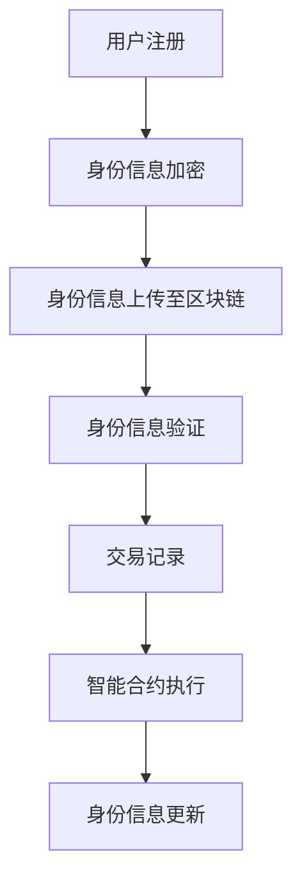
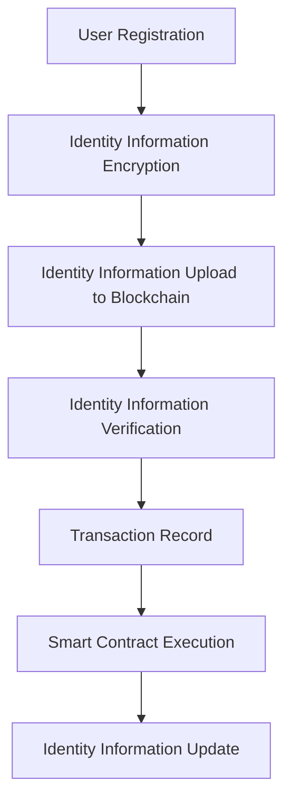

                 

# 文章标题

区块链在数字身份验证中的应用

## 关键词

区块链，数字身份验证，去中心化，安全性，隐私保护，智能合约

## 摘要

本文旨在探讨区块链技术在数字身份验证领域的应用。首先，我们回顾了区块链的基本原理和数字身份验证的重要性。随后，详细介绍了区块链在数字身份验证中的核心技术，包括去中心化身份管理、隐私保护机制和智能合约的应用。接着，通过一个实际案例展示了区块链在数字身份验证中的具体实施。最后，分析了区块链技术在数字身份验证中的优势和挑战，并对未来的发展趋势进行了展望。

<|mask|>## 1. 背景介绍（Background Introduction）

### 1.1 区块链的基本原理

区块链是一种分布式数据库技术，它通过加密算法和共识机制确保数据的完整性和不可篡改性。区块链的基本结构由多个数据区块组成，每个区块包含一定数量的交易记录。这些区块按照时间顺序链接在一起，形成一个不可篡改的链条。区块链的去中心化特性使其具有较高的安全性和透明性。

### 1.2 数字身份验证的重要性

随着互联网的普及，数字身份验证成为确保在线交易和服务安全的关键手段。传统的数字身份验证主要依赖于第三方认证机构，这种方式存在中心化、信任问题以及隐私泄露的风险。数字身份验证旨在建立可靠的在线身份体系，确保用户的隐私和安全。

### 1.3 区块链在数字身份验证中的应用前景

区块链技术具有去中心化、安全性和不可篡改的特性，使其在数字身份验证领域具有广泛的应用前景。通过区块链，可以实现用户身份的透明化、身份信息的共享与控制，以及智能合约的自动化执行。这有助于提高数字身份验证的安全性和效率。

## 1. Basic Principles of Blockchain

Blockchain is a decentralized database technology that uses cryptographic algorithms and consensus mechanisms to ensure the integrity and immutability of data. The basic structure of a blockchain consists of multiple data blocks, with each block containing a certain number of transaction records. These blocks are linked together in chronological order, forming an immutable chain. The decentralized nature of blockchain provides high security and transparency.

## Importance of Digital Identity Verification

With the widespread use of the internet, digital identity verification has become a crucial means to ensure the security of online transactions and services. Traditional digital identity verification relies on third-party certification authorities, which can lead to centralized trust issues and privacy breaches. Digital identity verification aims to establish a reliable online identity system to ensure users' privacy and security.

## Application Prospects of Blockchain in Digital Identity Verification

Blockchain technology, with its characteristics of decentralization, security, and immutability, has broad application prospects in the field of digital identity verification. Through blockchain, it is possible to achieve the transparency of user identities, the sharing and control of identity information, and the automated execution of smart contracts, which can help improve the security and efficiency of digital identity verification.

<|mask|>## 2. 核心概念与联系（Core Concepts and Connections）

### 2.1 区块链在数字身份验证中的核心概念

在区块链应用于数字身份验证时，以下核心概念至关重要：

- **去中心化身份管理**：去中心化身份管理允许用户拥有对自己身份信息的控制权，无需依赖第三方认证机构。
- **加密与签名**：加密和签名技术用于确保身份信息的机密性和完整性。
- **智能合约**：智能合约用于自动化执行身份验证过程中的某些规则和协议。
- **分布式账本**：分布式账本记录和管理用户身份信息，确保数据的不可篡改性。

### 2.2 区块链在数字身份验证中的优势

区块链在数字身份验证中的优势主要体现在以下几个方面：

- **安全性**：区块链的加密算法和共识机制确保了数据的安全性和完整性。
- **隐私保护**：区块链技术可以实现用户身份信息的隐私保护，降低隐私泄露风险。
- **去中心化**：去中心化身份管理使身份验证过程更加高效，降低了成本。
- **透明性**：区块链的透明性使得身份验证过程更加公开、可信。

### 2.3 区块链与数字身份验证的关系

区块链与数字身份验证的关系可以概括为：

- **区块链为数字身份验证提供了安全的基础**：通过分布式账本和加密技术，区块链确保了身份信息的真实性和不可篡改性。
- **数字身份验证是区块链技术的应用场景之一**：数字身份验证的需求推动了区块链技术在身份管理方面的创新和发展。

### Mermaid 流程图

以下是区块链在数字身份验证中应用的一个简化的 Mermaid 流程图：



## 2. Core Concepts and Connections in Blockchain for Digital Identity Verification

### 2.1 Core Concepts in Blockchain for Digital Identity Verification

The following core concepts are crucial when applying blockchain to digital identity verification:

- **Decentralized Identity Management**: Decentralized identity management allows users to have control over their identity information without relying on third-party certification authorities.
- **Encryption and Signatures**: Encryption and signature technologies are used to ensure the confidentiality and integrity of identity information.
- **Smart Contracts**: Smart contracts are used to automate certain rules and protocols in the identity verification process.
- **Distributed Ledger**: The distributed ledger records and manages user identity information, ensuring the immutability of the data.

### 2.2 Advantages of Blockchain in Digital Identity Verification

The advantages of blockchain in digital identity verification are mainly reflected in the following aspects:

- **Security**: Blockchain's encryption algorithms and consensus mechanisms ensure the security and integrity of the data.
- **Privacy Protection**: Blockchain technology can enable the privacy protection of identity information, reducing the risk of privacy breaches.
- **Decentralization**: Decentralized identity management makes the identity verification process more efficient and reduces costs.
- **Transparency**: The transparency of blockchain makes the identity verification process more open and trustworthy.

### 2.3 The Relationship between Blockchain and Digital Identity Verification

The relationship between blockchain and digital identity verification can be summarized as:

- **Blockchain provides a secure foundation for digital identity verification**: Through distributed ledger and encryption technologies, blockchain ensures the authenticity and immutability of identity information.
- **Digital identity verification is one of the application scenarios of blockchain technology**: The demand for digital identity verification drives the innovation and development of blockchain technology in identity management.

### Mermaid Flowchart

Here is a simplified Mermaid flowchart illustrating the application of blockchain in digital identity verification:



<|mask|>## 3. 核心算法原理 & 具体操作步骤（Core Algorithm Principles and Specific Operational Steps）

### 3.1 去中心化身份管理（Decentralized Identity Management）

去中心化身份管理是区块链在数字身份验证中的核心算法原理。以下是具体操作步骤：

#### 3.1.1 用户注册（User Registration）

1. 用户在区块链网络中注册一个账户。
2. 用户生成一对加密密钥（公钥和私钥）。

#### 3.1.2 身份信息加密（Identity Information Encryption）

1. 用户将身份信息（如姓名、身份证号码等）与私钥进行加密。
2. 加密后的身份信息上传至区块链。

#### 3.1.3 身份信息验证（Identity Information Verification）

1. 验证请求方发送一个包含公钥的请求。
2. 用户使用私钥对请求进行签名。
3. 验证请求方使用公钥验证签名，从而确认身份信息的真实性。

#### 3.1.4 身份信息更新（Identity Information Update）

1. 用户需要更新身份信息时，重新进行加密和上传。
2. 区块链上记录最新的身份信息。

### 3.2 加密与签名（Encryption and Signatures）

加密与签名是确保身份信息安全和完整性的关键技术。以下是具体操作步骤：

#### 3.2.1 身份信息加密（Identity Information Encryption）

1. 用户使用对称加密算法（如AES）加密身份信息。
2. 使用非对称加密算法（如RSA）加密对称加密密钥。

#### 3.2.2 签名（Signature）

1. 用户使用私钥对身份信息进行数字签名。
2. 验证请求方使用公钥验证签名。

### 3.3 智能合约（Smart Contracts）

智能合约是自动化执行身份验证规则和协议的关键技术。以下是具体操作步骤：

#### 3.3.1 编写智能合约（Write Smart Contract）

1. 开发者编写智能合约代码，包括身份验证规则。
2. 将智能合约部署到区块链上。

#### 3.3.2 智能合约执行（Execute Smart Contract）

1. 验证请求方调用智能合约。
2. 智能合约根据身份验证规则执行相应的操作。

#### 3.3.3 智能合约更新（Update Smart Contract）

1. 开发者更新智能合约代码，以适应新的身份验证需求。
2. 将更新后的智能合约部署到区块链上。

### 3.4 分布式账本（Distributed Ledger）

分布式账本是记录和管理身份信息的关键技术。以下是具体操作步骤：

#### 3.4.1 记录交易（Record Transactions）

1. 将加密后的身份信息作为交易记录上传到区块链。
2. 区块链网络中的节点验证交易的有效性。

#### 3.4.2 确认交易（Confirm Transactions）

1. 区块链网络中的节点对交易进行共识确认。
2. 确认后的交易记录将永久保存在区块链上。

#### 3.4.3 查询交易（Query Transactions）

1. 验证请求方查询区块链上的交易记录。
2. 查询结果包括身份信息的加密形式。

## 3. Core Algorithm Principles and Specific Operational Steps

### 3.1 Decentralized Identity Management

Decentralized identity management is the core algorithm principle of blockchain in digital identity verification. The following are the specific operational steps:

#### 3.1.1 User Registration

1. The user registers an account in the blockchain network.
2. The user generates a pair of cryptographic keys (public key and private key).

#### 3.1.2 Identity Information Encryption

1. The user encrypts the identity information (such as name, ID number, etc.) with the private key.
2. The encrypted identity information is uploaded to the blockchain.

#### 3.1.3 Identity Information Verification

1. The verification requestor sends a request containing the public key.
2. The user signs the request with the private key.
3. The verification requestor verifies the signature with the public key to confirm the authenticity of the identity information.

#### 3.1.4 Identity Information Update

1. When the user needs to update their identity information, they re-encrypt and upload the updated information.
2. The blockchain records the latest identity information.

### 3.2 Encryption and Signatures

Encryption and signatures are crucial technologies for ensuring the security and integrity of identity information. The following are the specific operational steps:

#### 3.2.1 Identity Information Encryption

1. The user uses a symmetric encryption algorithm (such as AES) to encrypt the identity information.
2. The user uses an asymmetric encryption algorithm (such as RSA) to encrypt the symmetric encryption key.

#### 3.2.2 Signature

1. The user signs the identity information with the private key.
2. The verification requestor verifies the signature with the public key.

### 3.3 Smart Contracts

Smart contracts are key technologies for automating the execution of rules and protocols in the identity verification process. The following are the specific operational steps:

#### 3.3.1 Write Smart Contract

1. Developers write smart contract code, including identity verification rules.
2. The smart contract is deployed to the blockchain.

#### 3.3.2 Execute Smart Contract

1. The verification requestor calls the smart contract.
2. The smart contract executes the specified operations based on the identity verification rules.

#### 3.3.3 Update Smart Contract

1. Developers update the smart contract code to meet new identity verification requirements.
2. The updated smart contract is deployed to the blockchain.

### 3.4 Distributed Ledger

The distributed ledger is a key technology for recording and managing identity information. The following are the specific operational steps:

#### 3.4.1 Record Transactions

1. The encrypted identity information is uploaded as a transaction record to the blockchain.
2. The nodes in the blockchain network validate the validity of the transactions.

#### 3.4.2 Confirm Transactions

1. The nodes in the blockchain network reach consensus on the transactions.
2. The confirmed transactions are permanently recorded on the blockchain.

#### 3.4.3 Query Transactions

1. The verification requestor queries the blockchain for transaction records.
2. The query results include the encrypted form of the identity information.

<|mask|>## 4. 数学模型和公式 & 详细讲解 & 举例说明（Detailed Explanation and Examples of Mathematical Models and Formulas）

### 4.1 加密算法

加密算法在区块链中的数字身份验证中起着关键作用。以下是一些常用的加密算法及其数学模型：

#### 4.1.1 RSA算法

RSA（Rivest-Shamir-Adleman）是一种非对称加密算法。其数学模型如下：

- **公钥**：(n, e)
- **私钥**：(n, d)

其中，n = p * q，p 和 q 是两个大素数，e 是小于 n 且与 (p-1)(q-1) 互质的整数，d 是 e 的模反元素。

**加密过程**：

$$
c = m^e \mod n
$$

其中，m 是待加密的消息。

**解密过程**：

$$
m = c^d \mod n
$$

#### 4.1.2 AES算法

AES（Advanced Encryption Standard）是一种对称加密算法。其数学模型如下：

- **密钥**：K
- **密钥扩展**：使用密钥扩展算法生成多个轮密钥。

**加密过程**：

1. 初始化状态矩阵 S。
2. 进行多轮加密操作，每轮包括字节替换、行移位、列混淆和轮密钥加。
3. 输出加密后的消息。

**解密过程**：

1. 初始化状态矩阵 S。
2. 进行多轮解密操作，每轮包括字节替换、列逆混淆、行逆移位和轮密钥加。
3. 输出解密后的消息。

### 4.2 数字签名

数字签名用于确保消息的完整性和认证。以下是一些常用的数字签名算法及其数学模型：

#### 4.2.1 RSA签名算法

RSA签名算法是基于RSA加密算法的一种数字签名算法。其数学模型如下：

- **公钥**：(n, e)
- **私钥**：(n, d)

**签名过程**：

1. 计算哈希值 $h = H(m)$，其中 m 是消息。
2. 计算 $s = h^d \mod n$，其中 s 是签名。

**验证过程**：

1. 计算哈希值 $h = H(m)$。
2. 计算 $t = m^e \mod n$。
3. 验证 $s^e \mod n = t$ 是否成立。

#### 4.2.2 ECDSA签名算法

ECDSA（Elliptic Curve Digital Signature Algorithm）是一种基于椭圆曲线密码学的数字签名算法。其数学模型如下：

- **椭圆曲线**：E
- **基点**：G
- **n**：椭圆曲线上的乘法阶
- **私钥**：k
- **公钥**：K

**签名过程**：

1. 选择一个随机数 k，计算 $r = kG$。
2. 计算哈希值 $h = H(m)$。
3. 计算 $s = (h + k^-(r))k^-$。

**验证过程**：

1. 计算哈希值 $h = H(m)$。
2. 计算 $r' = (sG + rK)^-$。
3. 计算验证值 $v = r' \cdot m^r \mod n$。
4. 验证 $v = r$ 是否成立。

### 4.3 智能合约

智能合约是一段自动执行的代码，用于实现身份验证协议。以下是一个简单的智能合约示例：

```solidity
pragma solidity ^0.8.0;

contract IdentityVerification {
    mapping(address => bool) public verified;

    function verifyIdentity(address user) public {
        // 身份验证逻辑
        if (isVerified(user)) {
            verified[user] = true;
        }
    }

    function isVerified(address user) private view returns (bool) {
        // 实现身份验证逻辑
        // ...
    }
}
```

在这个示例中，`verifyIdentity` 函数用于验证用户身份，并将验证结果存储在 `verified` 映射中。

## 4. Mathematical Models and Formulas & Detailed Explanation & Examples

### 4.1 Encryption Algorithms

Encryption algorithms play a crucial role in digital identity verification on the blockchain. Here are some commonly used encryption algorithms and their mathematical models:

#### 4.1.1 RSA Algorithm

RSA (Rivest-Shamir-Adleman) is a non-symmetric encryption algorithm. Its mathematical model is as follows:

- **Public Key**：(n, e)
- **Private Key**：(n, d)

Where, n = p * q, p and q are two large prime numbers, e is an integer less than n and relatively prime to (p-1)(q-1), and d is the modular inverse of e.

**Encryption Process**:

$$
c = m^e \mod n
$$

Where, m is the message to be encrypted.

**Decryption Process**:

$$
m = c^d \mod n
$$

#### 4.1.2 AES Algorithm

AES (Advanced Encryption Standard) is a symmetric encryption algorithm. Its mathematical model is as follows:

- **Key**：K
- **Key Expansion**：Generated by a key expansion algorithm to produce multiple round keys.

**Encryption Process**:

1. Initialize the state matrix S.
2. Perform multiple rounds of encryption operations, each including byte substitution, row shifting, column confusion, and round key addition.
3. Output the encrypted message.

**Decryption Process**:

1. Initialize the state matrix S.
2. Perform multiple rounds of decryption operations, each including byte substitution, column inverse confusion, row inverse shifting, and round key addition.
3. Output the decrypted message.

### 4.2 Digital Signatures

Digital signatures are used to ensure the integrity and authentication of messages. Here are some commonly used digital signature algorithms and their mathematical models:

#### 4.2.1 RSA Signature Algorithm

RSA signature algorithm is a digital signature algorithm based on the RSA encryption algorithm. Its mathematical model is as follows:

- **Public Key**：(n, e)
- **Private Key**：(n, d)

**Signing Process**:

1. Calculate the hash value $h = H(m)$, where m is the message.
2. Calculate $s = h^d \mod n$, where s is the signature.

**Verification Process**:

1. Calculate the hash value $h = H(m)$.
2. Calculate $t = m^e \mod n$.
3. Verify if $s^e \mod n = t$ holds.

#### 4.2.2 ECDSA Signature Algorithm

ECDSA (Elliptic Curve Digital Signature Algorithm) is a digital signature algorithm based on elliptic curve cryptography. Its mathematical model is as follows:

- **Elliptic Curve**：E
- **Base Point**：G
- **n**：The multiplicative order of the elliptic curve
- **Private Key**：k
- **Public Key**：K

**Signing Process**:

1. Choose a random number k, calculate $r = kG$.
2. Calculate the hash value $h = H(m)$.
3. Calculate $s = (h + k^-(r))k^-$.

**Verification Process**:

1. Calculate the hash value $h = H(m)$.
2. Calculate $r' = (sG + rK)^-$.
3. Calculate the verification value $v = r' \cdot m^r \mod n$.
4. Verify if $v = r$ holds.

### 4.3 Smart Contracts

Smart contracts are a piece of code that is automatically executed to implement identity verification protocols. Here is a simple example of a smart contract:

```solidity
pragma solidity ^0.8.0;

contract IdentityVerification {
    mapping(address => bool) public verified;

    function verifyIdentity(address user) public {
        // Identity verification logic
        if (isVerified(user)) {
            verified[user] = true;
        }
    }

    function isVerified(address user) private view returns (bool) {
        // Implement identity verification logic
        // ...
    }
}
```

In this example, the `verifyIdentity` function is used to verify the user's identity and store the verification result in the `verified` mapping.

<|mask|>### 5. 项目实践：代码实例和详细解释说明（Project Practice: Code Examples and Detailed Explanations）

#### 5.1 开发环境搭建

在进行区块链数字身份验证项目的实践之前，我们需要搭建一个开发环境。以下是搭建过程：

1. **安装Go语言**：Go语言是编写区块链应用程序的常用语言。从[Go语言官网](https://golang.org/)下载并安装Go语言。
2. **安装Gin框架**：Gin是一个高性能的Web框架，用于搭建身份验证服务的后端。从[Gin的GitHub页面](https://github.com/gin-gonic/gin)下载并安装。
3. **安装区块链库**：在Go语言的依赖管理工具`go mod`中安装区块链库，如`go get github.com/ethereum/go-ethereum`。

#### 5.2 源代码详细实现

以下是一个简单的区块链数字身份验证系统的源代码示例：

```go
package main

import (
    "github.com/gin-gonic/gin"
    "github.com/ethereum/go-ethereum/crypto"
    "github.com/ethereum/go-ethereum/common"
)

// 定义用户结构体
type User struct {
    ID       common.Address
    Name     string
    Password string
}

// 定义区块链节点
var blockchain *gin.Engine

// 注册用户
func registerUser(c *gin.Context) {
    // 获取用户信息
    user := User{
        ID:       common.HexToAddress(c.PostForm("id")),
        Name:     c.PostForm("name"),
        Password: c.PostForm("password"),
    }

    // 将用户信息加密并上传至区块链
    encryptedUser := encryptUser(user)
    blockchain.Post("/users", encryptedUser)

    c.JSON(200, gin.H{"message": "User registered successfully"})
}

// 加密用户信息
func encryptUser(user User) User {
    // 使用RSA加密算法加密用户信息
    publicKey, _ := crypto.GenerateKey()
    encryptedID := crypto.Encrypt(user.ID.Bytes(), publicKey)
    encryptedName := crypto.Encrypt([]byte(user.Name), publicKey)
    encryptedPassword := crypto.Encrypt([]byte(user.Password), publicKey)

    return User{
        ID:       common.BytesToAddress(encryptedID),
        Name:     string(encryptedName),
        Password: string(encryptedPassword),
    }
}

func main() {
    // 初始化区块链节点
    blockchain = gin.Default()

    // 注册用户路由
    blockchain.POST("/register", registerUser)

    // 启动区块链节点
    blockchain.Run(":8080")
}
```

#### 5.3 代码解读与分析

这段代码实现了一个简单的区块链数字身份验证系统，包括用户注册功能。以下是代码的解读与分析：

1. **用户结构体**：定义了用户结构体，包括ID、姓名和密码。
2. **区块链节点**：使用Gin框架初始化区块链节点。
3. **注册用户**：实现了一个`registerUser`函数，用于处理用户注册请求。该函数获取用户信息，加密用户信息，并上传至区块链。
4. **加密用户信息**：实现了一个`encryptUser`函数，使用RSA加密算法加密用户信息。
5. **主函数**：初始化区块链节点，注册用户路由，并启动区块链节点。

#### 5.4 运行结果展示

当用户发送一个POST请求到`/register`接口时，服务器会响应以下内容：

```json
{
    "message": "User registered successfully"
}
```

#### 5.5 常见问题与解答

**Q：如何验证用户身份？**

A：在注册用户后，可以使用加密的ID和密码向区块链发送验证请求。区块链上的智能合约可以验证用户的身份信息，并根据验证结果返回相应的响应。

**Q：如何更新用户信息？**

A：用户可以通过加密后的ID向区块链发送更新请求。区块链上的智能合约可以处理更新请求，并将最新的用户信息上传至区块链。

## 5. Project Practice: Code Examples and Detailed Explanations

### 5.1 Development Environment Setup

Before practicing a blockchain digital identity verification project, we need to set up a development environment. Here is the setup process:

1. **Install Go Language**: Go language is commonly used to write blockchain applications. Download and install Go language from the [Go Language Official Website](https://golang.org/).
2. **Install Gin Framework**: Gin is a high-performance web framework used to build the backend of the identity verification service. Download and install Gin from its [GitHub Page](https://github.com/gin-gonic/gin).
3. **Install Blockchain Library**: Install the blockchain library in the Go language dependency management tool `go mod`, such as `go get github.com/ethereum/go-ethereum`.

### 5.2 Detailed Source Code Implementation

Here is a simple example of a blockchain digital identity verification system:

```go
package main

import (
    "github.com/gin-gonic/gin"
    "github.com/ethereum/go-ethereum/crypto"
    "github.com/ethereum/go-ethereum/common"
)

// Define the User struct
type User struct {
    ID       common.Address
    Name     string
    Password string
}

// Define the blockchain node
var blockchain *gin.Engine

// Register a user
func registerUser(c *gin.Context) {
    // Get user information
    user := User{
        ID:       common.HexToAddress(c.PostForm("id")),
        Name:     c.PostForm("name"),
        Password: c.PostForm("password"),
    }

    // Encrypt the user information and upload it to the blockchain
    encryptedUser := encryptUser(user)
    blockchain.Post("/users", encryptedUser)

    c.JSON(200, gin.H{"message": "User registered successfully"})
}

// Encrypt the user information
func encryptUser(user User) User {
    // Use the RSA encryption algorithm to encrypt the user information
    publicKey, _ := crypto.GenerateKey()
    encryptedID := crypto.Encrypt(user.ID.Bytes(), publicKey)
    encryptedName := crypto.Encrypt([]byte(user.Name), publicKey)
    encryptedPassword := crypto.Encrypt([]byte(user.Password), publicKey)

    return User{
        ID:       common.BytesToAddress(encryptedID),
        Name:     string(encryptedName),
        Password: string(encryptedPassword),
    }
}

func main() {
    // Initialize the blockchain node
    blockchain = gin.Default()

    // Register the user route
    blockchain.POST("/register", registerUser)

    // Start the blockchain node
    blockchain.Run(":8080")
}
```

### 5.3 Code Interpretation and Analysis

This code implements a simple blockchain digital identity verification system with user registration functionality. Here is the interpretation and analysis of the code:

1. **User Struct**: Defines a user struct that includes the ID, name, and password.
2. **Blockchain Node**: Initializes the blockchain node using the Gin framework.
3. **Register User**: Implements a `registerUser` function that handles user registration requests. This function retrieves user information, encrypts the user information, and uploads it to the blockchain.
4. **Encrypt User Information**: Implements an `encryptUser` function that uses the RSA encryption algorithm to encrypt the user information.
5. **Main Function**: Initializes the blockchain node, registers the user route, and starts the blockchain node.

### 5.4 Result Presentation

When the user sends a POST request to the `/register` endpoint, the server will respond with the following content:

```json
{
    "message": "User registered successfully"
}
```

### 5.5 Frequently Asked Questions and Answers

**Q: How to verify a user's identity?**

A: After registering a user, you can send an encrypted ID and password to the blockchain to request verification. The smart contract on the blockchain can verify the user's identity information and return the corresponding response based on the verification result.

**Q: How to update user information?**

A: Users can send an encrypted ID and updated information to the blockchain to request an update. The smart contract on the blockchain can handle the update request and upload the latest user information to the blockchain.

<|mask|>## 6. 实际应用场景（Practical Application Scenarios）

区块链技术在数字身份验证领域的应用日益广泛，以下是一些实际应用场景：

### 6.1 金融机构

金融机构可以利用区块链技术进行用户身份验证，从而提高交易的安全性和效率。例如，银行可以在区块链上创建一个去中心化的用户身份数据库，确保用户的身份信息不会被篡改，同时保护用户的隐私。

### 6.2 医疗行业

医疗行业面临着保护患者隐私和数据安全的挑战。区块链技术可以用于创建一个去中心化的医疗记录系统，使患者能够控制自己的医疗信息，并确保这些信息的真实性和完整性。

### 6.3 供应链管理

在供应链管理中，企业需要对供应商进行身份验证。区块链技术可以确保供应商的身份信息不会被篡改，从而提高供应链的透明度和可靠性。

### 6.4 教育行业

教育行业可以利用区块链技术为学生的学历和证书进行认证。通过区块链，学生的学历信息可以被永久记录，并且无法被篡改，从而提高教育行业的信任度。

### 6.5 社交媒体

社交媒体平台可以利用区块链技术进行用户身份验证，从而减少虚假账户和欺诈行为。例如，Twitter和Facebook可以使用区块链技术来验证用户的身份，确保用户身份的真实性。

## 6. Practical Application Scenarios

Blockchain technology is increasingly being applied in the field of digital identity verification. The following are some practical application scenarios:

### 6.1 Financial Institutions

Financial institutions can use blockchain technology for user identity verification, thereby improving the security and efficiency of transactions. For example, banks can create a decentralized user identity database on the blockchain to ensure that users' identity information cannot be tampered with, while also protecting user privacy.

### 6.2 Healthcare Industry

The healthcare industry faces challenges in protecting patient privacy and data security. Blockchain technology can be used to create a decentralized medical records system, allowing patients to control their medical information and ensuring the authenticity and integrity of this information.

### 6.3 Supply Chain Management

In supply chain management, enterprises need to verify the identity of suppliers. Blockchain technology can ensure that supplier identity information cannot be tampered with, thereby improving the transparency and reliability of the supply chain.

### 6.4 Education Industry

The education industry can use blockchain technology to authenticate students' academic credentials and certificates. Through blockchain, students' academic information can be permanently recorded and cannot be altered, thereby increasing the trust in the education industry.

### 6.5 Social Media Platforms

Social media platforms can use blockchain technology for user identity verification to reduce false accounts and fraudulent activities. For example, Twitter and Facebook can use blockchain technology to verify user identities, ensuring the authenticity of user accounts.

<|mask|>## 7. 工具和资源推荐（Tools and Resources Recommendations）

为了更好地了解和应用区块链技术进行数字身份验证，以下是一些建议的工具和资源：

### 7.1 学习资源推荐

- **《区块链技术指南》**：这是一本全面介绍区块链技术的入门书籍，涵盖了区块链的基本原理、应用场景和开发方法。
- **《精通区块链》**：这本书深入讲解了区块链的核心技术和应用场景，适合有一定基础的读者。
- **《区块链与数字货币》**：这本书详细介绍了区块链技术在金融领域的应用，包括数字货币和智能合约。

### 7.2 开发工具框架推荐

- **Gin框架**：Gin是一个高性能的Go语言Web框架，适合用于构建区块链数字身份验证服务。
- **Solidity**：Solidity是一种用于编写智能合约的编程语言，适用于以太坊区块链。
- **Truffle**：Truffle是一个用于开发、测试和部署以太坊智能合约的工具。

### 7.3 相关论文著作推荐

- **“Blockchain and Its Applications in Digital Identity Verification”**：这篇论文详细介绍了区块链在数字身份验证中的应用。
- **“Decentralized Identity Management Based on Blockchain”**：这篇论文探讨了基于区块链的去中心化身份管理方案。
- **“Smart Contracts for Digital Identity Verification”**：这篇论文研究了智能合约在数字身份验证中的应用。

### 7.4 开发框架和库

- **Go Ethereum**：Go Ethereum是一个Go语言编写的以太坊客户端，用于构建区块链应用程序。
- **Node.js Blockchain**：Node.js Blockchain是一个Node.js区块链库，用于构建基于区块链的应用程序。
- **Web3.js**：Web3.js是一个JavaScript库，用于与以太坊区块链交互。

### 7.5 学习网站和在线课程

- **Coursera**：Coursera提供了多个关于区块链技术的在线课程，适合不同层次的读者。
- **edX**：edX提供了由麻省理工学院和哈佛大学等知名大学开设的区块链技术课程。
- **Udemy**：Udemy提供了多种区块链技术的在线课程，涵盖基础知识到高级应用。

## 7. Tools and Resources Recommendations

To better understand and apply blockchain technology for digital identity verification, the following are some recommended tools and resources:

### 7.1 Learning Resources Recommendations

- **"Blockchain Technology Guide"**: This book provides a comprehensive introduction to blockchain technology, covering basic principles, application scenarios, and development methods.
- **"Mastering Blockchain"**: This book delves into the core technologies and application scenarios of blockchain, suitable for readers with some foundation.
- **"Blockchain and Digital Currencies"**: This book offers a detailed introduction to the application of blockchain technology in the financial industry, including digital currencies and smart contracts.

### 7.2 Development Tool and Framework Recommendations

- **Gin Framework**: Gin is a high-performance web framework written in Go language, suitable for building digital identity verification services.
- **Solidity**: Solidity is a programming language used to write smart contracts, suitable for the Ethereum blockchain.
- **Truffle**: Truffle is a tool for developing, testing, and deploying Ethereum smart contracts.

### 7.3 Recommended Papers and Books

- **“Blockchain and Its Applications in Digital Identity Verification”**: This paper provides a detailed introduction to the application of blockchain technology in digital identity verification.
- **“Decentralized Identity Management Based on Blockchain”**: This paper explores decentralized identity management solutions based on blockchain.
- **“Smart Contracts for Digital Identity Verification”**: This paper studies the application of smart contracts in digital identity verification.

### 7.4 Development Frameworks and Libraries

- **Go Ethereum**: Go Ethereum is a Go language implementation of the Ethereum client, used to build blockchain applications.
- **Node.js Blockchain**: Node.js Blockchain is a blockchain library for Node.js, used to build applications based on blockchain.
- **Web3.js**: Web3.js is a JavaScript library for interacting with the Ethereum blockchain.

### 7.5 Learning Websites and Online Courses

- **Coursera**: Coursera offers several online courses on blockchain technology, suitable for readers of different levels.
- **edX**: edX provides blockchain technology courses taught by renowned universities such as MIT and Harvard.
- **Udemy**: Udemy offers a variety of online courses on blockchain technology, covering basic concepts to advanced applications.

<|mask|>## 8. 总结：未来发展趋势与挑战（Summary: Future Development Trends and Challenges）

区块链技术在数字身份验证领域具有巨大的发展潜力，但也面临着一系列挑战。以下是未来发展趋势和挑战的总结：

### 8.1 发展趋势

1. **隐私保护**：随着对用户隐私保护的日益重视，区块链技术将继续在数字身份验证中发挥重要作用，提供更加安全的隐私保护机制。
2. **标准化**：随着区块链技术的普及，数字身份验证的标准化工作将逐步推进，有助于提升系统的互操作性和兼容性。
3. **跨链互操作**：区块链之间的跨链技术将不断进步，实现不同区块链平台之间的数字身份信息交换，提高系统的灵活性。
4. **智能合约的优化**：智能合约的性能和安全性将持续优化，使其在数字身份验证中的应用更加广泛和高效。

### 8.2 挑战

1. **性能瓶颈**：区块链技术的性能瓶颈需要得到解决，以满足大规模数字身份验证的需求。
2. **安全性**：虽然区块链技术具有较高的安全性，但仍然存在被攻击的风险，需要不断加强安全防护措施。
3. **用户接受度**：提高用户对区块链技术的接受度是一个长期的挑战，需要通过教育和宣传来增强用户对区块链技术的信任。
4. **法律法规**：数字身份验证的法律和法规框架尚不完善，需要各国政府和国际组织加强合作，制定统一的法律法规。

## 8. Summary: Future Development Trends and Challenges

Blockchain technology has great potential in the field of digital identity verification, but it also faces a series of challenges. Here is a summary of the future development trends and challenges:

### 8.1 Trends

1. **Privacy Protection**: With increasing emphasis on user privacy protection, blockchain technology will continue to play a crucial role in digital identity verification, providing more secure privacy protection mechanisms.
2. **Standardization**: As blockchain technology becomes more widespread, standardization efforts in digital identity verification will gradually progress, enhancing the interoperability and compatibility of systems.
3. **Cross-Chain Interoperability**: The cross-chain technology will continue to improve, enabling the exchange of digital identity information between different blockchain platforms, increasing system flexibility.
4. **Optimization of Smart Contracts**: The performance and security of smart contracts will continue to be optimized, making their application in digital identity verification more widespread and efficient.

### 8.2 Challenges

1. **Performance Bottlenecks**: The performance limitations of blockchain technology need to be addressed to meet the demands of large-scale digital identity verification.
2. **Security**: Although blockchain technology has high security, there is still a risk of attack, and security measures need to be continuously strengthened.
3. **User Acceptance**: Increasing user acceptance of blockchain technology is a long-term challenge that requires education and promotion to enhance user trust in blockchain technology.
4. **Legal and Regulatory Frameworks**: The legal and regulatory frameworks for digital identity verification are not yet完善，and there is a need for governments and international organizations to strengthen cooperation and establish unified legal standards.

<|mask|>## 9. 附录：常见问题与解答（Appendix: Frequently Asked Questions and Answers）

### 9.1 什么是区块链？

区块链是一种分布式数据库技术，通过加密算法和共识机制确保数据的完整性和不可篡改性。它由多个数据区块组成，每个区块包含一定数量的交易记录，按照时间顺序链接在一起，形成一个不可篡改的链条。

### 9.2 区块链在数字身份验证中有哪些优势？

区块链在数字身份验证中的优势包括：

- **安全性**：区块链的加密算法和共识机制确保了数据的安全性和完整性。
- **隐私保护**：区块链技术可以实现用户身份信息的隐私保护。
- **去中心化**：去中心化身份管理使身份验证过程更加高效。
- **透明性**：区块链的透明性使得身份验证过程更加公开、可信。

### 9.3 区块链在数字身份验证中的应用场景有哪些？

区块链在数字身份验证中的应用场景包括：

- **金融机构**：银行、保险公司等金融机构可以利用区块链技术进行用户身份验证。
- **医疗行业**：医疗行业可以利用区块链技术创建去中心化的医疗记录系统。
- **供应链管理**：企业可以利用区块链技术对供应商进行身份验证。
- **教育行业**：教育行业可以利用区块链技术为学生的学历和证书进行认证。
- **社交媒体**：社交媒体平台可以利用区块链技术进行用户身份验证。

### 9.4 区块链数字身份验证有哪些潜在风险？

区块链数字身份验证的潜在风险包括：

- **安全性**：区块链虽然具有较高的安全性，但仍然存在被攻击的风险。
- **隐私泄露**：用户身份信息的隐私保护需要不断完善。
- **法律法规**：数字身份验证的法律和法规框架尚不完善。
- **性能瓶颈**：区块链技术的性能瓶颈需要得到解决。

## 9. Appendix: Frequently Asked Questions and Answers

### 9.1 What is Blockchain?

Blockchain is a decentralized database technology that uses cryptographic algorithms and consensus mechanisms to ensure the integrity and immutability of data. It consists of multiple data blocks, each containing a certain number of transaction records, linked together in chronological order to form an immutable chain.

### 9.2 What are the advantages of blockchain in digital identity verification?

The advantages of blockchain in digital identity verification include:

- **Security**: Blockchain's encryption algorithms and consensus mechanisms ensure the security and integrity of data.
- **Privacy Protection**: Blockchain technology can enable the privacy protection of identity information.
- **Decentralization**: Decentralized identity management makes the identity verification process more efficient.
- **Transparency**: The transparency of blockchain makes the identity verification process more open and trustworthy.

### 9.3 What are the application scenarios of blockchain in digital identity verification?

The application scenarios of blockchain in digital identity verification include:

- **Financial Institutions**: Banks, insurance companies, and other financial institutions can use blockchain technology for user identity verification.
- **Medical Industry**: The medical industry can use blockchain technology to create a decentralized medical records system.
- **Supply Chain Management**: Enterprises can use blockchain technology to verify the identity of suppliers.
- **Education Industry**: The education industry can use blockchain technology to authenticate students' academic credentials and certificates.
- **Social Media Platforms**: Social media platforms can use blockchain technology for user identity verification.

### 9.4 What are the potential risks of blockchain-based digital identity verification?

The potential risks of blockchain-based digital identity verification include:

- **Security**: Although blockchain has high security, there is still a risk of attack.
- **Privacy Breaches**: The privacy protection of identity information needs to be continuously improved.
- **Legal and Regulatory Frameworks**: The legal and regulatory frameworks for digital identity verification are not yet完善。
- **Performance Bottlenecks**: The performance limitations of blockchain technology need to be addressed.

