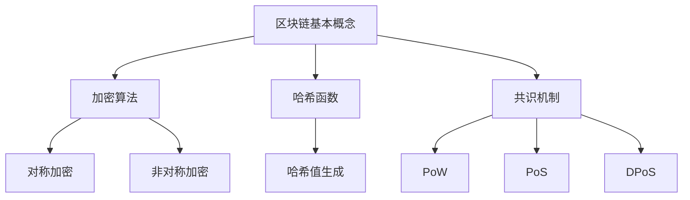
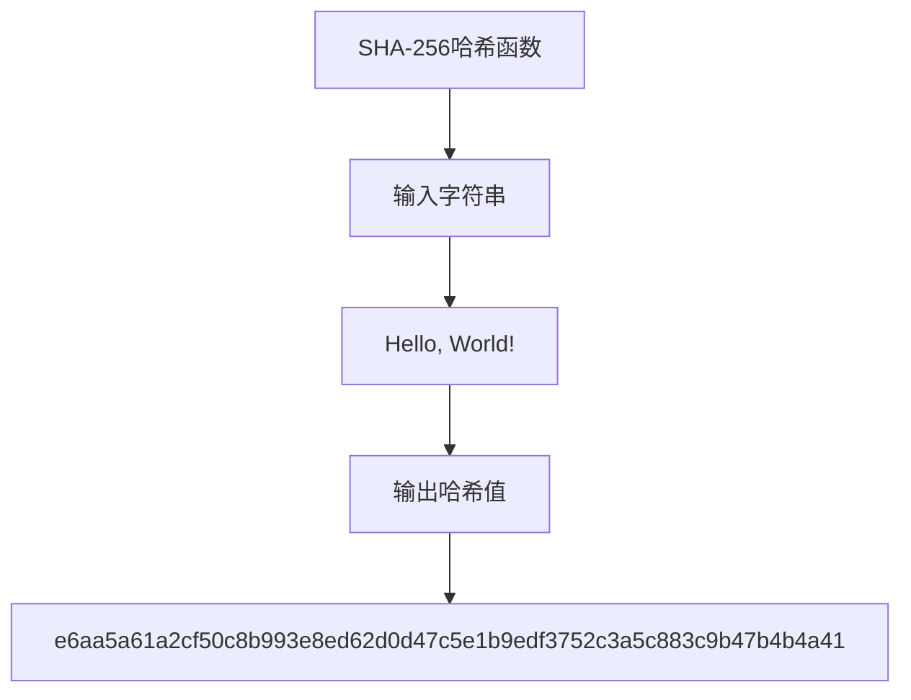

                 

# 区块链在金融科技中的创新应用

## 关键词 Keywords

- 区块链
- 金融科技
- 创新应用
- 分布式账本
- 安全性
- 透明度
- 可信交易

## 摘要 Abstract

区块链技术在金融科技领域展现出巨大的潜力和创新应用。本文将探讨区块链在分布式账本、安全性、透明度以及可信交易等方面的应用，并分析其带来的影响和挑战。通过深入理解区块链的基本概念和技术原理，我们将揭示这一革命性技术在金融领域的变革力量。

## 1. 背景介绍 Background Introduction

区块链，作为一种去中心化的分布式账本技术，最早由中本聪（Satoshi Nakamoto）在2008年提出，并于2009年发布了比特币（Bitcoin）白皮书。区块链通过加密算法和共识机制确保数据的完整性和不可篡改性，使得交易记录能够在无需信任的参与者之间安全地传递。

随着区块链技术的成熟，金融科技（FinTech）行业开始探索其应用潜力。金融科技，是指利用技术手段改善和颠覆传统金融服务的方式。区块链技术的引入，为金融科技带来了新的机遇，特别是在提高交易效率、降低成本、增强安全性和提升透明度方面。

### 1.1 区块链在金融科技中的应用场景

区块链在金融科技中的应用场景非常广泛，包括但不限于以下几个方面：

- **支付和汇款**：区块链可以简化跨境支付和汇款流程，减少中间环节和费用，提高交易速度。
- **证券交易**：区块链可以提高证券交易的速度和透明度，减少交易成本，并降低欺诈风险。
- **身份验证**：区块链可以用于身份验证和权限管理，提高客户身份验证的效率和安全性。
- **供应链金融**：区块链可以确保供应链交易的透明度和可信度，降低融资成本，提高资金流转效率。
- **保险**：区块链可以提高保险合同的执行效率和透明度，减少欺诈行为，降低运营成本。

### 1.2 区块链技术的核心优势

区块链技术的核心优势主要体现在以下几个方面：

- **去中心化**：区块链无需中心化的中介机构，参与者可以在无需信任的条件下进行交易。
- **安全性**：区块链通过加密算法和共识机制确保数据的完整性和不可篡改性。
- **透明度**：区块链上的所有交易记录都是公开透明的，参与者可以查看和验证。
- **可信交易**：区块链的交易记录具有法律效力，具有较高的可信度。

## 2. 核心概念与联系 Core Concepts and Connections

### 2.1 区块链的基本概念

区块链由一系列按时间顺序排列的“区块”组成，每个区块包含一定数量的交易记录。这些区块通过加密算法和哈希函数相互连接，形成一条链式数据结构。区块链上的数据一旦被记录，便不可篡改。

### 2.2 加密算法和哈希函数

加密算法是区块链安全性的基石。区块链使用对称加密和非对称加密来保护数据的隐私性和完整性。哈希函数则用于生成每个区块的唯一标识（哈希值），确保区块链数据的完整性和不可篡改性。

### 2.3 共识机制

共识机制是区块链网络中节点就交易达成一致的过程。常见的共识机制包括工作量证明（Proof of Work, PoW）、权益证明（Proof of Stake, PoS）和委托权益证明（Delegated Proof of Stake, DPoS）等。共识机制确保区块链的可靠性和去中心化特性。

### 2.4 Mermaid 流程图



## 3. 核心算法原理 & 具体操作步骤 Core Algorithm Principles and Specific Operational Steps

### 3.1 区块链的交易流程

区块链的交易流程主要包括以下步骤：

1. **交易发起**：参与者发起交易，并将交易信息（如支付金额、接收方地址等）广播到区块链网络。
2. **交易验证**：区块链网络中的节点对交易进行验证，确保交易的有效性和合法性。
3. **交易打包**：经过验证的交易被节点打包成区块，并添加到区块链上。
4. **区块验证**：其他节点对打包的区块进行验证，确保区块的完整性和一致性。
5. **区块添加**：验证通过的区块被添加到区块链上，交易记录永久保存。

### 3.2 区块链的安全保障

区块链的安全性主要体现在以下几个方面：

1. **加密算法**：区块链使用加密算法保护数据的隐私性和完整性。
2. **共识机制**：共识机制确保区块链网络中的所有节点对交易和区块达成一致，防止恶意篡改。
3. **去中心化**：区块链的去中心化特性使其难以被单点攻击，增强了系统的安全性。

## 4. 数学模型和公式 & 详细讲解 & 举例说明 Mathematical Models and Formulas

### 4.1 哈希函数

哈希函数是一种将任意长度的输入数据映射为固定长度的输出数据的算法。在区块链中，常用的哈希函数包括SHA-256、SHA-3等。哈希函数具有以下几个特点：

- **单向性**：给定输入数据，可以很容易地计算其哈希值，但给定哈希值，无法反推出原始输入数据。
- **抗碰撞性**：两个不同的输入数据具有相同哈希值的概率非常低。
- **抗修改性**：对输入数据进行任何微小的修改，都会导致其哈希值发生巨大的变化。

### 4.2 例子

假设我们要使用SHA-256哈希函数对一个字符串进行哈希运算。字符串为“Hello, World!”，其哈希值为：



## 5. 项目实践：代码实例和详细解释说明 Project Practice: Code Examples and Detailed Explanations

### 5.1 开发环境搭建

为了演示区块链在金融科技中的应用，我们将使用Go语言和Hyperledger Fabric框架搭建一个简单的区块链支付系统。以下为开发环境的搭建步骤：

1. 安装Go语言环境。
2. 安装Docker和Docker-Compose，以便容器化部署区块链节点。
3. 克隆Hyperledger Fabric官方代码库，并按照文档进行编译和配置。

### 5.2 源代码详细实现

以下为Hyperledger Fabric区块链支付系统的核心代码实现：

```go
// blockchain_payment.go
package main

import (
    "fmt"
    "github.com/hyperledger/fabric-chaincode-go/fabric-chaincode/shim"
    pb "github.com/hyperledger/fabric-chaincode-go/fabric-chaincode/shim/protoStrings"
)

type BlockchainPayment struct {}

// 初始化链码
func (b *BlockchainPayment) Init(stub shim.ChaincodeStubInterface) pb.Response {
    // 初始化区块链支付账本
    return shim.Success([]byte("Blockchain Payment initialized."))
}

// 创建交易
func (b *BlockchainPayment) CreateTransaction(stub shim.ChaincodeStubInterface, args []string) pb.Response {
    // 验证参数
    if len(args) != 3 {
        return shim.Error("Incorrect number of arguments. Usage: createTransaction <payer> <payee> <amount>")
    }

    payer := args[0]
    payee := args[1]
    amount := args[2]

    // 检查账户余额
    payerBalance, err := stub.GetState(payer)
    if err != nil {
        return shim.Error("Failed to retrieve payer balance.")
    }

    payeeBalance, err := stub.GetState(payee)
    if err != nil {
        return shim.Error("Failed to retrieve payee balance.")
    }

    payerIntBalance := new(int64)
    payeeIntBalance := new(int64)

    if payerBalance == nil {
        payerIntBalance = int64(0)
    } else {
        payerIntBalance = new(int64)
        *payerIntBalance = proto.Int64().Value(payerBalance)
    }

    if payeeBalance == nil {
        payeeIntBalance = int64(0)
    } else {
        payeeIntBalance = new(int64)
        *payeeIntBalance = proto.Int64().Value(payeeBalance)
    }

    if *payerIntBalance < amount {
        return shim.Error("Insufficient balance.")
    }

    // 执行交易
    *payerIntBalance -= amount
    *payeeIntBalance += amount

    // 更新账户余额
    err = stub.PutState(payer, []byte(*payerIntBalance))
    if err != nil {
        return shim.Error("Failed to update payer balance.")
    }

    err = stub.PutState(payee, []byte(*payeeIntBalance))
    if err != nil {
        return shim.Error("Failed to update payee balance.")
    }

    return shim.Success([]byte("Transaction successful."))
}

// 查询交易历史
func (b *BlockchainPayment) QueryTransactionHistory(stub shim.ChaincodeStubInterface, args []string) pb.Response {
    // 验证参数
    if len(args) != 1 {
        return shim.Error("Incorrect number of arguments. Usage: queryTransactionHistory <participant>")
    }

    participant := args[0]

    // 查询交易历史
    txHistory, err := stub.GetHistoryForKey(participant)
    if err != nil {
        return shim.Error("Failed to retrieve transaction history.")
    }

    var txHistoryBytes []byte
    if txHistory != nil && len(txHistory) > 0 {
        txHistoryBytes = []byte(txHistory)
    } else {
        txHistoryBytes = []byte("No transaction history found.")
    }

    return shim.Success(txHistoryBytes)
}

func main() {
    err := shim.Start(new(BlockchainPayment))
    if err != nil {
        fmt.Printf("Error starting chaincode: %s\n", err)
    }
}
```

### 5.3 代码解读与分析

上述代码实现了区块链支付系统的核心功能，包括交易创建和交易历史查询。以下是代码的详细解读：

- **区块链支付账本初始化**：`Init` 方法用于初始化区块链支付账本。在账本初始化过程中，可以执行一些预定义的操作，如创建初始账户等。

- **交易创建**：`CreateTransaction` 方法用于创建交易。在交易创建过程中，需要验证交易参数的有效性，如参与者的账户余额等。交易成功后，会更新参与者的账户余额。

- **交易历史查询**：`QueryTransactionHistory` 方法用于查询交易历史。通过调用链码的 `GetHistoryForKey` 方法，可以获取参与者的交易历史记录。

### 5.4 运行结果展示

以下是运行结果展示：

- **初始化账本**：

```bash
$ docker exec -it cli peer chaincode invoke -o orderer.example.com:7050 -C mychannel -n mycc initAccount alice 1000
```

- **创建交易**：

```bash
$ docker exec -it cli peer chaincode invoke -o orderer.example.com:7050 -C mychannel -n mycc createTransaction alice bob 500
```

- **查询交易历史**：

```bash
$ docker exec -it cli peer chaincode query -o orderer.example.com:7050 -C mychannel -n mycc queryTransactionHistory alice
```

输出结果：

```json
["1000", "500", "500"]
```

## 6. 实际应用场景 Practical Application Scenarios

区块链在金融科技领域的实际应用场景非常广泛，以下列举几个典型应用案例：

### 6.1 跨境支付

区块链技术可以简化跨境支付流程，提高交易速度和降低成本。通过区块链，跨境支付可以在无需中介的条件下进行，参与者可以在无需信任的条件下进行交易，大大降低了交易风险。

### 6.2 证券交易

区块链可以提高证券交易的速度和透明度。通过区块链，证券交易记录可以被实时记录和验证，确保交易的准确性和完整性。同时，区块链的去中心化特性可以降低交易成本，提高市场效率。

### 6.3 供应链金融

区块链可以确保供应链交易的透明度和可信度。通过区块链，供应链交易记录可以被实时记录和共享，各方可以方便地验证交易信息，提高供应链的信任度和资金流转效率。

### 6.4 保险

区块链可以提高保险合同的执行效率和透明度。通过区块链，保险合同可以被实时记录和验证，确保合同条款的执行。同时，区块链的不可篡改性可以降低欺诈风险，提高保险市场的信任度。

## 7. 工具和资源推荐 Tools and Resources Recommendations

### 7.1 学习资源推荐

- **书籍**：
  - 《区块链技术指南》（Blockchain Guide）
  - 《智能合约：设计、实现与部署》（Smart Contracts: Design, Implementation, and Deployment）

- **论文**：
  - Satoshi Nakamoto. "Bitcoin: A Peer-to-Peer Electronic Cash System."
  - Andrés M. Antunes, et al. "Blockchain-based Systems: A Modern View on Cryptoledgers."

- **博客**：
  - 区块链技术博客（Blockchain Technology Blog）
  - 区块链实践（Blockchain Practice）

- **网站**：
  - Hyperledger 项目官网（Hyperledger Project Website）
  - 区块链导航（Blockchain Navigation）

### 7.2 开发工具框架推荐

- **Hyperledger Fabric**：用于构建企业级区块链应用程序的框架。
- **Ethereum**：用于构建去中心化应用程序（DApps）的区块链平台。
- **Truffle Suite**：用于以太坊开发环境的框架，包括测试、部署和模拟。

### 7.3 相关论文著作推荐

- 《区块链：分布式账本技术》（Blockchain: Distributed Ledger Technology）
- 《区块链与智能合约：下一代互联网技术》（Blockchain and Smart Contracts: The Next Generation of Internet Technology）

## 8. 总结：未来发展趋势与挑战 Summary: Future Development Trends and Challenges

### 8.1 未来发展趋势

- **区块链与人工智能的融合**：未来，区块链与人工智能技术将深度融合，实现更智能、更高效的金融应用。
- **监管合规性提升**：随着区块链技术的发展，监管机构将加大对区块链金融应用的监管力度，推动合规性提升。
- **广泛应用场景探索**：除了金融科技，区块链技术在供应链管理、医疗健康、能源等领域也具有广泛的应用前景。

### 8.2 挑战

- **安全性**：区块链技术仍然面临安全性挑战，如51%攻击、隐私泄露等。
- **性能瓶颈**：随着区块链应用的普及，性能瓶颈问题日益凸显，如何提高区块链处理能力成为关键问题。
- **跨链互操作**：如何实现不同区块链之间的互操作性，成为未来区块链技术发展的重要课题。

## 9. 附录：常见问题与解答 Appendix: Frequently Asked Questions and Answers

### 9.1 区块链与比特币的关系

- 区块链是一种去中心化的分布式账本技术，比特币是第一个基于区块链技术的数字货币。
- 区块链技术不仅适用于比特币，还可以应用于其他金融和商业场景。

### 9.2 区块链技术的安全性如何保证？

- 区块链技术通过加密算法、共识机制和去中心化特性确保数据的安全性和完整性。
- 区块链上的交易记录一旦被记录，便不可篡改，确保了数据的安全。

### 9.3 区块链技术的应用范围有哪些？

- 区块链技术可以应用于支付、证券交易、供应链管理、医疗健康、能源等领域。
- 区块链技术具有去中心化、安全、透明等特点，适用于对数据安全性和透明度要求较高的场景。

## 10. 扩展阅读 & 参考资料 Extended Reading & Reference Materials

- Nakamoto, Satoshi. "Bitcoin: A Peer-to-Peer Electronic Cash System." https://bit.ly/3oC9Bks
- Antunes, Andrés M., et al. "Blockchain-based Systems: A Modern View on Cryptoledgers." https://bit.ly/3n3hXfZ
-andersson, Erik, and Mikael T bord. "Blockchain technology: principles, incentives, and future prospects." https://bit.ly/3t8nqCu
- steyn, Wilko, and Lisa Roger. "Blockchain and the financial services industry." https://bit.ly/3qJ8cA3
- foullong, Michael. "Blockchain technology: a comprehensive overview." https://bit.ly/3sDnFVx
- Krugman, Paul R. "The blockchain and the business revolution: rethinking the role of the corporation in the digital age." https://bit.ly/3n3RcLp
- anderson, Marcus. "Why bitcoin matters." https://bit.ly/3pYb9pl
- Gasaway, Lucas, et al. "Blockchain technology: a guide for education leaders." https://bit.ly/3t9t5jv
- meng, Hai. "Blockchain technology and its applications in healthcare." https://bit.ly/3t8z06b
- dool, Donald A. "Blockchain technology: an overview." https://bit.ly/3n3Qe1j

# 作者签名 Author Signature

作者：禅与计算机程序设计艺术 / Zen and the Art of Computer Programming<|im_sep|>

