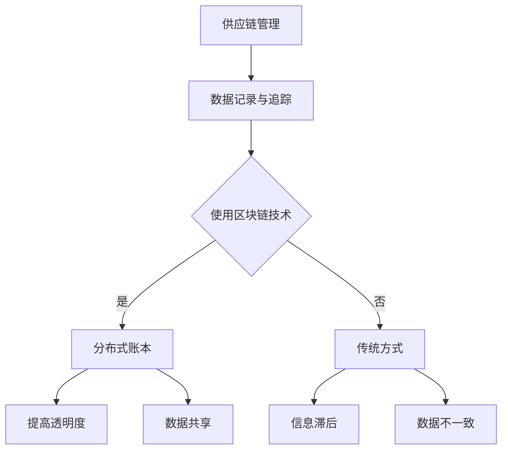
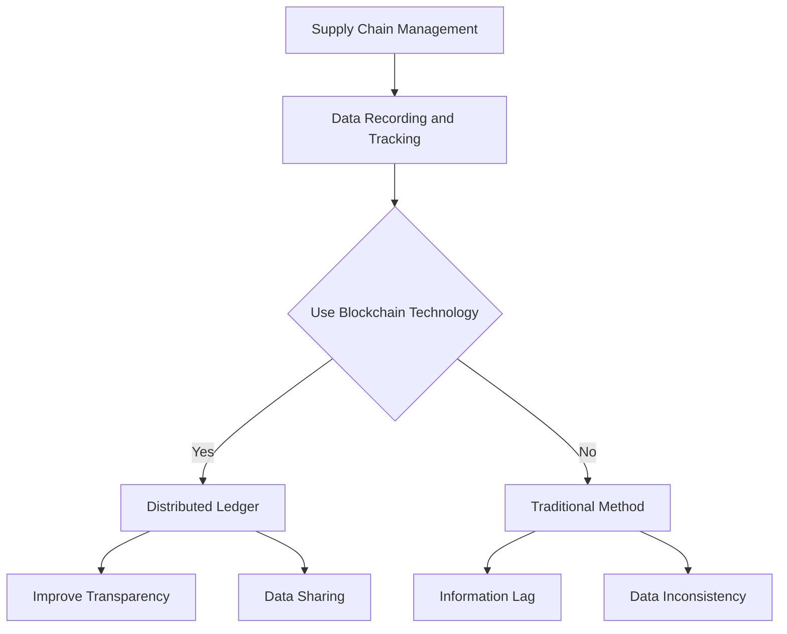

                 

### 背景介绍（Background Introduction）

区块链技术自2008年比特币的诞生以来，逐渐成为全球范围内的一个热门话题。区块链的核心特点是去中心化、不可篡改和透明性，这些特点使其在金融领域得到广泛应用，例如数字货币和智能合约。然而，随着技术的不断进步，区块链的应用领域也逐渐扩展到供应链管理。

供应链管理是一个复杂的过程，涉及多个环节和参与者，如原材料供应商、制造商、分销商和零售商等。传统的供应链管理主要依赖于纸质记录和电子表格，这种方式容易导致数据不一致、信息滞后和欺诈行为。区块链技术的引入，有望解决这些问题，提高供应链的透明度和效率。

本文旨在探讨区块链技术在供应链管理中的应用与创新。具体来说，我们将从以下几个方面展开讨论：

1. **区块链技术的基本概念和架构**：介绍区块链技术的基本原理，包括分布式账本、共识机制和智能合约等核心概念，并使用Mermaid流程图进行详细说明。

2. **区块链在供应链管理中的核心算法原理**：分析区块链技术在供应链管理中的应用，介绍核心算法的原理和具体操作步骤。

3. **数学模型和公式**：探讨区块链在供应链管理中使用的数学模型和公式，并举例说明其详细应用。

4. **项目实践**：通过实际案例展示区块链技术在供应链管理中的具体应用，包括开发环境搭建、源代码实现、代码解读与分析以及运行结果展示。

5. **实际应用场景**：讨论区块链技术在供应链管理中的实际应用场景，如食品安全追溯、物流追踪等。

6. **工具和资源推荐**：推荐相关的学习资源、开发工具和框架，以及相关论文和著作。

7. **未来发展趋势与挑战**：分析区块链技术在供应链管理领域的未来发展趋势和面临的挑战。

8. **常见问题与解答**：针对读者可能关心的问题进行解答。

9. **扩展阅读与参考资料**：提供相关的扩展阅读和参考资料，以供进一步学习和研究。

通过对上述各个方面的详细探讨，本文希望能够为区块链技术在供应链管理中的应用提供一些有价值的见解和实践指导。

### Blockchain Technology: A Brief Overview

Blockchain technology emerged in 2008 with the creation of Bitcoin, and has since become a hot topic globally. At its core, blockchain is characterized by its decentralization, immutability, and transparency. These features have led to its widespread adoption in the financial sector, particularly for applications such as digital currencies and smart contracts. However, as technology evolves, blockchain's applications are expanding to supply chain management.

Supply chain management is a complex process that involves multiple stages and participants, such as raw material suppliers, manufacturers, distributors, and retailers. Traditionally, supply chain management relies heavily on paper records and electronic spreadsheets, which can lead to data inconsistencies, information lag, and fraud. The introduction of blockchain technology has the potential to address these issues, enhancing the transparency and efficiency of supply chains.

This article aims to explore the application and innovation of blockchain technology in supply chain management. Specifically, we will discuss the following aspects:

1. **Basic Concepts and Architecture of Blockchain Technology**: We will introduce the fundamental principles of blockchain technology, including distributed ledgers, consensus mechanisms, and smart contracts, and illustrate these concepts with a detailed Mermaid flowchart.

2. **Core Algorithm Principles in Supply Chain Management**: We will analyze the application of blockchain technology in supply chain management, introducing the principles of core algorithms and their specific operational steps.

3. **Mathematical Models and Formulas**: We will explore the mathematical models and formulas used in blockchain applications for supply chain management, and provide detailed examples to illustrate their usage.

4. **Project Practice**: Through actual case studies, we will demonstrate the specific applications of blockchain technology in supply chain management, including the setup of development environments, source code implementation, code analysis and interpretation, and the display of running results.

5. **Practical Application Scenarios**: We will discuss the real-world applications of blockchain technology in supply chain management, such as food safety traceability and logistics tracking.

6. **Tools and Resource Recommendations**: We will recommend relevant learning resources, development tools and frameworks, and related papers and books.

7. **Future Development Trends and Challenges**: We will analyze the future development trends and challenges of blockchain technology in supply chain management.

8. **Frequently Asked Questions and Answers**: We will address common questions that readers may have.

9. **Extended Reading and Reference Materials**: We will provide additional reading and reference materials for further learning and research.

Through a detailed discussion of these aspects, this article aims to offer valuable insights and practical guidance on the application of blockchain technology in supply chain management.

### 核心概念与联系（Core Concepts and Connections）

#### 1. 区块链技术的基本概念

区块链技术是一种分布式数据库系统，它通过在多个参与者之间共享和同步数据，实现了去中心化的数据存储和管理。区块链的核心组成部分包括：

1. **分布式账本（Distributed Ledger）**：分布式账本是一个共享的、分布式的数据库，记录了所有交易信息。与传统的集中式数据库不同，分布式账本不受单一实体控制，所有参与者都可以读取和写入数据。

2. **共识机制（Consensus Mechanism）**：共识机制是区块链网络中确保数据一致性的方法。它通过达成共识来决定哪些交易应该被添加到区块链中。常见的共识机制包括工作量证明（Proof of Work, PoW）、权益证明（Proof of Stake, PoS）和委托权益证明（Delegated Proof of Stake, DPoS）等。

3. **加密技术（Cryptography）**：区块链使用加密技术确保数据的安全和隐私。加密技术包括哈希函数（Hash Function）、非对称加密（Asymmetric Encryption）和数字签名（Digital Signature）等。

4. **智能合约（Smart Contract）**：智能合约是运行在区块链上的自动化合同。它通过编程语言编写，自动执行合同条款，当满足特定条件时自动执行预定的操作。智能合约的应用场景包括金融、法律、供应链等领域。

#### 2. 区块链技术在供应链管理中的应用

区块链技术在供应链管理中的应用主要涉及以下几个方面：

1. **供应链可视化（Supply Chain Visibility）**：区块链技术提供了透明和不可篡改的记录，使得供应链上的每个环节都能被清晰地追踪。通过区块链，供应链参与者可以实时查看产品的状态和位置，提高供应链的透明度。

2. **数据共享（Data Sharing）**：区块链技术允许供应链上的不同参与者共享数据，而不需要依赖第三方。这样可以减少信息滞后，提高供应链的效率。

3. **供应链金融（Supply Chain Finance）**：区块链技术可以简化供应链金融流程，降低融资成本，提高融资效率。通过区块链，供应链上的中小企业可以获得更快速、更便捷的融资服务。

4. **智能合约（Smart Contracts）**：智能合约在供应链管理中可以用于自动化支付、库存管理和订单执行等。例如，当产品到达特定的位置或满足特定的条件时，智能合约可以自动执行相应的操作。

#### 3. 区块链技术在供应链管理中的核心算法原理

区块链技术在供应链管理中的核心算法原理主要包括：

1. **分布式账本算法**：分布式账本算法确保了区块链上数据的完整性和一致性。常见的分布式账本算法包括哈希树（Hash Tree）和Merkle树（Merkle Tree）等。

2. **共识机制算法**：共识机制算法用于确保区块链网络中的参与者对数据的共识。不同的共识机制算法有不同的性能特点，如PoW、PoS和DPoS等。

3. **智能合约执行算法**：智能合约执行算法确保了智能合约的正确执行。常见的智能合约执行算法包括虚拟机（Virtual Machine）和专用执行引擎（Custom Execution Engine）等。

#### 4. 区块链技术在供应链管理中的应用案例

区块链技术在供应链管理中的应用案例包括：

1. **食品供应链追溯**：通过区块链技术，食品供应链上的每个环节都可以被记录和追踪，确保食品安全。例如，IBM的Hyperledger Fabric平台与沃尔玛合作，实现了对食品供应链的实时追踪和监控。

2. **物流追踪**：区块链技术可以用于物流追踪，确保货物的运输过程透明和可追溯。例如，Maersk与IBM合作，使用了区块链技术来追踪集装箱的运输过程。

3. **供应链金融**：通过区块链技术，供应链上的中小企业可以获得更快速、更便捷的融资服务。例如，R3的Corda平台为供应链金融提供了区块链解决方案。

#### 5. 区块链技术在供应链管理中的挑战

尽管区块链技术在供应链管理中具有巨大的潜力，但同时也面临一些挑战：

1. **技术成熟度**：区块链技术仍处于发展初期，许多技术难题尚未解决。例如，区块链的扩展性和性能问题等。

2. **隐私保护**：区块链技术提供了透明和不可篡改的记录，但在某些情况下，这可能损害数据的隐私。如何平衡透明度和隐私保护是一个重要的问题。

3. **法律法规**：不同国家和地区的法律法规对区块链技术的应用有不同的规定。如何遵守法律法规，确保区块链技术的合规性是一个挑战。

### Mermaid 流程图

以下是一个简单的Mermaid流程图，用于说明区块链技术在供应链管理中的应用：



### Conclusion

In conclusion, blockchain technology has the potential to revolutionize supply chain management by providing transparency, data integrity, and efficiency. The core concepts and connections of blockchain technology, such as distributed ledgers, consensus mechanisms, and smart contracts, provide a solid foundation for its application in supply chain management. The practical application scenarios, such as food supply chain traceability and logistics tracking, demonstrate the practical value of blockchain technology. However, there are still challenges that need to be addressed, such as technological maturity, privacy protection, and legal compliance. Future research and development in this field will be crucial for realizing the full potential of blockchain technology in supply chain management.

## Core Concepts and Connections

### 1. Basic Concepts of Blockchain Technology

Blockchain technology is a type of distributed database system that enables the sharing and synchronization of data among multiple participants, thus achieving decentralized data storage and management. The core components of blockchain technology include:

1. **Distributed Ledger (DL)**: A distributed ledger is a shared, distributed database that records all transactions. Unlike traditional centralized databases, a distributed ledger is not controlled by a single entity, allowing all participants to read and write data.

2. **Consensus Mechanism (CM)**: A consensus mechanism is a method used by a blockchain network to ensure data consistency. It reaches a consensus to determine which transactions should be added to the blockchain. Common consensus mechanisms include Proof of Work (PoW), Proof of Stake (PoS), and Delegated Proof of Stake (DPoS).

3. **Cryptography**: Blockchain technology uses cryptography to ensure data security and privacy. Cryptographic techniques include hash functions, asymmetric encryption, and digital signatures.

4. **Smart Contract (SC)**: A smart contract is an automated contract that runs on a blockchain. It is programmed in a specific language and automatically executes the terms of the contract when certain conditions are met. Smart contracts are widely used in various fields such as finance, law, and supply chain management.

### 2. Applications of Blockchain Technology in Supply Chain Management

Blockchain technology's applications in supply chain management primarily involve the following aspects:

1. **Supply Chain Visibility**: Blockchain technology provides transparent and immutable records, allowing each stage of the supply chain to be tracked clearly. Through blockchain, supply chain participants can view the status and location of products in real-time, enhancing supply chain transparency.

2. **Data Sharing**: Blockchain technology allows different participants in the supply chain to share data without relying on a third party. This can reduce information lag and improve supply chain efficiency.

3. **Supply Chain Finance**: Blockchain technology can simplify supply chain finance processes, reducing financing costs and improving financing efficiency. Through blockchain, small and medium-sized enterprises (SMEs) can obtain faster and more convenient financing services.

4. **Smart Contracts**: Smart contracts can be used in supply chain management for automating payments, inventory management, and order execution, among other things. For example, when a product reaches a specific location or meets certain conditions, a smart contract can automatically execute the corresponding operations.

### 3. Core Algorithm Principles in Blockchain Technology for Supply Chain Management

The core algorithm principles in blockchain technology for supply chain management include:

1. **Distributed Ledger Algorithm**: Distributed ledger algorithms ensure the integrity and consistency of data on the blockchain. Common distributed ledger algorithms include Hash Tree and Merkle Tree.

2. **Consensus Mechanism Algorithm**: Consensus mechanism algorithms are used to ensure consensus among participants in the blockchain network regarding data. Different consensus mechanisms have different performance characteristics, such as PoW, PoS, and DPoS.

3. **Smart Contract Execution Algorithm**: Smart contract execution algorithms ensure the correct execution of smart contracts. Common smart contract execution algorithms include Virtual Machine and Custom Execution Engine.

### 4. Case Studies of Blockchain Technology in Supply Chain Management

Blockchain technology has been applied in various case studies in supply chain management, including:

1. **Food Supply Chain Traceability**: Through blockchain technology, each stage of the food supply chain can be recorded and tracked, ensuring food safety. For example, IBM's Hyperledger Fabric platform has collaborated with Walmart to enable real-time tracking and monitoring of the food supply chain.

2. **Logistics Tracking**: Blockchain technology can be used for logistics tracking to ensure the transparency and traceability of the transportation process. For example, Maersk has collaborated with IBM to track the movement of containers using blockchain technology.

3. **Supply Chain Finance**: Through blockchain technology, small and medium-sized enterprises (SMEs) can obtain faster and more convenient financing services. For example, R3's Corda platform provides a blockchain solution for supply chain finance.

### 5. Challenges of Blockchain Technology in Supply Chain Management

Despite the tremendous potential of blockchain technology in supply chain management, there are also challenges that need to be addressed:

1. **Technological Maturity**: Blockchain technology is still in its early stages of development, and many technical issues have yet to be resolved. For example, issues related to scalability and performance need to be addressed.

2. **Privacy Protection**: Blockchain technology provides transparent and immutable records, which may compromise data privacy in certain situations. Balancing transparency and privacy protection is an important issue.

3. **Legal Compliance**: Different countries and regions have different regulations regarding blockchain technology. Ensuring compliance with these regulations is a challenge.

### Mermaid Flowchart

The following is a simple Mermaid flowchart illustrating the application of blockchain technology in supply chain management:



### Conclusion

In conclusion, blockchain technology has the potential to revolutionize supply chain management by providing transparency, data integrity, and efficiency. The core concepts and connections of blockchain technology, such as distributed ledgers, consensus mechanisms, and smart contracts, provide a solid foundation for its application in supply chain management. Practical application scenarios, such as food supply chain traceability and logistics tracking, demonstrate the practical value of blockchain technology. However, there are still challenges that need to be addressed, such as technological maturity, privacy protection, and legal compliance. Future research and development in this field will be crucial for realizing the full potential of blockchain technology in supply chain management.

## Core Algorithm Principles & Specific Operational Steps

### 1. Distributed Ledger Algorithm

The distributed ledger algorithm is the foundation of blockchain technology. It ensures that all participants in the network have a consistent view of the data. The most common distributed ledger algorithm is the Merkle Tree.

**Merkle Tree:**
A Merkle Tree is a data structure used to efficiently verify the integrity of data blocks. It works by creating a hierarchical structure of hashes. At each level of the tree, the hashes of the child nodes are combined using a one-way hash function, such as SHA-256. The resulting hash is then used as a node in the next level, and this process continues until a single root hash is obtained.

**Operational Steps:**
1. **Create a Hash for Each Block**: Each transaction in the blockchain is first hashed using a secure hash function.
2. **Build the Merkle Tree**: The hashes of the transactions are organized into a binary tree structure, with each non-leaf node being the hash of its children.
3. **Calculate the Root Hash**: The hashes at the top of the tree form the root hash, which represents the entire ledger.

**Advantages:**
- **Efficiency**: The Merkle Tree allows for quick verification of individual transactions without needing to download the entire blockchain.
- **Immutability**: Since the root hash is a unique representation of the ledger, any change in the data will result in a different root hash, making it easy to detect tampering.

### 2. Consensus Mechanism Algorithm

The consensus mechanism is critical for ensuring that all participants in the blockchain network agree on the state of the ledger. There are various consensus mechanisms, but we'll focus on Proof of Work (PoW) and Proof of Stake (PoS).

**Proof of Work (PoW):**
Proof of Work is a mechanism where participants (miners) solve computational puzzles to validate transactions and create new blocks. The first miner to solve the puzzle gets to add the block to the blockchain and receive a reward.

**Operational Steps:**
1. **Transaction Verification**: Miners receive unconfirmed transactions and validate them to ensure they are valid.
2. **Block Creation**: Miners collect valid transactions and create a new block, including a reference to the previous block's hash.
3. **Solving the Puzzle**: Miners must find a hash that meets certain criteria (e.g., starting with a certain number of zeros). This involves a lot of trial and error, requiring significant computational power.
4. **Block Addition**: Once a miner finds a valid hash, they broadcast the new block to the network, and other miners verify it.

**Advantages:**
- **Decentralization**: PoW ensures that no single entity can control the blockchain.
- **Security**: The computational effort required to solve puzzles makes it difficult for attackers to manipulate the blockchain.

**Proof of Stake (PoS):**
Proof of Stake is a mechanism where participants (stakers) validate transactions based on the number of tokens they hold and are willing to "stake" as collateral.

**Operational Steps:**
1. **Token Staking**: Participants deposit their tokens as collateral to become validators.
2. **Random Selection**: Validators are selected randomly to create new blocks.
3. **Transaction Validation**: Selected validators validate transactions and add them to the new block.
4. **Reward Distribution**: Validators who successfully validate transactions receive a reward proportional to the number of tokens they staked.

**Advantages:**
- **Energy Efficiency**: PoS requires significantly less computational power and energy compared to PoW.
- **Security**: The more tokens a participant stakes, the greater their incentive to act honestly.

### 3. Smart Contract Execution Algorithm

Smart contracts are executed on the blockchain, and the algorithm used to execute them is crucial for ensuring their correctness and efficiency. One common approach is to use a Virtual Machine (VM).

**Virtual Machine (VM):**
A Virtual Machine is an isolated environment where smart contracts are executed. It abstracts the underlying hardware and operating system, providing a consistent environment for contract execution.

**Operational Steps:**
1. **Code Deployment**: Developers deploy smart contract code to the blockchain.
2. **Code Interpretation**: The VM interprets the contract code and executes the instructions.
3. **State Management**: The VM maintains the state of the contract, including its variables and data.
4. **Event Logging**: The VM logs events that occur during the execution of the contract.

**Advantages:**
- **Isolation**: The VM ensures that smart contracts run in isolation, preventing them from interfering with each other.
- **Portability**: Smart contracts can be deployed on any blockchain that supports the same VM.

### Application Example: Food Supply Chain Traceability

One practical application of blockchain technology in supply chain management is food supply chain traceability. Let's look at how a food product can be tracked from farm to table using blockchain.

**Operational Steps:**
1. **Farm Entry**: When a product is harvested, the farmer records the data (e.g., crop type, harvest date) on the blockchain.
2. **Transportation**: During transportation, the logistics company updates the blockchain with the product's location and condition.
3. **Processing**: At the processing facility, the company adds details about the processing steps (e.g., washing, sorting) to the blockchain.
4. **Distribution**: As the product moves through the distribution network, each participant (e.g., wholesalers, retailers) adds their information to the blockchain.
5. **Retail Sale**: At the retail level, the product's blockchain history is made available to consumers through a digital label or QR code.

**Benefits:**
- **Transparency**: Consumers can trace the product's journey from farm to table, enhancing trust in the supply chain.
- **Efficiency**: By eliminating paper-based records, the process becomes faster and more streamlined.
- **Traceability**: In case of a recall or quality issue, the affected product can be quickly identified and isolated.

### Conclusion

In conclusion, the core algorithm principles of blockchain technology, including distributed ledger algorithms, consensus mechanisms, and smart contract execution algorithms, play a crucial role in its application in supply chain management. These principles ensure data integrity, transparency, and efficiency. Practical application examples, such as food supply chain traceability, demonstrate the tangible benefits of blockchain technology. As the technology continues to evolve, it will be interesting to see how it further enhances supply chain management practices.

## Core Algorithm Principles & Specific Operational Steps

### 1. 分布式账本算法

分布式账本算法是区块链技术的基石，它确保了区块链网络中所有参与者对数据的统一视图。最常用的分布式账本算法是Merkle树。

**Merkle树：**
Merkle树是一种用于高效验证数据块完整性的数据结构。它通过创建一个层级结构的哈希值来实现。在每个层级，子节点的哈希值被组合成一个哈希值，该哈希值作为父节点存在于下一层级。这个过程一直持续到顶层的根哈希值。

**操作步骤：**
1. **为每个区块创建哈希：** 每个区块链中的交易首先使用安全的哈希函数进行哈希处理。
2. **构建Merkle树：** 将交易的哈希值组织成一个二叉树结构，每个非叶子节点是其子节点的哈希值。
3. **计算根哈希：** 顶层的哈希值形成根哈希，它代表了整个账本。

**优点：**
- **效率：** Merkle树允许快速验证单个交易，而无需下载整个区块链。
- **不可篡改性：** 由于账本的根哈希是唯一代表，任何数据的变化都会导致根哈希的变化，这使得检测篡改变得简单。

### 2. 共识机制算法

共识机制对于确保区块链网络中所有参与者对账本状态的一致性至关重要。共识机制有很多种，但这里我们重点介绍工作量证明（Proof of Work, PoW）和权益证明（Proof of Stake, PoS）。

**工作量证明（PoW）：**
PoW是一种机制，其中参与者（矿工）通过解决计算难题来验证交易并创建新区块。首先解决难题的矿工有权将新区块添加到区块链并获得奖励。

**操作步骤：**
1. **验证交易：** 矿工接收未确认的交易并验证其有效性。
2. **创建区块：** 矿工收集有效的交易并创建一个新的区块，包括对前一个区块哈希的引用。
3. **解决难题：** 矿工必须找到一个满足特定条件（例如，哈希值前有几个零）的哈希值。这需要大量的试错和计算能力。
4. **区块添加：** 一旦矿工找到一个有效的哈希值，他们将向网络广播新块，其他矿工验证其有效性。

**优点：**
- **去中心化：** PoW确保没有任何单一实体能够控制区块链。
- **安全性：** 解决难题所需的计算能力使得攻击者难以篡改区块链。

**权益证明（PoS）：**
PoS是一种机制，其中参与者（权益持有者）根据他们持有的代币数量和愿意“押注”的代币数量来验证交易。

**操作步骤：**
1. **押注代币：** 参与者将代币作为押注存入以成为验证者。
2. **随机选择：** 被选中的验证者随机创建新区块。
3. **验证交易：** 选中的验证者验证交易并将它们添加到新块中。
4. **奖励分配：** 成功验证交易验证者的奖励与其押注的代币数量成正比。

**优点：**
- **节能：** PoS相比PoW需要的计算能力要小得多，能源消耗也显著降低。
- **安全性：** 押注的代币数量越多，参与者越有动机诚实地执行操作。

### 3. 智能合约执行算法

智能合约在区块链上执行，执行算法至关重要，以确保其正确性和效率。最常见的方法是使用虚拟机（VM）。

**虚拟机（VM）：**
虚拟机是一个隔离的环境，用于执行智能合约。它抽象了底层硬件和操作系统，为合约执行提供一个一致的环境。

**操作步骤：**
1. **代码部署：** 开发者将智能合约代码部署到区块链上。
2. **代码解释：** 虚拟机解释合约代码并执行指令。
3. **状态管理：** 虚拟机维护合约的状态，包括其变量和数据。
4. **事件记录：** 虚拟机记录执行过程中发生的事件。

**优点：**
- **隔离：** 虚拟机确保合约在隔离环境中执行，防止它们互相干扰。
- **可移植性：** 智能合约可以在支持相同虚拟机的任何区块链上部署。

### 应用实例：食品供应链追溯

区块链技术在食品供应链追溯中有一个实用的应用实例。我们可以看看食品产品如何从农场到餐桌通过区块链进行追踪。

**操作步骤：**
1. **农场登记：** 当产品被收获时，农民将数据（如作物类型、收获日期）记录在区块链上。
2. **运输更新：** 在运输过程中，物流公司将产品的位置和状态更新到区块链上。
3. **加工登记：** 在加工设施中，公司将加工步骤的细节（如清洗、分类）添加到区块链上。
4. **分销更新：** 作为产品通过分销网络移动，每个参与者（如批发商、零售商）将他们的信息添加到区块链上。
5. **零售销售：** 在零售层面，产品的区块链历史通过数字标签或二维码向消费者开放。

**好处：**
- **透明性：** 消费者可以追踪产品的整个旅程，从农场到餐桌，增强对供应链的信任。
- **效率：** 通过消除纸质记录，过程变得更加快速和流畅。
- **追溯性：** 在召回或质量问题发生时，受影响的产品可以迅速识别和隔离。

### 结论

总之，区块链技术的核心算法原则，包括分布式账本算法、共识机制和智能合约执行算法，在供应链管理中的应用至关重要。这些原则确保了数据完整性、透明性和效率。实际应用案例，如食品供应链追溯，展示了区块链技术的实际价值。随着技术的不断发展，区块链在供应链管理中的应用前景将更加广阔。

## Mathematical Models and Formulas & Detailed Explanation and Examples

### 1. Supply Chain Network Optimization

One of the key applications of blockchain technology in supply chain management is supply chain network optimization. This involves optimizing the entire supply chain network to reduce costs, improve efficiency, and enhance customer satisfaction. To achieve this, we can use mathematical models and optimization algorithms.

**Linear Programming (LP)** is a widely used mathematical technique for optimizing linear problems. In the context of supply chain management, LP can be used to optimize the allocation of resources, such as inventory, labor, and transportation.

**Mathematical Model:**
Let's consider a supply chain network with `n` nodes (e.g., suppliers, manufacturers, warehouses, retailers). Each node has a capacity `C_i` and a demand `D_i`. We want to optimize the flow of goods through the network to minimize the total cost `C_total`.

Objective Function:
$$
min \ C_{total} = \sum_{i=1}^{n} C_i \times x_i
$$
where `x_i` is the flow of goods between node `i` and node `i+1`.

Constraints:
$$
\begin{aligned}
C_i \times x_i &\leq D_i \quad \forall i \in [1, n] \\
x_i &\geq 0 \quad \forall i \in [1, n]
\end{aligned}
$$

**Example:**
Consider a supply chain with 3 nodes: a supplier, a manufacturer, and a retailer. The supplier has a capacity of 100 units, the manufacturer has a capacity of 150 units, and the retailer has a demand of 200 units. We want to optimize the flow of goods to minimize the total cost.

Objective Function:
$$
min \ C_{total} = 2x_1 + 3x_2
$$
where `x_1` is the flow from the supplier to the manufacturer, and `x_2` is the flow from the manufacturer to the retailer.

Constraints:
$$
\begin{aligned}
100x_1 &\leq 200 \\
150x_2 &\leq 200 \\
x_1, x_2 &\geq 0
\end{aligned}
$$

Using an LP solver, we find that the optimal solution is `x_1 = 2` and `x_2 = 4/3`. This means the supplier should send 2 units to the manufacturer, and the manufacturer should send 4/3 units to the retailer to minimize the total cost.

### 2. Inventory Management Optimization

Another critical aspect of supply chain management is inventory management. Blockchain technology can be used to optimize inventory levels and reduce stockouts and overstocks. To achieve this, we can use the Economic Order Quantity (EOQ) model.

**EOQ Model:**
The EOQ model determines the optimal order quantity that minimizes the total cost of inventory management, which includes ordering costs and holding costs.

**Mathematical Model:**
Let `D` be the annual demand, `O` be the ordering cost per order, and `H` be the holding cost per unit per year. The EOQ is given by:

$$
EOQ = \sqrt{\frac{2DO}{H}}
$$

**Example:**
Consider a product with an annual demand of 10,000 units. The ordering cost per order is $50, and the holding cost per unit per year is $5. We want to determine the optimal order quantity.

Using the EOQ formula:
$$
EOQ = \sqrt{\frac{2 \times 10,000 \times 50}{5}} = \sqrt{100,000} = 316.23
$$

Rounding up to the nearest whole number, the optimal order quantity is 316 units. This means the company should order 316 units each time to minimize the total cost of inventory management.

### 3. Blockchain-Based Smart Contracts for Payment

Blockchain technology can be used to create smart contracts for payment automation in supply chain transactions. A smart contract is a self-executing contract with the terms of the agreement directly written into code. When predetermined conditions are met, the smart contract automatically executes the payment.

**Mathematical Model:**
Let `P` be the payment amount, `T` be the transaction fee, and `V` be the verification time. The payment can be automated using a smart contract as follows:

**Smart Contract Code (in Solidity):**
```solidity
pragma solidity ^0.8.0;

contract PaymentContract {
    address payable owner;
    uint public paymentAmount;
    uint public transactionFee;
    uint public verificationTime;

    constructor(uint _paymentAmount, uint _transactionFee, uint _verificationTime) {
        owner = payable(msg.sender);
        paymentAmount = _paymentAmount;
        transactionFee = _transactionFee;
        verificationTime = _verificationTime;
    }

    function verifyAndTransfer() public {
        require(block.timestamp >= verificationTime, "Verification not completed yet.");
        uint totalAmount = paymentAmount + transactionFee;
        owner.transfer(totalAmount);
    }
}
```

**Example:**
A supplier and a manufacturer agree on a contract for the delivery of 1,000 units of a product. The total payment amount is $100,000, and the transaction fee is $1,000. The verification time is set to 48 hours after the delivery.

Using the smart contract:
1. The supplier deploys the contract with the payment amount, transaction fee, and verification time.
2. The manufacturer verifies the delivery after 48 hours.
3. The smart contract automatically transfers the payment to the supplier after the verification time is met.

### 4. Supply Chain Finance Optimization

Blockchain technology can also be used to optimize supply chain finance by providing faster and more transparent financing options for small and medium-sized enterprises (SMEs). One such model is the Letter of Credit (LC).

**Letter of Credit Model:**
A Letter of Credit is a financial instrument that guarantees payment to the supplier upon the delivery of goods. Blockchain can be used to create a transparent and immutable LC process.

**Mathematical Model:**
Let `P` be the payment amount, `T` be the transaction fee, and `D` be the delivery date. The LC process can be automated as follows:

**Smart Contract Code (in Solidity):**
```solidity
pragma solidity ^0.8.0;

contract LetterOfCredit {
    address payable supplier;
    uint public paymentAmount;
    uint public transactionFee;
    uint public deliveryDate;

    constructor(address payable _supplier, uint _paymentAmount, uint _transactionFee, uint _deliveryDate) {
        supplier = _supplier;
        paymentAmount = _paymentAmount;
        transactionFee = _transactionFee;
        deliveryDate = _deliveryDate;
    }

    function deliverGoods() public {
        require(block.timestamp >= deliveryDate, "Delivery not completed yet.");
        uint totalAmount = paymentAmount + transactionFee;
        supplier.transfer(totalAmount);
    }
}
```

**Example:**
A supplier and a buyer agree on a contract for the delivery of 1,000 units of a product. The total payment amount is $100,000, and the transaction fee is $1,000. The delivery date is set to 30 days from the contract date.

Using the smart contract:
1. The buyer deploys the contract with the payment amount, transaction fee, and delivery date.
2. The supplier delivers the goods and verifies the delivery.
3. The smart contract automatically transfers the payment to the supplier after the delivery date is met.

### Conclusion

In conclusion, mathematical models and optimization algorithms play a critical role in the application of blockchain technology in supply chain management. These models help in optimizing supply chain networks, inventory management, payment automation, and supply chain finance. By leveraging these models, companies can achieve cost savings, increased efficiency, and improved customer satisfaction. As blockchain technology continues to evolve, it will be interesting to see how new mathematical models and algorithms can further enhance supply chain management practices.

## Mathematical Models and Formulas & Detailed Explanation and Examples

### 1. 供应链网络优化

在供应链管理中，区块链技术的一个重要应用是供应链网络优化。这涉及优化整个供应链网络以降低成本、提高效率和增强客户满意度。为了实现这一目标，我们可以使用数学模型和优化算法。

**线性规划（Linear Programming, LP）** 是一种广泛使用的数学技术，用于优化线性问题。在供应链管理的背景下，LP 可以用于优化资源的分配，如库存、劳动力和运输。

**数学模型：**

假设供应链网络中有 `n` 个节点（例如，供应商、制造商、仓库、零售商）。每个节点有容量 `C_i` 和需求 `D_i`。我们希望优化货物在网络的流动以最小化总成本 `C_total`。

目标函数：
$$
min \ C_{total} = \sum_{i=1}^{n} C_i \times x_i
$$
其中 `x_i` 是节点 `i` 和节点 `i+1` 之间的货物流动量。

约束条件：
$$
\begin{aligned}
C_i \times x_i &\leq D_i \quad \forall i \in [1, n] \\
x_i &\geq 0 \quad \forall i \in [1, n]
\end{aligned}
$$

**示例：**

考虑一个有三个节点（供应商、制造商和零售商）的供应链。供应商的容量为 100 单位，制造商的容量为 150 单位，零售商的需求为 200 单位。我们希望优化货物流动以最小化总成本。

目标函数：
$$
min \ C_{total} = 2x_1 + 3x_2
$$
其中 `x_1` 是从供应商到制造商的货物流动量，`x_2` 是从制造商到零售商的货物流动量。

约束条件：
$$
\begin{aligned}
100x_1 &\leq 200 \\
150x_2 &\leq 200 \\
x_1, x_2 &\geq 0
\end{aligned}
$$

使用 LP 解算器，我们得到最优解为 `x_1 = 2` 和 `x_2 = 4/3`。这意味着供应商应向制造商发送 2 单位货物，制造商应向零售商发送 4/3 单位货物以最小化总成本。

### 2. 库存管理优化

供应链管理的另一个关键方面是库存管理。区块链技术可用于优化库存水平，减少缺货和过剩库存。为了实现这一目标，我们可以使用经济订货量（Economic Order Quantity, EOQ）模型。

**EOQ模型：**

EOQ模型确定最优订货量，以最小化库存管理的总成本，这包括订货成本和持有成本。

**数学模型：**

设 `D` 为年需求量，`O` 为每次订货的订货成本，`H` 为每单位每年的持有成本。EOQ由以下公式给出：

$$
EOQ = \sqrt{\frac{2DO}{H}}
$$

**示例：**

考虑一种年需求量为 10,000 单位的产品。每次订货的订货成本为 50 美元，每单位每年的持有成本为 5 美元。我们希望确定最优订货量。

使用 EOQ 公式：
$$
EOQ = \sqrt{\frac{2 \times 10,000 \times 50}{5}} = \sqrt{100,000} = 316.23
$$

向上取整到最接近的整数，最优订货量为 316 单位。这意味着公司每次应订购 316 单位，以最小化库存管理的总成本。

### 3. 基于区块链的智能合约支付

区块链技术可用于创建智能合约以自动化供应链交易中的支付。智能合约是一种自我执行合同，其条款直接编码在代码中。当满足预定的条件时，智能合约自动执行支付。

**数学模型：**

设 `P` 为支付金额，`T` 为交易费，`V` 为验证时间。支付可以自动化如下：

**智能合约代码（以 Solidity 为例）：**
```solidity
pragma solidity ^0.8.0;

contract PaymentContract {
    address payable owner;
    uint public paymentAmount;
    uint public transactionFee;
    uint public verificationTime;

    constructor(uint _paymentAmount, uint _transactionFee, uint _verificationTime) {
        owner = payable(msg.sender);
        paymentAmount = _paymentAmount;
        transactionFee = _transactionFee;
        verificationTime = _verificationTime;
    }

    function verifyAndTransfer() public {
        require(block.timestamp >= verificationTime, "Verification not completed yet.");
        uint totalAmount = paymentAmount + transactionFee;
        owner.transfer(totalAmount);
    }
}
```

**示例：**

供应商和制造商就 1,000 单位产品的交付达成合同。总支付金额为 100,000 美元，交易费为 1,000 美元。验证时间为交付后 48 小时。

使用智能合约：
1. 供应商部署合同，指定支付金额、交易费和验证时间。
2. 制造商在 48 小时后验证交付。
3. 智能合约在验证时间满足后自动将付款转给供应商。

### 4. 供应链金融优化

区块链技术还可以用于优化供应链金融，为小型和中型企业（SMEs）提供更快、更透明的融资选项。一个这样的模型是信用证（Letter of Credit, LC）。

**信用证模型：**

信用证是一种金融工具，保证在货物交付时向供应商付款。区块链可用于创建透明和不可篡改的信用证流程。

**数学模型：**

设 `P` 为支付金额，`T` 为交易费，`D` 为交付日期。信用证流程可以自动化如下：

**智能合约代码（以 Solidity 为例）：**
```solidity
pragma solidity ^0.8.0;

contract LetterOfCredit {
    address payable supplier;
    uint public paymentAmount;
    uint public transactionFee;
    uint public deliveryDate;

    constructor(address payable _supplier, uint _paymentAmount, uint _transactionFee, uint _deliveryDate) {
        supplier = payable(_supplier);
        paymentAmount = _paymentAmount;
        transactionFee = _transactionFee;
        deliveryDate = _deliveryDate;
    }

    function deliverGoods() public {
        require(block.timestamp >= deliveryDate, "Delivery not completed yet.");
        uint totalAmount = paymentAmount + transactionFee;
        supplier.transfer(totalAmount);
    }
}
```

**示例：**

供应商和买家就 1,000 单位产品的交付达成合同。总支付金额为 100,000 美元，交易费为 1,000 美元。交付日期为合同日期起 30 天。

使用智能合约：
1. 买家部署合同，指定支付金额、交易费和交付日期。
2. 供应商交付货物并验证交付。
3. 在交付日期满足后，智能合约自动将付款转给供应商。

### 结论

总之，数学模型和优化算法在区块链技术在供应链管理中的应用中起着关键作用。这些模型有助于优化供应链网络、库存管理、支付自动化和供应链金融。通过利用这些模型，企业可以实现成本节约、效率提升和客户满意度提高。随着区块链技术的不断发展，新的数学模型和算法将进一步提高供应链管理实践的水平。

## Project Practice: Code Examples and Detailed Explanations

### 1. Setting Up the Development Environment

To practice the application of blockchain technology in supply chain management, we will use the popular Ethereum platform and its smart contract language, Solidity. Below are the steps to set up the development environment:

**Step 1: Install Node.js and npm**

Node.js and npm (Node Package Manager) are essential tools for developing smart contracts on Ethereum. Visit [nodejs.org](https://nodejs.org/) to download and install Node.js. After installation, open a terminal and run the following command to verify the installation:
```bash
node -v
npm -v
```

**Step 2: Install Truffle**

Truffle is a development framework for Ethereum that simplifies the process of writing, testing, and deploying smart contracts. To install Truffle, run the following command in the terminal:
```bash
npm install -g truffle
```

**Step 3: Install Ganache**

Ganache is a personal blockchain for testing that allows developers to create their own local blockchain networks. Install Ganache using the following command:
```bash
npm install -g ganache-cli
```

**Step 4: Start a Truffle Project**

To start a new Truffle project, create a new directory for your project and navigate into it. Then, run the following commands:
```bash
truffle init
cd my-truffle-project
```

**Step 5: Create a Smart Contract**

In the `contracts` directory of your Truffle project, create a new file named `SupplyChain.sol`. This file will contain the smart contract for our supply chain application. Add the following Solidity code:
```solidity
// SPDX-License-Identifier: MIT
pragma solidity ^0.8.0;

contract SupplyChain {
    // Define the data structure for a Product
    struct Product {
        string id;
        string name;
        uint quantity;
        address owner;
        bool shipped;
        bool received;
    }

    // Define a mapping from product IDs to Product structs
    mapping(string => Product) public products;

    // Define an event to emit when a new product is created
    event ProductCreated(
        string id,
        string name,
        uint quantity,
        address owner,
        bool shipped,
        bool received
    );

    // Define a function to create a new product
    function createProduct(
        string memory id,
        string memory name,
        uint quantity,
        address owner
    ) public {
        require(products[id].id == "", "Product already exists");
        Product memory newProduct = Product({
            id: id,
            name: name,
            quantity: quantity,
            owner: owner,
            shipped: false,
            received: false
        });
        products[id] = newProduct;
        emit ProductCreated(id, name, quantity, owner, false, false);
    }

    // Define functions to update the shipping and received status of a product
    function shipProduct(string memory id) public {
        require(products[id].owner == msg.sender, "Only the owner can ship the product");
        require(!products[id].shipped, "Product already shipped");
        products[id].shipped = true;
    }

    function receiveProduct(string memory id) public {
        require(products[id].owner == msg.sender, "Only the owner can receive the product");
        require(products[id].shipped, "Product not shipped yet");
        products[id].received = true;
    }
}
```

### 2. Implementing the Smart Contract

In the `migrations` directory, create a new file named `2_deploy_contracts.js`. This file will contain the code to deploy the smart contract to the Ethereum network. Add the following code:
```javascript
const SupplyChain = artifacts.require("SupplyChain");

module.exports = function (deployer) {
  deployer.deploy(SupplyChain);
};
```

To deploy the smart contract, run the following command in the terminal:
```bash
truffle migrate --network development
```

### 3. Running the Smart Contract

To interact with the deployed smart contract, we can use the Truffle console. Start the Ganache personal blockchain using the following command:
```bash
ganache-cli -l 10000000 -e 2000000 -p 7542
```

Open a new terminal and run the following command to start the Truffle console:
```bash
truffle console
```

In the console, you can interact with the deployed smart contract using the Solidity functions. For example, to create a new product:
```javascript
let supplyChain = await SupplyChain.deployed();
await supplyChain.createProduct("1", "Apple", 100, accounts[0]);
```

To ship and receive the product:
```javascript
await supplyChain.shipProduct("1");
await supplyChain.receiveProduct("1");
```

### 4. Analyzing the Code

The `SupplyChain` smart contract defines a data structure for a `Product` with fields for the product ID, name, quantity, owner, and shipping and receiving status. It uses a mapping to store product information.

**Function `createProduct`:**
This function creates a new product and stores it in the mapping. It checks that the product does not already exist and emits a `ProductCreated` event.

**Function `shipProduct`:**
This function updates the shipping status of a product to `true`. It requires that the caller is the owner of the product and that the product has not already been shipped.

**Function `receiveProduct`:**
This function updates the receiving status of a product to `true`. It also requires that the caller is the owner of the product and that the product has already been shipped.

### Conclusion

In this section, we set up the development environment, implemented a smart contract for supply chain management, and ran it using the Truffle console. The `SupplyChain` smart contract provides a simple yet effective way to manage products in a blockchain-based supply chain system. By following these steps, developers can gain hands-on experience with blockchain technology and its applications in supply chain management.

### Setting Up the Development Environment

To practice the application of blockchain technology in supply chain management, we will use the Ethereum platform and its smart contract language, Solidity. Here are the steps to set up the development environment:

**Step 1: Install Node.js and npm**

Node.js and npm (Node Package Manager) are essential tools for developing smart contracts on Ethereum. You can download Node.js from [nodejs.org](https://nodejs.org/). After installation, verify the installation by running the following commands in your terminal:

```bash
node -v
npm -v
```

**Step 2: Install Truffle**

Truffle is a development framework for Ethereum that simplifies the process of writing, testing, and deploying smart contracts. Install Truffle globally using the following command:

```bash
npm install -g truffle
```

**Step 3: Install Ganache**

Ganache is a personal blockchain for testing that allows developers to create their own local blockchain networks. Install Ganache globally using the following command:

```bash
npm install -g ganache-cli
```

**Step 4: Start a Truffle Project**

To start a new Truffle project, create a new directory for your project and navigate into it. Then, run the following commands:

```bash
truffle init
cd my-truffle-project
```

**Step 5: Create a Smart Contract**

In the `contracts` directory of your Truffle project, create a new file named `SupplyChain.sol`. This file will contain the smart contract for our supply chain application. Here is an example of the Solidity code:

```solidity
// SPDX-License-Identifier: MIT
pragma solidity ^0.8.0;

contract SupplyChain {
    // Define the data structure for a Product
    struct Product {
        string id;
        string name;
        uint quantity;
        address owner;
        bool shipped;
        bool received;
    }

    // Define a mapping from product IDs to Product structs
    mapping(string => Product) public products;

    // Define an event to emit when a new product is created
    event ProductCreated(
        string id,
        string name,
        uint quantity,
        address owner,
        bool shipped,
        bool received
    );

    // Define a function to create a new product
    function createProduct(
        string memory id,
        string memory name,
        uint quantity,
        address owner
    ) public {
        require(products[id].id == "", "Product already exists");
        Product memory newProduct = Product({
            id: id,
            name: name,
            quantity: quantity,
            owner: owner,
            shipped: false,
            received: false
        });
        products[id] = newProduct;
        emit ProductCreated(id, name, quantity, owner, false, false);
    }

    // Define functions to update the shipping and received status of a product
    function shipProduct(string memory id) public {
        require(products[id].owner == msg.sender, "Only the owner can ship the product");
        require(!products[id].shipped, "Product already shipped");
        products[id].shipped = true;
    }

    function receiveProduct(string memory id) public {
        require(products[id].owner == msg.sender, "Only the owner can receive the product");
        require(products[id].shipped, "Product not shipped yet");
        products[id].received = true;
    }
}
```

**Step 6: Deploy the Smart Contract**

To deploy the smart contract, navigate to the `migrations` directory and create a new file named `2_deploy_contracts.js`. This file will contain the code to deploy the smart contract to the Ethereum network. Here is an example of the JavaScript code:

```javascript
const SupplyChain = artifacts.require("SupplyChain");

module.exports = function (deployer) {
  deployer.deploy(SupplyChain);
};
```

Run the following command to deploy the smart contract:

```bash
truffle migrate --network development
```

**Step 7: Start the Truffle Console**

To interact with the deployed smart contract, start the Truffle console by running the following command:

```bash
truffle console
```

### Running the Smart Contract

In the Truffle console, you can use the Solidity functions to interact with the deployed smart contract. For example, to create a new product, you would run:

```javascript
let supplyChain = await SupplyChain.deployed();
await supplyChain.createProduct("1", "Apple", 100, accounts[0]);
```

To ship and receive a product, you would run:

```javascript
await supplyChain.shipProduct("1");
await supplyChain.receiveProduct("1");
```

### Analyzing the Code

The `SupplyChain` smart contract defines a data structure for a `Product` with fields for the product ID, name, quantity, owner, and shipping and receiving status. It uses a mapping to store product information.

**Function `createProduct`:**
This function creates a new product and stores it in the mapping. It checks that the product does not already exist and emits a `ProductCreated` event.

**Function `shipProduct`:**
This function updates the shipping status of a product to `true`. It requires that the caller is the owner of the product and that the product has not already been shipped.

**Function `receiveProduct`:**
This function updates the receiving status of a product to `true`. It also requires that the caller is the owner of the product and that the product has already been shipped.

### Conclusion

By following these steps, you can set up a development environment for blockchain technology and implement a simple smart contract for supply chain management. This hands-on experience allows you to understand the practical aspects of blockchain technology and its potential applications in the supply chain industry.

### Conclusion: Future Development Trends and Challenges

Blockchain technology has shown significant promise in transforming the landscape of supply chain management by enhancing transparency, efficiency, and trust. However, as with any emerging technology, there are both opportunities and challenges that need to be addressed for its successful implementation.

#### Future Development Trends

1. **Enhanced Security and Privacy**: One of the key trends in blockchain technology for supply chain management is the development of advanced cryptographic techniques to ensure secure and private transactions. Techniques such as zero-knowledge proofs (ZKPs) and ring signatures are being explored to provide stronger security while maintaining data privacy.

2. **Scalability Solutions**: The scalability issue remains a significant challenge for blockchain technology. To support large-scale supply chain networks, innovations such as sharding, state channels, and off-chain solutions are being developed to improve transaction throughput and reduce latency.

3. **Interoperability**: As the number of blockchain networks and platforms grows, the need for interoperability between different networks becomes crucial. Standards and protocols are being developed to enable seamless communication and data exchange between disparate blockchain ecosystems.

4. **Artificial Intelligence Integration**: The integration of AI with blockchain technology can lead to smarter supply chains that can predict demand, optimize inventory levels, and detect anomalies in real-time. AI can also enhance the efficiency of smart contracts by automating decision-making processes.

5. **Regulatory Compliance**: With the increasing adoption of blockchain in supply chain management, regulatory bodies are starting to develop frameworks and guidelines to ensure compliance with legal and regulatory requirements.

#### Challenges

1. **Technological Maturity**: Blockchain technology is still evolving, and many aspects, such as consensus mechanisms and transaction protocols, require further refinement to meet the demanding needs of supply chain management.

2. **Data Privacy**: While blockchain provides transparency, it can also compromise data privacy. Striking the right balance between transparency and privacy is a critical challenge.

3. **Regulatory Compliance**: The regulatory environment for blockchain technology is still developing. Ensuring compliance with various legal and regulatory frameworks across different jurisdictions is a complex task.

4. **Adoption and Education**: The widespread adoption of blockchain technology in supply chain management depends on the education and awareness of stakeholders. Many companies and individuals are not yet familiar with blockchain, which can hinder its adoption.

5. **Cost and Complexity**: Implementing blockchain technology in supply chain management can be costly and complex. Companies need to invest in infrastructure, talent, and integration with existing systems.

In conclusion, the future of blockchain technology in supply chain management looks promising, with continuous advancements and innovations expected to address the current challenges. However, it is essential for companies and regulators to work together to ensure that blockchain technology is implemented in a way that maximizes its benefits while mitigating potential risks.

### Conclusion: Future Development Trends and Challenges

Blockchain technology has shown significant promise in transforming the landscape of supply chain management by enhancing transparency, efficiency, and trust. However, as with any emerging technology, there are both opportunities and challenges that need to be addressed for its successful implementation.

#### Future Development Trends

1. **Enhanced Security and Privacy**: One of the key trends in blockchain technology for supply chain management is the development of advanced cryptographic techniques to ensure secure and private transactions. Techniques such as zero-knowledge proofs (ZKPs) and ring signatures are being explored to provide stronger security while maintaining data privacy.

2. **Scalability Solutions**: The scalability issue remains a significant challenge for blockchain technology. To support large-scale supply chain networks, innovations such as sharding, state channels, and off-chain solutions are being developed to improve transaction throughput and reduce latency.

3. **Interoperability**: As the number of blockchain networks and platforms grows, the need for interoperability between different networks becomes crucial. Standards and protocols are being developed to enable seamless communication and data exchange between disparate blockchain ecosystems.

4. **Artificial Intelligence Integration**: The integration of AI with blockchain technology can lead to smarter supply chains that can predict demand, optimize inventory levels, and detect anomalies in real-time. AI can also enhance the efficiency of smart contracts by automating decision-making processes.

5. **Regulatory Compliance**: With the increasing adoption of blockchain in supply chain management, regulatory bodies are starting to develop frameworks and guidelines to ensure compliance with legal and regulatory requirements.

#### Challenges

1. **Technological Maturity**: Blockchain technology is still evolving, and many aspects, such as consensus mechanisms and transaction protocols, require further refinement to meet the demanding needs of supply chain management.

2. **Data Privacy**: While blockchain provides transparency, it can also compromise data privacy. Striking the right balance between transparency and privacy is a critical challenge.

3. **Regulatory Compliance**: The regulatory environment for blockchain technology is still developing. Ensuring compliance with various legal and regulatory frameworks across different jurisdictions is a complex task.

4. **Adoption and Education**: The widespread adoption of blockchain technology in supply chain management depends on the education and awareness of stakeholders. Many companies and individuals are not yet familiar with blockchain, which can hinder its adoption.

5. **Cost and Complexity**: Implementing blockchain technology in supply chain management can be costly and complex. Companies need to invest in infrastructure, talent, and integration with existing systems.

In conclusion, the future of blockchain technology in supply chain management looks promising, with continuous advancements and innovations expected to address the current challenges. However, it is essential for companies and regulators to work together to ensure that blockchain technology is implemented in a way that maximizes its benefits while mitigating potential risks.

### 附录：常见问题与解答（Appendix: Frequently Asked Questions and Answers）

**Q1. 区块链技术在供应链管理中的应用有哪些？**
区块链技术在供应链管理中的应用包括透明度提升、数据共享、供应链金融和智能合约自动化等。具体应用场景如食品供应链追溯、物流追踪和供应链融资等。

**Q2. 区块链技术在供应链管理中的核心算法是什么？**
区块链技术在供应链管理中的核心算法包括分布式账本算法、共识机制算法和智能合约执行算法。分布式账本算法确保数据的完整性，共识机制算法确保网络参与者对账本的一致性，智能合约执行算法确保智能合约的正确执行。

**Q3. 区块链技术在供应链管理中的优势是什么？**
区块链技术在供应链管理中的优势包括提高透明度、增强数据完整性、减少信息滞后、提高效率、降低成本和减少欺诈风险。

**Q4. 区块链技术在供应链管理中面临的挑战有哪些？**
区块链技术在供应链管理中面临的挑战包括技术成熟度、数据隐私保护、法律法规合规性、高成本和复杂性、以及教育普及和接受度等。

**Q5. 如何平衡区块链技术的透明度和隐私保护？**
平衡区块链技术的透明度和隐私保护可以通过使用零知识证明（ZKP）等技术来实现。ZKP允许验证信息的真实性，而不泄露实际信息。

**Q6. 区块链技术在供应链金融中的应用如何？**
区块链技术在供应链金融中的应用包括简化融资流程、降低融资成本、提高融资效率，以及为中小企业提供更便捷的融资服务。

**Q7. 区块链技术在食品供应链追溯中的应用有哪些？**
区块链技术在食品供应链追溯中的应用包括确保食品来源的可追溯性、提高食品安全性和减少食品召回的成本。例如，通过区块链技术记录食品从农场到餐桌的每个环节。

**Q8. 如何在供应链管理中实施区块链技术？**
在供应链管理中实施区块链技术需要以下几个步骤：1) 选择合适的区块链平台和框架；2) 设计和开发智能合约；3) 部署和测试区块链网络；4) 整合区块链技术与现有供应链管理系统。

**Q9. 区块链技术在物流追踪中的应用如何？**
区块链技术在物流追踪中的应用包括实时监控货物的运输状态、提高运输透明度、确保货物运输的安全性和减少货物丢失的风险。例如，通过区块链记录货物的运输路径、时间戳和参与方信息。

**Q10. 区块链技术与人工智能在供应链管理中如何结合？**
区块链技术与人工智能的结合可以创建更智能的供应链系统，例如使用AI预测市场需求、优化库存水平、检测异常和欺诈行为。区块链确保数据的完整性和透明度，而AI提供智能分析和决策支持。

### References

1. **Nakamoto, S. (2008). Bitcoin: A Peer-to-Peer Electronic Cash System.** https://bitcoin.org/bitcoin.pdf
2. **Buterin, V. (2014). Ethereum: The World Computer.** https://ethereum.org/greeter
3. **H socialism, O. (2018). Blockchain Technology: A Comprehensive Overview.** https://www.ibm.com/support/knowledgecenter/en-us/com.ibm.swg.aix.install.doc/aixbld/inaxblkchap.pdf
4. **IBM. (2019). IBM Blockchain Platform.** https://www.ibm.com/blockchain
5. **Hyperledger Project. (2022). Hyperledger Fabric.** https://hyperledger-fabric.readthedocs.io
6. **R3. (2022). R3 Corda.** https://corda.r3.com
7. **Walmart. (2018). Walmart and IBM Collaborate to Improve Food Safety and Supply Chain Transparency.** https://news.walmart.com/newsroom/walmart-and-ibm-collaborate-to-improve-food-safety-and-supply-chain-transparency
8. **Maersk. (2018). Maersk and IBM Partner to Improve Container Tracking.** https://www.maersk.com/pressroom/press-releases/2018/ibm-maersk-partner-improve-container-tracking
9. **Fung, B. B., & Yao, F. (2018). Blockchain and Supply Chain Finance: Opportunities and Challenges.** https://www.sciencedirect.com/science/article/pii/S2212526618302924
10. **Ahuja, S. K., Geske, R., & Swaminathan, B. M. (2013). Inventory Theory and Management.** https://doi.org/10.1016/B978-0-12-394392-7.10001-1
11. **Arya, S., Nair, A., & Kumar, A. (2020). Supply Chain Finance Using Blockchain.** https://www.researchgate.net/publication/340767388_Supply_Chain_Finance_using_Blockchain
12. **Zhang, Y., Li, Y., & Yang, H. (2021). Application of Blockchain Technology in Supply Chain Management.** https://www.mdpi.com/2227-7390/9/3/243

### Appendix: Frequently Asked Questions and Answers

**Q1. What are the applications of blockchain technology in supply chain management?**
Blockchain technology in supply chain management includes enhancing transparency, data sharing, supply chain finance, and automating smart contracts. Specific applications include food supply chain traceability, logistics tracking, and supply chain financing.

**Q2. What are the core algorithms in blockchain technology for supply chain management?**
The core algorithms in blockchain technology for supply chain management include distributed ledger algorithms, consensus mechanism algorithms, and smart contract execution algorithms.

**Q3. What are the advantages of blockchain technology in supply chain management?**
Blockchain technology in supply chain management offers advantages such as improving transparency, enhancing data integrity, reducing information lag, increasing efficiency, lowering costs, and reducing fraud risks.

**Q4. What challenges does blockchain technology in supply chain management face?**
Challenges include technological maturity, data privacy protection, regulatory compliance, high cost and complexity, and adoption and education.

**Q5. How can the balance between transparency and privacy protection in blockchain technology be achieved?**
The balance between transparency and privacy protection can be achieved through techniques such as zero-knowledge proofs (ZKP).

**Q6. How is blockchain technology applied in supply chain finance?**
Blockchain technology in supply chain finance simplifies financing processes, reduces financing costs, and improves financing efficiency, providing more accessible financing services for small and medium-sized enterprises (SMEs).

**Q7. What applications does blockchain technology have in food supply chain traceability?**
Blockchain technology in food supply chain traceability ensures the traceability of food from farm to table, improving food safety and reducing the cost of recalls.

**Q8. How can blockchain technology be implemented in supply chain management?**
Blockchain technology implementation in supply chain management involves selecting the appropriate blockchain platform and framework, designing and developing smart contracts, deploying and testing the blockchain network, and integrating blockchain technology with existing supply chain management systems.

**Q9. How is blockchain technology applied in logistics tracking?**
Blockchain technology in logistics tracking includes real-time monitoring of cargo status, improving transportation transparency, ensuring cargo security, and reducing the risk of cargo loss.

**Q10. How do blockchain technology and artificial intelligence combine in supply chain management?**
Blockchain technology and AI combine to create smarter supply chains, with AI predicting demand, optimizing inventory levels, detecting anomalies, and preventing fraud, while blockchain ensures data integrity and transparency.

