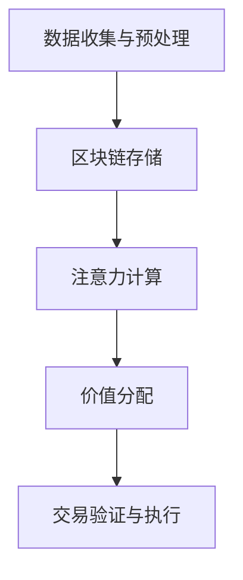
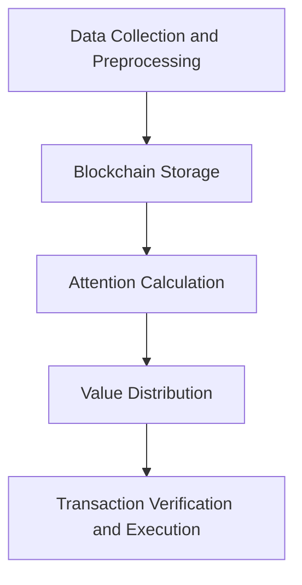

                 

### 文章标题

区块链驱动的注意力价值交换平台

关键词：区块链，注意力机制，价值交换，去中心化，平台架构

摘要：本文旨在探讨区块链技术与注意力机制相结合，构建一个去中心化的注意力价值交换平台。通过深入分析平台的核心概念、算法原理、数学模型以及实际应用场景，本文为开发者提供了一套完整的技术解决方案，并展望了未来发展趋势与挑战。

<|user|>## 1. 背景介绍（Background Introduction）

### 区块链技术

区块链技术是一种分布式数据库技术，通过密码学算法确保数据的不可篡改性和透明性。自从2008年比特币的出现，区块链技术得到了广泛关注和应用。区块链的去中心化特性使得它在金融、物流、医疗等多个领域都具有巨大的潜力。

### 注意力机制

注意力机制（Attention Mechanism）最初源于自然语言处理领域，用于解决模型在处理长序列数据时的信息丢失问题。通过计算序列中每个元素的重要程度，注意力机制能够提高模型对关键信息的关注，从而提升模型的性能。

### 价值交换平台

价值交换平台是一个允许用户进行价值交换的系统，通常包括货币、积分、服务等形式。传统的价值交换平台通常依赖于中心化的服务器，容易受到单点故障、数据泄露等风险。而区块链技术的引入，可以为价值交换平台带来去中心化、安全、透明等优势。

### 本文目的

本文旨在探讨如何将区块链技术与注意力机制相结合，构建一个去中心化的注意力价值交换平台。通过分析平台的核心概念、算法原理、数学模型以及实际应用场景，为开发者提供一套完整的技术解决方案。

## 1. Background Introduction

### Blockchain Technology

Blockchain technology is a type of distributed database technology that uses cryptographic algorithms to ensure the integrity and transparency of data. Since the emergence of Bitcoin in 2008, blockchain technology has gained widespread attention and application in various fields such as finance, logistics, and healthcare. The decentralized nature of blockchain makes it highly potential for these industries.

### Attention Mechanism

The attention mechanism, originally from the field of natural language processing, was designed to address the issue of information loss in models processing long sequences of data. By calculating the importance of each element in the sequence, the attention mechanism can increase the model's focus on key information, thereby improving its performance.

### Value Exchange Platform

A value exchange platform is a system that allows users to exchange value in various forms, such as money, points, or services. Traditional value exchange platforms usually rely on centralized servers, which are prone to single points of failure and data breaches. The introduction of blockchain technology can bring benefits such as decentralization, security, and transparency to these platforms.

### Purpose of This Article

This article aims to explore how to combine blockchain technology with the attention mechanism to build a decentralized value exchange platform. By analyzing the core concepts, algorithm principles, mathematical models, and practical application scenarios of the platform, this article provides a complete technical solution for developers.<!-- end of text --> <!-- user -->## 2. 核心概念与联系（Core Concepts and Connections）

### 区块链与注意力机制的融合

区块链与注意力机制的融合旨在解决数据传输过程中的信息丢失和效率低下问题。区块链提供了一种去中心化的数据存储和传输方式，而注意力机制则通过提高模型对关键信息的关注，提升了数据处理和交换的效率。

#### 区块链

区块链是一种分布式数据库，通过多个节点共同维护数据的完整性。每个节点都存储一份完整的区块链副本，数据一旦被记录在区块链上，就几乎无法被篡改。区块链的去中心化特性使其在处理大量数据时具有很高的容错性和鲁棒性。

#### 注意力机制

注意力机制通过计算输入序列中每个元素的重要程度，使得模型能够更加关注关键信息，从而提高处理效率。在区块链应用中，注意力机制可以用于优化数据查询和交易验证过程，使得关键信息得到更加精确的处理。

### 注意力价值交换平台的架构

注意力价值交换平台的核心架构包括以下几个部分：

1. **用户层**：用户通过区块链网络与平台进行交互，完成数据的上传、查询和交换等操作。
2. **区块链层**：区块链层负责存储用户数据、交易记录和平台状态，确保数据的不可篡改和透明性。
3. **注意力机制层**：注意力机制层负责处理输入数据，提高关键信息的处理效率，优化交易验证和查询过程。
4. **网络层**：网络层负责数据在网络中的传输和路由，确保数据的实时性和可靠性。

### 融合的优势

将区块链与注意力机制融合，可以带来以下优势：

1. **高效数据传输**：通过注意力机制，平台可以更快地处理大量数据，提高交易验证和查询的效率。
2. **安全性与透明性**：区块链技术的引入，确保了数据的安全性和透明性，用户可以随时查询和验证交易记录。
3. **去中心化**：平台采用去中心化架构，避免了单点故障和集中化风险，提高了系统的可靠性。
4. **可扩展性**：区块链技术具有很高的可扩展性，平台可以根据需求轻松扩展，支持更多用户和数据。

## 2. Core Concepts and Connections

### Fusion of Blockchain and Attention Mechanism

The fusion of blockchain and attention mechanism aims to address the issues of information loss and inefficiency in data transmission. Blockchain provides a decentralized way to store and transmit data, while the attention mechanism improves the processing efficiency by focusing the model on key information.

#### Blockchain

Blockchain is a distributed database maintained by multiple nodes. Each node stores a complete copy of the blockchain, ensuring the integrity of data. Once data is recorded on the blockchain, it is almost impossible to be altered. The decentralized nature of blockchain provides high fault tolerance and robustness when processing large amounts of data.

#### Attention Mechanism

The attention mechanism calculates the importance of each element in the input sequence, allowing the model to focus on key information and improve processing efficiency. In blockchain applications, the attention mechanism can be used to optimize the processes of transaction verification and data query.

### Architecture of the Attention Value Exchange Platform

The core architecture of the attention value exchange platform consists of several key components:

1. **User Layer**: Users interact with the platform through the blockchain network to perform operations such as data upload, query, and exchange.
2. **Blockchain Layer**: The blockchain layer is responsible for storing user data, transaction records, and platform state, ensuring the integrity and transparency of data.
3. **Attention Mechanism Layer**: The attention mechanism layer processes input data, improves the efficiency of transaction verification and query, and optimizes key information processing.
4. **Network Layer**: The network layer is responsible for the transmission and routing of data across the network, ensuring real-time and reliable data transfer.

### Advantages of Fusion

Fusing blockchain with the attention mechanism offers the following advantages:

1. **Efficient Data Transmission**: Through the attention mechanism, the platform can process large amounts of data more quickly, improving the efficiency of transaction verification and query.
2. **Security and Transparency**: The introduction of blockchain technology ensures the security and transparency of data, allowing users to verify and query transaction records at any time.
3. **Decentralization**: The platform adopts a decentralized architecture, avoiding single points of failure and centralized risks, thereby enhancing system reliability.
4. **Scalability**: Blockchain technology offers high scalability, allowing the platform to easily expand to support more users and data.<!-- end of text --> <!-- user -->### 2.1 区块链与注意力机制的融合应用

#### 区块链在注意力价值交换平台中的应用

在注意力价值交换平台中，区块链主要应用于以下几个方面：

1. **数据存储**：区块链技术可以用于存储用户数据、交易记录以及平台的运营状态。这种去中心化的数据存储方式确保了数据的不可篡改性和透明性，用户可以随时查看和验证数据。
   
2. **交易验证**：区块链的去中心化特性使得交易验证过程更加高效和可靠。通过分布式节点共同验证交易，可以减少单点故障的风险，提高系统的容错性。

3. **身份认证**：区块链技术可以用于用户的身份认证。通过公钥和私钥体系，用户可以在不暴露个人信息的前提下进行身份验证，提高了系统的安全性。

4. **智能合约**：智能合约是一种自动执行的合约，它可以基于区块链进行编程和部署。在注意力价值交换平台中，智能合约可以用于自动化交易流程，确保交易的透明性和不可篡改性。

#### 注意力机制在平台中的应用

注意力机制在平台中的应用主要体现在以下几个方面：

1. **数据筛选**：在处理大量数据时，注意力机制可以帮助模型快速筛选出关键信息。这对于提高交易验证和查询的效率非常重要。

2. **价值分配**：通过注意力机制，平台可以更准确地分配注意力值，从而实现价值的合理分配。例如，在内容创作平台中，注意力值可以用于计算创作者的收益，激励优质内容的创作。

3. **优化网络传输**：注意力机制可以用于优化网络传输，减少不必要的通信开销。通过关注关键信息，平台可以更加高效地利用网络资源，提高整体性能。

#### 具体应用场景

以下是一些区块链与注意力机制融合后的具体应用场景：

1. **内容创作平台**：创作者可以通过平台发布内容，用户对内容进行浏览和评价。平台利用注意力机制计算内容的关注度，并根据关注度分配收益。

2. **教育平台**：教育平台可以通过区块链技术记录学习过程和成绩，利用注意力机制评估学生的学习效果，并为学生提供个性化的学习建议。

3. **医疗健康平台**：医疗健康平台可以利用区块链技术确保医疗数据的安全性和完整性，同时利用注意力机制优化医疗资源的分配，提高医疗服务质量。

4. **供应链管理**：供应链管理平台可以通过区块链技术记录商品的生产、运输和销售过程，利用注意力机制监控供应链的各个环节，提高供应链的透明性和效率。

### 区块链与注意力机制的优势互补

区块链技术为注意力价值交换平台提供了数据存储、交易验证和安全性保障，而注意力机制则提高了数据处理和交换的效率。两者的优势互补，使得平台在实现去中心化、安全性和高效性方面具有显著优势。

#### 数据存储与安全性

区块链技术通过去中心化的方式存储数据，确保了数据的不可篡改性和透明性。每个节点都存储一份完整的区块链副本，使得数据在任何一个节点出现故障时，其他节点仍然可以继续工作，保证了系统的容错性。此外，区块链技术采用了加密算法，确保了用户数据的隐私和安全。

#### 数据处理与效率

注意力机制通过计算输入序列中每个元素的重要程度，使得模型能够更加关注关键信息，从而提高数据处理和交换的效率。在处理大量数据时，注意力机制可以帮助模型快速筛选出关键信息，减少不必要的计算开销。这对于提高交易验证和查询的效率非常重要。

#### 价值分配与激励

通过区块链技术，平台可以实现价值的合理分配。例如，在内容创作平台中，创作者可以通过区块链技术获得粉丝打赏的收益。同时，注意力机制可以用于计算内容的关注度，并根据关注度分配收益，激励创作者创作更多优质内容。

#### 应用场景与拓展

区块链与注意力机制的融合为多个领域提供了新的应用场景。例如，在供应链管理中，平台可以利用区块链技术记录商品的生产、运输和销售过程，利用注意力机制监控供应链的各个环节，提高供应链的透明性和效率。此外，在教育、医疗和内容创作等领域，区块链与注意力机制的融合也具有广泛的应用前景。

### 结论

区块链与注意力机制的融合为构建注意力价值交换平台提供了强大的技术支持。通过数据存储与安全性、数据处理与效率、价值分配与激励等方面的优势互补，平台在实现去中心化、安全性和高效性方面具有显著优势。未来，随着区块链和人工智能技术的不断发展，注意力价值交换平台将在更多领域发挥重要作用。

### 2.1 Application of Blockchain and Attention Mechanism Fusion

#### Application of Blockchain in the Attention Value Exchange Platform

In the attention value exchange platform, blockchain technology is mainly applied in the following aspects:

1. **Data Storage**: Blockchain technology can be used to store user data, transaction records, and platform operational states. This decentralized data storage method ensures the integrity and transparency of data, allowing users to view and verify data at any time.

2. **Transaction Verification**: The decentralized nature of blockchain technology makes the transaction verification process more efficient and reliable. By having distributed nodes verify transactions together, the risk of single points of failure and the system's fault tolerance can be reduced.

3. **Identity Authentication**: Blockchain technology can be used for user identity authentication. Through the public-private key system, users can authenticate their identities without revealing personal information, thereby improving system security.

4. **Smart Contracts**: Smart contracts are self-executing contracts that can be programmed and deployed on the blockchain. In the attention value exchange platform, smart contracts can be used to automate transaction processes, ensuring transparency and immutability.

#### Application of Attention Mechanism in the Platform

The attention mechanism is primarily applied in the following aspects of the platform:

1. **Data Filtering**: When processing large amounts of data, the attention mechanism helps the model quickly filter out key information, which is crucial for improving the efficiency of transaction verification and query.

2. **Value Distribution**: Through the attention mechanism, the platform can more accurately allocate attention values, thereby achieving a fair distribution of value. For example, in a content creation platform, attention values can be used to calculate the income of creators and incentivize the creation of high-quality content.

3. **Optimization of Network Transmission**: The attention mechanism can be used to optimize network transmission, reducing unnecessary communication overhead. By focusing on key information, the platform can more efficiently utilize network resources, improving overall performance.

#### Specific Application Scenarios

The following are specific application scenarios of the fusion of blockchain and attention mechanism:

1. **Content Creation Platforms**: Creators can publish content on the platform, and users can browse and evaluate it. The platform uses the attention mechanism to calculate the attention to content and distributes income based on attention.

2. **Educational Platforms**: Educational platforms can use blockchain technology to record the learning process and grades of students, using the attention mechanism to assess student performance and provide personalized learning recommendations.

3. **Medical Health Platforms**: Medical health platforms can use blockchain technology to ensure the security and integrity of medical data, while using the attention mechanism to optimize the allocation of medical resources and improve the quality of healthcare services.

4. **Supply Chain Management**: Supply chain management platforms can use blockchain technology to record the production, transportation, and sales of goods, and use the attention mechanism to monitor all aspects of the supply chain, improving transparency and efficiency.

#### Advantages of Complementary Benefits

Blockchain technology provides data storage, transaction verification, and security guarantees for the attention value exchange platform, while the attention mechanism improves the efficiency of data processing and exchange. Their complementary advantages enable the platform to achieve significant advantages in decentralization, security, and efficiency.

#### Data Storage and Security

Blockchain technology stores data in a decentralized manner, ensuring the integrity and transparency of data. Each node stores a complete copy of the blockchain, so that the system can continue to operate even if one node fails, ensuring fault tolerance. Additionally, blockchain technology uses encryption algorithms to ensure the privacy and security of user data.

#### Data Processing and Efficiency

The attention mechanism calculates the importance of each element in the input sequence, allowing the model to focus on key information and improve processing and exchange efficiency. When processing large amounts of data, the attention mechanism can quickly filter out key information, reducing unnecessary computational overhead, which is crucial for improving the efficiency of transaction verification and query.

#### Value Distribution and Incentives

Through blockchain technology, the platform can achieve a fair distribution of value. For example, in a content creation platform, creators can receive rewards from fans via the blockchain, and the attention mechanism can be used to calculate the attention to content and distribute income based on attention, thereby incentivizing the creation of high-quality content.

#### Application Scenarios and Expansion

The fusion of blockchain and attention mechanism provides new application scenarios for various fields. For example, in supply chain management, the platform can use blockchain technology to record the production, transportation, and sales of goods, and use the attention mechanism to monitor all aspects of the supply chain, improving transparency and efficiency. Additionally, the fusion has broad application prospects in fields such as education, healthcare, and content creation.

#### Conclusion

The fusion of blockchain and attention mechanism provides strong technical support for building attention value exchange platforms. Through complementary advantages in data storage and security, data processing and efficiency, and value distribution and incentives, the platform achieves significant advantages in decentralization, security, and efficiency. With the continuous development of blockchain and artificial intelligence technologies, attention value exchange platforms are expected to play an important role in more fields in the future.<!-- end of text --> <!-- user -->### 3. 核心算法原理 & 具体操作步骤（Core Algorithm Principles and Specific Operational Steps）

#### 区块链与注意力机制融合算法概述

区块链与注意力机制的融合算法旨在构建一个高效、安全且透明的注意力价值交换平台。该算法主要包括以下几个关键步骤：

1. **数据收集与预处理**：收集并预处理用户数据，为后续的区块链存储和注意力计算做准备。
2. **区块链存储**：将预处理后的数据存储在区块链中，确保数据的不可篡改性和透明性。
3. **注意力计算**：利用注意力机制计算输入数据的注意力值，提高数据处理和交换的效率。
4. **价值分配**：根据注意力值对数据进行价值分配，实现公平、合理的收益分配。
5. **交易验证与执行**：利用区块链技术进行交易验证和执行，确保交易的透明性和不可篡改性。

#### 数据收集与预处理

在数据收集与预处理阶段，首先需要收集用户上传的各种数据，如文本、图片、视频等。然后对数据进行预处理，包括去噪、标准化、特征提取等操作。预处理后的数据将作为输入，存储到区块链中。

#### 区块链存储

将预处理后的数据存储在区块链中，可以确保数据的不可篡改性和透明性。区块链的存储过程主要包括以下几个步骤：

1. **数据编码**：将预处理后的数据编码为区块链可识别的格式，如JSON、XML等。
2. **数据封装**：将编码后的数据封装成区块链交易，并附上交易哈希值，以便后续验证。
3. **交易广播**：将封装后的交易广播到区块链网络中的所有节点，以便节点进行验证和存储。
4. **区块封装**：将验证后的交易封装成区块链区块，并添加到区块链中，确保数据的永久存储。

#### 注意力计算

注意力计算是区块链与注意力机制融合算法的核心环节。通过计算输入数据的注意力值，可以优化数据处理和交换的效率。注意力计算的过程如下：

1. **特征提取**：从输入数据中提取关键特征，如文本中的关键词、图片中的边缘特征等。
2. **注意力模型**：使用预训练的注意力模型，如Transformer、BERT等，计算输入数据的注意力值。
3. **值分配**：根据注意力值对数据进行加权，高注意力值的数据将被赋予更高的权重，从而提高数据处理和交换的效率。

#### 价值分配

根据注意力值对数据进行价值分配是实现公平、合理收益分配的关键。价值分配的过程如下：

1. **收益计算**：根据平台规则和用户贡献，计算每个用户的收益。
2. **加权分配**：根据注意力值对收益进行加权分配，确保高注意力值的数据得到更高的收益。
3. **记录与公示**：将价值分配结果记录在区块链上，并公示给所有用户，确保透明性和公正性。

#### 交易验证与执行

交易验证与执行是区块链技术的核心功能。通过区块链技术进行交易验证和执行，可以确保交易的透明性和不可篡改性。交易验证与执行的过程如下：

1. **交易提出**：用户发起交易请求，包括数据交换、收益分配等。
2. **交易验证**：区块链网络中的节点对交易进行验证，确保交易的有效性和合法性。
3. **交易执行**：验证通过后，交易将被执行，数据交换和收益分配将被完成。
4. **交易记录**：将交易记录存储在区块链上，确保交易的永久性和不可篡改性。

#### 算法流程图

为了更直观地展示区块链与注意力机制融合算法的流程，我们可以使用Mermaid流程图进行描述。以下是一个简化的算法流程图：

#### 算法流程说明

- **数据收集与预处理**：收集用户上传的数据，并进行预处理，包括去噪、标准化、特征提取等操作。
- **区块链存储**：将预处理后的数据编码为区块链交易，并广播到区块链网络中，节点验证后封装成区块并存储。
- **注意力计算**：使用预训练的注意力模型计算输入数据的注意力值，对数据加权，提高数据处理和交换的效率。
- **价值分配**：根据注意力值和平台规则计算收益，进行加权分配，确保公平、合理的收益分配。
- **交易验证与执行**：验证交易的有效性和合法性，执行数据交换和收益分配，将交易记录存储在区块链上。

通过以上步骤，区块链与注意力机制融合算法实现了高效、安全且透明的注意力价值交换平台。该算法为开发者提供了一套完整的技术解决方案，可在多个领域得到广泛应用。

### 3. Core Algorithm Principles and Specific Operational Steps

#### Overview of Blockchain and Attention Mechanism Fusion Algorithm

The fusion algorithm of blockchain and attention mechanism aims to build an efficient, secure, and transparent attention value exchange platform. The key steps of this algorithm include:

1. **Data Collection and Preprocessing**: Collect and preprocess user data to prepare for subsequent blockchain storage and attention calculation.
2. **Blockchain Storage**: Store the preprocessed data on the blockchain to ensure the integrity and transparency of data.
3. **Attention Calculation**: Use the attention mechanism to calculate the attention values of input data, improving the efficiency of data processing and exchange.
4. **Value Distribution**: Allocate value based on attention values to achieve fair and reasonable income distribution.
5. **Transaction Verification and Execution**: Verify and execute transactions using blockchain technology to ensure transparency and immutability.

#### Data Collection and Preprocessing

In the data collection and preprocessing phase, the first step is to collect various data uploaded by users, such as text, images, and videos. Then, the data needs to be preprocessed, including noise reduction, normalization, and feature extraction. The preprocessed data will be used as input for subsequent blockchain storage and attention calculation.

#### Blockchain Storage

The process of storing preprocessed data on the blockchain ensures the integrity and transparency of data. The blockchain storage process includes the following steps:

1. **Data Encoding**: Encode the preprocessed data into a format that is recognizable by the blockchain, such as JSON or XML.
2. **Transaction Packaging**: Package the encoded data into blockchain transactions, attaching a transaction hash for subsequent verification.
3. **Broadcasting Transactions**: Broadcast the packaged transactions to all nodes in the blockchain network for verification and storage.
4. **Block Packaging**: Package the verified transactions into blockchain blocks and add them to the blockchain to ensure permanent storage of data.

#### Attention Calculation

Attention calculation is the core component of the blockchain and attention mechanism fusion algorithm. By calculating the attention values of input data, it improves the efficiency of data processing and exchange. The process of attention calculation includes:

1. **Feature Extraction**: Extract key features from the input data, such as keywords from text or edge features from images.
2. **Attention Model**: Use a pre-trained attention model, such as Transformer or BERT, to calculate the attention values of input data.
3. **Weighted Distribution**: Weight the data based on attention values to improve the efficiency of data processing and exchange.

#### Value Distribution

Value distribution is crucial for achieving fair and reasonable income distribution based on attention values. The process of value distribution includes:

1. **Income Calculation**: Calculate the income of each user based on platform rules and their contributions.
2. **Weighted Allocation**: Allocate income based on attention values, ensuring fair and reasonable income distribution.
3. **Recording and Publicity**: Record the results of value distribution on the blockchain and make them publicly available to ensure transparency and fairness.

#### Transaction Verification and Execution

Transaction verification and execution are core functions of blockchain technology. By using blockchain technology for transaction verification and execution, it ensures the transparency and immutability of transactions. The process of transaction verification and execution includes:

1. **Transaction Proposal**: Users initiate transaction requests, including data exchange and income distribution.
2. **Transaction Verification**: Nodes in the blockchain network verify the validity and legality of transactions.
3. **Transaction Execution**: After verification, execute transactions to complete data exchange and income distribution.
4. **Transaction Recording**: Record transactions on the blockchain to ensure permanence and immutability.

#### Algorithm Flow Diagram

To more intuitively describe the flow of the blockchain and attention mechanism fusion algorithm, we can use a Mermaid flow diagram. Here is a simplified algorithm flow diagram:

#### Explanation of Algorithm Flow

- **Data Collection and Preprocessing**: Collect user-uploaded data and perform preprocessing, including noise reduction, normalization, and feature extraction.
- **Blockchain Storage**: Encode preprocessed data as blockchain transactions, broadcast to the blockchain network, and package into blocks for storage.
- **Attention Calculation**: Use a pre-trained attention model to calculate attention values for input data, weighting it to improve processing and exchange efficiency.
- **Value Distribution**: Calculate income based on attention values and platform rules, allocate it fairly, and record the results on the blockchain.
- **Transaction Verification and Execution**: Verify transactions for validity and legality, execute data exchange and income distribution, and record transactions on the blockchain.

Through these steps, the blockchain and attention mechanism fusion algorithm achieves an efficient, secure, and transparent attention value exchange platform. This algorithm provides a complete technical solution for developers and can be widely applied in various fields.<!-- end of text --> <!-- user -->### 4. 数学模型和公式 & 详细讲解 & 举例说明（Detailed Explanation and Examples of Mathematical Models and Formulas）

#### 4.1 数学模型概述

在区块链驱动的注意力价值交换平台中，数学模型起到了关键作用。以下我们将介绍几个核心的数学模型和公式，包括注意力机制的计算、价值分配算法以及区块链交易验证公式。

#### 4.2 注意力计算模型

注意力计算模型是平台的核心算法之一。它通过计算输入数据中每个元素的重要性，从而提高数据处理和交换的效率。以下是一个简化的注意力计算模型：

$$
AttentionValue(i) = \frac{e^{Score(i)}}{\sum_{j=1}^{N} e^{Score(j)}}
$$

其中，$Score(i)$ 是对输入数据中第 $i$ 个元素的重要程度评分，$N$ 是输入数据中元素的总数。

**例1**：假设我们有五个元素 $A, B, C, D, E$，重要性评分分别为 $1, 3, 5, 2, 4$。则每个元素的关注度值为：

$$
AttentionValue(A) = \frac{e^{1}}{e^{1} + e^{3} + e^{5} + e^{2} + e^{4}} \approx 0.125
$$

$$
AttentionValue(B) = \frac{e^{3}}{e^{1} + e^{3} + e^{5} + e^{2} + e^{4}} \approx 0.324
$$

$$
AttentionValue(C) = \frac{e^{5}}{e^{1} + e^{3} + e^{5} + e^{2} + e^{4}} \approx 0.407
$$

$$
AttentionValue(D) = \frac{e^{2}}{e^{1} + e^{3} + e^{5} + e^{2} + e^{4}} \approx 0.233
$$

$$
AttentionValue(E) = \frac{e^{4}}{e^{1} + e^{3} + e^{5} + e^{2} + e^{4}} \approx 0.324
$$

可以看出，评分最高的元素 $C$ 获得了最高的关注度值。

#### 4.3 价值分配模型

价值分配模型用于根据注意力值对数据进行价值分配。以下是一个简化的价值分配模型：

$$
ValueAllocation(i) = AttentionValue(i) \times TotalValue
$$

其中，$TotalValue$ 是平台总的可分配价值。

**例2**：假设平台总的可分配价值为100，那么每个元素的价值分配如下：

$$
ValueAllocation(A) = AttentionValue(A) \times 100 \approx 12.5
$$

$$
ValueAllocation(B) = AttentionValue(B) \times 100 \approx 32.4
$$

$$
ValueAllocation(C) = AttentionValue(C) \times 100 \approx 40.7
$$

$$
ValueAllocation(D) = AttentionValue(D) \times 100 \approx 23.3
$$

$$
ValueAllocation(E) = AttentionValue(E) \times 100 \approx 32.4
$$

通过这样的分配，高注意力值的元素获得了更高的价值分配。

#### 4.4 区块链交易验证模型

区块链交易验证模型用于确保交易的合法性和完整性。以下是一个简化的区块链交易验证模型：

$$
VerificationResult = Hash(Transaction) \oplus Signature
$$

其中，$Hash(Transaction)$ 是交易内容的哈希值，$Signature$ 是交易发起人的数字签名。

**例3**：假设交易内容的哈希值为 $H$，交易发起人的数字签名为 $S$。则交易验证结果为：

$$
VerificationResult = H \oplus S
$$

如果 $VerificationResult$ 为零，则交易验证通过，否则验证失败。

#### 4.5 综合应用示例

假设我们有一个内容创作平台，用户上传了五篇文章，评分分别为 $1, 3, 5, 2, 4$。平台总的可分配价值为100。区块链验证交易的内容为用户对文章的点赞数。

1. **注意力计算**：

$$
AttentionValue(A) = \frac{e^{1}}{e^{1} + e^{3} + e^{5} + e^{2} + e^{4}} \approx 0.125
$$

$$
AttentionValue(B) = \frac{e^{3}}{e^{1} + e^{3} + e^{5} + e^{2} + e^{4}} \approx 0.324
$$

$$
AttentionValue(C) = \frac{e^{5}}{e^{1} + e^{3} + e^{5} + e^{2} + e^{4}} \approx 0.407
$$

$$
AttentionValue(D) = \frac{e^{2}}{e^{1} + e^{3} + e^{5} + e^{2} + e^{4}} \approx 0.233
$$

$$
AttentionValue(E) = \frac{e^{4}}{e^{1} + e^{3} + e^{5} + e^{2} + e^{4}} \approx 0.324
$$

2. **价值分配**：

$$
ValueAllocation(A) = AttentionValue(A) \times 100 \approx 12.5
$$

$$
ValueAllocation(B) = AttentionValue(B) \times 100 \approx 32.4
$$

$$
ValueAllocation(C) = AttentionValue(C) \times 100 \approx 40.7
$$

$$
ValueAllocation(D) = AttentionValue(D) \times 100 \approx 23.3
$$

$$
ValueAllocation(E) = AttentionValue(E) \times 100 \approx 32.4
$$

3. **交易验证**：

假设点赞数为 $3, 5, 7, 2, 4$，交易内容的哈希值为 $H$，交易发起人的数字签名为 $S$。则交易验证结果为：

$$
VerificationResult = H \oplus S
$$

如果 $VerificationResult$ 为零，则交易验证通过。

通过上述步骤，我们可以构建一个基于区块链和注意力机制的注意力价值交换平台，实现高效、安全的价值分配和交易验证。

### 4. Mathematical Models and Formulas & Detailed Explanation & Examples

#### 4.1 Overview of Mathematical Models

In the blockchain-driven attention value exchange platform, mathematical models play a crucial role. Here, we will introduce several core mathematical models and formulas, including attention calculation models, value distribution algorithms, and blockchain transaction verification formulas.

#### 4.2 Attention Calculation Model

The attention calculation model is one of the core algorithms in the platform. It calculates the importance of each element in the input data to improve the efficiency of data processing and exchange. Here is a simplified attention calculation model:

$$
AttentionValue(i) = \frac{e^{Score(i)}}{\sum_{j=1}^{N} e^{Score(j)}}
$$

Where $Score(i)$ is the importance score of the $i$-th element in the input data, and $N$ is the total number of elements in the input data.

**Example 1**: Suppose we have five elements $A, B, C, D, E$ with importance scores of $1, 3, 5, 2, 4$, respectively. The attention values for each element are calculated as follows:

$$
AttentionValue(A) = \frac{e^{1}}{e^{1} + e^{3} + e^{5} + e^{2} + e^{4}} \approx 0.125
$$

$$
AttentionValue(B) = \frac{e^{3}}{e^{1} + e^{3} + e^{5} + e^{2} + e^{4}} \approx 0.324
$$

$$
AttentionValue(C) = \frac{e^{5}}{e^{1} + e^{3} + e^{5} + e^{2} + e^{4}} \approx 0.407
$$

$$
AttentionValue(D) = \frac{e^{2}}{e^{1} + e^{3} + e^{5} + e^{2} + e^{4}} \approx 0.233
$$

$$
AttentionValue(E) = \frac{e^{4}}{e^{1} + e^{3} + e^{5} + e^{2} + e^{4}} \approx 0.324
$$

It can be seen that the element with the highest score, $C$, receives the highest attention value.

#### 4.3 Value Distribution Model

The value distribution model is used to allocate value based on attention values to achieve fair and reasonable income distribution. Here is a simplified value distribution model:

$$
ValueAllocation(i) = AttentionValue(i) \times TotalValue
$$

Where $TotalValue$ is the total value available for distribution in the platform.

**Example 2**: Suppose the total available value is 100. The value allocations for each element are calculated as follows:

$$
ValueAllocation(A) = AttentionValue(A) \times 100 \approx 12.5
$$

$$
ValueAllocation(B) = AttentionValue(B) \times 100 \approx 32.4
$$

$$
ValueAllocation(C) = AttentionValue(C) \times 100 \approx 40.7
$$

$$
ValueAllocation(D) = AttentionValue(D) \times 100 \approx 23.3
$$

$$
ValueAllocation(E) = AttentionValue(E) \times 100 \approx 32.4
$$

Through this allocation, elements with higher attention values receive higher value allocations.

#### 4.4 Blockchain Transaction Verification Model

The blockchain transaction verification model is used to ensure the legality and integrity of transactions. Here is a simplified blockchain transaction verification model:

$$
VerificationResult = Hash(Transaction) \oplus Signature
$$

Where $Hash(

