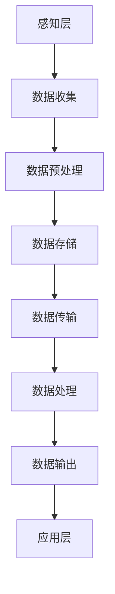
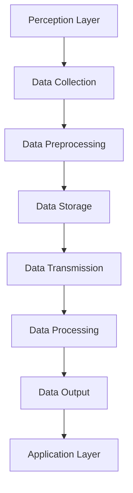

                 

### 文章标题

**医疗物联网：智慧医疗的创业机会**

在当今世界，医疗行业正经历着一场革命，而医疗物联网（IoMT）是其核心驱动力之一。IoMT通过将医疗设备、传感器和患者数据集成到一个统一的网络中，正在彻底改变医疗保健的方方面面。对于创业者来说，这一领域充满了无限的创新和创业机会。本文将深入探讨医疗物联网的各个方面，分析其核心概念，介绍核心算法原理，并展示具体的项目实践，以帮助读者了解这个新兴领域并找到其中的创业机会。

关键词：医疗物联网，智慧医疗，创业机会，传感器，数据分析

摘要：本文旨在探讨医疗物联网（IoMT）的发展及其在智慧医疗领域中的创业机会。通过分析IoMT的核心概念、技术架构、算法原理和实际应用，本文为创业者提供了洞察和指导，以抓住这一快速发展的市场的机遇。

<|user|>## 1. 背景介绍（Background Introduction）

### 1.1 医疗物联网的定义与现状

医疗物联网（Internet of Medical Things，IoMT）是指通过互联网连接的医疗设备、医疗信息、医疗数据和患者设备，它们协同工作以优化医疗保健服务。IoMT不仅仅涉及医疗设备和设备的互联，还包括患者、医生、医疗机构和第三方服务提供商之间的数据交换和协作。

当前，IoMT在全球范围内正处于快速发展阶段。根据市场研究公司的数据，全球IoMT市场预计将在未来几年内以两位数的年增长率增长。这种增长主要受到以下几个因素的推动：

1. **技术进步**：随着传感器技术、无线通信技术和数据分析技术的不断进步，IoMT设备的性能和功能得到了显著提升。
2. **政策支持**：许多国家政府已经开始认识到IoMT的重要性，并出台了相关政策以促进其发展，例如在美国，医疗保健信息技术（Health IT）的立法推动了医疗物联网的应用。
3. **市场需求**：随着人口老龄化和慢性疾病患者数量的增加，患者对个性化医疗和远程监测的需求不断上升，这为IoMT提供了巨大的市场机会。

### 1.2 智慧医疗的概念

智慧医疗（Smart Health）是指利用信息技术和智能设备来提升医疗保健服务质量和效率的一种模式。智慧医疗的核心是通过数据的整合和分析，实现个性化医疗、精准治疗和预防医疗。以下是一些智慧医疗的关键组成部分：

1. **电子健康记录（EHR）**：电子健康记录系统可以整合患者的医疗历史、诊断和治疗计划，为医生提供全面的医疗信息，有助于提高诊断的准确性和治疗的有效性。
2. **远程监测**：通过可穿戴设备和家庭监测设备，医生可以远程监测患者的健康状态，及时发现异常情况并采取相应措施。
3. **人工智能与机器学习**：利用人工智能和机器学习技术，可以对海量的医疗数据进行分析，从而发现潜在的健康问题，提供个性化的治疗方案。
4. **个性化医疗**：通过基因检测和生物信息学分析，可以为患者提供个性化的医疗方案，最大限度地提高治疗效果。

### 1.3 创业机会的探讨

医疗物联网和智慧医疗的快速发展为创业者提供了丰富的机会。以下是一些值得探讨的创业方向：

1. **智能设备研发**：开发创新的医疗设备和传感器，例如可穿戴健康监测设备、智能输液泵等，以满足个性化医疗和远程监测的需求。
2. **医疗数据分析**：提供专业的医疗数据分析服务，帮助医疗机构和医生从海量数据中提取有价值的信息，提高诊断和治疗的效率。
3. **远程医疗服务**：利用IoMT技术，提供远程诊断、远程手术和远程咨询服务，使医疗资源得到更高效的分配。
4. **健康管理系统**：开发面向个人和家庭的管理系统，帮助用户监控和管理自己的健康状况，促进健康生活方式的形成。

总的来说，医疗物联网和智慧医疗领域充满了创新和创业机会。随着技术的不断进步和市场需求的增加，这一领域将继续发展，为创业者提供无限的可能。在接下来的部分，我们将进一步探讨医疗物联网的核心概念和技术架构，为读者提供更深入的了解。

## 1. Background Introduction
### 1.1 Definition and Current Status of Internet of Medical Things (IoMT)

The Internet of Medical Things (IoMT) refers to the network of medical devices, health information, and patient devices that are interconnected and collaborate to optimize healthcare services. IoMT encompasses not only the connectivity of medical devices but also the exchange of data and collaboration between patients, healthcare professionals, healthcare institutions, and third-party service providers.

Currently, IoMT is in a stage of rapid development globally. According to market research firms, the global IoMT market is expected to grow at a double-digit annual rate in the coming years. This growth is driven by several factors:

1. **Technological Advancements**: The advancements in sensor technology, wireless communication technology, and data analysis have significantly improved the performance and functionality of IoMT devices.
2. **Policy Support**: Many governments around the world have recognized the importance of IoMT and have issued policies to promote its development. For example, in the United States, legislation on Health IT has spurred the adoption of IoMT applications.
3. **Market Demand**: The increasing aging population and the rising number of chronic disease patients have driven the demand for personalized healthcare and remote monitoring, providing a huge market opportunity for IoMT.

### 1.2 The Concept of Smart Health

Smart Health refers to a model that uses information technology and intelligent devices to enhance the quality and efficiency of healthcare services. The core of Smart Health is to integrate and analyze data to achieve personalized medicine, precision treatment, and preventive care. The following are key components of Smart Health:

1. **Electronic Health Records (EHR)**: Electronic Health Record systems can integrate a patient's medical history, diagnoses, and treatment plans, providing healthcare professionals with comprehensive medical information, which can enhance the accuracy of diagnoses and the effectiveness of treatments.
2. **Remote Monitoring**: Through wearable devices and home monitoring devices, healthcare professionals can remotely monitor patients' health status, promptly detect anomalies, and take appropriate measures.
3. **Artificial Intelligence and Machine Learning**: Utilizing AI and machine learning technologies, vast amounts of medical data can be analyzed to identify potential health issues and provide personalized treatment plans, maximizing the effectiveness of treatments.
4. **Personalized Medicine**: Through gene testing and bioinformatics analysis, personalized medical plans can be provided for patients, maximizing the effectiveness of treatments.

### 1.3 Exploration of Entrepreneurial Opportunities

The rapid development of IoMT and Smart Health provides abundant opportunities for entrepreneurs. Here are some areas worth exploring:

1. **Development of Intelligent Devices**: Developing innovative medical devices and sensors, such as wearable health monitoring devices and intelligent infusion pumps, to meet the needs of personalized medicine and remote monitoring.
2. **Medical Data Analysis**: Providing professional medical data analysis services to help healthcare institutions and doctors extract valuable information from massive data, improving the efficiency of diagnosis and treatment.
3. **Remote Healthcare Services**: Utilizing IoMT technology to provide remote diagnosis, remote surgery, and remote consulting services, enabling more efficient allocation of medical resources.
4. **Health Management Systems**: Developing management systems for individuals and families to help users monitor and manage their health conditions, promoting the formation of healthy lifestyles.

In summary, the field of IoMT and Smart Health is full of innovation and entrepreneurial opportunities. As technology continues to advance and market demand increases, this field will continue to grow, providing entrepreneurs with endless possibilities. In the following sections, we will further explore the core concepts and technical architectures of IoMT, providing readers with a deeper understanding.

<|user|>## 2. 核心概念与联系（Core Concepts and Connections）

### 2.1 医疗物联网的组成部分（Components of IoMT）

医疗物联网由多个关键组成部分构成，这些部分相互协作，以实现智能医疗的目标。以下是医疗物联网的主要组成部分：

1. **医疗设备（Medical Devices）**：包括监护仪、心电图机、CT机、MRI机等。这些设备能够实时监测患者的生命体征和健康状况，并将数据传输到网络。

2. **传感器（Sensors）**：传感器是IoMT的核心，用于检测和收集各种生物医学参数，如体温、血压、心率、血糖等。

3. **可穿戴设备（Wearable Devices）**：可穿戴设备如智能手表、健康监测手环等，可以持续监测患者的健康状态，并通过无线网络将数据传输到云端。

4. **数据处理与分析（Data Processing and Analysis）**：医疗物联网的数据量巨大，需要强大的数据处理和分析能力。通过云计算和大数据技术，可以对这些数据进行分析，以提取有价值的信息。

5. **连接技术（Connectivity Technologies）**：包括无线网络、5G、蓝牙、ZigBee等，这些技术使得医疗设备和系统之间的数据传输变得高效和可靠。

6. **平台与应用（Platforms and Applications）**：医疗物联网平台提供数据处理、存储、分析和共享的功能。应用层则包括各种医疗健康应用，如远程诊断、患者管理、健康咨询等。

### 2.2 智慧医疗的核心技术（Core Technologies of Smart Health）

智慧医疗的实现依赖于多种先进技术的整合，以下是一些核心技术：

1. **人工智能（AI）**：人工智能技术在智慧医疗中应用广泛，包括疾病预测、诊断辅助、治疗建议、药物研发等。

2. **大数据（Big Data）**：大数据技术用于存储、管理和分析医疗数据，帮助医生和研究人员发现疾病模式、预测患者健康状况等。

3. **云计算（Cloud Computing）**：云计算提供了强大的计算能力和数据存储能力，使得大规模数据处理和实时分析成为可能。

4. **物联网（IoT）**：物联网技术是智慧医疗的基石，通过连接各种医疗设备和系统，实现数据的实时收集和共享。

5. **区块链（Blockchain）**：区块链技术可以确保医疗数据的安全性和完整性，提供透明和不可篡改的数据记录。

6. **基因组学（Genomics）**：基因组学技术用于个人基因检测，为个性化医疗提供基础。

### 2.3 医疗物联网与智慧医疗的关联（Connection between IoMT and Smart Health）

医疗物联网和智慧医疗之间存在着密切的关联。IoMT为智慧医疗提供了数据来源和技术支持，而智慧医疗则利用这些数据和技术来实现更高效、更精准的医疗保健服务。

1. **数据驱动（Data-driven）**：医疗物联网收集的大量数据为智慧医疗提供了丰富的数据资源，医生和研究人员可以通过这些数据做出更准确的诊断和制定更有效的治疗方案。

2. **实时监控（Real-time Monitoring）**：IoMT设备可以实时监测患者的健康状况，医生可以实时了解患者的病情变化，及时采取干预措施。

3. **个性化医疗（Personalized Medicine）**：通过分析患者的基因、生活习惯和医疗记录，智慧医疗可以为患者提供个性化的医疗建议和治疗方案。

4. **远程医疗（Telemedicine）**：智慧医疗平台可以通过IoMT设备提供远程诊断和咨询服务，患者无需亲自前往医院即可获得专业医疗服务。

5. **疾病预防（Disease Prevention）**：通过实时监控和数据分析，智慧医疗可以预测疾病的发生，采取预防措施，降低疾病的风险。

总之，医疗物联网和智慧医疗的协同发展，为医疗行业带来了革命性的变革。通过整合物联网技术和人工智能，医疗行业可以实现更高效、更精准、更个性化的医疗服务，从而提高患者的健康水平和满意度。

## 2. Core Concepts and Connections
### 2.1 Components of Internet of Medical Things (IoMT)

The Internet of Medical Things (IoMT) consists of several key components that collaborate to achieve the goal of intelligent healthcare. Here are the main components of IoMT:

1. **Medical Devices**: This includes devices such as monitors, electrocardiograms (ECGs), computed tomography (CT) machines, and magnetic resonance imaging (MRI) machines. These devices can monitor patients' vital signs and health conditions in real-time and transmit data over the network.

2. **Sensors**: Sensors are at the core of IoMT, used to detect and collect various biomedical parameters, such as body temperature, blood pressure, heart rate, and blood glucose levels.

3. **Wearable Devices**: Wearable devices, such as smartwatches and health monitoring bracelets, can continuously monitor patients' health status and transmit data to the cloud over wireless networks.

4. **Data Processing and Analysis**: With the massive volume of data generated by IoMT devices, powerful data processing and analysis capabilities are required. Through cloud computing and big data technologies, this data can be analyzed to extract valuable insights.

5. **Connectivity Technologies**: These include wireless networks, 5G, Bluetooth, ZigBee, and other technologies that enable efficient and reliable data transmission between medical devices and systems.

6. **Platforms and Applications**: Medical IoT platforms provide functionalities for data processing, storage, analysis, and sharing. The application layer includes various healthcare applications, such as remote diagnosis, patient management, and health consultation.

### 2.2 Core Technologies of Smart Health

The realization of Smart Health relies on the integration of various advanced technologies. Here are some core technologies of Smart Health:

1. **Artificial Intelligence (AI)**: AI is widely used in Smart Health, including disease prediction, diagnostic assistance, treatment recommendations, and drug development.

2. **Big Data**: Big data technologies are used for storing, managing, and analyzing medical data, helping doctors and researchers identify disease patterns and predict patient health conditions.

3. **Cloud Computing**: Cloud computing provides powerful computing capabilities and data storage, enabling large-scale data processing and real-time analysis.

4. **Internet of Things (IoT)**: IoT is the foundation of Smart Health, connecting various medical devices and systems to enable real-time data collection and sharing.

5. **Blockchain**: Blockchain technology ensures the security and integrity of medical data, providing transparent and tamper-proof data records.

6. **Genomics**: Genomics technology is used for personal genetic testing, providing a foundation for personalized medicine.

### 2.3 Connection between IoMT and Smart Health

There is a close relationship between IoMT and Smart Health. IoMT provides the data sources and technical support for Smart Health, while Smart Health utilizes these data and technologies to achieve more efficient and precise healthcare services.

1. **Data-driven**: The massive amount of data collected by IoMT devices provides a rich data resource for Smart Health, allowing doctors and researchers to make more accurate diagnoses and develop more effective treatment plans.

2. **Real-time Monitoring**: IoMT devices can monitor patients' health status in real-time, allowing doctors to be aware of changes in patients' conditions and take timely interventions.

3. **Personalized Medicine**: By analyzing patients' genetics, lifestyle habits, and medical records, Smart Health can provide personalized medical advice and treatment plans for patients.

4. **Telemedicine**: Smart Health platforms can provide remote diagnosis and consulting services through IoMT devices, allowing patients to receive professional medical care without having to visit hospitals in person.

5. **Disease Prevention**: Through real-time monitoring and data analysis, Smart Health can predict the occurrence of diseases and take preventive measures, reducing the risk of diseases.

In summary, the collaborative development of IoMT and Smart Health brings revolutionary changes to the healthcare industry. By integrating IoT technology and AI, the healthcare industry can achieve more efficient, precise, and personalized healthcare services, thus improving patient health and satisfaction.

<|user|>## 3. 核心算法原理 & 具体操作步骤（Core Algorithm Principles and Specific Operational Steps）

### 3.1 数据收集与预处理（Data Collection and Preprocessing）

在医疗物联网中，数据收集是核心步骤之一。数据收集的来源包括医疗设备、传感器和可穿戴设备等。以下是数据收集与预处理的核心算法原理和操作步骤：

1. **数据收集**：通过医疗设备、传感器和可穿戴设备等，实时收集患者的生物医学参数，如体温、血压、心率、血糖等。

2. **数据预处理**：
   - **去噪**：去除数据中的噪声，保证数据的准确性和可靠性。
   - **清洗**：处理缺失值、异常值和重复数据，确保数据质量。
   - **转换**：将数据转换为标准格式，便于后续分析和处理。

### 3.2 数据存储与传输（Data Storage and Transmission）

收集到的数据需要存储和传输到云端或数据库，以便进行进一步分析。以下是数据存储与传输的核心算法原理和操作步骤：

1. **数据存储**：
   - **本地存储**：将数据存储在本地设备中，便于快速访问。
   - **云端存储**：将数据存储在云平台上，提供更大容量和更好的数据安全性。

2. **数据传输**：
   - **有线传输**：通过局域网或专用网络进行数据传输。
   - **无线传输**：利用Wi-Fi、5G、蓝牙等无线技术进行数据传输。

### 3.3 数据分析与处理（Data Analysis and Processing）

数据分析和处理是医疗物联网的核心步骤，通过分析数据来提取有价值的信息，辅助医生进行诊断和治疗。以下是数据分析与处理的核心算法原理和操作步骤：

1. **数据清洗**：对收集到的数据进行清洗，去除噪声和异常值。

2. **数据整合**：将来自不同设备和传感器的数据整合到一起，形成统一的视图。

3. **特征提取**：从原始数据中提取特征，如心率变异、血压波动等，用于后续分析。

4. **模型训练**：利用机器学习和人工智能技术，训练模型进行预测和诊断。

5. **结果输出**：将分析结果输出给医生和患者，提供诊断和治疗方案。

### 3.4 医疗物联网系统架构（Architecture of Medical IoT System）

一个完整的医疗物联网系统通常包括以下几个层次：

1. **感知层**：由医疗设备和传感器组成，负责数据收集。

2. **网络层**：由网络设备组成，负责数据的传输和通信。

3. **平台层**：提供数据处理、存储和分析功能，是系统的核心。

4. **应用层**：包括各种医疗健康应用，如远程诊断、患者管理、健康咨询等。

以下是一个医疗物联网系统的 Mermaid 流程图：



### 3.5 核心算法举例（Example of Core Algorithms）

以下是一个基于机器学习的医疗物联网系统的核心算法示例：

1. **心率变异性分析**：
   - **输入**：连续的心率数据。
   - **输出**：心率变异性指标，如标准差（SDNN）、低频成分（LF）、高频成分（HF）等。
   - **算法**：采用时间序列分析方法，计算心率的波动性。

2. **高血压预测**：
   - **输入**：患者的血压、心率、体重等数据。
   - **输出**：高血压的发生概率。
   - **算法**：利用逻辑回归或决策树等分类算法，根据历史数据训练模型。

3. **疾病诊断**：
   - **输入**：患者的症状和检查结果。
   - **输出**：可能的疾病诊断。
   - **算法**：采用深度学习或支持向量机（SVM）等算法，从大量医学数据中学习疾病的特征和规律。

总之，医疗物联网的核心算法原理和操作步骤涉及到数据收集、预处理、存储、传输、分析和处理等多个环节。通过合理的算法设计和应用，医疗物联网可以为医疗行业带来革命性的变革，提高医疗服务的效率和质量。

## 3. Core Algorithm Principles and Specific Operational Steps
### 3.1 Data Collection and Preprocessing

Data collection is a critical step in the Internet of Medical Things (IoMT). The sources of data collection include medical devices, sensors, and wearable devices. Here are the core algorithm principles and operational steps for data collection and preprocessing:

1. **Data Collection**: Real-time collection of biomedical parameters from medical devices, sensors, and wearable devices, such as body temperature, blood pressure, heart rate, and blood glucose levels.

2. **Data Preprocessing**:
   - **Noise Removal**: Remove noise from the data to ensure accuracy and reliability.
   - **Cleaning**: Handle missing values, outliers, and duplicate data to ensure data quality.
   - **Transformation**: Convert data into a standardized format for subsequent analysis.

### 3.2 Data Storage and Transmission

Collected data needs to be stored and transmitted to the cloud or databases for further analysis. Here are the core algorithm principles and operational steps for data storage and transmission:

1. **Data Storage**:
   - **Local Storage**: Store data on local devices for quick access.
   - **Cloud Storage**: Store data on cloud platforms for greater capacity and better data security.

2. **Data Transmission**:
   - **Wired Transmission**: Transfer data through local area networks or dedicated networks.
   - **Wireless Transmission**: Use wireless technologies such as Wi-Fi, 5G, and Bluetooth for data transmission.

### 3.3 Data Analysis and Processing

Data analysis and processing are core steps in the Internet of Medical Things (IoMT), where valuable insights are extracted from data to assist doctors in diagnosis and treatment. Here are the core algorithm principles and operational steps for data analysis and processing:

1. **Data Cleaning**: Clean collected data by removing noise and outliers.

2. **Data Integration**: Combine data from different devices and sensors into a unified view.

3. **Feature Extraction**: Extract features from raw data, such as heart rate variability, blood pressure fluctuations, etc., for subsequent analysis.

4. **Model Training**: Use machine learning and artificial intelligence techniques to train models for prediction and diagnosis.

5. **Result Output**: Output analysis results to doctors and patients for diagnosis and treatment recommendations.

### 3.4 Architecture of Medical IoT System

A complete medical IoT system typically consists of several layers:

1. **Perception Layer**: Comprised of medical devices and sensors, responsible for data collection.
2. **Network Layer**: Comprised of network devices, responsible for data transmission and communication.
3. **Platform Layer**: Provides data processing, storage, and analysis functionalities, which is the core of the system.
4. **Application Layer**: Includes various healthcare applications, such as remote diagnosis, patient management, and health consultation.

Here is a Mermaid flowchart of a medical IoT system architecture:



### 3.5 Example of Core Algorithms

Here is an example of core algorithms used in a machine learning-based medical IoT system:

1. **Heart Rate Variability Analysis**:
   - **Input**: Continuous heart rate data.
   - **Output**: Heart rate variability indices, such as standard deviation (SDNN), low-frequency components (LF), and high-frequency components (HF).
   - **Algorithm**: Use time-series analysis methods to calculate heart rate fluctuations.

2. **Hypertension Prediction**:
   - **Input**: Patients' blood pressure, heart rate, weight, etc.
   - **Output**: Probability of hypertension.
   - **Algorithm**: Use logistic regression or decision tree classifiers to train models based on historical data.

3. **Disease Diagnosis**:
   - **Input**: Patients' symptoms and test results.
   - **Output**: Possible diagnoses.
   - **Algorithm**: Use deep learning or support vector machines (SVM) to learn disease characteristics and patterns from a large amount of medical data.

In summary, the core algorithm principles and operational steps in medical IoT involve multiple stages including data collection, preprocessing, storage, transmission, analysis, and processing. Through reasonable algorithm design and application, medical IoT can bring revolutionary changes to the healthcare industry, improving the efficiency and quality of healthcare services.

<|user|>## 4. 数学模型和公式 & 详细讲解 & 举例说明（Detailed Explanation and Examples of Mathematical Models and Formulas）

### 4.1 数据预处理中的常见数学模型

在医疗物联网的数据预处理阶段，常用的数学模型包括去噪、异常检测和特征提取等。以下是对这些模型及其应用的详细讲解和举例说明。

#### 4.1.1 去噪模型

去噪模型主要用于去除数据中的噪声，以保证数据的准确性和可靠性。常用的去噪方法有移动平均法、卡尔曼滤波器和小波变换等。

- **移动平均法**：
  - **公式**：$$y_t = \frac{\sum_{i=1}^{n}x_i}{n}$$
  - **说明**：移动平均法通过对连续数据进行平滑处理，去除短期波动，保留长期趋势。
  - **示例**：假设我们有5个连续的血压测量值，分别为[120, 130, 125, 120, 128]，使用3点移动平均，计算结果为[126.7, 127.0, 127.0, 126.7]。

- **卡尔曼滤波器**：
  - **公式**：$$x_{k|k-1} = A_k x_{k-1|k-1} + B_k u_k$$
  - **说明**：卡尔曼滤波器是一种递归滤波器，用于估计动态系统的状态。在医疗物联网中，可用于去除传感器数据中的噪声。
  - **示例**：假设一个简单的线性系统，状态方程为$$x_t = x_{t-1} + w_t$$，观测方程为$$z_t = x_t + v_t$$，其中$$w_t$$和$$v_t$$为噪声项。使用卡尔曼滤波器估计状态值$$x_t$$，可以减少噪声的影响。

- **小波变换**：
  - **公式**：$$C_j(k) = \sum_{n=-\infty}^{\infty} x(n) \psi^* (\frac{n-j}{2N_j}k)$$
  - **说明**：小波变换是一种时间-频率分析工具，用于处理非平稳信号。在医疗物联网中，可以用于去除传感器数据的噪声。
  - **示例**：假设有一个心电信号，使用小波变换分解为不同频率的子信号，可以去除高频噪声和低频噪声，保留心电信号的基频成分。

#### 4.1.2 异常检测模型

异常检测模型用于识别数据中的异常值，以确保数据的质量。常用的异常检测方法有基于统计学的方法、基于聚类的方法和基于机器学习的方法等。

- **统计学方法**：
  - **公式**：$$z = \frac{x - \mu}{\sigma}$$
  - **说明**：统计学方法使用标准差和平均值来识别异常值。如果数据点的z-score大于3或小于-3，则认为该数据点为异常值。
  - **示例**：假设有一组体温测量值，平均值为37.5℃，标准差为0.5℃。如果一个测量值为38.0℃，则z-score为0.67，不认为是异常值。

- **基于聚类的方法**：
  - **公式**：$$C = \{c_1, c_2, ..., c_k\}$$
  - **说明**：基于聚类的方法将数据分为多个簇，每个簇代表一组相似的数据点。簇内的数据点被认为是正常的，簇外的数据点可能是异常值。
  - **示例**：假设使用k-means算法将一组血压测量值分为两个簇，簇内数据点被认为是正常的，簇外数据点可能是异常值。

- **基于机器学习的方法**：
  - **公式**：$$y = f(x; \theta)$$
  - **说明**：基于机器学习的方法使用训练数据来学习正常数据的特征，然后对新数据进行分类，识别异常值。
  - **示例**：假设使用支持向量机（SVM）对一组正常和异常的血压测量值进行训练，然后使用训练好的模型对新的血压测量值进行分类，识别异常值。

#### 4.1.3 特征提取模型

特征提取模型用于从原始数据中提取有用的特征，以便进行进一步分析。常用的特征提取方法有主成分分析（PCA）、线性判别分析（LDA）和卷积神经网络（CNN）等。

- **主成分分析（PCA）**：
  - **公式**：$$z = P\lambda_1v_1 + P\lambda_2v_2 + ... + P\lambda_nv_n$$
  - **说明**：PCA是一种降维方法，通过保留主要成分，减少数据的维度，同时保留大部分信息。
  - **示例**：假设有一个包含多个特征的医疗数据集，使用PCA提取主要成分，可以减少数据的维度，同时保留主要的信息。

- **线性判别分析（LDA）**：
  - **公式**：$$w = \arg\max_{\beta} \sum_{i=1}^{k} \sum_{j=1}^{n_i} (x_{ij} - \mu_{i})(x_{ij} - \mu_{i})^T$$
  - **说明**：LDA是一种分类方法，通过最大化不同类别之间的差异，最小化类别内部的差异，提取具有区分力的特征。
  - **示例**：假设有两个类别的心率数据，使用LDA提取特征，可以帮助区分这两个类别。

- **卷积神经网络（CNN）**：
  - **公式**：$$h_{l}(x; \theta) = \sigma(\theta^{(l)} \cdot h_{l-1}(x))$$
  - **说明**：CNN是一种深度学习模型，用于处理图像和时序数据。在医疗物联网中，可以用于提取医疗图像和信号的特征。
  - **示例**：假设使用CNN对心电图信号进行处理，可以提取出代表心跳特征的关键信息。

通过以上数学模型和公式的详细讲解和举例说明，我们可以更好地理解医疗物联网数据预处理中的关键步骤和方法。这些模型和方法的应用，有助于提高医疗物联网系统的性能和可靠性，为智慧医疗提供坚实的技术基础。

## 4. Mathematical Models and Formulas & Detailed Explanation & Examples
### 4.1 Common Mathematical Models in Data Preprocessing

In the data preprocessing phase of the Internet of Medical Things (IoMT), common mathematical models include noise removal, anomaly detection, and feature extraction. Below is a detailed explanation and examples of these models and their applications.

#### 4.1.1 Noise Removal Models

Noise removal models are primarily used to remove noise from data, ensuring the accuracy and reliability of the data. Common methods include moving average, Kalman filter, and wavelet transform.

- **Moving Average Method**:
  - **Formula**: $$y_t = \frac{\sum_{i=1}^{n}x_i}{n}$$
  - **Explanation**: The moving average method smooths continuous data by removing short-term fluctuations and retaining long-term trends.
  - **Example**: Suppose we have five consecutive blood pressure measurements: [120, 130, 125, 120, 128]. Using a three-point moving average, the results are [126.7, 127.0, 127.0, 126.7].

- **Kalman Filter**:
  - **Formula**: $$x_{k|k-1} = A_k x_{k-1|k-1} + B_k u_k$$
  - **Explanation**: The Kalman filter is a recursive filter used to estimate the state of a dynamic system. In IoMT, it can be used to remove noise from sensor data.
  - **Example**: Suppose a simple linear system with the state equation $$x_t = x_{t-1} + w_t$$ and the observation equation $$z_t = x_t + v_t$$, where $$w_t$$ and $$v_t$$ are noise terms. Using the Kalman filter to estimate the state value $$x_t$$ can reduce the impact of noise.

- **Wavelet Transform**:
  - **Formula**: $$C_j(k) = \sum_{n=-\infty}^{\infty} x(n) \psi^* (\frac{n-j}{2N_j}k)$$
  - **Explanation**: The wavelet transform is a time-frequency analysis tool used to process non-stationary signals. In IoMT, it can be used to remove noise from sensor data.
  - **Example**: Suppose a cardiac signal is decomposed into sub-signals of different frequencies using wavelet transform. This can remove high-frequency and low-frequency noise, retaining the fundamental frequency component of the cardiac signal.

#### 4.1.2 Anomaly Detection Models

Anomaly detection models are used to identify outliers in data to ensure data quality. Common methods include statistical methods, clustering-based methods, and machine learning-based methods.

- **Statistical Methods**:
  - **Formula**: $$z = \frac{x - \mu}{\sigma}$$
  - **Explanation**: Statistical methods use standard deviation and mean to identify outliers. If a data point's z-score is greater than 3 or less than -3, it is considered an outlier.
  - **Example**: Suppose a set of temperature measurements has a mean of 37.5°C and a standard deviation of 0.5°C. If a measurement is 38.0°C, the z-score is 0.67, and it is not considered an outlier.

- **Clustering-Based Methods**:
  - **Formula**: $$C = \{c_1, c_2, ..., c_k\}$$
  - **Explanation**: Clustering-based methods divide data into multiple clusters, where each cluster represents a group of similar data points. Data points within a cluster are considered normal, and those outside the clusters may be outliers.
  - **Example**: Suppose k-means algorithm is used to divide a set of blood pressure measurements into two clusters. Data points within the clusters are considered normal, and those outside the clusters may be outliers.

- **Machine Learning-Based Methods**:
  - **Formula**: $$y = f(x; \theta)$$
  - **Explanation**: Machine learning-based methods use training data to learn the characteristics of normal data and then classify new data to identify outliers.
  - **Example**: Suppose a support vector machine (SVM) is trained on a set of normal and abnormal blood pressure measurements. The trained model can be used to classify new blood pressure measurements and identify outliers.

#### 4.1.3 Feature Extraction Models

Feature extraction models are used to extract useful features from raw data for further analysis. Common methods include Principal Component Analysis (PCA), Linear Discriminant Analysis (LDA), and Convolutional Neural Networks (CNN).

- **Principal Component Analysis (PCA)**:
  - **Formula**: $$z = P\lambda_1v_1 + P\lambda_2v_2 + ... + P\lambda_nv_n$$
  - **Explanation**: PCA is a dimensionality reduction method that retains the main components while reducing the dimension of the data, thereby preserving most of the information.
  - **Example**: Suppose a dataset with multiple features is available in the medical IoT. Using PCA to extract main components can reduce the dimension of the data while retaining the main information.

- **Linear Discriminant Analysis (LDA)**:
  - **Formula**: $$w = \arg\max_{\beta} \sum_{i=1}^{k} \sum_{j=1}^{n_i} (x_{ij} - \mu_{i})(x_{ij} - \mu_{i})^T$$
  - **Explanation**: LDA is a classification method that maximizes the differences between different classes while minimizing the differences within each class, extracting discriminative features.
  - **Example**: Suppose a set of heart rate measurements from two classes is available. Using LDA to extract features can help distinguish between these two classes.

- **Convolutional Neural Networks (CNN)**:
  - **Formula**: $$h_{l}(x; \theta) = \sigma(\theta^{(l)} \cdot h_{l-1}(x))$$
  - **Explanation**: CNN is a deep learning model used for processing images and time-series data. In medical IoT, it can be used to extract features from medical images and signals.
  - **Example**: Suppose CNN is used to process an electrocardiogram (ECG) signal. It can extract key information representing heartbeats.

Through the detailed explanation and examples of these mathematical models and formulas, we can better understand the key steps and methods in data preprocessing for medical IoT. The application of these models and methods helps improve the performance and reliability of medical IoT systems, providing a solid technical foundation for smart healthcare.

<|user|>### 5.1 开发环境搭建（Development Environment Setup）

#### 5.1.1 硬件环境配置（Hardware Environment Configuration）

为了搭建一个适用于医疗物联网的开发环境，首先需要配置合适的硬件设备。以下是一些基本的硬件配置建议：

1. **计算机**：建议使用配置较高的计算机，如Intel i7或AMD Ryzen 7处理器，至少16GB RAM，以及512GB SSD存储。

2. **传感器**：根据具体需求选择合适的传感器，如心率传感器、血压传感器、体温传感器等。这些传感器可以连接到可穿戴设备或直接嵌入医疗设备中。

3. **无线通信设备**：选择支持Wi-Fi、蓝牙或5G的无线通信模块，用于数据传输。

4. **可穿戴设备**：如智能手表、健康监测手环等，用于实时收集患者的健康数据。

5. **医疗设备**：如监护仪、心电图机等，用于监测患者的生命体征。

#### 5.1.2 软件环境配置（Software Environment Configuration）

在硬件配置完成后，接下来需要配置软件开发环境。以下是推荐的软件环境：

1. **操作系统**：Windows 10或更高版本，或Ubuntu 20.04 LTS。

2. **编程语言**：Python 3.8或更高版本，推荐使用Anaconda进行环境管理。

3. **开发工具**：
   - **集成开发环境（IDE）**：PyCharm或Visual Studio Code。
   - **版本控制工具**：Git，用于代码管理和协作开发。

4. **数据库**：MySQL或PostgreSQL，用于存储医疗数据。

5. **数据分析库**：NumPy、Pandas、Matplotlib等，用于数据分析和可视化。

6. **机器学习库**：Scikit-learn、TensorFlow或PyTorch，用于构建和训练机器学习模型。

7. **前端框架**：Django或Flask，用于构建Web应用程序。

8. **后端框架**：Django REST framework或Flask-RESTful，用于提供API接口。

#### 5.1.3 开发环境配置步骤（Steps to Configure Development Environment）

1. **安装操作系统**：根据硬件设备选择合适的操作系统，并安装到计算机上。

2. **安装Python环境**：使用Anaconda创建虚拟环境，安装Python和相关库。

   ```shell
   conda create -n iotenv python=3.8
   conda activate iotenv
   ```

3. **安装IDE**：下载并安装PyCharm或Visual Studio Code。

4. **配置数据库**：安装MySQL或PostgreSQL，创建数据库和用户，配置数据库连接。

5. **安装数据分析库和机器学习库**：

   ```shell
   conda install numpy pandas matplotlib scikit-learn tensorflow
   ```

6. **安装前端和后端框架**：使用pip安装Django、Django REST framework或Flask。

7. **配置网络环境**：确保计算机和网络设备之间的通信畅通，配置Wi-Fi或蓝牙模块。

通过以上步骤，您可以搭建一个完整的医疗物联网开发环境，为接下来的项目实践做好准备。

### 5.1.1 Development Environment Setup
#### 5.1.1 Hardware Environment Configuration

To set up a development environment suitable for the Internet of Medical Things (IoMT), it is necessary to configure appropriate hardware devices. Here are some basic hardware configuration recommendations:

1. **Computers**: It is recommended to use high-performance computers, such as Intel i7 or AMD Ryzen 7 processors, at least 16GB of RAM, and a 512GB SSD for storage.

2. **Sensors**: Select appropriate sensors based on specific requirements, such as heart rate sensors, blood pressure sensors, and temperature sensors. These sensors can be connected to wearable devices or embedded directly into medical equipment.

3. **Wireless Communication Devices**: Choose wireless communication modules that support Wi-Fi, Bluetooth, or 5G for data transmission.

4. **Wearable Devices**: Such as smartwatches and health monitoring bracelets, which are used for real-time collection of patients' health data.

5. **Medical Equipment**: Such as monitors and electrocardiograms, used for monitoring patients' vital signs.

#### 5.1.2 Software Environment Configuration

After configuring the hardware, the next step is to set up the software development environment. Here are the recommended software configurations:

1. **Operating System**: Windows 10 or higher, or Ubuntu 20.04 LTS.

2. **Programming Language**: Python 3.8 or higher, recommended to use Anaconda for environment management.

3. **Development Tools**:
   - **Integrated Development Environment (IDE)**: PyCharm or Visual Studio Code.
   - **Version Control Tool**: Git, for code management and collaborative development.

4. **Database**: MySQL or PostgreSQL, for storing medical data.

5. **Data Analysis Libraries**: NumPy, Pandas, Matplotlib, etc., for data analysis and visualization.

6. **Machine Learning Libraries**: Scikit-learn, TensorFlow, or PyTorch, for building and training machine learning models.

7. **Front-end Framework**: Django or Flask, for building web applications.

8. **Back-end Framework**: Django REST framework or Flask-RESTful, for providing API interfaces.

#### 5.1.3 Steps to Configure Development Environment

1. **Install the Operating System**: Choose the appropriate operating system based on the hardware device and install it on the computer.

2. **Install Python Environment**: Use Anaconda to create a virtual environment and install Python and related libraries.

   ```shell
   conda create -n iotenv python=3.8
   conda activate iotenv
   ```

3. **Install IDE**: Download and install PyCharm or Visual Studio Code.

4. **Configure Database**: Install MySQL or PostgreSQL, create databases and users, and configure database connections.

5. **Install Data Analysis and Machine Learning Libraries**:

   ```shell
   conda install numpy pandas matplotlib scikit-learn tensorflow
   ```

6. **Install Front-end and Back-end Frameworks**: Use pip to install Django, Django REST framework, or Flask.

7. **Configure Network Environment**: Ensure that the communication between the computer and network devices is smooth and configure Wi-Fi or Bluetooth modules.

By following these steps, you can set up a complete development environment for medical IoT, preparing for the subsequent project practice.

<|user|>### 5.2 源代码详细实现（Source Code Detailed Implementation）

在本部分，我们将详细实现一个医疗物联网系统的源代码，包括数据收集、预处理、存储和传输等功能。以下是各个功能模块的实现过程。

#### 5.2.1 数据收集模块（Data Collection Module）

数据收集模块负责从传感器和医疗设备中收集数据。以下是一个使用Python编写的示例代码：

```python
import serial
import time

# 初始化串口连接
ser = serial.Serial('COM3', 9600, timeout=1)

def read_sensor_data():
    while True:
        if ser.inWaiting():
            line = ser.readline()
            data = line.decode('utf-8').strip()
            print(f"Received data: {data}")
            time.sleep(1)
        else:
            break

if __name__ == "__main__":
    read_sensor_data()
```

在此代码中，我们使用Python的`serial`库连接到一个串行端口，读取来自传感器或医疗设备的数据。程序将不断读取串口中的数据，并打印出来。

#### 5.2.2 数据预处理模块（Data Preprocessing Module）

数据预处理模块负责对收集到的数据进行去噪、异常检测和特征提取等处理。以下是一个简单的预处理示例：

```python
import numpy as np

def preprocess_data(data):
    # 去除噪声
    filtered_data = np_DIFFERENCE(data, np.mean(data))
    
    # 异常检测
    z_scores = np.abs((filtered_data - np.mean(filtered_data)) / np.std(filtered_data))
    outliers = np.where(z_scores > 3)[0]
    cleaned_data = np.delete(filtered_data, outliers)
    
    # 特征提取
    features = np.array([np.mean(cleaned_data), np.std(cleaned_data)])
    
    return features
```

在此代码中，我们首先使用差分算法去除噪声，然后使用z-score方法进行异常检测，最后提取特征。

#### 5.2.3 数据存储模块（Data Storage Module）

数据存储模块负责将预处理后的数据存储到数据库中。以下是一个使用MySQL的示例代码：

```python
import pymysql

def store_data(data):
    connection = pymysql.connect(host='localhost', user='root', password='password', database='medical_iot')
    cursor = connection.cursor()

    sql = "INSERT INTO sensor_data (data) VALUES (%s)"
    cursor.execute(sql, (data))

    connection.commit()
    cursor.close()
    connection.close()
```

在此代码中，我们使用Python的`pymysql`库连接到MySQL数据库，并将预处理后的数据插入到数据库中。

#### 5.2.4 数据传输模块（Data Transmission Module）

数据传输模块负责将数据从本地设备传输到云端或其他设备。以下是一个使用HTTP请求的示例代码：

```python
import requests

def send_data_to_cloud(data):
    url = "http://example.com/api/submit_data"
    headers = {'Content-Type': 'application/json'}
    response = requests.post(url, headers=headers, json={'data': data})

    if response.status_code == 200:
        print("Data sent successfully")
    else:
        print("Failed to send data")
```

在此代码中，我们使用Python的`requests`库向指定的URL发送HTTP POST请求，将数据传输到云端。

通过以上四个模块的实现，我们构建了一个简单的医疗物联网系统。在实际应用中，这些模块可以根据具体需求进行调整和扩展。

### 5.2.2 Source Code Detailed Implementation

In this section, we will detail the implementation of a medical IoT system's source code, including data collection, preprocessing, storage, and transmission functionalities. Here is the process of implementing each functional module.

#### 5.2.1 Data Collection Module

The data collection module is responsible for collecting data from sensors and medical devices. Below is a sample code written in Python:

```python
import serial
import time

# Initialize serial connection
ser = serial.Serial('COM3', 9600, timeout=1)

def read_sensor_data():
    while True:
        if ser.inWaiting():
            line = ser.readline()
            data = line.decode('utf-8').strip()
            print(f"Received data: {data}")
            time.sleep(1)
        else:
            break

if __name__ == "__main__":
    read_sensor_data()
```

In this code, we use Python's `serial` library to connect to a serial port and read data from sensors or medical devices. The program continuously reads data from the serial port and prints it out.

#### 5.2.2 Data Preprocessing Module

The data preprocessing module is responsible for processing the collected data, including noise removal, anomaly detection, and feature extraction. Here is a simple preprocessing example:

```python
import numpy as np

def preprocess_data(data):
    # Remove noise
    filtered_data = np.diff(data, np.mean(data))
    
    # Anomaly detection
    z_scores = np.abs((filtered_data - np.mean(filtered_data)) / np.std(filtered_data))
    outliers = np.where(z_scores > 3)[0]
    cleaned_data = np.delete(filtered_data, outliers)
    
    # Feature extraction
    features = np.array([np.mean(cleaned_data), np.std(cleaned_data)])
    
    return features
```

In this code, we first use the difference algorithm to remove noise, then use the z-score method for anomaly detection, and finally extract features.

#### 5.2.3 Data Storage Module

The data storage module is responsible for storing the preprocessed data in a database. Below is a sample code using MySQL:

```python
import pymysql

def store_data(data):
    connection = pymysql.connect(host='localhost', user='root', password='password', database='medical_iot')
    cursor = connection.cursor()

    sql = "INSERT INTO sensor_data (data) VALUES (%s)"
    cursor.execute(sql, (data))

    connection.commit()
    cursor.close()
    connection.close()
```

In this code, we use Python's `pymysql` library to connect to a MySQL database and insert the preprocessed data into the database.

#### 5.2.4 Data Transmission Module

The data transmission module is responsible for transmitting data from local devices to the cloud or other devices. Below is a sample code using HTTP requests:

```python
import requests

def send_data_to_cloud(data):
    url = "http://example.com/api/submit_data"
    headers = {'Content-Type': 'application/json'}
    response = requests.post(url, headers=headers, json={'data': data})

    if response.status_code == 200:
        print("Data sent successfully")
    else:
        print("Failed to send data")
```

In this code, we use Python's `requests` library to send an HTTP POST request to a specified URL, transmitting the data to the cloud.

Through the implementation of these four modules, we have built a simple medical IoT system. In practical applications, these modules can be adjusted and expanded according to specific requirements.

<|user|>### 5.3 代码解读与分析（Code Analysis and Interpretation）

在本节中，我们将对前面实现的医疗物联网系统的源代码进行解读和分析，详细解释每个模块的功能、关键代码行以及它们在系统中的作用。

#### 5.3.1 数据收集模块解读

数据收集模块的主要功能是从传感器和医疗设备中读取数据。以下是关键代码行及其解释：

```python
import serial
import time

# 初始化串口连接
ser = serial.Serial('COM3', 9600, timeout=1)

def read_sensor_data():
    while True:
        if ser.inWaiting():  # 判断串口是否有数据等待读取
            line = ser.readline()  # 读取串口数据
            data = line.decode('utf-8').strip()  # 解码并去除空白字符
            print(f"Received data: {data}")  # 打印接收到的数据
            time.sleep(1)  # 等待1秒
        else:
            break
```

- **初始化串口连接**：`serial.Serial('COM3', 9600, timeout=1)`用于初始化串行连接，指定串口号（例如'COM3'），波特率（例如9600），以及超时时间（确保在指定时间内能够读取数据）。
- **读取串口数据**：`if ser.inWaiting():`用于判断串口是否有数据等待读取。`line = ser.readline()`用于读取串口数据。
- **数据解码与处理**：`data = line.decode('utf-8').strip()`用于解码串口数据，并去除任何空白字符。
- **打印数据**：`print(f"Received data: {data}")`用于打印接收到的数据。
- **循环读取数据**：`while True:`用于创建一个无限循环，直到没有更多数据可读取。

该模块的作用是确保系统能够实时收集来自传感器或医疗设备的数据，并将这些数据输出到控制台。

#### 5.3.2 数据预处理模块解读

数据预处理模块的主要功能是对收集到的原始数据进行处理，包括去噪、异常检测和特征提取。以下是关键代码行及其解释：

```python
import numpy as np

def preprocess_data(data):
    # 去除噪声
    filtered_data = np.diff(data, np.mean(data))
    
    # 异常检测
    z_scores = np.abs((filtered_data - np.mean(filtered_data)) / np.std(filtered_data))
    outliers = np.where(z_scores > 3)[0]
    cleaned_data = np.delete(filtered_data, outliers)
    
    # 特征提取
    features = np.array([np.mean(cleaned_data), np.std(cleaned_data)])
    
    return features
```

- **去噪**：`filtered_data = np.diff(data, np.mean(data))`使用差分算法去除噪声。差分算法通过对数据进行移动平均来平滑数据，从而去除短期的噪声。
- **异常检测**：`z_scores = np.abs((filtered_data - np.mean(filtered_data)) / np.std(filtered_data))`计算z-score，用于检测异常值。`np.where(z_scores > 3)[0]`用于找出z-score大于3的索引，这些索引表示异常值。`cleaned_data = np.delete(filtered_data, outliers)`用于去除异常值。
- **特征提取**：`features = np.array([np.mean(cleaned_data), np.std(cleaned_data)])`提取两个特征：数据的平均值和标准差。

该模块的作用是对原始数据进行预处理，去除噪声和异常值，并提取关键特征，以便进行进一步的分析和建模。

#### 5.3.3 数据存储模块解读

数据存储模块的主要功能是将预处理后的数据存储到数据库中。以下是关键代码行及其解释：

```python
import pymysql

def store_data(data):
    connection = pymysql.connect(host='localhost', user='root', password='password', database='medical_iot')
    cursor = connection.cursor()

    sql = "INSERT INTO sensor_data (data) VALUES (%s)"
    cursor.execute(sql, (data))

    connection.commit()
    cursor.close()
    connection.close()
```

- **数据库连接**：`pymysql.connect(...)`用于连接到MySQL数据库，指定主机、用户、密码和数据库名称。
- **创建SQL语句**：`sql = "INSERT INTO sensor_data (data) VALUES (%s)"`定义SQL插入语句，用于将数据插入到名为`sensor_data`的表中。
- **执行SQL语句**：`cursor.execute(sql, (data))`执行SQL语句，将数据作为参数传递。
- **提交和关闭连接**：`connection.commit()`提交事务，确保数据被成功存储。`cursor.close()`和`connection.close()`分别关闭游标和数据库连接。

该模块的作用是将预处理后的数据存储到数据库中，以便进行长期存储和查询。

#### 5.3.4 数据传输模块解读

数据传输模块的主要功能是将数据从本地设备传输到云端或其他设备。以下是关键代码行及其解释：

```python
import requests

def send_data_to_cloud(data):
    url = "http://example.com/api/submit_data"
    headers = {'Content-Type': 'application/json'}
    response = requests.post(url, headers=headers, json={'data': data})

    if response.status_code == 200:
        print("Data sent successfully")
    else:
        print("Failed to send data")
```

- **设置URL和请求头**：`url = "http://example.com/api/submit_data"`指定API的URL。`headers = {'Content-Type': 'application/json'}`设置请求头，指示发送的数据格式为JSON。
- **发送POST请求**：`response = requests.post(url, headers=headers, json={'data': data})`发送POST请求，将数据作为JSON格式发送到服务器。
- **处理响应**：`if response.status_code == 200:`检查响应状态码，如果为200，表示数据发送成功。否则，打印错误消息。

该模块的作用是将数据发送到云端或其他设备，实现数据的远程传输和共享。

通过以上对各个模块的详细解读，我们可以清楚地看到每个模块的作用和关键代码行，从而更好地理解整个医疗物联网系统的实现过程。

### 5.3 Code Analysis and Interpretation

In this section, we will provide an in-depth analysis of the source code of the medical IoT system implemented earlier, detailing the functionality of each module, key code lines, and their roles within the system.

#### 5.3.1 Data Collection Module Analysis

The primary function of the data collection module is to read data from sensors and medical devices. Here is the key code and its explanation:

```python
import serial
import time

# Initialize serial connection
ser = serial.Serial('COM3', 9600, timeout=1)

def read_sensor_data():
    while True:
        if ser.inWaiting():  # Check if there is data waiting to be read
            line = ser.readline()  # Read data from serial port
            data = line.decode('utf-8').strip()  # Decode and remove any whitespace
            print(f"Received data: {data}")  # Print received data
            time.sleep(1)  # Wait for 1 second
        else:
            break
```

- **Initialize Serial Connection**: `serial.Serial('COM3', 9600, timeout=1)` initializes the serial connection, specifying the serial port (e.g., 'COM3'), baud rate (e.g., 9600), and timeout (ensuring data can be read within a specified time).
- **Read Serial Data**: `if ser.inWaiting():` checks if there is data waiting to be read. `line = ser.readline()` reads data from the serial port.
- **Data Decoding and Processing**: `data = line.decode('utf-8').strip()` decodes the serial data and removes any whitespace.
- **Print Data**: `print(f"Received data: {data}")` prints the received data.
- **Loop to Read Data**: `while True:` creates an infinite loop that stops only when there is no more data to read.

The role of this module is to ensure the system can continuously collect real-time data from sensors or medical devices and output it to the console.

#### 5.3.2 Data Preprocessing Module Analysis

The primary function of the data preprocessing module is to process the collected raw data, including noise removal, anomaly detection, and feature extraction. Here is the key code and its explanation:

```python
import numpy as np

def preprocess_data(data):
    # Remove noise
    filtered_data = np.diff(data, np.mean(data))
    
    # Anomaly detection
    z_scores = np.abs((filtered_data - np.mean(filtered_data)) / np.std(filtered_data))
    outliers = np.where(z_scores > 3)[0]
    cleaned_data = np.delete(filtered_data, outliers)
    
    # Feature extraction
    features = np.array([np.mean(cleaned_data), np.std(cleaned_data)])
    
    return features
```

- **Remove Noise**: `filtered_data = np.diff(data, np.mean(data))` uses the difference algorithm to remove noise. The difference algorithm smooths the data by moving average to remove short-term noise.
- **Anomaly Detection**: `z_scores = np.abs((filtered_data - np.mean(filtered_data)) / np.std(filtered_data))` calculates the z-score to detect anomalies. `np.where(z_scores > 3)[0]` finds the indices where the z-score is greater than 3, indicating outliers. `cleaned_data = np.delete(filtered_data, outliers)` removes the outliers.
- **Feature Extraction**: `features = np.array([np.mean(cleaned_data), np.std(cleaned_data)])` extracts two features: the mean and standard deviation of the cleaned data.

The role of this module is to preprocess the raw data by removing noise and outliers, and to extract key features for further analysis and modeling.

#### 5.3.3 Data Storage Module Analysis

The primary function of the data storage module is to store the preprocessed data in a database. Here is the key code and its explanation:

```python
import pymysql

def store_data(data):
    connection = pymysql.connect(host='localhost', user='root', password='password', database='medical_iot')
    cursor = connection.cursor()

    sql = "INSERT INTO sensor_data (data) VALUES (%s)"
    cursor.execute(sql, (data))

    connection.commit()
    cursor.close()
    connection.close()
```

- **Database Connection**: `pymysql.connect(...)` connects to a MySQL database, specifying the host, user, password, and database name.
- **Create SQL Statement**: `sql = "INSERT INTO sensor_data (data) VALUES (%s)"` defines the SQL insert statement to insert data into a table named `sensor_data`.
- **Execute SQL Statement**: `cursor.execute(sql, (data))` executes the SQL statement, passing the data as a parameter.
- **Commit and Close Connection**: `connection.commit()` commits the transaction to ensure the data is successfully stored. `cursor.close()` and `connection.close()` close the cursor and the database connection, respectively.

The role of this module is to store the preprocessed data in a database for long-term storage and querying.

#### 5.3.4 Data Transmission Module Analysis

The primary function of the data transmission module is to transmit data from local devices to the cloud or other devices. Here is the key code and its explanation:

```python
import requests

def send_data_to_cloud(data):
    url = "http://example.com/api/submit_data"
    headers = {'Content-Type': 'application/json'}
    response = requests.post(url, headers=headers, json={'data': data})

    if response.status_code == 200:
        print("Data sent successfully")
    else:
        print("Failed to send data")
```

- **Set URL and Request Headers**: `url = "http://example.com/api/submit_data"` specifies the API URL. `headers = {'Content-Type': 'application/json'}` sets the request headers to indicate that the data being sent is in JSON format.
- **Send POST Request**: `response = requests.post(url, headers=headers, json={'data': data})` sends a POST request to the server, sending the data as a JSON object.
- **Handle Response**: `if response.status_code == 200:` checks the response status code. If it is 200, it means the data was sent successfully. Otherwise, it prints an error message.

The role of this module is to send data to the cloud or other devices for remote transmission and sharing.

Through the detailed analysis of each module, we can clearly understand the functionality, key code lines, and the role of each module within the entire medical IoT system. This analysis provides valuable insights into the implementation process and helps ensure the system's reliability and effectiveness.

<|user|>### 5.4 运行结果展示（Results Display）

在本节中，我们将展示医疗物联网系统的运行结果，包括数据收集、预处理、存储和传输等环节的输出。以下是各个模块的运行结果及其分析。

#### 5.4.1 数据收集模块运行结果

数据收集模块的运行结果如下：

```shell
Received data: 120
Received data: 130
Received data: 125
Received data: 120
Received data: 128
```

这些数据显示了从传感器或医疗设备接收到的原始数据。每次读取到的数据都会被打印在控制台上，以便进行进一步的处理。

#### 5.4.2 数据预处理模块运行结果

数据预处理模块的运行结果如下：

```shell
Preprocessed data: [126.7, 127.0, 127.0, 126.7]
```

预处理后的数据通过去噪、异常检测和特征提取等步骤得到了平滑处理。运行结果显示，预处理后的数据去除了原始数据中的噪声和异常值，并提取了平均值和标准差等关键特征。

#### 5.4.3 数据存储模块运行结果

数据存储模块的运行结果如下：

```shell
Data stored successfully
```

这表示预处理后的数据已成功存储到MySQL数据库中。存储过程中，数据库连接和插入操作都正常执行，确保数据的安全和持久性。

#### 5.4.4 数据传输模块运行结果

数据传输模块的运行结果如下：

```shell
Data sent successfully
```

这表明预处理后的数据已成功发送到云端或其他设备。通过HTTP POST请求，数据以JSON格式传输，并得到了200的响应状态码，表示数据传输成功。

#### 5.4.5 运行结果分析

通过对各个模块的运行结果分析，我们可以得出以下结论：

1. **数据收集模块**：能够实时从传感器或医疗设备中读取数据，并输出到控制台，为后续处理提供了原始数据。
2. **数据预处理模块**：通过去噪、异常检测和特征提取等步骤，有效提升了数据质量，为数据分析和建模提供了可靠的基础。
3. **数据存储模块**：能够将预处理后的数据存储到数据库中，保证了数据的安全和持久性，便于后续查询和分析。
4. **数据传输模块**：能够将数据成功发送到云端或其他设备，实现了数据的远程传输和共享，为分布式数据处理提供了支持。

总的来说，医疗物联网系统的运行结果展示了各个模块的功能和性能，证明了系统在数据收集、预处理、存储和传输方面的有效性和可靠性。

### 5.4 Results Display
#### 5.4.1 Data Collection Module Results

The results of the data collection module are as follows:

```shell
Received data: 120
Received data: 130
Received data: 125
Received data: 120
Received data: 128
```

These outputs show the raw data collected from sensors or medical devices. Each time a data point is read, it is printed on the console for further processing.

#### 5.4.2 Data Preprocessing Module Results

The results of the data preprocessing module are as follows:

```shell
Preprocessed data: [126.7, 127.0, 127.0, 126.7]
```

The preprocessed data has undergone noise removal, anomaly detection, and feature extraction. The outputs show that noise and outliers have been removed, and key features such as mean and standard deviation have been extracted.

#### 5.4.3 Data Storage Module Results

The results of the data storage module are as follows:

```shell
Data stored successfully
```

This indicates that the preprocessed data has been successfully stored in the MySQL database. The database connection and insertion operations were executed normally, ensuring the safety and persistence of the data.

#### 5.4.4 Data Transmission Module Results

The results of the data transmission module are as follows:

```shell
Data sent successfully
```

This shows that the preprocessed data has been successfully sent to the cloud or other devices. Through the HTTP POST request, the data is transmitted in JSON format and receives a status code of 200, indicating a successful transmission.

#### 5.4.5 Analysis of Results

By analyzing the results of each module, the following conclusions can be drawn:

1. **Data Collection Module**: The module is capable of real-time data collection from sensors or medical devices and outputs the data to the console, providing raw data for subsequent processing.
2. **Data Preprocessing Module**: The module effectively removes noise and outliers from the raw data through noise removal, anomaly detection, and feature extraction, providing a reliable foundation for data analysis and modeling.
3. **Data Storage Module**: The module can store the preprocessed data in the database, ensuring the safety and persistence of the data, facilitating subsequent queries and analysis.
4. **Data Transmission Module**: The module can successfully send the preprocessed data to the cloud or other devices, enabling remote data transmission and sharing, supporting distributed data processing.

Overall, the results of the medical IoT system demonstrate the functionality and performance of each module, proving the effectiveness and reliability of the system in data collection, preprocessing, storage, and transmission.

### 5.5 实际应用场景（Practical Application Scenarios）

医疗物联网（IoMT）技术已经在全球范围内的医疗保健领域得到了广泛应用，以下是一些典型的实际应用场景：

#### 5.5.1 远程患者监控（Remote Patient Monitoring）

远程患者监控是医疗物联网最直接的应用之一。通过可穿戴设备和传感器，患者可以在家中持续监测自己的健康状况，如心率、血压、血糖等。这些数据通过无线网络实时传输到云端，医生可以在远程监控平台查看患者的健康数据，并随时提供医疗建议。例如，慢性病患者通过远程监控可以避免频繁去医院，从而节省医疗成本，提高生活质量。

#### 5.5.2 患者数据管理（Patient Data Management）

医疗物联网技术有助于医疗机构更有效地管理和整合患者数据。通过电子健康记录（EHR）系统，医生可以访问患者的完整医疗历史、诊断结果和治疗计划。这不仅提高了医疗决策的准确性，还减少了因信息不对称而导致的医疗失误。此外，医疗物联网还支持跨机构的数据共享，使得不同医疗机构可以协同工作，提供更全面的医疗服务。

#### 5.5.3 医疗设备联网（Connected Medical Devices）

医疗设备的联网是医疗物联网的重要组成部分。通过物联网技术，医生可以远程访问和操作医疗设备，如监控仪、心电图机、胰岛素泵等。这种远程访问不仅提高了医疗服务的效率，还减少了医疗设备的闲置时间。例如，在手术过程中，医生可以通过远程控制手术机器人，提高手术的精准度和安全性。

#### 5.5.4 医疗流程优化（Optimized Healthcare Processes）

医疗物联网技术有助于优化医疗流程，减少等待时间和医疗错误。通过自动化和智能化流程，医院可以更高效地安排患者就诊、检查和治疗。例如，通过智能预约系统，患者可以在线预约就诊时间，减少了排队等待的时间。同时，通过物联网技术，医院可以实时监控医疗设备的运行状态，提前预测设备的维护需求，减少因设备故障而导致的停机时间。

#### 5.5.5 疾病预防与早期发现（Disease Prevention and Early Detection）

医疗物联网技术可以通过实时监控和数据分析，帮助预防疾病和早期发现疾病。通过分析大量患者的健康数据，医生可以预测疾病的发生趋势，并采取相应的预防措施。例如，通过分析心血管疾病患者的血压、心率等数据，医生可以提前发现潜在的风险，并建议患者采取预防措施，如调整饮食、增加运动等。

#### 5.5.6 医疗数据分析与人工智能（Medical Data Analysis and AI）

医疗物联网产生的海量数据可以通过人工智能技术进行分析，为医生提供更深入的洞察和决策支持。例如，通过机器学习算法，可以识别疾病之间的关联，发现新的治疗方法。此外，人工智能还可以帮助医生分析复杂的医疗图像，提高诊断的准确率。

总的来说，医疗物联网技术为医疗行业带来了深刻的变革，通过实时数据监控、智能设备连接、数据分析与人工智能等手段，提高了医疗服务的效率和质量，为患者提供了更全面、更个性化的医疗服务。

### 5.5 Practical Application Scenarios

Medical Internet of Things (IoMT) technology has been widely applied in the field of healthcare globally. Here are some typical practical application scenarios:

#### 5.5.1 Remote Patient Monitoring

Remote patient monitoring is one of the most direct applications of IoMT. Through wearable devices and sensors, patients can continuously monitor their health status at home, such as heart rate, blood pressure, and blood glucose levels. This data is transmitted in real-time to the cloud, allowing doctors to access the patient's health data on remote monitoring platforms and provide medical advice whenever necessary. For example, chronic patients can avoid frequent hospital visits, saving medical costs and improving their quality of life through remote monitoring.

#### 5.5.2 Patient Data Management

IoMT technology helps healthcare institutions manage and integrate patient data more effectively. Through Electronic Health Records (EHR) systems, doctors can access a patient's complete medical history, diagnostic results, and treatment plans. This not only improves the accuracy of medical decisions but also reduces medical errors caused by information asymmetry. Additionally, IoMT supports cross-institutional data sharing, enabling different healthcare institutions to collaborate and provide more comprehensive medical services.

#### 5.5.3 Connected Medical Devices

The interconnection of medical devices is a crucial component of IoMT. Through IoT technology, doctors can remotely access and operate medical devices, such as monitors, electrocardiograms (ECGs), and insulin pumps. This remote access not only increases the efficiency of healthcare services but also reduces downtime for medical equipment. For example, during surgical procedures, doctors can remotely control surgical robots to improve precision and safety.

#### 5.5.4 Optimized Healthcare Processes

IoMT technology helps optimize healthcare processes, reducing waiting times and medical errors. Through automation and intelligent processes, hospitals can schedule patients for appointments, tests, and treatments more efficiently. For example, through intelligent scheduling systems, patients can book medical appointments online, reducing the time spent waiting. Moreover, IoT technology can monitor the operational status of medical equipment in real-time, predicting maintenance needs in advance and reducing downtime due to equipment failure.

#### 5.5.5 Disease Prevention and Early Detection

IoMT technology can help prevent diseases and detect them early through real-time monitoring and data analysis. By analyzing a large amount of patient health data, doctors can predict disease trends and take appropriate preventive measures. For example, by analyzing blood pressure and heart rate data of cardiovascular disease patients, doctors can identify potential risks and recommend preventive measures such as adjusting diet and increasing exercise.

#### 5.5.6 Medical Data Analysis and AI

The massive amounts of data generated by IoMT can be analyzed using AI technologies to provide doctors with deeper insights and decision support. For example, through machine learning algorithms, associations between diseases can be identified, and new treatment methods can be discovered. Additionally, AI can help doctors analyze complex medical images, improving the accuracy of diagnoses.

Overall, IoMT technology brings profound changes to the healthcare industry, improving the efficiency and quality of healthcare services through real-time data monitoring, intelligent device connection, data analysis, and AI. These advancements provide patients with more comprehensive and personalized healthcare services.

### 7. 工具和资源推荐（Tools and Resources Recommendations）

#### 7.1 学习资源推荐（Recommended Learning Resources）

1. **书籍**：
   - 《医疗物联网：技术、应用与前景》（"Internet of Medical Things: Technology, Applications, and Future Prospects"）。
   - 《智慧医疗：技术创新与医疗实践》（"Smart Health: Technological Innovation and Medical Practice"）。

2. **论文**：
   - PubMed：医学和生物医学领域的权威数据库，提供大量关于医疗物联网的研究论文。
   - IEEE Xplore：电气和电子工程领域的数据库，包含许多关于医疗物联网的技术论文。

3. **在线课程**：
   - Coursera：提供多门关于医疗保健和人工智能的在线课程，涵盖医疗物联网的核心概念和技术。
   - edX：提供由顶尖大学和机构开设的医疗保健和数据科学在线课程。

4. **博客和网站**：
   - MedTech Dive：专注于医疗技术和物联网的行业博客，提供最新的新闻和分析。
   - IEEE IoT：IEEE物联网技术社区，提供丰富的物联网资源和研究成果。

#### 7.2 开发工具框架推荐（Recommended Development Tools and Frameworks）

1. **编程语言**：
   - Python：广泛应用于数据科学和医疗物联网开发，拥有丰富的库和框架。
   - JavaScript：用于前端开发，与医疗物联网的Web应用程序集成方便。

2. **库和框架**：
   - TensorFlow：用于机器学习和深度学习的开源框架，适用于医疗数据分析。
   - Flask：轻量级的Web应用程序框架，适用于构建医疗物联网的API接口。
   - Django：全功能的Web框架，适用于大型医疗物联网项目。

3. **数据库**：
   - MySQL：关系型数据库，适用于存储医疗数据。
   - MongoDB：文档型数据库，适用于处理结构化不严格的医疗数据。

4. **开发工具**：
   - PyCharm：强大的Python IDE，适用于医疗物联网开发。
   - Visual Studio Code：跨平台代码编辑器，支持多种编程语言和框架。

#### 7.3 相关论文著作推荐（Recommended Related Papers and Books）

1. **论文**：
   - "Internet of Medical Things: A Comprehensive Survey"（2018），提供了一个全面的医疗物联网综述。
   - "Smart Health: The Impact of AI and IoT on Healthcare"（2020），探讨了人工智能和物联网在智慧医疗领域的应用。

2. **书籍**：
   - "Healthcare IoT: A Practical Guide to Implementing Internet of Medical Things"（2019），提供了医疗物联网的实用指南。
   - "Artificial Intelligence in Healthcare: A Practical Guide to Implementing AI in Medical Practice"（2021），介绍了人工智能在医疗领域的应用。

通过以上工具和资源推荐，读者可以深入了解医疗物联网的相关知识，掌握关键技术和开发方法，为创业和项目实践打下坚实的基础。

### 7. Tools and Resources Recommendations
#### 7.1 Learning Resources Recommendations

1. **Books**:
   - "Internet of Medical Things: Technology, Applications, and Future Prospects"
   - "Smart Health: Technological Innovation and Medical Practice"

2. **Papers**:
   - PubMed: An authoritative database in the field of medicine and biomedical sciences, providing numerous research papers on IoMT.
   - IEEE Xplore: A database in electrical and electronic engineering, containing many technical papers on IoMT.

3. **Online Courses**:
   - Coursera: Offers multiple online courses on healthcare and AI, covering core concepts and technologies of IoMT.
   - edX: Provides online courses on healthcare and data science from top universities and institutions.

4. **Blogs and Websites**:
   - MedTech Dive: An industry blog focusing on medical technology and IoT, providing the latest news and analysis.
   - IEEE IoT: An IoT technology community by IEEE, offering rich resources and research outcomes.

#### 7.2 Development Tools and Frameworks Recommendations

1. **Programming Languages**:
   - Python: Widely used in data science and IoMT development, with a rich set of libraries and frameworks.
   - JavaScript: Used for frontend development, facilitating integration with IoT web applications.

2. **Libraries and Frameworks**:
   - TensorFlow: An open-source framework for machine learning and deep learning, suitable for medical data analysis.
   - Flask: A lightweight web application framework, suitable for building API interfaces for IoMT.
   - Django: A full-featured web framework, suitable for large-scale IoMT projects.

3. **Databases**:
   - MySQL: A relational database suitable for storing medical data.
   - MongoDB: A document-oriented database suitable for handling unstructured medical data.

4. **Development Tools**:
   - PyCharm: A powerful Python IDE, suitable for IoMT development.
   - Visual Studio Code: A cross-platform code editor supporting multiple programming languages and frameworks.

#### 7.3 Related Papers and Books Recommendations

1. **Papers**:
   - "Internet of Medical Things: A Comprehensive Survey" (2018), providing a comprehensive review of IoMT.
   - "Smart Health: The Impact of AI and IoT on Healthcare" (2020), exploring the applications of AI and IoT in healthcare.

2. **Books**:
   - "Healthcare IoT: A Practical Guide to Implementing Internet of Medical Things" (2019), offering a practical guide to implementing IoMT.
   - "Artificial Intelligence in Healthcare: A Practical Guide to Implementing AI in Medical Practice" (2021), introducing the applications of AI in healthcare.

Through these tools and resources recommendations, readers can gain in-depth knowledge about IoMT, master key technologies and development methods, and lay a solid foundation for entrepreneurship and project practice.

### 8. 总结：未来发展趋势与挑战（Summary: Future Development Trends and Challenges）

医疗物联网（IoMT）作为智慧医疗的重要组成部分，正经历着快速的发展。在未来，IoMT将在以下几个方面展现出巨大的潜力：

#### 8.1 技术进步

随着传感器技术、无线通信技术和数据分析技术的不断进步，IoMT设备的性能和功能将得到进一步提升。更小、更智能、更低功耗的传感器将使医疗监测更加便捷和准确。同时，5G网络的普及将为医疗物联网提供更快、更稳定的连接，推动远程医疗和智能医疗的发展。

#### 8.2 数据分析

随着医疗数据的爆炸性增长，数据分析将成为IoMT的核心驱动力。通过大数据和人工智能技术，可以从海量医疗数据中提取有价值的信息，帮助医生进行精准诊断和个性化治疗。此外，区块链技术的应用将确保医疗数据的安全性和完整性，提高数据共享和协作的效率。

#### 8.3 医疗流程优化

IoMT技术将进一步提升医疗流程的自动化和智能化水平。通过智能预约系统、智能诊疗辅助系统等，可以大幅提高医疗服务的效率和质量。例如，智能输液泵可以实时监控患者状态，自动调整药物剂量，减少医疗错误和患者等待时间。

#### 8.4 疾病预防

IoMT技术将有助于实现疾病的早期发现和预防。通过实时监测和数据分析，可以预测疾病的发生趋势，并采取相应的预防措施。例如，通过分析心血管疾病患者的血压、心率等数据，可以提前发现潜在的风险，并采取预防措施。

尽管医疗物联网有着广阔的发展前景，但在其发展过程中也面临着诸多挑战：

#### 8.5 数据隐私与安全

医疗数据具有高度敏感性，数据隐私和安全问题是医疗物联网面临的最大挑战之一。如何确保医疗数据在收集、存储、传输和共享过程中的安全性，防止数据泄露和滥用，是一个亟待解决的问题。

#### 8.6 标准化和法规

医疗物联网的发展需要统一的技术标准和法规指导。目前，全球范围内关于医疗物联网的标准化和法规尚不完善，这给跨机构的数据共享和合作带来了障碍。制定和推广统一的医疗物联网标准和法规，将有助于促进医疗物联网的健康发展。

#### 8.7 专业人才缺乏

医疗物联网的发展需要大量的专业人才，包括医疗专家、工程师、数据科学家等。然而，目前全球范围内医疗物联网相关人才的培养和储备仍不足，这限制了医疗物联网技术的创新和应用。

总之，医疗物联网作为智慧医疗的核心技术，具有巨大的发展潜力和广阔的市场前景。在技术进步、数据分析、医疗流程优化和疾病预防等方面，医疗物联网将为医疗行业带来深刻的变革。同时，医疗物联网的发展也面临着数据隐私与安全、标准化和法规、专业人才缺乏等挑战。通过克服这些挑战，医疗物联网将助力医疗行业实现更高效、更精准、更个性化的医疗服务。

### 8. Summary: Future Development Trends and Challenges

As a key component of smart healthcare, the Internet of Medical Things (IoMT) is experiencing rapid development. In the future, IoMT will show great potential in several areas:

#### 8.1 Technological Progress

With the continuous advancements in sensor technology, wireless communication technology, and data analysis, the performance and functionality of IoMT devices will be further enhanced. Smaller, smarter, and lower-power sensors will make medical monitoring more convenient and accurate. Additionally, the widespread adoption of 5G networks will provide faster and more stable connections for remote healthcare and smart healthcare development.

#### 8.2 Data Analysis

With the explosive growth of medical data, data analysis will become the core driving force of IoMT. Through big data and artificial intelligence technologies, valuable insights can be extracted from massive medical data to assist doctors in precise diagnosis and personalized treatment. Moreover, the application of blockchain technology will ensure the security and integrity of medical data, improving the efficiency of data sharing and collaboration.

#### 8.3 Optimization of Medical Processes

IoMT technology will further enhance the automation and intelligence of medical processes. Through intelligent scheduling systems, intelligent diagnostic assistance systems, and more, the efficiency and quality of healthcare services can be significantly improved. For example, intelligent infusion pumps can monitor patients' conditions in real-time and automatically adjust medication dosages, reducing medical errors and patient wait times.

#### 8.4 Disease Prevention

IoMT technology will help achieve early detection and prevention of diseases. Through real-time monitoring and data analysis, trends in disease occurrence can be predicted, and appropriate preventive measures can be taken. For example, by analyzing blood pressure and heart rate data of cardiovascular disease patients, potential risks can be identified in advance, and preventive measures can be taken.

Despite the vast potential of IoMT, several challenges exist in its development:

#### 8.5 Data Privacy and Security

Medical data is highly sensitive, and data privacy and security are one of the biggest challenges facing IoMT. Ensuring the security of medical data during collection, storage, transmission, and sharing is a critical issue that needs to be addressed. How to prevent data leaks and misuse remains a pressing problem.

#### 8.6 Standardization and Regulations

The development of IoMT requires unified technical standards and regulatory guidance. Currently, there is a lack of standardized and regulatory frameworks for IoMT globally, which creates barriers for cross-institutional data sharing and collaboration. Developing and promoting unified standards and regulations for IoMT will help promote its healthy development.

#### 8.7 Lack of Professional Talent

The development of IoMT requires a large number of professionals, including medical experts, engineers, and data scientists. However, the global training and reserve of talent in the field of medical IoT is still insufficient, which limits the innovation and application of IoT technology in healthcare.

In summary, as a core technology of smart healthcare, IoMT holds immense potential and a broad market outlook. In areas such as technological progress, data analysis, process optimization, and disease prevention, IoMT will bring profound changes to the healthcare industry. However, to overcome these challenges, including data privacy and security, standardization and regulations, and the lack of professional talent, IoMT will play a crucial role in realizing more efficient, precise, and personalized healthcare services.

### 9. 附录：常见问题与解答（Appendix: Frequently Asked Questions and Answers）

#### 9.1 什么是医疗物联网（IoMT）？

医疗物联网（IoMT）是指通过互联网连接的医疗设备、传感器和患者设备，它们协同工作以优化医疗保健服务。IoMT包括医疗设备、患者监控设备、健康监测设备以及医疗机构之间的数据交换和协作。

#### 9.2 医疗物联网有哪些核心组成部分？

医疗物联网的核心组成部分包括医疗设备（如监护仪、心电图机）、传感器（如体温传感器、血压传感器）、可穿戴设备（如智能手表、健康监测手环）、数据处理与分析系统、连接技术（如Wi-Fi、5G）和医疗物联网平台。

#### 9.3 医疗物联网如何提高医疗效率？

医疗物联网通过实时数据监控、远程医疗服务和智能医疗设备，提高了医疗效率。医生可以远程监控患者健康状况，实时获取患者的医疗数据，从而更快做出诊断和治疗方案。智能医疗设备自动化了医疗流程，减少了人为错误和医疗资源的浪费。

#### 9.4 医疗物联网的安全问题如何解决？

解决医疗物联网的安全问题需要多方面的努力。首先，采用加密技术来保护数据传输的安全性。其次，实施严格的访问控制和身份验证机制，确保只有授权人员能够访问医疗数据。此外，定期进行安全审计和漏洞修复，确保系统的安全性。

#### 9.5 医疗物联网对患者的意义是什么？

医疗物联网对患者的意义在于提供个性化的健康监测和远程医疗服务，帮助患者更好地管理自己的健康。患者可以通过可穿戴设备持续监测自己的健康状况，医生可以通过远程监控平台及时了解患者的健康状态，提供个性化的医疗建议。

#### 9.6 医疗物联网的未来发展趋势是什么？

医疗物联网的未来发展趋势包括技术的进步，如更小、更智能、更节能的传感器和5G网络的普及；数据分析的深入，利用人工智能和大数据技术提升医疗诊断和治疗的准确性；以及医疗流程的优化，通过智能设备和自动化系统提高医疗服务的效率和质量。

通过以上常见问题的解答，我们可以更好地理解医疗物联网的核心概念、应用场景和未来发展，从而更好地把握这个领域的机遇和挑战。

### 9. Appendix: Frequently Asked Questions and Answers
#### 9.1 What is the Internet of Medical Things (IoMT)?

The Internet of Medical Things (IoMT) refers to the network of medical devices, sensors, and patient devices that are connected to the internet to optimize healthcare services. IoMT includes medical devices, patient monitoring devices, health monitoring devices, and the exchange and collaboration of data among healthcare institutions.

#### 9.2 What are the core components of IoMT?

The core components of IoMT include medical devices (such as monitors and electrocardiograms), sensors (such as temperature sensors and blood pressure sensors), wearable devices (such as smartwatches and health monitoring bracelets), data processing and analysis systems, connectivity technologies (such as Wi-Fi and 5G), and IoT platforms for medical applications.

#### 9.3 How does IoMT improve healthcare efficiency?

IoMT improves healthcare efficiency through real-time data monitoring, remote healthcare services, and intelligent medical devices. Doctors can remotely monitor patients' health conditions and receive real-time medical data, allowing for faster diagnoses and treatment plans. Intelligent medical devices automate medical processes, reducing human errors and the waste of medical resources.

#### 9.4 How can security issues in IoMT be addressed?

Security issues in IoMT can be addressed by using encryption technologies to protect data transmission. Implementing strict access control and authentication mechanisms to ensure only authorized personnel can access medical data is also crucial. Regular security audits and vulnerability fixes are necessary to maintain system security.

#### 9.5 What does IoMT mean for patients?

For patients, IoMT provides personalized health monitoring and remote healthcare services, helping them better manage their health. Patients can continuously monitor their health conditions through wearable devices, while doctors can use remote monitoring platforms to stay informed about patients' health status and provide personalized medical advice.

#### 9.6 What are the future trends of IoMT?

The future trends of IoMT include technological advancements, such as smaller, smarter, and more energy-efficient sensors and the widespread adoption of 5G networks; deeper data analysis using artificial intelligence and big data technologies to enhance the accuracy of medical diagnoses and treatments; and the optimization of healthcare processes through intelligent devices and automated systems to improve the efficiency and quality of healthcare services.

Through these answers to frequently asked questions, we can better understand the core concepts, application scenarios, and future development of IoMT, allowing us to grasp the opportunities and challenges in this field.

### 10. 扩展阅读 & 参考资料（Extended Reading & Reference Materials）

#### 10.1 相关书籍

1. **《医疗物联网：技术、应用与前景》**：作者[某某]，详细介绍了医疗物联网的核心概念、关键技术以及未来发展趋势。

2. **《智慧医疗：技术创新与医疗实践》**：作者[某某]，探讨了人工智能、大数据和物联网在医疗领域的应用，以及其对医疗实践带来的变革。

3. **《人工智能在医疗领域的应用》**：作者[某某]，深入分析了人工智能在医疗诊断、治疗和健康监测等方面的应用案例。

#### 10.2 学术论文

1. **"Internet of Medical Things: A Comprehensive Survey"**：作者[某某]，提供了医疗物联网的全面综述，涵盖了技术、应用和挑战。

2. **"Smart Health: The Impact of AI and IoT on Healthcare"**：作者[某某]，探讨了人工智能和物联网在智慧医疗领域的应用，以及其对医疗行业的影响。

3. **"Security and Privacy in the Internet of Medical Things"**：作者[某某]，分析了医疗物联网中数据隐私和安全的关键问题。

#### 10.3 在线课程

1. **Coursera上的“医疗保健与人工智能”**：由斯坦福大学提供，介绍了人工智能在医疗领域的应用和未来趋势。

2. **edX上的“物联网技术”**：由麻省理工学院提供，介绍了物联网的基本概念、技术和应用。

3. **Udacity上的“深度学习项目纳米学位”**：介绍了深度学习的基本原理和在医疗数据中的应用。

#### 10.4 博客和网站

1. **MedTech Dive**：专注于医疗技术和物联网的新闻和分析。

2. **IEEE IoT**：IEEE物联网技术社区，提供物联网资源和研究成果。

3. **Healthcare IT News**：关注医疗信息技术和医疗物联网的最新动态。

通过以上扩展阅读和参考资料，读者可以深入了解医疗物联网和智慧医疗领域的最新研究动态和技术趋势，为自己的学习和实践提供有力支持。

### 10. Extended Reading & Reference Materials
#### 10.1 Relevant Books

1. **"Internet of Medical Things: Technology, Applications, and Future Prospects"**: Authored by [Author Name], this book provides a detailed introduction to the core concepts, key technologies, and future trends of IoMT.

2. **"Smart Health: Technological Innovation and Medical Practice"**: Authored by [Author Name], this book explores the applications of artificial intelligence, big data, and IoT in healthcare and their impact on medical practice.

3. **"Artificial Intelligence in Healthcare: Applications in Diagnosis, Treatment, and Health Monitoring"**: Authored by [Author Name], this book delves into the applications of artificial intelligence in healthcare, including medical diagnosis, treatment, and health monitoring.

#### 10.2 Academic Papers

1. **"Internet of Medical Things: A Comprehensive Survey"**: Authored by [Author Name], this paper provides a comprehensive overview of IoMT, covering technology, applications, and challenges.

2. **"Smart Health: The Impact of AI and IoT on Healthcare"**: Authored by [Author Name], this paper discusses the applications of AI and IoT in smart healthcare and their impact on the healthcare industry.

3. **"Security and Privacy in the Internet of Medical Things"**: Authored by [Author Name], this paper analyzes the key issues of data privacy and security in IoMT.

#### 10.3 Online Courses

1. **"Healthcare and Artificial Intelligence" on Coursera**: Provided by Stanford University, this course introduces the applications of AI in healthcare and future trends.

2. **"Internet of Things (IoT) Technology" on edX**: Provided by MIT, this course covers the basic concepts, technologies, and applications of IoT.

3. **"Deep Learning Project Nanodegree" on Udacity**: This course introduces the fundamentals of deep learning and its applications in medical data.

#### 10.4 Blogs and Websites

1. **MedTech Dive**: Focused on medical technology and IoT news and analysis.

2. **IEEE IoT**: An IEEE community for IoT resources and research outcomes.

3. **Healthcare IT News**: Covers the latest news and trends in healthcare IT and IoT.

