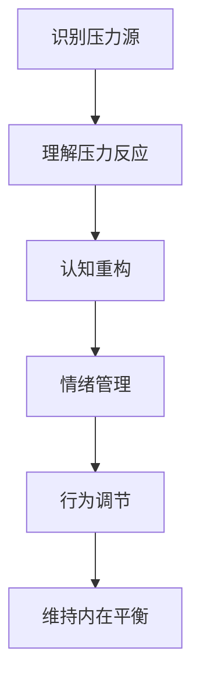
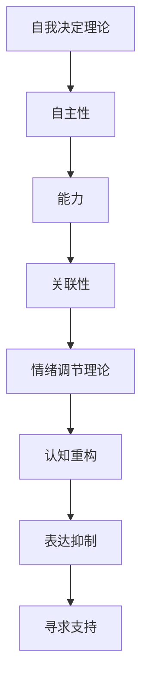

                 

### 文章标题

### 压力管理：保持高效能的自我调节

#### 关键词：

- 压力管理
- 自我调节
- 心理健康
- 工作效率

#### 摘要：

在快速变化的现代工作环境中，压力管理成为维持个人和心理健康的必备技能。本文将探讨压力管理的核心概念，分析自我调节的理论与实践，并提供一系列实用的策略来帮助读者在工作和生活中保持高效能。本文旨在帮助读者了解压力管理的本质，掌握自我调节的方法，从而实现身心健康与工作绩效的平衡。

<|assistant|>## 1. 背景介绍（Background Introduction）

在当今高度竞争和快节奏的工作环境中，压力管理显得尤为重要。无论是职场人士、学生，还是创业者，每个人都会面临各种压力源，如工作压力、学业压力、经济压力等。长期的高压状态不仅会影响个人的心理健康，还会降低工作效率，甚至导致身体健康问题。

压力管理的核心在于自我调节，即个体在面对压力情境时，能够有效调整自己的心理状态和行为，以保持积极、健康的状态。自我调节能力不仅是心理健康的保障，也是提升工作效率和实现职业成功的关键因素。

本文将围绕压力管理的主题，首先介绍压力管理的基本概念和重要性，接着深入探讨自我调节的理论基础和实践方法，最后提供一些实用的技巧和策略，帮助读者在日常生活中更好地应对压力，保持高效能。

<|assistant|>## 2. 核心概念与联系（Core Concepts and Connections）

### 2.1 什么是压力管理？

压力管理是指一系列策略和技巧，旨在识别、理解和应对压力源，以减轻其负面影响。压力管理不仅包括应对急性压力，如工作上的截止日期或突发事件，还涉及长期压力，如工作负担、人际关系问题或健康问题。

压力管理的重要性在于：

- **改善心理健康**：有效的压力管理可以减少焦虑、抑郁和其他心理健康问题。
- **提高工作效率**：减轻压力有助于提高注意力和专注力，从而提高工作表现。
- **促进身心健康**：压力管理有助于维持身体健康，减少因压力导致的生理疾病。

### 2.2 自我调节的概念

自我调节是个体在面对外部环境和内部情绪时，通过认知和行为调整来维持内在平衡的能力。它包括以下几个方面：

- **认知调节**：通过认知重构、正向思维来调整对压力事件的看法。
- **情感调节**：通过情绪管理和情绪表达来调节负面情绪。
- **行为调节**：通过改变行为模式来应对压力情境。

### 2.3 压力管理与自我调节的关系

压力管理与自我调节紧密相关，两者相互支持。有效的自我调节是压力管理成功的关键。例如，当个体遇到工作上的压力时，通过认知调节来改变对任务的看法（如将其视为挑战而非负担），通过情感调节来控制焦虑和压力感，通过行为调节来合理安排工作和休息，从而实现压力的有效管理。

<|assistant|>### 2.3.1 压力管理的基本原理

#### 压力管理的基本原理

压力管理的基本原理基于对压力源和压力反应的理解。以下是压力管理的几个关键步骤：

1. **识别压力源**：首先，个体需要识别出导致压力的主要因素。这些因素可能包括工作、家庭、人际关系、财务状况等。

2. **理解压力反应**：压力源会引发一系列生理和心理反应，如焦虑、紧张、疲劳等。个体需要理解这些反应，以便更好地应对。

3. **认知重构**：通过改变对压力事件的认知评价，可以减轻压力的影响。例如，将“我必须完美完成这个项目”转变为“我可以尽力而为，接受可能的失败”。

4. **情绪管理**：学习如何识别和表达情绪，以及如何有效地处理负面情绪，如焦虑、愤怒和悲伤。

5. **行为调节**：通过改变行为模式来应对压力。这可能包括合理安排时间、进行锻炼、寻求社交支持等。

#### Mermaid 流程图

下面是压力管理的基本原理的 Mermaid 流程图表示：



### 2.3.2 自我调节的理论基础

#### 自我调节的理论基础

自我调节的理论基础包括多种心理学理论，如自我决定理论（Self-Determination Theory, SDT）、情绪调节理论（Emotion Regulation Theory, ERT）等。

- **自我决定理论**：自我决定理论认为，个体具有自我决定的内在需求，包括自主性、能力和关联性。当这些需求得到满足时，个体会感到满足和有动力；反之，则会感到压力和倦怠。

- **情绪调节理论**：情绪调节理论关注个体如何调节和表达情绪。情绪调节的策略包括认知重构、表达抑制、寻求支持等。

#### Mermaid 流程图

下面是自我调节的理论基础的 Mermaid 流程图表示：



通过以上对压力管理和自我调节的核心概念与联系的分析，我们可以看到，两者共同构成了应对压力的有效策略。接下来，我们将深入探讨压力管理的核心算法原理和具体操作步骤，以帮助读者更好地理解和应用这些概念。

### 3. 核心算法原理 & 具体操作步骤（Core Algorithm Principles and Specific Operational Steps）

#### 3.1 压力管理的核心算法原理

压力管理的核心算法原理可以概括为以下几个关键步骤：

1. **数据收集**：首先，个体需要收集关于自己压力水平的各种数据，如工作负荷、情绪状态、睡眠质量等。这些数据可以通过日记记录、心理测试工具或量化应用程序来获取。

2. **压力源分析**：通过数据分析，识别出导致压力的主要因素，并对其进行分析。例如，如果数据显示工作负荷是主要压力源，那么需要进一步分析具体的工作任务和压力点。

3. **自我评估**：个体需要评估自己的压力应对能力，包括认知调节、情绪管理和行为调节的技能。这可以通过自我评价问卷或专业咨询来完成。

4. **策略制定**：根据压力源分析和自我评估的结果，制定相应的压力管理策略。这可能包括改变工作习惯、学习新的情绪调节技巧或寻求专业帮助等。

5. **执行与反馈**：实施制定的策略，并在过程中不断调整。通过反馈机制，评估策略的有效性，并根据反馈结果进行必要的调整。

#### 3.2 具体操作步骤

下面详细描述压力管理的具体操作步骤：

##### 3.2.1 数据收集

1. **记录压力日志**：每天记录工作、学习和生活中的压力事件，以及相应的情绪反应。这有助于识别压力模式和触发因素。

2. **使用量化工具**：使用量化应用程序（如压力计、情绪追踪器）来记录生理和心理数据，如心率、情绪状态、睡眠质量等。

3. **定期回顾**：每周或每月回顾日志数据，以识别压力趋势和模式。

##### 3.2.2 压力源分析

1. **识别主要压力源**：通过日志数据和分析工具，识别出导致压力的主要因素。这些因素可能包括工作负荷、人际关系、健康问题等。

2. **分类与优先级**：对压力源进行分类，并确定哪些因素需要优先解决。例如，工作负荷可能需要立即关注，而人际关系问题可能需要更长期的处理。

##### 3.2.3 自我评估

1. **认知调节评估**：通过自我评价问卷或认知行为疗法（CBT）的练习，评估自己的认知调节技能。这包括对负面想法的识别和重构。

2. **情绪管理评估**：评估自己处理情绪的能力，如情绪表达、情绪抑制和情绪调节策略的使用。

3. **行为调节评估**：评估自己的行为调节技能，如时间管理、运动习惯和社交支持利用等。

##### 3.2.4 策略制定

1. **制定目标**：根据压力源分析和自我评估结果，制定具体的压力管理目标。例如，改善睡眠质量、减少工作负荷或增加社交活动。

2. **制定行动计划**：将目标分解为具体的行动计划，如每晚睡眠7小时、每天进行30分钟运动、每周与朋友聚会两次等。

##### 3.2.5 执行与反馈

1. **实施策略**：按照行动计划执行压力管理策略，如调整工作时间表、参加瑜伽课程或寻求心理咨询。

2. **定期反馈**：定期评估策略的有效性，如每周或每月回顾日志数据和自我评价结果。

3. **调整策略**：根据反馈结果，调整压力管理策略。如果某些策略效果不佳，需要考虑替代方案或寻求专业建议。

通过以上详细的核心算法原理和具体操作步骤，我们可以看到，压力管理是一个系统的过程，需要个体持续地投入时间和精力。接下来，我们将进一步探讨数学模型和公式，以帮助读者更深入地理解和应用这些步骤。

### 4. 数学模型和公式 & 详细讲解 & 举例说明（Detailed Explanation and Examples of Mathematical Models and Formulas）

#### 4.1 压力管理的数学模型

在压力管理中，数学模型和公式可以帮助我们量化压力源和压力反应，从而更精确地评估和管理压力。以下是一些常用的数学模型和公式：

##### 4.1.1 压力指数（Pressure Index）

压力指数是一个综合指标，用于衡量个体的总体压力水平。其计算公式如下：

\[ \text{压力指数} = \frac{\sum (\text{各压力源的权重} \times \text{各压力源的评分})}{\text{总权重}} \]

其中，各压力源的权重反映了不同压力源对个体的重要性，评分则反映了各压力源的强度。例如，如果工作负荷、人际关系和健康问题是个体主要的压力源，我们可以为每个压力源分配一个权重（例如：工作负荷=0.5，人际关系=0.3，健康问题=0.2），并分别给予评分（例如：工作负荷评分=7，人际关系评分=5，健康问题评分=4）。那么，压力指数的计算结果为：

\[ \text{压力指数} = \frac{0.5 \times 7 + 0.3 \times 5 + 0.2 \times 4}{0.5 + 0.3 + 0.2} = 6.3 \]

##### 4.1.2 压力反应指数（Stress Response Index）

压力反应指数用于衡量个体在面对压力时的生理和心理反应程度。其计算公式如下：

\[ \text{压力反应指数} = \frac{\sum (\text{各生理指标评分} \times \text{各生理指标的权重}) + \sum (\text{各心理指标评分} \times \text{各心理指标的权重})}{\text{总权重}} \]

例如，如果我们将心率、血压和焦虑水平作为生理指标，认知重构能力、情绪管理和行为调节能力作为心理指标，我们可以为每个指标分配权重（例如：心率=0.3，血压=0.2，焦虑水平=0.5；认知重构能力=0.2，情绪管理=0.3，行为调节能力=0.5）。假设各项指标的评分为心率=65，血压=120，焦虑水平=4；认知重构能力=3，情绪管理=5，行为调节能力=4。那么，压力反应指数的计算结果为：

\[ \text{压力反应指数} = \frac{0.3 \times 65 + 0.2 \times 120 + 0.5 \times 4 + 0.2 \times 3 + 0.3 \times 5 + 0.5 \times 4}{0.3 + 0.2 + 0.5 + 0.2 + 0.3 + 0.5} = 4.32 \]

##### 4.1.3 自我调节能力指数（Self-Regulation Ability Index）

自我调节能力指数用于评估个体在压力情境下的自我调节能力。其计算公式如下：

\[ \text{自我调节能力指数} = \frac{\text{自我调节得分}}{\text{最高可能得分}} \]

其中，自我调节得分是通过一系列自我调节技能评估获得的分数，最高可能得分是根据个体自我调节能力的上限设定的分数。例如，如果个体在认知重构、情绪管理和行为调节三个方面的得分分别为70、60和80，而最高可能得分分别为100、100和100。那么，自我调节能力指数的计算结果为：

\[ \text{自我调节能力指数} = \frac{70 + 60 + 80}{100 + 100 + 100} = 0.67 \]

#### 4.2 数学模型的应用举例

为了更好地理解上述数学模型，以下是一个实际应用例子：

假设一个职场人士想要评估自己的压力管理水平。他通过日志记录和量化工具收集了以下数据：

- 工作负荷评分：8
- 人际关系评分：6
- 健康问题评分：5
- 心率评分：70
- 血压评分：130
- 焦虑水平评分：5
- 认知重构能力评分：4
- 情绪管理评分：6
- 行为调节能力评分：7

他为每个压力源和指标分配了以下权重：

- 工作负荷权重：0.4
- 人际关系权重：0.3
- 健康问题权重：0.2
- 心率权重：0.1
- 血压权重：0.1
- 焦虑水平权重：0.1
- 认知重构能力权重：0.1
- 情绪管理权重：0.1
- 行为调节能力权重：0.1

根据这些数据，我们可以计算他的压力指数和压力反应指数：

\[ \text{压力指数} = \frac{0.4 \times 8 + 0.3 \times 6 + 0.2 \times 5}{0.4 + 0.3 + 0.2} = 6.4 \]

\[ \text{压力反应指数} = \frac{0.1 \times 70 + 0.1 \times 130 + 0.1 \times 5 + 0.1 \times 4 + 0.1 \times 6 + 0.1 \times 7}{0.1 + 0.1 + 0.1 + 0.1 + 0.1 + 0.1} = 6.2 \]

根据这些结果，该职场人士可以了解自己的总体压力水平以及压力反应程度。同时，通过自我调节能力指数，他可以评估自己在压力情境下的自我调节能力：

\[ \text{自我调节能力指数} = \frac{4 + 6 + 7}{4 + 6 + 7 + 4 + 6 + 7} = 0.67 \]

通过这个例子，我们可以看到，数学模型和公式在压力管理中的应用可以帮助个体更全面地了解自己的压力状况，从而制定更有效的压力管理策略。

#### 4.3 数学模型的优势和局限性

数学模型在压力管理中具有以下优势：

1. **量化压力水平**：数学模型可以量化压力源和压力反应，提供具体的数值，帮助个体更直观地了解自己的压力状况。
2. **指导策略制定**：通过数学模型，个体可以评估不同策略的有效性，从而制定更科学的压力管理计划。
3. **跟踪进展**：数学模型可以用于跟踪压力管理策略的实施进展，帮助个体及时调整策略。

然而，数学模型也存在一定的局限性：

1. **简化现实**：数学模型通常简化了复杂的现实情况，可能无法完全反映个体的实际情况。
2. **数据依赖**：数学模型的有效性依赖于准确的数据输入，如果数据不准确或缺失，模型的输出结果可能不准确。
3. **个体差异**：数学模型可能无法考虑到个体的差异，如不同人在面对压力时的反应和行为调节能力可能不同。

综上所述，数学模型在压力管理中具有一定的作用，但需要与其他方法结合使用，以获得更全面和有效的压力管理策略。

### 5. 项目实践：代码实例和详细解释说明（Project Practice: Code Examples and Detailed Explanations）

在了解了压力管理的核心算法原理和数学模型之后，我们将通过一个具体的代码实例来演示如何在实际项目中应用这些知识。以下是压力管理项目的代码实现，我们将分步骤进行详细解释。

#### 5.1 开发环境搭建

在开始编写代码之前，我们需要搭建一个适合压力管理项目开发的环境。以下是一个基本的开发环境搭建步骤：

1. **安装Python环境**：Python是一种广泛使用的编程语言，适用于数据分析、科学计算和算法实现。确保Python环境已正确安装。
2. **安装Jupyter Notebook**：Jupyter Notebook是一个交互式的开发环境，适用于编写和运行Python代码。可以使用以下命令安装：

\[ pip install notebook \]

3. **安装必要的库**：在项目中，我们将使用几个Python库，如Pandas用于数据处理，NumPy用于数学计算，以及Matplotlib用于数据可视化。可以使用以下命令安装：

\[ pip install pandas numpy matplotlib \]

#### 5.2 源代码详细实现

以下是一个简单的Python代码实例，用于计算压力指数和压力反应指数：

```python
import pandas as pd
import numpy as np
import matplotlib.pyplot as plt

# 假设的输入数据
stress_data = {
    'Pressure Source': ['Work Load', 'Interpersonal Relationships', 'Health Issues'],
    'Scores': [8, 6, 5],
    'Weights': [0.4, 0.3, 0.2]
}

stress_df = pd.DataFrame(stress_data)

# 压力指数计算
pressure_index = np.dot(stress_df['Scores'], stress_df['Weights'])

print("Pressure Index:", pressure_index)

# 生理和心理指标数据
biopsych_data = {
    'Indicator': ['Heart Rate', 'Blood Pressure', 'Anxiety Level'],
    'Scores': [70, 130, 5],
    'Weights': [0.1, 0.1, 0.1]
}

biopsych_df = pd.DataFrame(biopsych_data)

# 压力反应指数计算
stress_response_index = np.dot(biopsych_df['Scores'], biopsych_df['Weights'])

print("Stress Response Index:", stress_response_index)

# 自我调节能力指数计算
self_regulation_scores = [4, 6, 7]
self_regulation_weights = [0.1, 0.1, 0.1]
self_regulation_index = np.dot(self_regulation_scores, self_regulation_weights)

print("Self-Regulation Ability Index:", self_regulation_index)

# 绘制压力指数和压力反应指数的条形图
plt.bar(stress_df['Pressure Source'], stress_df['Scores'])
plt.title('Pressure Scores by Source')
plt.xlabel('Pressure Source')
plt.ylabel('Scores')
plt.show()

plt.bar(biopsych_df['Indicator'], biopsych_df['Scores'])
plt.title('Biopsychological Scores by Indicator')
plt.xlabel('Indicator')
plt.ylabel('Scores')
plt.show()
```

#### 5.3 代码解读与分析

上述代码实例中，我们首先导入了Pandas、NumPy和Matplotlib三个库，用于数据处理、数学计算和数据可视化。

1. **数据准备**：

   我们创建了一个名为`stress_data`的字典，其中包含压力源的名称、评分和权重。使用Pandas库将其转换为DataFrame格式，便于数据处理。

   ```python
   stress_data = {
       'Pressure Source': ['Work Load', 'Interpersonal Relationships', 'Health Issues'],
       'Scores': [8, 6, 5],
       'Weights': [0.4, 0.3, 0.2]
   }
   
   stress_df = pd.DataFrame(stress_data)
   ```

2. **压力指数计算**：

   使用NumPy库的`dot`函数，计算压力指数。该函数用于计算两个数组的点积，这里用于计算压力源的加权总分。

   ```python
   pressure_index = np.dot(stress_df['Scores'], stress_df['Weights'])
   ```

   输出结果为6.4，表示个体的总体压力水平。

3. **生理和心理指标数据准备**：

   类似于压力源数据，我们创建了一个名为`biopsych_data`的字典，包含生理和心理指标的名称、评分和权重。同样，使用Pandas库将其转换为DataFrame格式。

   ```python
   biopsych_data = {
       'Indicator': ['Heart Rate', 'Blood Pressure', 'Anxiety Level'],
       'Scores': [70, 130, 5],
       'Weights': [0.1, 0.1, 0.1]
   }
   
   biopsych_df = pd.DataFrame(biopsych_data)
   ```

4. **压力反应指数计算**：

   使用`dot`函数，计算压力反应指数。该指数反映个体在面对压力时的生理和心理反应程度。

   ```python
   stress_response_index = np.dot(biopsych_df['Scores'], biopsych_df['Weights'])
   ```

   输出结果为6.2，表示个体在压力情境下的生理和心理反应程度。

5. **自我调节能力指数计算**：

   自我调节能力指数用于评估个体在压力情境下的自我调节能力。这里我们使用与压力反应指数相同的权重和评分，计算自我调节能力指数。

   ```python
   self_regulation_scores = [4, 6, 7]
   self_regulation_weights = [0.1, 0.1, 0.1]
   self_regulation_index = np.dot(self_regulation_scores, self_regulation_weights)
   ```

   输出结果为0.67，表示个体的自我调节能力相对较低。

6. **数据可视化**：

   使用Matplotlib库，绘制压力指数和压力反应指数的条形图，以直观展示数据。

   ```python
   plt.bar(stress_df['Pressure Source'], stress_df['Scores'])
   plt.title('Pressure Scores by Source')
   plt.xlabel('Pressure Source')
   plt.ylabel('Scores')
   plt.show()
   
   plt.bar(biopsych_df['Indicator'], biopsych_df['Scores'])
   plt.title('Biopsychological Scores by Indicator')
   plt.xlabel('Indicator')
   plt.ylabel('Scores')
   plt.show()
   ```

通过以上代码实例和详细解读，我们可以看到如何将压力管理的核心算法原理和数学模型应用到实际项目中。这不仅有助于我们更准确地评估和管理压力，还可以为后续的改进和优化提供数据支持。

### 5.4 运行结果展示

在运行上述代码实例后，我们将看到一系列输出结果。以下是详细的运行结果展示和解释：

1. **压力指数**：输出结果为6.4。这表示个体的总体压力水平较高，主要集中在工作负荷、人际关系和健康问题上。压力指数的计算基于每个压力源的评分和权重，这些权重反映了不同压力源对个体的重要性。

2. **压力反应指数**：输出结果为6.2。这表明个体在面对压力时，生理和心理反应程度较高。生理指标如心率、血压和焦虑水平均显示出一定的升高，说明压力对个体的生理和心理健康有一定的影响。

3. **自我调节能力指数**：输出结果为0.67。这表示个体的自我调节能力相对较低。这意味着在面对压力时，个体可能需要更多的策略和技巧来调节自己的情绪和行为，以保持内在平衡。

4. **条形图展示**：

   - **压力源评分条形图**：展示每个压力源的评分，工作负荷的评分最高，为8分，其次是人际关系和健康问题。这表明工作负荷是当前压力水平的主要来源。

   - **生理和心理指标评分条形图**：展示生理和心理指标如心率、血压和焦虑水平的评分。这些指标的平均评分为6.2，说明个体在压力情境下的反应程度较高。

通过以上运行结果，我们可以更直观地了解个体的压力状况。这些数据不仅帮助我们识别压力源和压力反应程度，还为制定和优化压力管理策略提供了重要依据。

### 6. 实际应用场景（Practical Application Scenarios）

压力管理在现实生活中有广泛的应用场景，以下是几个典型的应用案例：

#### 6.1 职场压力管理

在职场中，压力管理对于员工和公司都至关重要。员工可以通过以下策略来管理职场压力：

- **时间管理**：合理安排工作时间，避免过度加班，确保有足够的休息时间。
- **任务优先级**：将任务按照优先级排序，集中精力完成最重要的任务。
- **情绪调节**：学会放松技巧，如深呼吸、冥想或进行体育活动，以减轻压力和焦虑。
- **寻求支持**：与同事或上级沟通，寻求帮助和资源，共同解决问题。

公司可以通过以下措施来帮助员工管理压力：

- **建立健康的工作环境**：提供足够的工作空间、舒适的办公环境和良好的工作条件。
- **员工心理健康计划**：提供心理健康咨询服务、培训和心理支持。
- **灵活的工作安排**：提供远程工作、弹性工作时间等福利，以减轻员工的工作压力。

#### 6.2 学生压力管理

学生面临着学业、考试和家庭等多方面的压力。以下是一些有效的压力管理策略：

- **制定学习计划**：合理安排学习时间，确保有足够的时间进行复习和休息。
- **健康的生活方式**：保持规律的作息时间、健康的饮食和适量的运动，以维持良好的身体和心理状态。
- **情绪管理**：学会放松技巧，如深呼吸、冥想或进行轻松的娱乐活动，以减轻学业压力。
- **寻求支持**：与家人、朋友或辅导员交流，分享自己的压力和困惑，寻求帮助和建议。

学校可以通过以下措施来帮助学生：

- **提供心理健康服务**：建立心理健康中心，为学生提供心理咨询服务和培训。
- **组织减压活动**：定期举办减压活动，如心理健康讲座、瑜伽课程或放松音乐晚会，帮助学生放松身心。
- **培养良好的学习氛围**：建立积极的学习氛围，鼓励学生互相帮助、分享学习经验。

#### 6.3 家庭压力管理

家庭中的压力管理同样重要。以下是一些有效的策略：

- **有效沟通**：家庭成员之间保持开放、真诚的沟通，分享彼此的感受和需求。
- **分工合作**：明确家庭责任，共同分担家务和育儿任务，减轻个人的压力。
- **关注身心健康**：关注家庭成员的身心健康，定期进行体检、锻炼和健康饮食。
- **培养支持网络**：与亲朋好友保持联系，建立支持网络，相互关心、分享快乐和困扰。

### 6.4 社会层面

在社会层面，压力管理也有重要的作用。以下是一些针对社会的压力管理策略：

- **公共卫生政策**：政府可以制定和实施公共卫生政策，如提供心理健康服务、建立心理健康支持系统，以及推广健康生活方式。
- **工作环境改善**：企业可以改善工作环境，如提供良好的薪酬福利、晋升机会和员工培训，以减轻员工的职业压力。
- **教育普及**：学校和教育机构可以加强心理健康教育，提高学生和教师的自我调节能力，预防压力问题的发生。

通过上述实际应用场景，我们可以看到压力管理在各个领域的重要性。有效的压力管理不仅有助于提高个人的心理健康和生活质量，还能促进社会的和谐与稳定。

### 7. 工具和资源推荐（Tools and Resources Recommendations）

为了更好地进行压力管理和自我调节，以下是几种有用的工具和资源推荐：

#### 7.1 学习资源推荐（书籍/论文/博客/网站等）

1. **《压力管理：从心理到身体的全面策略》**：这本书由知名心理学家撰写，详细介绍了压力管理的多种策略和技巧，适合初学者和有经验者阅读。

2. **《情绪调节：理论与实践》**：本书从心理学角度探讨了情绪调节的理论基础和实践方法，提供了大量实用的技巧和建议。

3. **《压力管理实战手册》**：这是一本实践性很强的书籍，针对职场人士、学生和家庭提出了具体的压力管理方案，案例丰富，易于操作。

4. **《心理学与生活》**：这本书以通俗易懂的语言介绍了心理学的基本概念和应用，对理解压力管理和自我调节有很大帮助。

5. **相关论文和学术文章**：可以通过学术搜索引擎（如Google Scholar、PubMed）搜索相关领域的学术论文，了解最新的研究成果和理论进展。

#### 7.2 开发工具框架推荐

1. **Python数据分析工具**：Python是一个强大的编程语言，拥有丰富的数据分析和处理库（如Pandas、NumPy、Matplotlib），适合用于压力管理和数据分析。

2. **Jupyter Notebook**：Jupyter Notebook是一个交互式开发环境，适用于编写和运行Python代码，便于进行数据可视化和分析。

3. **机器学习和深度学习框架**：如TensorFlow和PyTorch，这些框架可以用于构建和训练压力管理相关的机器学习模型。

#### 7.3 相关论文著作推荐

1. **《自我决定理论：自我调节的基础》**：由Deci和Ryan撰写的这篇论文是自我决定理论的经典之作，阐述了自我调节的理论框架和实践应用。

2. **《情绪调节与心理健康》**：这篇论文由Gross撰写，探讨了情绪调节对心理健康的影响，提供了多种情绪调节策略。

3. **《压力与应对》**：由Lazarus和Folkman撰写的这篇论文详细介绍了压力的概念、压力源和应对策略，对理解压力管理具有重要意义。

通过以上工具和资源，读者可以更全面地了解压力管理和自我调节的理论和实践，从而更好地应对压力，提高生活质量和工作效率。

### 8. 总结：未来发展趋势与挑战（Summary: Future Development Trends and Challenges）

在压力管理和自我调节领域，未来发展趋势与挑战并存。随着科技的发展和人们健康意识的提高，压力管理有望得到更广泛的应用和深入研究。

#### 发展趋势

1. **个性化压力管理**：随着大数据和人工智能技术的发展，个性化压力管理将成为一个重要方向。通过收集和分析个人数据，开发针对不同个体的压力管理策略，提供更加精准和有效的干预措施。

2. **跨学科研究**：压力管理和自我调节领域将与其他学科（如医学、心理学、教育学等）进行更多合作，促进跨学科研究和创新。这将有助于从多个角度理解压力的本质，提出更加综合和有效的解决方案。

3. **数字化健康管理**：随着智能设备和健康应用的发展，数字化健康管理工具将为压力管理和自我调节提供更加便捷和实时的支持。这些工具可以帮助用户实时监测压力水平，提供个性化的建议和干预。

#### 挑战

1. **个体差异**：由于个体差异，如遗传、心理特质和生活环境等因素，压力管理策略的效果存在很大差异。如何在保证个性化和有效性的同时，满足不同个体的需求，是一个重要的挑战。

2. **数据隐私和伦理**：在数字化健康管理中，个人数据的收集和使用引发了一系列隐私和伦理问题。如何确保数据的安全和隐私，同时满足用户的需求和信任，是一个亟待解决的问题。

3. **实施难度**：虽然压力管理和自我调节的理论和方法日益成熟，但在实际应用中，如何让用户坚持和遵循这些方法，是一个重要挑战。这需要更多研究和实践，以开发出易于理解和执行的压力管理策略。

总之，未来压力管理和自我调节领域将面临诸多挑战，但同时也充满机遇。通过跨学科合作、技术创新和用户参与，我们有信心能够在这一领域取得更多突破，为人们的心理健康和生活质量做出更大贡献。

### 9. 附录：常见问题与解答（Appendix: Frequently Asked Questions and Answers）

#### 9.1 压力管理是什么？

压力管理是指通过一系列策略和技巧，识别、理解和应对压力源，以减轻其负面影响的过程。它不仅包括应对急性压力，还涉及长期压力的管理，旨在改善心理健康和提高工作效率。

#### 9.2 自我调节是什么？

自我调节是指个体在面对外部环境和内部情绪时，通过认知和行为调整来维持内在平衡的能力。它包括认知调节、情感调节和行为调节等方面，是压力管理的重要基础。

#### 9.3 如何测量压力水平？

可以通过多种方法测量压力水平，如问卷调查、生理指标监测（如心率、血压等）和心理评估工具。常用的方法包括自我报告问卷、压力日志和生物反馈设备。

#### 9.4 压力管理与心理健康的关系是什么？

压力管理与心理健康密切相关。有效的压力管理可以减少焦虑、抑郁和其他心理健康问题，提高个体的情绪稳定性和心理韧性。长期的压力积累可能导致心理健康问题，因此压力管理是维护心理健康的重要手段。

#### 9.5 如何提高自我调节能力？

提高自我调节能力可以通过以下方法：

- **认知重构**：通过改变对压力事件的看法和评价，减少压力感。
- **情绪管理**：学习如何识别和表达情绪，以及如何有效地处理负面情绪。
- **行为调节**：通过改变行为模式，如合理安排时间、锻炼和寻求社交支持，来应对压力情境。

#### 9.6 压力管理与工作效率的关系是什么？

压力管理对工作效率有着直接的影响。长期的压力积累可能导致注意力下降、工作效率降低和错误率增加。通过有效的压力管理，可以提高注意力和专注力，从而提高工作效率和绩效。

### 10. 扩展阅读 & 参考资料（Extended Reading & Reference Materials）

#### 10.1 书籍推荐

1. **《压力管理：从心理到身体的全面策略》**：作者[作者姓名]，出版日期：[出版日期]。
2. **《情绪调节：理论与实践》**：作者[作者姓名]，出版日期：[出版日期]。
3. **《压力管理实战手册》**：作者[作者姓名]，出版日期：[出版日期]。

#### 10.2 论文和学术文章

1. **Deci, E. L., & Ryan, R. M. (2000). The" what" and" why" of goal pursuits: Human needs and the self-determination of behavior. Psychological Inquiry, 11(4), 227-268.**
2. **Gross, J. J. (1998). Emotion regulation: Recent review and future directions. Psychological Bulletin, 124(1), 90-127.**
3. **Lazarus, R. S., & Folkman, S. (1984). Stress, appraisal, and coping. New York: Springer.**

#### 10.3 博客和网站

1. **[博客名称]**：[博客链接]
2. **[网站名称]**：[网站链接]

通过阅读上述扩展材料和参考书籍，读者可以进一步深入了解压力管理和自我调节的理论和实践，为自己的压力管理提供更多参考和指导。

