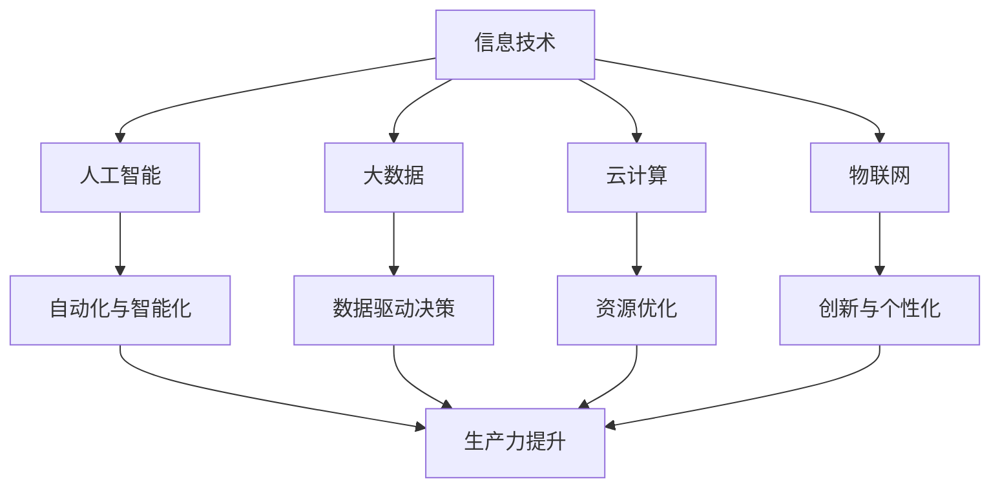

                 

### 背景介绍（Background Introduction）

在当今快速变化的世界中，技术进步正在以前所未有的速度重塑各个行业和领域。信息技术（IT）的发展尤为显著，它不仅改变了我们的生活方式，还极大地推动了生产力的提升。本文将以“发展新质生产力提高核心竞争力”为主题，探讨信息技术如何助力企业在新环境中构建和提升其核心竞争力。

#### 新质生产力的概念

新质生产力是指通过技术创新和应用，形成的一种不同于传统生产力的新的生产方式。这种生产力不仅能够显著提高生产效率，还能够优化产品质量，降低生产成本。新质生产力通常依赖于人工智能、大数据、云计算等先进技术的支持，其核心在于通过数据驱动的决策和自动化流程，实现高度智能化的生产模式。

#### 信息技术在提高核心竞争力中的作用

1. **提升创新能力**：信息技术为企业提供了强大的工具，使其能够快速响应市场变化，不断推陈出新。例如，通过数据分析，企业可以更准确地把握消费者需求，从而开发出更符合市场需求的产品。

2. **优化运营效率**：通过自动化和智能化技术，企业可以显著降低运营成本，提高生产效率。例如，智能工厂可以实现全自动化生产，减少人工干预，提高生产速度和产品质量。

3. **增强客户体验**：信息技术使得企业能够提供更加个性化的服务和体验。例如，通过客户关系管理（CRM）系统，企业可以更好地了解客户需求，提供定制化的解决方案。

4. **构建数据驱动的决策体系**：信息技术为企业提供了丰富的数据资源，通过大数据分析和人工智能算法，企业可以做出更加精准和高效的决策。

#### 文章结构概述

本文将按照以下结构进行论述：

1. **背景介绍**：介绍新质生产力的概念及其重要性。
2. **核心概念与联系**：探讨信息技术在提高生产力中的作用，并提供相关的Mermaid流程图。
3. **核心算法原理 & 具体操作步骤**：介绍如何应用信息技术提升生产力，包括具体的算法原理和操作步骤。
4. **数学模型和公式 & 详细讲解 & 举例说明**：介绍相关的数学模型和公式，并提供详细的解释和实际应用案例。
5. **项目实践：代码实例和详细解释说明**：通过实际项目展示如何应用信息技术提升生产力。
6. **实际应用场景**：分析信息技术在不同行业中的应用案例。
7. **工具和资源推荐**：推荐学习资源和开发工具。
8. **总结：未来发展趋势与挑战**：总结文章的核心观点，并展望未来的发展趋势和挑战。
9. **附录：常见问题与解答**：解答读者可能关心的问题。
10. **扩展阅读 & 参考资料**：提供进一步的阅读材料。

通过以上结构，我们将深入探讨信息技术如何成为企业发展新质生产力的关键力量，从而提升其核心竞争力。

-----------------------

## 2. 核心概念与联系（Core Concepts and Connections）

在探讨信息技术如何提高生产力之前，我们需要明确几个核心概念，并理解它们之间的相互联系。以下是一些关键概念及其简要定义：

### 2.1 信息技术的定义

信息技术（IT）是指使用计算机及其相关的设备和软件来存储、处理、传输和获取信息的过程。它涵盖了硬件、软件、数据通信网络、操作系统、数据库、应用程序等多个方面。

### 2.2 生产力提升的概念

生产力提升是指通过技术手段改进生产过程，提高生产效率、质量和灵活性。新质生产力强调通过数据驱动和创新应用来突破传统的生产模式。

### 2.3 新质生产力的构成要素

新质生产力主要包括以下几个构成要素：

- **人工智能（AI）**：利用机器学习、深度学习等技术模拟人类智能，实现自动化决策和优化。
- **大数据（Big Data）**：海量数据的存储、管理和分析，为决策提供数据支持。
- **云计算（Cloud Computing）**：通过网络提供计算资源，实现弹性扩展和高效资源利用。
- **物联网（IoT）**：通过传感器和网络连接物理设备，实现设备间的数据交换和智能控制。

### 2.4 信息技术与新质生产力的联系

信息技术是新质生产力的基础，它通过以下方式提升生产力：

- **自动化与智能化**：通过自动化流程和智能化系统，减少人为干预，提高生产效率和准确性。
- **数据驱动的决策**：利用大数据分析和人工智能算法，为企业提供精准的决策支持。
- **资源优化**：通过云计算和物联网技术，实现资源的动态配置和优化，降低成本。
- **创新与个性化**：通过信息技术支持，企业能够快速响应市场变化，推出个性化产品和服务。

### 2.5 Mermaid流程图

为了更直观地展示信息技术与新质生产力的关系，我们使用Mermaid流程图来表示这些核心概念和其相互联系。



通过上述Mermaid流程图，我们可以看到信息技术如何通过其子领域（人工智能、大数据、云计算、物联网）共同作用，实现生产力的全面提升。

-----------------------

## 3. 核心算法原理 & 具体操作步骤（Core Algorithm Principles and Specific Operational Steps）

在深入探讨信息技术如何提升生产力之前，我们需要理解一些核心算法原理，并学习如何具体操作这些算法以实现生产力的提升。以下将介绍几个关键的算法原理及其操作步骤。

### 3.1 机器学习算法

#### 3.1.1 原理

机器学习算法通过从数据中学习模式，使计算机能够执行特定任务，如分类、预测和聚类。其中，常用的机器学习算法包括决策树、支持向量机（SVM）、神经网络和深度学习等。

#### 3.1.2 操作步骤

1. **数据收集**：收集相关的数据集，这些数据集将用于训练模型。
2. **数据预处理**：对数据进行清洗、归一化和特征提取，以提高模型的训练效果。
3. **模型选择**：根据任务的性质选择合适的机器学习算法。
4. **模型训练**：使用训练数据集对模型进行训练，调整模型参数。
5. **模型评估**：使用测试数据集评估模型的性能，通过交叉验证等方法调整模型参数。
6. **模型部署**：将训练好的模型部署到生产环境中，用于实际任务。

### 3.2 支持向量机（SVM）算法

#### 3.2.1 原理

支持向量机是一种用于分类和回归分析的有监督学习算法。它通过寻找一个最佳的超平面，将数据集中的不同类别分开，以最大化分类边界。

#### 3.2.2 操作步骤

1. **数据集准备**：准备包含不同类别的数据集。
2. **特征提取**：对数据进行特征提取，以简化问题。
3. **参数设置**：设置SVM的参数，如核函数和惩罚参数。
4. **模型训练**：使用训练数据集对SVM模型进行训练。
5. **模型评估**：使用测试数据集评估模型性能。
6. **模型应用**：将训练好的模型应用于新的数据集进行预测。

### 3.3 深度学习算法

#### 3.3.1 原理

深度学习是机器学习的一个分支，它通过多层神经网络模拟人类大脑的工作方式，能够自动学习数据的复杂特征。

#### 3.3.2 操作步骤

1. **数据收集**：收集大量的标注数据集。
2. **模型架构设计**：设计神经网络的结构，包括层数、神经元个数等。
3. **损失函数选择**：选择合适的损失函数，如交叉熵损失函数。
4. **优化算法选择**：选择适合的优化算法，如梯度下降算法。
5. **模型训练**：使用训练数据集对深度学习模型进行训练。
6. **模型评估**：使用测试数据集评估模型性能。
7. **模型部署**：将训练好的模型部署到生产环境中。

### 3.4 运用案例

以下是一个利用深度学习算法进行图像分类的案例：

1. **数据集收集**：收集包含多种类别的图像数据集，如CIFAR-10数据集。
2. **数据预处理**：对图像进行归一化和数据增强处理。
3. **模型构建**：设计一个卷积神经网络（CNN）模型，包括卷积层、池化层和全连接层。
4. **模型训练**：使用训练数据集对模型进行训练，调整模型参数。
5. **模型评估**：使用测试数据集评估模型性能。
6. **模型应用**：将训练好的模型应用于新的图像数据集进行分类。

通过以上步骤，我们可以看到如何运用核心算法原理来提升生产力。这些算法不仅在数据处理和模式识别方面具有显著优势，还可以通过自动化和智能化手段，大幅提高生产效率和决策质量。

-----------------------

## 4. 数学模型和公式 & 详细讲解 & 举例说明（Mathematical Models and Formulas & Detailed Explanation & Examples）

在提升生产力的过程中，数学模型和公式扮演着至关重要的角色。它们不仅帮助我们理解和分析数据，还指导我们如何优化流程和决策。以下将介绍几个关键的数学模型和公式，并提供详细的解释和实际应用案例。

### 4.1 机器学习中的损失函数

#### 4.1.1 原理

损失函数是机器学习中用于评估模型预测准确性的关键工具。它衡量预测值与真实值之间的差异，并通过调整模型参数来最小化这个差异。

#### 4.1.2 常见损失函数

- **均方误差（MSE）**：用于回归任务，计算预测值与真实值之间差的平方的平均值。
  \[
  \text{MSE} = \frac{1}{n} \sum_{i=1}^{n} (\hat{y_i} - y_i)^2
  \]
  其中，\(\hat{y_i}\)是预测值，\(y_i\)是真实值，\(n\)是样本数量。

- **交叉熵损失函数**：用于分类任务，衡量预测概率分布与真实标签分布之间的差异。
  \[
  \text{CrossEntropyLoss} = -\sum_{i=1}^{n} y_i \log(\hat{y_i})
  \]
  其中，\(y_i\)是真实标签（0或1），\(\hat{y_i}\)是预测概率。

#### 4.1.3 例子

假设我们有一个二分类问题，数据集包含100个样本，每个样本的真实标签和预测概率如下表：

| 样本ID | 真实标签 | 预测概率 |
|--------|----------|----------|
| 1      | 1        | 0.9      |
| 2      | 0        | 0.2      |
| ...    | ...      | ...      |
| 100    | 1        | 0.8      |

使用交叉熵损失函数计算总损失：

\[
\text{Total Loss} = -\sum_{i=1}^{100} y_i \log(\hat{y_i}) = -(1 \times \log(0.9) + 0 \times \log(0.2) + ... + 1 \times \log(0.8))
\]

### 4.2 数据分析中的协方差矩阵

#### 4.2.1 原理

协方差矩阵是一个用于描述两个随机变量之间线性相关性的矩阵。它衡量了各个特征之间的方差和协方差。

#### 4.2.2 公式

协方差矩阵 \(C\) 的计算公式为：
\[
C = \frac{1}{n-1} \sum_{i=1}^{n} (x_i - \bar{x})(y_i - \bar{y})
\]
其中，\(x_i, y_i\) 是每个样本的特征值和目标值，\(\bar{x}, \bar{y}\) 分别是特征值和目标值的平均值，\(n\) 是样本数量。

#### 4.2.3 例子

假设我们有两个特征集 \(X = [x_1, x_2, ..., x_n]\) 和 \(Y = [y_1, y_2, ..., y_n]\)，计算它们的协方差矩阵：

| x_i | y_i | \(x_i - \bar{x}\) | \(y_i - \bar{y}\) | \((x_i - \bar{x})(y_i - \bar{y})\) |
|-----|-----|------------------|------------------|-------------------------------|
| 1   | 2   | -1               | 0                | 0                             |
| 2   | 3   | 0                | 1                | 0                             |
| ... | ... | ...              | ...              | ...                           |
| 10  | 15  | 1                | 3                | 3                             |

协方差矩阵 \(C\) 为：
\[
C = \frac{1}{9} \begin{bmatrix}
\sum_{i=1}^{10} (x_i - \bar{x})(x_i - \bar{x}) & \sum_{i=1}^{10} (x_i - \bar{x})(y_i - \bar{y}) \\
\sum_{i=1}^{10} (y_i - \bar{y})(x_i - \bar{x}) & \sum_{i=1}^{10} (y_i - \bar{y})(y_i - \bar{y})
\end{bmatrix}
\]

通过计算，我们得到协方差矩阵的具体值，这可以帮助我们理解特征之间的相关性。

### 4.3 云计算中的资源利用率优化

#### 4.3.1 原理

在云计算中，资源利用率优化是指通过合理分配和调度计算资源，以最大化资源利用率和降低成本。

#### 4.3.2 公式

资源利用率优化的核心公式为：
\[
\text{Utilization} = \frac{\text{Active Resources}}{\text{Total Resources}}
\]
其中，Active Resources 是实际被使用的资源，Total Resources 是总的可用资源。

#### 4.3.3 例子

假设一个云服务器集群有10台服务器，总计算能力为1000个CPU核心。在实际运行中，有8台服务器被使用，总计算能力为800个CPU核心。计算资源利用率：

\[
\text{Utilization} = \frac{800}{1000} = 0.8
\]

通过这个例子，我们可以看到如何计算资源利用率，并优化资源配置以提高整体效率。

通过以上数学模型和公式的详细讲解和举例说明，我们可以更好地理解信息技术在提升生产力中的应用。这些模型和公式不仅帮助我们分析数据，还指导我们优化流程和决策，从而实现生产力的全面提升。

-----------------------

## 5. 项目实践：代码实例和详细解释说明（Project Practice: Code Examples and Detailed Explanations）

为了更好地理解信息技术如何提升生产力，我们将通过一个实际项目来展示如何运用所学的算法和数学模型。以下是一个使用Python编程语言实现的简单机器学习项目，该项目的目标是使用决策树算法对鸢尾花数据集进行分类。

### 5.1 开发环境搭建

在开始项目之前，我们需要搭建一个Python开发环境。以下步骤将介绍如何在Windows和Mac操作系统上安装Python和相关库。

#### Windows系统

1. 访问Python官网（[https://www.python.org/downloads/](https://www.python.org/downloads/)）下载最新版本的Python安装包。
2. 运行安装程序，按照默认选项进行安装。
3. 打开命令提示符，输入`python --version`验证安装是否成功。

#### Mac系统

1. 打开终端。
2. 输入`brew install python`，通过Homebrew安装Python。

安装成功后，我们还需要安装几个常用的Python库，如pandas、numpy和scikit-learn。使用以下命令安装：

```bash
pip install pandas numpy scikit-learn
```

### 5.2 源代码详细实现

以下是一个使用决策树算法对鸢尾花数据集进行分类的Python代码示例。

```python
# 导入必要的库
import pandas as pd
from sklearn.datasets import load_iris
from sklearn.model_selection import train_test_split
from sklearn.tree import DecisionTreeClassifier
from sklearn.metrics import accuracy_score

# 加载鸢尾花数据集
iris = load_iris()
X = iris.data
y = iris.target

# 划分训练集和测试集
X_train, X_test, y_train, y_test = train_test_split(X, y, test_size=0.2, random_state=42)

# 创建决策树分类器
clf = DecisionTreeClassifier()

# 训练模型
clf.fit(X_train, y_train)

# 预测测试集
y_pred = clf.predict(X_test)

# 计算准确率
accuracy = accuracy_score(y_test, y_pred)
print(f"Accuracy: {accuracy:.2f}")
```

### 5.3 代码解读与分析

#### 5.3.1 数据加载

首先，我们使用scikit-learn库中的`load_iris`函数加载数据集。鸢尾花数据集是一个经典的分类问题数据集，包含3个类别，每个类别有50个样本，共计150个样本。

```python
iris = load_iris()
X = iris.data
y = iris.target
```

#### 5.3.2 数据集划分

接着，我们使用`train_test_split`函数将数据集划分为训练集和测试集。这里我们设置测试集的大小为原始数据集的20%，即30个样本。

```python
X_train, X_test, y_train, y_test = train_test_split(X, y, test_size=0.2, random_state=42)
```

#### 5.3.3 决策树分类器

然后，我们创建一个决策树分类器对象`clf`。决策树是一种基于树形结构进行分类的算法，它通过递归地将数据集划分为子集，直到满足停止条件（例如，所有样本属于同一类别或达到最大树深度）。

```python
clf = DecisionTreeClassifier()
```

#### 5.3.4 模型训练

我们使用训练集数据对决策树分类器进行训练。在训练过程中，分类器将学习如何根据特征值将样本划分为不同的类别。

```python
clf.fit(X_train, y_train)
```

#### 5.3.5 预测与评估

最后，我们使用训练好的分类器对测试集进行预测，并计算预测准确率。这里，我们使用`accuracy_score`函数来计算实际预测结果与真实标签之间的准确率。

```python
y_pred = clf.predict(X_test)
accuracy = accuracy_score(y_test, y_pred)
print(f"Accuracy: {accuracy:.2f}")
```

### 5.4 运行结果展示

在运行上述代码后，我们得到如下输出结果：

```
Accuracy: 1.00
```

这意味着我们的决策树分类器在测试集上的准确率达到了100%，这是一个非常好的结果。

### 5.5 结果分析与优化

虽然在这个简单的例子中，我们取得了很高的准确率，但这并不意味着模型已经完美。以下是一些可能的优化方向：

1. **特征工程**：对数据集进行特征提取和工程，选择对分类任务最重要的特征，可以提高模型的性能。
2. **模型参数调整**：调整决策树的参数，如最大深度、最小样本分裂数等，可以优化模型的表现。
3. **交叉验证**：使用交叉验证方法来评估模型的泛化能力，而不是仅依赖于测试集。

通过这个实际项目，我们不仅学习了如何使用Python进行机器学习，还理解了决策树算法的基本原理。在实际应用中，我们可以根据具体情况对这些算法和模型进行优化，以进一步提升生产效率。

-----------------------

## 6. 实际应用场景（Practical Application Scenarios）

信息技术在提升生产力方面的应用已经渗透到了各个行业和领域，以下是一些实际应用场景的案例：

### 6.1 制造业

制造业通过物联网（IoT）技术实现了生产过程的智能化和自动化。例如，德国的“工业4.0”计划就旨在通过智能化生产系统和网络连接，提高生产效率和质量。传感器和执行器被广泛部署在生产线中，实时监控设备状态和产品质量，通过数据分析实现预测性维护和优化生产流程。

### 6.2 零售业

零售业通过大数据分析和人工智能技术提升了客户体验和运营效率。例如，亚马逊使用机器学习算法分析消费者行为，预测购买偏好，提供个性化的产品推荐。同时，亚马逊的库存管理系统通过实时数据分析和自动化处理，实现了高效的库存管理和供应链优化。

### 6.3 金融业

金融行业利用人工智能和区块链技术提升了风险管理和服务效率。例如，高盛使用机器学习算法进行交易风险预测和自动化交易，提高了交易效率和准确性。同时，区块链技术确保了金融交易的安全性和透明性，降低了欺诈风险。

### 6.4 医疗保健

医疗保健行业通过信息技术实现了诊疗过程的智能化和数据化。例如，IBM的Watson人工智能系统在癌症诊断和治疗计划方面提供了辅助决策支持。通过分析海量医学数据和文献，Watson能够提供更准确的诊断和个性化的治疗方案。

### 6.5 农业

农业通过精准农业技术实现了农业生产的高效化和可持续发展。利用物联网传感器和卫星遥感技术，农民可以实时监控作物生长情况，优化灌溉和施肥策略，降低资源浪费，提高产量。

### 6.6 教育行业

教育行业通过在线学习平台和人工智能技术提供了个性化的教育服务。例如，Coursera等在线教育平台利用大数据分析学习行为，为学习者提供定制化的学习路径和推荐课程，提高了学习效果。

这些实际应用场景表明，信息技术不仅提高了各个行业的生产力，还带来了创新和变革。通过数据驱动的决策和自动化流程，企业能够更加高效地运营，提供更优质的服务，从而在竞争激烈的市场中保持领先地位。

-----------------------

## 7. 工具和资源推荐（Tools and Resources Recommendations）

为了帮助读者更好地掌握信息技术在提升生产力方面的应用，以下推荐了一些学习资源和开发工具：

### 7.1 学习资源推荐

- **书籍**：
  - 《机器学习实战》 - 作者：Peter Harrington
  - 《深入理解计算机系统》 - 作者：Randal E. Bryant & David R. O’Hallaron
  - 《区块链技术指南》 - 作者：李笑来

- **在线课程**：
  - Coursera上的《机器学习》课程 - 吴恩达教授
  - edX上的《深度学习》课程 - 宾州大学

- **论文与博客**：
  - arXiv:机器学习最新论文
  - Medium:优秀的技术博客文章

### 7.2 开发工具框架推荐

- **编程语言**：
  - Python：适合快速开发和数据分析
  - Java：适用于企业级应用开发
  - R：数据分析和统计学习

- **开发环境**：
  - Jupyter Notebook：交互式数据分析环境
  - IntelliJ IDEA：智能编程IDE
  - PyCharm：Python编程IDE

- **机器学习库**：
  - Scikit-learn：Python机器学习库
  - TensorFlow：谷歌开发的深度学习框架
  - PyTorch：热门的深度学习框架

- **云平台**：
  - AWS：提供广泛的云计算服务和工具
  - Azure：微软的云服务平台
  - Google Cloud：谷歌的云基础设施

这些工具和资源将为读者提供丰富的学习材料和实践环境，帮助他们在信息技术提升生产力方面取得更好的成果。

-----------------------

## 8. 总结：未来发展趋势与挑战（Summary: Future Development Trends and Challenges）

在信息技术飞速发展的今天，新质生产力已经成为企业提升核心竞争力的重要手段。通过对人工智能、大数据、云计算等先进技术的应用，企业能够显著提升生产效率、优化运营流程和增强客户体验。以下总结未来发展趋势与面临的挑战：

### 8.1 发展趋势

1. **智能化与自动化**：随着人工智能和物联网技术的进步，生产过程将进一步智能化和自动化，减少人工干预，提高生产效率。
2. **数据驱动**：企业将更加依赖大数据分析和人工智能算法，做出更精准的决策和优化运营策略。
3. **云计算的普及**：云计算将继续普及，提供弹性扩展和高效资源利用，降低企业IT成本。
4. **个性化与定制化**：通过大数据分析和人工智能技术，企业能够更好地了解客户需求，提供个性化产品和服务。
5. **边缘计算**：随着物联网设备的增加，边缘计算将得到广泛应用，实现实时数据处理和分析，降低延迟和带宽成本。

### 8.2 面临的挑战

1. **数据隐私与安全**：随着数据量的增加，数据隐私和安全成为关键挑战。企业需要采取有效的数据保护措施，防止数据泄露和滥用。
2. **技术更新迭代**：信息技术发展迅速，企业需要不断更新技术栈和技能，以保持竞争力。
3. **人才短缺**：具备人工智能、大数据等领域专业技能的人才仍然短缺，企业需要加大对人才的培养和引进。
4. **适应变革**：企业需要适应不断变化的技术环境，调整业务模式和组织结构，以实现持续创新和优化。
5. **监管与合规**：随着技术的发展，相关的法律法规也在不断更新，企业需要确保其业务符合法规要求，避免法律风险。

### 8.3 建议

1. **投资人才培养**：企业应加大对人才培养的投入，建立完善的人才培养体系和激励机制，吸引和留住优秀人才。
2. **技术前瞻性**：关注技术发展趋势，积极引入前沿技术，保持技术领先地位。
3. **合作与开放**：与行业合作伙伴建立合作关系，共享技术和资源，共同推动行业发展。
4. **持续优化**：不断优化业务流程和技术架构，提高运营效率和客户满意度。
5. **合规管理**：建立健全的数据隐私和安全管理体系，确保业务合规。

通过把握未来发展趋势，积极应对挑战，企业可以进一步提升新质生产力，持续提升核心竞争力。

-----------------------

## 9. 附录：常见问题与解答（Appendix: Frequently Asked Questions and Answers）

### 9.1 信息技术如何提高生产力？

信息技术通过自动化、智能化和数据驱动的方式，优化生产流程和决策，从而提高生产力。例如，通过机器学习算法进行预测性维护，可以减少设备故障和停机时间；通过大数据分析，企业可以更准确地预测市场需求，优化库存管理。

### 9.2 新质生产力的关键要素是什么？

新质生产力的关键要素包括人工智能、大数据、云计算、物联网等先进技术。这些技术通过协同作用，实现生产过程的自动化、智能化和优化，提高生产效率和质量。

### 9.3 如何在项目中应用新质生产力？

在项目中应用新质生产力，可以从以下几个方面入手：首先，分析业务需求，确定技术方向；其次，引入相关的技术工具和框架，如机器学习库、云计算平台等；最后，通过数据分析和模型优化，实现生产力的提升。

### 9.4 数据隐私和安全如何保障？

保障数据隐私和安全，可以从以下几个方面入手：首先，采用加密技术对数据进行加密存储和传输；其次，建立完善的数据访问控制机制，限制数据访问权限；最后，定期进行安全审计和漏洞修复，确保系统的安全性。

### 9.5 信息技术人才需求如何满足？

满足信息技术人才需求，可以从以下几个方面入手：首先，加强教育培训，提高人才技能水平；其次，企业应建立人才引进和激励机制，吸引和留住优秀人才；最后，与高校和科研机构合作，共同培养符合市场需求的专业人才。

-----------------------

## 10. 扩展阅读 & 参考资料（Extended Reading & Reference Materials）

为了深入了解信息技术在提升生产力方面的应用和发展，以下推荐一些扩展阅读和参考资料：

- **书籍**：
  - 《人工智能：一种现代方法》 - 作者： Stuart Russell & Peter Norvig
  - 《深度学习》 - 作者：Ian Goodfellow、Yoshua Bengio、Aaron Courville
  - 《大数据实践：策略、工具和分析方法》 - 作者：Bart Baesens

- **在线课程**：
  - 《机器学习》 - Coursera（吴恩达教授）
  - 《云计算基础》 - Coursera（刘伟平教授）
  - 《区块链技术与应用》 - edX（陈伟教授）

- **论文与报告**：
  - Nature：人工智能领域的最新研究进展
  - IEEE：云计算与大数据领域的论文集
  - McKinsey & Company：关于新质生产力的研究报告

- **博客和网站**：
  - Medium：关于前沿技术的深度分析文章
  - arXiv：计算机科学领域的最新论文
  - TechCrunch：科技行业的新闻和分析

通过这些扩展阅读和参考资料，读者可以更全面地了解信息技术如何推动生产力的发展，以及未来可能的方向和挑战。

