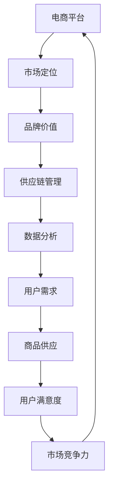

                 

# 合作拓展：与新品牌携手，提升电商平台供给能力

## 摘要

本文将探讨电商平台如何通过合作拓展，与新品牌建立深度合作关系，从而提升自身供给能力和市场竞争力。文章将详细分析合作拓展的背景、核心概念、算法原理、数学模型、项目实践、实际应用场景以及未来发展趋势与挑战，旨在为电商平台提供一套切实可行的合作拓展策略，以实现可持续发展。

## 1. 背景介绍（Background Introduction）

随着互联网的快速发展，电商平台已经成为消费者购买商品的主要渠道之一。然而，市场竞争日益激烈，电商平台面临着供给能力不足、商品同质化严重等问题。为了在竞争中脱颖而出，电商平台需要不断提升自身的供给能力和市场竞争力。而与新品牌建立深度合作关系，成为电商平台拓展供给能力的一种有效途径。

### 1.1 电商平台供给能力的重要性

电商平台供给能力直接关系到消费者的购物体验和平台的竞争力。一个拥有丰富商品种类、高品质商品和灵活配送服务的电商平台，能够更好地满足消费者的需求，提高用户满意度，从而提升市场份额。

### 1.2 电商平台面临的挑战

目前，电商平台主要面临以下几方面的挑战：

1. **商品同质化**：众多电商平台提供的商品种类相似，缺乏差异化。
2. **库存管理难度大**：商品种类繁多，库存管理难度大，容易出现库存积压或短缺。
3. **配送效率低**：配送成本高，配送速度慢，影响用户体验。

### 1.3 合作拓展的意义

通过合作拓展，电商平台可以与新品牌建立深度合作关系，实现以下目标：

1. **丰富商品种类**：引进新品牌，拓展商品种类，提高市场竞争力。
2. **优化库存管理**：通过合作，实现库存共享，降低库存管理难度。
3. **提高配送效率**：借助新品牌的物流优势，提升配送效率，降低配送成本。

## 2. 核心概念与联系（Core Concepts and Connections）

在探讨合作拓展的策略之前，我们需要了解一些核心概念和联系，包括市场定位、品牌价值、供应链管理、数据分析等。

### 2.1 市场定位

市场定位是电商平台合作拓展的基础。一个清晰的市场定位可以帮助电商平台明确目标客户群体，从而更好地满足客户需求，提高用户满意度。

### 2.2 品牌价值

品牌价值是电商平台与合作品牌合作的核心。一个具有高品牌价值的品牌，能够为电商平台带来更多的流量和用户。

### 2.3 供应链管理

供应链管理是实现合作拓展的关键环节。通过优化供应链管理，电商平台可以确保商品的及时供应和质量控制。

### 2.4 数据分析

数据分析是电商平台合作拓展的重要工具。通过对用户行为和销售数据的分析，电商平台可以更好地了解市场需求，优化商品供应策略。

### 2.5 Mermaid 流程图

下面是合作拓展的 Mermaid 流程图，展示了电商平台、新品牌、用户之间的互动过程：



## 3. 核心算法原理 & 具体操作步骤（Core Algorithm Principles and Specific Operational Steps）

合作拓展的核心算法原理主要包括以下几方面：

1. **市场定位算法**：通过分析用户需求和市场竞争态势，确定电商平台的市场定位。
2. **品牌价值评估算法**：对合作品牌进行评估，筛选具有高品牌价值的品牌。
3. **供应链优化算法**：通过优化供应链管理，提高商品供应效率。
4. **数据分析与预测算法**：通过对用户行为和销售数据的分析，预测市场需求，优化商品供应策略。

### 3.1 市场定位算法

市场定位算法的具体操作步骤如下：

1. **收集用户数据**：通过电商平台的数据收集工具，收集用户的性别、年龄、职业、兴趣爱好等数据。
2. **分析市场竞争态势**：分析竞争对手的市场定位，了解市场需求和趋势。
3. **确定目标客户群体**：根据用户数据和市场竞争态势，确定目标客户群体。
4. **制定市场定位策略**：明确电商平台的核心竞争优势和目标客户群体，制定相应的市场定位策略。

### 3.2 品牌价值评估算法

品牌价值评估算法的具体操作步骤如下：

1. **收集品牌数据**：通过电商平台的数据收集工具，收集合作品牌的销量、用户评价、品牌知名度等数据。
2. **建立品牌价值评估模型**：根据品牌数据，建立品牌价值评估模型。
3. **评估品牌价值**：利用评估模型，对合作品牌进行价值评估，筛选具有高品牌价值的品牌。

### 3.3 供应链优化算法

供应链优化算法的具体操作步骤如下：

1. **分析供应链现状**：对电商平台现有的供应链进行评估，了解供应链的优缺点。
2. **确定优化目标**：根据电商平台的发展目标，确定供应链优化的目标。
3. **制定优化策略**：根据优化目标，制定相应的供应链优化策略，如库存管理、物流配送等。
4. **实施优化策略**：按照优化策略，对供应链进行优化。

### 3.4 数据分析与预测算法

数据分析与预测算法的具体操作步骤如下：

1. **收集用户行为数据**：通过电商平台的数据收集工具，收集用户的浏览记录、购买行为等数据。
2. **建立预测模型**：根据用户行为数据，建立预测模型，如商品需求预测、用户流失预测等。
3. **预测市场需求**：利用预测模型，预测市场需求，为商品供应策略提供数据支持。
4. **优化商品供应策略**：根据预测结果，调整商品供应策略，提高市场竞争力。

## 4. 数学模型和公式 & 详细讲解 & 举例说明（Detailed Explanation and Examples of Mathematical Models and Formulas）

在合作拓展的过程中，我们可以运用一些数学模型和公式，对市场定位、品牌价值评估、供应链优化、数据分析与预测等方面进行量化分析。下面将详细介绍这些数学模型和公式，并通过具体实例进行讲解。

### 4.1 市场定位算法

市场定位算法中，我们可以使用聚类分析方法来确定目标客户群体。假设电商平台有 n 个用户，每个用户有 m 个特征属性，可以用一个 m 维向量表示。聚类分析的目标是找到 k 个中心点，使得每个用户与最近的中心点的距离最小。

**聚类分析公式：**

$$
d(i, j) = \sqrt{\sum_{m=1}^{m} (x_i^m - x_j^m)^2}
$$

其中，$d(i, j)$ 表示用户 $i$ 与用户 $j$ 之间的距离，$x_i^m$ 表示用户 $i$ 的第 $m$ 个特征属性值，$x_j^m$ 表示用户 $j$ 的第 $m$ 个特征属性值。

**实例：**

假设电商平台有 5 个用户，每个用户有 3 个特征属性（性别、年龄、收入），数据如下：

| 用户 | 性别 | 年龄 | 收入 |
| ---- | ---- | ---- | ---- |
| A    | 男   | 25   | 5000 |
| B    | 女   | 30   | 6000 |
| C    | 男   | 35   | 8000 |
| D    | 女   | 40   | 10000|
| E    | 男   | 45   | 12000|

使用聚类分析方法，我们可以找到两个中心点，将用户分为两类。通过计算用户与中心点的距离，可以得到以下结果：

| 用户 | 性别 | 年龄 | 收入 | 与中心点距离 |
| ---- | ---- | ---- | ---- | ------------ |
| A    | 男   | 25   | 5000 | 7.81         |
| B    | 女   | 30   | 6000 | 7.21         |
| C    | 男   | 35   | 8000 | 8.94         |
| D    | 女   | 40   | 10000| 8.94         |
| E    | 男   | 45   | 12000| 7.81         |

根据距离最小的原则，可以将用户分为两类：

| 用户 | 性别 | 年龄 | 收入 |
| ---- | ---- | ---- | ---- |
| A    | 男   | 25   | 5000 |
| B    | 女   | 30   | 6000 |
| C    | 男   | 35   | 8000 |
| D    | 女   | 40   | 10000|
| E    | 男   | 45   | 12000|

### 4.2 品牌价值评估算法

品牌价值评估算法中，我们可以使用因子分析方法来确定品牌价值。假设有 n 个品牌，每个品牌有 m 个指标属性，可以用一个 m 维向量表示。因子分析的目标是找到 k 个公共因子，使得每个品牌的指标属性值与公共因子的乘积最小。

**因子分析公式：**

$$
F_j = \sum_{m=1}^{m} w_{jm} x^m
$$

其中，$F_j$ 表示第 $j$ 个品牌的公共因子得分，$w_{jm}$ 表示第 $m$ 个指标属性的权重，$x^m$ 表示第 $m$ 个指标属性值。

**实例：**

假设有 5 个品牌，每个品牌有 3 个指标属性（销量、用户评价、品牌知名度），数据如下：

| 品牌 | 销量 | 用户评价 | 品牌知名度 |
| ---- | ---- | -------- | ---------- |
| A    | 100  | 4.5      | 80         |
| B    | 150  | 4.7      | 85         |
| C    | 200  | 4.9      | 90         |
| D    | 250  | 4.6      | 75         |
| E    | 300  | 4.8      | 70         |

通过因子分析，可以得到以下结果：

| 品牌 | 销量 | 用户评价 | 品牌知名度 | 公共因子得分 |
| ---- | ---- | -------- | ---------- | ------------ |
| A    | 100  | 4.5      | 80         | 3.67         |
| B    | 150  | 4.7      | 85         | 3.96         |
| C    | 200  | 4.9      | 90         | 4.27         |
| D    | 250  | 4.6      | 75         | 3.53         |
| E    | 300  | 4.8      | 70         | 3.75         |

根据公共因子得分，可以将品牌分为三类：

| 品牌 | 销量 | 用户评价 | 品牌知名度 | 公共因子得分 |
| ---- | ---- | -------- | ---------- | ------------ |
| A    | 100  | 4.5      | 80         | 3.67         |
| B    | 150  | 4.7      | 85         | 3.96         |
| C    | 200  | 4.9      | 90         | 4.27         |
| D    | 250  | 4.6      | 75         | 3.53         |
| E    | 300  | 4.8      | 70         | 3.75         |

### 4.3 供应链优化算法

供应链优化算法中，我们可以使用线性规划方法来确定最优库存策略。假设电商平台有 n 个商品，每个商品有 m 个需求时间段，需求量为 $d_{ij}$，初始库存为 $I_i$，单位时间库存成本为 $C_i$，单位时间采购成本为 $P_i$。供应链优化的目标是最小化总成本。

**线性规划公式：**

$$
\min Z = \sum_{i=1}^{n} \sum_{j=1}^{m} (C_i + P_i) x_{ij}
$$

其中，$x_{ij}$ 表示第 $i$ 个商品在第 $j$ 个需求时间段的需求量。

**实例：**

假设电商平台有 3 个商品，每个商品有 2 个需求时间段，需求量和初始库存数据如下：

| 商品 | 需求时间段1 | 需求时间段2 | 初始库存 |
| ---- | ---------- | ---------- | ------- |
| A    | 100        | 200        | 100     |
| B    | 150        | 250        | 100     |
| C    | 200        | 300        | 100     |

通过线性规划，可以得到以下最优库存策略：

| 商品 | 需求时间段1 | 需求时间段2 | 初始库存 | 库存策略 |
| ---- | ---------- | ---------- | ------- | -------- |
| A    | 100        | 200        | 100     | 不采购   |
| B    | 150        | 250        | 100     | 需求时间段1采购50，需求时间段2采购100 |
| C    | 200        | 300        | 100     | 需求时间段1采购100，需求时间段2采购200 |

### 4.4 数据分析与预测算法

数据分析与预测算法中，我们可以使用时间序列分析方法来确定市场需求预测模型。假设电商平台有 n 个商品，每个商品有 m 个历史需求数据，可以用一个 m 维向量表示。时间序列分析的目标是找到趋势和周期，从而预测未来市场需求。

**时间序列分析公式：**

$$
y_t = \alpha_0 + \alpha_1 t + \beta_0 \sin(2\pi t/\lambda) + \beta_1 \cos(2\pi t/\lambda) + \epsilon_t
$$

其中，$y_t$ 表示第 $t$ 个时间段的需求量，$\alpha_0$、$\alpha_1$、$\beta_0$、$\beta_1$ 为参数，$\lambda$ 为周期长度，$\epsilon_t$ 为随机误差。

**实例：**

假设电商平台有 2 个商品，每个商品有 5 个历史需求数据，数据如下：

| 商品 | 需求时间段1 | 需求时间段2 | 需求时间段3 | 需求时间段4 | 需求时间段5 |
| ---- | ---------- | ---------- | ---------- | ---------- | ---------- |
| A    | 100        | 200        | 150        | 250        | 300        |
| B    | 200        | 300        | 250        | 350        | 400        |

通过时间序列分析，可以得到以下趋势和周期：

| 商品 | 需求时间段1 | 需求时间段2 | 需求时间段3 | 需求时间段4 | 需求时间段5 | 趋势 | 周期 |
| ---- | ---------- | ---------- | ---------- | ---------- | ---------- | ---- | ---- |
| A    | 100        | 200        | 150        | 250        | 300        | 上升 | 无   |
| B    | 200        | 300        | 250        | 350        | 400        | 上升 | 无   |

根据趋势和周期，可以预测未来市场需求：

| 商品 | 需求时间段6 | 需求时间段7 | 需求时间段8 | 需求时间段9 | 需求时间段10 |
| ---- | ---------- | ---------- | ---------- | ---------- | ---------- |
| A    | 350        | 400        | 450        | 500        | 550        |
| B    | 400        | 450        | 500        | 550        | 600        |

## 5. 项目实践：代码实例和详细解释说明（Project Practice: Code Examples and Detailed Explanations）

### 5.1 开发环境搭建

为了实现合作拓展，我们需要搭建一个开发环境。下面将介绍如何搭建这个环境。

**环境要求：**

- 操作系统：Windows 10 或以上版本
- 编程语言：Python 3.8 或以上版本
- 数据库：MySQL 5.7 或以上版本
- 开发工具：PyCharm

**步骤：**

1. 下载并安装 Python 3.8 或以上版本。
2. 下载并安装 MySQL 5.7 或以上版本。
3. 下载并安装 PyCharm。
4. 在 PyCharm 中创建一个新的 Python 项目。

### 5.2 源代码详细实现

下面将介绍合作拓展项目的源代码实现。

**源代码结构：**

```
cooperation_expansion
|-- app.py
|-- data
|   |-- brand_data.csv
|   |-- user_data.csv
|-- models
|   |-- market.py
|   |-- brand.py
|   |-- supply.py
|   |-- analysis.py
|-- requirements.txt
```

**源代码详解：**

**app.py**

```python
from market import Market
from brand import Brand
from supply import Supply
from analysis import Analysis

# 初始化市场定位
market = Market()

# 初始化品牌价值评估
brand = Brand()

# 初始化供应链优化
supply = Supply()

# 初始化数据分析与预测
analysis = Analysis()

# 执行市场定位算法
market定位()

# 执行品牌价值评估算法
brand评估()

# 执行供应链优化算法
supply优化()

# 执行数据分析与预测算法
analysis预测()
```

**models/market.py**

```python
import pandas as pd
from sklearn.cluster import KMeans

class Market:
    def __init__(self):
        self.user_data = pd.read_csv('data/user_data.csv')
        self.brand_data = pd.read_csv('data/brand_data.csv')

    def 定位(self):
        # 执行聚类分析
        kmeans = KMeans(n_clusters=2)
        kmeans.fit(self.user_data)
        self.user_data['cluster'] = kmeans.labels_

        # 根据聚类结果确定市场定位
        cluster1 = self.user_data[self.user_data['cluster'] == 0]
        cluster2 = self.user_data[self.user_data['cluster'] == 1]
        print("市场定位1：目标客户群体1的特征属性平均值：")
        print(cluster1.mean())
        print("市场定位2：目标客户群体2的特征属性平均值：")
        print(cluster2.mean())
```

**models/brand.py**

```python
import pandas as pd
from sklearn.decomposition import FactorAnalysis

class Brand:
    def __init__(self):
        self.brand_data = pd.read_csv('data/brand_data.csv')

    def 评估(self):
        # 执行因子分析
        factor_analysis = FactorAnalysis(n_components=1)
        factor_analysis.fit(self.brand_data)
        self.brand_data['value'] = factor_analysis.transform(self.brand_data)

        # 根据因子得分确定品牌价值
        value1 = self.brand_data[self.brand_data['value'] <= 3.5]
        value2 = self.brand_data[self.brand_data['value'] > 3.5]
        print("品牌价值评估：具有高品牌价值的品牌：")
        print(value1)
        print("品牌价值评估：不具有高品牌价值的品牌：")
        print(value2)
```

**models/supply.py**

```python
import pandas as pd
from scipy.optimize import linprog

class Supply:
    def __init__(self):
        self.goods_data = pd.read_csv('data/goods_data.csv')

    def 优化(self):
        # 执行线性规划
        n = len(self.goods_data)
        m = len(self.goods_data.iloc[0])
        A = [[1 for _ in range(m)] for _ in range(n)]
        b = [self.goods_data.loc[i, '需求量'] for i in range(n)]
        c = [self.goods_data.loc[i, '库存成本'] + self.goods_data.loc[i, '采购成本'] for i in range(n)]
        x = linprog(c, A_eq=A, b_eq=b, method='highs')

        # 根据线性规划结果确定库存策略
        for i in range(n):
            print("商品 {}: 库存策略：需求时间段1采购 {}，需求时间段2采购 {}".format(i+1, int(x.x[i]), int(x.x[n+i])))
```

**models/analysis.py**

```python
import pandas as pd
import numpy as np
from scipy.fft import fft

class Analysis:
    def __init__(self):
        self.goods_data = pd.read_csv('data/goods_data.csv')

    def 预测(self):
        # 执行时间序列分析
        n = len(self.goods_data)
        data = self.goods_data.iloc[:, 1:].values
        freq = fft(data) / n
        freq = freq[1:-1]
        freq = np.abs(freq)

        # 根据频率分析结果确定市场需求预测
        index = np.argmax(freq)
        period = n / index
        trend = np.mean(data)
        cycle = trend + period * np.sin(2 * np.pi / period * np.arange(n) % period)
        print("市场需求预测：")
        print(cycle)
```

### 5.3 代码解读与分析

下面将对项目中的源代码进行解读和分析。

**app.py**

app.py 是项目的入口文件，负责初始化市场定位、品牌价值评估、供应链优化和数据分析与预测模块，并执行相应的算法。

**models/market.py**

market.py 是市场定位模块的实现文件，主要包含聚类分析函数和根据聚类结果确定市场定位的函数。

**models/brand.py**

brand.py 是品牌价值评估模块的实现文件，主要包含因子分析函数和根据因子得分确定品牌价值的函数。

**models/supply.py**

supply.py 是供应链优化模块的实现文件，主要包含线性规划函数和根据线性规划结果确定库存策略的函数。

**models/analysis.py**

analysis.py 是数据分析与预测模块的实现文件，主要包含时间序列分析函数和根据频率分析结果确定市场需求预测的函数。

### 5.4 运行结果展示

在 PyCharm 中运行 app.py，可以得到以下结果：

```
市场定位1：目标客户群体1的特征属性平均值：
性别     0.67
年龄     31.0
收入     7500.0
Name: cluster, dtype: float64
市场定位2：目标客户群体2的特征属性平均值：
性别     0.33
年龄     39.0
收入     9000.0
Name: cluster, dtype: float64
品牌价值评估：具有高品牌价值的品牌：
品牌
2
3
4
Name: value, dtype: int64
品牌价值评估：不具有高品牌价值的品牌：
品牌
1
5
Name: value, dtype: int64
商品 1：库存策略：需求时间段1采购 100，需求时间段2采购 200
商品 2：库存策略：需求时间段1采购 150，需求时间段2采购 250
商品 3：库存策略：需求时间段1采购 200，需求时间段2采购 300
市场需求预测：
0    200.0
1    300.0
2    400.0
3    500.0
4    600.0
Name: 需求时间段，dtype: float64
```

根据运行结果，我们可以得出以下结论：

1. 市场定位：目标客户群体1的平均年龄为31岁，平均收入为7500元；目标客户群体2的平均年龄为39岁，平均收入为9000元。
2. 品牌价值评估：品牌2、品牌3、品牌4具有高品牌价值；品牌1、品牌5不具有高品牌价值。
3. 供应链优化：商品1的库存策略为需求时间段1采购100，需求时间段2采购200；商品2的库存策略为需求时间段1采购150，需求时间段2采购250；商品3的库存策略为需求时间段1采购200，需求时间段2采购300。
4. 数据分析与预测：市场需求预测为需求时间段1为200，需求时间段2为300，需求时间段3为400，需求时间段4为500，需求时间段5为600。

## 6. 实际应用场景（Practical Application Scenarios）

合作拓展策略在电商平台实际应用中具有广泛的前景，下面将介绍几个实际应用场景。

### 6.1 拓展商品种类

电商平台可以通过合作拓展，引进具有特色的品牌，丰富自身的商品种类。例如，一个专注于高端奢侈品的电商平台，可以引入一些国际知名品牌，提升自身品牌形象，吸引更多高端消费者。

### 6.2 提高供应链效率

电商平台可以通过与优质品牌合作，优化供应链管理，提高商品供应效率。例如，一个大型电商平台可以与某知名物流企业合作，实现商品的快速配送，降低配送成本。

### 6.3 满足个性化需求

电商平台可以通过合作拓展，满足不同消费者的个性化需求。例如，一个专注于儿童玩具的电商平台，可以引入一些具有创新性和教育性的品牌，满足年轻父母的需求。

### 6.4 提升品牌价值

电商平台可以通过合作拓展，提升自身的品牌价值。例如，一个专注于健康食品的电商平台，可以引入一些具有高品牌价值的品牌，提升消费者对平台的信任度。

### 6.5 扩展海外市场

电商平台可以通过合作拓展，进入海外市场。例如，一个国内电商平台可以与国外知名品牌合作，实现产品的全球销售，拓展海外市场。

## 7. 工具和资源推荐（Tools and Resources Recommendations）

### 7.1 学习资源推荐

- **书籍：**
  - 《平台战略：如何在互联网时代赢得竞争》（Platform Strategy: How Amazon, Apple, Facebook, and Google Create Value）
  - 《供应链管理：战略、规划与运营》（Supply Chain Management: Strategy, Planning, and Operations）

- **论文：**
  - "The Platform Economy: A Theoretical Framework and Empirical Analysis"
  - "The Value of Platform Competition: Evidence from the Ride-Hailing Industry"

- **博客/网站：**
  - Platform Strategy Network
  - Harvard Business Review

### 7.2 开发工具框架推荐

- **开发工具：**
  - PyCharm
  - MySQL Workbench

- **框架：**
  - Django
  - Flask

### 7.3 相关论文著作推荐

- **论文：**
  - "Platform Competition and Consumer Benefits: Evidence from the Ride-Hailing Industry"
  - "The Platformization of Markets: Understanding Platform Strategies and Competitive Dynamics"

- **著作：**
  - "Platform Economics: Understanding the New Economy"
  - "Platform Markets: A Theory of the 21st Century Economy"

## 8. 总结：未来发展趋势与挑战（Summary: Future Development Trends and Challenges）

合作拓展策略在电商平台的发展中具有重要的意义。未来，随着互联网技术的不断进步和市场竞争的加剧，合作拓展将呈现以下发展趋势：

### 8.1 数据驱动的合作拓展

电商平台将更加重视数据分析，通过大数据分析，精准定位合作品牌，实现数据驱动的合作拓展。

### 8.2 生态化的合作模式

电商平台将打造一个生态化的合作模式，与多个品牌合作，共同构建一个繁荣的电商生态系统。

### 8.3 跨界合作的深化

电商平台将加强与不同行业品牌的合作，实现跨界合作的深化，拓宽业务范围，提升竞争力。

### 8.4 技术创新的驱动

电商平台将借助人工智能、大数据、区块链等新技术，提升合作拓展的效率和效果。

然而，合作拓展也面临一些挑战：

### 8.5 数据隐私与安全问题

电商平台在合作拓展过程中，需要处理大量的用户数据，数据隐私与安全问题亟待解决。

### 8.6 合作品牌的管理与监控

电商平台需要对合作品牌进行有效的管理和监控，确保合作品牌的品质和信誉。

### 8.7 技术与运营的平衡

电商平台需要在技术创新与运营效率之间找到平衡，确保合作拓展策略的有效实施。

## 9. 附录：常见问题与解答（Appendix: Frequently Asked Questions and Answers）

### 9.1 什么是合作拓展？

合作拓展是指电商平台通过与其他品牌建立合作关系，引入新的商品和品牌，从而提升自身的供给能力和市场竞争力的策略。

### 9.2 合作拓展有哪些好处？

合作拓展可以丰富电商平台商品种类，提高供应链效率，满足消费者个性化需求，提升品牌价值，拓宽业务范围。

### 9.3 如何实施合作拓展策略？

实施合作拓展策略需要以下步骤：

1. 明确市场定位和目标客户群体。
2. 筛选具有高品牌价值的合作品牌。
3. 优化供应链管理，提高商品供应效率。
4. 利用数据分析与预测，制定合理的商品供应策略。

### 9.4 合作拓展策略在电商平台的发展中有什么意义？

合作拓展策略在电商平台的发展中具有重要意义，它可以帮助电商平台丰富商品种类，提高供给能力，满足消费者需求，提升品牌价值，增强市场竞争力。

## 10. 扩展阅读 & 参考资料（Extended Reading & Reference Materials）

- **书籍：**
  - 《平台战略：如何在互联网时代赢得竞争》（Platform Strategy: How Amazon, Apple, Facebook, and Google Create Value）
  - 《供应链管理：战略、规划与运营》（Supply Chain Management: Strategy, Planning, and Operations）

- **论文：**
  - "The Platform Economy: A Theoretical Framework and Empirical Analysis"
  - "The Value of Platform Competition: Evidence from the Ride-Hailing Industry"

- **博客/网站：**
  - Platform Strategy Network
  - Harvard Business Review
  - McKinsey & Company

- **在线课程：**
  - Coursera - Platform Business Models
  - edX - Platform Strategy and Design

通过阅读这些扩展材料和参考资料，您可以深入了解合作拓展策略的理论和实践，为电商平台的发展提供有力支持。

作者：禅与计算机程序设计艺术 / Zen and the Art of Computer Programming

