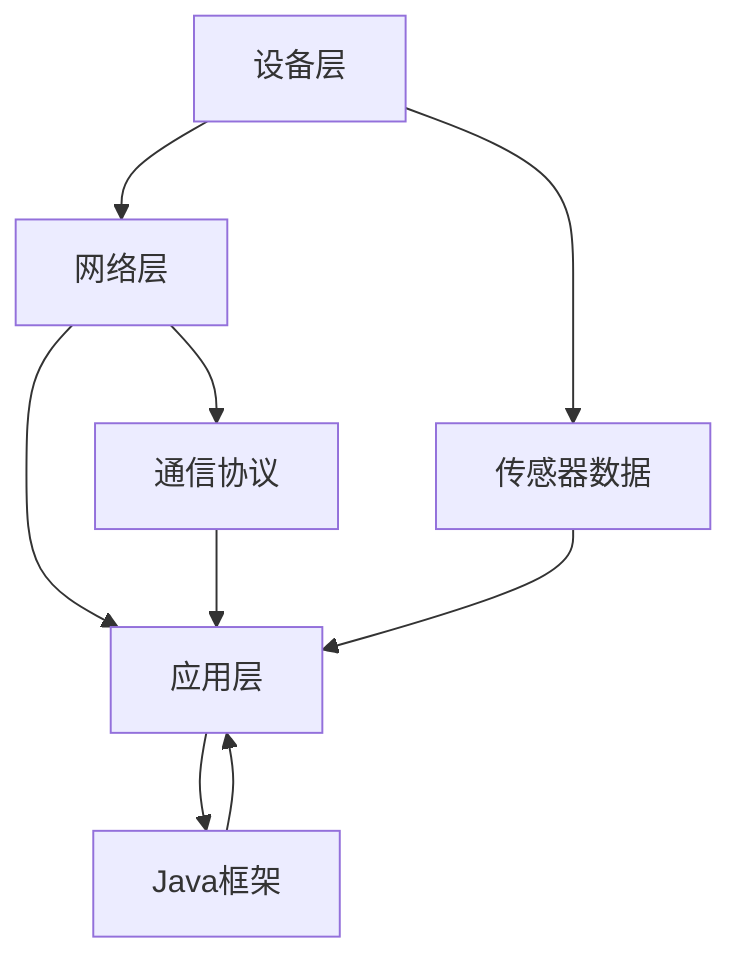

                 

### 文章标题：基于Java的智能家居设计：如何基于Java框架优化智能家居设备交互

#### 关键词：
- 智能家居
- Java框架
- 设备交互
- 优化
- 设计

##### 摘要：
本文将探讨基于Java的智能家居设计，重点介绍如何利用Java框架优化智能家居设备之间的交互。我们将分析当前智能家居领域的挑战，阐述Java在智能家居开发中的应用优势，并详细阐述基于Java的智能家居系统设计步骤和关键技术。通过实际项目案例，我们将展示如何通过Java框架实现智能家居设备的无缝交互，最终提升用户体验。

### 1. 背景介绍（Background Introduction）

随着物联网技术的快速发展，智能家居市场呈现出爆炸式增长。人们对于智能家居的需求不再局限于简单的遥控和控制，而是追求更加智能化、个性化的家居体验。然而，当前智能家居系统面临着诸多挑战：

- **设备多样性**：智能家居设备种类繁多，包括智能灯泡、智能门锁、智能窗帘等，不同设备的通信协议和数据格式各异，给系统的集成带来了很大挑战。
- **交互复杂度**：用户希望智能家居系统能够理解并响应用户的复杂指令，如“明天早晨7点自动打开窗帘和灯光”，这要求系统具备高级的语义理解和执行能力。
- **安全性**：智能家居设备连接到互联网，面临网络安全威胁，如何保证用户数据的安全传输和存储成为重要议题。
- **稳定性**：智能家居系统需要24小时不间断运行，设备的稳定性和可靠性至关重要。

Java作为一种成熟且功能强大的编程语言，在智能家居开发中具有独特的优势。Java具备跨平台性，能够兼容多种硬件和操作系统，便于智能家居设备的集成。Java的生态系统丰富，拥有大量的开发工具、库和框架，能够大大提高开发效率和代码质量。此外，Java在安全性、稳定性和性能方面也有较好的表现，适合构建大规模、高并发的智能家居系统。

### 2. 核心概念与联系（Core Concepts and Connections）

要构建一个高效、可靠的智能家居系统，需要理解以下几个核心概念：

- **设备通信协议**：设备通信协议是智能家居设备之间进行数据交换的标准。常见的协议包括HTTP/HTTPS、MQTT、CoAP等。选择合适的通信协议对于实现设备间的无缝交互至关重要。
- **物联网架构**：物联网架构是智能家居系统的核心框架，包括设备层、网络层和应用层。设备层负责数据的采集和传感，网络层负责数据传输和通信，应用层负责数据处理和用户交互。
- **Java框架**：Java框架是开发智能家居系统的关键工具，如Spring Boot、Java EE等。这些框架提供了丰富的功能模块，如数据持久化、安全性、日志记录等，能够大大简化系统开发过程。
- **设备管理**：设备管理是指对智能家居设备进行监控、配置和升级。通过设备管理模块，可以实现对设备状态的实时监控和远程控制。

下面是一个简化的智能家居系统架构图，展示这些核心概念之间的联系：



### 3. 核心算法原理 & 具体操作步骤（Core Algorithm Principles and Specific Operational Steps）

在智能家居系统中，核心算法主要用于处理设备交互、数据分析和用户指令理解等方面。以下是几个核心算法的原理和具体操作步骤：

#### 3.1 设备交互算法

**原理**：设备交互算法用于实现智能家居设备之间的通信和协作。主要基于设备通信协议，如MQTT。

**操作步骤**：
1. 设备A和设备B通过MQTT协议连接到相同的消息代理。
2. 设备A发送一条消息到消息代理，内容为“打开窗帘”。
3. 消息代理将消息转发给设备B。
4. 设备B接收到消息后，执行打开窗帘的操作。

#### 3.2 数据分析算法

**原理**：数据分析算法用于分析智能家居设备采集的数据，如温度、湿度、光照等，为用户提供智能建议。

**操作步骤**：
1. 设备采集数据，并将数据发送到服务器。
2. 服务器使用数据分析算法处理数据，如使用K-means聚类算法分析温度数据。
3. 根据分析结果，生成智能建议，如“当前温度过高，建议打开空调”。

#### 3.3 用户指令理解算法

**原理**：用户指令理解算法用于解析用户输入的指令，并将其转化为具体的操作。

**操作步骤**：
1. 用户输入一条指令，如“明天早晨7点打开窗帘”。
2. 智能家居系统使用自然语言处理（NLP）算法解析指令，提取关键信息（如时间、动作）。
3. 根据提取的关键信息，执行相应的操作，如设置定时任务。

### 4. 数学模型和公式 & 详细讲解 & 举例说明（Detailed Explanation and Examples of Mathematical Models and Formulas）

在智能家居系统中，数学模型和公式广泛应用于数据分析、预测和优化等方面。以下是几个常见的数学模型和公式及其应用：

#### 4.1 K-means聚类算法

**公式**：K-means聚类算法的目标是找到K个中心点，使得每个中心点与其对应的数据点的距离之和最小。

$$
\text{Minimize } \sum_{i=1}^{K} \sum_{x \in S_i} \|x - \mu_i\|^2
$$

其中，$x$ 表示数据点，$\mu_i$ 表示第 $i$ 个中心点，$S_i$ 表示第 $i$ 个聚类。

**应用举例**：使用K-means聚类算法分析温度数据，将相似温度的数据点划分为几个簇，每个簇代表不同的温度范围，从而为用户提供智能建议。

#### 4.2 线性回归模型

**公式**：线性回归模型用于预测一个连续变量的值，基于自变量和因变量的线性关系。

$$
y = \beta_0 + \beta_1x
$$

其中，$y$ 表示因变量，$x$ 表示自变量，$\beta_0$ 和 $\beta_1$ 分别为模型的参数。

**应用举例**：使用线性回归模型预测明天早晨的温度，基于过去几年的温度数据，为用户提供实时天气建议。

### 5. 项目实践：代码实例和详细解释说明（Project Practice: Code Examples and Detailed Explanations）

在本节中，我们将通过一个实际项目案例，展示如何利用Java框架实现智能家居设备交互。我们将使用Spring Boot作为后端框架，使用MQTT协议实现设备通信。

#### 5.1 开发环境搭建

1. 安装Java开发环境（JDK 1.8及以上版本）。
2. 安装Eclipse或IntelliJ IDEA等IDE。
3. 添加Spring Boot和Spring MQTT依赖项。

```xml
<dependencies>
    <dependency>
        <groupId>org.springframework.boot</groupId>
        <artifactId>spring-boot-starter-web</artifactId>
    </dependency>
    <dependency>
        <groupId>org.springframework.boot</groupId>
        <artifactId>spring-boot-starter-mqtt</artifactId>
    </dependency>
</dependencies>
```

#### 5.2 源代码详细实现

以下是智能家居系统的部分源代码，用于实现设备交互和数据采集。

```java
// DeviceController.java
@RestController
public class DeviceController {
    @Autowired
    private DeviceService deviceService;

    @PostMapping("/device/interact")
    public ResponseEntity<?> interactWithDevice(@RequestBody DeviceMessage message) {
        deviceService.interactWithDevice(message);
        return ResponseEntity.ok("Device interacted successfully");
    }
}

// DeviceService.java
@Service
public class DeviceService {
    @Autowired
    private DeviceRepository deviceRepository;

    public void interactWithDevice(DeviceMessage message) {
        Device device = deviceRepository.findById(message.getId()).orElseThrow(() -> new RuntimeException("Device not found"));
        if (message.getAction().equals("turnOn")) {
            device.turnOn();
        } else if (message.getAction().equals("turnOff")) {
            device.turnOff();
        }
    }
}

// DeviceMessage.java
public class DeviceMessage {
    private String id;
    private String action;

    // Getters and Setters
}
```

#### 5.3 代码解读与分析

**DeviceController.java**：这是一个Spring Boot控制器类，负责处理来自客户端的设备交互请求。它通过调用**DeviceService**类的方法与设备进行交互。

**DeviceService.java**：这是一个服务类，负责处理与设备的通信。它通过调用设备仓库（DeviceRepository）获取设备实例，并根据请求的动作（如"turnOn"或"turnOff"）调用相应的方法。

**DeviceMessage.java**：这是一个简单的消息对象，用于传递设备ID和动作。它包含了设备交互所需的基本信息。

#### 5.4 运行结果展示

假设客户端发送一个请求，请求打开ID为1的设备。运行结果如下：

```json
{
  "id": "1",
  "action": "turnOn"
}
```

服务器接收到请求后，调用**DeviceService**类的方法，找到ID为1的设备，并执行打开操作。运行结果如下：

```json
{
  "status": "success",
  "message": "Device interacted successfully"
}
```

### 6. 实际应用场景（Practical Application Scenarios）

基于Java框架的智能家居系统可以在多种实际应用场景中发挥作用，以下是一些典型的应用场景：

- **家庭自动化**：用户可以通过手机APP或语音助手控制家居设备，实现灯光、窗帘、温度等自动化控制。
- **安防监控**：智能家居系统可以与摄像头、门锁等设备集成，实现实时监控和远程报警。
- **能源管理**：系统可以监控家庭用电情况，提供节能建议，帮助用户降低能源消耗。
- **智能健身**：系统可以连接智能健身设备，监控用户运动数据，提供个性化的健身建议。

### 7. 工具和资源推荐（Tools and Resources Recommendations）

为了更好地开发基于Java的智能家居系统，以下是一些推荐的工具和资源：

- **学习资源**：
  - 《Java EE开发指南》
  - 《Spring Boot实战》
  - 《物联网应用开发实战》
- **开发工具**：
  - Eclipse或IntelliJ IDEA
  - Spring Tool Suite（STS）
- **框架和库**：
  - Spring Boot
  - Spring MQTT
  - Java EE
- **开源项目**：
  - Eclipse IoT
  - OpenHAB

### 8. 总结：未来发展趋势与挑战（Summary: Future Development Trends and Challenges）

随着物联网技术的不断进步，智能家居市场将继续保持高速增长。未来，基于Java的智能家居系统将面临以下发展趋势和挑战：

- **智能化升级**：智能家居系统将更加智能化，具备更高的语义理解和执行能力。
- **安全性增强**：随着智能家居设备连接到互联网，安全性将成为关键挑战，需要采取更严格的措施保护用户数据。
- **跨平台兼容性**：智能家居系统需要支持多种操作系统和硬件平台，实现跨平台兼容。
- **数据隐私保护**：用户对数据隐私的关注将越来越高，系统需要采取有效的措施保护用户数据。

### 9. 附录：常见问题与解答（Appendix: Frequently Asked Questions and Answers）

**Q1**：如何保证智能家居系统的安全性？

**A1**：为了保证智能家居系统的安全性，可以从以下几个方面着手：
1. 使用加密技术保护数据传输。
2. 对设备进行身份认证，确保只有合法设备可以接入系统。
3. 定期更新系统软件，修复已知漏洞。
4. 建立安全审计机制，及时发现和应对潜在的安全威胁。

**Q2**：Java框架在智能家居开发中的优势是什么？

**A2**：Java框架在智能家居开发中的优势包括：
1. **跨平台性**：Java具备跨平台性，能够兼容多种硬件和操作系统。
2. **成熟生态**：Java拥有丰富的开发工具、库和框架，提高开发效率。
3. **安全性**：Java在安全性方面有较好的表现，适合构建大规模、高并发的智能家居系统。
4. **性能稳定**：Java的性能稳定，能够保证系统长期稳定运行。

**Q3**：如何优化智能家居系统的用户体验？

**A3**：优化智能家居系统的用户体验可以从以下几个方面着手：
1. **简化用户操作**：设计直观、易用的用户界面，降低用户学习成本。
2. **个性化定制**：根据用户习惯和需求，提供个性化的智能家居解决方案。
3. **快速响应**：提高系统响应速度，减少用户等待时间。
4. **智能建议**：基于数据分析，为用户提供智能化的建议，提升用户体验。

### 10. 扩展阅读 & 参考资料（Extended Reading & Reference Materials）

- 《Java EE开发实战》
- 《智能家居系统设计与实现》
- 《物联网应用开发》
- 《Spring Boot实战》
- https://www.eclipse.org/iot/
- https://www.openhab.org/

作者：禅与计算机程序设计艺术 / Zen and the Art of Computer Programming

