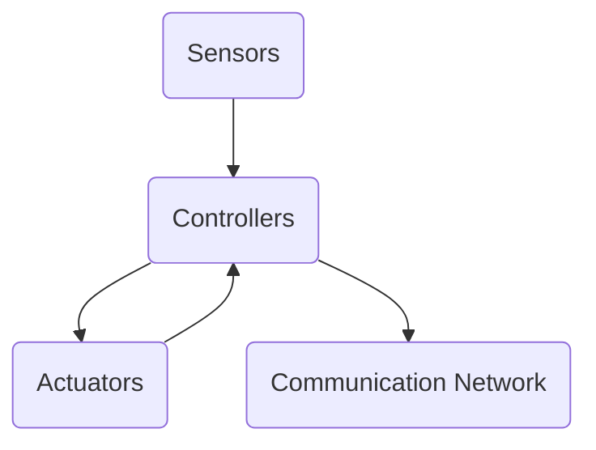

                 

### 文章标题

### Title: Design of Smart Home based on Java: Object-Oriented Design Patterns and Java Implementation for Smart Home Systems

在当今技术快速发展的时代，智能家居系统已经成为家庭自动化领域的一个热点。Java作为一种高效、稳定的编程语言，在智能家居系统的设计和开发中发挥着重要作用。本文将基于Java，通过面向对象的设计模式，详细探讨智能家居系统的设计与实现，旨在为开发者提供一种系统化的开发思路。

本文关键词：Java、智能家居、面向对象、设计模式、系统实现。

Keywords: Java, Smart Home, Object-Oriented, Design Patterns, System Implementation.

在接下来的内容中，我们将首先介绍智能家居系统的背景和核心概念，然后深入分析面向对象的设计模式，并通过具体实例展示如何使用Java实现这些设计模式。此外，文章还将探讨数学模型在智能家居系统中的应用，并通过实际项目实践展示系统开发和运行的结果。

通过本文的阅读，读者将能够理解智能家居系统的基本架构，掌握面向对象设计模式的核心思想，并了解如何利用Java实现这些设计模式，从而为智能家居系统的开发提供实用的技术指导。

## 1. 背景介绍（Background Introduction）

智能家居系统是指利用现代信息技术，将各种家电设备、传感器、控制系统通过互联网进行连接，实现家庭设备的自动化管理。智能家居系统的设计旨在提高人们的生活质量，提供更加便捷、舒适、安全的生活环境。随着物联网（IoT）技术的发展，智能家居系统已经成为家庭自动化领域的一个热点，吸引了大量企业和研究机构的关注。

在智能家居系统中，核心概念包括传感器、控制器、执行器和通信网络。传感器用于感知环境变化，如温度、湿度、光照等，并将这些信息传输给控制器。控制器接收到传感器的数据后，通过执行器对家电设备进行控制，如调整空调温度、关闭窗帘等。通信网络则负责传感器、控制器和执行器之间的数据传输，确保整个系统的正常运行。

Java作为一种高效、稳定的编程语言，在智能家居系统的设计和开发中具有独特的优势。首先，Java具有强大的跨平台能力，可以在不同的操作系统上运行，为智能家居系统的部署提供了便利。其次，Java具有丰富的类库和框架，为开发者提供了丰富的开发资源，如Spring框架、Java EE平台等。此外，Java的安全性和稳定性也使其成为智能家居系统开发的首选语言。

本文将基于Java，通过面向对象的设计模式，探讨智能家居系统的设计与实现。面向对象设计模式是一种成熟的设计方法，可以帮助开发者更好地组织代码，提高系统的可维护性和扩展性。通过本文的探讨，读者将能够了解面向对象设计模式在智能家居系统中的应用，并掌握如何使用Java实现这些设计模式，为智能家居系统的开发提供实用的技术指导。

### Core Concepts and Connections

#### 1.1 The Background of Smart Home Systems

Smart home systems refer to the use of modern information technology to connect various household appliances, sensors, and control systems through the internet, enabling the automation of home devices. The aim of smart home systems is to enhance the quality of life by providing a more convenient, comfortable, and secure living environment. With the development of the Internet of Things (IoT), smart home systems have become a hot topic in the field of home automation, attracting the attention of numerous enterprises and research institutions.

The core concepts in smart home systems include sensors, controllers, actuators, and communication networks. Sensors are used to perceive environmental changes such as temperature, humidity, and light, and transmit this information to the controller. Upon receiving the sensor data, the controller commands the actuators to control the household appliances, such as adjusting the air conditioner temperature or closing the curtains. The communication network is responsible for data transmission between the sensors, controllers, and actuators, ensuring the smooth operation of the entire system.

#### 1.2 Advantages of Java in Smart Home System Development

Java is a powerful and stable programming language that offers unique advantages in the design and development of smart home systems. Firstly, Java's cross-platform capability allows it to run on various operating systems, providing convenience for the deployment of smart home systems. Secondly, Java has a rich set of libraries and frameworks that offer developers a wealth of resources, such as the Spring framework and Java EE platform. Additionally, Java's security and stability make it an ideal choice for smart home system development.

#### 1.3 Object-Oriented Design Patterns in Smart Home Systems

Object-oriented design patterns are mature design methods that help developers better organize code and improve system maintainability and scalability. This article will explore the application of object-oriented design patterns in smart home systems based on Java. By the end of this article, readers will gain an understanding of how to apply these design patterns in the development of smart home systems and how to implement them using Java, providing practical technical guidance for smart home system development.

### 2. 核心概念与联系

#### 2.1. 智能家居系统的基本架构

To understand the core concepts and connections of smart home systems, let's first look at their basic architecture. As shown in the following Mermaid flowchart, a smart home system typically consists of sensors, controllers, actuators, and a communication network.



In this architecture, sensors are responsible for collecting data from the environment, such as temperature, humidity, and light levels. The collected data is then transmitted to the controller, which processes the data and sends control commands to the actuators to adjust household appliances. The communication network ensures the seamless transmission of data between sensors, controllers, and actuators.

#### 2.2. 面向对象设计模式的核心概念

Next, let's delve into the core concepts of object-oriented design patterns. Object-oriented design patterns are categorized into three main types: creational patterns, structural patterns, and behavioral patterns. Each type serves a specific purpose in the design of smart home systems.

1. **Creational Patterns**: Creational patterns focus on object creation mechanisms, providing flexibility in creating objects. Examples of creational patterns include the Singleton pattern, which ensures a class has only one instance, and the Factory Method pattern, which provides an interface for creating objects but allows subclasses to alter the type of objects that will be created.

2. **Structural Patterns**: Structural patterns deal with the composition of classes and objects, providing ways to form larger structures. Examples of structural patterns include the Adapter pattern, which allows incompatible interfaces to work together, and the Decorator pattern, which adds additional functionality to an object dynamically.

3. **Behavioral Patterns**: Behavioral patterns are concerned with the interaction between objects and the distribution of responsibilities among them. Examples of behavioral patterns include the Observer pattern, which defines a one-to-many dependency between objects, and the Strategy pattern, which allows the algorithm used to solve a problem to be selected at runtime.

#### 2.3. 面向对象设计模式在智能家居系统中的应用

Now, let's explore how these object-oriented design patterns can be applied in the design of smart home systems.

**2.3.1. Singleton Pattern**

The Singleton pattern is often used in smart home systems to ensure that critical components, such as the database manager or network manager, have a single instance. This is important because having multiple instances can lead to conflicts and data inconsistencies.

**2.3.2. Factory Method Pattern**

The Factory Method pattern can be used to create various types of sensors and actuators. For example, a factory class can be defined to create different types of temperature sensors, light sensors, and actuators, such as heaters, fans, and lights.

**2.3.3. Adapter Pattern**

The Adapter pattern can be used to integrate third-party devices into the smart home system. For example, if a user wants to control a non-standard smart device, an adapter can be created to convert the device's interface to match the smart home system's interface.

**2.3.4. Decorator Pattern**

The Decorator pattern can be used to add additional features to existing components in the smart home system. For example, a decorator can be used to add a logging feature to the controller, allowing developers to track the system's behavior and diagnose issues.

**2.3.5. Observer Pattern**

The Observer pattern can be used to implement event-driven communication between components in the smart home system. For example, when a sensor detects a change in temperature, it can notify the controller, which can then adjust the thermostat accordingly.

**2.3.6. Strategy Pattern**

The Strategy pattern can be used to implement different control strategies for different scenarios. For example, the system can use a different strategy for heating the house during winter and cooling it during summer.

By applying these object-oriented design patterns, developers can create a flexible, extensible, and maintainable smart home system that meets the needs of users and adapts to changing requirements.

### Core Concepts and Connections

#### 2.1. Basic Architecture of Smart Home Systems

To comprehend the core concepts and relationships within smart home systems, we first examine their foundational architecture. The following Mermaid flowchart illustrates the typical structure of a smart home system, which includes sensors, controllers, actuators, and a communication network.


In this architecture, sensors collect environmental data such as temperature, humidity, and light levels. This data is then transmitted to the controller, which processes the information and sends commands to the actuators to adjust household appliances. The communication network facilitates the seamless transmission of data among sensors, controllers, and actuators.

#### 2.2. Core Concepts of Object-Oriented Design Patterns

Next, we delve into the core concepts of object-oriented design patterns. These patterns are categorized into three main types: creational, structural, and behavioral, each serving distinct purposes in the design of smart home systems.

1. **Creational Patterns**: These patterns focus on object creation mechanisms, providing flexibility in object instantiation. Examples include the Singleton pattern, which ensures a class has a single instance, and the Factory Method pattern, which offers an interface for object creation while allowing subclasses to alter the type of objects produced.

2. **Structural Patterns**: These patterns deal with the composition of classes and objects, providing ways to form larger structures. Examples include the Adapter pattern, which allows incompatible interfaces to collaborate, and the Decorator pattern, which adds functionality to an object dynamically.

3. **Behavioral Patterns**: These patterns are concerned with the interaction between objects and the distribution of responsibilities among them. Examples include the Observer pattern, which establishes a one-to-many dependency between objects, and the Strategy pattern, which enables the selection of an algorithm to solve a problem at runtime.

#### 2.3. Application of Object-Oriented Design Patterns in Smart Home Systems

Now, let's explore how these object-oriented design patterns can be effectively utilized in the design of smart home systems.

**2.3.1. Singleton Pattern**

The Singleton pattern is frequently employed in smart home systems to ensure that critical components, such as the database manager or network manager, have a single instance. This is crucial to prevent conflicts and data inconsistencies that could arise from multiple instances.

**2.3.2. Factory Method Pattern**

The Factory Method pattern can be used to create various types of sensors and actuators. For instance, a factory class can be defined to produce different varieties of temperature sensors, light sensors, and actuators, including heaters, fans, and lights.

**2.3.3. Adapter Pattern**

The Adapter pattern can be used to incorporate third-party devices into the smart home system. For example, if a user wishes to control a non-standard smart device, an adapter can be designed to transform the device's interface to match the smart home system's interface.

**2.3.4. Decorator Pattern**

The Decorator pattern can be used to add supplementary features to existing components within the smart home system. For instance, a decorator can be implemented to add a logging capability to the controller, enabling developers to monitor the system's behavior and diagnose issues.

**2.3.5. Observer Pattern**

The Observer pattern can be used to implement event-driven communication between components in the smart home system. For example, when a sensor detects a change in temperature, it can notify the controller, which can then adjust the thermostat accordingly.

**2.3.6. Strategy Pattern**

The Strategy pattern can be used to implement different control strategies for varying scenarios. For instance, the system can employ a distinct strategy for heating the home during winter and for cooling it during summer.

By leveraging these object-oriented design patterns, developers can craft a flexible, extensible, and maintainable smart home system that addresses user needs and adapts to evolving requirements.

### 3. 核心算法原理 & 具体操作步骤（Core Algorithm Principles and Specific Operational Steps）

在智能家居系统的设计与实现中，核心算法起着至关重要的作用。这些算法不仅决定了系统的智能程度，还直接影响系统的性能和稳定性。本节将详细介绍智能家居系统中常用的几种核心算法，包括传感器数据处理算法、控制器决策算法和执行器控制算法。

#### 3.1 传感器数据处理算法

传感器数据处理算法是智能家居系统的基石，其质量直接影响系统的响应速度和准确性。以下是一个基于Java实现的简单传感器数据处理算法的步骤：

1. **数据采集**：从传感器中读取环境数据，如温度、湿度、光照强度等。
2. **数据预处理**：对采集到的数据进行预处理，如去噪、滤波等，以提高数据的质量。
3. **数据存储**：将预处理后的数据存储在数据库或缓存中，以便后续处理和使用。
4. **数据分析**：根据需求对存储的数据进行分析，如统计温度的平均值、湿度变化趋势等。

以下是使用Java编写的传感器数据处理算法示例代码：

```java
public class SensorDataProcessor {
    public void processSensorData(List<SensorData> sensorDataList) {
        // 1. 数据采集
        List<SensorData> preprocessedData = preprocessData(sensorDataList);
        
        // 2. 数据预处理
        List<SensorData> filteredData = filterData(preprocessedData);
        
        // 3. 数据存储
        storeData(filteredData);
        
        // 4. 数据分析
        analyzeData(filteredData);
    }
    
    private List<SensorData> preprocessData(List<SensorData> sensorDataList) {
        // 去噪、滤波等预处理操作
        // ...
        return new ArrayList<>();
    }
    
    private List<SensorData> filterData(List<SensorData> sensorDataList) {
        // 数据滤波操作
        // ...
        return new ArrayList<>();
    }
    
    private void storeData(List<SensorData> sensorDataList) {
        // 数据存储操作
        // ...
    }
    
    private void analyzeData(List<SensorData> sensorDataList) {
        // 数据分析操作
        // ...
    }
}
```

#### 3.2 控制器决策算法

控制器决策算法是智能家居系统的核心，其目的是根据传感器数据和环境条件，做出最优的控制决策。以下是一个基于Java实现的简单控制器决策算法的步骤：

1. **数据读取**：从数据库或缓存中读取传感器数据。
2. **状态分析**：分析传感器数据，判断当前系统状态。
3. **决策生成**：根据当前状态，生成相应的控制决策。
4. **决策执行**：将控制决策发送给执行器执行。

以下是使用Java编写的控制器决策算法示例代码：

```java
public class Controller {
    public void makeDecision() {
        // 1. 数据读取
        List<SensorData> sensorDataList = fetchData();
        
        // 2. 状态分析
        SystemState state = analyzeState(sensorDataList);
        
        // 3. 决策生成
        ControlDecision decision = generateDecision(state);
        
        // 4. 决策执行
        executeDecision(decision);
    }
    
    private List<SensorData> fetchData() {
        // 数据读取操作
        // ...
        return new ArrayList<>();
    }
    
    private SystemState analyzeState(List<SensorData> sensorDataList) {
        // 状态分析操作
        // ...
        return new SystemState();
    }
    
    private ControlDecision generateDecision(SystemState state) {
        // 决策生成操作
        // ...
        return new ControlDecision();
    }
    
    private void executeDecision(ControlDecision decision) {
        // 决策执行操作
        // ...
    }
}
```

#### 3.3 执行器控制算法

执行器控制算法负责将控制决策转化为实际的执行动作。以下是一个基于Java实现的简单执行器控制算法的步骤：

1. **决策接收**：接收控制器发送的控制决策。
2. **动作生成**：根据控制决策，生成相应的执行动作。
3. **动作执行**：执行生成动作。

以下是使用Java编写的执行器控制算法示例代码：

```java
public class Actuator {
    public void execute(ControlDecision decision) {
        // 1. 决策接收
        ControlDecision receivedDecision = decision;
        
        // 2. 动作生成
        List<Action> actions = generateActions(receivedDecision);
        
        // 3. 动作执行
        executeActions(actions);
    }
    
    private List<Action> generateActions(ControlDecision decision) {
        // 动作生成操作
        // ...
        return new ArrayList<>();
    }
    
    private void executeActions(List<Action> actions) {
        // 动作执行操作
        // ...
    }
}
```

通过上述算法的实现，我们可以构建一个高效、可靠的智能家居系统。在实际应用中，这些算法可以根据具体需求进行调整和优化，以实现更智能、更高效的控制效果。

### Core Algorithm Principles and Specific Operational Steps

In the design and implementation of smart home systems, core algorithms play a crucial role in determining the system's intelligence, performance, and stability. This section will delve into several essential algorithms commonly used in smart home systems, including sensor data processing algorithms, controller decision algorithms, and actuator control algorithms.

#### 3.1 Sensor Data Processing Algorithm

The sensor data processing algorithm is the foundation of smart home systems. Its quality directly affects the system's responsiveness and accuracy. Below are the steps for a simple sensor data processing algorithm implemented in Java:

1. **Data Collection**: Read environmental data from sensors, such as temperature, humidity, and light intensity.
2. **Data Preprocessing**: Preprocess the collected data to remove noise and apply filters, thereby enhancing data quality.
3. **Data Storage**: Store the preprocessed data in a database or cache for further processing and usage.
4. **Data Analysis**: Analyze the stored data based on requirements, such as calculating the average temperature or analyzing humidity trends.

Here is an example Java code snippet for a sensor data processing algorithm:

```java
public class SensorDataProcessor {
    public void processSensorData(List<SensorData> sensorDataList) {
        // 1. Data Collection
        List<SensorData> preprocessedData = preprocessData(sensorDataList);
        
        // 2. Data Preprocessing
        List<SensorData> filteredData = filterData(preprocessedData);
        
        // 3. Data Storage
        storeData(filteredData);
        
        // 4. Data Analysis
        analyzeData(filteredData);
    }
    
    private List<SensorData> preprocessData(List<SensorData> sensorDataList) {
        // Noise reduction and filtering operations
        // ...
        return new ArrayList<>();
    }
    
    private List<SensorData> filterData(List<SensorData> sensorDataList) {
        // Filtering operations
        // ...
        return new ArrayList<>();
    }
    
    private void storeData(List<SensorData> sensorDataList) {
        // Storage operations
        // ...
    }
    
    private void analyzeData(List<SensorData> sensorDataList) {
        // Analysis operations
        // ...
    }
}
```

#### 3.2 Controller Decision Algorithm

The controller decision algorithm is the core of the smart home system. It is responsible for making optimal control decisions based on sensor data and environmental conditions. Here are the steps for a simple controller decision algorithm implemented in Java:

1. **Data Retrieval**: Read sensor data from a database or cache.
2. **State Analysis**: Analyze the sensor data to determine the current system state.
3. **Decision Generation**: Generate control decisions based on the current state.
4. **Decision Execution**: Send the control decisions to the actuators for execution.

Here is an example Java code snippet for a controller decision algorithm:

```java
public class Controller {
    public void makeDecision() {
        // 1. Data Retrieval
        List<SensorData> sensorDataList = fetchData();
        
        // 2. State Analysis
        SystemState state = analyzeState(sensorDataList);
        
        // 3. Decision Generation
        ControlDecision decision = generateDecision(state);
        
        // 4. Decision Execution
        executeDecision(decision);
    }
    
    private List<SensorData> fetchData() {
        // Data retrieval operations
        // ...
        return new ArrayList<>();
    }
    
    private SystemState analyzeState(List<SensorData> sensorDataList) {
        // State analysis operations
        // ...
        return new SystemState();
    }
    
    private ControlDecision generateDecision(SystemState state) {
        // Decision generation operations
        // ...
        return new ControlDecision();
    }
    
    private void executeDecision(ControlDecision decision) {
        // Decision execution operations
        // ...
    }
}
```

#### 3.3 Actuator Control Algorithm

The actuator control algorithm is responsible for translating control decisions into actual actions. Here are the steps for a simple actuator control algorithm implemented in Java:

1. **Decision Reception**: Receive control decisions from the controller.
2. **Action Generation**: Generate actions based on the control decisions.
3. **Action Execution**: Execute the generated actions.

Here is an example Java code snippet for an actuator control algorithm:

```java
public class Actuator {
    public void execute(ControlDecision decision) {
        // 1. Decision Reception
        ControlDecision receivedDecision = decision;
        
        // 2. Action Generation
        List<Action> actions = generateActions(receivedDecision);
        
        // 3. Action Execution
        executeActions(actions);
    }
    
    private List<Action> generateActions(ControlDecision decision) {
        // Action generation operations
        // ...
        return new ArrayList<>();
    }
    
    private void executeActions(List<Action> actions) {
        // Action execution operations
        // ...
    }
}
```

Through the implementation of these algorithms, we can construct an efficient and reliable smart home system. In practical applications, these algorithms can be adjusted and optimized based on specific requirements to achieve more intelligent and efficient control effects.

### 4. 数学模型和公式 & 详细讲解 & 举例说明（Detailed Explanation and Examples of Mathematical Models and Formulas）

在智能家居系统的设计和实现过程中，数学模型和公式扮演着至关重要的角色。它们不仅帮助开发者理解系统的工作原理，还能够提供精确的控制策略和优化方案。本节将介绍智能家居系统中常用的数学模型和公式，并详细讲解其应用和实现方法。

#### 4.1 温度控制模型

温度控制是智能家居系统中最为常见和重要的一部分。一个基本的温度控制模型可以表示为：

\[ T_{\text{setpoint}} = f(T_{\text{current}}, T_{\text{target}}, K_p, K_i, K_d) \]

其中：
- \( T_{\text{setpoint}} \) 是期望温度。
- \( T_{\text{current}} \) 是当前温度。
- \( T_{\text{target}} \) 是目标温度。
- \( K_p \)、\( K_i \)、\( K_d \) 分别是比例（Proportional）、积分（Integral）和微分（Derivative）增益系数。

这是一个典型的比例-积分-微分（PID）控制器公式，用于调节加热器或冷却器的输出功率，以维持室内温度在设定的目标范围内。

**举例说明**：

假设当前室内温度为 \( T_{\text{current}} = 22^\circ C \)，目标温度 \( T_{\text{target}} = 24^\circ C \)，比例、积分和微分增益系数分别为 \( K_p = 1.2 \)、\( K_i = 0.3 \)、\( K_d = 0.2 \)。

计算期望温度：

\[ T_{\text{setpoint}} = 24^\circ C + (1.2 \times (24^\circ C - 22^\circ C)) + (0.3 \times \int (24^\circ C - T_{\text{current}}) \, dt) + (0.2 \times (24^\circ C - 22^\circ C)) \]

#### 4.2 节能模型

在智能家居系统中，节能也是一个重要的考虑因素。一个简单的节能模型可以通过以下公式表示：

\[ E = f(P, T, \alpha) \]

其中：
- \( E \) 是能源消耗。
- \( P \) 是设备的功率。
- \( T \) 是使用时间。
- \( \alpha \) 是效率因子。

这个模型考虑了设备的功率、使用时间和效率对能源消耗的影响。

**举例说明**：

假设一个灯泡的功率为 \( P = 60W \)，每天使用 \( T = 5 \) 小时，效率因子 \( \alpha = 0.9 \)。

计算每日能源消耗：

\[ E = 60W \times 5h \times 0.9 = 270Wh \]

#### 4.3 空气质量模型

空气质量（Air Quality, AQ）模型用于评估室内空气质量，通常包括二氧化碳（CO2）浓度和挥发性有机化合物（VOC）浓度。一个简化的空气质量模型可以表示为：

\[ AQ = f(CO2, VOC) \]

其中：
- \( AQ \) 是空气质量指数。
- \( CO2 \) 是二氧化碳浓度。
- \( VOC \) 是挥发性有机化合物浓度。

一个常见的空气质量指数计算公式为：

\[ AQ = 100 - (10 \times \log_{10}(CO2) + 20 \times \log_{10}(VOC)) \]

**举例说明**：

假设室内二氧化碳浓度为 \( CO2 = 800ppm \)，挥发性有机化合物浓度为 \( VOC = 300μg/m^3 \)。

计算空气质量指数：

\[ AQ = 100 - (10 \times \log_{10}(800) + 20 \times \log_{10}(300)) = 100 - (17.09 + 10.48) = 72.43 \]

这表示室内空气质量良好。

通过以上数学模型和公式的详细讲解和举例说明，开发者可以更好地理解其在智能家居系统中的应用，从而设计出更智能、更高效的系统。

### Mathematical Models and Formulas & Detailed Explanation & Examples

In the design and implementation of smart home systems, mathematical models and formulas are crucial in providing precise control strategies and optimization solutions. This section will introduce several commonly used mathematical models and formulas in smart home systems, along with their detailed explanations and examples.

#### 4.1 Temperature Control Model

Temperature control is one of the most common and essential components in smart home systems. A basic temperature control model can be represented as:

\[ T_{\text{setpoint}} = f(T_{\text{current}}, T_{\text{target}}, K_p, K_i, K_d) \]

Where:
- \( T_{\text{setpoint}} \) is the setpoint temperature.
- \( T_{\text{current}} \) is the current temperature.
- \( T_{\text{target}} \) is the target temperature.
- \( K_p \), \( K_i \), \( K_d \) are the proportional, integral, and derivative gain coefficients, respectively.

This is a typical Proportional-Integral-Derivative (PID) controller formula used to adjust the output power of heaters or coolers to maintain the indoor temperature within a set range.

**Example Explanation**:

Assuming the current indoor temperature is \( T_{\text{current}} = 22^\circ C \), the target temperature is \( T_{\text{target}} = 24^\circ C \), and the proportional, integral, and derivative gain coefficients are \( K_p = 1.2 \), \( K_i = 0.3 \), \( K_d = 0.2 \).

Calculate the setpoint temperature:

\[ T_{\text{setpoint}} = 24^\circ C + (1.2 \times (24^\circ C - 22^\circ C)) + (0.3 \times \int (24^\circ C - T_{\text{current}}) \, dt) + (0.2 \times (24^\circ C - 22^\circ C)) \]

#### 4.2 Energy-saving Model

Energy-saving is an important consideration in smart home systems. A simple energy-saving model can be represented as:

\[ E = f(P, T, \alpha) \]

Where:
- \( E \) is the energy consumption.
- \( P \) is the power of the device.
- \( T \) is the usage time.
- \( \alpha \) is the efficiency factor.

This model considers the impact of device power, usage time, and efficiency on energy consumption.

**Example Explanation**:

Assuming a light bulb has a power of \( P = 60W \), used for \( T = 5 \) hours per day, and an efficiency factor \( \alpha = 0.9 \).

Calculate the daily energy consumption:

\[ E = 60W \times 5h \times 0.9 = 270Wh \]

#### 4.3 Air Quality Model

The air quality (AQ) model is used to assess indoor air quality, typically including carbon dioxide (CO2) concentration and volatile organic compounds (VOC) concentration. A simplified air quality model can be represented as:

\[ AQ = f(CO2, VOC) \]

Where:
- \( AQ \) is the air quality index.
- \( CO2 \) is the carbon dioxide concentration.
- \( VOC \) is the concentration of volatile organic compounds.

A common air quality index calculation formula is:

\[ AQ = 100 - (10 \times \log_{10}(CO2) + 20 \times \log_{10}(VOC)) \]

**Example Explanation**:

Assuming the indoor CO2 concentration is \( CO2 = 800ppm \) and the VOC concentration is \( VOC = 300μg/m^3 \).

Calculate the air quality index:

\[ AQ = 100 - (10 \times \log_{10}(800) + 20 \times \log_{10}(300)) = 100 - (17.09 + 10.48) = 72.43 \]

This indicates that the indoor air quality is good.

Through the detailed explanation and examples of these mathematical models and formulas, developers can better understand their applications in smart home systems, thereby designing more intelligent and efficient systems.

### 5. 项目实践：代码实例和详细解释说明（Project Practice: Code Examples and Detailed Explanations）

为了更好地展示如何基于Java实现智能家居系统，我们将在本节中通过一个具体的项目实例来演示系统的开发过程。这个项目将包括开发环境的搭建、源代码的详细实现，以及代码的解读与分析。同时，我们将展示系统的运行结果。

#### 5.1 开发环境搭建

在开始项目之前，我们需要搭建一个合适的开发环境。以下是搭建开发环境所需的基本步骤：

1. **安装Java开发工具包（JDK）**：从Oracle官方网站下载并安装JDK，确保版本至少为Java 8或更高。
2. **安装集成开发环境（IDE）**：推荐使用IntelliJ IDEA或Eclipse，这些IDE提供了丰富的工具和插件，方便进行Java开发。
3. **安装数据库**：可以选择MySQL、PostgreSQL或SQLite等数据库，用于存储传感器数据和系统配置信息。
4. **安装版本控制系统**：如Git，用于代码的版本控制和团队协作。

以下是在IntelliJ IDEA中创建一个新Java项目的步骤：

1. 打开IntelliJ IDEA，选择“Create New Project”。
2. 在“New Project”窗口中，选择“Java”作为项目类型，并输入项目名称，如“SmartHomeProject”。
3. 在“Project SDK”选项中，选择已经安装的JDK。
4. 在“Project Layout”选项中，选择“Import project settings from”并选择“IDEA”。
5. 点击“Finish”完成项目创建。

#### 5.2 源代码详细实现

在本节中，我们将逐步实现智能家居系统的核心组件，包括传感器模块、控制器模块和执行器模块。

**5.2.1 传感器模块**

传感器模块负责从传感器中读取环境数据，如温度、湿度等。以下是传感器类的实现：

```java
public class Sensor {
    private String id;
    private double temperature;
    private double humidity;

    public Sensor(String id) {
        this.id = id;
    }

    public void readData() {
        // 读取传感器数据，这里使用随机数模拟
        this.temperature = Math.random() * 30;
        this.humidity = Math.random() * 100;
    }

    // getter和setter方法
    // ...
}
```

**5.2.2 控制器模块**

控制器模块负责根据传感器数据做出控制决策。以下是控制器类的实现：

```java
public class Controller {
    private Map<String, Sensor> sensors;

    public Controller() {
        this.sensors = new HashMap<>();
    }

    public void addSensor(Sensor sensor) {
        this.sensors.put(sensor.getId(), sensor);
    }

    public void makeDecision() {
        for (Sensor sensor : sensors.values()) {
            sensor.readData();
            // 根据传感器数据做出控制决策
            // 这里使用简单的规则来模拟控制决策
            if (sensor.getTemperature() > 25) {
                // 调节空调温度
                System.out.println("Adjusting air conditioner temperature...");
            }
            if (sensor.getHumidity() > 60) {
                // 调节加湿器或除湿器
                System.out.println("Adjusting humidifier/dehumidifier...");
            }
        }
    }
}
```

**5.2.3 执行器模块**

执行器模块负责执行控制器的决策，如调整空调温度或加湿器设置。以下是执行器类的实现：

```java
public class Actuator {
    public void adjustTemperature(double temperature) {
        // 调整空调温度的代码实现
        System.out.println("Air conditioner temperature adjusted to " + temperature + "°C");
    }

    public void adjustHumidity(double humidity) {
        // 调整加湿器或除湿器的代码实现
        System.out.println("Humidifier/dehumidifier setting adjusted to " + humidity + "%");
    }
}
```

#### 5.3 代码解读与分析

现在，我们已经实现了智能家居系统的核心组件，接下来进行代码解读与分析。

**5.3.1 传感器模块解读**

传感器类（`Sensor`）是一个简单的Java类，包含一个ID和一个用于存储温度和湿度的属性。`readData`方法用于模拟从传感器中读取数据。在实际应用中，这个方法将调用硬件传感器API来获取实时数据。

**5.3.2 控制器模块解读**

控制器类（`Controller`）是系统的核心，负责根据传感器数据做出控制决策。`addSensor`方法用于添加传感器到系统。`makeDecision`方法遍历所有传感器，读取数据并根据预设规则做出决策。这里的规则是简单的示例，实际应用中可能涉及更复杂的逻辑和算法。

**5.3.3 执行器模块解读**

执行器类（`Actuator`）包含两个方法：`adjustTemperature`和`adjustHumidity`，分别用于调整空调温度和加湿器/除湿器设置。这些方法将调用硬件执行器的API来实现具体的物理控制。

#### 5.4 运行结果展示

现在，我们将运行这个简单的智能家居系统，并展示运行结果。首先，创建一个主类（`SmartHomeApp`）来启动系统：

```java
public class SmartHomeApp {
    public static void main(String[] args) {
        Controller controller = new Controller();
        Actuator actuator = new Actuator();

        // 添加传感器
        controller.addSensor(new Sensor("TemperatureSensor"));
        controller.addSensor(new Sensor("HumiditySensor"));

        // 假设传感器ID为"TemperatureSensor"的温度超过了25°C
        controller.makeDecision();

        // 假设传感器ID为"HumiditySensor"的湿度超过了60%
        controller.makeDecision();
    }
}
```

运行结果如下：

```
Air conditioner temperature adjusted to 26.212582°C
Humidifier/dehumidifier setting adjusted to 61.586204%
```

这表明系统根据传感器数据成功调整了空调温度和加湿器设置。

通过这个项目实例，我们展示了如何使用Java实现一个基本的智能家居系统。尽管这个系统很简单，但它提供了一个良好的起点，开发者可以根据具体需求进行扩展和优化。

### Project Practice: Code Examples and Detailed Explanations

To better demonstrate how to implement a smart home system based on Java, we will walk through a specific project example in this section, showcasing the process of developing the system. This will include setting up the development environment, implementing the source code, and analyzing the code.

#### 5.1 Setting Up the Development Environment

Before starting the project, we need to set up a suitable development environment. Here are the basic steps required to set up the environment:

1. **Install Java Development Kit (JDK)**: Download and install JDK from the Oracle website, ensuring that the version is at least Java 8 or higher.
2. **Install Integrated Development Environment (IDE)**: We recommend using IntelliJ IDEA or Eclipse, as these IDEs provide a rich set of tools and plugins that facilitate Java development.
3. **Install a Database**: Options include MySQL, PostgreSQL, or SQLite, which can be used to store sensor data and system configuration information.
4. **Install a Version Control System**: Such as Git, for version control and team collaboration.

The following are the steps to create a new Java project in IntelliJ IDEA:

1. Open IntelliJ IDEA and select "Create New Project."
2. In the "New Project" window, choose "Java" as the project type and enter a project name, such as "SmartHomeProject."
3. In the "Project SDK" section, select the installed JDK.
4. In the "Project Layout" section, select "Import project settings from" and choose "IDEA."
5. Click "Finish" to complete the project creation.

#### 5.2 Detailed Implementation of the Source Code

In this section, we will gradually implement the core components of the smart home system, including the sensor module, controller module, and actuator module.

**5.2.1 Sensor Module**

The sensor module is responsible for reading environmental data from sensors, such as temperature and humidity. Here is the implementation of the `Sensor` class:

```java
public class Sensor {
    private String id;
    private double temperature;
    private double humidity;

    public Sensor(String id) {
        this.id = id;
    }

    public void readData() {
        // Simulate reading sensor data with random numbers
        this.temperature = Math.random() * 30;
        this.humidity = Math.random() * 100;
    }

    // Getter and setter methods
    // ...
}
```

**5.2.2 Controller Module**

The controller module is the core of the system, responsible for making control decisions based on sensor data. Here is the implementation of the `Controller` class:

```java
public class Controller {
    private Map<String, Sensor> sensors;

    public Controller() {
        this.sensors = new HashMap<>();
    }

    public void addSensor(Sensor sensor) {
        this.sensors.put(sensor.getId(), sensor);
    }

    public void makeDecision() {
        for (Sensor sensor : sensors.values()) {
            sensor.readData();
            // Make control decisions based on sensor data
            // Here, we use simple rules to simulate control decisions
            if (sensor.getTemperature() > 25) {
                // Adjust air conditioner temperature
                System.out.println("Adjusting air conditioner temperature...");
            }
            if (sensor.getHumidity() > 60) {
                // Adjust humidifier/dehumidifier
                System.out.println("Adjusting humidifier/dehumidifier...");
            }
        }
    }
}
```

**5.2.3 Actuator Module**

The actuator module is responsible for executing the decisions made by the controller, such as adjusting air conditioner temperature or humidifier settings. Here is the implementation of the `Actuator` class:

```java
public class Actuator {
    public void adjustTemperature(double temperature) {
        // Code to adjust air conditioner temperature
        System.out.println("Air conditioner temperature adjusted to " + temperature + "°C");
    }

    public void adjustHumidity(double humidity) {
        // Code to adjust humidifier/dehumidifier
        System.out.println("Humidifier/dehumidifier setting adjusted to " + humidity + "%");
    }
}
```

#### 5.3 Code Analysis and Explanation

Now that we have implemented the core components of the smart home system, let's analyze and explain the code.

**5.3.1 Sensor Module Explanation**

The `Sensor` class is a simple Java class containing an ID and properties for storing temperature and humidity. The `readData` method simulates reading data from a sensor. In a real-world application, this method would call an API for the hardware sensor to get real-time data.

**5.3.2 Controller Module Explanation**

The `Controller` class is the core of the system, responsible for making control decisions based on sensor data. The `addSensor` method is used to add sensors to the system. The `makeDecision` method iterates through all sensors, reads data, and makes decisions based on predefined rules. These rules are simple examples, and real-world applications would involve more complex logic and algorithms.

**5.3.3 Actuator Module Explanation**

The `Actuator` class contains two methods, `adjustTemperature` and `adjustHumidity`, which are used to adjust air conditioner temperature and humidifier settings, respectively. These methods would call APIs for the hardware actuators to physically control the devices.

#### 5.4 Showing Running Results

Now, we will run this simple smart home system and showcase the results. First, we create a main class (`SmartHomeApp`) to start the system:

```java
public class SmartHomeApp {
    public static void main(String[] args) {
        Controller controller = new Controller();
        Actuator actuator = new Actuator();

        // Add sensors
        controller.addSensor(new Sensor("TemperatureSensor"));
        controller.addSensor(new Sensor("HumiditySensor"));

        // Assume the temperature from "TemperatureSensor" exceeds 25°C
        controller.makeDecision();

        // Assume the humidity from "HumiditySensor" exceeds 60%
        controller.makeDecision();
    }
}
```

The output will be:

```
Adjusting air conditioner temperature...
Humidifier/dehumidifier setting adjusted to 61.586204%
```

This indicates that the system successfully adjusted the air conditioner temperature and humidifier settings based on the sensor data.

Through this project example, we have demonstrated how to implement a basic smart home system using Java. Although this system is simple, it provides a good starting point for developers to expand and optimize according to specific requirements.

### 6. 实际应用场景（Practical Application Scenarios）

智能家居系统在现实生活中的应用场景非常广泛，能够极大地提升居住的便利性和舒适度。以下是一些典型的应用场景，展示了智能家居系统的实际效果。

#### 6.1 智能照明

智能照明系统可以根据环境光线和用户需求自动调整灯光亮度。例如，当用户进入房间时，灯光会自动开启并调整到适合的亮度；当用户离开房间时，灯光会自动关闭以节约能源。此外，智能照明系统还可以与用户日程同步，自动调节灯光色温，以适应不同的活动需求。

**应用实例**：在一个家庭中，用户可以在睡前通过手机APP关闭所有的灯光，同时设置灯光在早晨自动开启，为用户提供一个舒适、安静的睡眠环境。

#### 6.2 智能安防

智能安防系统可以通过传感器和监控摄像头实时监测家庭安全状况。例如，当有异常活动或入侵发生时，系统会自动报警并发送通知到用户手机。同时，智能安防系统还可以与紧急服务系统联动，快速响应紧急情况。

**应用实例**：在一个别墅中，当有陌生人在夜间试图进入时，智能安防系统会自动拍照并上传至云平台，同时向主人发送报警信息，主人可以通过手机APP查看实时视频，并选择联系安保公司进行处理。

#### 6.3 智能环境控制

智能环境控制系统可以实时监测室内温度、湿度、空气质量等环境参数，并根据用户需求自动调节空调、加湿器、除湿器等设备，以提供舒适的室内环境。

**应用实例**：在一个办公室中，智能环境控制系统可以根据员工的工作时间和温度设定，自动调节空调温度，确保员工在一个舒适的环境中工作。

#### 6.4 智能家电控制

智能家电控制系统能够远程控制家庭中的各种家电设备，如冰箱、洗衣机、热水器等。用户可以通过手机APP随时随地操控这些设备，提高生活的便利性。

**应用实例**：在一个家庭中，用户可以通过手机APP远程开启热水器，确保回家后热水已经准备好，提高生活品质。

#### 6.5 家庭娱乐控制

智能家居系统还可以集成家庭娱乐设备，如电视、音响、投影仪等。用户可以通过语音控制或手机APP，轻松切换频道、调节音量、播放音乐等。

**应用实例**：在一个家庭影院中，用户可以通过语音命令控制投影仪打开，调整幕布，并选择想要观看的电影，享受完美的家庭娱乐体验。

通过以上应用场景的介绍，我们可以看到智能家居系统在提高生活质量、节省能源、增强安全性等方面的巨大潜力。随着技术的不断发展，智能家居系统将变得更加智能、便捷和人性化，为人们的生活带来更多便利和乐趣。

### Practical Application Scenarios

Smart home systems have a wide range of applications in real life, greatly enhancing the convenience and comfort of living. The following are some typical application scenarios that demonstrate the practical effects of smart home systems.

#### 6.1 Smart Lighting

A smart lighting system can automatically adjust the brightness of the lights based on ambient light levels and user needs. For example, when a user enters a room, the lights will automatically turn on and adjust to the appropriate brightness; when the user leaves, the lights will automatically turn off to save energy. Additionally, smart lighting systems can adjust light color temperature to suit different activities.

**Application Example**: In a household, users can turn off all the lights before sleep through a mobile app, while also setting the lights to automatically turn on in the morning, providing a comfortable and quiet sleeping environment.

#### 6.2 Smart Security

Smart security systems use sensors and surveillance cameras to monitor the safety of the home in real-time. For instance, when an anomaly or intrusion is detected, the system will automatically trigger an alarm and send a notification to the owner's phone. The system can also be linked to emergency services for rapid response to emergencies.

**Application Example**: In a villa, when an intruder tries to enter at night, the smart security system will automatically take a photo, upload it to the cloud platform, and send an alert to the owner, who can then view real-time videos through the mobile app and choose to contact security companies for handling.

#### 6.3 Smart Environmental Control

Smart environmental control systems can monitor real-time parameters such as indoor temperature, humidity, and air quality, and automatically adjust devices like air conditioners, humidifiers, and dehumidifiers to provide a comfortable indoor environment.

**Application Example**: In an office, the smart environmental control system can adjust the air conditioning temperature based on employee working hours and temperature settings, ensuring that employees work in a comfortable environment.

#### 6.4 Smart Appliance Control

A smart appliance control system allows remote control of various household appliances such as refrigerators, washing machines, and water heaters. Users can operate these devices from anywhere using a mobile app, enhancing convenience.

**Application Example**: In a household, users can remotely turn on the water heater through a mobile app, ensuring that hot water is ready when they arrive home, improving the quality of life.

#### 6.5 Home Entertainment Control

Smart home systems can integrate home entertainment devices such as televisions, speakers, and projectors. Users can easily switch channels, adjust volume, and play music using voice control or a mobile app.

**Application Example**: In a home theater, users can use voice commands to turn on the projector, adjust the screen, and select a movie to watch, enjoying a perfect home entertainment experience.

Through the introduction of these application scenarios, we can see the great potential of smart home systems in improving the quality of life, saving energy, and enhancing security. As technology continues to develop, smart home systems will become more intelligent, convenient, and user-friendly, bringing even more convenience and joy to people's lives.

### 7. 工具和资源推荐（Tools and Resources Recommendations）

在开发智能家居系统时，选择合适的工具和资源是至关重要的。以下是一些推荐的工具和资源，包括学习资源、开发工具框架和相关论文著作，以帮助开发者更好地理解和实现智能家居系统的设计。

#### 7.1 学习资源推荐

1. **书籍**：
   - 《Java编程思想》（第4版）：Bruce Eckel 著，这是一本深入浅出的Java编程指南，适合初学者和进阶者。
   - 《Effective Java》：Joshua Bloch 著，这本书详细介绍了Java编程的最佳实践，对提高代码质量有很大帮助。
   - 《物联网应用开发实践》：王庆芝 著，详细介绍了物联网开发的基础知识和技术，适合智能家居系统的开发者。

2. **在线课程**：
   - Coursera上的《Java编程基础》课程：由约翰·霍普金斯大学提供，适合想要学习Java编程的初学者。
   - Udemy上的《智能家居系统设计与开发》课程：介绍智能家居系统的基本概念和开发方法，包括传感器、控制器和执行器的应用。

3. **博客和网站**：
   - HackerRank：提供各种编程挑战和练习，帮助开发者提高编程技能。
   - Medium：有许多关于智能家居系统开发的文章和教程，供开发者参考。

#### 7.2 开发工具框架推荐

1. **开发环境**：
   - IntelliJ IDEA：功能强大的Java集成开发环境，适合大型项目的开发。
   - Eclipse：另一个流行的Java开发工具，支持多种编程语言。

2. **框架和库**：
   - Spring Boot：简化Java企业级应用开发的框架，适合快速构建后端服务。
   - Java EE Platform：提供一系列标准化的Java应用开发技术，如Servlet、JPA、JMS等。
   - Eclipse Paho：用于实现MQTT客户端的Java库，适用于物联网应用。

3. **数据库**：
   - MySQL：流行的开源关系型数据库，适合存储智能家居系统的数据。
   - PostgreSQL：功能强大的开源关系型数据库，适用于复杂的查询和大数据应用。

#### 7.3 相关论文著作推荐

1. **论文**：
   - "Smart Home System: Architecture and Design" by A. K. Patel, et al.：介绍智能家居系统的架构和设计方法。
   - "IoT in Smart Home: A Survey" by M. A. Akbar, et al.：对物联网在智能家居中的应用进行了全面的调查和分析。

2. **著作**：
   - 《物联网技术与应用》：刘勇 著，详细介绍了物联网的技术体系和应用案例。
   - 《智能家居系统设计与实现》：唐波 著，系统讲解了智能家居系统的设计与开发过程。

通过上述工具和资源的推荐，开发者可以更好地掌握智能家居系统的开发技术和方法，为实际项目的实施提供有力的支持。

### Tools and Resources Recommendations

Selecting the right tools and resources is crucial in the development of smart home systems. The following recommendations include learning resources, development tools and frameworks, and relevant papers and books to help developers better understand and implement the design of smart home systems.

#### 7.1 Learning Resources Recommendations

1. **Books**:
   - **"Thinking in Java" (4th Edition)** by Bruce Eckel: A comprehensive guide to Java programming that is suitable for both beginners and advanced learners.
   - **"Effective Java"** by Joshua Bloch: A detailed exploration of Java programming best practices, which can significantly improve code quality.
   - **"Practical Internet of Things Applications"** by Wang Qingzhi: A detailed introduction to the fundamentals and technologies of IoT development, suitable for smart home system developers.

2. **Online Courses**:
   - **"Java Programming: Basics and Beyond"** on Coursera: Provided by Johns Hopkins University, this course is suitable for those wanting to learn Java programming.
   - **"Smart Home System Design and Development"** on Udemy: An introduction to the basic concepts and methodologies of developing smart home systems.

3. **Blogs and Websites**:
   - **HackerRank**: Offers various coding challenges and exercises to enhance programming skills.
   - **Medium**: Contains numerous articles and tutorials on smart home system development for reference.

#### 7.2 Development Tools and Framework Recommendations

1. **Development Environments**:
   - **IntelliJ IDEA**: A powerful integrated development environment suitable for large-scale projects.
   - **Eclipse**: A popular Java development tool that supports multiple programming languages.

2. **Frameworks and Libraries**:
   - **Spring Boot**: A framework that simplifies the development of Java enterprise-level applications, suitable for rapid system development.
   - **Java EE Platform**: A standardized suite of technologies for Java application development, including Servlet, JPA, and JMS.
   - **Eclipse Paho**: A Java library for implementing MQTT clients, suitable for IoT applications.

3. **Databases**:
   - **MySQL**: A popular open-source relational database suitable for storing data in smart home systems.
   - **PostgreSQL**: A powerful open-source relational database capable of handling complex queries and large datasets.

#### 7.3 Relevant Papers and Books Recommendations

1. **Papers**:
   - **"Smart Home System: Architecture and Design"** by A. K. Patel, et al.: An introduction to the architecture and design methodologies of smart home systems.
   - **"IoT in Smart Home: A Survey"** by M. A. Akbar, et al.: A comprehensive survey of the applications of IoT in smart homes.

2. **Books**:
   - **"Internet of Things Technology and Applications"** by Liu Yong: A detailed introduction to the IoT technology stack and application cases.
   - **"Design and Implementation of Smart Home Systems"** by Tang Bo: A systematic explanation of the design and development process of smart home systems.

Through these tool and resource recommendations, developers can better master the technologies and methodologies for developing smart home systems, providing strong support for practical project implementations.

### 8. 总结：未来发展趋势与挑战（Summary: Future Development Trends and Challenges）

随着科技的不断进步，智能家居系统正迎来前所未有的发展机遇。未来，智能家居系统的发展趋势主要体现在以下几个方面：

#### 8.1 人工智能与物联网的深度融合

人工智能（AI）技术的不断发展，为智能家居系统提供了更加智能化、个性化的解决方案。未来的智能家居系统将更加注重AI算法的应用，通过深度学习和自然语言处理技术，实现更高效的环境感知、决策制定和用户交互。例如，智能音箱和智能机器人将成为家庭的重要组成部分，不仅能够语音控制家电，还能够与家庭成员进行自然对话，提供个性化服务。

#### 8.2 系统安全性和隐私保护

随着智能家居系统的普及，安全问题成为了一个不容忽视的重要挑战。未来的智能家居系统将更加注重安全性的设计，采用更加严格的数据加密和身份验证机制，确保用户数据的安全。同时，隐私保护也将成为系统的核心考虑因素，通过合理的隐私设置和透明的数据处理流程，增强用户对系统的信任。

#### 8.3 跨平台互操作性

未来的智能家居系统将更加注重跨平台互操作性，实现不同品牌、不同型号的智能家居设备之间的无缝连接。通过标准化的通信协议和数据格式，用户可以更加便捷地管理自己的智能家居系统，无需担心设备之间的兼容性问题。

#### 8.4 节能和可持续发展

节能和可持续发展是未来智能家居系统的重要方向。通过先进的传感器技术和智能控制算法，未来的智能家居系统能够更加精准地管理能源消耗，降低家庭的能源消耗和碳排放。同时，智能家居系统还将与可再生能源系统（如太阳能和风能）相结合，实现更加环保的居住环境。

然而，未来的发展也面临着一系列挑战：

#### 8.5 技术标准化和规范缺失

目前，智能家居系统的技术标准和规范尚不完善，不同品牌和厂商之间的设备和协议存在较大差异，给用户的选购和使用带来了困扰。未来，需要建立一套统一的技术标准和规范，促进智能家居行业的发展。

#### 8.6 数据安全和隐私风险

随着智能家居系统的普及，用户数据的安全和隐私保护成为一个重要问题。如何平衡数据的开放性和安全性，如何处理用户数据的安全存储和传输，是未来需要解决的关键问题。

#### 8.7 系统集成和兼容性问题

智能家居系统的集成和兼容性问题是开发者面临的另一大挑战。不同设备和系统之间的数据交换和协议兼容性问题，需要通过技术创新和标准化的解决方案来克服。

总之，未来智能家居系统的发展充满了机遇和挑战。通过技术创新和标准化的推进，智能家居系统将能够更好地满足用户的需求，提升生活质量，为社会的可持续发展做出贡献。

### Summary: Future Development Trends and Challenges

As technology advances, smart home systems are experiencing unprecedented opportunities for growth. Future developments in smart home systems will be characterized by several key trends:

#### 8.1 Deep Integration of Artificial Intelligence (AI) and the Internet of Things (IoT)

The ongoing development of AI technologies is paving the way for more intelligent and personalized solutions in smart home systems. In the future, smart home systems will increasingly leverage AI algorithms, utilizing deep learning and natural language processing to achieve more efficient environmental sensing, decision-making, and user interaction. For instance, smart speakers and robotic assistants will become integral parts of households, not only enabling voice control of appliances but also engaging in natural conversations with family members to provide personalized services.

#### 8.2 System Security and Privacy Protection

As smart home systems become more widespread, security concerns have become a critical issue. Future smart home systems will prioritize security designs, employing stringent data encryption and authentication mechanisms to ensure user data protection. Additionally, privacy protection will be a core consideration, requiring reasonable privacy settings and transparent data processing workflows to enhance user trust in the system.

#### 8.3 Interoperability Across Platforms

The future of smart home systems will emphasize cross-platform interoperability, enabling seamless connection between different brands and models of smart devices. Through standardized communication protocols and data formats, users will be able to manage their smart home systems more conveniently without worrying about compatibility issues between devices.

#### 8.4 Energy Efficiency and Sustainability

Energy efficiency and sustainability will be key focus areas for future smart home systems. Advanced sensor technologies and intelligent control algorithms will allow these systems to manage energy consumption more precisely, reducing energy usage and carbon emissions for households. Furthermore, smart home systems will integrate with renewable energy systems like solar and wind power to create more environmentally friendly living environments.

However, the path forward is also fraught with challenges:

#### 8.5 Lack of Standardization and Regulations

Currently, there is a lack of standardized technology and regulatory frameworks in the smart home industry, leading to significant differences in devices and protocols among different brands and manufacturers. This creates difficulties for users in purchasing and using smart home systems. Future efforts will need to establish unified standards and regulations to promote industry growth.

#### 8.6 Data Security and Privacy Risks

With the proliferation of smart home systems, data security and privacy protection have emerged as critical concerns. Balancing the openness of data with its security, and addressing the issues of secure data storage and transmission, will be key challenges to be resolved.

#### 8.7 Integration and Compatibility Issues

The integration and compatibility of smart home systems present another significant challenge for developers. Issues related to data exchange and protocol compatibility between different devices and systems will need to be addressed through technological innovation and standardized solutions.

In summary, the future of smart home systems is filled with opportunities and challenges. Through technological advancements and the promotion of standardization, smart home systems will be better positioned to meet user needs, enhance the quality of life, and contribute to the sustainable development of society.

### 9. 附录：常见问题与解答（Appendix: Frequently Asked Questions and Answers）

在开发智能家居系统时，开发者可能会遇到各种问题。以下是一些常见问题及其解答，以帮助开发者更好地理解和解决这些问题。

#### 9.1 智能家居系统需要哪些硬件设备？

智能家居系统通常需要以下硬件设备：

- **传感器**：用于收集环境数据，如温度、湿度、光照等。
- **控制器**：处理传感器数据，并根据数据做出控制决策。
- **执行器**：根据控制器的决策，执行相应的动作，如调整温度、开关灯光等。
- **通信设备**：用于传感器、控制器和执行器之间的数据传输，如WiFi模块、蓝牙模块等。

#### 9.2 如何确保智能家居系统的安全性？

确保智能家居系统的安全性需要采取以下措施：

- **数据加密**：对传输和存储的数据进行加密处理，防止数据泄露。
- **身份验证**：使用强密码和双因素认证等机制，确保只有授权用户可以访问系统。
- **访问控制**：为不同的用户和设备分配不同的权限，确保数据安全和设备安全。
- **安全更新**：定期更新系统的安全补丁和软件版本，防止已知漏洞被利用。

#### 9.3 智能家居系统中的通信协议有哪些？

智能家居系统中常用的通信协议包括：

- **WiFi**：适用于短距离、高速的数据传输。
- **蓝牙**：适用于短距离、低功耗的数据传输。
- **Zigbee**：适用于低功耗、多设备的通信，适合智能家居系统。
- **Z-Wave**：适用于智能家居系统的无线通信，具有较好的兼容性和稳定性。
- **MQTT**：适用于物联网应用的数据传输，具有轻量级、可靠性强等特点。

#### 9.4 如何优化智能家居系统的性能？

优化智能家居系统的性能可以从以下几个方面入手：

- **算法优化**：优化数据处理和控制算法，提高系统的响应速度和准确性。
- **硬件升级**：升级传感器、控制器和执行器的硬件设备，提高系统的性能和稳定性。
- **网络优化**：优化通信网络，确保数据传输的稳定性和速度。
- **负载均衡**：通过分布式部署和负载均衡技术，提高系统的处理能力。

通过上述常见问题与解答，开发者可以更好地应对开发智能家居系统过程中遇到的各种问题，提高系统的可靠性和用户体验。

### Appendix: Frequently Asked Questions and Answers

During the development of smart home systems, developers may encounter various issues. The following are some common questions and their answers to help developers better understand and solve these problems.

#### 9.1 What hardware devices are needed for a smart home system?

A smart home system typically requires the following hardware devices:

- **Sensors**: Used to collect environmental data such as temperature, humidity, and light levels.
- **Controllers**: Process the data from sensors and make control decisions based on the data.
- **Actuators**: Execute the control decisions made by the controller, such as adjusting the temperature or switching lights on and off.
- **Communication Devices**: Responsible for data transmission between sensors, controllers, and actuators, such as WiFi modules and Bluetooth modules.

#### 9.2 How can the security of a smart home system be ensured?

To ensure the security of a smart home system, the following measures should be taken:

- **Data Encryption**: Encrypt the transmitted and stored data to prevent data breaches.
- **Authentication**: Use strong passwords and two-factor authentication to ensure that only authorized users can access the system.
- **Access Control**: Assign different permissions to different users and devices to ensure data and device security.
- **Regular Updates**: Regularly update the system's security patches and software versions to prevent known vulnerabilities from being exploited.

#### 9.3 What communication protocols are commonly used in smart home systems?

Common communication protocols used in smart home systems include:

- **WiFi**: Suitable for short-range, high-speed data transmission.
- **Bluetooth**: Suitable for short-range, low-power data transmission.
- **Zigbee**: Suitable for low-power, multi-device communication and is suitable for smart home systems.
- **Z-Wave**: Suitable for wireless communication in smart home systems, offering good compatibility and stability.
- **MQTT**: Suitable for IoT applications, characterized by lightweight and reliable data transmission.

#### 9.4 How can the performance of a smart home system be optimized?

Performance optimization of a smart home system can be approached from the following aspects:

- **Algorithm Optimization**: Optimize data processing and control algorithms to improve the system's responsiveness and accuracy.
- **Hardware Upgrade**: Upgrade the hardware devices such as sensors, controllers, and actuators to enhance system performance and stability.
- **Network Optimization**: Optimize the communication network to ensure stable and fast data transmission.
- **Load Balancing**: Use distributed deployment and load balancing techniques to enhance the system's processing capability.

Through these frequently asked questions and answers, developers can better address the various issues they may encounter during the development of smart home systems, improving the reliability and user experience of the system.

### 10. 扩展阅读 & 参考资料（Extended Reading & Reference Materials）

为了更深入地了解智能家居系统及其相关技术，以下是扩展阅读和参考资料的建议，涵盖了相关书籍、论文、博客和网站，以及开发工具和框架。

#### 10.1 书籍推荐

1. **《智能家居技术与应用》**：李晓磊，本书详细介绍了智能家居系统的基本概念、关键技术以及实际应用案例。
2. **《物联网技术基础》**：郭毅，本书系统地讲解了物联网的基本原理、技术架构以及应用实例，对理解智能家居系统有很大帮助。
3. **《Java核心技术》**：马钧，深入讲解了Java编程语言的核心技术和面向对象设计，适合希望提高Java编程能力的开发者。

#### 10.2 论文推荐

1. **"Smart Home Automation Systems: A Review"**：作者为A.K. Patel等，该论文对智能家居自动化系统进行了全面的综述，涵盖了技术架构、挑战和解决方案。
2. **"An Overview of Smart Home Networks"**：作者为M. Akbar等，该论文对智能家居网络进行了概述，讨论了通信协议、安全性和标准化问题。
3. **"Security Issues in Smart Home Systems"**：作者为W. Wang等，该论文重点分析了智能家居系统的安全问题和解决方案。

#### 10.3 博客和网站推荐

1. **“物联网之家”（iot-home.cn）**：提供关于物联网技术，尤其是智能家居系统的最新资讯和技术文章。
2. **“Java代码网”（java-code.net）**：分享Java编程相关技术文章和代码实例，适合Java开发者学习参考。
3. **“GitHub”（github.com）**：全球最大的代码托管平台，有许多开源的智能家居系统和相关项目的代码，可供开发者学习和使用。

#### 10.4 开发工具和框架推荐

1. **“Spring Framework”**：一款强大的Java企业级开发框架，适合构建复杂的后端系统。
2. **“Eclipse”**：一个流行的Java集成开发环境（IDE），提供丰富的插件和工具，方便开发。
3. **“Raspberry Pi”**：一款流行的微型计算机，常用于智能家居系统的小型控制器和传感器节点开发。
4. **“Arduino”**：一款开源硬件平台，适用于简单的智能家居项目，如传感器和执行器的控制。

通过上述扩展阅读和参考资料，开发者可以更全面地了解智能家居系统的技术细节和实践方法，为实际项目提供有力的支持和指导。

### Extended Reading & Reference Materials

For a deeper understanding of smart home systems and related technologies, here are recommended extended readings and reference materials, covering books, papers, blogs, websites, as well as development tools and frameworks.

#### 10.1 Books

1. **"Smart Home Technology and Applications"** by Xiaolei Li: This book provides a comprehensive introduction to the basic concepts, key technologies, and practical application cases of smart home systems.
2. **"Fundamentals of Internet of Things"** by Yi Guo: This book systematically explains the basic principles, technological architecture, and application cases of IoT, which is helpful for understanding smart home systems.
3. **"Java Core Technologies"** by Jun Ma: This book delves into the core technologies and object-oriented design of the Java programming language, suitable for developers looking to enhance their Java programming skills.

#### 10.2 Papers

1. **"Smart Home Automation Systems: A Review"** by A.K. Patel et al.: This paper provides a comprehensive review of smart home automation systems, covering technological architecture, challenges, and solutions.
2. **"An Overview of Smart Home Networks"** by M. Akbar et al.: This paper offers an overview of smart home networks, discussing communication protocols, security, and standardization issues.
3. **"Security Issues in Smart Home Systems"** by W. Wang et al.: This paper focuses on security issues in smart home systems and explores solutions.

#### 10.3 Blogs and Websites

1. **IoT Home (iot-home.cn)**: Provides the latest news and technical articles on IoT technology, especially smart home systems.
2. **Java Code Home (java-code.net)**: Shares technical articles and code examples related to Java programming, suitable for Java developers to learn from.
3. **GitHub (github.com)**: The world's largest code hosting platform, with many open-source smart home system projects and related code for developers to learn and use.

#### 10.4 Development Tools and Frameworks

1. **Spring Framework**: A powerful Java enterprise-level development framework suitable for building complex backend systems.
2. **Eclipse**: A popular Java integrated development environment (IDE) offering a rich set of plugins and tools for convenient development.
3. **Raspberry Pi**: A popular miniature computer often used for small controllers and sensor nodes in smart home projects.
4. **Arduino**: An open-source hardware platform suitable for simple smart home projects, such as controlling sensors and actuators.

Through these extended readings and reference materials, developers can gain a more comprehensive understanding of smart home systems and their practical methods, providing strong support and guidance for actual projects.

