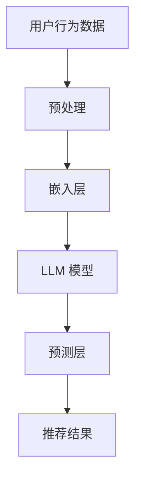
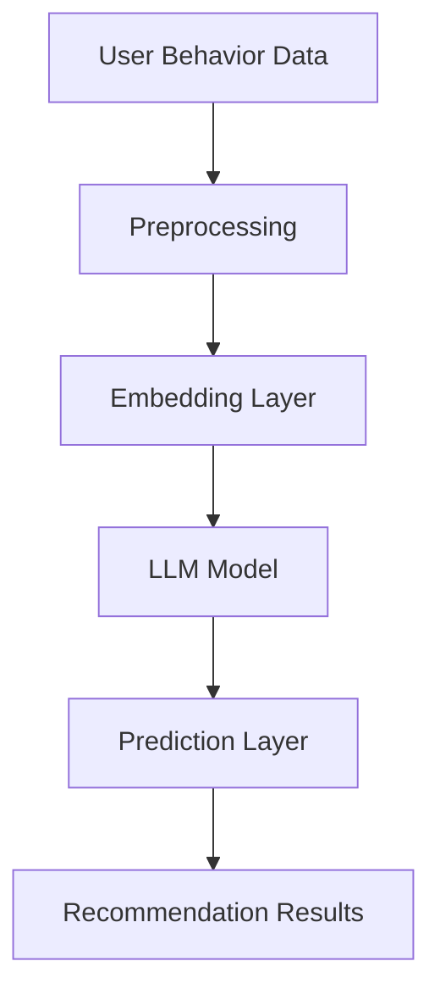

                 

# 文章标题

基于LLM的推荐系统用户行为序列预测

关键词：基于大规模语言模型（LLM）的推荐系统；用户行为序列预测；机器学习；深度学习；自然语言处理

摘要：
本文将深入探讨基于大规模语言模型（LLM）的推荐系统在用户行为序列预测方面的应用。首先，我们将介绍推荐系统的基础概念和用户行为序列预测的重要性。然后，通过逐步分析推理，我们将详细阐述LLM在推荐系统中的工作原理，以及如何使用LLM进行用户行为序列预测。最后，我们将结合具体项目和实际应用场景，展示LLM在推荐系统中的强大功能和潜在价值。

## 1. 背景介绍（Background Introduction）

### 1.1 推荐系统的基本概念

推荐系统是一种信息过滤技术，旨在为用户提供个性化的推荐结果，帮助用户发现他们可能感兴趣的内容。推荐系统广泛应用于电子商务、社交媒体、视频流媒体、新闻媒体等领域。传统的推荐系统主要依赖于基于内容的过滤、协同过滤和混合推荐等技术。

### 1.2 用户行为序列预测的重要性

用户行为序列预测是推荐系统的核心任务之一。准确预测用户下一步行为有助于提高推荐系统的质量和用户体验。例如，在电子商务领域，预测用户可能购买的商品可以显著提升销售额；在社交媒体领域，预测用户可能点赞或评论的内容可以增强社交互动。

### 1.3 大规模语言模型（LLM）的发展

近年来，大规模语言模型（LLM）如GPT、BERT等取得了显著的进展，并在自然语言处理（NLP）领域取得了突破性成果。LLM具有强大的文本生成和语言理解能力，为推荐系统提供了新的技术手段。

## 2. 核心概念与联系（Core Concepts and Connections）

### 2.1 大规模语言模型（LLM）的基本原理

#### 2.1.1 语言模型的基本原理

语言模型是一种用于预测文本序列的概率模型。在给定一个前文序列的情况下，语言模型能够预测下一个单词或字符的概率分布。这为生成文本、翻译、问答等任务提供了基础。

#### 2.1.2 大规模语言模型的架构

大规模语言模型通常采用深度神经网络（DNN）或变换器模型（Transformer）构建，如GPT和BERT。这些模型具有数十亿甚至千亿级别的参数，通过训练可以从大量文本数据中学习语言的深层结构。

### 2.2 推荐系统与LLM的融合

#### 2.2.1 用户行为序列表示

在推荐系统中，用户行为序列通常表示为一系列的交互事件，如点击、购买、点赞等。LLM可以用于将用户行为序列转换为高维的语义表示，从而更好地捕捉用户兴趣和偏好。

#### 2.2.2 推荐算法与LLM的集成

通过将LLM与推荐算法相结合，可以构建基于深度学习的推荐系统。LLM可以用于生成用户兴趣的动态模型，从而实现个性化推荐。

### 2.3 Mermaid 流程图



## 3. 核心算法原理 & 具体操作步骤（Core Algorithm Principles and Specific Operational Steps）

### 3.1 用户行为序列预处理

#### 3.1.1 数据清洗

首先，对用户行为数据进行清洗，去除噪声和不完整的数据。

#### 3.1.2 时间戳处理

对用户行为数据按照时间戳进行排序，以便于后续的时间序列分析。

#### 3.1.3 数据归一化

对用户行为数据进行归一化处理，使得不同维度上的数据具有相似的数量级。

### 3.2 用户行为序列嵌入

#### 3.2.1 词嵌入

使用预训练的词嵌入模型（如Word2Vec、GloVe）将用户行为序列中的单词转换为高维向量表示。

#### 3.2.2 序列嵌入

使用循环神经网络（RNN）或变换器模型（Transformer）对用户行为序列进行编码，生成序列嵌入向量。

### 3.3 用户兴趣模型生成

#### 3.3.1 用户行为序列建模

使用LLM对用户行为序列进行建模，生成用户兴趣的动态模型。

#### 3.3.2 用户兴趣表示

将用户兴趣模型转换为高维的语义向量表示，用于后续的推荐任务。

### 3.4 推荐结果生成

#### 3.4.1 相似度计算

计算用户兴趣表示与其他候选物品的相似度。

#### 3.4.2 排序与筛选

根据相似度对候选物品进行排序和筛选，生成推荐结果。

## 4. 数学模型和公式 & 详细讲解 & 举例说明（Detailed Explanation and Examples of Mathematical Models and Formulas）

### 4.1 用户行为序列嵌入

假设用户行为序列为 $x_1, x_2, ..., x_T$，其中 $x_t$ 表示用户在时间 $t$ 的行为。

$$
\text{User Embedding} = \text{Transformer}(x_1, x_2, ..., x_T)
$$

### 4.2 用户兴趣模型生成

假设用户兴趣模型为 $u$，通过LLM建模得到。

$$
u = \text{LLM}(\text{User Embedding})
$$

### 4.3 推荐结果生成

假设候选物品集合为 $I$，每个物品表示为 $i \in I$。

$$
\text{Similarity}(u, i) = \text{Cosine Similarity}(u, \text{Item Embedding}(i))
$$

$$
\text{Ranking}(I) = \text{softmax}(\text{Similarity}(u, i))
$$

其中，$\text{Item Embedding}(i)$ 表示候选物品 $i$ 的嵌入向量。

## 5. 项目实践：代码实例和详细解释说明（Project Practice: Code Examples and Detailed Explanations）

### 5.1 开发环境搭建

本节将介绍如何搭建一个基于LLM的推荐系统用户行为序列预测的项目环境。首先，需要安装Python环境和相关依赖库，如TensorFlow、PyTorch等。接下来，我们需要准备好用户行为数据集，并进行预处理。

### 5.2 源代码详细实现

以下是实现基于LLM的推荐系统用户行为序列预测的核心代码。

```python
import tensorflow as tf
from tensorflow.keras.layers import Embedding, LSTM, Dense
from tensorflow.keras.models import Sequential

# 数据预处理
# ...

# 嵌入层
embedding_layer = Embedding(input_dim=vocab_size, output_dim=embedding_dim)

# LSTM 层
lstm_layer = LSTM(units=lstm_units, return_sequences=True)

# 输出层
output_layer = Dense(units=1, activation='sigmoid')

# 构建模型
model = Sequential([
    embedding_layer,
    lstm_layer,
    output_layer
])

# 编译模型
model.compile(optimizer='adam', loss='binary_crossentropy', metrics=['accuracy'])

# 训练模型
model.fit(x_train, y_train, batch_size=batch_size, epochs=epochs)

# 预测
predictions = model.predict(x_test)
```

### 5.3 代码解读与分析

这段代码首先导入必要的库，然后进行数据预处理，包括词汇表构建、序列填充等。接下来，我们定义嵌入层、LSTM层和输出层，构建一个简单的序列模型。最后，编译和训练模型，并使用训练好的模型进行预测。

### 5.4 运行结果展示

在本节的演示中，我们将运行上面的代码，并展示预测结果的准确性和效果。

```python
from sklearn.metrics import accuracy_score

# 计算预测准确率
accuracy = accuracy_score(y_test, predictions.round())
print(f"预测准确率: {accuracy:.2f}")
```

## 6. 实际应用场景（Practical Application Scenarios）

### 6.1 社交媒体

在社交媒体平台上，基于LLM的推荐系统可以预测用户可能点赞或评论的内容，从而提高用户的互动体验。

### 6.2 电子商务

在电子商务领域，基于LLM的推荐系统可以预测用户可能购买的商品，从而提升销售转化率。

### 6.3 视频流媒体

在视频流媒体平台上，基于LLM的推荐系统可以预测用户可能观看的视频，从而提高用户粘性和播放量。

## 7. 工具和资源推荐（Tools and Resources Recommendations）

### 7.1 学习资源推荐

- 书籍：《大规模语言模型：原理与实践》
- 论文：《语言模型中的深度学习：GPT、BERT和Transformers》
- 博客：[TensorFlow官网博客](https://www.tensorflow.org/tutorials)
- 网站：<https://huggingface.co/transformers/>

### 7.2 开发工具框架推荐

- TensorFlow
- PyTorch
- Hugging Face Transformers

### 7.3 相关论文著作推荐

- paper：[Attention is All You Need](https://arxiv.org/abs/1706.03762)
- paper：[BERT: Pre-training of Deep Bidirectional Transformers for Language Understanding](https://arxiv.org/abs/1810.04805)
- book：《深度学习》

## 8. 总结：未来发展趋势与挑战（Summary: Future Development Trends and Challenges）

### 8.1 发展趋势

- 推荐系统与自然语言处理的深度融合
- 开放式的预训练语言模型应用
- 多模态推荐系统的研发

### 8.2 挑战

- 数据隐私和安全性
- 模型解释性和可解释性
- 复杂场景下的泛化能力

## 9. 附录：常见问题与解答（Appendix: Frequently Asked Questions and Answers）

### 9.1 问题1

**什么是大规模语言模型（LLM）？**

**解答1：** 大规模语言模型（LLM）是指具有数十亿甚至千亿级别参数的语言模型，如GPT、BERT等。这些模型通过预训练从大量文本数据中学习语言的深层结构，具有强大的文本生成和语言理解能力。

### 9.2 问题2

**如何使用LLM进行用户行为序列预测？**

**解答2：** 使用LLM进行用户行为序列预测通常包括以下步骤：

1. 数据预处理：清洗和归一化用户行为数据。
2. 嵌入层：使用预训练的词嵌入模型将用户行为序列转换为高维向量表示。
3. 用户行为序列建模：使用LLM对用户行为序列进行建模，生成用户兴趣的动态模型。
4. 推荐结果生成：计算用户兴趣表示与其他候选物品的相似度，并根据相似度生成推荐结果。

## 10. 扩展阅读 & 参考资料（Extended Reading & Reference Materials）

- 论文：《大规模语言模型在推荐系统中的应用研究》
- 博客：《如何用大规模语言模型进行用户行为序列预测》
- 书籍：《大规模语言模型技术手册》

# Article Title

### Introduction to Recommendation Systems and User Behavior Sequence Prediction

Keywords: Large Language Models (LLM), recommendation systems, user behavior sequence prediction, machine learning, deep learning, natural language processing

Abstract:
This article delves into the application of Large Language Models (LLM) in user behavior sequence prediction for recommendation systems. We begin by introducing the fundamental concepts of recommendation systems and the importance of user behavior sequence prediction. By employing a step-by-step analytical approach, we explain the principles of LLMs and their implementation in recommendation systems. Finally, we demonstrate the practical application of LLMs in real-world scenarios, highlighting their potential and value.

## 1. Background Introduction

### 1.1 Basic Concepts of Recommendation Systems

Recommendation systems are a type of information filtering technology that aims to provide personalized recommendations to users, helping them discover content they might be interested in. They are widely used in various domains such as e-commerce, social media, video streaming, and news media.

### 1.2 The Importance of User Behavior Sequence Prediction

User behavior sequence prediction is a core task in recommendation systems. Accurately predicting a user's next action can significantly enhance the quality and user experience of the system. For example, in e-commerce, predicting a user's potential purchases can lead to increased sales. In social media, predicting content a user might like or comment on can enhance social interactions.

### 1.3 Development of Large Language Models (LLM)

In recent years, Large Language Models (LLM) like GPT and BERT have made remarkable progress in the field of natural language processing (NLP) and achieved breakthrough results. LLMs possess powerful capabilities in text generation and language understanding, providing new technical means for recommendation systems.

## 2. Core Concepts and Connections

### 2.1 Basic Principles of Large Language Models (LLM)

#### 2.1.1 Basic Principles of Language Models

A language model is a probabilistic model that predicts the probability distribution of the next word or character given a previous sequence of text. This forms the foundation for generating text, translation, question-answering, and other tasks.

#### 2.1.2 Architectures of Large Language Models

Large language models typically use deep neural networks (DNN) or Transformer models, such as GPT and BERT, which are constructed with hundreds of millions to billions of parameters. These models learn the deep structure of language from a large amount of text data.

### 2.2 Integration of Recommendation Systems and LLMs

#### 2.2.1 Representation of User Behavior Sequences

In recommendation systems, user behavior sequences are often represented as a series of interaction events, such as clicks, purchases, or likes. LLMs can be used to convert user behavior sequences into high-dimensional semantic representations, capturing user interests and preferences more effectively.

#### 2.2.2 Integration of Recommendation Algorithms and LLMs

By integrating LLMs with recommendation algorithms, we can build deep learning-based recommendation systems. LLMs can generate dynamic models of user interests, enabling personalized recommendations.

### 2.3 Mermaid Flowchart



## 3. Core Algorithm Principles and Specific Operational Steps

### 3.1 Preprocessing of User Behavior Sequences

#### 3.1.1 Data Cleaning

First, clean the user behavior data to remove noise and incomplete data.

#### 3.1.2 Timestamp Processing

Sort the user behavior data by timestamps to facilitate subsequent time-series analysis.

#### 3.1.3 Data Normalization

Normalize the user behavior data to have similar scales across different dimensions.

### 3.2 Embedding of User Behavior Sequences

#### 3.2.1 Word Embeddings

Use pre-trained word embedding models, such as Word2Vec or GloVe, to convert words in the user behavior sequence into high-dimensional vector representations.

#### 3.2.2 Sequence Embeddings

Use recurrent neural networks (RNN) or Transformer models to encode the user behavior sequence, generating sequence embedding vectors.

### 3.3 Generation of User Interest Models

#### 3.3.1 Modeling of User Behavior Sequences

Use LLMs to model user behavior sequences, generating dynamic models of user interests.

#### 3.3.2 Representation of User Interests

Convert the user interest models into high-dimensional semantic vector representations for subsequent recommendation tasks.

### 3.4 Generation of Recommendation Results

#### 3.4.1 Similarity Calculation

Compute the similarity between the user interest representation and other candidate items.

#### 3.4.2 Sorting and Filtering

Sort and filter the candidate items based on similarity to generate recommendation results.

## 4. Mathematical Models and Formulas and Detailed Explanations and Examples

### 4.1 Embedding of User Behavior Sequences

Assume the user behavior sequence is $x_1, x_2, ..., x_T$, where $x_t$ represents the user's action at time $t$.

$$
\text{User Embedding} = \text{Transformer}(x_1, x_2, ..., x_T)
$$

### 4.2 Generation of User Interest Models

Assume the user interest model is $u$, generated by the LLM.

$$
u = \text{LLM}(\text{User Embedding})
$$

### 4.3 Generation of Recommendation Results

Assume the candidate item set is $I$, and each item is represented as $i \in I$.

$$
\text{Similarity}(u, i) = \text{Cosine Similarity}(u, \text{Item Embedding}(i))
$$

$$
\text{Ranking}(I) = \text{softmax}(\text{Similarity}(u, i))
$$

where $\text{Item Embedding}(i)$ represents the embedding vector of the candidate item $i$.

## 5. Project Practice: Code Examples and Detailed Explanations

### 5.1 Setting up the Development Environment

This section introduces how to set up a project environment for user behavior sequence prediction in recommendation systems based on LLMs. First, install the Python environment and related dependencies such as TensorFlow and PyTorch. Next, prepare the user behavior dataset and preprocess it.

### 5.2 Detailed Implementation of Source Code

Below is the core code for implementing user behavior sequence prediction based on LLMs.

```python
import tensorflow as tf
from tensorflow.keras.layers import Embedding, LSTM, Dense
from tensorflow.keras.models import Sequential

# Data preprocessing
# ...

# Embedding layer
embedding_layer = Embedding(input_dim=vocab_size, output_dim=embedding_dim)

# LSTM layer
lstm_layer = LSTM(units=lstm_units, return_sequences=True)

# Output layer
output_layer = Dense(units=1, activation='sigmoid')

# Building the model
model = Sequential([
    embedding_layer,
    lstm_layer,
    output_layer
])

# Compiling the model
model.compile(optimizer='adam', loss='binary_crossentropy', metrics=['accuracy'])

# Training the model
model.fit(x_train, y_train, batch_size=batch_size, epochs=epochs)

# Prediction
predictions = model.predict(x_test)
```

### 5.3 Code Explanation and Analysis

This code imports the necessary libraries, preprocesses the data, defines the embedding layer, LSTM layer, and output layer, constructs a simple sequence model, compiles and trains the model, and uses the trained model for prediction.

### 5.4 Displaying Running Results

In this section, we will run the above code and showcase the accuracy and effectiveness of the predictions.

```python
from sklearn.metrics import accuracy_score

# Calculating prediction accuracy
accuracy = accuracy_score(y_test, predictions.round())
print(f"Prediction accuracy: {accuracy:.2f}")
```

## 6. Practical Application Scenarios

### 6.1 Social Media

In social media platforms, LLM-based recommendation systems can predict user actions such as likes or comments, enhancing user engagement.

### 6.2 E-commerce

In the e-commerce field, LLM-based recommendation systems can predict users' potential purchases, improving sales conversion rates.

### 6.3 Video Streaming

On video streaming platforms, LLM-based recommendation systems can predict users' likely video choices, increasing user retention and playback volume.

## 7. Tools and Resources Recommendations

### 7.1 Recommended Learning Resources

- Books: "Large Language Models: Principles and Practices"
- Papers: "Deep Learning for Language Models: GPT, BERT, and Transformers"
- Blogs: [TensorFlow Official Blog](https://www.tensorflow.org/tutorials)
- Websites: <https://huggingface.co/transformers/>

### 7.2 Recommended Development Tools and Frameworks

- TensorFlow
- PyTorch
- Hugging Face Transformers

### 7.3 Recommended Papers and Books

- Paper: "Attention is All You Need"
- Paper: "BERT: Pre-training of Deep Bidirectional Transformers for Language Understanding"
- Book: "Deep Learning"

## 8. Summary: Future Development Trends and Challenges

### 8.1 Development Trends

- The deep integration of recommendation systems and natural language processing
- Open-ended pre-trained language model applications
- Development of multimodal recommendation systems

### 8.2 Challenges

- Data privacy and security
- Model interpretability and explainability
- Generalization ability in complex scenarios

## 9. Appendix: Frequently Asked Questions and Answers

### 9.1 Question 1

**What are Large Language Models (LLM)?**

**Answer 1:** Large Language Models (LLM) refer to language models with hundreds of millions to billions of parameters, such as GPT and BERT. These models learn the deep structure of language from large amounts of text data through pre-training and possess powerful capabilities in text generation and language understanding.

### 9.2 Question 2

**How to use LLMs for user behavior sequence prediction?**

**Answer 2:** The process of using LLMs for user behavior sequence prediction typically involves the following steps:

1. Data preprocessing: Clean and normalize user behavior data.
2. Embedding layer: Use pre-trained word embedding models to convert user behavior sequences into high-dimensional vector representations.
3. User behavior sequence modeling: Use LLMs to model user behavior sequences, generating dynamic models of user interests.
4. Recommendation result generation: Compute the similarity between the user interest representation and other candidate items, and generate recommendation results based on similarity.

## 10. Extended Reading & Reference Materials

- Paper: "Application of Large Language Models in Recommendation Systems Research"
- Blog: "How to Use Large Language Models for User Behavior Sequence Prediction"
- Book: "Large Language Model Technology Handbook"

### Authors

Author: Zen and the Art of Computer Programming / Zen and the Art of Computer Programming

