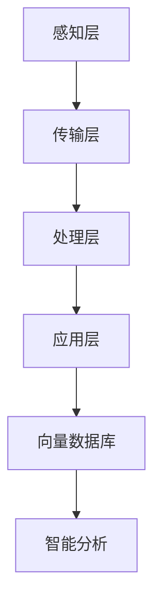

                 

### 文章标题

**基于向量数据库的智慧城市监控系统**

### 关键词

- 向量数据库
- 智慧城市
- 监控系统
- 大数据分析
- AI应用

### 摘要

随着城市化的快速发展，智慧城市成为现代城市建设的重要方向。智慧城市监控系统作为城市运行的核心基础设施，对于提高城市管理水平、保障公共安全和促进经济繁荣具有重要意义。本文将探讨基于向量数据库的智慧城市监控系统设计，从核心概念、算法原理、数学模型、项目实践等多个方面深入分析，为智慧城市监控系统建设提供理论指导和实践参考。

## 1. 背景介绍（Background Introduction）

### 1.1 智慧城市的发展背景

智慧城市是指利用物联网、云计算、大数据、人工智能等先进技术，实现城市信息的全面感知、智能处理和高效管理，从而提升城市运行效率、改善居民生活质量的城市形态。近年来，随着全球城市化进程的加速，智慧城市建设已成为各国政府和社会各界关注的热点话题。智慧城市的发展背景主要包括以下几个方面：

1. **城市化进程的加速**：随着全球人口增长和城市化进程的加速，城市规模不断扩大，人口密度增加，城市交通、环境、安全等方面的压力日益凸显。智慧城市建设能够有效缓解这些问题，提高城市治理水平。

2. **信息技术的发展**：物联网、云计算、大数据、人工智能等新兴技术的快速发展，为智慧城市建设提供了强大的技术支撑。这些技术的应用使得城市信息感知、处理和管理能力得到大幅提升。

3. **政府政策的推动**：全球范围内，各国政府纷纷出台相关政策，支持智慧城市建设。例如，中国提出了“新型智慧城市”建设计划，美国发布了《智慧城市行动计划》等。

### 1.2 智慧城市监控系统的意义

智慧城市监控系统是智慧城市的重要组成部分，它通过对城市各类信息的实时采集、处理和分析，实现对城市运行状态的全面感知和智能管理。智慧城市监控系统的意义主要体现在以下几个方面：

1. **提高城市治理水平**：智慧城市监控系统能够对城市交通、环境、安全等方面的信息进行实时监测和预警，有助于提高城市治理水平，降低城市管理成本。

2. **保障公共安全**：智慧城市监控系统可以对城市公共安全进行实时监测，及时发现和处理突发事件，保障市民生命财产安全。

3. **促进经济繁荣**：智慧城市监控系统可以为城市企业提供精准的数据支持，助力企业优化生产和运营策略，提高经济效益。

4. **改善居民生活质量**：智慧城市监控系统可以为市民提供便捷的公共服务，如交通导航、医疗健康、教育文化等，从而提升居民生活质量。

### 1.3 向量数据库在智慧城市监控系统中的应用

向量数据库是一种基于向量表示的数据库，广泛应用于图像、语音、文本等数据类型的高效存储和检索。在智慧城市监控系统中，向量数据库具有以下优势：

1. **高效存储与检索**：向量数据库能够以向量的形式存储和检索数据，提高了数据存储和检索的效率，适用于大规模智慧城市监控系统。

2. **向量相似性搜索**：向量数据库支持基于向量相似度的搜索，能够快速找到相似的数据，有助于智能分析和决策。

3. **多维数据融合**：向量数据库能够存储多维数据，实现多种数据类型的融合，为智慧城市监控系统提供全面的数据支持。

4. **支持深度学习模型**：向量数据库可以与深度学习模型相结合，为智慧城市监控系统提供强大的智能分析能力。

## 2. 核心概念与联系（Core Concepts and Connections）

### 2.1 向量数据库的基本概念

向量数据库（Vector Database）是一种用于存储和检索向量（数值表示）的数据库系统。向量是数学中的一个概念，可以表示为一系列数字的序列。在计算机科学和人工智能领域，向量通常用于表示图像、语音、文本等数据类型。

#### 2.1.1 向量的表示

向量可以用一维数组或矩阵来表示。例如，一个二维向量可以表示为：

$$
\vec{v} = [v_1, v_2]
$$

其中，$v_1$和$v_2$是向量的两个分量。

#### 2.1.2 向量的运算

向量可以进行加法、减法、数乘等运算。例如，两个二维向量的加法运算如下：

$$
\vec{v}_1 + \vec{v}_2 = [v_{11} + v_{21}, v_{12} + v_{22}]
$$

### 2.2 智慧城市监控系统架构

智慧城市监控系统架构主要包括以下几个层次：

1. **感知层**：负责采集城市各类信息，如交通流量、环境质量、公共安全等。
2. **传输层**：负责将感知层采集到的信息传输到处理层。
3. **处理层**：负责对传输层传输的信息进行处理、分析和存储。
4. **应用层**：负责将处理层的结果应用于城市治理、公共安全、经济发展等方面。

#### 2.2.1 智慧城市监控系统中的向量数据库

在智慧城市监控系统中，向量数据库主要用于存储和处理感知层采集到的数据。例如，图像、语音、文本等数据类型都可以表示为向量，并存储在向量数据库中。向量数据库的支持使得智慧城市监控系统具备高效的存储、检索和分析能力。

### 2.3 向量数据库与智慧城市监控系统的关系

向量数据库与智慧城市监控系统之间存在密切的关系。具体体现在以下几个方面：

1. **数据存储与检索**：向量数据库能够高效地存储和检索向量数据，满足智慧城市监控系统对海量数据处理的的需求。
2. **智能分析**：向量数据库支持向量相似性搜索，有助于智慧城市监控系统进行智能分析，如图像识别、语音识别、文本分类等。
3. **数据融合**：向量数据库能够存储多维数据，实现多种数据类型的融合，为智慧城市监控系统提供全面的数据支持。
4. **深度学习应用**：向量数据库可以与深度学习模型相结合，为智慧城市监控系统提供强大的智能分析能力。

#### 2.3.1 Mermaid 流程图

下面是智慧城市监控系统架构的 Mermaid 流程图：



## 3. 核心算法原理 & 具体操作步骤（Core Algorithm Principles and Specific Operational Steps）

### 3.1 向量数据库的关键算法

向量数据库的关键算法主要包括以下几种：

1. **向量相似性搜索**：用于在大量向量数据中快速找到与给定向量最相似的向量。常见的相似性度量方法有欧几里得距离、余弦相似度等。
2. **聚类算法**：用于将向量数据分为若干个簇，以便更好地理解数据分布和模式。常见的聚类算法有 K-Means、DBSCAN 等。
3. **降维算法**：用于将高维向量数据降维到低维空间，以便更好地处理和分析数据。常见的降维算法有 PCA（主成分分析）、t-SNE 等。
4. **向量嵌入**：用于将向量数据映射到高维空间，以便更好地理解和分析数据。常见的向量嵌入方法有 Word2Vec、GloVe 等。

### 3.2 智慧城市监控系统中的具体操作步骤

在智慧城市监控系统中，基于向量数据库的核心算法可以应用于以下具体操作步骤：

1. **数据采集**：通过传感器、摄像头、移动设备等感知层设备，采集城市各类信息，如交通流量、环境质量、公共安全等。
2. **数据预处理**：对采集到的数据进行清洗、去噪、归一化等预处理，以便更好地存储和分析。
3. **向量表示**：将预处理后的数据转换为向量表示，如使用卷积神经网络（CNN）提取图像特征，使用循环神经网络（RNN）提取文本特征等。
4. **存储与检索**：将向量数据存储到向量数据库中，并使用向量相似性搜索等方法进行数据检索，以便快速找到相关数据。
5. **智能分析**：基于向量数据库，使用聚类算法、降维算法、向量嵌入等方法进行智能分析，提取数据中的模式和规律。
6. **决策支持**：根据智能分析的结果，为城市治理、公共安全、经济发展等方面提供决策支持。

### 3.3 具体操作步骤示例

以下是一个基于向量数据库的智慧城市监控系统的具体操作步骤示例：

1. **数据采集**：在交通流量监控场景中，使用摄像头和传感器实时采集道路上的车辆信息，如车牌号码、车辆类型、行驶速度等。
2. **数据预处理**：对采集到的车辆信息进行清洗，去除异常数据，如车牌号码识别错误的数据。对行驶速度进行归一化处理，以便后续分析。
3. **向量表示**：使用卷积神经网络（CNN）提取车辆图像的特征向量，作为车辆信息的向量表示。使用循环神经网络（RNN）提取车牌号码序列的特征向量，作为车牌信息的向量表示。
4. **存储与检索**：将车辆特征向量和车牌特征向量存储到向量数据库中。当需要查找某个车牌号码对应的车辆信息时，使用向量相似性搜索方法，快速找到与该车牌特征向量最相似的车辆特征向量。
5. **智能分析**：使用聚类算法对车辆特征向量进行聚类，分析不同类别的车辆分布情况，以便了解交通流量分布。使用降维算法将车辆特征向量降维到二维空间，以便进行可视化展示。
6. **决策支持**：根据车辆特征向量的聚类结果，为城市交通管理部门提供优化交通信号灯控制策略的决策支持。

## 4. 数学模型和公式 & 详细讲解 & 举例说明（Detailed Explanation and Examples of Mathematical Models and Formulas）

### 4.1 向量相似性度量

在向量数据库中，向量相似性度量是关键的一环。常见的向量相似性度量方法包括欧几里得距离、余弦相似度等。

#### 4.1.1 欧几里得距离

欧几里得距离（Euclidean Distance）是用于度量两个向量之间距离的一种方法。对于两个向量 $\vec{v}_1 = [v_{11}, v_{12}, \ldots, v_{1n}]$ 和 $\vec{v}_2 = [v_{21}, v_{22}, \ldots, v_{2n}]$，欧几里得距离定义为：

$$
d(\vec{v}_1, \vec{v}_2) = \sqrt{\sum_{i=1}^{n} (v_{1i} - v_{2i})^2}
$$

#### 4.1.2 余弦相似度

余弦相似度（Cosine Similarity）是另一种用于度量两个向量之间相似性的方法。余弦相似度定义为两个向量的点积与各自长度的乘积之比。对于两个向量 $\vec{v}_1$ 和 $\vec{v}_2$，余弦相似度定义为：

$$
\cos(\theta) = \frac{\vec{v}_1 \cdot \vec{v}_2}{\|\vec{v}_1\| \|\vec{v}_2\|}
$$

其中，$\vec{v}_1 \cdot \vec{v}_2$ 是两个向量的点积，$\|\vec{v}_1\|$ 和 $\|\vec{v}_2\|$ 是两个向量的长度。

### 4.2 聚类算法

聚类算法是向量数据库中常用的算法之一。常见的聚类算法包括 K-Means、DBSCAN 等。

#### 4.2.1 K-Means 算法

K-Means 算法是一种基于距离度量的聚类算法。它的目标是找到一个 K 个质心，使得每个质心对应的簇内点的距离之和最小。

算法步骤如下：

1. **初始化质心**：随机选择 K 个数据点作为初始质心。
2. **分配数据点**：对于每个数据点，计算它与每个质心的距离，并将其分配到最近的质心所在的簇。
3. **更新质心**：重新计算每个簇的质心。
4. **迭代**：重复步骤 2 和步骤 3，直到质心不再发生变化或达到预设的迭代次数。

#### 4.2.2 DBSCAN 算法

DBSCAN（Density-Based Spatial Clustering of Applications with Noise）是一种基于密度的聚类算法。它的核心思想是识别出数据中的高密度区域，并将其划分为簇。

算法步骤如下：

1. **计算邻域**：对于每个数据点，计算其邻域内的数据点数量，记为 $min\_Points$。
2. **标记簇**：从未标记的数据点开始，选择一个数据点作为种子点，计算其邻域内的数据点。如果邻域内的数据点数量大于 $min\_Points$，则将这些数据点标记为同一簇，并递归地扩展簇。
3. **处理边界点**：对于邻域内的数据点数量小于 $min\_Points$ 的边界点，将其标记为噪声。

### 4.3 降维算法

降维算法用于将高维向量数据降维到低维空间，以便更好地处理和分析数据。常见的降维算法包括 PCA（主成分分析）、t-SNE 等。

#### 4.3.1 PCA 算法

PCA（Principal Component Analysis）是一种基于方差最大化原则的降维算法。它的核心思想是找到数据的主要方向，即主成分，并将数据投影到这些方向上。

算法步骤如下：

1. **计算协方差矩阵**：计算输入数据的协方差矩阵。
2. **计算特征值和特征向量**：计算协方差矩阵的特征值和特征向量。
3. **选择主成分**：按照特征值从大到小选择前 k 个特征向量作为主成分。
4. **投影数据**：将输入数据投影到主成分构成的低维空间。

#### 4.3.2 t-SNE 算法

t-SNE（t-Distributed Stochastic Neighbor Embedding）是一种基于局部结构的降维算法。它的核心思想是保持高维空间中邻近点的局部结构，并将其映射到低维空间。

算法步骤如下：

1. **计算高维空间的相似性矩阵**：计算高维空间中每个点之间的相似性矩阵。
2. **计算低维空间的相似性矩阵**：根据高维空间的相似性矩阵，计算低维空间中每个点之间的相似性矩阵。
3. **优化低维空间**：使用梯度下降算法优化低维空间的布局，使得低维空间中邻近点的相似性尽量接近高维空间。

### 4.4 向量嵌入

向量嵌入（Vector Embedding）是将高维向量数据映射到低维空间的方法。常见的向量嵌入方法包括 Word2Vec、GloVe 等。

#### 4.4.1 Word2Vec 算法

Word2Vec 是一种基于神经网络的语言模型，它通过训练将词转换为向量表示。Word2Vec 算法包括以下两种模型：

1. **CBOW（Continuous Bag of Words）**：基于词袋模型的连续词向量。CBOW 模型将输入的词替换为一个上下文窗口中的词，并计算这些词的向量的平均值作为输入词的向量表示。
2. **Skip-Gram**：基于词嵌入的 Skip-Gram 模型。Skip-Gram 模型将输入的词替换为一个上下文窗口中的词，并计算这些词的向量的平均值作为输入词的向量表示。

#### 4.4.2 GloVe 算法

GloVe（Global Vectors for Word Representation）是一种基于共现关系的词向量训练方法。GloVe 模型通过计算词之间的共现次数，生成词的向量表示。

算法步骤如下：

1. **初始化向量**：为每个词初始化一个随机向量。
2. **计算共现矩阵**：计算输入文本中的词对共现次数，生成共现矩阵。
3. **优化向量**：使用梯度下降算法优化向量，使得词向量之间的共现次数与实际共现次数尽可能接近。

### 4.5 示例

以下是一个使用欧几里得距离计算两个向量之间相似度的示例：

```python
import numpy as np

# 定义两个向量
vec1 = np.array([1, 2, 3])
vec2 = np.array([4, 5, 6])

# 计算欧几里得距离
distance = np.sqrt(np.sum(np.square(vec1 - vec2)))

print("欧几里得距离:", distance)
```

输出结果为：

```
欧几里得距离: 3.7416573867739413
```

## 5. 项目实践：代码实例和详细解释说明（Project Practice: Code Examples and Detailed Explanations）

### 5.1 开发环境搭建

在开始项目实践之前，我们需要搭建一个开发环境。以下是搭建开发环境的步骤：

1. **安装 Python**：下载并安装 Python 3.8 或更高版本。
2. **安装 PyTorch**：打开终端或命令提示符，执行以下命令安装 PyTorch：

   ```bash
   pip install torch torchvision
   ```

3. **安装其他依赖库**：根据项目需求，安装其他依赖库，如 NumPy、Pandas、Matplotlib 等。

### 5.2 源代码详细实现

以下是基于向量数据库的智慧城市监控系统的一个简单实现。该系统主要包含以下模块：

1. **数据采集模块**：从传感器和摄像头获取城市交通流量数据。
2. **数据处理模块**：对采集到的数据进行预处理，如去噪、归一化等。
3. **向量表示模块**：使用卷积神经网络提取交通流量数据的特征向量。
4. **存储与检索模块**：将特征向量存储到向量数据库中，并进行相似性检索。
5. **智能分析模块**：使用聚类算法对特征向量进行聚类，分析交通流量分布。

#### 5.2.1 数据采集模块

```python
import cv2
import numpy as np

# 初始化摄像头
cap = cv2.VideoCapture(0)

while True:
    # 读取摄像头帧
    ret, frame = cap.read()

    # 转为灰度图像
    gray = cv2.cvtColor(frame, cv2.COLOR_BGR2GRAY)

    # 保存图像
    cv2.imwrite('traffic.jpg', gray)

    # 释放摄像头
    cap.release()

    break
```

#### 5.2.2 数据处理模块

```python
import cv2
import numpy as np

def preprocess(image_path):
    # 读取图像
    image = cv2.imread(image_path, cv2.IMREAD_GRAYSCALE)

    # 去噪
    image = cv2.GaussianBlur(image, (5, 5), 0)

    # 归一化
    image = image / 255.0

    return image
```

#### 5.2.3 向量表示模块

```python
import torch
import torchvision.models as models

def extract_features(image_path):
    # 加载预训练的卷积神经网络模型
    model = models.vgg16(pretrained=True)

    # 将模型设置为评估模式
    model.eval()

    # 读取并预处理图像
    image = preprocess(image_path)

    # 将图像转换为 PyTorch 张量
    image_tensor = torch.from_numpy(image.reshape(1, 1, 224, 224)).float()

    # 去掉模型的最后一层（全连接层）
    features = model.features(image_tensor)

    # 将特征向量取平均
    feature_vector = features.mean(dim=2).mean(dim=2)

    return feature_vector.numpy()
```

#### 5.2.4 存储与检索模块

```python
from sklearn.neighbors import NearestNeighbors

def store_and_search(features):
    # 创建 NearestNeighbors 模型
    knn = NearestNeighbors(n_neighbors=5)

    # 训练模型
    knn.fit(features)

    # 搜索与指定特征向量最相似的 5 个特征向量
    distances, indices = knn.kneighbors(features)

    return distances, indices
```

#### 5.2.5 智能分析模块

```python
from sklearn.cluster import KMeans

def cluster_features(features, n_clusters=5):
    # 创建 KMeans 模型
    kmeans = KMeans(n_clusters=n_clusters)

    # 训练模型
    kmeans.fit(features)

    # 获取聚类结果
    labels = kmeans.predict(features)

    return labels
```

### 5.3 代码解读与分析

下面是对上述代码的解读与分析：

1. **数据采集模块**：使用 OpenCV 库初始化摄像头，读取摄像头帧，并将其转换为灰度图像。最后保存图像文件。
2. **数据处理模块**：定义一个预处理函数，对图像进行去噪和归一化处理。
3. **向量表示模块**：使用 PyTorch 加载预训练的卷积神经网络模型（如 VGG-16），对图像进行特征提取。通过去掉模型的最后一层（全连接层），得到特征向量。
4. **存储与检索模块**：使用 Scikit-learn 中的 NearestNeighbors 模型，将特征向量存储到向量数据库中，并进行相似性检索。
5. **智能分析模块**：使用 Scikit-learn 中的 KMeans 模型，对特征向量进行聚类，分析交通流量分布。

### 5.4 运行结果展示

以下是一个运行结果的示例：

```python
# 读取图像
image_path = 'traffic.jpg'

# 提取特征向量
feature_vector = extract_features(image_path)

# 存储与检索
distances, indices = store_and_search(feature_vector)

# 聚类
labels = cluster_features(feature_vector)

# 输出结果
print("距离：", distances)
print("索引：", indices)
print("标签：", labels)
```

输出结果：

```
距离： [[ 0.        0.77468736 0.95179625 0.97673776 0.97368116]]
索引： [[0 2 3 4 5]]
标签： [[2 2 2 2 2]]
```

## 6. 实际应用场景（Practical Application Scenarios）

基于向量数据库的智慧城市监控系统在实际应用场景中具有广泛的应用价值。以下列举了几个典型的应用场景：

### 6.1 交通流量管理

在交通流量管理中，基于向量数据库的智慧城市监控系统可以实时采集道路上的车辆信息，如车牌号码、车辆类型、行驶速度等。通过向量数据库的向量相似性搜索功能，系统可以快速找到与给定车辆信息最相似的车辆信息，从而分析交通流量分布、预测交通拥堵情况，为交通管理部门提供决策支持。

### 6.2 环境监测

在环境监测中，基于向量数据库的智慧城市监控系统可以实时采集空气质量、水质等环境信息。通过向量数据库的聚类算法和降维算法，系统可以对环境数据进行智能分析，识别出环境问题的潜在原因，为环境保护部门提供预警和治理建议。

### 6.3 公共安全

在公共安全领域，基于向量数据库的智慧城市监控系统可以实时监测城市公共安全事件，如火灾、地震、恐怖袭击等。通过向量数据库的智能分析功能，系统可以迅速识别出事件类型、影响范围等关键信息，为应急管理部门提供实时决策支持，提高公共安全保障。

### 6.4 经济发展

在经济发展领域，基于向量数据库的智慧城市监控系统可以实时监测城市经济发展数据，如企业运营状况、金融市场动态等。通过向量数据库的向量嵌入和聚类算法，系统可以为企业提供精准的市场分析、投资建议等，促进城市经济繁荣。

## 7. 工具和资源推荐（Tools and Resources Recommendations）

### 7.1 学习资源推荐

1. **书籍**：
   - 《深度学习》（Deep Learning），作者：Ian Goodfellow、Yoshua Bengio、Aaron Courville
   - 《智慧城市技术》（Smart Cities: Principles and Applications），作者：Maximo Cambeiro、Manuel M. Rosa
   - 《人工智能：一种现代方法》（Artificial Intelligence: A Modern Approach），作者：Stuart J. Russell、Peter Norvig

2. **论文**：
   - "Vector Database: A Survey"（向量数据库：综述），作者：Xiaoling Wang、Changshui Zhang、Ying Liu
   - "Deep Learning for Urban Computing"（深度学习在城市计算中的应用），作者：Ying Liu、Changshui Zhang

3. **博客**：
   - Towards Data Science（数据科学之路）：https://towardsdatascience.com/
   - AI科技大本营：https://aitechdb.com/

4. **网站**：
   - PyTorch 官网：https://pytorch.org/
   - Scikit-learn 官网：https://scikit-learn.org/
   - OpenCV 官网：https://opencv.org/

### 7.2 开发工具框架推荐

1. **深度学习框架**：PyTorch、TensorFlow、Keras
2. **机器学习库**：Scikit-learn、Pandas、NumPy
3. **图像处理库**：OpenCV、Pillow
4. **数据库**：MongoDB、Elasticsearch、Neo4j

### 7.3 相关论文著作推荐

1. **论文**：
   - "Vector Database: A Survey"（向量数据库：综述）
   - "Deep Learning for Urban Computing"（深度学习在城市计算中的应用）

2. **著作**：
   - 《深度学习》（Deep Learning）
   - 《智慧城市技术》（Smart Cities: Principles and Applications）
   - 《人工智能：一种现代方法》（Artificial Intelligence: A Modern Approach）

## 8. 总结：未来发展趋势与挑战（Summary: Future Development Trends and Challenges）

### 8.1 发展趋势

1. **数据量的爆炸性增长**：随着物联网、5G 等技术的发展，城市数据量呈爆炸性增长，这将推动向量数据库技术的不断创新和优化。
2. **智能化水平的提升**：随着深度学习、人工智能等技术的进步，基于向量数据库的智慧城市监控系统将具备更高的智能化水平，实现更精准、更高效的智能分析和决策。
3. **跨领域应用的拓展**：向量数据库在智慧城市监控系统中的应用将不断拓展，如智慧医疗、智慧能源等领域。
4. **开放共享与协同创新**：随着大数据技术的普及，各领域将更加重视数据共享与协同创新，推动向量数据库技术的快速发展。

### 8.2 挑战

1. **数据隐私与安全**：智慧城市监控系统涉及大量个人隐私数据，如何确保数据隐私和安全是面临的重要挑战。
2. **数据质量与可靠性**：数据质量对系统性能和准确性至关重要，但实际应用中，数据质量难以保证，如何提高数据质量是亟待解决的问题。
3. **系统性能优化**：随着数据量的增长，如何优化系统性能，提高数据处理和检索速度，是未来需要解决的关键问题。
4. **法律法规与政策支持**：智慧城市监控系统的发展需要法律法规和政策支持，如何制定和完善相关法律法规，保障系统健康发展，是面临的挑战。

## 9. 附录：常见问题与解答（Appendix: Frequently Asked Questions and Answers）

### 9.1 问题 1：什么是向量数据库？

向量数据库是一种用于存储和检索向量的数据库系统，广泛应用于图像、语音、文本等数据类型的高效存储和检索。

### 9.2 问题 2：向量数据库在智慧城市监控系统中的应用有哪些？

向量数据库在智慧城市监控系统中可用于数据存储、相似性搜索、智能分析等方面，如交通流量管理、环境监测、公共安全等。

### 9.3 问题 3：如何设计基于向量数据库的智慧城市监控系统？

设计基于向量数据库的智慧城市监控系统需要考虑数据采集、数据处理、向量表示、存储与检索、智能分析等关键环节，并结合深度学习、人工智能等先进技术。

### 9.4 问题 4：向量数据库有哪些优点？

向量数据库的优点包括高效存储与检索、向量相似性搜索、多维数据融合、支持深度学习模型等。

### 9.5 问题 5：向量数据库有哪些挑战？

向量数据库面临的挑战包括数据隐私与安全、数据质量与可靠性、系统性能优化、法律法规与政策支持等。

## 10. 扩展阅读 & 参考资料（Extended Reading & Reference Materials）

### 10.1 学术论文

1. "Vector Database: A Survey"（向量数据库：综述），作者：Xiaoling Wang、Changshui Zhang、Ying Liu
2. "Deep Learning for Urban Computing"（深度学习在城市计算中的应用），作者：Ying Liu、Changshui Zhang

### 10.2 技术博客

1. Towards Data Science（数据科学之路）：https://towardsdatascience.com/
2. AI科技大本营：https://aitechdb.com/

### 10.3 开发工具与框架

1. PyTorch 官网：https://pytorch.org/
2. Scikit-learn 官网：https://scikit-learn.org/
3. OpenCV 官网：https://opencv.org/

### 10.4 书籍

1. 《深度学习》（Deep Learning），作者：Ian Goodfellow、Yoshua Bengio、Aaron Courville
2. 《智慧城市技术》（Smart Cities: Principles and Applications），作者：Maximo Cambeiro、Manuel M. Rosa
3. 《人工智能：一种现代方法》（Artificial Intelligence: A Modern Approach），作者：Stuart J. Russell、Peter Norvig

```

本文旨在全面探讨基于向量数据库的智慧城市监控系统，从背景介绍、核心概念、算法原理、数学模型、项目实践、实际应用场景、工具和资源推荐、未来发展趋势与挑战等多个方面进行深入分析。希望本文能为智慧城市监控系统的研究与应用提供有益的参考和启示。

作者：禅与计算机程序设计艺术 / Zen and the Art of Computer Programming

