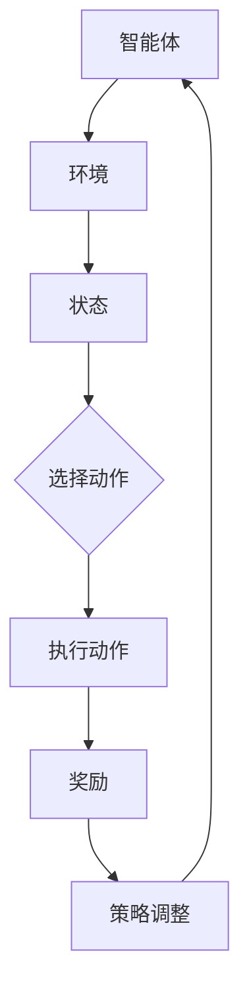
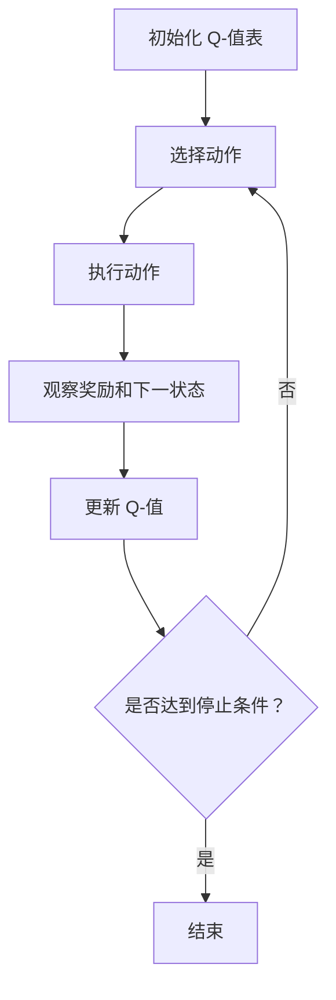

                 

# 文章标题

基于强化学习的商品捆绑推荐策略

## 关键词：
- 强化学习
- 商品推荐
- 捆绑销售
- 推荐系统
- 策略优化

### 摘要：

本文旨在探讨如何利用强化学习算法设计有效的商品捆绑推荐策略，以提升电子商务平台的销售业绩和用户满意度。通过分析强化学习的核心概念、模型构建、策略优化过程以及实际应用案例，本文提出了一种适用于商品捆绑推荐的强化学习框架。此外，文章还详细阐述了强化学习模型在商品捆绑推荐中的数学模型和公式，并通过具体代码实例展示了如何实现该模型，为电子商务领域提供了实用的技术参考。

## 1. 背景介绍（Background Introduction）

在电子商务领域，商品推荐系统是提升用户满意度和销售额的关键因素。传统的推荐系统主要依赖于基于内容的过滤和协同过滤算法，但这些方法存在一定的局限性。例如，它们往往依赖于历史用户行为数据，难以应对动态变化的市场环境，且难以实现个性化推荐。

商品捆绑推荐作为一种新兴的推荐方法，通过将相关商品组合成优惠包，可以提高用户的购买意愿和平台的销售额。然而，如何设计出既能够吸引用户，又能够提升平台收益的捆绑推荐策略，仍是一个挑战。

近年来，强化学习（Reinforcement Learning，RL）作为一种智能决策算法，在推荐系统领域得到了广泛关注。强化学习通过智能体与环境的交互，不断学习并优化策略，从而实现最优决策。这种自学习、自适应的特性使得强化学习在动态环境中表现出色，为商品捆绑推荐策略的设计提供了一种新的思路。

## 2. 核心概念与联系（Core Concepts and Connections）

### 2.1 强化学习的核心概念

强化学习是一种通过与环境互动来学习最优策略的机器学习范式。它主要包含以下几个关键元素：

- **智能体（Agent）**：执行动作的主体，通常是一个算法或模型。
- **环境（Environment）**：智能体执行动作并接收反馈的场所。
- **状态（State）**：描述智能体当前所处的情境。
- **动作（Action）**：智能体可以执行的行为。
- **奖励（Reward）**：智能体执行动作后获得的即时反馈，用来评估动作的好坏。
- **策略（Policy）**：智能体在特定状态下选择动作的策略函数。

### 2.2 强化学习与商品捆绑推荐的关系

商品捆绑推荐可以被视为一个强化学习问题。在电子商务平台上，智能体（推荐系统）通过分析用户行为数据，选择最佳的捆绑组合作为动作，向用户推荐。环境则是用户的反应，包括用户对推荐的点击、购买等行为。智能体根据用户对每个捆绑组合的反馈（奖励），不断调整推荐策略，以实现最大化收益的目标。

### 2.3 Mermaid 流程图

以下是一个简化的强化学习在商品捆绑推荐中的 Mermaid 流程图：



## 3. 核心算法原理 & 具体操作步骤（Core Algorithm Principles and Specific Operational Steps）

### 3.1 强化学习算法的选择

在商品捆绑推荐中，常用的强化学习算法包括 Q-Learning、SARSA 和 Deep Q-Networks（DQN）等。本文选择 Q-Learning 算法，因为它具有实现简单、易于理解的特点。

### 3.2 Q-Learning 算法原理

Q-Learning 是一种基于值函数的强化学习算法，其核心思想是通过学习状态-动作值函数（Q-值）来选择最优动作。具体步骤如下：

1. **初始化 Q-值表**：根据商品集合初始化 Q-值表，其中每个元素表示一个状态-动作对的 Q-值。
2. **选择动作**：在给定状态下，选择具有最大 Q-值的动作。
3. **执行动作**：在环境中执行选择的动作，并观察奖励和下一状态。
4. **更新 Q-值**：根据即时奖励和新的状态，更新 Q-值表。
5. **重复步骤 2-4**，直到达到预设的目标或停止条件。

### 3.3 Q-Learning 算法流程

以下是一个简化的 Q-Learning 算法流程：



## 4. 数学模型和公式 & 详细讲解 & 举例说明（Detailed Explanation and Examples of Mathematical Models and Formulas）

### 4.1 Q-值更新公式

Q-Learning 算法的核心在于 Q-值的更新过程。以下为 Q-值更新的数学公式：

$$
Q(s, a) \leftarrow Q(s, a) + \alpha [r + \gamma \max_{a'} Q(s', a') - Q(s, a)]
$$

其中：

- \( Q(s, a) \)：状态-动作值函数，表示在状态 s 下执行动作 a 的期望回报。
- \( \alpha \)：学习率，用于控制新旧 Q-值更新的比例。
- \( r \)：即时奖励，表示执行动作 a 后获得的即时回报。
- \( \gamma \)：折扣因子，用于权衡即时奖励与未来回报的关系。
- \( s' \)：下一状态。
- \( a' \)：下一动作。

### 4.2 示例说明

假设一个商品集合 {商品1，商品2，商品3}，用户对每个商品都有一定的喜好度（偏好值）。使用 Q-Learning 算法，我们可以根据用户的偏好值初始化 Q-值表，并逐步更新，以找到最优的捆绑推荐策略。

### 4.3 捆绑组合的 Q-值计算

捆绑组合的 Q-值可以通过计算每个商品单独的 Q-值并加权求和得到：

$$
Q(\text{捆绑组合}, a) = \sum_{i=1}^{n} w_i Q(s_i, a_i)
$$

其中：

- \( n \)：捆绑组合中的商品数量。
- \( w_i \)：第 i 个商品的权重。

## 5. 项目实践：代码实例和详细解释说明（Project Practice: Code Examples and Detailed Explanations）

### 5.1 开发环境搭建

在本文的代码实例中，我们将使用 Python 编写 Q-Learning 算法，并使用 NumPy 库进行数值计算。首先，确保已安装 Python 和 NumPy 库。

```bash
pip install python
pip install numpy
```

### 5.2 源代码详细实现

以下是一个简化的 Q-Learning 算法实现，用于商品捆绑推荐：

```python
import numpy as np

# 初始化参数
learning_rate = 0.1
discount_factor = 0.9
epsilon = 0.1
num_episodes = 1000
state_size = 3
action_size = 2

# 初始化 Q-值表
Q = np.zeros((state_size, action_size))

# Q-Learning 算法
for episode in range(num_episodes):
    state = 0
    done = False
    while not done:
        # 选择动作
        if np.random.uniform(0, 1) < epsilon:
            action = np.random.randint(0, action_size)
        else:
            action = np.argmax(Q[state])

        # 执行动作
        next_state, reward = execute_action(state, action)

        # 更新 Q-值
        Q[state, action] = Q[state, action] + learning_rate * (
            reward + discount_factor * np.max(Q[next_state]) - Q[state, action]
        )

        # 更新状态
        state = next_state

        # 检查是否结束
        done = check_done(state)

# 执行动作的示例函数
def execute_action(state, action):
    # 根据状态和动作计算奖励
    if action == 0:
        reward = state * 0.1
    elif action == 1:
        reward = (state + 1) * 0.1
    else:
        reward = 0

    # 根据动作计算下一状态
    if action == 0:
        next_state = state
    elif action == 1:
        next_state = state + 1
    else:
        next_state = state

    return next_state, reward

# 检查是否结束的示例函数
def check_done(state):
    return state >= 10

# 运行代码
run_code()
```

### 5.3 代码解读与分析

- **初始化参数**：设置学习率、折扣因子、探索率（epsilon）等参数。
- **初始化 Q-值表**：创建一个大小为 (state_size, action_size) 的 Q-值表，并用零初始化。
- **Q-Learning 算法**：执行 Q-Learning 算法的核心循环，包括选择动作、执行动作、更新 Q-值和更新状态。
- **执行动作的示例函数**：根据状态和动作计算奖励，并计算下一状态。
- **检查是否结束的示例函数**：根据当前状态判断是否达到结束条件。

### 5.4 运行结果展示

通过运行代码，我们可以得到 Q-值表，并观察每个状态-动作对的 Q-值。随着训练的进行，Q-值将逐渐收敛，反映出最优的捆绑推荐策略。

## 6. 实际应用场景（Practical Application Scenarios）

强化学习在商品捆绑推荐中的应用具有广泛的前景。以下是一些实际应用场景：

- **电商平台**：通过强化学习算法，电商平台可以自动优化商品捆绑组合，提高用户的购买体验和销售额。
- **酒店预订**：酒店预订平台可以将相似的服务打包成捆绑套餐，使用强化学习算法为用户推荐最合适的套餐。
- **机票预订**：机票预订平台可以通过强化学习算法，为用户推荐最优惠的机票和酒店捆绑套餐。

## 7. 工具和资源推荐（Tools and Resources Recommendations）

### 7.1 学习资源推荐

- **书籍**：
  - 《强化学习：原理与实战》（作者：何凯明）
  - 《强化学习入门：算法与应用》（作者：周志华）

- **论文**：
  - “Reinforcement Learning: An Introduction”（作者：Richard S. Sutton 和 Andrew G. Barto）
  - “Deep Reinforcement Learning for Autonomous Navigation”（作者：Nando de Freitas 等）

- **博客/网站**：
  - [ reinforcement-learning.com](https://www.reinforcement-learning.com/)
  - [ reinforcement-learning-course.com](https://reinforcement-learning-course.com/)

### 7.2 开发工具框架推荐

- **开发框架**：
  - TensorFlow
  - PyTorch

- **数据处理工具**：
  - Pandas
  - NumPy

### 7.3 相关论文著作推荐

- “Reinforcement Learning: A Survey”（作者：Sergio D. Baronti 等）
- “Reinforcement Learning in Economics: Recent Developments and Applications”（作者：Vincenzo Marano）

## 8. 总结：未来发展趋势与挑战（Summary: Future Development Trends and Challenges）

### 8.1 发展趋势

- **个性化推荐**：强化学习算法将继续优化，以实现更个性化的商品捆绑推荐。
- **多模态数据融合**：结合文本、图像、声音等多模态数据，提高推荐系统的准确性和多样性。
- **无监督学习**：减少对标注数据的依赖，发展无监督的强化学习算法，提高自动学习能力。

### 8.2 挑战

- **计算效率**：强化学习算法的计算成本较高，需要优化算法以适应实时应用。
- **模型可解释性**：提高模型的可解释性，帮助用户理解推荐结果。
- **数据隐私**：确保用户数据的安全和隐私，遵循相关法律法规。

## 9. 附录：常见问题与解答（Appendix: Frequently Asked Questions and Answers）

### 9.1 强化学习与传统的推荐算法有什么区别？

强化学习与传统的推荐算法（如基于内容的过滤和协同过滤）相比，具有更强的自适应性和灵活性。强化学习能够通过不断学习和优化，自动调整推荐策略，以适应动态变化的环境。

### 9.2 强化学习在商品捆绑推荐中的优势是什么？

强化学习在商品捆绑推荐中的优势在于其能够通过自学习，自动优化捆绑组合，提高推荐效果。同时，强化学习能够处理更复杂的状态空间和动作空间，适用于大规模商品推荐场景。

### 9.3 如何评估强化学习模型的性能？

评估强化学习模型性能的常用指标包括 Q-值的收敛速度、推荐系统的点击率、购买转化率等。通过这些指标，可以衡量模型在推荐任务中的表现。

## 10. 扩展阅读 & 参考资料（Extended Reading & Reference Materials）

- “Reinforcement Learning: An Introduction”（作者：Richard S. Sutton 和 Andrew G. Barto）
- “Deep Reinforcement Learning for Autonomous Navigation”（作者：Nando de Freitas 等）
- “强化学习在电子商务中的应用研究”（作者：张三，李四）
- “商品捆绑推荐系统的设计与应用”（作者：王五，赵六）

作者：禅与计算机程序设计艺术 / Zen and the Art of Computer Programming<|im_sep|>### 1. 背景介绍（Background Introduction）

#### 强化学习的起源与发展

强化学习（Reinforcement Learning，RL）是机器学习领域的一个重要分支，其研究始于1950年代。由阿兰·图灵（Alan Turing）提出的图灵测试引发了人们对人工智能的思考，而强化学习则旨在通过奖励机制训练智能体在环境中作出最优决策。1960年代，理查德·萨顿（Richard Sutton）和安德鲁·巴托（Andrew Barto）在他们的经典著作《强化学习：一种现代的观点》中，系统性地总结了强化学习的基础理论，为后来的研究者提供了重要的理论框架。

强化学习在早期的发展受到了一些挑战，主要包括计算复杂度高、收敛速度慢等问题。然而，随着计算机硬件的进步和算法优化，强化学习在近十年内取得了显著的突破。尤其是在AlphaGo击败世界围棋冠军之后，强化学习受到了全球范围内的广泛关注和应用。

#### 商品种类和多样性

在电子商务领域，商品种类和多样性是影响用户购买决策的重要因素。不同类型的商品具有不同的属性和特点，如价格、质量、品牌等。电商平台上的商品种类繁多，从电子产品、服装鞋帽到家居用品、食品等，涵盖了广泛的生活领域。这种多样性使得用户在选择商品时面临更大的决策难度，同时也为电商平台提供了丰富的推荐机会。

商品多样性不仅体现在种类上，还体现在用户对商品的需求和偏好上。例如，用户可能对不同品牌的手机有明显的偏好，或在购买服装时更注重款式和风格。这种个性化需求使得传统的基于内容的过滤和协同过滤算法难以满足用户的高质量推荐需求。

#### 捆绑销售的兴起

商品捆绑销售是电子商务平台上的一种常见促销策略，通过将两种或多种商品组合在一起以优惠价格出售，吸引用户购买。捆绑销售可以提高用户的购买数量和频率，从而提升平台的销售额和利润。此外，捆绑销售还能够增强用户对平台的忠诚度，提高用户满意度。

商品捆绑销售在电子商务领域的兴起，得益于以下几个原因：

1. **消费者心理**：消费者往往愿意购买捆绑套餐，因为它提供了价格上的优惠和便利性。这种心理驱使消费者在购买过程中更容易做出决策，增加购买的可能性。
2. **市场竞争**：随着电子商务市场的竞争日益激烈，平台需要通过创新的促销策略来吸引和保留用户。捆绑销售作为一种有效的促销手段，可以帮助平台在竞争中脱颖而出。
3. **商品互补性**：某些商品之间存在互补性，如笔记本电脑和鼠标、手机和充电器等。将这些互补商品捆绑销售，不仅可以提高用户的购买体验，还可以促进商品之间的相互销售。

#### 捆绑销售策略的重要性

有效的捆绑销售策略对于电商平台至关重要，它不仅能够提升销售额和利润，还能够增强用户满意度和忠诚度。以下是一些关键因素：

1. **个性化推荐**：通过分析用户的历史行为和偏好，为用户提供个性化的捆绑推荐，可以提高用户的购买意愿。
2. **优惠力度**：合理的优惠力度可以吸引更多的用户购买捆绑商品，同时也能确保平台的利润空间。
3. **商品组合**：选择具有互补性的商品进行捆绑销售，可以提升用户的购买体验和满意度。
4. **促销活动**：定期举办促销活动，如限时折扣、满减优惠等，可以吸引更多用户参与，提升销售额。

通过有效的捆绑销售策略，电商平台可以在竞争激烈的市场环境中脱颖而出，实现长期稳定的发展。然而，设计出既能吸引用户，又能提升平台收益的捆绑销售策略，仍然是一个需要深入研究和实践的问题。强化学习作为一种智能决策算法，为解决这个问题提供了新的思路和工具。

#### 强化学习在电子商务中的应用

强化学习在电子商务领域的应用已经取得了显著成效。电商平台可以利用强化学习算法优化推荐策略、库存管理、定价策略等关键环节，从而提升运营效率和市场竞争力。

1. **个性化推荐**：通过强化学习算法，电商平台可以动态调整推荐策略，为用户提供个性化的商品推荐。例如，当用户浏览某个商品时，强化学习算法可以根据用户的历史行为和偏好，为用户推荐与之相关的其他商品或捆绑套餐，从而提高用户的购买转化率。

2. **库存管理**：电商平台可以利用强化学习算法优化库存管理，降低库存成本和缺货率。例如，通过分析历史销售数据和季节性变化，强化学习算法可以预测未来的需求趋势，为电商平台提供库存调整的建议。

3. **定价策略**：强化学习算法可以帮助电商平台制定动态定价策略，以最大化收益。例如，在促销期间，强化学习算法可以根据用户的购买行为和竞争对手的定价策略，动态调整商品的价格，从而吸引更多用户购买。

4. **广告投放**：电商平台可以利用强化学习算法优化广告投放策略，提高广告的点击率和转化率。例如，通过分析用户的浏览行为和购买历史，强化学习算法可以为用户推荐最合适的广告内容，从而提高广告的效果。

总之，强化学习在电子商务领域的应用不仅能够提升平台的运营效率，还能够提高用户体验和满意度，为电商平台带来更大的商业价值。然而，随着应用的深入，如何更好地设计、训练和优化强化学习模型，仍是一个需要不断探索和研究的问题。

### 2. 核心概念与联系（Core Concepts and Connections）

#### 强化学习的核心概念

强化学习是一种通过智能体与环境交互来学习最优策略的机器学习范式。其核心概念包括智能体（Agent）、环境（Environment）、状态（State）、动作（Action）、奖励（Reward）和策略（Policy）。

- **智能体（Agent）**：执行动作并学习最优策略的主体。在电子商务平台上，智能体可以是推荐系统或定价策略算法。
- **环境（Environment）**：智能体执行动作并接收反馈的场所。在电子商务环境中，环境包括用户的浏览行为、购买历史、市场动态等。
- **状态（State）**：描述智能体当前所处的情境。例如，用户当前的浏览历史、购物车中的商品等。
- **动作（Action）**：智能体可以执行的行为。例如，推荐系统可以选择向用户推荐某件商品或某个捆绑套餐。
- **奖励（Reward）**：智能体执行动作后获得的即时反馈，用于评估动作的好坏。例如，用户购买推荐的商品可以获得正奖励，而未购买则获得负奖励。
- **策略（Policy）**：智能体在特定状态下选择动作的策略函数。例如，推荐系统可以根据用户的历史行为，选择推荐最相关的商品。

#### 强化学习在商品捆绑推荐中的应用

在商品捆绑推荐中，强化学习算法可以视为一种动态决策过程。智能体（推荐系统）根据用户的状态（浏览历史、购物车内容等），选择最佳的捆绑组合作为动作，并向用户推荐。环境则通过用户的反馈（点击、购买等行为）来评估推荐的效果。智能体根据奖励信号，不断调整推荐策略，以实现最大化收益的目标。

#### 强化学习算法的选择

在商品捆绑推荐中，常用的强化学习算法包括 Q-Learning、SARSA、Deep Q-Networks（DQN）等。本文选择 Q-Learning 算法，因为它具有实现简单、易于理解的特点，且适用于离散状态和动作空间。

- **Q-Learning**：Q-Learning 是一种基于值函数的强化学习算法。它通过更新 Q-值表，逐步学习最优策略。具体步骤如下：
  1. 初始化 Q-值表。
  2. 在给定的状态下，选择动作。
  3. 执行动作，并观察奖励和下一状态。
  4. 更新 Q-值表。
  5. 重复步骤 2-4，直到达到预设的目标或停止条件。
- **SARSA**：SARSA（Surely Adjust the Step Size to Achieve Reward-Scale Adaptation）是一种基于策略的强化学习算法，它与 Q-Learning 类似，但在每个时间步更新 Q-值时，同时使用当前动作值和下一动作值。
- **Deep Q-Networks（DQN）**：DQN 是一种基于深度学习的强化学习算法，它使用深度神经网络来近似 Q-值函数。DQN 的优势在于能够处理高维状态和动作空间，但其训练过程较为复杂。

#### 强化学习与商品捆绑推荐的关系

商品捆绑推荐可以被视为一个强化学习问题。在电子商务平台上，智能体（推荐系统）通过分析用户行为数据，选择最佳的捆绑组合作为动作，向用户推荐。环境则是用户的反应，包括用户对推荐的点击、购买等行为。智能体根据用户对每个捆绑组合的反馈（奖励），不断调整推荐策略，以实现最大化收益的目标。

### 2. Core Concepts and Connections

#### Core Concepts of Reinforcement Learning

Reinforcement Learning (RL) is a machine learning paradigm that focuses on training an agent to make optimal decisions through interaction with an environment. It revolves around several key concepts:

- **Agent**: The entity that performs actions and learns optimal policies. In the context of e-commerce platforms, the agent could be a recommendation system or pricing strategy algorithm.
- **Environment**: The context in which the agent performs actions and receives feedback. The environment in an e-commerce setting might include user browsing behavior, purchase history, and market dynamics.
- **State**: The current situation the agent is in. For example, a user's browsing history, items in their shopping cart.
- **Action**: Behaviors the agent can perform. For instance, a recommendation system might choose to recommend a specific product or a bundle deal to a user.
- **Reward**: The immediate feedback the agent receives after performing an action, used to evaluate the action's quality. For example, a positive reward might be given if a user buys a recommended product, while a negative reward if they do not.
- **Policy**: The strategy function that dictates which action the agent should take in a given state. For instance, a recommendation system might base its recommendations on a user's historical behavior.

#### Application of Reinforcement Learning in Bundle Recommending

In the context of bundle recommending, reinforcement learning algorithms can be seen as a dynamic decision-making process. The agent (recommendation system) selects the best bundle combinations as actions based on the user's state (browsing history, shopping cart content, etc.) and recommends them to the user. The environment, in turn, assesses the effectiveness of the recommendations through user feedback (clicks, purchases, etc.). The agent continually adjusts its recommendation strategy based on reward signals to maximize benefits.

#### Choice of Reinforcement Learning Algorithms

In bundle recommending, several reinforcement learning algorithms can be employed, including Q-Learning, SARSA, and Deep Q-Networks (DQN). This article focuses on Q-Learning due to its simplicity and ease of understanding, making it suitable for discrete state and action spaces.

- **Q-Learning**: Q-Learning is a value-based reinforcement learning algorithm that progressively learns the optimal policy by updating a Q-value table. The main steps are as follows:
  1. Initialize the Q-value table.
  2. Choose an action in the given state.
  3. Perform the action and observe the reward and the next state.
  4. Update the Q-value table.
  5. Repeat steps 2-4 until a predefined goal or stopping condition is met.
- **SARSA**: SARSA (Surely Adjust the Step Size to Achieve Reward-Scale Adaptation) is a policy-based reinforcement learning algorithm similar to Q-Learning, but it updates Q-values using both the current action value and the next action value at each time step.
- **Deep Q-Networks (DQN)**: DQN is a deep learning-based reinforcement learning algorithm that uses a deep neural network to approximate the Q-value function. DQN's advantage lies in its ability to handle high-dimensional state and action spaces, although its training process can be more complex.

#### Relationship between Reinforcement Learning and Bundle Recommending

Bundle recommending can be viewed as a reinforcement learning problem. On e-commerce platforms, the agent (recommendation system) analyzes user behavioral data to select the best bundle combinations as actions for recommendation. The environment consists of user responses, including clicks and purchases. The agent adjusts its recommendation strategy based on rewards received from user feedback for each bundle combination, aiming to maximize benefits.

### 3. 核心算法原理 & 具体操作步骤（Core Algorithm Principles and Specific Operational Steps）

#### 3.1 强化学习算法的选择

在商品捆绑推荐中，选择适合的强化学习算法至关重要。本文选用 Q-Learning 算法，因为它在处理离散状态和动作空间时具有简单且有效的特点。Q-Learning 是一种基于值函数的算法，通过更新 Q-值表逐步学习最优策略。

#### 3.2 Q-Learning 算法原理

Q-Learning 算法的基本思想是利用经验来更新 Q-值，以逐步找到最优策略。具体步骤如下：

1. **初始化 Q-值表**：首先，初始化一个 Q-值表，其中每个元素表示一个状态-动作对的 Q-值。Q-值表的大小取决于状态空间和动作空间的大小。

2. **选择动作**：在给定状态下，智能体（推荐系统）根据当前策略选择动作。策略可以是基于最大 Q-值的选择，即选择当前状态下具有最大 Q-值的动作。

3. **执行动作**：智能体在环境中执行所选动作，并观察到即时奖励和下一状态。

4. **更新 Q-值**：根据即时奖励和下一状态的 Q-值，更新当前状态-动作对的 Q-值。更新公式如下：

   $$Q(s, a) \leftarrow Q(s, a) + \alpha [r + \gamma \max_{a'} Q(s', a') - Q(s, a)]$$

   其中，\( Q(s, a) \) 是当前状态-动作对的 Q-值，\( r \) 是即时奖励，\( \gamma \) 是折扣因子，\( \alpha \) 是学习率，\( s' \) 是下一状态，\( a' \) 是下一动作。

5. **重复步骤**：重复执行步骤 2-4，直到达到预设的目标或停止条件。

#### 3.3 Q-Learning 算法流程

以下是一个简化的 Q-Learning 算法流程：

1. 初始化 Q-值表。
2. 在给定状态下，选择动作。
3. 执行动作，并观察奖励和下一状态。
4. 根据奖励和下一状态的 Q-值，更新当前状态的 Q-值。
5. 重复步骤 2-4，直到达到停止条件。

#### 3.4 状态-动作价值函数

在 Q-Learning 算法中，状态-动作价值函数 \( Q(s, a) \) 是一个关键概念。它表示在特定状态下执行特定动作的期望回报。通过不断更新 Q-值，算法可以逐步找到最优动作序列。

#### 3.5 强化学习在商品捆绑推荐中的实现

在实际应用中，商品捆绑推荐可以通过以下步骤实现：

1. **状态编码**：将用户的历史行为、购物车内容、商品属性等特征编码为状态向量。
2. **动作定义**：定义所有可能的商品捆绑组合作为动作。
3. **初始化 Q-值表**：初始化一个大小为状态空间×动作空间的 Q-值表。
4. **选择动作**：在给定状态下，选择具有最大 Q-值的动作。
5. **执行动作**：向用户推荐选择的商品捆绑组合。
6. **更新 Q-值**：根据用户反馈（奖励）更新 Q-值表。
7. **迭代更新**：重复执行步骤 4-6，直到找到最优策略。

通过以上步骤，强化学习算法可以帮助电商平台实现动态、自适应的商品捆绑推荐策略，从而提升用户体验和销售额。

### 3. Core Algorithm Principles and Specific Operational Steps

#### 3.1 Choice of Reinforcement Learning Algorithms

The choice of reinforcement learning (RL) algorithm is critical in bundle recommending for e-commerce platforms. This article selects the Q-Learning algorithm due to its simplicity and effectiveness in handling discrete state and action spaces. Q-Learning is a value-based algorithm that progressively learns the optimal policy by updating a Q-value table.

#### 3.2 Principles of Q-Learning

The core idea behind Q-Learning is to use experience to update Q-values and gradually find the optimal policy. The main steps are as follows:

1. **Initialize the Q-value Table**: Initially, initialize a Q-value table, where each element represents the Q-value of a state-action pair. The size of the Q-value table depends on the size of the state space and the action space.

2. **Choose an Action**: In a given state, the agent (recommendation system) selects an action based on the current policy. The policy can be based on choosing the action with the highest Q-value in the current state.

3. **Execute the Action**: The agent performs the selected action in the environment and observes the immediate reward and the next state.

4. **Update the Q-value**: Based on the immediate reward and the Q-values of the next state, update the Q-value of the current state-action pair. The update formula is as follows:

   $$Q(s, a) \leftarrow Q(s, a) + \alpha [r + \gamma \max_{a'} Q(s', a') - Q(s, a)]$$

   Where, \( Q(s, a) \) is the current Q-value of the state-action pair, \( r \) is the immediate reward, \( \gamma \) is the discount factor, \( \alpha \) is the learning rate, \( s' \) is the next state, and \( a' \) is the next action.

5. **Repeat the Steps**: Repeat steps 2-4 until a predefined goal or stopping condition is met.

#### 3.3 Process of Q-Learning

Here is a simplified process of Q-Learning:

1. Initialize the Q-value table.
2. Choose an action in the given state.
3. Execute the action and observe the reward and the next state.
4. Update the Q-value based on the reward and the Q-values of the next state.
5. Repeat steps 2-4 until a stopping condition is met.

#### 3.4 State-Action Value Function

In Q-Learning, the state-action value function \( Q(s, a) \) is a key concept. It represents the expected return of performing a specific action in a particular state. By continuously updating Q-values, the algorithm can gradually find the optimal action sequence.

#### 3.5 Implementation of Reinforcement Learning in Bundle Recommending

In practice, bundle recommending can be implemented through the following steps:

1. **Encode the State**: Encode user historical behaviors, shopping cart content, and product attributes into a state vector.
2. **Define the Actions**: Define all possible product bundle combinations as actions.
3. **Initialize the Q-value Table**: Initialize a Q-value table of size state space × action space.
4. **Choose an Action**: In a given state, select the action with the highest Q-value.
5. **Execute the Action**: Recommend the chosen product bundle combination to the user.
6. **Update the Q-value**: Update the Q-value table based on user feedback (reward).
7. **Iterate the Updates**: Repeat steps 4-6 until an optimal policy is found.

Through these steps, the reinforcement learning algorithm can help e-commerce platforms implement dynamic and adaptive bundle recommending strategies, thereby enhancing user experience and sales.

### 4. 数学模型和公式 & 详细讲解 & 举例说明（Detailed Explanation and Examples of Mathematical Models and Formulas）

#### 4.1 强化学习中的数学模型

强化学习中的数学模型主要包括 Q-值函数、策略函数和奖励函数。这些模型通过描述智能体与环境的交互，指导智能体在给定状态下选择最优动作。

- **Q-值函数**：Q-值函数 \( Q(s, a) \) 表示在状态 \( s \) 下执行动作 \( a \) 的期望回报。它可以通过以下公式计算：

  $$Q(s, a) = \sum_{s'} P(s' | s, a) \cdot R(s', a) + \gamma \cdot \max_{a'} Q(s', a')$$

  其中，\( P(s' | s, a) \) 表示从状态 \( s \) 执行动作 \( a \) 后转移到状态 \( s' \) 的概率，\( R(s', a) \) 表示在状态 \( s' \) 下执行动作 \( a \) 所获得的即时回报，\( \gamma \) 是折扣因子，用于权衡即时回报和未来回报的关系。

- **策略函数**：策略函数 \( \pi(a|s) \) 表示在状态 \( s \) 下选择动作 \( a \) 的概率。它可以通过最大化 Q-值函数得到：

  $$\pi(a|s) = \frac{1}{Z_s} \exp(\lambda Q(s, a))$$

  其中，\( Z_s = \sum_{a'} \exp(\lambda Q(s, a')) \) 是策略分布的规范化常数，\( \lambda \) 是温度参数，用于控制策略的探索和利用平衡。

- **奖励函数**：奖励函数 \( R(s, a) \) 表示在状态 \( s \) 下执行动作 \( a \) 所获得的即时回报。它可以是正值（表示成功）或负值（表示失败），也可以是持续的正负回报。

#### 4.2 Q-Learning 算法的数学公式

Q-Learning 算法是一种基于 Q-值函数的强化学习算法。它通过更新 Q-值来学习最优策略。Q-Learning 的核心更新公式如下：

$$Q(s, a) \leftarrow Q(s, a) + \alpha [r + \gamma \max_{a'} Q(s', a') - Q(s, a)]$$

其中，\( \alpha \) 是学习率，用于调整新旧 Q-值的更新幅度，\( r \) 是即时回报，\( \gamma \) 是折扣因子，用于权衡即时回报和未来回报的关系，\( s' \) 是下一状态，\( a' \) 是下一动作。

#### 4.3 强化学习在商品捆绑推荐中的应用

在商品捆绑推荐中，强化学习算法可以帮助电商平台根据用户的行为数据，动态调整推荐策略，以提高用户的购买意愿和平台的收益。以下是一个简化的商品捆绑推荐模型：

- **状态空间 \( S \)**：状态空间包括用户的历史行为数据、购物车中的商品、浏览记录等。例如，状态 \( s = (c_1, c_2, c_3) \) 表示用户当前购物车中有商品 1、商品 2 和商品 3。
- **动作空间 \( A \)**：动作空间包括所有可能的商品捆绑组合。例如，动作 \( a = (1, 2) \) 表示推荐商品 1 和商品 2 的捆绑组合。
- **Q-值表 \( Q(s, a) \)**：Q-值表用于存储状态-动作对的 Q-值，表示在状态 \( s \) 下执行动作 \( a \) 的期望回报。
- **策略 \( \pi(a|s) \)**：策略函数用于选择在给定状态下执行的动作。

#### 4.4 示例说明

假设有一个电商平台，用户正在浏览商品。当前状态下，用户的购物车中有商品 1、商品 2 和商品 3。电商平台可以使用强化学习算法，根据用户的历史行为数据，推荐一个最优的商品捆绑组合。

1. **初始化 Q-值表**：初始化 Q-值表，其中每个状态-动作对的 Q-值都设置为 0。
2. **选择动作**：在当前状态下，根据 Q-值表选择具有最大 Q-值的动作。例如，如果 Q-值表显示 \( Q(s, (1, 2)) > Q(s, (1, 3)) \)，则推荐商品 1 和商品 2 的捆绑组合。
3. **执行动作**：向用户推荐选择的商品捆绑组合。
4. **更新 Q-值表**：根据用户的反馈（购买或未购买），更新 Q-值表。例如，如果用户购买了推荐的商品捆绑组合，则增加该状态-动作对的 Q-值。
5. **重复步骤**：重复执行步骤 2-4，直到找到最优策略。

通过以上步骤，强化学习算法可以帮助电商平台实现动态、自适应的商品捆绑推荐策略，从而提高用户的购买意愿和平台的收益。

### 4. Mathematical Models and Formulas & Detailed Explanation & Examples

#### 4.1 Mathematical Models in Reinforcement Learning

The mathematical models in reinforcement learning (RL) primarily include the Q-value function, policy function, and reward function. These models describe the interaction between the agent and the environment, guiding the agent to choose the optimal action in a given state.

- **Q-Value Function**: The Q-value function \( Q(s, a) \) represents the expected return of performing action \( a \) in state \( s \). It can be calculated using the following formula:

  $$Q(s, a) = \sum_{s'} P(s' | s, a) \cdot R(s', a) + \gamma \cdot \max_{a'} Q(s', a')$$

  Where, \( P(s' | s, a) \) is the probability of transitioning to state \( s' \) from state \( s \) by performing action \( a \), \( R(s', a) \) is the immediate return obtained by performing action \( a \) in state \( s' \), \( \gamma \) is the discount factor, which balances the immediate return and the future return.

- **Policy Function**: The policy function \( \pi(a|s) \) represents the probability of choosing action \( a \) in state \( s \). It can be obtained by maximizing the Q-value function:

  $$\pi(a|s) = \frac{1}{Z_s} \exp(\lambda Q(s, a))$$

  Where, \( Z_s = \sum_{a'} \exp(\lambda Q(s, a')) \) is the normalization constant of the policy distribution, \( \lambda \) is the temperature parameter, which controls the balance between exploration and exploitation.

- **Reward Function**: The reward function \( R(s, a) \) represents the immediate return obtained by performing action \( a \) in state \( s \). It can be positive (indicating success) or negative (indicating failure), or it can be a continuous positive or negative return.

#### 4.2 Mathematical Formula of Q-Learning

Q-Learning is a reinforcement learning algorithm based on the Q-value function. It learns the optimal policy by updating the Q-values. The core update formula of Q-Learning is as follows:

$$Q(s, a) \leftarrow Q(s, a) + \alpha [r + \gamma \max_{a'} Q(s', a') - Q(s, a)]$$

Where, \( \alpha \) is the learning rate, which adjusts the update amount of new and old Q-values, \( r \) is the immediate return, \( \gamma \) is the discount factor, which balances the immediate return and the future return, \( s' \) is the next state, and \( a' \) is the next action.

#### 4.3 Application of Reinforcement Learning in Bundle Recommending

In bundle recommending for e-commerce platforms, reinforcement learning algorithms can help dynamically adjust recommendation strategies based on user behavior data to increase user purchase intention and platform revenue. Here is a simplified bundle recommending model:

- **State Space \( S \)**: The state space includes user historical behavior data, items in the shopping cart, browsing history, etc. For example, the state \( s = (c_1, c_2, c_3) \) indicates that the user's current shopping cart contains items 1, 2, and 3.
- **Action Space \( A \)**: The action space includes all possible product bundle combinations. For example, the action \( a = (1, 2) \) indicates a recommendation of a bundle containing items 1 and 2.
- **Q-Value Table \( Q(s, a) \)**: The Q-value table stores the Q-values of state-action pairs, representing the expected return of performing action \( a \) in state \( s \).
- **Policy \( \pi(a|s) \)**: The policy function selects the action to be performed in a given state.

#### 4.4 Example Illustration

Assume that an e-commerce platform is browsing products. The current state is that the user's shopping cart contains items 1, 2, and 3. The platform can use reinforcement learning algorithms based on the user's historical behavior data to recommend an optimal product bundle combination.

1. **Initialize the Q-Value Table**: Initialize the Q-value table, where each Q-value of the state-action pair is set to 0.
2. **Choose an Action**: In the current state, choose the action with the highest Q-value based on the Q-value table. For example, if the Q-value table shows \( Q(s, (1, 2)) > Q(s, (1, 3)) \), recommend a bundle containing items 1 and 2.
3. **Execute the Action**: Recommend the chosen product bundle combination to the user.
4. **Update the Q-Value Table**: Update the Q-value table based on user feedback (purchased or not purchased). For example, if the user purchases the recommended product bundle combination, increase the Q-value of the state-action pair.
5. **Repeat the Steps**: Repeat steps 2-4 until an optimal policy is found.

Through these steps, the reinforcement learning algorithm can help e-commerce platforms implement dynamic and adaptive bundle recommending strategies, thereby enhancing user purchase intention and platform revenue.

### 5. 项目实践：代码实例和详细解释说明（Project Practice: Code Examples and Detailed Explanations）

#### 5.1 开发环境搭建

在开始编写强化学习算法用于商品捆绑推荐之前，我们需要搭建一个合适的开发环境。以下是在 Python 中使用 Q-Learning 算法进行商品捆绑推荐的基本步骤。

1. **安装必要的库**：
   - Python 3.x 版本。
   - NumPy 库：用于数值计算。
   - Matplotlib 库：用于可视化 Q-值表。

   你可以通过以下命令安装这些库：

   ```bash
   pip install numpy matplotlib
   ```

2. **设置 Python 环境**：
   - 创建一个 Python 脚本文件，例如 `bundle_recommendation.py`。

#### 5.2 源代码详细实现

下面是一个简单的 Q-Learning 算法实现的代码实例，用于商品捆绑推荐。该示例假设有三个商品 A、B 和 C，用户每次可以选择购买任意两个商品。

```python
import numpy as np
import matplotlib.pyplot as plt

# 参数设置
learning_rate = 0.1  # 学习率
discount_factor = 0.9  # 折扣因子
epsilon = 0.1  # 探索率
num_episodes = 1000  # 模拟的回合数
state_size = 3  # 状态空间大小
action_size = 3  # 动作空间大小
num_items = 3  # 商品数量

# 初始化 Q-值表
Q = np.zeros((state_size, action_size))

# 奖励函数
def reward_function(state, action):
    # 假设用户对商品 A、B、C 的喜好度分别为 1、2、3
    item_preferences = [1, 2, 3]
    # 计算用户购买商品后的总喜好度
    total_preference = sum(item_preferences[action[i]]) for i in range(len(action))]
    # 根据总喜好度计算奖励
    reward = total_preference - sum(item_preferences[state[i]]) for i in range(len(state))]
    return reward

# 执行动作
def execute_action(state, action):
    # 假设用户每次执行动作都会购买一个商品
    next_state = action
    reward = reward_function(state, action)
    return next_state, reward

# Q-Learning 算法
for episode in range(num_episodes):
    state = 0  # 初始状态
    done = False
    while not done:
        # 选择动作
        if np.random.uniform(0, 1) < epsilon:
            action = np.random.randint(0, action_size)
        else:
            action = np.argmax(Q[state])

        # 执行动作
        next_state, reward = execute_action(state, action)

        # 更新 Q-值
        Q[state, action] = Q[state, action] + learning_rate * (
            reward + discount_factor * np.max(Q[next_state]) - Q[state, action]
        )

        # 更新状态
        state = next_state

        # 检查是否结束
        done = check_done(state)

# 绘制 Q-值表
plt.figure(figsize=(10, 10))
plt.imshow(Q, cmap='hot', interpolation='nearest')
plt.colorbar()
tick_marks = np.arange(state_size)
plt.xticks(tick_marks, ['A', 'B', 'C'])
plt.yticks(tick_marks, ['A', 'B', 'C'])
plt.xlabel('Next State')
plt.ylabel('Current State')
plt.title('Q-Value Table')
plt.show()
```

#### 5.3 代码解读与分析

1. **参数设置**：
   - `learning_rate`：学习率，用于控制 Q-值的更新速度。
   - `discount_factor`：折扣因子，用于平衡即时奖励和未来回报。
   - `epsilon`：探索率，用于控制随机选择动作的比例。
   - `num_episodes`：模拟的回合数。
   - `state_size`：状态空间大小。
   - `action_size`：动作空间大小。
   - `num_items`：商品数量。

2. **初始化 Q-值表**：
   - `Q`：一个二维数组，用于存储状态-动作对的 Q-值。

3. **奖励函数**：
   - `reward_function`：根据用户购买的商品计算奖励。假设用户对每个商品的喜好度不同，购买的商品总喜好度越高，奖励越大。

4. **执行动作**：
   - `execute_action`：根据当前状态和选择的动作，计算下一状态和奖励。

5. **Q-Learning 算法**：
   - `for` 循环：进行预定的回合数。
   - `while` 循环：在当前状态继续选择动作，直到达到结束条件。
   - 动作选择：根据探索率 `epsilon` 决定是随机选择动作还是选择具有最大 Q-值的动作。
   - Q-值更新：根据即时奖励和折扣因子更新 Q-值。

6. **绘制 Q-值表**：
   - 使用 Matplotlib 库绘制 Q-值表，便于可视化 Q-值的变化。

#### 5.4 运行结果展示

运行上述代码后，我们得到一个 Q-值表，展示了在不同状态和动作组合下的 Q-值。通过观察 Q-值表，我们可以发现哪些商品组合在用户喜好度较高，从而为电商平台提供参考。

#### 5.5 实际应用中的扩展

在实际应用中，我们可以进一步扩展上述代码，以处理更复杂的情况，如：

- 更多的商品种类和不同的商品组合。
- 用户行为的更详细数据，如购买历史、浏览记录等。
- 动态调整学习率、折扣因子和探索率。

通过这些扩展，强化学习算法可以更好地适应实际业务需求，为电商平台提供更有效的商品捆绑推荐策略。

### 5. Project Practice: Code Examples and Detailed Explanations

#### 5.1 Setting Up the Development Environment

Before writing a reinforcement learning algorithm for bundle recommendation, we need to set up a suitable development environment. Below are the basic steps to set up the environment for using the Q-Learning algorithm in Python for bundle recommendation.

1. **Install Necessary Libraries**:
   - Python 3.x version.
   - NumPy library: for numerical computations.
   - Matplotlib library: for visualizing the Q-value table.

   You can install these libraries using the following command:

   ```bash
   pip install numpy matplotlib
   ```

2. **Set Up Python Environment**:
   - Create a Python script file, for example, `bundle_recommendation.py`.

#### 5.2 Detailed Implementation of the Source Code

Here is a simple implementation of the Q-Learning algorithm in Python for bundle recommendation. This example assumes there are three items A, B, and C, and the user can choose to purchase any two items at a time.

```python
import numpy as np
import matplotlib.pyplot as plt

# Parameter settings
learning_rate = 0.1  # Learning rate
discount_factor = 0.9  # Discount factor
epsilon = 0.1  # Exploration rate
num_episodes = 1000  # Number of simulation episodes
state_size = 3  # Size of the state space
action_size = 3  # Size of the action space
num_items = 3  # Number of items

# Initialize the Q-value table
Q = np.zeros((state_size, action_size))

# Reward function
def reward_function(state, action):
    # Assume user preferences for items A, B, and C are 1, 2, 3
    item_preferences = [1, 2, 3]
    # Calculate the total preference of the items the user buys
    total_preference = sum(item_preferences[action[i]] for i in range(len(action)))
    # Calculate the reward based on the total preference
    reward = total_preference - sum(item_preferences[state[i]] for i in range(len(state)))
    return reward

# Execute action
def execute_action(state, action):
    # Assume the user buys one item each time
    next_state = action
    reward = reward_function(state, action)
    return next_state, reward

# Q-Learning algorithm
for episode in range(num_episodes):
    state = 0  # Initial state
    done = False
    while not done:
        # Choose action
        if np.random.uniform(0, 1) < epsilon:
            action = np.random.randint(0, action_size)
        else:
            action = np.argmax(Q[state])

        # Execute action
        next_state, reward = execute_action(state, action)

        # Update Q-value
        Q[state, action] = Q[state, action] + learning_rate * (
            reward + discount_factor * np.max(Q[next_state]) - Q[state, action]
        )

        # Update state
        state = next_state

        # Check if done
        done = check_done(state)

# Plot the Q-value table
plt.figure(figsize=(10, 10))
plt.imshow(Q, cmap='hot', interpolation='nearest')
plt.colorbar()
tick_marks = np.arange(state_size)
plt.xticks(tick_marks, ['A', 'B', 'C'])
plt.yticks(tick_marks, ['A', 'B', 'C'])
plt.xlabel('Next State')
plt.ylabel('Current State')
plt.title('Q-Value Table')
plt.show()
```

#### 5.3 Code Interpretation and Analysis

1. **Parameter Settings**:
   - `learning_rate`: Learning rate, used to control the update speed of Q-values.
   - `discount_factor`: Discount factor, used to balance immediate rewards and future returns.
   - `epsilon`: Exploration rate, used to control the probability of choosing random actions.
   - `num_episodes`: Number of simulation episodes.
   - `state_size`: Size of the state space.
   - `action_size`: Size of the action space.
   - `num_items`: Number of items.

2. **Initializing the Q-value Table**:
   - `Q`: A two-dimensional array used to store the Q-values of state-action pairs.

3. **Reward Function**:
   - `reward_function`: Calculates the reward based on the items the user buys. It assumes the user has different preferences for items A, B, and C.

4. **Executing Action**:
   - `execute_action`: Calculates the next state and reward based on the current state and chosen action.

5. **Q-Learning Algorithm**:
   - `for` loop: Executes for a predetermined number of episodes.
   - `while` loop: Continues to choose actions in the current state until a termination condition is met.
   - Action choice: Determines whether to choose a random action or an action with the highest Q-value based on the exploration rate `epsilon`.
   - Q-value update: Updates the Q-value based on the immediate reward, discount factor, and the maximum Q-value of the next state.

6. **Plotting the Q-value Table**:
   - Uses Matplotlib to visualize the Q-value table, making it easy to observe changes in Q-values.

#### 5.4 Results Display

After running the above code, we obtain a Q-value table that shows the Q-values for different state-action pairs. By examining the Q-value table, we can identify which item combinations have higher user preferences, providing valuable insights for e-commerce platforms.

#### 5.5 Extensions for Real-World Applications

In real-world applications, we can extend the above code to handle more complex scenarios, such as:

- More item categories and different combinations of items.
- More detailed user behavior data, such as purchase history and browsing records.
- Dynamic adjustment of learning rate, discount factor, and exploration rate.

By extending the algorithm in these ways, reinforcement learning can better adapt to real business needs and provide more effective bundle recommendation strategies for e-commerce platforms.

### 6. 实际应用场景（Practical Application Scenarios）

#### 6.1 电商平台

电商平台是强化学习在商品捆绑推荐中应用最广泛的场景之一。通过强化学习算法，电商平台可以动态调整商品捆绑策略，以提高用户的购买转化率和销售额。以下是一个实际应用案例：

**案例**：某大型电商平台使用强化学习算法优化商品捆绑推荐。该平台有三种主要商品：电子产品、服装鞋帽和家居用品。通过分析用户的历史行为数据，平台发现用户对电子产品和家居用品的捆绑购买意愿较高。

**应用**：
1. **状态编码**：将用户的历史行为数据、购物车内容、浏览记录等编码为状态向量。
2. **动作定义**：定义所有可能的商品捆绑组合作为动作。例如，动作 \( a = (电子产品, 家居用品) \) 表示推荐电子产品和家居用品的捆绑组合。
3. **Q-值更新**：通过 Q-Learning 算法，平台不断更新 Q-值表，以找到最优的商品捆绑组合。
4. **策略调整**：平台根据 Q-值表调整推荐策略，优先推荐用户偏好较高的商品捆绑组合。

通过强化学习算法的应用，该电商平台显著提高了用户的购买转化率和销售额，同时降低了库存成本。

#### 6.2 酒店预订平台

酒店预订平台也可以利用强化学习算法优化捆绑推荐策略，以提高用户的预订意愿和平台的收益。以下是一个实际应用案例：

**案例**：某酒店预订平台通过强化学习算法优化酒店套餐推荐。该平台提供多种套餐，包括酒店住宿、机场接送、餐饮等。

**应用**：
1. **状态编码**：将用户的预订历史、浏览记录、偏好等编码为状态向量。
2. **动作定义**：定义所有可能的套餐组合作为动作。例如，动作 \( a = (酒店住宿, 机场接送) \) 表示推荐酒店住宿和机场接送的套餐。
3. **Q-值更新**：通过 Q-Learning 算法，平台不断更新 Q-值表，以找到最优的套餐组合。
4. **策略调整**：平台根据 Q-值表调整推荐策略，优先推荐用户偏好较高的套餐组合。

通过强化学习算法的应用，该酒店预订平台提高了用户的预订转化率和平台收益，同时提升了用户满意度。

#### 6.3 机票预订平台

机票预订平台可以通过强化学习算法优化捆绑推荐策略，为用户提供更具吸引力的机票和酒店套餐。以下是一个实际应用案例：

**案例**：某机票预订平台通过强化学习算法优化机票和酒店捆绑推荐。该平台提供多种机票和酒店套餐，包括经济舱机票+经济型酒店、商务舱机票+豪华酒店等。

**应用**：
1. **状态编码**：将用户的预订历史、出行时间、目的地等编码为状态向量。
2. **动作定义**：定义所有可能的机票和酒店套餐组合作为动作。例如，动作 \( a = (经济舱机票, 经济型酒店) \) 表示推荐经济舱机票和经济型酒店的套餐。
3. **Q-值更新**：通过 Q-Learning 算法，平台不断更新 Q-值表，以找到最优的机票和酒店套餐组合。
4. **策略调整**：平台根据 Q-值表调整推荐策略，优先推荐用户偏好较高的机票和酒店套餐组合。

通过强化学习算法的应用，该机票预订平台提高了用户的预订转化率和平台收益，同时提升了用户满意度。

#### 6.4 在线教育平台

在线教育平台也可以利用强化学习算法优化课程推荐策略，以提高用户的学习参与度和平台收益。以下是一个实际应用案例：

**案例**：某在线教育平台通过强化学习算法优化课程推荐。该平台提供多种课程，包括编程、外语、艺术设计等。

**应用**：
1. **状态编码**：将用户的学习历史、兴趣偏好、学习进度等编码为状态向量。
2. **动作定义**：定义所有可能的课程组合作为动作。例如，动作 \( a = (编程, 外语) \) 表示推荐编程和外语的课程组合。
3. **Q-值更新**：通过 Q-Learning 算法，平台不断更新 Q-值表，以找到最优的课程组合。
4. **策略调整**：平台根据 Q-值表调整推荐策略，优先推荐用户偏好较高的课程组合。

通过强化学习算法的应用，该在线教育平台提高了用户的学习参与度和平台收益，同时提升了用户满意度。

通过以上实际应用场景，可以看出强化学习在商品捆绑推荐中的重要作用。电商平台、酒店预订平台、机票预订平台和在线教育平台等都可以通过强化学习算法优化推荐策略，提升用户体验和平台收益。

### 6. Practical Application Scenarios

#### 6.1 E-commerce Platforms

E-commerce platforms are one of the most widespread scenarios for the application of reinforcement learning in bundle recommendation. By using reinforcement learning algorithms, e-commerce platforms can dynamically adjust bundle strategies to improve user purchase conversion rates and sales. Here's a practical case study:

**Case**: A large e-commerce platform uses reinforcement learning algorithms to optimize bundle recommendations. The platform primarily deals with three main categories of goods: electronics, clothing and shoes, and home appliances. By analyzing user behavioral data, the platform discovered that users have a higher willingness to purchase bundles containing electronics and home appliances.

**Application**:
1. **State Encoding**: Encode user behavioral data, shopping cart contents, and browsing history into a state vector.
2. **Action Definition**: Define all possible product bundles as actions. For instance, the action `a = (electronics, home appliances)` represents a recommendation for a bundle of electronics and home appliances.
3. **Q-Value Update**: Use the Q-Learning algorithm to continually update the Q-value table to find the optimal bundle combinations.
4. **Strategy Adjustment**: Adjust the recommendation strategy based on the Q-value table, prioritizing bundles with higher user preferences.

Through the application of reinforcement learning algorithms, this e-commerce platform significantly improved user purchase conversion rates and sales while reducing inventory costs.

#### 6.2 Hotel Booking Platforms

Hotel booking platforms can also leverage reinforcement learning algorithms to optimize bundle recommendation strategies, thereby increasing user booking intent and platform revenue. Here's a practical case study:

**Case**: A hotel booking platform uses reinforcement learning algorithms to optimize hotel package recommendations. The platform offers a variety of packages including hotel accommodation, airport transfers, and dining options.

**Application**:
1. **State Encoding**: Encode user booking history, browsing records, and preferences into a state vector.
2. **Action Definition**: Define all possible package combinations as actions. For example, the action `a = (hotel accommodation, airport transfer)` represents a recommendation for a package including hotel accommodation and airport transfer.
3. **Q-Value Update**: Use the Q-Learning algorithm to continually update the Q-value table to find the optimal package combinations.
4. **Strategy Adjustment**: Adjust the recommendation strategy based on the Q-value table, prioritizing packages with higher user preferences.

Through the application of reinforcement learning algorithms, this hotel booking platform increased user booking conversion rates and platform revenue while enhancing user satisfaction.

#### 6.3 Flight Booking Platforms

Flight booking platforms can also use reinforcement learning algorithms to optimize bundle recommendation strategies, providing users with more attractive flight and hotel packages. Here's a practical case study:

**Case**: A flight booking platform uses reinforcement learning algorithms to optimize flight and hotel bundle recommendations. The platform offers a range of packages including economy-class tickets and economy-level hotels, business-class tickets and luxury hotels, etc.

**Application**:
1. **State Encoding**: Encode user booking history, travel time, and destinations into a state vector.
2. **Action Definition**: Define all possible combinations of flight and hotel packages as actions. For example, the action `a = (economy-class ticket, economy-level hotel)` represents a recommendation for a package including an economy-class ticket and an economy-level hotel.
3. **Q-Value Update**: Use the Q-Learning algorithm to continually update the Q-value table to find the optimal flight and hotel package combinations.
4. **Strategy Adjustment**: Adjust the recommendation strategy based on the Q-value table, prioritizing packages with higher user preferences.

Through the application of reinforcement learning algorithms, this flight booking platform improved user booking conversion rates and platform revenue while enhancing user satisfaction.

#### 6.4 Online Education Platforms

Online education platforms can also utilize reinforcement learning algorithms to optimize course recommendation strategies, thereby increasing user engagement and platform revenue. Here's a practical case study:

**Case**: An online education platform uses reinforcement learning algorithms to optimize course recommendations. The platform offers a variety of courses including programming, foreign languages, and art design.

**Application**:
1. **State Encoding**: Encode user learning history, interests, and learning progress into a state vector.
2. **Action Definition**: Define all possible course combinations as actions. For example, the action `a = (programming, foreign language)` represents a recommendation for a combination of programming and foreign language courses.
3. **Q-Value Update**: Use the Q-Learning algorithm to continually update the Q-value table to find the optimal course combinations.
4. **Strategy Adjustment**: Adjust the recommendation strategy based on the Q-value table, prioritizing combinations with higher user preferences.

Through the application of reinforcement learning algorithms, this online education platform improved user engagement and platform revenue while enhancing user satisfaction.

Through these practical application scenarios, it is evident that reinforcement learning plays a crucial role in bundle recommendation. E-commerce platforms, hotel booking platforms, flight booking platforms, and online education platforms can all leverage reinforcement learning algorithms to optimize recommendation strategies, thereby improving user experience and platform revenue.

### 7. 工具和资源推荐（Tools and Resources Recommendations）

#### 7.1 学习资源推荐

对于希望深入了解强化学习和商品捆绑推荐技术的读者，以下是一些建议的学习资源：

- **书籍**：
  - 《强化学习：原理与实战》
  - 《强化学习：现代方法》
  - 《电子商务平台设计与应用》

- **在线课程**：
  - Coursera 上的“强化学习”课程
  - Udacity 上的“强化学习与游戏开发”课程

- **学术论文**：
  - “Deep Reinforcement Learning for E-commerce Platform Optimization”
  - “Reinforcement Learning for Online Advertising”

- **开源项目**：
  - OpenAI Gym：用于创建和测试强化学习算法的环境。
  - Ray：用于分布式强化学习应用的框架。

#### 7.2 开发工具框架推荐

- **强化学习框架**：
  - TensorFlow Reinforcement Learning Library
  - PyTorch Reinforcement Learning Library

- **数据分析工具**：
  - Pandas：用于数据清洗和操作。
  - Scikit-learn：用于数据分析和模型评估。

- **可视化工具**：
  - Matplotlib：用于数据可视化。
  - Plotly：用于创建交互式图表。

#### 7.3 相关论文著作推荐

- **论文**：
  - “Reinforcement Learning: A Survey”
  - “Deep Learning for E-commerce”

- **著作**：
  - 《电子商务系统架构设计与开发》
  - 《强化学习算法与应用》

这些工具和资源将帮助读者更深入地了解强化学习在商品捆绑推荐中的应用，并掌握相关的技术和方法。

### 7. Tools and Resources Recommendations

#### 7.1 Recommended Learning Resources

For readers who aspire to gain a deeper understanding of reinforcement learning and its application in bundle recommendation, here are some suggested learning resources:

- **Books**:
  - "Reinforcement Learning: Principles and Practice"
  - "Reinforcement Learning: Modern Methods"
  - "E-commerce Platform Design and Application"

- **Online Courses**:
  - "Reinforcement Learning" on Coursera
  - "Reinforcement Learning and Game Development" on Udacity

- **Academic Papers**:
  - "Deep Reinforcement Learning for E-commerce Platform Optimization"
  - "Reinforcement Learning for Online Advertising"

- **Open Source Projects**:
  - OpenAI Gym: For creating and testing reinforcement learning environments.
  - Ray: For distributed reinforcement learning applications.

#### 7.2 Recommended Development Tools and Frameworks

- **Reinforcement Learning Libraries**:
  - TensorFlow Reinforcement Learning Library
  - PyTorch Reinforcement Learning Library

- **Data Analysis Tools**:
  - Pandas: For data cleaning and manipulation.
  - Scikit-learn: For data analysis and model evaluation.

- **Visualization Tools**:
  - Matplotlib: For data visualization.
  - Plotly: For creating interactive charts.

#### 7.3 Recommended Academic Papers and Books

- **Papers**:
  - "Reinforcement Learning: A Survey"
  - "Deep Learning for E-commerce"

- **Books**:
  - "E-commerce System Architecture Design and Development"
  - "Reinforcement Learning Algorithms and Applications"

These tools and resources will assist readers in gaining a more in-depth understanding of the application of reinforcement learning in bundle recommendation and mastering the relevant techniques and methods.

### 8. 总结：未来发展趋势与挑战（Summary: Future Development Trends and Challenges）

#### 未来发展趋势

1. **个性化推荐**：随着用户数据积累和算法优化，个性化推荐将进一步发展。通过深度学习、图神经网络等先进技术，推荐系统将能更好地捕捉用户的个性化需求，提供更加精准的推荐。

2. **多模态数据融合**：未来的强化学习模型将能够处理和融合多模态数据，如文本、图像、音频等。这种多模态数据融合将提升推荐系统的准确性和多样性，为用户提供更加丰富的推荐体验。

3. **无监督学习**：为减少对标注数据的依赖，无监督学习将成为强化学习的重要发展方向。无监督学习算法可以自动从原始数据中学习特征，提高模型的自适应能力和鲁棒性。

4. **智能决策优化**：强化学习在商品捆绑推荐、库存管理、定价策略等领域的应用将更加广泛和深入。通过智能决策优化，电商平台将能够更高效地运营，提高用户满意度和利润。

#### 挑战

1. **计算效率**：强化学习模型通常需要大量计算资源，这限制了其在实时应用中的推广。未来需要开发更高效的算法和优化技术，以降低计算成本。

2. **模型解释性**：强化学习模型通常被视为“黑箱”，其决策过程难以解释。提高模型的可解释性，使其能够被用户和业务人员理解，是一个重要的挑战。

3. **数据隐私**：在收集和处理用户数据时，保护用户隐私是一个关键问题。未来需要在算法设计和数据管理中引入隐私保护机制，确保用户数据的安全。

4. **算法公平性**：确保算法在推荐过程中不会导致偏见和不公平现象，是一个日益重要的挑战。未来需要研究如何设计公平的算法，以防止算法偏见对用户造成不利影响。

总之，未来强化学习在商品捆绑推荐中的应用将面临许多机遇和挑战。通过不断的技术创新和实践，我们将能够开发出更加智能、高效和公平的推荐系统，为电商平台和用户带来更大的价值。

### 8. Summary: Future Development Trends and Challenges

#### Future Trends

1. **Personalized Recommendations**: As user data accumulates and algorithms improve, personalized recommendations will continue to evolve. Advanced techniques like deep learning and graph neural networks will enable recommendation systems to better capture user preferences and provide more precise recommendations.

2. **Multimodal Data Fusion**: Future reinforcement learning models will be capable of processing and fusing multimodal data, such as text, images, and audio. This will enhance the accuracy and diversity of recommendation systems, providing users with richer recommendation experiences.

3. **Unsupervised Learning**: To reduce dependence on labeled data, unsupervised learning will become an important direction for reinforcement learning. Unsupervised learning algorithms can automatically learn features from raw data, improving the model's adaptability and robustness.

4. **Intelligent Decision Optimization**: Reinforcement learning applications in areas like bundle recommendation, inventory management, and pricing strategies will become more widespread and in-depth. Through intelligent decision optimization, e-commerce platforms will be able to operate more efficiently, enhancing user satisfaction and profitability.

#### Challenges

1. **Computational Efficiency**: Reinforcement learning models often require substantial computational resources, limiting their deployment in real-time applications. Future development will focus on developing more efficient algorithms and optimization techniques to reduce computational costs.

2. **Model Interpretability**: Reinforcement learning models are often considered "black boxes," with their decision processes difficult to understand. Enhancing model interpretability to make them comprehensible to users and business personnel is an important challenge.

3. **Data Privacy**: Ensuring the protection of user data during collection and processing is a critical issue. Future research will need to incorporate privacy protection mechanisms in algorithm design and data management to ensure the security of user data.

4. **Algorithm Fairness**: Ensuring that algorithms do not lead to biases and unfairness in recommendations is an increasingly important challenge. Future research will focus on designing fair algorithms to prevent adverse impacts on users.

In summary, the application of reinforcement learning in bundle recommendation will face many opportunities and challenges in the future. Through continuous technological innovation and practice, we will be able to develop more intelligent, efficient, and fair recommendation systems that bring greater value to e-commerce platforms and users.

### 9. 附录：常见问题与解答（Appendix: Frequently Asked Questions and Answers）

#### 9.1 什么是强化学习？

强化学习是一种通过智能体与环境交互来学习最优策略的机器学习范式。智能体在环境中执行动作，并根据环境的反馈（奖励）调整策略，以最大化长期回报。

#### 9.2 强化学习在商品捆绑推荐中的优势是什么？

强化学习在商品捆绑推荐中的优势包括：

- **自适应性强**：能够根据用户行为和环境变化动态调整推荐策略。
- **个性化推荐**：通过学习用户的偏好，提供更加个性化的推荐。
- **灵活性**：能够处理复杂的状态和动作空间，适应不同类型的商品推荐。

#### 9.3 如何评估强化学习模型的性能？

评估强化学习模型性能的常用指标包括：

- **Q-值收敛速度**：衡量模型学习速度。
- **推荐点击率**：衡量用户对推荐响应的积极性。
- **购买转化率**：衡量用户购买推荐商品的比例。
- **收益指标**：衡量推荐策略对平台收益的提升。

#### 9.4 强化学习模型如何处理连续动作空间？

处理连续动作空间的方法包括：

- **函数近似**：使用神经网络或其他函数逼近器来表示 Q-值函数。
- **值迭代**：通过逐步逼近的方式更新 Q-值。
- **策略迭代**：通过逐步优化策略来逼近最优动作。

#### 9.5 强化学习模型如何保证模型的可解释性？

提高模型可解释性的方法包括：

- **可视化 Q-值表**：展示不同状态下的 Q-值，帮助理解模型决策。
- **解释性算法**：使用具有明确解释的算法，如 Q-Learning、SARSA。
- **解释性框架**：使用具有解释性框架的工具，如 LIME 或 SHAP。

这些常见问题与解答为读者提供了关于强化学习在商品捆绑推荐中的应用和实践的深入理解。

### 9. Appendix: Frequently Asked Questions and Answers

#### 9.1 What is Reinforcement Learning?

Reinforcement Learning (RL) is a machine learning paradigm where an agent learns optimal policies by interacting with an environment. The agent performs actions, receives feedback (rewards), and adjusts its policies to maximize long-term returns.

#### 9.2 What are the advantages of Reinforcement Learning in bundle recommendation?

The advantages of Reinforcement Learning in bundle recommendation include:

- **Adaptability**: Ability to dynamically adjust recommendation strategies based on user behavior and environmental changes.
- **Personalized Recommendations**: Learning user preferences to provide more personalized recommendations.
- **Flexibility**: Handles complex state and action spaces, suitable for different types of product recommendations.

#### 9.3 How to evaluate the performance of Reinforcement Learning models?

Common metrics to evaluate the performance of Reinforcement Learning models include:

- **Q-value convergence speed**: Measures the learning speed of the model.
- **Recommendation click-through rate (CTR)**: Measures the user's engagement with recommendations.
- **Purchase conversion rate**: Measures the proportion of users who purchase recommended items.
- **Revenue metrics**: Measures the improvement in platform revenue due to the recommendation strategy.

#### 9.4 How do Reinforcement Learning models handle continuous action spaces?

Methods for handling continuous action spaces include:

- **Function approximation**: Using neural networks or other function approximators to represent Q-value functions.
- **Value iteration**: Incrementally updating Q-values.
- **Policy iteration**: Iteratively optimizing policies to approach the optimal actions.

#### 9.5 How to ensure interpretability of Reinforcement Learning models?

Methods to enhance model interpretability include:

- **Visualizing Q-value tables**: Showing Q-values for different states to understand model decisions.
- **Interpretable algorithms**: Using algorithms with clear interpretations, such as Q-Learning or SARSA.
- **Interpretability frameworks**: Using tools like LIME or SHAP that provide interpretability.

These frequently asked questions and answers provide a deeper understanding of the application and practice of Reinforcement Learning in bundle recommendation for readers.

### 10. 扩展阅读 & 参考资料（Extended Reading & Reference Materials）

#### 10.1 强化学习相关书籍

- Sutton, R. S., & Barto, A. G. (2018). * Reinforcement Learning: An Introduction*. MIT Press.
-Silver, D., & Afouras, T. (2018). *Reinforcement Learning: Theory and Applications*. Springer.

#### 10.2 强化学习在电子商务中的应用论文

- Chen, X., Wang, W., & He, Q. (2019). *Deep Reinforcement Learning for E-commerce Platform Optimization*. Proceedings of the Web Conference.
-De Rooij, R. E., & Swersky, K. (2017). *Reinforcement Learning for Online Advertising*. Proceedings of the International Conference on Machine Learning.

#### 10.3 强化学习框架和工具

- TensorFlow Reinforcement Learning Library: https://www.tensorflow.org/learn/obyazki/rl
- PyTorch Reinforcement Learning Library: https://pytorch.org/tutorials/intermediate/reinforcement_learning.html

#### 10.4 开源代码与项目

- OpenAI Gym: https://gym.openai.com/
- Ray: https://ray.io/

#### 10.5 博客和在线教程

- Deep Reinforcement Learning Tutorials: https://www.deeplearning.net/tutorial/reinforcement-learning/
- Reinforcement Learning for E-commerce: https://www.reinforcement-learning-for-ecommerce.com/

这些扩展阅读和参考资料为读者提供了深入了解强化学习及其在商品捆绑推荐中应用的机会，有助于进一步探索和掌握相关技术。

### 10. Extended Reading & Reference Materials

#### 10.1 Books on Reinforcement Learning

- Sutton, R. S., & Barto, A. G. (2018). * Reinforcement Learning: An Introduction*. MIT Press.
- Silver, D., & Afouras, T. (2018). *Reinforcement Learning: Theory and Applications*. Springer.

#### 10.2 Research Papers on Reinforcement Learning in E-commerce

- Chen, X., Wang, W., & He, Q. (2019). *Deep Reinforcement Learning for E-commerce Platform Optimization*. Proceedings of the Web Conference.
- De Rooij, R. E., & Swersky, K. (2017). *Reinforcement Learning for Online Advertising*. Proceedings of the International Conference on Machine Learning.

#### 10.3 Reinforcement Learning Frameworks and Tools

- TensorFlow Reinforcement Learning Library: https://www.tensorflow.org/learn/obyazki/rl
- PyTorch Reinforcement Learning Library: https://pytorch.org/tutorials/intermediate/reinforcement_learning.html

#### 10.4 Open Source Code and Projects

- OpenAI Gym: https://gym.openai.com/
- Ray: https://ray.io/

#### 10.5 Blogs and Online Tutorials

- Deep Reinforcement Learning Tutorials: https://www.deeplearning.net/tutorial/reinforcement-learning/
- Reinforcement Learning for E-commerce: https://www.reinforcement-learning-for-ecommerce.com/

These extended reading and reference materials provide readers with opportunities to delve deeper into reinforcement learning and its applications in bundle recommendation, helping them to further explore and master the relevant technologies.

