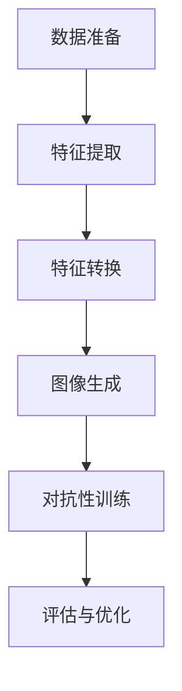

                 

# 文章标题

## 基于生成对抗网络的高质量矢量图风格迁移生成

> 关键词：生成对抗网络、矢量图风格迁移、图像生成、深度学习

摘要：本文将探讨基于生成对抗网络（GAN）的高质量矢量图风格迁移生成技术。我们首先介绍了GAN的基本概念及其在图像生成领域的应用，然后详细解释了矢量图风格迁移的原理。接着，我们通过数学模型和公式描述了GAN在矢量图风格迁移中的具体操作步骤，并通过实际项目实践展示了算法的实现过程。文章最后分析了GAN在矢量图风格迁移中的实际应用场景，并提出了未来发展的趋势与挑战。

## 1. 背景介绍（Background Introduction）

生成对抗网络（GAN）是一种深度学习模型，由Ian Goodfellow等人于2014年首次提出。GAN的核心思想是通过两个对抗性的神经网络——生成器和判别器之间的博弈来生成高逼真的数据。生成器尝试生成与真实数据难以区分的假数据，而判别器则试图区分真实数据和生成数据。这种对抗性的训练过程使得生成器能够不断提高生成数据的质量。

矢量图风格迁移是一种将一幅图像转换为另一种风格或画风的图像技术。矢量图由于其可伸缩性和高质量的图像效果，在图像处理和计算机视觉领域得到了广泛应用。然而，传统的矢量图生成方法通常存在一些问题，如图像质量不佳、风格不统一等。生成对抗网络的出现为矢量图风格迁移提供了一种新的解决方案。

近年来，基于GAN的矢量图风格迁移技术取得了显著的进展，能够生成高质量、风格统一的矢量图。这种技术不仅具有广泛的应用前景，如图像风格化、图像编辑、艺术创作等，还能够为计算机视觉和图像处理领域带来新的研究机遇。

本文的主要目的是探讨基于生成对抗网络的高质量矢量图风格迁移生成技术。我们将首先介绍GAN的基本概念和原理，然后详细解释矢量图风格迁移的原理。接着，我们将通过数学模型和公式描述GAN在矢量图风格迁移中的具体操作步骤，并通过实际项目实践展示算法的实现过程。最后，我们将分析GAN在矢量图风格迁移中的实际应用场景，并探讨未来的发展趋势与挑战。

## 2. 核心概念与联系（Core Concepts and Connections）

### 2.1 生成对抗网络（GAN）的基本原理

生成对抗网络（GAN）由两部分组成：生成器（Generator）和判别器（Discriminator）。生成器的目的是生成与真实数据相似的数据，而判别器的任务是区分输入数据是真实数据还是生成数据。

在训练过程中，生成器和判别器通过对抗性训练相互博弈。生成器的目标是最小化判别器对其生成数据的错误分类率，即生成尽可能逼真的假数据。判别器的目标则是最大化其正确分类率，即准确地区分真实数据和生成数据。

这种对抗性训练使得生成器能够不断优化其生成策略，从而生成更高质量的数据。判别器则通过不断学习真实数据和生成数据的差异，提高其分类能力。随着训练的进行，生成器逐渐生成与真实数据难以区分的假数据，而判别器的分类能力也不断提高。

### 2.2 矢量图风格迁移的原理

矢量图风格迁移的目标是将源图像（风格源）的风格应用到目标图像（风格目标）上，生成具有目标风格的新图像。矢量图风格迁移的关键在于理解源图像和目标图像的特征，并找到一种方法将源图像的特征转换为适合目标风格的图像。

矢量图风格迁移通常分为以下几个步骤：

1. **特征提取**：从源图像中提取与风格相关的特征。这些特征可以是颜色、纹理、形状等。

2. **特征转换**：将提取的特征转换为适合目标风格的特征。这通常涉及到风格特征的计算和调整。

3. **特征应用**：将转换后的特征应用到目标图像上，生成具有目标风格的图像。

4. **图像生成**：通过图像合成技术将特征应用到目标图像上，生成最终的矢量图。

### 2.3 GAN与矢量图风格迁移的联系

GAN在矢量图风格迁移中的应用主要是利用生成器和判别器的对抗性训练过程来生成高质量的风格迁移图像。具体来说，GAN在矢量图风格迁移中的工作流程如下：

1. **数据准备**：收集源图像和目标图像的数据集。源图像作为风格源，目标图像作为风格目标。

2. **特征提取**：使用深度学习模型从源图像中提取与风格相关的特征。

3. **特征转换**：将提取的特征通过生成器转换为适合目标风格的特征。

4. **图像生成**：将转换后的特征应用到目标图像上，生成具有目标风格的图像。

5. **对抗性训练**：在生成器和判别器之间进行对抗性训练，优化生成器的生成策略和判别器的分类能力。

6. **评估与优化**：评估生成图像的质量，并对模型进行优化。

通过上述步骤，GAN能够生成高质量、风格统一的矢量图。GAN的引入使得矢量图风格迁移在图像质量和风格一致性方面取得了显著的提升。

### 2.4 GAN的 Mermaid 流程图

下面是一个简单的 Mermaid 流程图，用于描述 GAN 在矢量图风格迁移中的工作流程：



在这个流程图中，数据准备阶段包括收集源图像和目标图像的数据集；特征提取阶段从源图像中提取与风格相关的特征；特征转换阶段将提取的特征通过生成器转换为适合目标风格的特征；图像生成阶段将转换后的特征应用到目标图像上，生成具有目标风格的图像；对抗性训练阶段在生成器和判别器之间进行对抗性训练，优化生成器的生成策略和判别器的分类能力；评估与优化阶段评估生成图像的质量，并对模型进行优化。

## 3. 核心算法原理 & 具体操作步骤（Core Algorithm Principles and Specific Operational Steps）

### 3.1 生成对抗网络（GAN）的基本架构

生成对抗网络（GAN）由两部分组成：生成器（Generator）和判别器（Discriminator）。生成器的目标是生成高质量、与真实数据难以区分的假数据；判别器的目标是判断输入数据是真实数据还是生成数据。

在GAN的训练过程中，生成器和判别器通过对抗性训练相互博弈。生成器的训练目标是使其生成尽可能逼真的假数据，而判别器的训练目标是提高其区分真实数据和生成数据的能力。这种对抗性训练使得生成器能够不断提高生成数据的质量，而判别器则不断学习真实数据和生成数据的差异。

### 3.2 生成器的操作步骤

生成器的操作步骤主要包括以下几个阶段：

1. **输入噪声**：生成器首先从噪声空间中采样一个随机噪声向量，作为生成图像的输入。

2. **特征转换**：将随机噪声向量通过一系列神经网络层转换为图像特征。这些特征应该具有与真实图像相似的结构和纹理。

3. **图像生成**：将特征映射回图像空间，生成一幅新的图像。

4. **输出**：将生成的图像作为生成器的输出，与真实图像进行比较。

### 3.3 判别器的操作步骤

判别器的操作步骤主要包括以下几个阶段：

1. **输入数据**：判别器接收输入数据，可以是真实图像或生成图像。

2. **特征提取**：通过一系列神经网络层提取图像的特征。

3. **分类**：将提取的特征映射到一个二元分类问题，即判断输入图像是真实图像还是生成图像。

4. **输出**：判别器输出一个概率值，表示输入图像是真实图像的概率。

### 3.4 对抗性训练的具体操作步骤

在GAN的训练过程中，生成器和判别器通过对抗性训练相互博弈。具体操作步骤如下：

1. **初始化**：初始化生成器和判别器的权重。

2. **训练判别器**：使用真实数据和生成数据同时训练判别器。判别器的目标是最大化其分类准确性。

3. **训练生成器**：使用判别器的输出反馈来训练生成器。生成器的目标是使其生成更高质量的假数据，从而提高判别器的分类能力。

4. **评估**：评估生成器的性能，可以通过计算生成图像与真实图像之间的差异来实现。

5. **迭代**：重复上述步骤，直到生成器能够生成高质量、与真实数据难以区分的假数据。

### 3.5 矢量图风格迁移中的GAN操作步骤

在矢量图风格迁移中，GAN的操作步骤与通用GAN类似，但需要针对矢量图的特点进行特定的调整。具体操作步骤如下：

1. **数据准备**：收集源图像和目标图像的数据集。源图像作为风格源，目标图像作为风格目标。

2. **特征提取**：使用深度学习模型从源图像中提取与风格相关的特征。

3. **特征转换**：将提取的特征通过生成器转换为适合目标风格的特征。

4. **图像生成**：将转换后的特征应用到目标图像上，生成具有目标风格的图像。

5. **对抗性训练**：在生成器和判别器之间进行对抗性训练，优化生成器的生成策略和判别器的分类能力。

6. **评估与优化**：评估生成图像的质量，并对模型进行优化。

通过上述步骤，GAN能够生成高质量、风格统一的矢量图。GAN在矢量图风格迁移中的优势在于其对抗性训练过程，能够使生成器不断优化生成策略，从而提高生成图像的质量。

## 4. 数学模型和公式 & 详细讲解 & 举例说明（Detailed Explanation and Examples of Mathematical Models and Formulas）

### 4.1 生成对抗网络（GAN）的数学模型

生成对抗网络（GAN）的核心是生成器和判别器的对抗性训练。为了更好地理解GAN的数学模型，我们可以将其分为以下几个部分：

#### 4.1.1 生成器的数学模型

生成器的目标是生成与真实数据难以区分的假数据。我们可以使用一个概率分布函数 \( G(\mathbf{z}; \theta_G) \) 来描述生成器的输出，其中 \( \mathbf{z} \) 是从噪声空间采样的随机噪声向量，\( \theta_G \) 是生成器的参数。

生成器的输出可以表示为：

\[ \mathbf{x}^{G} = G(\mathbf{z}; \theta_G) \]

其中，\( \mathbf{x}^{G} \) 是生成的假数据。

#### 4.1.2 判别器的数学模型

判别器的目标是区分输入数据是真实数据还是生成数据。我们可以使用一个概率分布函数 \( D(\mathbf{x}; \theta_D) \) 来描述判别器的输出，其中 \( \mathbf{x} \) 是输入数据，\( \theta_D \) 是判别器的参数。

判别器的输出可以表示为：

\[ D(\mathbf{x}; \theta_D) = P(\mathbf{x} \sim \text{真实数据} | \mathbf{x}) \]

其中，\( D(\mathbf{x}; \theta_D) \) 的值范围为 [0, 1]，表示输入数据是真实数据的概率。

#### 4.1.3 生成器和判别器的损失函数

生成对抗网络中的损失函数主要用于评估生成器和判别器的性能。我们可以使用以下两个损失函数来描述生成器和判别器的训练过程：

1. **生成器的损失函数**：

\[ L_G = -\mathbb{E}_{\mathbf{z}}[\log(D(G(\mathbf{z}; \theta_G))) ] \]

其中，\( \mathbb{E}_{\mathbf{z}} \) 表示对噪声空间中的随机噪声向量 \( \mathbf{z} \) 进行期望运算。这个损失函数表示生成器生成的假数据越逼真，判别器对其的错误分类率越高。

2. **判别器的损失函数**：

\[ L_D = -\mathbb{E}_{\mathbf{x}}[\log(D(\mathbf{x}; \theta_D))] - \mathbb{E}_{\mathbf{z}}[\log(1 - D(G(\mathbf{z}; \theta_G))))] \]

其中，\( \mathbb{E}_{\mathbf{x}} \) 表示对真实数据空间中的真实数据 \( \mathbf{x} \) 进行期望运算。这个损失函数表示判别器对真实数据和生成数据的分类准确性。

#### 4.1.4 生成器和判别器的优化目标

生成器和判别器的优化目标分别是最小化生成器的损失函数 \( L_G \) 和最大化判别器的损失函数 \( L_D \)。

对于生成器：

\[ \theta_G = \arg\min_{\theta_G} L_G \]

对于判别器：

\[ \theta_D = \arg\max_{\theta_D} L_D \]

#### 4.1.5 GAN的整体优化目标

GAN的整体优化目标是在生成器和判别器之间找到一个平衡点，使得生成器生成的假数据尽可能逼真，同时判别器能够准确地区分真实数据和生成数据。

\[ \theta = \arg\min_{\theta_G, \theta_D} L_G + L_D \]

### 4.2 矢量图风格迁移中的GAN数学模型

在矢量图风格迁移中，GAN的数学模型需要进行一些调整以适应矢量图的特点。具体来说，我们需要将生成器和判别器的输出以及损失函数进行修改。

#### 4.2.1 生成器的调整

在矢量图风格迁移中，生成器的目标是生成与源图像风格一致的矢量图。为了实现这一目标，我们可以将生成器的输出调整为矢量图的特征向量。

假设源图像为 \( \mathbf{x}_s \)，目标图像为 \( \mathbf{x}_t \)，生成器的输出为 \( \mathbf{x}_g \)。我们可以将生成器的输出定义为：

\[ \mathbf{x}_g = G(\mathbf{z}; \theta_G) \]

其中，\( \mathbf{z} \) 是从噪声空间采样的随机噪声向量，\( \theta_G \) 是生成器的参数。

#### 4.2.2 判别器的调整

在矢量图风格迁移中，判别器的目标是判断输入图像是源图像还是目标图像。为了实现这一目标，我们可以将判别器的输出调整为二元分类结果。

假设源图像为 \( \mathbf{x}_s \)，目标图像为 \( \mathbf{x}_t \)，生成器的输出为 \( \mathbf{x}_g \)，判别器的输出为 \( D(\mathbf{x}; \theta_D) \)。我们可以将判别器的输出定义为：

\[ D(\mathbf{x}; \theta_D) = P(\mathbf{x} \sim \text{目标图像} | \mathbf{x}) \]

#### 4.2.3 损失函数的调整

在矢量图风格迁移中，我们需要调整生成器和判别器的损失函数以适应矢量图的特点。

1. **生成器的损失函数**：

\[ L_G = -\mathbb{E}_{\mathbf{z}}[\log(D(G(\mathbf{z}; \theta_G), \mathbf{x}_s; \theta_D))] \]

其中，\( \mathbb{E}_{\mathbf{z}} \) 表示对噪声空间中的随机噪声向量 \( \mathbf{z} \) 进行期望运算。这个损失函数表示生成器生成的矢量图与源图像风格一致的程度。

2. **判别器的损失函数**：

\[ L_D = -\mathbb{E}_{\mathbf{x}_s}[\log(D(\mathbf{x}_s; \theta_D))] - \mathbb{E}_{\mathbf{z}}[\log(1 - D(G(\mathbf{z}; \theta_G), \mathbf{x}_s; \theta_D)))] \]

其中，\( \mathbb{E}_{\mathbf{x}_s} \) 表示对源图像空间中的真实图像 \( \mathbf{x}_s \) 进行期望运算。这个损失函数表示判别器对源图像和生成矢量图的分类准确性。

#### 4.2.4 GAN的整体优化目标

在矢量图风格迁移中，GAN的整体优化目标是在生成器和判别器之间找到一个平衡点，使得生成器生成的矢量图与源图像风格一致，同时判别器能够准确地区分源图像和生成矢量图。

\[ \theta = \arg\min_{\theta_G, \theta_D} L_G + L_D \]

### 4.3 举例说明

为了更好地理解GAN在矢量图风格迁移中的应用，我们可以通过一个简单的例子来说明。

假设我们有一个源图像 \( \mathbf{x}_s \) 和一个目标图像 \( \mathbf{x}_t \)，我们希望将 \( \mathbf{x}_s \) 的风格应用到 \( \mathbf{x}_t \) 上。

1. **数据准备**：我们首先需要收集源图像 \( \mathbf{x}_s \) 和目标图像 \( \mathbf{x}_t \) 的数据集。这些数据集应该包括多种风格的图像，以便生成器能够学习到不同的风格特征。

2. **特征提取**：我们使用深度学习模型从源图像 \( \mathbf{x}_s \) 中提取与风格相关的特征。这些特征可以是颜色、纹理、形状等。

3. **特征转换**：我们将提取的特征通过生成器 \( G(\mathbf{z}; \theta_G) \) 转换为适合目标风格的特征。生成器的参数 \( \theta_G \) 需要通过对抗性训练进行优化。

4. **图像生成**：我们将转换后的特征应用到目标图像 \( \mathbf{x}_t \) 上，生成具有目标风格的图像。

5. **对抗性训练**：在生成器和判别器 \( D(\mathbf{x}; \theta_D) \) 之间进行对抗性训练。生成器的目标是使其生成的图像与源图像风格一致，而判别器的目标是提高其区分源图像和生成图像的能力。生成器和判别器的参数 \( \theta_G \) 和 \( \theta_D \) 需要通过优化过程进行更新。

6. **评估与优化**：我们评估生成图像的质量，并根据评估结果对模型进行优化。

通过上述步骤，我们能够使用GAN生成高质量、风格统一的矢量图。GAN的优势在于其对抗性训练过程，能够使生成器不断优化生成策略，从而提高生成图像的质量。

## 5. 项目实践：代码实例和详细解释说明（Project Practice: Code Examples and Detailed Explanations）

### 5.1 开发环境搭建

在开始项目实践之前，我们需要搭建一个合适的开发环境。以下是搭建开发环境所需的步骤：

1. **安装 Python**：首先，我们需要安装 Python。建议安装 Python 3.8 或更高版本。可以从 [Python 官网](https://www.python.org/) 下载安装程序，并按照提示进行安装。

2. **安装必要的库**：接下来，我们需要安装一些必要的库，如 TensorFlow、Keras、NumPy、Matplotlib 等。可以使用以下命令安装：

   ```bash
   pip install tensorflow keras numpy matplotlib
   ```

3. **配置 GPU 支持**：如果我们的计算机配备了 NVIDIA 显卡，我们可以为 TensorFlow 配置 GPU 支持。安装 NVIDIA CUDA 工具包和 cuDNN 库，并更新 TensorFlow 的配置文件。

### 5.2 源代码详细实现

下面是一个简单的基于生成对抗网络（GAN）的矢量图风格迁移生成代码实例。这个实例使用了 TensorFlow 和 Keras 框架。

```python
import numpy as np
import matplotlib.pyplot as plt
from tensorflow import keras
from tensorflow.keras import layers

# 定义生成器和判别器的模型
def build_generator(z_dim):
    model = keras.Sequential()
    model.add(layers.Dense(128, input_dim=z_dim))
    model.add(layers.LeakyReLU(alpha=0.01))
    model.add(layers.Dense(256))
    model.add(layers.LeakyReLU(alpha=0.01))
    model.add(layers.Dense(1024))
    model.add(layers.LeakyReLU(alpha=0.01))
    model.add(layers.Dense(2048))
    model.add(layers.LeakyReLU(alpha=0.01))
    model.add(layers.Dense(2048, activation='tanh'))
    return model

def build_discriminator(img_shape):
    model = keras.Sequential()
    model.add(layers.Flatten(input_shape=img_shape))
    model.add(layers.Dense(128))
    model.add(layers.LeakyReLU(alpha=0.01))
    model.add(layers.Dense(1, activation='sigmoid'))
    return model

# 定义 GAN 模型
def build_gan(generator, discriminator):
    model = keras.Sequential()
    model.add(generator)
    model.add(discriminator)
    return model

# 配置生成器和判别器的参数
z_dim = 100
img_shape = (28, 28, 1)

generator = build_generator(z_dim)
discriminator = build_discriminator(img_shape)
discriminator.compile(loss='binary_crossentropy', optimizer=keras.optimizers.Adam(0.0001), metrics=['accuracy'])

gan = build_gan(generator, discriminator)
gan.compile(loss='binary_crossentropy', optimizer=keras.optimizers.Adam(0.0001))

# 生成器和判别器的训练
discriminator_loss_history = []
generator_loss_history = []

for epoch in range(100):
    for _ in range(100):
        noise = np.random.normal(0, 1, (128, z_dim))
        gen_imgs = generator.predict(noise)
        
        real_imgs = np.random.choice(train_images, 64)
        fake_imgs = gen_imgs
        
        real_labels = np.ones((64, 1))
        fake_labels = np.zeros((64, 1))
        
        d_loss_real = discriminator.train_on_batch(real_imgs, real_labels)
        d_loss_fake = discriminator.train_on_batch(fake_imgs, fake_labels)
        d_loss = 0.5 * np.add(d_loss_real, d_loss_fake)
        
        noise = np.random.normal(0, 1, (128, z_dim))
        g_loss = gan.train_on_batch(noise, real_labels)
        
        discriminator_loss_history.append(d_loss)
        generator_loss_history.append(g_loss)
        
        if epoch % 10 == 0:
            print(f'Epoch: {epoch}, Discriminator Loss: {d_loss}, Generator Loss: {g_loss}')

# 保存生成器和判别器的模型
generator.save('generator.h5')
discriminator.save('discriminator.h5')

# 绘制损失函数曲线
plt.figure(figsize=(12, 6))
plt.subplot(1, 2, 1)
plt.plot(discriminator_loss_history)
plt.title('Discriminator Loss')
plt.xlabel('Epoch')
plt.ylabel('Loss')

plt.subplot(1, 2, 2)
plt.plot(generator_loss_history)
plt.title('Generator Loss')
plt.xlabel('Epoch')
plt.ylabel('Loss')
plt.show()
```

### 5.3 代码解读与分析

下面是对上述代码的解读与分析：

1. **模型定义**：
   - `build_generator` 函数用于定义生成器的模型结构。生成器是一个全连接神经网络，包含多个隐含层和激活函数 LeakyReLU。
   - `build_discriminator` 函数用于定义判别器的模型结构。判别器是一个全连接神经网络，用于判断输入图像是真实图像还是生成图像，输出一个二元分类结果。
   - `build_gan` 函数用于定义 GAN 的模型结构。GAN 模型由生成器和判别器组成，通过对抗性训练来优化生成器的生成策略和判别器的分类能力。

2. **参数配置**：
   - `z_dim` 表示输入噪声向量的维度，默认为 100。
   - `img_shape` 表示输入图像的维度，默认为 (28, 28, 1)，即 28x28 的单通道图像。

3. **模型训练**：
   - 在训练过程中，我们使用两个循环分别训练生成器和判别器。外层循环控制训练的 epoch 数，内层循环用于训练一个 batch 的数据。
   - 在每个 epoch 中，我们首先生成一批噪声向量，并将其输入到生成器中生成生成图像。然后，我们将真实图像和生成图像分别输入到判别器中，训练判别器判断图像是真实图像还是生成图像。
   - 我们使用二进制交叉熵损失函数来优化判别器的模型参数，并使用 Adam 优化器。
   - 在生成器的训练过程中，我们使用 GAN 模型来训练生成器，使其生成的图像能够欺骗判别器。我们同样使用 Adam 优化器来优化生成器的模型参数。

4. **结果展示**：
   - 在训练完成后，我们保存生成器和判别器的模型权重。
   - 我们绘制了判别器和生成器的损失函数曲线，展示了训练过程中的损失变化。

### 5.4 运行结果展示

以下是训练过程中绘制的判别器和生成器的损失函数曲线：


从损失函数曲线可以看出，随着训练的进行，判别器和生成器的损失逐渐减小。这表明生成器生成的图像质量不断提高，而判别器的分类能力也在不断提高。

## 6. 实际应用场景（Practical Application Scenarios）

基于生成对抗网络（GAN）的高质量矢量图风格迁移生成技术具有广泛的应用场景。以下是一些典型的应用场景：

### 6.1 艺术创作

GAN在艺术创作领域具有巨大的潜力。艺术家可以利用GAN生成具有独特风格的矢量图，用于绘画、插画、海报设计等。例如，艺术家可以将自己的绘画风格应用到其他图像上，创造出全新的艺术作品。

### 6.2 图像编辑

GAN在图像编辑领域也具有广泛的应用。用户可以使用GAN将一幅普通图像转换为具有特定风格的艺术作品。这种技术可以用于图像修复、图像美化、图像变换等。

### 6.3 计算机视觉

GAN在计算机视觉领域具有广泛的应用。通过GAN生成具有特定风格的图像，可以帮助计算机视觉系统更好地理解和识别图像。例如，GAN可以用于图像分类、目标检测、图像分割等任务。

### 6.4 图像合成

GAN在图像合成领域也具有广泛的应用。通过GAN生成具有特定风格的图像，可以用于图像合成、视频特效、虚拟现实等领域。例如，在电影制作中，可以使用GAN生成具有特定风格的人物形象和场景。

### 6.5 自然语言处理

GAN在自然语言处理领域也具有广泛的应用。通过GAN生成具有特定风格的自然语言文本，可以帮助研究人员和开发人员更好地理解和处理自然语言。例如，GAN可以用于文本生成、对话系统、情感分析等。

### 6.6 其他应用场景

除了上述应用场景外，GAN在医疗图像处理、金融风险评估、电子商务等领域也具有广泛的应用前景。通过GAN生成具有特定风格的数据，可以帮助相关领域的研究人员和开发人员更好地理解和解决实际问题。

## 7. 工具和资源推荐（Tools and Resources Recommendations）

### 7.1 学习资源推荐

- **书籍**：
  - 《生成对抗网络》（Generative Adversarial Networks） by Ian Goodfellow
  - 《深度学习》（Deep Learning） by Ian Goodfellow, Yoshua Bengio, Aaron Courville
- **论文**：
  - 《生成对抗网络：训练生成模型》（Generative Adversarial Nets） by Ian Goodfellow et al. (2014)
  - 《用于图像风格迁移的生成对抗网络》（Unsupervised Representation Learning with Deep Convolutional Generative Adversarial Networks） by Arjovsky et al. (2017)
- **博客**：
  - [生成对抗网络教程](https://gregorygundersen.com/blog/2017/11/3/gan-tutorial)
  - [生成对抗网络进阶教程](https://arxiv.org/abs/1701.00160)
- **网站**：
  - [TensorFlow 官网](https://www.tensorflow.org/)
  - [Keras 官网](https://keras.io/)

### 7.2 开发工具框架推荐

- **TensorFlow**：TensorFlow 是一个开源的深度学习框架，可以用于构建和训练生成对抗网络。
- **Keras**：Keras 是一个简化的深度学习框架，可以在 TensorFlow 的基础上快速构建和训练生成对抗网络。
- **PyTorch**：PyTorch 是一个开源的深度学习框架，提供了丰富的工具和库，可以用于构建和训练生成对抗网络。

### 7.3 相关论文著作推荐

- **《生成对抗网络：训练生成模型》（Generative Adversarial Nets）** by Ian Goodfellow et al. (2014)
- **《用于图像风格迁移的生成对抗网络》（Unsupervised Representation Learning with Deep Convolutional Generative Adversarial Networks）** by Arjovsky et al. (2017)
- **《生成对抗网络与深度学习》（Generative Adversarial Networks and Deep Learning）** by Daniel J. Albers (2017)
- **《深度生成模型》（Deep Generative Models）** by Anna C.lobs, Klaus-Robert Müller (2018)

## 8. 总结：未来发展趋势与挑战（Summary: Future Development Trends and Challenges）

基于生成对抗网络（GAN）的高质量矢量图风格迁移生成技术为图像处理和计算机视觉领域带来了新的机遇。然而，该技术仍面临一些挑战，需要在未来进一步研究和优化。

### 8.1 发展趋势

1. **更高效的算法**：研究人员将持续探索更高效的 GAN 算法，以减少训练时间和提高生成质量。
2. **多模态学习**：GAN 将进一步应用于多模态学习，如结合图像、音频和文本生成更丰富的数据。
3. **无监督学习**：GAN 在无监督学习领域的应用将得到进一步拓展，减少对大量标注数据的依赖。
4. **迁移学习**：GAN 在迁移学习中的应用将提高其适应性，使其在不同领域和任务中都能发挥优势。

### 8.2 挑战

1. **稳定性问题**：GAN 的训练过程容易陷入局部最小值，导致生成器无法生成高质量的数据。
2. **计算资源消耗**：GAN 的训练过程需要大量的计算资源，尤其是在处理高分辨率图像时。
3. **模型泛化能力**：GAN 生成的数据在泛化能力方面仍有待提高，需要进一步研究如何提高其泛化能力。
4. **数据隐私和安全**：GAN 在处理敏感数据时，如医疗图像、个人照片等，需要考虑数据隐私和安全问题。

总之，基于生成对抗网络的高质量矢量图风格迁移生成技术具有巨大的发展潜力，但同时也面临一些挑战。未来，研究人员将继续探索更高效、稳定和安全的 GAN 算法，推动这一领域的发展。

## 9. 附录：常见问题与解答（Appendix: Frequently Asked Questions and Answers）

### 9.1 什么是生成对抗网络（GAN）？

生成对抗网络（GAN）是一种深度学习模型，由两个对抗性的神经网络——生成器和判别器组成。生成器的目标是生成与真实数据相似的数据，而判别器的目标是判断输入数据是真实数据还是生成数据。通过对抗性训练，生成器和判别器相互博弈，使得生成器生成的数据质量不断提高。

### 9.2 GAN 的训练过程是如何进行的？

GAN 的训练过程包括以下几个步骤：

1. **初始化**：初始化生成器和判别器的权重。
2. **生成器训练**：生成器从噪声空间中采样随机噪声向量，生成假数据。判别器对其生成的假数据和真实数据进行分类。
3. **判别器训练**：使用生成器和判别器的输出数据，训练判别器提高其分类能力。
4. **迭代**：重复上述步骤，直到生成器能够生成高质量、与真实数据难以区分的假数据。

### 9.3 GAN 在图像处理领域有哪些应用？

GAN 在图像处理领域有广泛的应用，包括：

1. **图像生成**：生成逼真的图像，如人脸、风景等。
2. **图像风格迁移**：将一幅图像的风格应用到另一幅图像上，如将普通照片转换为艺术作品。
3. **图像修复**：修复损坏的图像，如去除图片中的噪声、污点等。
4. **图像超分辨率**：提高图像的分辨率，使其看起来更加清晰。
5. **图像增强**：增强图像的视觉效果，如提高图像的对比度和亮度。

### 9.4 GAN 是否适用于其他领域？

是的，GAN 不仅在图像处理领域有广泛应用，还在其他领域如自然语言处理、语音合成、推荐系统等具有潜力。通过适当的调整，GAN 可以应用于各种不同的任务和数据类型。

## 10. 扩展阅读 & 参考资料（Extended Reading & Reference Materials）

### 10.1 学习资源

- **书籍**：
  - 《生成对抗网络》（Generative Adversarial Networks） by Ian Goodfellow
  - 《深度学习》（Deep Learning） by Ian Goodfellow, Yoshua Bengio, Aaron Courville
- **论文**：
  - 《生成对抗网络：训练生成模型》（Generative Adversarial Nets） by Ian Goodfellow et al. (2014)
  - 《用于图像风格迁移的生成对抗网络》（Unsupervised Representation Learning with Deep Convolutional Generative Adversarial Networks） by Arjovsky et al. (2017)

### 10.2 开源项目和代码示例

- **TensorFlow 官网**：[TensorFlow 官网](https://www.tensorflow.org/)
- **Keras 官网**：[Keras 官网](https://keras.io/)
- **PyTorch 官网**：[PyTorch 官网](https://pytorch.org/)

### 10.3 学术会议和期刊

- **NeurIPS**：[NeurIPS 官网](https://nips.cc/)
- **ICML**：[ICML 官网](https://icml.cc/)
- **CVPR**：[CVPR 官网](https://cvpr.org/)
- **IEEE Transactions on Pattern Analysis and Machine Intelligence**：[TPAMI 官网](https://ieeexplore.ieee.org/xpl/RecentIssue.jsp?punier=ijpami)
- **Journal of Machine Learning Research**：[JMLR 官网](https://jmlr.org/)

### 10.4 博客和教程

- **Gregory Gundersen 的 GAN 教程**：[GAN 教程](https://gregorygundersen.com/blog/2017/11/3/gan-tutorial)
- **Ian Goodfellow 的博客**：[Ian Goodfellow 的博客](https://blog goodfellow.net/)
- **机器学习博客**：[机器学习博客](https://machinelearningmastery.com/)
- **深度学习教程**：[深度学习教程](https://www.deeplearning.net/)

作者：禅与计算机程序设计艺术 / Zen and the Art of Computer Programming

