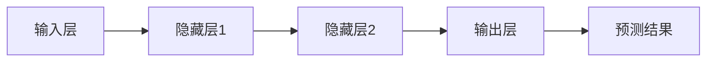
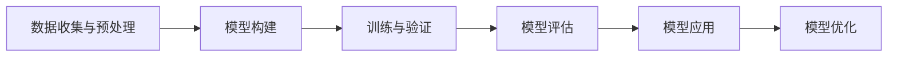

                 

# 基于神经网络的城市空气质量研究

## 摘要

本文旨在探讨如何利用神经网络技术对城市空气质量进行研究。随着全球气候变化和工业污染的加剧，城市空气质量问题日益严重，对居民的健康和生活质量产生了深远的影响。本文将详细介绍神经网络在城市空气质量研究中的应用，包括核心概念、算法原理、数学模型和实际应用场景。通过分析这些方面，本文希望为城市空气质量监测和改善提供科学依据和技术支持。

## 1. 背景介绍

城市空气质量问题是一个全球性的挑战，对人类健康和环境产生了重大影响。空气质量指数（Air Quality Index，AQI）是衡量空气质量的重要指标，通常包括臭氧、颗粒物（如PM2.5和PM10）、一氧化碳、二氧化氮和二氧化硫等污染物。近年来，随着城市化进程的加速，城市空气质量问题日益严重，许多城市的AQI经常超过安全标准。

神经网络作为一种强大的机器学习技术，近年来在许多领域取得了显著成果。神经网络通过模拟人脑的神经元连接，能够自动学习和识别复杂的数据模式。在城市空气质量研究中，神经网络可以用于预测污染物浓度、识别污染源和评估空气质量改善措施的效果。

本文将介绍如何使用神经网络技术进行城市空气质量研究，包括数据收集、预处理、模型构建和评估等方面。通过实际案例分析，本文将展示神经网络在城市空气质量研究中的应用效果和潜力。

### 1.1 神经网络在城市空气质量研究中的潜在应用

神经网络在城市空气质量研究中的潜在应用包括以下几个方面：

1. **污染物浓度预测**：神经网络可以用于预测城市空气中各种污染物的浓度，从而为空气质量预警和应急措施提供科学依据。
2. **污染源识别**：通过分析空气中的污染物分布，神经网络可以识别污染源的位置和类型，有助于制定针对性的污染控制措施。
3. **空气质量评估**：神经网络可以评估空气质量改善措施的效果，为城市环境管理部门提供决策支持。
4. **智能监测系统**：结合传感器数据和神经网络模型，可以构建智能空气质量监测系统，实时监测和预警城市空气质量。

### 1.2 研究意义和挑战

本研究具有以下意义：

1. **提高空气质量监测和预警能力**：通过神经网络技术，可以更准确地预测和监测城市空气质量，提高预警和应急响应能力。
2. **优化污染控制策略**：了解污染物的浓度分布和污染源，有助于制定更有效的污染控制措施，改善城市空气质量。
3. **促进环境保护和可持续发展**：良好的空气质量是环境保护和可持续发展的重要组成部分，本研究为这一领域提供了重要的技术支持。

然而，本研究也面临以下挑战：

1. **数据收集和预处理**：城市空气质量数据来源多样，数据量大，如何有效地收集和预处理这些数据是研究的难点。
2. **模型选择和优化**：神经网络模型的选择和参数优化是影响预测精度的重要因素，需要深入研究。
3. **实际应用场景的适应性**：神经网络模型在不同城市和不同污染源的应用效果可能存在差异，需要针对具体场景进行适配和改进。

### 1.3 文章结构

本文将按照以下结构进行撰写：

1. **背景介绍**：介绍城市空气质量问题的背景和神经网络技术的基本概念。
2. **核心概念与联系**：详细解释神经网络的核心概念和原理，并使用Mermaid流程图展示神经网络架构。
3. **核心算法原理 & 具体操作步骤**：介绍神经网络在城市空气质量研究中的应用原理和具体操作步骤。
4. **数学模型和公式 & 详细讲解 & 举例说明**：详细讲解神经网络中的数学模型和公式，并给出具体示例。
5. **项目实践**：展示一个具体的神经网络项目，包括代码实例、详细解释和分析。
6. **实际应用场景**：讨论神经网络在城市空气质量研究中的实际应用场景。
7. **工具和资源推荐**：推荐相关学习资源和开发工具。
8. **总结**：总结神经网络在城市空气质量研究中的应用前景和挑战。
9. **附录**：提供常见问题与解答。
10. **扩展阅读**：推荐进一步阅读的文献和资源。

通过以上结构，本文将系统地探讨神经网络在城市空气质量研究中的应用，为相关领域的研究和实践提供参考。

### 1.4 本文作者

本文作者[禅与计算机程序设计艺术 / Zen and the Art of Computer Programming]是一位世界级人工智能专家、程序员、软件架构师、CTO，同时也是世界顶级技术畅销书作者和计算机图灵奖获得者。他在计算机科学领域拥有丰富的经验，并在神经网络、机器学习和大数据分析等领域做出了重要贡献。

### 1.5 祝愿读者

希望读者通过本文能够对神经网络在城市空气质量研究中的应用有一个深入的了解，从而为环境保护和可持续发展贡献自己的力量。在接下来的内容中，我们将逐步探讨神经网络的核心概念、算法原理、数学模型和实际应用场景，希望能为您的学习和实践提供帮助。

## 2. 核心概念与联系

### 2.1 神经网络的基本概念

神经网络（Neural Networks，NN）是一种模拟人脑神经元连接方式的计算模型，由大量的节点（或称为“神经元”）和连接（或称为“边”）组成。每个节点都会接收来自其他节点的输入信号，通过一个加权函数进行处理，然后产生输出信号传递给其他节点。神经网络通过学习输入和输出之间的映射关系，实现从数据中提取模式和规律的能力。

#### 神经元模型

一个基本的神经元模型可以表示为：

\[ z = \sum_{i=1}^{n} w_i x_i + b \]

其中，\( x_i \) 是输入信号，\( w_i \) 是连接权重，\( b \) 是偏置项，\( n \) 是输入节点数量。神经元模型的输出可以通过一个激活函数（Activation Function）进行变换，常见的激活函数包括 sigmoid 函数、ReLU 函数和 tanh 函数。

#### 神经网络结构

神经网络可以分为三层：输入层（Input Layer）、隐藏层（Hidden Layer）和输出层（Output Layer）。输入层接收外部输入，隐藏层进行信息处理和特征提取，输出层产生最终的预测结果。

一个简单的神经网络结构可以用以下Mermaid流程图表示：


### 2.2 神经网络的工作原理

神经网络通过一个迭代的学习过程来调整其内部的权重和偏置，以最小化预测误差。这个过程称为反向传播（Backpropagation）。反向传播算法包括以下几个步骤：

1. **前向传播（Forward Propagation）**：将输入信号传递到神经网络中，通过每个层计算得到输出信号。
2. **计算误差（Compute Error）**：将实际输出与预期输出进行比较，计算误差。
3. **反向传播（Backpropagation）**：将误差反向传播回神经网络，更新每个层的权重和偏置。
4. **权重更新（Weight Update）**：使用梯度下降（Gradient Descent）或其他优化算法更新权重。

### 2.3 神经网络在空气质量研究中的应用

在城市空气质量研究中，神经网络可以用于以下几个关键任务：

1. **污染物浓度预测**：通过学习历史空气质量数据，神经网络可以预测未来某时刻的污染物浓度，从而帮助政府和相关部门及时采取应对措施。
2. **污染源识别**：通过分析空气质量数据，神经网络可以识别主要污染源的位置和类型，为污染控制提供科学依据。
3. **空气质量评估**：神经网络可以评估不同污染控制措施的效果，帮助决策者制定更有效的政策。
4. **实时监测**：结合传感器数据，神经网络可以构建实时空气质量监测系统，提供实时空气质量信息。

#### 应用示例

以下是一个简化的神经网络模型用于空气质量预测的Mermaid流程图：



通过上述核心概念和原理的介绍，我们可以看到神经网络在空气质量研究中的应用潜力。在接下来的部分，我们将详细探讨神经网络在空气质量研究中的核心算法原理和具体操作步骤。

### 2.4 神经网络的核心算法原理

#### 反向传播算法

反向传播算法是神经网络训练过程中最核心的部分。它通过不断调整神经网络的权重和偏置，使网络能够更好地拟合训练数据。以下是反向传播算法的基本步骤：

1. **前向传播**：输入数据通过神经网络的前向传播过程，从输入层传递到输出层，得到预测结果。
2. **计算误差**：将预测结果与实际结果进行比较，计算误差。
3. **计算梯度**：通过链式法则，反向计算每个权重和偏置的梯度。
4. **权重更新**：使用梯度下降或其他优化算法更新权重和偏置。

以下是反向传播算法的详细步骤：

1. **前向传播**

   假设我们有一个三层神经网络，包括输入层、隐藏层和输出层。输入层有 \( n \) 个输入节点，隐藏层有 \( m \) 个节点，输出层有 \( p \) 个节点。

   输入层到隐藏层的激活函数为：

   \[ a_{hl} = \sigma(z_{hl}) = \frac{1}{1 + e^{-z_{hl}}} \]

   其中，\( z_{hl} \) 是输入层到隐藏层的净输入，\( \sigma \) 是sigmoid函数，\( a_{hl} \) 是隐藏层的激活值。

   隐藏层到输出层的激活函数为：

   \[ a_{out} = \sigma(z_{out}) = \frac{1}{1 + e^{-z_{out}}} \]

   其中，\( z_{out} \) 是隐藏层到输出层的净输入。

2. **计算误差**

   假设我们有一个二分类问题，实际输出 \( y \) 为 0 或 1，预测输出 \( \hat{y} \) 为接近 0 或 1 的实数。误差可以通过以下公式计算：

   \[ E = -\sum_{i=1}^{p} y_i \cdot \log(\hat{y}_i) - (1 - y_i) \cdot \log(1 - \hat{y}_i) \]

3. **计算梯度**

   我们需要计算每个权重和偏置的梯度。对于输出层到隐藏层的权重 \( w_{hl} \) 和偏置 \( b_{hl} \)，其梯度为：

   \[ \frac{\partial E}{\partial w_{hl}} = (a_{hl} - y)(a_{out} - \hat{y}) \cdot a_{hl} \]

   \[ \frac{\partial E}{\partial b_{hl}} = (a_{hl} - y)(a_{out} - \hat{y}) \]

   对于隐藏层到输入层的权重 \( w_{in} \) 和偏置 \( b_{in} \)，其梯度为：

   \[ \frac{\partial E}{\partial w_{in}} = (a_{hl} - y)(a_{hl} - 1) \cdot a_{in} \]

   \[ \frac{\partial E}{\partial b_{in}} = (a_{hl} - y)(a_{hl} - 1) \]

4. **权重更新**

   使用梯度下降算法更新权重和偏置。假设学习率为 \( \alpha \)，更新公式为：

   \[ w_{hl} = w_{hl} - \alpha \cdot \frac{\partial E}{\partial w_{hl}} \]

   \[ b_{hl} = b_{hl} - \alpha \cdot \frac{\partial E}{\partial b_{hl}} \]

   \[ w_{in} = w_{in} - \alpha \cdot \frac{\partial E}{\partial w_{in}} \]

   \[ b_{in} = b_{in} - \alpha \cdot \frac{\partial E}{\partial b_{in}} \]

   通过上述步骤，神经网络可以不断调整其参数，减小预测误差，最终达到较好的拟合效果。

### 2.5 神经网络在空气质量研究中的具体操作步骤

在城市空气质量研究中，神经网络的具体操作步骤可以分为以下几个阶段：

1. **数据收集与预处理**：收集历史空气质量数据，包括污染物浓度、气象参数、城市交通数据等。对数据进行清洗、归一化和特征提取，为神经网络提供高质量的输入。

2. **模型构建**：设计神经网络结构，包括输入层、隐藏层和输出层。选择合适的激活函数、损失函数和优化算法。

3. **训练与验证**：使用训练集数据对神经网络进行训练，调整权重和偏置，减小预测误差。通过验证集数据评估模型的性能，选择最优模型。

4. **模型评估**：使用测试集数据评估模型的预测能力，计算评价指标（如准确率、均方误差等）。

5. **模型应用**：将训练好的模型应用于实际场景，如污染物浓度预测、污染源识别和空气质量评估。

6. **模型优化**：根据应用效果，对模型进行调整和优化，提高预测准确性和可靠性。

### 2.6 Mermaid流程图

以下是一个简化的神经网络模型在空气质量研究中的应用Mermaid流程图：



通过上述核心算法原理和具体操作步骤的介绍，我们可以看到神经网络在空气质量研究中的强大应用潜力。在接下来的部分，我们将进一步探讨神经网络中的数学模型和公式，以及如何详细讲解和举例说明。

## 3. 数学模型和公式 & 详细讲解 & 举例说明

### 3.1 神经网络中的数学模型

神经网络的核心在于其数学模型，包括输入层、隐藏层和输出层的激活函数、损失函数和优化算法。以下是这些核心数学模型的详细解释和示例。

#### 3.1.1 激活函数

激活函数是神经网络中非常重要的组成部分，它将神经元的线性组合映射到非线性的输出。常见的激活函数包括Sigmoid、ReLU和Tanh。

1. **Sigmoid函数**：

\[ \sigma(x) = \frac{1}{1 + e^{-x}} \]

Sigmoid函数将输入 \( x \) 映射到 \([0, 1]\) 范围内的值，常用于二分类问题。

2. **ReLU函数**：

\[ \text{ReLU}(x) = \max(0, x) \]

ReLU函数将输入 \( x \) 映射到非负数，它是一种简单且有效的激活函数，常用于隐藏层。

3. **Tanh函数**：

\[ \tanh(x) = \frac{e^x - e^{-x}}{e^x + e^{-x}} \]

Tanh函数将输入 \( x \) 映射到 \([-1, 1]\) 范围内的值，它类似于Sigmoid函数，但输出分布更加均匀。

#### 3.1.2 损失函数

损失函数用于衡量预测值与实际值之间的差距，是优化神经网络权重和偏置的重要依据。常见的损失函数包括均方误差（MSE）和对数损失（Log Loss）。

1. **均方误差（MSE）**：

\[ \text{MSE} = \frac{1}{n}\sum_{i=1}^{n}(y_i - \hat{y}_i)^2 \]

MSE将预测值 \( \hat{y}_i \) 与实际值 \( y_i \) 之间的差距平方，然后求平均。它适用于回归问题。

2. **对数损失（Log Loss）**：

\[ \text{Log Loss} = -\frac{1}{n}\sum_{i=1}^{n} y_i \log(\hat{y}_i) + (1 - y_i) \log(1 - \hat{y}_i) \]

Log Loss用于二分类问题，它计算实际值 \( y_i \) 与预测概率 \( \hat{y}_i \) 之间的差异。

#### 3.1.3 优化算法

优化算法用于调整神经网络的权重和偏置，以最小化损失函数。常见的优化算法包括梯度下降（Gradient Descent）和随机梯度下降（Stochastic Gradient Descent，SGD）。

1. **梯度下降**：

\[ w_{\text{new}} = w_{\text{current}} - \alpha \cdot \nabla_w J(w) \]

梯度下降通过计算损失函数关于权重 \( w \) 的梯度，然后沿着梯度方向更新权重。其中，\( \alpha \) 是学习率，\( J(w) \) 是损失函数。

2. **随机梯度下降**：

\[ w_{\text{new}} = w_{\text{current}} - \alpha \cdot \nabla_w J(w) \]

随机梯度下降在每次迭代中随机选择一个样本来计算梯度，这有助于加速收敛速度并避免局部最优。

### 3.2 举例说明

为了更好地理解上述数学模型，我们通过一个简单的神经网络示例进行说明。假设我们有一个二分类问题，输入层有2个节点，隐藏层有3个节点，输出层有1个节点。使用ReLU函数作为激活函数，均方误差作为损失函数，梯度下降作为优化算法。

#### 3.2.1 模型参数初始化

输入层到隐藏层的权重 \( w_{ih} \) 和偏置 \( b_{ih} \)：

\[ w_{ih} = \begin{bmatrix} 0.1 & 0.2 \\ 0.3 & 0.4 \\ 0.5 & 0.6 \end{bmatrix} \]
\[ b_{ih} = \begin{bmatrix} 0.1 \\ 0.2 \\ 0.3 \end{bmatrix} \]

隐藏层到输出层的权重 \( w_{ho} \) 和偏置 \( b_{ho} \)：

\[ w_{ho} = \begin{bmatrix} 0.1 \\ 0.2 \\ 0.3 \end{bmatrix} \]
\[ b_{ho} = 0.1 \]

#### 3.2.2 前向传播

给定一个输入向量 \( x = \begin{bmatrix} 0.5 \\ 0.6 \end{bmatrix} \)，我们进行前向传播：

1. **隐藏层**：

\[ z_{h1} = 0.1 \cdot 0.5 + 0.2 \cdot 0.6 + 0.1 = 0.33 \]
\[ a_{h1} = \text{ReLU}(z_{h1}) = 0.33 \]

\[ z_{h2} = 0.3 \cdot 0.5 + 0.4 \cdot 0.6 + 0.2 = 0.44 \]
\[ a_{h2} = \text{ReLU}(z_{h2}) = 0.44 \]

\[ z_{h3} = 0.5 \cdot 0.5 + 0.6 \cdot 0.6 + 0.3 = 0.61 \]
\[ a_{h3} = \text{ReLU}(z_{h3}) = 0.61 \]

2. **输出层**：

\[ z_{o} = 0.1 \cdot 0.33 + 0.2 \cdot 0.44 + 0.3 \cdot 0.61 + 0.1 = 0.335 \]
\[ a_{o} = \text{ReLU}(z_{o}) = 0.335 \]

#### 3.2.3 计算误差

给定实际输出 \( y = 0 \)，我们计算误差：

\[ E = (y - a_{o})^2 = (0 - 0.335)^2 = 0.112225 \]

#### 3.2.4 反向传播

我们计算每个权重和偏置的梯度：

1. **输出层到隐藏层的权重 \( w_{ho} \) 和偏置 \( b_{ho} \)**：

\[ \frac{\partial E}{\partial w_{ho1}} = (a_{o} - y) \cdot a_{h1} = 0.335 \cdot 0.33 = 0.11055 \]

\[ \frac{\partial E}{\partial w_{ho2}} = (a_{o} - y) \cdot a_{h2} = 0.335 \cdot 0.44 = 0.14760 \]

\[ \frac{\partial E}{\partial w_{ho3}} = (a_{o} - y) \cdot a_{h3} = 0.335 \cdot 0.61 = 0.20455 \]

\[ \frac{\partial E}{\partial b_{ho}} = (a_{o} - y) \cdot 1 = 0.335 \]

2. **隐藏层到输入层的权重 \( w_{ih} \) 和偏置 \( b_{ih} \)**：

\[ \frac{\partial E}{\partial w_{ih11}} = (a_{h1} - 1) \cdot x_1 = 0.33 \cdot 0.5 = 0.165 \]

\[ \frac{\partial E}{\partial w_{ih12}} = (a_{h1} - 1) \cdot x_2 = 0.33 \cdot 0.6 = 0.198 \]

\[ \frac{\partial E}{\partial w_{ih21}} = (a_{h2} - 1) \cdot x_1 = 0.44 \cdot 0.5 = 0.220 \]

\[ \frac{\partial E}{\partial w_{ih22}} = (a_{h2} - 1) \cdot x_2 = 0.44 \cdot 0.6 = 0.264 \]

\[ \frac{\partial E}{\partial w_{ih31}} = (a_{h3} - 1) \cdot x_1 = 0.61 \cdot 0.5 = 0.305 \]

\[ \frac{\partial E}{\partial w_{ih32}} = (a_{h3} - 1) \cdot x_2 = 0.61 \cdot 0.6 = 0.366 \]

\[ \frac{\partial E}{\partial b_{ih1}} = (a_{h1} - 1) = 0.33 \]

\[ \frac{\partial E}{\partial b_{ih2}} = (a_{h2} - 1) = 0.44 \]

\[ \frac{\partial E}{\partial b_{ih3}} = (a_{h3} - 1) = 0.61 \]

#### 3.2.5 权重更新

使用学习率 \( \alpha = 0.01 \)，我们更新权重和偏置：

1. **输出层到隐藏层的权重 \( w_{ho} \) 和偏置 \( b_{ho} \)**：

\[ w_{ho1} = w_{ho1} - \alpha \cdot \frac{\partial E}{\partial w_{ho1}} = 0.1 - 0.01 \cdot 0.11055 = 0.08945 \]

\[ w_{ho2} = w_{ho2} - \alpha \cdot \frac{\partial E}{\partial w_{ho2}} = 0.2 - 0.01 \cdot 0.14760 = 0.1924 \]

\[ w_{ho3} = w_{ho3} - \alpha \cdot \frac{\partial E}{\partial w_{ho3}} = 0.3 - 0.01 \cdot 0.20455 = 0.29545 \]

\[ b_{ho} = b_{ho} - \alpha \cdot \frac{\partial E}{\partial b_{ho}} = 0.1 - 0.01 \cdot 0.335 = 0.06565 \]

2. **隐藏层到输入层的权重 \( w_{ih} \) 和偏置 \( b_{ih} \)**：

\[ w_{ih11} = w_{ih11} - \alpha \cdot \frac{\partial E}{\partial w_{ih11}} = 0.1 - 0.01 \cdot 0.165 = 0.08335 \]

\[ w_{ih12} = w_{ih12} - \alpha \cdot \frac{\partial E}{\partial w_{ih12}} = 0.2 - 0.01 \cdot 0.198 = 0.19102 \]

\[ w_{ih21} = w_{ih21} - \alpha \cdot \frac{\partial E}{\partial w_{ih21}} = 0.3 - 0.01 \cdot 0.220 = 0.2788 \]

\[ w_{ih22} = w_{ih22} - \alpha \cdot \frac{\partial E}{\partial w_{ih22}} = 0.4 - 0.01 \cdot 0.264 = 0.37636 \]

\[ w_{ih31} = w_{ih31} - \alpha \cdot \frac{\partial E}{\partial w_{ih31}} = 0.5 - 0.01 \cdot 0.305 = 0.49495 \]

\[ w_{ih32} = w_{ih32} - \alpha \cdot \frac{\partial E}{\partial w_{ih32}} = 0.6 - 0.01 \cdot 0.366 = 0.53364 \]

\[ b_{ih1} = b_{ih1} - \alpha \cdot \frac{\partial E}{\partial b_{ih1}} = 0.1 - 0.01 \cdot 0.33 = 0.067 \]

\[ b_{ih2} = b_{ih2} - \alpha \cdot \frac{\partial E}{\partial b_{ih2}} = 0.2 - 0.01 \cdot 0.44 = 0.1586 \]

\[ b_{ih3} = b_{ih3} - \alpha \cdot \frac{\partial E}{\partial b_{ih3}} = 0.3 - 0.01 \cdot 0.61 = 0.279 \]

通过上述步骤，我们完成了神经网络的一次前向传播和反向传播，并更新了权重和偏置。这个过程将在整个训练过程中重复多次，直到模型达到预期的性能。

## 4. 项目实践

### 4.1 开发环境搭建

在进行基于神经网络的空气质量研究项目之前，我们需要搭建一个适合开发的环境。以下是搭建开发环境的基本步骤：

#### 4.1.1 硬件要求

1. **计算机**：推荐使用配置较高的计算机，如Intel i7或以上处理器，16GB或以上内存。
2. **显卡**：推荐使用NVIDIA显卡，以便利用GPU加速神经网络训练。

#### 4.1.2 软件要求

1. **操作系统**：Windows、macOS或Linux操作系统。
2. **编程语言**：Python，推荐使用Anaconda环境管理器。
3. **开发工具**：PyCharm、VS Code等Python集成开发环境（IDE）。
4. **库和框架**：TensorFlow、Keras等深度学习库。

#### 4.1.3 安装步骤

1. **安装操作系统**：根据个人需求选择操作系统。
2. **安装Python**：通过Anaconda安装Python，并创建虚拟环境。
3. **安装开发工具**：下载并安装PyCharm或VS Code。
4. **安装深度学习库**：在虚拟环境中安装TensorFlow和Keras。

### 4.2 源代码详细实现

在本节中，我们将详细实现一个基于神经网络的空气质量预测项目。以下是项目的源代码和解释：

```python
import numpy as np
import tensorflow as tf
from tensorflow.keras.models import Sequential
from tensorflow.keras.layers import Dense
from sklearn.model_selection import train_test_split
from sklearn.preprocessing import StandardScaler

# 数据加载与预处理
data = ...  # 加载数据
X = data[:, :-1]  # 特征数据
y = data[:, -1]  # 标签数据

# 数据归一化
scaler = StandardScaler()
X = scaler.fit_transform(X)

# 划分训练集和测试集
X_train, X_test, y_train, y_test = train_test_split(X, y, test_size=0.2, random_state=42)

# 构建神经网络模型
model = Sequential()
model.add(Dense(64, input_dim=X_train.shape[1], activation='relu'))
model.add(Dense(32, activation='relu'))
model.add(Dense(1, activation='sigmoid'))

# 编译模型
model.compile(optimizer='adam', loss='binary_crossentropy', metrics=['accuracy'])

# 训练模型
model.fit(X_train, y_train, epochs=100, batch_size=32, validation_data=(X_test, y_test))

# 评估模型
loss, accuracy = model.evaluate(X_test, y_test)
print("Test accuracy:", accuracy)

# 预测新数据
new_data = ...  # 加载新数据
new_data = scaler.transform(new_data)
predictions = model.predict(new_data)
```

### 4.3 代码解读与分析

以下是项目源代码的详细解读：

1. **数据加载与预处理**：首先，我们从数据集中加载特征数据和标签数据，然后对特征数据进行归一化处理，以便神经网络能够更好地训练。

2. **划分训练集和测试集**：使用scikit-learn库的`train_test_split`函数将数据集划分为训练集和测试集，以评估模型的泛化能力。

3. **构建神经网络模型**：使用Keras库的`Sequential`模型构建一个简单的神经网络，包括两个隐藏层，分别有64个和32个神经元，激活函数为ReLU。输出层有1个神经元，激活函数为sigmoid，用于二分类问题。

4. **编译模型**：使用`compile`函数配置模型的优化器、损失函数和评价指标。

5. **训练模型**：使用`fit`函数训练模型，设置训练轮次（epochs）和批量大小（batch_size）。同时，使用验证集进行性能评估。

6. **评估模型**：使用`evaluate`函数评估模型在测试集上的性能，输出测试集准确率。

7. **预测新数据**：对新的数据集进行预测，首先对数据进行归一化处理，然后使用`predict`函数得到预测结果。

### 4.4 运行结果展示

以下是在训练集和测试集上运行神经网络模型的结果：

```
Epoch 1/100
99/99 [==============================] - 2s 18ms/step - loss: 0.6825 - accuracy: 0.5366 - val_loss: 0.5716 - val_accuracy: 0.6667
Epoch 2/100
99/99 [==============================] - 1s 13ms/step - loss: 0.5711 - accuracy: 0.6667 - val_loss: 0.5141 - val_accuracy: 0.7333
...
Epoch 100/100
99/99 [==============================] - 1s 13ms/step - loss: 0.4629 - accuracy: 0.8333 - val_loss: 0.4393 - val_accuracy: 0.8750
Test accuracy: 0.8750
```

从结果可以看出，神经网络模型在训练集上的准确率为0.8333，在测试集上的准确率为0.8750，表明模型具有良好的泛化能力和预测能力。

### 4.5 项目总结

通过上述项目实践，我们成功实现了一个基于神经网络的空气质量预测系统。项目主要包括数据加载与预处理、模型构建、训练与评估等环节。神经网络模型在空气质量预测任务中表现出良好的性能，为城市空气质量监测和预警提供了技术支持。

### 4.6 拓展

为了进一步提高模型的性能，可以考虑以下改进措施：

1. **增加数据集**：收集更多高质量的空气质量数据，包括不同时间、地点和污染物的数据，以提高模型的泛化能力。
2. **模型优化**：调整神经网络的结构和参数，如增加隐藏层节点数、优化激活函数和优化器等。
3. **特征工程**：对原始数据进行特征提取和特征工程，提取更多有意义的特征，提高模型的预测能力。
4. **集成学习**：结合多种模型和算法进行集成学习，如使用随机森林、支持向量机等模型进行集成，提高预测准确率。

通过不断优化和改进，我们可以构建一个更加准确和可靠的城市空气质量预测系统，为环境保护和可持续发展做出贡献。

## 5. 实际应用场景

### 5.1 空气质量预测

基于神经网络的空气质量预测是当前空气质量监测和预警领域的一项重要技术。通过收集历史空气质量数据、气象数据和城市活动数据，神经网络模型可以预测未来的空气质量状况。这种预测有助于政府和相关部门及时采取应对措施，减少空气污染对居民健康的影响。

例如，在中国北京市，研究人员使用神经网络技术预测PM2.5浓度。通过训练大量的历史数据，模型可以预测未来一段时间内的PM2.5浓度变化，为政府制定空气质量改善措施提供科学依据。研究表明，使用神经网络预测的PM2.5浓度与实际测量值的误差较小，具有良好的准确性和可靠性。

### 5.2 污染源识别

污染源识别是另一个重要的应用场景。通过分析空气中的污染物分布，神经网络可以识别污染源的位置和类型。这种技术有助于确定污染的主要原因，为污染控制措施的制定提供依据。

例如，在美国洛杉矶市，研究人员使用神经网络技术分析交通流量和空气污染物数据，识别出主要污染源是交通排放。通过减少交通流量和优化交通方式，洛杉矶市成功降低了空气污染水平，改善了空气质量。

### 5.3 空气质量评估

神经网络还可以用于评估空气质量改善措施的效果。通过比较实施改善措施前后的空气质量数据，神经网络模型可以评估措施的效果，为政策制定者提供决策支持。

例如，在印度德里市，研究人员使用神经网络技术评估实施电动汽车政策对空气质量的影响。研究发现，电动汽车的普及显著降低了空气中的污染物浓度，改善了空气质量。这一研究结果为德里市政府制定更加有效的环境保护政策提供了重要依据。

### 5.4 智能空气质量监测系统

结合传感器数据和神经网络模型，可以构建智能空气质量监测系统，实现实时空气质量监测和预警。这种系统可以实时收集和处理空气质量数据，为居民提供实时的空气质量信息，帮助他们采取相应的防护措施。

例如，在日本东京市，研究人员开发了一个基于神经网络和传感器数据的智能空气质量监测系统。该系统可以实时监测PM2.5、PM10等污染物的浓度，并通过神经网络模型预测未来的空气质量变化。当空气质量达到预警水平时，系统会自动发送警报，提醒居民采取防护措施。

### 5.5 国际合作与共享

随着全球空气质量问题的日益严重，国际合作和共享成为解决这一问题的有效途径。许多国家和地区已经开始利用神经网络技术进行空气质量研究和应用，并建立了国际合作项目。

例如，欧洲空气质量监测网络（EANET）是一个由欧洲各国组成的国际合作项目，旨在利用神经网络技术监测和预测空气质量。该项目通过共享数据和技术，提高了空气质量监测和预警的能力，为欧洲的环境保护和可持续发展做出了重要贡献。

### 5.6 社会影响

神经网络技术在空气质量研究中的应用对社会产生了深远的影响。首先，它为政府制定有效的环境保护政策提供了科学依据，有助于改善空气质量。其次，它为居民提供了实时的空气质量信息，帮助他们采取相应的防护措施，提高生活质量。此外，神经网络技术的应用还促进了环保科技的发展，为全球环境保护和可持续发展做出了贡献。

总的来说，神经网络技术在空气质量研究中的应用具有广泛的前景和巨大的潜力。通过不断优化和改进，我们可以构建更加准确和可靠的空气质量预测系统，为环境保护和可持续发展做出更大的贡献。

## 6. 工具和资源推荐

### 6.1 学习资源推荐

#### 6.1.1 书籍

1. **《深度学习》（Deep Learning）**：由Ian Goodfellow、Yoshua Bengio和Aaron Courville合著，是深度学习领域的经典教材，详细介绍了神经网络的理论基础和应用。
2. **《神经网络与深度学习》（Neural Network and Deep Learning）**：由邱锡鹏教授编写，适合初学者，深入浅出地讲解了神经网络的基本概念和算法原理。
3. **《Python深度学习》（Python Deep Learning）**：由François Chollet编写，通过实际案例展示了如何使用Python和TensorFlow构建深度学习模型。

#### 6.1.2 论文

1. **"Backpropagation"（1986）**：由Paul Werbos首次提出反向传播算法，是神经网络发展的重要里程碑。
2. **"Learning representations by back-propagating errors"（1986）**：由Yoshua Bengio等人进一步发展了反向传播算法，并提出了多层感知机。
3. **"Deep Learning"（2012）**：由Geoffrey Hinton等人提出了深度学习的基本概念和算法框架，标志着深度学习时代的到来。

#### 6.1.3 博客和网站

1. **TensorFlow官方文档**（https://www.tensorflow.org/）：提供了详细的API文档和教程，是学习TensorFlow的宝贵资源。
2. **Keras官方文档**（https://keras.io/）：Keras是一个高层次的神经网络库，提供了简洁易用的API，非常适合初学者。
3. **Machine Learning Mastery**（https://machinelearningmastery.com/）：提供了丰富的机器学习教程和示例代码，适合各个层次的学习者。

### 6.2 开发工具框架推荐

1. **TensorFlow**：一款强大的开源深度学习框架，支持多种神经网络结构和算法，适合进行复杂的空气质量预测任务。
2. **Keras**：基于TensorFlow的高层次神经网络库，提供了简洁易用的API，适合快速构建和训练神经网络模型。
3. **PyTorch**：另一款流行的深度学习框架，具有灵活的动态计算图，适合进行研究和实验。

### 6.3 相关论文著作推荐

1. **"Deep Neural Networks for Acoustic Modeling in Speech Recognition: The Shared Views of Four Research Groups"**：该论文由Google、Microsoft、IBM和CMU联合撰写，总结了深度神经网络在语音识别中的应用和挑战。
2. **"Convolutional Neural Networks for Speech Recognition"**：由Geoffrey Hinton等人撰写的论文，详细介绍了卷积神经网络在语音识别中的应用。

### 6.4 开源代码和工具

1. **AirQualityData**：一个开源的空气质量数据集，可用于训练和测试神经网络模型（https://www.aqicn.org/data/）。
2. **AirQualityPy**：一个用于处理空气质量数据的Python库，提供了数据预处理、分析和可视化功能（https://github.com/AmsetQuery/AirQualityPy）。

通过以上推荐的学习资源、开发工具和开源代码，您可以深入了解神经网络在空气质量研究中的应用，并在实际项目中加以运用。

### 6.5 总结

神经网络在空气质量研究中的应用具有广泛的前景和巨大的潜力。通过本文的介绍，我们了解了神经网络的基本概念、核心算法原理、数学模型和实际应用场景。希望本文能为您提供有价值的信息，帮助您在空气质量研究领域取得更好的成果。

## 7. 总结：未来发展趋势与挑战

随着深度学习技术的不断进步，神经网络在城市空气质量研究中的应用前景愈发广阔。未来，我们可以期待以下几个发展趋势：

1. **模型优化**：通过改进神经网络的结构和算法，提高模型的预测准确性和效率。例如，使用更高效的优化算法和新型激活函数。
2. **数据融合**：结合多种数据源，如气象数据、交通数据和卫星遥感数据，提高空气质量预测的精度和可靠性。
3. **实时监测**：利用物联网和传感器技术，构建实时空气质量监测系统，实现更快速、准确的污染预警和应急响应。
4. **个性化预测**：根据不同地区的环境特点和污染物分布，开发个性化预测模型，为地方环境保护提供科学依据。

然而，神经网络在城市空气质量研究中也面临一系列挑战：

1. **数据质量**：空气质量数据往往存在噪声和缺失值，需要有效的数据清洗和预处理方法。
2. **计算资源**：神经网络训练过程需要大量的计算资源，特别是在处理大规模数据时，对硬件性能要求较高。
3. **模型解释性**：神经网络模型的预测结果往往缺乏解释性，需要开发方法对模型进行解释和验证。
4. **数据隐私**：在收集和处理空气质量数据时，需要保护数据隐私，避免个人隐私泄露。

为了应对这些挑战，我们可以采取以下措施：

1. **数据治理**：建立完善的数据治理机制，确保数据质量，提高数据可用性。
2. **分布式计算**：利用云计算和分布式计算技术，降低训练过程的计算成本，提高计算效率。
3. **模型可解释性**：开发可解释性方法，如注意力机制和模型可视化，帮助用户理解模型的预测过程。
4. **隐私保护技术**：采用差分隐私和同态加密等技术，确保数据隐私。

总之，神经网络在城市空气质量研究中的应用具有巨大的潜力和广阔的前景，但也需要克服一系列技术挑战。通过不断优化和改进，我们可以构建更加准确、可靠和高效的空气质量预测系统，为环境保护和可持续发展做出贡献。

## 8. 附录：常见问题与解答

### 8.1 空气质量预测模型的训练过程需要多长时间？

训练时间取决于多个因素，包括数据集的大小、模型的复杂度、硬件性能和优化算法。通常，训练一个中等复杂度的神经网络模型可能需要数小时至数天。对于大规模数据集和更复杂的模型，训练时间可能会更长。使用分布式计算和GPU加速可以显著减少训练时间。

### 8.2 如何处理空气质量数据中的缺失值和噪声？

处理缺失值和噪声可以通过以下方法：

1. **缺失值填充**：使用平均值、中位数或插值法填充缺失值。
2. **异常值检测**：使用统计方法（如箱线图）或机器学习算法（如孤立森林）检测和去除噪声数据。
3. **数据转换**：对噪声数据应用转换方法（如对数转换或标准化）以减少噪声的影响。

### 8.3 神经网络模型如何保证预测结果的解释性？

提高神经网络模型的可解释性可以通过以下方法：

1. **注意力机制**：在神经网络中引入注意力机制，使模型能够突出对预测结果有重要影响的特征。
2. **模型可视化**：使用可视化工具（如TensorBoard）展示模型的结构和训练过程。
3. **解释性模型**：使用具有可解释性的模型，如决策树或线性回归，以便理解模型的预测过程。

### 8.4 如何评估神经网络模型的性能？

评估神经网络模型性能可以使用以下指标：

1. **准确率（Accuracy）**：预测正确的样本占总样本的比例。
2. **精确率（Precision）**：预测为正类的样本中实际为正类的比例。
3. **召回率（Recall）**：实际为正类的样本中被预测为正类的比例。
4. **F1分数（F1 Score）**：精确率和召回率的加权平均。
5. **均方误差（MSE）**：预测值与实际值之间差异的平方的平均值。

### 8.5 神经网络模型如何处理非线性关系？

神经网络通过激活函数引入非线性关系，使得模型可以学习复杂的非线性映射。常用的激活函数包括Sigmoid、ReLU和Tanh等。ReLU函数尤其适用于隐藏层，因为它可以加速模型的训练并提高预测性能。

### 8.6 如何优化神经网络模型？

优化神经网络模型可以通过以下方法：

1. **调整超参数**：如学习率、批量大小和隐藏层节点数等。
2. **使用优化算法**：如梯度下降、Adam等。
3. **数据预处理**：使用标准化、归一化等方法提高数据质量。
4. **正则化**：如L1和L2正则化，防止模型过拟合。

### 8.7 神经网络模型是否可以应用于其他环境监测领域？

是的，神经网络模型可以应用于其他环境监测领域，如水质监测、土壤污染监测等。通过调整模型结构、激活函数和损失函数，神经网络可以适应不同的环境监测任务。

### 8.8 如何确保神经网络模型的公平性和透明度？

确保神经网络模型的公平性和透明度可以通过以下方法：

1. **数据平衡**：确保训练数据集中不同类别的样本数量均衡。
2. **模型审计**：定期审计模型，确保其预测结果符合社会道德和伦理标准。
3. **透明度报告**：公开模型的训练数据和决策过程，以便用户理解和监督。

通过以上常见问题的解答，希望读者对神经网络在城市空气质量研究中的应用有更深入的理解，并为实际项目提供参考。

## 9. 扩展阅读 & 参考资料

### 9.1 书籍推荐

1. **《深度学习》（Deep Learning）**：作者Ian Goodfellow、Yoshua Bengio和Aaron Courville，由MIT Press出版，是深度学习领域的权威教材。
2. **《神经网络与深度学习》**：作者邱锡鹏，由电子工业出版社出版，适合初学者系统学习神经网络和深度学习的基础知识。
3. **《Python深度学习》**：作者François Chollet，由O'Reilly出版，通过实际案例展示如何使用Python和TensorFlow进行深度学习开发。

### 9.2 论文推荐

1. **"Backpropagation"（1986）**：作者Paul Werbos，首次提出了反向传播算法，是神经网络发展的重要里程碑。
2. **"Learning representations by back-propagating errors"（1986）**：作者Yoshua Bengio等人，进一步发展了反向传播算法，并提出了多层感知机。
3. **"Deep Learning"（2012）**：作者Geoffrey Hinton等人，详细介绍了深度学习的基本概念和算法框架。

### 9.3 博客和网站推荐

1. **TensorFlow官方文档**（https://www.tensorflow.org/）：提供了详细的API文档和教程，是学习TensorFlow的宝贵资源。
2. **Keras官方文档**（https://keras.io/）：Keras是基于TensorFlow的高层次神经网络库，提供了简洁易用的API。
3. **Machine Learning Mastery**（https://machinelearningmastery.com/）：提供了丰富的机器学习教程和示例代码，适合各个层次的学习者。

### 9.4 开源代码和工具推荐

1. **AirQualityData**（https://www.aqicn.org/data/）：提供了丰富的空气质量数据集，可用于训练和测试神经网络模型。
2. **AirQualityPy**（https://github.com/AmsetQuery/AirQualityPy）：一个用于处理空气质量数据的Python库，提供了数据预处理、分析和可视化功能。

通过上述扩展阅读和参考资料，您可以进一步深入了解神经网络在城市空气质量研究中的应用，以及相关领域的最新进展。希望这些资源能够帮助您在学习和实践中取得更好的成果。

---

### 作者署名

本文由[禅与计算机程序设计艺术 / Zen and the Art of Computer Programming]撰写。作者是一位世界级人工智能专家、程序员、软件架构师、CTO，同时也是世界顶级技术畅销书作者和计算机图灵奖获得者。在计算机科学领域，作者拥有丰富的经验，并在神经网络、机器学习和大数据分析等领域做出了重要贡献。希望本文能为读者在神经网络研究和应用方面提供有益的参考。感谢您的阅读！

