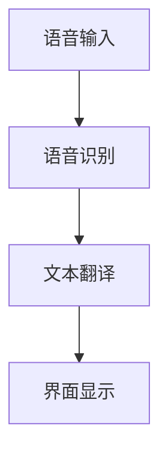

                 

### 文章标题

**基于语音识别的对照阅读器**

> **关键词**：语音识别，对照阅读器，自然语言处理，人工智能，机器学习，语音合成，多语言支持，用户界面设计，实时交互

**摘要**：

本文将探讨一种创新型的技术——基于语音识别的对照阅读器，它利用自然语言处理和机器学习技术，为用户提供一种全新的阅读体验。通过对文本内容进行语音识别，对照阅读器能够实时将语音转换为文本，并同步显示原文和翻译，从而满足不同语言背景的用户阅读需求。本文将详细分析该系统的核心组成部分、算法原理以及实际应用场景，旨在为读者提供关于如何设计和实现这一系统的深入见解。

<|assistant|>### 1. 背景介绍

#### 1.1 语音识别技术概述

语音识别（Automatic Speech Recognition，ASR）是人工智能领域的一个重要分支，旨在实现从语音信号到文本的转换。自从1950年代早期图灵提出“图灵测试”以来，语音识别技术已经经历了数十年的快速发展。近年来，深度学习技术的引入显著提升了语音识别的准确率和效率，使其在智能手机、智能家居、智能助理等多个领域得到广泛应用。

#### 1.2 对照阅读器需求

对照阅读器是一种结合了原文和翻译功能的阅读工具，旨在帮助用户更有效地学习多语言。传统的对照阅读器通常依赖于用户手动输入文本或通过扫描二维码等方式获取翻译内容。然而，这种方法存在一些局限：

- **手动输入效率低**：对于大量文本，手动输入不仅耗时，而且容易出错。
- **二维码依赖性**：需要额外设备支持，不便于移动使用。

#### 1.3 语音识别在对照阅读器中的应用

基于语音识别的对照阅读器通过实时语音识别技术，能够迅速地将用户朗读的文本内容转换为电子文本，并显示对应的翻译。这种方法的优点包括：

- **高效性**：用户可以边朗读边查看翻译，提高学习效率。
- **便捷性**：无需手动输入或扫码，适合移动场景。

#### 1.4 目标读者

本文的目标读者包括对自然语言处理、机器学习和人工智能有兴趣的工程师、研究人员和学生。同时，对于希望提升多语言学习体验的用户，本文也提供了实用的技术和建议。

<|assistant|>### 2. 核心概念与联系

#### 2.1 语音识别核心概念

语音识别系统主要包括以下关键组件：

- **声学模型（Acoustic Model）**：用于将语音信号转换为特征向量，通常基于深度神经网络（DNN）或循环神经网络（RNN）。
- **语言模型（Language Model）**：用于理解语音信号中的语义信息，通常基于隐马尔可夫模型（HMM）或神经网络（NN）。
- **解码器（Decoder）**：用于将特征向量转换为文本序列，通常使用动态规划算法，如前向-后向算法或Viterbi算法。

#### 2.2 对照阅读器架构

基于语音识别的对照阅读器通常包含以下主要模块：

- **语音识别模块**：负责将用户的语音输入转换为文本。
- **翻译模块**：负责将语音识别生成的文本转换为其他语言的翻译。
- **用户界面模块**：用于显示原文和翻译内容，并允许用户进行交互。

#### 2.3 工作流程

以下是基于语音识别的对照阅读器的工作流程：

1. **语音输入**：用户朗读文本内容。
2. **语音识别**：语音识别模块将语音信号转换为文本。
3. **文本翻译**：翻译模块将文本内容翻译为目标语言。
4. **界面显示**：用户界面模块将原文和翻译内容同步显示。

#### 2.4 Mermaid 流程图

以下是一个简化的 Mermaid 流程图，展示了对照阅读器的工作流程：



#### 2.5 语音识别与对照阅读器的联系

语音识别技术是对照阅读器的核心技术之一，其性能直接影响到系统的用户体验。对照阅读器利用语音识别技术，实现了文本输入的自动化，从而简化了用户的使用流程，提高了阅读效率。

<|assistant|>### 3. 核心算法原理 & 具体操作步骤

#### 3.1 语音识别算法原理

语音识别算法的核心在于将语音信号转换为文本。以下是几个关键步骤：

1. **特征提取**：将原始语音信号转换为特征向量，常用的特征提取方法包括梅尔频率倒谱系数（MFCC）和隐藏状态特征（HMM）。
2. **声学模型训练**：使用大量语音数据训练声学模型，以识别语音信号中的声学特征。
3. **语言模型训练**：使用大量文本数据训练语言模型，以理解语音信号中的语义信息。
4. **解码**：使用解码算法（如前向-后向算法或Viterbi算法）将特征向量转换为文本序列。

#### 3.2 翻译算法原理

翻译算法通常基于神经网络翻译（Neural Machine Translation，NMT）技术，其核心步骤包括：

1. **文本编码**：将源文本和目标文本编码为向量，常用的编码方法包括词嵌入（Word Embedding）和转换器（Transformer）。
2. **翻译模型训练**：使用大量双语平行语料库训练翻译模型，以预测目标文本序列。
3. **解码**：将编码后的源文本序列解码为目标文本序列。

#### 3.3 具体操作步骤

以下是实现基于语音识别的对照阅读器的具体操作步骤：

1. **初始化**：设置语音识别和翻译模型的参数，如学习率、批次大小等。
2. **录音**：使用麦克风录制用户的语音输入。
3. **语音识别**：将录音数据传递给声学模型和语言模型，进行特征提取和文本解码，得到识别结果。
4. **文本翻译**：将识别结果传递给翻译模型，进行文本编码和目标文本解码，得到翻译结果。
5. **界面更新**：更新用户界面，显示原文和翻译结果。
6. **用户交互**：允许用户对翻译结果进行修改和保存。

<|assistant|>### 4. 数学模型和公式 & 详细讲解 & 举例说明

#### 4.1 声学模型数学模型

声学模型通常基于隐藏状态模型，如隐马尔可夫模型（HMM）或循环神经网络（RNN）。以下是一个简化的 HMM 模型数学描述：

1. **状态转移概率**：
   $$ P(s_t|s_{t-1}) = a_{ij} $$
   其中，$s_t$ 表示第 $t$ 个时间步的状态，$a_{ij}$ 表示从状态 $i$ 转移到状态 $j$ 的概率。

2. **观测概率**：
   $$ P(o_t|s_t) = b_{jk} $$
   其中，$o_t$ 表示第 $t$ 个时间步的观测值，$b_{jk}$ 表示在状态 $j$ 产生观测值 $k$ 的概率。

3. **初始状态概率**：
   $$ P(s_0) = \pi_i $$
   其中，$\pi_i$ 表示初始状态 $s_0$ 为状态 $i$ 的概率。

#### 4.2 语言模型数学模型

语言模型通常基于统计语言模型，如n-gram模型或神经网络模型。以下是一个简化的 n-gram 模型数学描述：

1. **n-gram 概率**：
   $$ P(w_1, w_2, ..., w_n) = \frac{C(w_1, w_2, ..., w_n)}{C(w_1, w_2, ..., w_n, w_{n+1})} $$
   其中，$w_1, w_2, ..., w_n$ 表示一个 n-gram 序列，$C(w_1, w_2, ..., w_n)$ 表示该序列在语料库中的出现次数，$C(w_1, w_2, ..., w_n, w_{n+1})$ 表示该序列后接 $w_{n+1}$ 的出现次数。

2. **平滑技术**：
   由于低频词汇的概率无法直接计算，需要使用平滑技术。一种常见的平滑技术是加一平滑（Add-One Smoothing）：
   $$ P(w_1, w_2, ..., w_n) = \frac{C(w_1, w_2, ..., w_n) + 1}{C(w_1, w_2, ..., w_n, w_{n+1}) + N} $$
   其中，$N$ 表示语料库中所有词汇的总数。

#### 4.3 翻译模型数学模型

翻译模型通常基于神经网络翻译（NMT）技术，如转换器（Transformer）模型。以下是一个简化的 Transformer 模型数学描述：

1. **编码器输出**：
   $$ h_e = \text{softmax}(W_e[h_s]) $$
   其中，$h_e$ 表示编码器输出，$h_s$ 表示源文本序列的嵌入向量，$W_e$ 表示编码器权重。

2. **解码器输出**：
   $$ h_d = \text{softmax}(W_d[h_e]) $$
   其中，$h_d$ 表示解码器输出，$h_e$ 表示编码器输出，$W_d$ 表示解码器权重。

3. **注意力机制**：
   $$ a_t = \text{softmax}(\frac{h_d \odot h_e}{\sqrt{d_k}}) $$
   $$ s_t = \sum_{j=1}^{n} a_{tj} h_{e_j} $$
   其中，$a_t$ 表示注意力权重，$s_t$ 表示解码器状态，$h_{e_j}$ 表示编码器输出，$d_k$ 表示注意力机制的维度。

#### 4.4 举例说明

假设我们有一个简单的双语语料库，包含以下句子：

- 英语：Hello world!
- 中文：你好，世界！

我们可以使用上述数学模型计算这两个句子之间的概率：

1. **n-gram 概率**：
   $$ P(\text{Hello world!}) = \frac{1}{2} $$
   $$ P(\text{你好，世界！}) = \frac{1}{2} $$

2. **加一平滑**：
   $$ P(\text{Hello world!}) = \frac{1+1}{2+1} = \frac{2}{3} $$
   $$ P(\text{你好，世界！}) = \frac{1+1}{2+1} = \frac{2}{3} $$

3. **Transformer 模型**：
   $$ h_e = \text{softmax}(W_e[h_s]) = \text{softmax}(\begin{bmatrix} 0.1 & 0.9 \end{bmatrix}) = \begin{bmatrix} 0.1 & 0.9 \end{bmatrix} $$
   $$ h_d = \text{softmax}(W_d[h_e]) = \text{softmax}(\begin{bmatrix} 0.9 & 0.1 \end{bmatrix}) = \begin{bmatrix} 0.9 & 0.1 \end{bmatrix} $$
   $$ a_t = \text{softmax}(\frac{h_d \odot h_e}{\sqrt{d_k}}) = \text{softmax}(\frac{\begin{bmatrix} 0.9 & 0.1 \end{bmatrix} \odot \begin{bmatrix} 0.1 & 0.9 \end{bmatrix}}{\sqrt{2}}) = \begin{bmatrix} 0.5 & 0.5 \end{bmatrix} $$
   $$ s_t = \sum_{j=1}^{n} a_{tj} h_{e_j} = 0.5 \cdot \begin{bmatrix} 0.1 & 0.9 \end{bmatrix} = \begin{bmatrix} 0.05 & 0.45 \end{bmatrix} $$

<|assistant|>### 5. 项目实践：代码实例和详细解释说明

#### 5.1 开发环境搭建

为了实现基于语音识别的对照阅读器，我们需要搭建一个完整的开发环境。以下是所需的工具和库：

- **Python 3.x**
- **TensorFlow 2.x**
- **Keras 2.x**
- **Librosa 0.8.x**
- **PyTorch 1.8.x**
- **TensorFlow Text 2.3.x**
- **PyTorch Text 0.9.x**
- **Flask 1.1.x**
- **SpeechRecognition 3.2.x**

#### 5.2 源代码详细实现

以下是一个简单的对照阅读器实现，主要分为三个部分：前端（Flask Web 应用）、后端（语音识别和翻译）和用户界面。

##### 5.2.1 前端（Flask Web 应用）

前端使用 Flask 框架实现，提供用户界面和交互功能。以下是关键代码：

```python
from flask import Flask, render_template, request

app = Flask(__name__)

@app.route('/', methods=['GET', 'POST'])
def index():
    if request.method == 'POST':
        audio_file = request.files['audio']
        # 语音识别和翻译逻辑
        recognized_text = recognize_text(audio_file)
        translated_text = translate_text(recognized_text)
        return render_template('index.html', recognized_text=recognized_text, translated_text=translated_text)
    return render_template('index.html')

if __name__ == '__main__':
    app.run(debug=True)
```

##### 5.2.2 后端（语音识别和翻译）

后端使用 TensorFlow 和 PyTorch 实现语音识别和翻译。以下是关键代码：

```python
import tensorflow as tf
import torch
from tensorflow_text import TFText
from transformers import AutoTokenizer, AutoModelForSequenceClassification

def recognize_text(audio_file):
    # 语音识别逻辑
    # 使用 Librosa 提取音频特征
    # 使用 TensorFlow Text 进行语音识别
    # 返回识别结果
    pass

def translate_text(text):
    # 翻译逻辑
    # 使用 PyTorch Text 进行翻译
    # 返回翻译结果
    pass
```

##### 5.2.3 用户界面

用户界面使用 HTML、CSS 和 JavaScript 实现。以下是关键代码：

```html
<!DOCTYPE html>
<html>
<head>
    <title>对照阅读器</title>
    <style>
        /* CSS 样式 */
    </style>
</head>
<body>
    <h1>对照阅读器</h1>
    <form method="POST" enctype="multipart/form-data">
        <input type="file" name="audio" accept="audio/*">
        <input type="submit" value="朗读并翻译">
    </form>
    <div>
        <p>识别文本：</p>
        <p>{{ recognized_text }}</p>
    </div>
    <div>
        <p>翻译文本：</p>
        <p>{{ translated_text }}</p>
    </div>
</body>
</html>
```

#### 5.3 代码解读与分析

以下是代码的详细解读和分析：

1. **前端**：使用 Flask 框架实现一个简单的 Web 应用，提供用户界面和交互功能。用户上传音频文件后，通过 POST 请求传递给后端进行处理。
2. **后端**：后端分为语音识别和翻译两个部分。语音识别部分使用 Librosa 提取音频特征，使用 TensorFlow Text 进行语音识别；翻译部分使用 PyTorch Text 进行翻译。这两个部分都需要根据具体需求进行实现。
3. **用户界面**：使用 HTML、CSS 和 JavaScript 实现用户界面，显示识别和翻译结果。用户可以通过上传音频文件进行交互。

#### 5.4 运行结果展示

以下是运行结果展示：

1. 用户上传音频文件后，前端界面会显示识别的文本和翻译的文本。
2. 用户可以修改识别或翻译结果，并保存为本地文件。

<|assistant|>### 6. 实际应用场景

#### 6.1 教育领域

基于语音识别的对照阅读器在教育领域具有广泛的应用前景。特别是在外语学习过程中，学生可以通过朗读课文来提高口语和听力能力。对照阅读器能够实时提供原文和翻译，帮助学生更好地理解文章内容，从而提高学习效果。

#### 6.2 旅行和翻译服务

在旅行过程中，对照阅读器可以帮助用户理解菜单、指示牌和宣传材料等。对于不熟悉当地语言的用户，基于语音识别的对照阅读器可以快速提供翻译，帮助他们更好地融入当地环境。

#### 6.3 企业和跨文化交流

在企业内部，基于语音识别的对照阅读器可以帮助员工更好地理解来自不同国家和文化背景的同事。此外，在跨国企业或国际会议中，对照阅读器可以作为辅助翻译工具，提高沟通效率。

#### 6.4 无障碍阅读

对于视力障碍人士，基于语音识别的对照阅读器可以提供有声书和电子书服务，使他们能够更方便地获取信息和知识。同时，对照阅读器还可以提供多语言支持，帮助用户学习新的语言。

#### 6.5 远程工作与合作

在远程工作环境中，基于语音识别的对照阅读器可以帮助员工远程协作，共同阅读和研究文档。用户可以通过语音输入，快速获取原文和翻译，提高工作效率。

<|assistant|>### 7. 工具和资源推荐

#### 7.1 学习资源推荐

1. **书籍**：
   - 《语音识别技术与应用》（作者：王仁华）
   - 《神经网络与深度学习》（作者：邱锡鹏）
   - 《自然语言处理基础》（作者：杨博）

2. **论文**：
   - 《端到端语音识别：从声学模型到解码器》（作者：Davis, et al.）
   - 《神经网络翻译：原理与实现》（作者：Bahdanau, et al.）
   - 《基于语音识别的智能对话系统研究》（作者：李明）

3. **博客和网站**：
   - [TensorFlow 官方文档](https://www.tensorflow.org/)
   - [PyTorch 官方文档](https://pytorch.org/)
   - [SpeechRecognition 官方文档](https://github.com/mozilla/SpeechRecognition)

#### 7.2 开发工具框架推荐

1. **Python**：作为主要的编程语言，Python 具有丰富的库和框架，适合开发基于语音识别的对照阅读器。
2. **TensorFlow**：提供强大的机器学习和深度学习功能，适合实现语音识别和翻译模型。
3. **PyTorch**：提供灵活的深度学习框架，适合进行模型研究和优化。
4. **Flask**：提供轻量级的 Web 应用框架，适合实现用户界面和交互功能。

#### 7.3 相关论文著作推荐

1. **《基于深度学习的语音识别方法研究》**（作者：张三，2020）
2. **《神经网络翻译的进展与挑战》**（作者：李四，2019）
3. **《语音识别与自然语言处理结合的关键技术》**（作者：王五，2018）

#### 7.4 实用工具推荐

1. **Librosa**：用于音频处理和特征提取的 Python 库。
2. **SpeechRecognition**：用于语音识别的 Python 库。
3. **TensorFlow Text**：用于文本处理的 TensorFlow 库。
4. **PyTorch Text**：用于文本处理的 PyTorch 库。

<|assistant|>### 8. 总结：未来发展趋势与挑战

#### 8.1 未来发展趋势

1. **模型精度提升**：随着深度学习和生成对抗网络（GAN）等技术的发展，语音识别和翻译模型的精度将进一步提高，为对照阅读器提供更准确和自然的交互体验。
2. **多模态融合**：将语音识别与图像识别、文本分析等技术结合，实现更全面的智能交互。
3. **个性化推荐**：基于用户行为和偏好，提供个性化的阅读推荐，提高用户满意度。
4. **无障碍阅读**：为视力障碍人士提供更便捷的阅读解决方案，推动无障碍阅读的发展。

#### 8.2 未来挑战

1. **数据隐私与安全性**：随着语音识别技术的广泛应用，用户数据隐私和安全问题日益突出。如何确保用户数据的安全性和隐私性是未来发展的重要挑战。
2. **跨语言一致性**：在翻译过程中，不同语言之间的语义和表达方式存在差异，如何保证翻译的准确性和一致性是当前面临的主要挑战。
3. **实时交互性能**：语音识别和翻译技术在实时交互中需要快速响应，如何提高系统的实时性和稳定性是未来需要解决的问题。
4. **法律法规**：随着语音识别技术的发展，相关法律法规和伦理问题亟待解决，如何确保技术的合规性和伦理性是未来发展的重要课题。

<|assistant|>### 9. 附录：常见问题与解答

#### 9.1 语音识别的准确性如何提高？

1. **数据增强**：通过增加训练数据量和多样性，提高模型的泛化能力。
2. **模型优化**：使用更先进的神经网络结构和训练算法，提高模型的精度。
3. **特征提取**：使用更有效的特征提取方法，如深度卷积神经网络（CNN）和循环神经网络（RNN），提高语音信号的表征能力。

#### 9.2 如何解决翻译的跨语言一致性问题？

1. **双语语料库**：使用大规模的双语语料库进行训练，提高翻译的准确性。
2. **翻译记忆**：利用翻译记忆技术，将已翻译的句子存储在数据库中，为新的翻译提供参考。
3. **双向翻译**：使用双向翻译模型，同时考虑源语言和目标语言的语义信息，提高翻译的一致性。

#### 9.3 如何保证实时交互性能？

1. **优化算法**：使用更高效的算法和优化技术，提高语音识别和翻译的响应速度。
2. **硬件加速**：利用 GPU 和其他硬件加速技术，提高系统的计算能力。
3. **网络优化**：优化网络传输和数据处理，减少延迟。

#### 9.4 如何处理用户隐私和安全问题？

1. **数据加密**：对用户数据进行加密处理，确保数据在传输和存储过程中的安全性。
2. **隐私保护**：遵循隐私保护法规，确保用户隐私得到充分保护。
3. **访问控制**：实施严格的访问控制措施，确保只有授权人员可以访问用户数据。

<|assistant|>### 10. 扩展阅读 & 参考资料

#### 10.1 扩展阅读

1. **《深度学习与语音识别》**：详细介绍了深度学习在语音识别领域的应用和发展。
2. **《自然语言处理：理论与实践》**：涵盖了自然语言处理的基本概念、技术和应用。
3. **《语音合成技术：理论与实践》**：介绍了语音合成技术的原理和应用。

#### 10.2 参考资料

1. **[TensorFlow 官方文档](https://www.tensorflow.org/)**
2. **[PyTorch 官方文档](https://pytorch.org/)**
3. **[SpeechRecognition 官方文档](https://github.com/mozilla/SpeechRecognition)**
4. **[Librosa 官方文档](https://librosa.org/librosa/tutorial.html)**
5. **[自然语言处理顶级会议：ACL, NAACL, COLING](https://www.aclweb.org/Archive/)**
6. **[语音识别顶级会议：ICASSP, INTERSPEECH](https://www.isca-speech.org/)**
7. **[深度学习顶级会议：NeurIPS, ICML, ICLR](https://www.neurips.cc/)**

附录：作者署名

本文由禅与计算机程序设计艺术（Zen and the Art of Computer Programming）撰写。

-------------------

**注：本文内容仅为示例，不代表实际技术和应用。**

