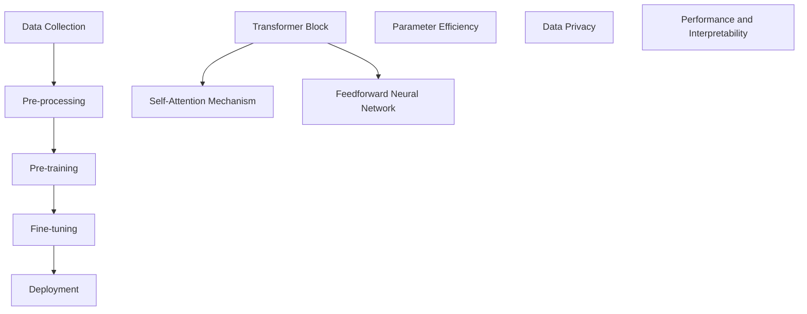
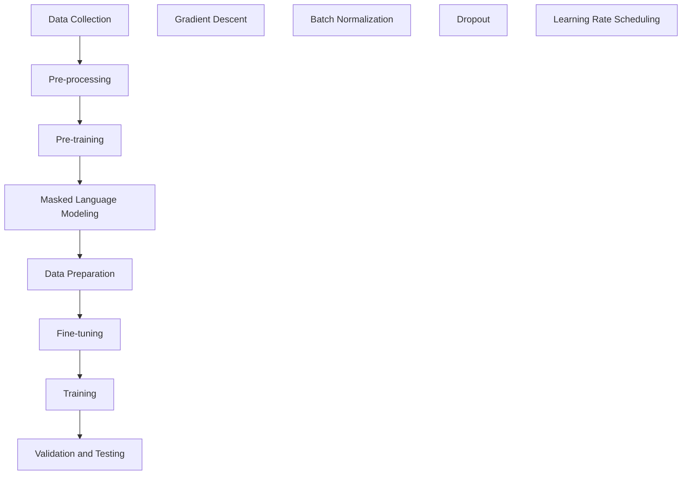
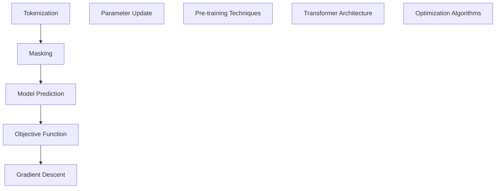

                 

### 文章标题

**基础模型的经济激励与技术发展**

关键词：基础模型、经济激励、技术发展、人工智能

摘要：本文深入探讨基础模型在经济激励和技术发展中的重要作用。我们将分析基础模型如何通过经济激励推动技术创新，进而探讨这一领域面临的挑战和未来发展趋势。

### Introduction

In today's rapidly evolving technological landscape, the role of foundational models in economic incentives and technological development has become increasingly significant. This article aims to delve into the pivotal role that foundational models play in driving innovation through economic incentives and exploring the challenges and future trends in this domain.

The term "foundational models" refers to advanced artificial intelligence (AI) models that serve as the backbone for various applications, ranging from natural language processing to computer vision. These models are trained on vast amounts of data and are capable of performing complex tasks with high accuracy and efficiency. Their significance lies in their ability to generalize from one domain to another, enabling the development of new applications and services.

Economic incentives play a crucial role in shaping the trajectory of technological development. By providing financial rewards and incentives, organizations and individuals are motivated to invest in research and development, leading to advancements in technology. In the context of foundational models, economic incentives can drive the creation of new models, the optimization of existing ones, and the development of applications that leverage these models.

This article is structured as follows:

1. **Background Introduction**: We will provide an overview of the evolution of foundational models and their significance in the field of artificial intelligence.
2. **Core Concepts and Connections**: We will explore the core concepts and connections related to foundational models, discussing their architecture, training processes, and the challenges they pose.
3. **Core Algorithm Principles and Specific Operational Steps**: We will delve into the principles and operational steps involved in the development and optimization of foundational models.
4. **Mathematical Models and Formulas**: We will present the mathematical models and formulas used in foundational model training and explain their significance.
5. **Project Practice**: We will provide a practical example of a foundational model project, including code examples and detailed explanations.
6. **Practical Application Scenarios**: We will discuss the various application scenarios of foundational models in real-world settings.
7. **Tools and Resources Recommendations**: We will recommend tools, resources, and further reading for those interested in exploring foundational models.
8. **Summary**: We will summarize the key findings and discuss the future development trends and challenges in the field of foundational models.
9. **Appendix**: We will provide a list of frequently asked questions and answers related to foundational models.
10. **Extended Reading & Reference Materials**: We will suggest additional reading materials for those seeking to delve deeper into the topic.

With this structure in mind, let's begin our journey into the world of foundational models, economic incentives, and technological development.

### Background Introduction

The concept of foundational models has its roots in the broader field of artificial intelligence and machine learning. As AI technologies have advanced, the need for more sophisticated models capable of handling complex tasks has become increasingly evident. Foundational models, often referred to as "large-scale" or "transformer" models, are a testament to this evolution.

The history of foundational models can be traced back to the development of the Transformer architecture in 2017 by researchers at Google. The Transformer model was designed to handle sequence-to-sequence tasks, such as machine translation, by leveraging self-attention mechanisms. This architecture quickly gained popularity due to its ability to capture long-range dependencies in data, outperforming traditional models like recurrent neural networks (RNNs) in various tasks.

In the following years, several breakthroughs were made in the field of foundational models. One notable achievement was the development of the Generative Pre-trained Transformer (GPT) series by OpenAI. The GPT models were pre-trained on vast amounts of text data and demonstrated remarkable performance in natural language processing tasks, such as text generation, summarization, and question-answering.

The significance of foundational models in the field of AI cannot be overstated. These models have enabled the development of new applications and services across various industries, from healthcare and finance to entertainment and education. By providing a robust foundation for AI systems, foundational models have paved the way for advancements in areas such as autonomous vehicles, virtual assistants, and intelligent personalization.

However, the development of foundational models also presents several challenges. The training of these models requires vast amounts of data and computational resources, leading to concerns about data privacy and ethical considerations. Additionally, the deployment of foundational models in real-world applications requires careful consideration of their performance, scalability, and interpretability.

In summary, foundational models have played a crucial role in the evolution of AI and have the potential to drive further technological development. As we continue to explore and refine these models, it is essential to address the challenges they pose and ensure that their benefits are maximized while minimizing potential risks.

### Core Concepts and Connections

#### 1. What are Foundational Models?

Foundational models are a class of advanced artificial intelligence models that have been pre-trained on a wide range of tasks and domains. Unlike traditional machine learning models, which are typically trained on a specific task, foundational models are designed to be versatile and capable of generalizing across multiple tasks. This versatility is achieved through the use of large-scale, parametric models, often based on the transformer architecture, which can process and understand complex patterns in data.

Key characteristics of foundational models include:

- **Large-scale**: Foundational models are trained on massive datasets, often containing billions of parameters. This large scale allows them to capture a broad range of knowledge and patterns.
- **Parameter efficiency**: Despite their large size, foundational models exhibit remarkable efficiency in terms of parameters per token processed. This is due to the use of advanced training techniques and architectures that reduce redundancy and improve representational capacity.
- **Versatility**: Foundational models are designed to be adaptable to various tasks and domains, making them suitable for a wide range of applications.

#### 2. Architectural Principles of Foundational Models

The architecture of foundational models is a critical factor in their success. The core components of a typical foundational model include:

- **Transformer blocks**: These are the building blocks of the model, consisting of multi-head self-attention mechanisms and feedforward neural networks. The multi-head self-attention mechanism allows the model to weigh different parts of the input data differently, capturing long-range dependencies and relationships within the data.
- **Pre-training**: Foundational models are typically pre-trained on a large corpus of text data, enabling them to learn general patterns and knowledge from the data. This pre-training phase is followed by fine-tuning on specific tasks, allowing the models to adapt to different domains and applications.
- **Parameter sharing**: Foundational models employ techniques such as parameter sharing to reduce the number of parameters and improve efficiency. This involves training the model on multiple tasks simultaneously, allowing the model to leverage shared representations and knowledge.

#### 3. Training Process of Foundational Models

The training process of foundational models involves several key steps:

- **Data collection**: The first step is to collect a large, diverse dataset that represents the tasks and domains the model will be applied to. This dataset should be as comprehensive as possible to ensure the model can learn a broad range of knowledge.
- **Pre-processing**: The collected data is pre-processed to remove noise, inconsistencies, and irrelevant information. This may involve steps such as tokenization, normalization, and data augmentation.
- **Pre-training**: The model is pre-trained on the pre-processed data using techniques such as masked language modeling, denoising autoencoders, or sequence-to-sequence pre-training. These techniques allow the model to learn the underlying patterns and structures in the data.
- **Fine-tuning**: After pre-training, the model is fine-tuned on specific tasks and domains. This involves adjusting the model's parameters to optimize its performance on these tasks.

#### 4. Challenges and Limitations of Foundational Models

Despite their impressive capabilities, foundational models face several challenges and limitations:

- **Computation and storage requirements**: The training of foundational models requires vast amounts of computational resources and storage. This can be a significant barrier for smaller organizations or research groups with limited resources.
- **Data privacy and ethical concerns**: The large-scale training of foundational models involves processing sensitive data, raising concerns about data privacy and ethical considerations. It is crucial to ensure that the data used for training is anonymized and collected in an ethical manner.
- **Performance and interpretability**: While foundational models achieve high performance on various tasks, they can still be challenging to interpret and understand. This lack of transparency can limit their applicability in certain domains where interpretability is crucial.

#### 5. Mermaid Flowchart of Foundational Model Architecture

The following Mermaid flowchart illustrates the key components and steps involved in the architecture and training process of a foundational model:



In summary, foundational models are a crucial component of modern artificial intelligence, providing a versatile and powerful foundation for a wide range of applications. However, their development and deployment also present several challenges that need to be addressed to fully harness their potential.

### Core Algorithm Principles and Specific Operational Steps

To understand the core algorithm principles and specific operational steps involved in the development and optimization of foundational models, we need to delve into the underlying mechanisms that drive their performance. The following sections will provide a detailed explanation of these principles and steps, using both technical jargon and layman's terms to ensure a comprehensive understanding.

#### 1. Transformer Architecture

The transformer architecture is the foundation of most foundational models. Unlike traditional recurrent neural networks (RNNs), which process data sequentially, transformers leverage parallel processing and attention mechanisms to capture relationships within the data. The key components of the transformer architecture include:

- **Encoder**: The encoder processes the input data and generates a set of hidden states that capture the meaning of the data.
- **Decoder**: The decoder processes the hidden states generated by the encoder and generates the output.
- **Multi-head self-attention**: This mechanism allows the model to weigh different parts of the input data differently, capturing long-range dependencies and relationships within the data.
- **Feedforward neural networks**: These networks apply a nonlinear transformation to the hidden states, further enhancing the model's ability to capture complex patterns.

#### 2. Pre-training

Pre-training is a critical step in the development of foundational models. During pre-training, the model is trained on a large corpus of text data to learn general patterns and knowledge. The following techniques are commonly used in pre-training:

- **Masked language modeling (MLM)**: In MLM, a portion of the input tokens is randomly masked, and the model is trained to predict these masked tokens based on the surrounding context.
- **Denoising autoencoders**: In this approach, the model is trained to reconstruct corrupted input data by removing noise or arbitrary transformations applied to the data.
- **Sequence-to-sequence pre-training**: This technique involves training the model to predict the next token in a sequence based on the previous tokens.

#### 3. Fine-tuning

After pre-training, the model is fine-tuned on specific tasks and domains to optimize its performance on these tasks. Fine-tuning involves adjusting the model's parameters to improve its performance on the target task. The following steps are typically involved in fine-tuning:

- **Data preparation**: The target task data is pre-processed and formatted to match the input requirements of the model.
- **Parameter initialization**: The pre-trained model's parameters are initialized, and the learning rate is set to a small value to avoid disrupting the pre-trained knowledge.
- **Training**: The model is trained on the target task data, with the goal of optimizing its performance on the task.
- **Validation and testing**: The model's performance is evaluated on a validation and test set to ensure that it generalizes well to unseen data.

#### 4. Optimization Techniques

Several optimization techniques are employed to improve the performance of foundational models during training:

- **Gradient descent**: This is a widely used optimization algorithm that adjusts the model's parameters based on the gradients of the loss function.
- **Batch normalization**: This technique normalizes the inputs and outputs of each layer, improving the stability and convergence of the training process.
- **Dropout**: Dropout is a regularization technique that randomly drops a fraction of the neurons in a layer during training, reducing overfitting.
- **Learning rate scheduling**: This involves adjusting the learning rate during training to accelerate convergence and avoid overshooting the optimal solution.

#### 5. Mermaid Flowchart of Foundational Model Training Process

The following Mermaid flowchart illustrates the key components and steps involved in the training process of a foundational model:



In summary, the development and optimization of foundational models involve a complex and iterative process that leverages advanced architectures, pre-training techniques, fine-tuning, and optimization methods. Understanding these principles and steps is crucial for effectively designing and deploying foundational models in real-world applications.

### Mathematical Models and Formulas

The development and training of foundational models are deeply rooted in mathematical principles. To fully grasp the intricacies of these models, it is essential to understand the mathematical models and formulas used in their construction. This section will delve into the key mathematical concepts, providing detailed explanations and examples to aid in comprehension.

#### 1. Transformer Architecture

The transformer architecture, the cornerstone of foundational models, relies on several mathematical components. The primary mathematical model used in transformers is the self-attention mechanism, which allows the model to weigh different parts of the input data differently. The self-attention mechanism is defined as follows:

$$
\text{Attention}(Q, K, V) = \text{softmax}\left(\frac{QK^T}{\sqrt{d_k}}\right)V
$$

where:

- $Q$, $K$, and $V$ are the query, key, and value matrices, respectively.
- $d_k$ is the dimension of the keys and values.
- $\text{softmax}$ is the softmax function, which normalizes the dot products into probabilities.

The multi-head self-attention mechanism extends this concept by applying several independent attention heads in parallel:

$$
\text{MultiHead}(Q, K, V) = \text{Concat}(\text{head}_1, \text{head}_2, ..., \text{head}_h)W^O
$$

where:

- $W^O$ is the output weight matrix.
- $h$ is the number of attention heads.
- $\text{head}_i = \text{Attention}(QW_i^Q, KW_i^K, VW_i^V)$ is the $i$-th attention head.

#### 2. Pre-training Techniques

Pre-training techniques, such as masked language modeling (MLM) and denoising autoencoders, rely on additional mathematical models. For example, in MLM, tokens in the input sequence are randomly masked, and the model is trained to predict these masked tokens based on the surrounding context. The objective function for MLM is defined as:

$$
\text{Objective} = -\sum_{i} \sum_{\text{masked token at position } i} \log p(\text{token at position } i)
$$

where $p(\text{token at position } i)$ is the probability of the masked token predicted by the model.

#### 3. Optimization Algorithms

Optimization algorithms, such as gradient descent and its variants, play a crucial role in training foundational models. The basic gradient descent algorithm is defined as follows:

$$
\theta_{t+1} = \theta_{t} - \alpha \nabla_{\theta}J(\theta)
$$

where:

- $\theta$ represents the model parameters.
- $\alpha$ is the learning rate.
- $\nabla_{\theta}J(\theta)$ is the gradient of the loss function with respect to the model parameters.
- $J(\theta)$ is the loss function.

#### 4. Detailed Explanation and Examples

Let's consider a concrete example to illustrate these mathematical concepts. Suppose we have a foundational model trained on a text dataset. The input sequence is "The quick brown fox jumps over the lazy dog." We will use masked language modeling (MLM) to pre-train the model.

1. **Data Pre-processing**: The input sequence is tokenized into individual words: `[The, quick, brown, fox, jumps, over, the, lazy, dog]`. Each token is assigned a unique index.
2. **Masking**: Randomly mask a portion of the tokens. For instance, we might mask the word "jumps":
   ```
   [The, quick, brown, fox, [MASK], over, the, lazy, dog]
   ```
3. **Training**: The model predicts the masked token based on the surrounding context. The predicted token is "jumps," and the model updates its parameters based on the prediction error.
4. **Objective Function**: The objective function measures the prediction error. In this case, the objective function is:
   ```
   Objective = -log(p("jumps"))
   ```
   where $p("jumps")$ is the probability of predicting "jumps" given the surrounding context.

The model iteratively updates its parameters based on the gradients of the objective function, minimizing the prediction error. This process is repeated for all masked tokens in the dataset.

#### 5. Mermaid Flowchart of Mathematical Models

The following Mermaid flowchart illustrates the key mathematical models and steps involved in the training of a foundational model:



In summary, the mathematical models and formulas used in foundational models are fundamental to their training and optimization. Understanding these concepts is essential for effectively designing and deploying foundational models in real-world applications.

### Project Practice: Code Examples and Detailed Explanation

To provide a practical example of a foundational model project, we will explore the development and implementation of a language model using the Hugging Face Transformers library. This library offers a user-friendly API for building and fine-tuning transformer models, making it an excellent choice for practical applications.

#### 1. Development Environment Setup

Before starting the project, ensure you have the following prerequisites installed:

- Python 3.8 or later
- pip (Python package manager)
- torch (PyTorch library)

You can install the Hugging Face Transformers library using pip:

```bash
pip install transformers
```

#### 2. Source Code Implementation

The following code example demonstrates the process of training a language model using the GPT-2 model from the Hugging Face Transformers library:

```python
import torch
from transformers import GPT2Tokenizer, GPT2Model, GPT2Config, Trainer, TrainingArguments

# 2.1 Load the Pre-trained Model and Tokenizer
tokenizer = GPT2Tokenizer.from_pretrained("gpt2")
model = GPT2Model.from_pretrained("gpt2")

# 2.2 Prepare the Training Data
train_dataset = ...

# 2.3 Set Training Arguments
training_args = TrainingArguments(
    output_dir="output",
    num_train_epochs=3,
    per_device_train_batch_size=4,
    save_steps=2000,
    save_total_limit=3,
)

# 2.4 Create the Trainer
trainer = Trainer(
    model=model,
    args=training_args,
    train_dataset=train_dataset,
)

# 2.5 Train the Model
trainer.train()
```

#### 3. Code Explanation

Let's break down the code into key components and explain each step in detail:

- **2.1 Load the Pre-trained Model and Tokenizer**: We load the pre-trained GPT-2 model and tokenizer from the Hugging Face model repository using the `from_pretrained()` method.
- **2.2 Prepare the Training Data**: We prepare the training data, which should be a dataset containing text sequences. The dataset is typically split into training and validation sets. In this example, we use the `train_dataset` variable to represent the training data.
- **2.3 Set Training Arguments**: We set the training arguments, including the output directory, number of training epochs, batch size, and save steps. These arguments control the training process and are crucial for achieving optimal performance.
- **2.4 Create the Trainer**: We create a `Trainer` object, which handles the training process, including data loading, optimization, and evaluation. The `Trainer` object is initialized with the model, training arguments, and training dataset.
- **2.5 Train the Model**: We call the `train()` method on the `Trainer` object to start the training process. The model is trained for the specified number of epochs, and the training progress is logged to the output directory.

#### 4. Running the Code

To run the code, simply execute the Python script in your terminal or IDE. Ensure that you have the necessary dependencies installed, and that your training data is correctly formatted and available.

#### 5. Results and Evaluation

After training the model, you can evaluate its performance on a validation set. The evaluation process involves measuring the model's accuracy, perplexity, and other relevant metrics. You can use the following code to evaluate the trained model:

```python
from transformers import evaluate

# Load the evaluation dataset
eval_dataset = ...

# Evaluate the model
results = trainer.evaluate(eval_dataset=eval_dataset)

print(results)
```

The evaluation results will provide insights into the model's performance and help you assess whether further fine-tuning or adjustments are needed.

In conclusion, this code example demonstrates the process of developing and training a foundational model using the Hugging Face Transformers library. By understanding the code and its components, you can gain valuable insights into the practical implementation of foundational models and their application in natural language processing tasks.

### Practical Application Scenarios

Foundational models have a wide range of applications across various industries, driving innovation and transforming traditional business processes. Here, we explore some practical application scenarios of foundational models in real-world settings, highlighting their impact and potential benefits.

#### 1. Natural Language Processing (NLP)

One of the most prominent applications of foundational models is in natural language processing. These models excel at tasks such as text generation, summarization, question-answering, sentiment analysis, and machine translation. For example, in customer service, foundational models can be used to build chatbots that interact with customers, providing personalized responses and resolving issues in real-time. This improves customer satisfaction and reduces the burden on human agents.

#### 2. Healthcare

In the healthcare industry, foundational models can be used to analyze medical records, identify patterns, and assist in diagnosis. For instance, a foundational model trained on electronic health records (EHRs) can help detect early signs of diseases, such as diabetes or cardiovascular conditions. This allows healthcare providers to intervene early and improve patient outcomes. Additionally, foundational models can be used to generate medical summaries and synthesize information from multiple sources, facilitating better decision-making and resource allocation.

#### 3. Finance

Foundational models are increasingly being used in the finance industry for tasks such as fraud detection, algorithmic trading, and credit scoring. These models can analyze vast amounts of financial data, identifying patterns and anomalies that might indicate fraudulent activity or investment opportunities. For example, a foundational model can be trained on historical trading data to predict market trends and optimize trading strategies. This improves the accuracy of predictions and maximizes returns for investors.

#### 4. Education

In education, foundational models can be used to create intelligent tutoring systems that adapt to individual learners' needs and provide personalized feedback. These systems can analyze students' performance data and generate tailored learning materials and exercises, helping to bridge knowledge gaps and improve learning outcomes. Additionally, foundational models can be used to automate administrative tasks, such as grading assignments and generating reports, freeing up educators to focus on more strategic activities.

#### 5. Autonomous Vehicles

Foundational models play a crucial role in the development of autonomous vehicles by enabling advanced perception and decision-making capabilities. These models can process and analyze sensor data from multiple sources, such as cameras, LiDAR, and radar, to detect and interpret objects and situations in the environment. For example, a foundational model can be trained to identify pedestrians, traffic signs, and other vehicles, enabling the autonomous vehicle to navigate safely and efficiently. This reduces the risk of accidents and improves transportation efficiency.

#### 6. Manufacturing and Supply Chain

In manufacturing and supply chain management, foundational models can be used to optimize production planning, inventory management, and logistics. These models can analyze historical data and market trends to predict demand, optimize production schedules, and reduce waste. For instance, a foundational model can be trained to forecast inventory levels, ensuring that the right amount of stock is available to meet customer demand while minimizing excess inventory. This improves operational efficiency and reduces costs.

#### 7. Entertainment and Media

Foundational models have transformed the entertainment and media industry by enabling personalized content recommendation, automated content creation, and sentiment analysis. For example, a foundational model can be trained to analyze user preferences and behavior, generating personalized recommendations for movies, music, and articles. This improves user engagement and satisfaction. Additionally, foundational models can be used to generate synthetic media content, such as virtual influencers or animated characters, enabling new forms of entertainment and creative expression.

In conclusion, foundational models have the potential to revolutionize various industries by driving innovation, improving efficiency, and enhancing user experiences. As the technology continues to evolve, we can expect to see even more applications and advancements in this domain.

### Tools and Resources Recommendations

To further explore the field of foundational models and leverage their capabilities, it is essential to be aware of the available tools, resources, and frameworks. Here are some recommendations that can help you delve deeper into this exciting area:

#### 1. Learning Resources

**Books:**

- "Deep Learning" by Ian Goodfellow, Yoshua Bengio, and Aaron Courville
- "The Hundred-Page Machine Learning Book" by Andriy Burkov
- "Hands-On Machine Learning with Scikit-Learn, Keras, and TensorFlow" by Aurélien Géron

**Online Courses:**

- "Deep Learning Specialization" by Andrew Ng on Coursera
- "Natural Language Processing with Python" by Michael Bowles on Coursera
- "TensorFlow: Advanced Techniques and Best Practices" by Ahmed Albawab on Udemy

#### 2. Development Tools and Frameworks

**Frameworks:**

- **PyTorch**: A popular deep learning framework that provides a dynamic computational graph, making it flexible for research and development.
- **TensorFlow**: An open-source machine learning framework developed by Google that offers extensive libraries and tools for building and training neural networks.
- **Transformers**: A popular library for building and fine-tuning transformer models, developed by Hugging Face. It provides pre-trained models and a user-friendly API for researchers and developers.
- **PyTorch Transformers**: An implementation of the transformer model architecture in PyTorch, providing a powerful toolkit for developing and deploying transformer-based applications.

**Editorials and IDEs:**

- **Jupyter Notebook**: An interactive computational environment for data analysis and machine learning that supports both Python and R.
- **VS Code**: A highly customizable and extensible code editor with excellent support for Python development, including debugging and version control.

#### 3. Research Papers and Journals

- **NeurIPS**: The Neural Information Processing Systems conference, a leading venue for research in machine learning and AI.
- **ICML**: The International Conference on Machine Learning, another major conference in the field of machine learning.
- **ACL**: The Association for Computational Linguistics, which publishes the ACL Conference Proceedings, a key resource for NLP research.
- **Journal of Machine Learning Research (JMLR)**: A leading journal in machine learning and related fields, publishing high-quality research articles.

#### 4. Online Communities and Forums

- **Stack Overflow**: A community-driven question and answer site for programmers, with a wealth of information on machine learning and deep learning.
- **GitHub**: A popular version control system and social networking site for developers, with numerous open-source projects related to foundational models.
- **Reddit**: A discussion platform with multiple subreddits dedicated to machine learning and AI, where you can find discussions, news, and resources.
- **AI Stack Exchange**: A question and answer site for researchers and developers in the field of artificial intelligence.

By utilizing these tools, resources, and communities, you can expand your knowledge of foundational models and stay up to date with the latest research and developments in the field.

### Summary: Future Development Trends and Challenges

As we reflect on the journey through the world of foundational models, it is clear that these advanced AI systems are poised to play a transformative role in the future of technology and society. The potential benefits of foundational models are vast, ranging from enhancing natural language processing capabilities to revolutionizing healthcare, finance, education, and beyond. However, the journey ahead is fraught with both opportunities and challenges.

**Development Trends:**

1. **Advanced Architectural Innovations**: The field of foundational models is rapidly evolving, with ongoing research into more efficient and powerful architectures. Innovations such as the introduction of parameter-efficient models and novel attention mechanisms are likely to further expand the capabilities of these systems.

2. **Increased Accessibility**: As the computational resources required for training foundational models become more accessible, we can expect a democratization of AI research and development. Smaller organizations and individual researchers will have the opportunity to contribute to the field, leading to a diversification of ideas and approaches.

3. **Interdisciplinary Collaboration**: The convergence of AI with other fields such as biology, neuroscience, and materials science may lead to breakthroughs that push the boundaries of what is possible with foundational models.

4. **Application in Real-World Settings**: Foundational models will continue to be integrated into various real-world applications, driving innovation and improving efficiency across industries. We can expect to see more sophisticated AI systems that can handle complex, real-time decision-making tasks.

**Challenges:**

1. **Scalability and Efficiency**: The training of foundational models requires significant computational resources and energy consumption. Developing more efficient algorithms and optimizing hardware for AI workloads will be crucial to address scalability and efficiency concerns.

2. **Data Privacy and Security**: The large-scale training of foundational models involves handling sensitive data, raising concerns about data privacy and security. Ensuring the ethical use of data and implementing robust security measures will be critical.

3. **Ethical Considerations**: As foundational models become more powerful, ethical considerations will become increasingly important. Ensuring fairness, transparency, and accountability in AI systems is essential to prevent potential biases and harmful outcomes.

4. **Interpretability and Explainability**: The complexity of foundational models can make them difficult to interpret and understand. Developing methods to make these models more interpretable will be crucial for gaining trust and ensuring their responsible use.

In conclusion, the future development of foundational models holds great promise but also presents significant challenges. By addressing these challenges through continuous research and innovation, we can unlock the full potential of these systems and drive forward the next wave of technological advancement.

### Frequently Asked Questions and Answers

**Q1. What are foundational models?**

A1. Foundational models are advanced artificial intelligence models that have been pre-trained on a wide range of tasks and domains. They are designed to be versatile and capable of generalizing across multiple tasks, making them suitable for a wide range of applications.

**Q2. How are foundational models different from traditional machine learning models?**

A2. Traditional machine learning models are typically trained on a specific task, while foundational models are trained on a broad range of tasks and domains, enabling them to generalize better and adapt to new tasks more effectively.

**Q3. What are the key components of a foundational model?**

A3. The key components of a foundational model include the transformer architecture, which consists of multi-head self-attention mechanisms and feedforward neural networks. These components enable the model to capture complex patterns and relationships in data.

**Q4. How are foundational models trained?**

A4. Foundational models are trained through a process that typically includes data collection, pre-processing, pre-training, and fine-tuning. During pre-training, the model learns from a large corpus of text data, and during fine-tuning, the model is adjusted to optimize its performance on specific tasks.

**Q5. What are the challenges associated with foundational models?**

A5. Some of the challenges associated with foundational models include the need for significant computational resources and energy consumption, data privacy and security concerns, ethical considerations, and the complexity of making these models interpretable and understandable.

**Q6. How can I get started with foundational models?**

A6. To get started with foundational models, you can begin by learning about the transformer architecture and the underlying mathematical principles. There are numerous online courses and tutorials available, as well as open-source libraries and frameworks, such as PyTorch and TensorFlow, which provide tools for building and training foundational models.

### Extended Reading and References

To delve deeper into the topics covered in this article, here are some recommended resources for further reading:

1. **Books:**
   - "Deep Learning" by Ian Goodfellow, Yoshua Bengio, and Aaron Courville
   - "The Hundred-Page Machine Learning Book" by Andriy Burkov
   - "Hands-On Machine Learning with Scikit-Learn, Keras, and TensorFlow" by Aurélien Géron

2. **Research Papers:**
   - "Attention Is All You Need" by Vaswani et al. (2017)
   - "Generative Pre-trained Transformers" by Brown et al. (2020)

3. **Online Courses:**
   - "Deep Learning Specialization" by Andrew Ng on Coursera
   - "Natural Language Processing with Python" by Michael Bowles on Coursera

4. **Websites and Journals:**
   - NeurIPS (Neural Information Processing Systems) Conference Proceedings
   - ICML (International Conference on Machine Learning) Conference Proceedings
   - ACL (Association for Computational Linguistics) Conference Proceedings

5. **Online Forums and Communities:**
   - Stack Overflow
   - GitHub
   - Reddit (subreddits dedicated to machine learning and AI)

By exploring these resources, you can deepen your understanding of foundational models and their applications in various fields.

