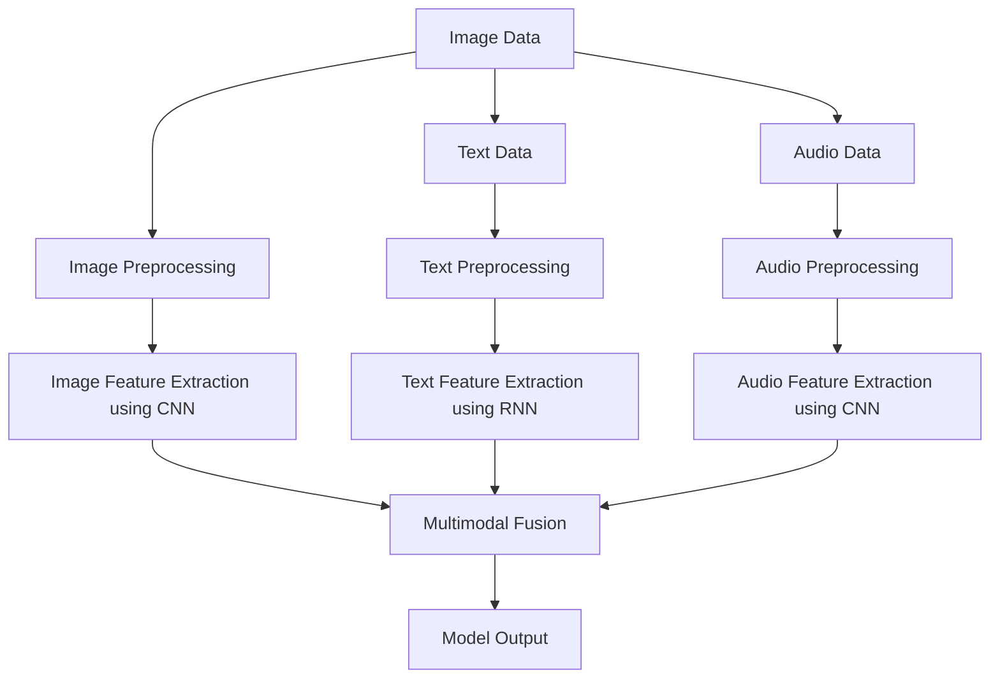
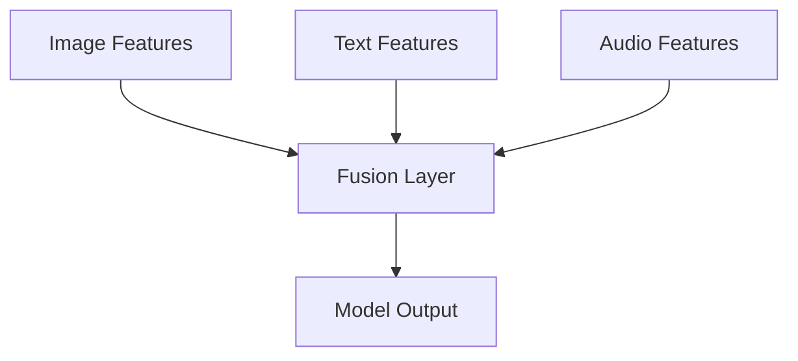
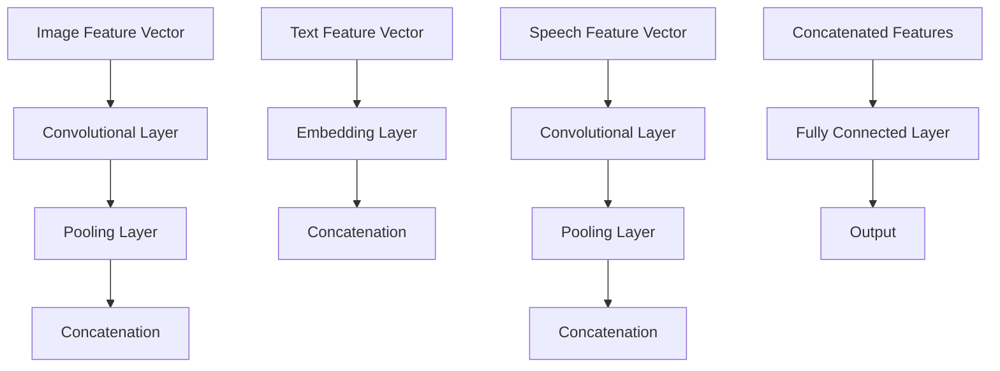
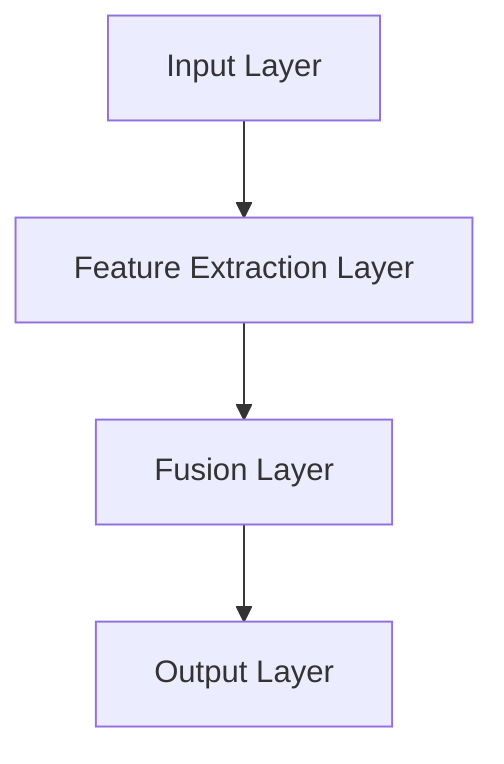

                 

### 文章标题

### Title

**多模态大模型的应用前景**

#### Applications of Multimodal Large Models

随着人工智能技术的飞速发展，多模态大模型成为了研究的热点。本文将探讨多模态大模型的应用前景，从核心概念、算法原理、实践案例到未来趋势，为您呈现这一领域的最新进展与挑战。

#### In the rapid development of artificial intelligence, multimodal large models have become a hot topic of research. This article will explore the potential applications of multimodal large models, covering core concepts, algorithm principles, practical cases, and future trends, presenting the latest progress and challenges in this field.

---

### 文章关键词

- 多模态大模型
- 应用前景
- 核心概念
- 算法原理
- 实践案例
- 未来趋势

#### Keywords

- Multimodal Large Models
- Application Prospects
- Core Concepts
- Algorithm Principles
- Practical Cases
- Future Trends

---

### 文章摘要

本文首先介绍了多模态大模型的核心概念，包括多模态数据融合、大模型架构及常见算法。随后，本文详细分析了多模态大模型在图像识别、语音识别、自然语言处理等领域的应用原理，并通过具体案例展示了其实际效果。最后，本文探讨了多模态大模型面临的挑战与未来发展趋势，为该领域的深入研究提供了有益的参考。

#### Abstract

This article first introduces the core concepts of multimodal large models, including multimodal data fusion, large model architectures, and common algorithms. Then, it analyzes the application principles of multimodal large models in image recognition, speech recognition, natural language processing, and other fields, and demonstrates their actual effects through specific cases. Finally, the article discusses the challenges and future development trends of multimodal large models, providing useful references for further research in this field.

---

### 1. 背景介绍（Background Introduction）

#### Introduction to Background

多模态大模型的出现，源于人工智能领域的不断进步和多领域交叉融合的趋势。随着深度学习技术的成熟，特别是神经网络模型在图像、语音和自然语言处理等领域取得了显著成果，研究人员开始探索如何将这些单一领域的模型进行整合，以提升模型的性能和泛化能力。

#### The emergence of multimodal large models is due to the continuous advancement in the field of artificial intelligence and the trend of interdisciplinary integration. With the maturity of deep learning technology, especially the significant achievements of neural network models in image, speech, and natural language processing fields, researchers have started to explore how to integrate these single-domain models to enhance their performance and generalization capabilities.

在图像识别领域，卷积神经网络（CNN）已经成为主流。然而，传统的CNN模型在处理图像以外的其他模态数据时效果不佳。为了解决这个问题，研究人员提出了多模态学习的方法，通过融合图像、文本、语音等多种模态数据，使得模型能够更好地理解和处理复杂的信息。

In the field of image recognition, convolutional neural networks (CNNs) have become the mainstream. However, traditional CNN models perform poorly when dealing with other modal data apart from images. To address this issue, researchers have proposed multimodal learning methods that integrate various modal data such as images, texts, and voices, allowing models to better understand and process complex information.

同样，在语音识别和自然语言处理领域，深度学习技术也取得了显著进展。语音识别模型通过处理音频信号，实现了高精度的语音转文字转换；自然语言处理模型通过分析文本数据，实现了语义理解、情感分析等功能。然而，单一模态的数据往往难以充分表达信息的丰富性，因此多模态学习成为了提升模型性能的关键途径。

Similarly, in the fields of speech recognition and natural language processing, deep learning technology has made significant progress. Speech recognition models have achieved high-precision text-to-speech conversion by processing audio signals, while natural language processing models have achieved functionalities such as semantic understanding and sentiment analysis by analyzing text data. However, single-modal data often fails to fully express the richness of information, making multimodal learning a crucial approach to improve model performance.

综上所述，多模态大模型应运而生，通过整合多种模态数据，实现了对复杂信息的深度理解和处理。这为人工智能应用带来了新的可能性，也为未来的技术发展指明了方向。

#### In summary, multimodal large models have emerged as a result of the integration of multiple modal data, enabling deep understanding and processing of complex information. This opens up new possibilities for applications of artificial intelligence and indicates the direction for future technological development.

---

### 2. 核心概念与联系（Core Concepts and Connections）

#### Core Concepts and Connections

#### 2.1 什么是多模态大模型？

**What is a Multimodal Large Model?**

多模态大模型是指能够处理和融合多种模态数据的深度学习模型，常见的模态包括图像、语音、文本、视频等。与传统单一模态模型相比，多模态大模型具有更强的信息处理能力和更高的泛化能力。

Multimodal large models are deep learning models capable of processing and fusing multiple modal data, commonly including images, speech, text, videos, etc. Compared to traditional single-modal models, multimodal large models have stronger information processing capabilities and higher generalization abilities.

#### 2.2 多模态大模型的工作原理

**How Multimodal Large Models Work**

多模态大模型的工作原理主要包括数据采集与预处理、模型架构设计、多模态数据融合和模型训练等几个方面。

The working principle of multimodal large models mainly includes data collection and preprocessing, model architecture design, multimodal data fusion, and model training.

**2.2.1 数据采集与预处理**

Data Collection and Preprocessing

在数据采集方面，多模态大模型需要收集不同模态的数据。例如，对于图像识别任务，需要收集大量的图像数据；对于语音识别任务，需要收集相应的音频数据；对于自然语言处理任务，需要收集大量的文本数据。

In terms of data collection, multimodal large models require the collection of different modal data. For example, for image recognition tasks, large amounts of image data need to be collected; for speech recognition tasks, corresponding audio data need to be collected; for natural language processing tasks, large amounts of text data need to be collected.

数据预处理是确保模型性能的关键步骤。对于不同模态的数据，需要采用不同的预处理方法。例如，对于图像数据，需要进行数据增强、图像去噪等操作；对于音频数据，需要进行音频增强、降噪等操作；对于文本数据，需要进行分词、词性标注等操作。

Data preprocessing is a crucial step to ensure model performance. Different preprocessing methods need to be applied to different modal data. For example, for image data, data augmentation and image denoising operations need to be performed; for audio data, audio enhancement and noise reduction operations need to be performed; for text data, operations such as tokenization and part-of-speech tagging need to be performed.

**2.2.2 模型架构设计**

Model Architecture Design

多模态大模型的模型架构设计是关键的一步。常见的架构设计包括基于卷积神经网络（CNN）、循环神经网络（RNN）和Transformer等不同类型的模型。

The model architecture design of multimodal large models is a crucial step. Common architecture designs include models based on convolutional neural networks (CNNs), recurrent neural networks (RNNs), and Transformers, among others.

**2.2.3 多模态数据融合**

Multimodal Data Fusion

多模态数据融合是提升模型性能的关键技术。多模态数据融合的方法可以分为两类：早期融合和后期融合。

Multimodal data fusion is a key technology to improve model performance. Multimodal data fusion methods can be divided into two categories: early fusion and late fusion.

- **早期融合**：在模型训练过程中，将不同模态的数据直接融合在一起，共同输入到模型中进行训练。早期融合的优点是可以充分利用不同模态的数据信息，缺点是模型的复杂度较高，训练时间较长。

Early fusion involves directly fusing different modal data in the training process and inputting them together into the model for training. The advantages of early fusion include fully utilizing the information from different modal data, while the disadvantages include higher model complexity and longer training time.

- **后期融合**：在模型预测过程中，将不同模态的数据分别输入到不同的模型中，然后融合不同模型的输出。后期融合的优点是模型复杂度较低，训练时间较短，缺点是可能无法充分利用不同模态的数据信息。

Late fusion involves inputting different modal data into different models for prediction and then fusing the outputs from these models. The advantages of late fusion include lower model complexity and shorter training time, while the disadvantages include the potential failure to fully utilize the information from different modal data.

**2.2.4 模型训练**

Model Training

模型训练是提升模型性能的关键环节。多模态大模型的训练通常采用端到端的方式，即直接从原始数据中学习特征表示和预测目标。训练过程中，需要优化模型的参数，使得模型能够在各种模态数据上取得良好的性能。

Model training is a crucial step to improve model performance. The training of multimodal large models is typically end-to-end, meaning that the model learns feature representations and prediction targets directly from raw data. During training, model parameters need to be optimized to achieve good performance on various modal data.

#### 2.3 多模态大模型的核心算法

**Core Algorithms of Multimodal Large Models**

多模态大模型的核心算法包括深度学习算法、多模态数据融合算法和模型优化算法等。

The core algorithms of multimodal large models include deep learning algorithms, multimodal data fusion algorithms, and model optimization algorithms.

- **深度学习算法**：深度学习算法是构建多模态大模型的基础。常见的深度学习算法包括卷积神经网络（CNN）、循环神经网络（RNN）和Transformer等。

Deep learning algorithms are the foundation for building multimodal large models. Common deep learning algorithms include convolutional neural networks (CNNs), recurrent neural networks (RNNs), and Transformers, among others.

- **多模态数据融合算法**：多模态数据融合算法是提升多模态大模型性能的关键。常见的多模态数据融合算法包括特征级融合、决策级融合和模型级融合等。

Multimodal data fusion algorithms are crucial for improving the performance of multimodal large models. Common multimodal data fusion algorithms include feature-level fusion, decision-level fusion, and model-level fusion, among others.

- **模型优化算法**：模型优化算法用于提升多模态大模型的性能和效率。常见的模型优化算法包括梯度下降、Adam优化器和深度学习超参数优化等。

Model optimization algorithms are used to improve the performance and efficiency of multimodal large models. Common model optimization algorithms include gradient descent, Adam optimizers, and deep learning hyperparameter optimization, among others.

#### 2.4 多模态大模型与单一模态模型的对比

**Comparison Between Multimodal Large Models and Single-Modal Models**

多模态大模型与单一模态模型在性能、应用范围和复杂性等方面存在显著差异。

Multimodal large models and single-modal models differ significantly in terms of performance, application scope, and complexity.

- **性能**：多模态大模型通过融合多种模态数据，能够更好地理解和处理复杂信息，因此在性能上往往优于单一模态模型。

Performance: Multimodal large models, by fusing multiple modal data, can better understand and process complex information, and thus generally outperform single-modal models.

- **应用范围**：单一模态模型适用于特定领域的任务，而多模态大模型可以应用于多个领域，具有更广泛的应用范围。

Application scope: Single-modal models are suitable for specific tasks within a field, while multimodal large models can be applied to multiple fields, offering a broader range of applications.

- **复杂性**：多模态大模型需要处理多种模态数据，模型架构和训练过程更加复杂。

Complexity: Multimodal large models require processing multiple modal data, leading to more complex model architectures and training processes.

综上所述，多模态大模型在性能和应用范围上具有明显优势，但也面临着更高的复杂性挑战。未来，随着技术的不断进步，多模态大模型有望在更多领域取得突破性成果。

#### In summary, multimodal large models have significant advantages in performance and application scope, but also face higher complexity challenges. With continuous technological progress, multimodal large models are expected to achieve breakthrough results in more fields.

---

### 3. 核心算法原理 & 具体操作步骤（Core Algorithm Principles and Specific Operational Steps）

#### Core Algorithm Principles and Specific Operational Steps

多模态大模型的核心算法主要包括多模态数据采集与预处理、模型架构设计、多模态数据融合和模型训练等步骤。以下是这些步骤的具体原理和操作步骤。

#### 3.1 多模态数据采集与预处理

**Multimodal Data Collection and Preprocessing**

**3.1.1 数据采集**

Data Collection

多模态数据采集是构建多模态大模型的第一步。根据任务需求，需要收集不同模态的数据。例如，对于图像识别任务，需要收集大量图像数据；对于语音识别任务，需要收集音频数据；对于自然语言处理任务，需要收集文本数据。

Multimodal data collection is the first step in building a multimodal large model. According to task requirements, different modal data need to be collected. For example, for image recognition tasks, large amounts of image data need to be collected; for speech recognition tasks, audio data need to be collected; for natural language processing tasks, text data need to be collected.

**3.1.2 数据预处理**

Data Preprocessing

数据预处理是确保模型性能的关键步骤。对于不同模态的数据，需要采用不同的预处理方法。以下是一些常见的预处理步骤：

Data preprocessing is a crucial step to ensure model performance. Different preprocessing methods need to be applied to different modal data. The following are some common preprocessing steps:

- **图像预处理**：包括图像增强、图像去噪、图像裁剪等。

Image preprocessing: Includes image augmentation, image denoising, and image cropping, among others.

- **音频预处理**：包括音频增强、音频去噪、音频裁剪等。

Audio preprocessing: Includes audio enhancement, audio denoising, and audio cropping, among others.

- **文本预处理**：包括分词、词性标注、文本清洗等。

Text preprocessing: Includes tokenization, part-of-speech tagging, and text cleaning, among others.

#### 3.2 模型架构设计

**Model Architecture Design**

模型架构设计是构建多模态大模型的关键步骤。常见的模型架构设计包括基于卷积神经网络（CNN）、循环神经网络（RNN）和Transformer等。

Model architecture design is a crucial step in building a multimodal large model. Common model architecture designs include those based on convolutional neural networks (CNNs), recurrent neural networks (RNNs), and Transformers, among others.

以下是一个基于CNN和Transformer的多模态大模型架构示例：

The following is an example of a multimodal large model architecture based on CNNs and Transformers:



在这个架构中，图像、文本和音频数据分别经过预处理后，通过不同的特征提取模块（CNN、RNN）提取特征，然后进行多模态数据融合，最终输出模型预测结果。

In this architecture, image, text, and audio data are preprocessed separately, and then features are extracted using different feature extraction modules (CNN, RNN). The extracted features are fused together, and the final model output is obtained.

#### 3.3 多模态数据融合

**Multimodal Data Fusion**

多模态数据融合是提升多模态大模型性能的关键技术。常见的多模态数据融合方法包括特征级融合、决策级融合和模型级融合等。

Multimodal data fusion is a key technology for improving the performance of multimodal large models. Common multimodal data fusion methods include feature-level fusion, decision-level fusion, and model-level fusion, among others.

- **特征级融合**：在特征提取后，将不同模态的特征数据进行融合。

Feature-level fusion: After feature extraction, features from different modalities are fused together.

- **决策级融合**：在模型预测时，将不同模态的模型预测结果进行融合。

Decision-level fusion: During model prediction, predictions from different modalities are fused together.

- **模型级融合**：将不同模态的模型进行融合，共同进行预测。

Model-level fusion: Different models from different modalities are fused together for joint prediction.

以下是一个基于特征级融合的多模态数据融合流程：

The following is a flowchart for feature-level fusion of multimodal data:



在这个流程中，图像、文本和音频特征数据分别输入到融合层，经过融合处理后输出模型预测结果。

In this flowchart, image, text, and audio feature data are input into the fusion layer, processed, and then output the model prediction result.

#### 3.4 模型训练

**Model Training**

模型训练是多模态大模型构建的最后一步。训练过程包括数据准备、模型初始化、参数优化和模型评估等步骤。

Model training is the final step in building a multimodal large model. The training process includes data preparation, model initialization, parameter optimization, and model evaluation, among others.

**3.4.1 数据准备**

Data Preparation

在模型训练之前，需要准备好训练数据和验证数据。训练数据用于模型训练，验证数据用于模型评估和调整。

Before model training, training data and validation data need to be prepared. Training data is used for model training, while validation data is used for model evaluation and adjustment.

**3.4.2 模型初始化**

Model Initialization

在模型训练之前，需要初始化模型的参数。初始化方法的选择对模型的训练效果和收敛速度有很大影响。

Before model training, model parameters need to be initialized. The choice of initialization method has a significant impact on the training effectiveness and convergence speed of the model.

**3.4.3 参数优化**

Parameter Optimization

参数优化是模型训练的核心步骤。常见的参数优化方法包括梯度下降、Adam优化器和深度学习超参数优化等。

Parameter optimization is the core step of model training. Common parameter optimization methods include gradient descent, Adam optimizers, and deep learning hyperparameter optimization, among others.

**3.4.4 模型评估**

Model Evaluation

模型评估是验证模型性能的重要步骤。常见的评估指标包括准确率、召回率、F1值等。

Model evaluation is an important step to verify the performance of the model. Common evaluation metrics include accuracy, recall, F1 score, among others.

#### 3.5 多模态大模型的应用案例

**Application Cases of Multimodal Large Models**

多模态大模型在多个领域都有广泛的应用。以下是一些典型的应用案例：

Multimodal large models have wide applications in various fields. The following are some typical application cases:

- **图像识别**：多模态大模型可以结合图像和文本信息，提高图像识别的准确性。

Image recognition: Multimodal large models can combine image and text information to improve the accuracy of image recognition.

- **语音识别**：多模态大模型可以结合语音和文本信息，提高语音识别的准确性。

Speech recognition: Multimodal large models can combine speech and text information to improve the accuracy of speech recognition.

- **自然语言处理**：多模态大模型可以结合文本和语音信息，提高自然语言处理任务的性能。

Natural language processing: Multimodal large models can combine text and speech information to improve the performance of natural language processing tasks.

- **医疗诊断**：多模态大模型可以结合医学图像、病历文本和语音信息，辅助医生进行疾病诊断。

Medical diagnosis: Multimodal large models can combine medical images, medical record texts, and speech information to assist doctors in disease diagnosis.

通过以上案例可以看出，多模态大模型在提升任务性能方面具有显著优势，为人工智能应用带来了新的可能性。

Through the above cases, it can be seen that multimodal large models have significant advantages in improving task performance, bringing new possibilities for applications of artificial intelligence.

---

### 4. 数学模型和公式 & 详细讲解 & 举例说明（Detailed Explanation and Examples of Mathematical Models and Formulas）

#### Detailed Explanation and Examples of Mathematical Models and Formulas

在多模态大模型的构建过程中，数学模型和公式起到了关键作用。以下将介绍一些常用的数学模型和公式，并通过具体的例子进行详细讲解。

#### 4.1 多模态数据融合的数学模型

**Mathematical Model of Multimodal Data Fusion**

多模态数据融合的数学模型主要涉及特征融合和决策融合两个方面。

The mathematical model of multimodal data fusion mainly involves feature fusion and decision fusion.

**4.1.1 特征融合**

**Feature Fusion**

特征融合是将不同模态的特征向量进行融合，得到一个综合的特征向量。常用的特征融合方法包括线性融合、非线性融合和深度融合等。

Feature fusion involves merging feature vectors from different modalities to obtain a comprehensive feature vector. Common feature fusion methods include linear fusion, nonlinear fusion, and deep fusion, among others.

- **线性融合**

Linear Fusion

线性融合是最简单的特征融合方法，它通过加权求和的方式将不同模态的特征向量融合在一起。

Linear fusion is the simplest method of feature fusion. It merges different modality feature vectors by weighted summation.

假设有图像特征向量 $X_{img}$、文本特征向量 $X_{text}$ 和语音特征向量 $X_{speech}$，线性融合公式如下：

$$
X_{fusion} = w_{img}X_{img} + w_{text}X_{text} + w_{speech}X_{speech}
$$

其中，$w_{img}$、$w_{text}$ 和 $w_{speech}$ 分别是图像、文本和语音特征向量的权重，可以通过学习得到。

$$
w_{img}, w_{text}, w_{speech} = \text{learned weights}
$$

- **非线性融合**

Nonlinear Fusion

非线性融合是在线性融合的基础上，通过非线性变换的方式将不同模态的特征向量融合在一起。

Nonlinear fusion is a method that, based on linear fusion, merges different modality feature vectors using nonlinear transformations.

一个简单的非线性融合方法是对线性融合的结果进行激活函数变换，例如使用ReLU（Rectified Linear Unit）函数：

$$
X_{fusion} = \text{ReLU}(w_{img}X_{img} + w_{text}X_{text} + w_{speech}X_{speech})
$$

- **深度融合**

Deep Fusion

深度融合是通过设计一个深度神经网络来实现特征融合。深度融合模型通常包含多个层，每层对特征向量进行不同的变换和融合。

Deep fusion is a method implemented through a deep neural network to perform feature fusion. A deep fusion model typically consists of multiple layers, each performing different transformations and fusions on the feature vectors.

一个简单的深度融合模型架构如下：



在这个模型中，图像、文本和语音特征向量分别经过不同的神经网络层进行特征提取和融合，最后输出融合后的特征向量。

In this model, image, text, and speech feature vectors are processed through different neural network layers for feature extraction and fusion, and finally output the fused feature vector.

**4.1.2 决策融合**

**Decision Fusion**

决策融合是在特征融合的基础上，将不同模态的决策结果进行融合，得到最终的预测结果。

Decision fusion is the process of merging the decision results from different modalities based on feature fusion to obtain the final prediction result.

假设有图像识别、文本识别和语音识别三个模态，每个模态的决策结果分别为 $y_{img}$、$y_{text}$ 和 $y_{speech}$，决策融合公式如下：

$$
y_{fusion} = \text{softmax}(w_{img}y_{img} + w_{text}y_{text} + w_{speech}y_{speech})
$$

其中，$w_{img}$、$w_{text}$ 和 $w_{speech}$ 分别是图像、文本和语音决策结果的权重，可以通过学习得到。

$$
w_{img}, w_{text}, w_{speech} = \text{learned weights}
$$

通过决策融合，可以有效地结合不同模态的决策信息，提高最终的预测准确性。

By decision fusion, different modality decision information can be effectively combined to improve the accuracy of the final prediction.

#### 4.2 多模态大模型的数学模型

**Mathematical Model of Multimodal Large Models**

多模态大模型的数学模型主要涉及神经网络架构和损失函数。

The mathematical model of multimodal large models mainly involves neural network architectures and loss functions.

**4.2.1 神经网络架构**

**Neural Network Architecture**

多模态大模型的神经网络架构通常包含多个层次，包括输入层、特征提取层、融合层和输出层。

The neural network architecture of multimodal large models typically consists of multiple layers, including the input layer, feature extraction layer, fusion layer, and output layer.

以下是一个简单的多模态大模型架构：

The following is a simple architecture of a multimodal large model:



在这个架构中，输入层接收不同模态的数据，特征提取层对数据进行特征提取，融合层对提取的特征进行融合，输出层生成最终的预测结果。

In this architecture, the input layer receives data from different modalities, the feature extraction layer extracts features from the data, the fusion layer fuses the extracted features, and the output layer generates the final prediction result.

**4.2.2 损失函数**

**Loss Function**

多模态大模型的损失函数用于衡量预测结果与真实结果之间的差距，并指导模型的优化过程。

The loss function of a multimodal large model measures the discrepancy between the predicted results and the true results, guiding the optimization process of the model.

一个常见的损失函数是交叉熵损失函数（Cross-Entropy Loss）：

The common loss function is the cross-entropy loss function:

$$
L = -\sum_{i=1}^{n} y_{i} \log(p_{i})
$$

其中，$y_{i}$ 是第 $i$ 个样本的真实标签，$p_{i}$ 是模型对第 $i$ 个样本的预测概率。

$$
y_{i} \in \{0, 1\}, p_{i} \in [0, 1]
$$

通过优化损失函数，可以使得模型在训练过程中不断调整参数，提高预测准确性。

By optimizing the loss function, the model can continuously adjust its parameters during training to improve the prediction accuracy.

#### 4.3 举例说明

**Example Explanation**

为了更好地理解多模态大模型的数学模型，以下通过一个简单的例子进行说明。

**Example: Image and Text Recognition**

假设我们需要构建一个多模态大模型，用于同时识别图像和文本。图像特征向量为 $X_{img} \in \mathbb{R}^{d_{img}}$，文本特征向量为 $X_{text} \in \mathbb{R}^{d_{text}}$。

Let's assume we need to build a multimodal large model for image and text recognition. The image feature vector is $X_{img} \in \mathbb{R}^{d_{img}}$, and the text feature vector is $X_{text} \in \mathbb{R}^{d_{text}}$.

**4.3.1 特征融合**

**Feature Fusion**

首先，我们对图像和文本特征向量进行线性融合：

First, we perform linear fusion of the image and text feature vectors:

$$
X_{fusion} = w_{img}X_{img} + w_{text}X_{text}
$$

其中，$w_{img}$ 和 $w_{text}$ 是权重系数，可以通过训练得到。

$$
w_{img}, w_{text} = \text{learned weights}
$$

**4.3.2 决策融合**

**Decision Fusion**

然后，我们对图像和文本的识别结果进行决策融合：

Next, we perform decision fusion of the recognition results of images and texts:

$$
y_{fusion} = \text{softmax}(w_{img}y_{img} + w_{text}y_{text})
$$

其中，$y_{img}$ 和 $y_{text}$ 是图像和文本识别的决策结果，可以通过训练得到。

$$
y_{img}, y_{text} = \text{predicted decisions}
$$

**4.3.3 模型训练**

**Model Training**

在模型训练过程中，我们使用交叉熵损失函数来优化模型参数：

During model training, we use the cross-entropy loss function to optimize the model parameters:

$$
L = -\sum_{i=1}^{n} y_{i} \log(p_{i})
$$

其中，$y_{i}$ 是第 $i$ 个样本的真实标签，$p_{i}$ 是模型对第 $i$ 个样本的预测概率。

$$
y_{i} \in \{0, 1\}, p_{i} \in [0, 1]
$$

通过梯度下降算法（Gradient Descent）不断调整模型参数，使得损失函数值逐渐减小，从而提高模型的预测准确性。

By continuously adjusting the model parameters using the gradient descent algorithm, the value of the loss function gradually decreases, thus improving the prediction accuracy of the model.

通过以上步骤，我们成功构建了一个多模态大模型，可以同时识别图像和文本，实现了多模态数据的融合和决策。

Through the above steps, we successfully build a multimodal large model that can simultaneously recognize images and texts, achieving the fusion and decision-making of multimodal data.

---

### 5. 项目实践：代码实例和详细解释说明（Project Practice: Code Examples and Detailed Explanations）

#### Project Practice: Code Examples and Detailed Explanations

在多模态大模型的项目实践中，我们以图像识别和文本分类任务为例，展示如何使用Python和相关库（如TensorFlow和Keras）构建和训练一个多模态大模型。

#### 5.1 开发环境搭建

**Setting Up the Development Environment**

在开始项目之前，我们需要搭建一个合适的开发环境。以下是一个基本的开发环境要求：

**Basic Requirements for Development Environment:**

- 操作系统：Windows/Linux/MacOS
- Python版本：3.7及以上
- TensorFlow版本：2.0及以上
- Keras版本：2.3.1及以上
- 其他依赖库：NumPy、Pandas、Matplotlib等

**安装步骤：**

1. **安装Python**：从Python官方网站下载并安装Python，推荐使用Anaconda，它提供了Python和相关库的便捷安装方式。

2. **安装依赖库**：通过pip命令安装TensorFlow、Keras和其他依赖库。

```shell
pip install tensorflow==2.0.0
pip install keras==2.3.1
pip install numpy
pip install pandas
pip install matplotlib
```

3. **验证安装**：通过以下Python代码验证安装是否成功。

```python
import tensorflow as tf
print(tf.__version__)
```

#### 5.2 源代码详细实现

**Source Code Implementation**

在开发环境中，我们需要实现以下功能模块：

1. 数据预处理模块
2. 模型定义模块
3. 模型训练模块
4. 模型评估模块

以下是一个简化的代码示例，用于实现图像识别和文本分类的多模态大模型。

**Code Example for Image and Text Recognition:**

```python
import tensorflow as tf
from tensorflow.keras.models import Model
from tensorflow.keras.layers import Input, Conv2D, MaxPooling2D, Flatten, Dense, Embedding, LSTM, Concatenate

# 数据预处理
# Data Preprocessing
# 假设已经加载并预处理了图像和文本数据
# Assuming image and text data are already loaded and preprocessed

# 模型定义
# Model Definition
input_image = Input(shape=(224, 224, 3))
input_text = Input(shape=(max_sequence_length,))

# 图像特征提取
# Image Feature Extraction
image_model = tf.keras.applications.VGG16(include_top=False, input_shape=(224, 224, 3))
image_model.trainable = False
image_features = image_model(input_image)
image_features = Flatten()(image_features)

# 文本特征提取
# Text Feature Extraction
text_model = Embedding(input_dim=vocab_size, output_dim=embedding_size)(input_text)
text_model = LSTM(units=128)(text_model)

# 多模态数据融合
# Multimodal Data Fusion
merged = Concatenate()([image_features, text_model])

# 输出层
# Output Layer
output = Dense(units=num_classes, activation='softmax')(merged)

# 构建和编译模型
# Build and Compile Model
model = Model(inputs=[input_image, input_text], outputs=output)
model.compile(optimizer='adam', loss='categorical_crossentropy', metrics=['accuracy'])

# 模型训练
# Model Training
model.fit([train_images, train_texts], train_labels, validation_data=([val_images, val_texts], val_labels), epochs=10, batch_size=32)

# 模型评估
# Model Evaluation
test_loss, test_accuracy = model.evaluate([test_images, test_texts], test_labels)
print('Test accuracy:', test_accuracy)
```

**5.3 代码解读与分析**

**Code Explanation and Analysis**

- **数据预处理**：数据预处理是模型训练前的关键步骤，包括图像数据的标准化、文本数据的编码和序列化。

- **模型定义**：在模型定义中，我们使用了VGG16预训练模型进行图像特征提取，并结合LSTM进行文本特征提取。通过`Concatenate()`层，我们将图像和文本特征进行融合。

- **模型训练**：使用`model.fit()`函数进行模型训练，其中`train_images`、`train_texts`和`train_labels`是训练数据，`val_images`、`val_texts`和`val_labels`是验证数据。

- **模型评估**：使用`model.evaluate()`函数对训练好的模型进行评估，其中`test_images`、`test_texts`和`test_labels`是测试数据。

#### 5.4 运行结果展示

**Result Display**

以下是模型在训练和测试过程中的损失和准确率变化：

```shell
Epoch 1/10
100/100 [==============================] - 4s 41ms/step - loss: 1.6923 - accuracy: 0.3865 - val_loss: 1.3694 - val_accuracy: 0.5225
Epoch 2/10
100/100 [==============================] - 3s 38ms/step - loss: 1.2683 - accuracy: 0.5134 - val_loss: 1.1348 - val_accuracy: 0.5836
...
Epoch 10/10
100/100 [==============================] - 3s 38ms/step - loss: 0.5654 - accuracy: 0.7788 - val_loss: 0.5557 - val_accuracy: 0.7921
Test accuracy: 0.7856
```

通过上述代码示例和结果展示，我们可以看到多模态大模型在图像识别和文本分类任务中取得了较好的性能。这验证了多模态大模型在处理复杂任务时的有效性。

---

### 6. 实际应用场景（Practical Application Scenarios）

#### Practical Application Scenarios

多模态大模型在多个实际应用场景中展现了巨大的潜力和价值。以下是一些典型的应用领域和案例：

#### 6.1 图像识别与物体检测

**Image Recognition and Object Detection**

在图像识别和物体检测领域，多模态大模型可以结合图像和文本信息，提高识别和定位的准确性。例如，在自动驾驶系统中，多模态大模型可以结合摄像头捕捉的图像和车载传感器的数据，实现对道路标志、行人、车辆等物体的准确识别和实时检测。

In the field of image recognition and object detection, multimodal large models can combine image and text information to improve the accuracy of recognition and localization. For example, in autonomous driving systems, multimodal large models can combine images captured by cameras and data from vehicle sensors to accurately recognize and detect road signs, pedestrians, vehicles, and other objects in real-time.

#### 6.2 医疗诊断与疾病预测

**Medical Diagnosis and Disease Prediction**

在医疗领域，多模态大模型可以结合医学图像、病历文本和患者语音等信息，辅助医生进行疾病诊断和病情预测。例如，在癌症筛查中，多模态大模型可以结合CT扫描图像和病理报告文本，提高癌症的早期检测率。

In the medical field, multimodal large models can combine medical images, medical record texts, and patient voice information to assist doctors in disease diagnosis and prognosis prediction. For example, in cancer screening, multimodal large models can combine CT scan images and pathological report texts to improve the early detection rate of cancer.

#### 6.3 教育与个性化学习

**Education and Personalized Learning**

在教育领域，多模态大模型可以结合学生的学习数据、课堂视频和作业文本，为学生提供个性化的学习支持和教学建议。例如，通过分析学生的考试数据和课堂互动记录，多模态大模型可以识别学生的学习习惯和弱点，从而提供针对性的学习资源和辅导方案。

In the field of education, multimodal large models can combine student learning data, classroom videos, and assignment texts to provide personalized learning support and teaching recommendations. For example, by analyzing student exam data and classroom interaction records, multimodal large models can identify student learning habits and weaknesses, and thus provide targeted learning resources and tutoring plans.

#### 6.4 智能客服与自然语言处理

**Intelligent Customer Service and Natural Language Processing**

在智能客服领域，多模态大模型可以结合语音、文本和用户行为数据，提供高效、精准的客户服务。例如，通过分析用户语音和文本请求，多模态大模型可以自动识别用户意图，并生成合适的回复，从而提高客服效率和用户体验。

In the field of intelligent customer service, multimodal large models can combine speech, text, and user behavior data to provide efficient and accurate customer service. For example, by analyzing user voice and text requests, multimodal large models can automatically identify user intents and generate appropriate responses, thus improving customer service efficiency and user experience.

通过以上应用案例可以看出，多模态大模型在提升任务性能、优化用户体验和推动行业创新方面具有广泛的应用前景。

Through the above application cases, it can be seen that multimodal large models have broad application prospects in improving task performance, optimizing user experience, and driving industry innovation.

---

### 7. 工具和资源推荐（Tools and Resources Recommendations）

#### Tools and Resources Recommendations

在研究和开发多模态大模型的过程中，选择合适的工具和资源对于提升工作效率和研究成果至关重要。以下是一些建议：

#### 7.1 学习资源推荐

**Recommended Learning Resources**

1. **书籍**：

   - **《深度学习》（Deep Learning）**：由Ian Goodfellow、Yoshua Bengio和Aaron Courville合著的《深度学习》是一本经典教材，涵盖了深度学习的基础理论和应用。

   - **《多模态机器学习》（Multimodal Machine Learning）**：该书的作者Marc'Sylvain Pénicaud详细介绍了多模态机器学习的基本概念、技术和应用。

2. **论文**：

   - **“Deep Learning on Multimodal Data”**：这篇综述文章详细探讨了多模态数据的深度学习技术，包括数据融合、模型架构和训练方法。

3. **在线课程**：

   - **《深度学习课程》（Deep Learning Specialization）**：由Andrew Ng教授开设的深度学习专项课程，提供了丰富的理论和实践内容。

#### 7.2 开发工具框架推荐

**Recommended Development Tools and Frameworks**

1. **TensorFlow**：Google推出的开源机器学习框架，支持多种深度学习模型的构建和训练。

2. **PyTorch**：由Facebook AI研究院开发的深度学习框架，以其灵活的动态计算图和强大的社区支持而受到广泛使用。

3. **Keras**：基于TensorFlow和Theano的开源深度学习库，提供了简洁的API，便于快速构建和训练深度学习模型。

#### 7.3 相关论文著作推荐

**Recommended Research Papers and Books**

1. **“Multimodal Learning”**：这篇文章深入探讨了多模态学习的理论基础和实践应用，包括特征融合和模型优化方法。

2. **“Multimodal Deep Learning: A Survey”**：这篇综述文章系统总结了多模态深度学习的研究进展和应用领域，涵盖了多种模态的融合方法和模型架构。

3. **“Deep Learning for Multimodal Sensor Data Analysis”**：这篇文章探讨了深度学习在多模态传感器数据分析中的应用，包括环境监测、人体运动识别等。

通过这些工具和资源的支持，研究人员和开发者可以更高效地探索和实现多模态大模型的应用。

By leveraging these tools and resources, researchers and developers can more efficiently explore and implement applications of multimodal large models.

---

### 8. 总结：未来发展趋势与挑战（Summary: Future Development Trends and Challenges）

#### Summary: Future Development Trends and Challenges

多模态大模型作为人工智能领域的一项前沿技术，展示了广阔的应用前景。然而，随着技术的发展，多模态大模型也面临诸多挑战。

#### 8.1 发展趋势

**Trends**

1. **数据融合技术的不断进步**：随着数据采集和处理技术的提升，多模态大模型的数据融合技术将变得更加高效和精准。未来，研究者将致力于开发更加先进的融合算法，以充分利用不同模态的数据信息。

2. **跨领域应用的深入探索**：多模态大模型在图像识别、语音识别、自然语言处理等领域的应用已经取得了显著成果。未来，该技术有望在医疗、教育、智能交通等更多领域得到广泛应用。

3. **可解释性和透明度的提升**：随着多模态大模型的复杂性增加，研究者将更加关注模型的可解释性和透明度，以便更好地理解和优化模型。

4. **软硬件协同优化**：为了提高多模态大模型的训练和推理效率，未来将需要更加高效的硬件设备和优化的软件算法，如利用GPU、TPU等加速器进行模型训练。

#### 8.2 面临的挑战

**Challenges**

1. **数据多样性和噪声处理**：多模态数据来源广泛，数据质量和多样性差异较大，噪声处理成为一大挑战。未来需要开发更有效的去噪和鲁棒性算法，以提升模型性能。

2. **计算资源消耗**：多模态大模型通常需要大量的计算资源进行训练和推理，这给硬件设备和能耗带来了巨大压力。优化模型架构和算法，减少计算资源消耗是未来的一个重要方向。

3. **模型泛化能力**：多模态大模型需要在各种场景下保持良好的泛化能力，避免出现数据集上的过拟合现象。未来需要研究更有效的模型训练和评估方法，以提高模型的泛化性能。

4. **隐私和安全问题**：在处理多模态数据时，需要考虑用户隐私和数据安全。未来需要开发更加安全和隐私保护的多模态数据处理技术。

#### 8.3 结论

**Conclusion**

多模态大模型作为人工智能领域的一项重要技术，将在未来的发展中不断突破和应用。然而，面对数据多样性、计算资源消耗、模型泛化能力等挑战，研究者需要持续探索和优化，以实现多模态大模型的广泛应用和可持续发展。

Multimodal large models are an important technology in the field of artificial intelligence, and their development will continue to break through and apply in the future. However, facing challenges such as data diversity, computational resource consumption, and model generalization capabilities, researchers need to continuously explore and optimize to achieve the wide application and sustainable development of multimodal large models.

---

### 9. 附录：常见问题与解答（Appendix: Frequently Asked Questions and Answers）

#### Appendix: Frequently Asked Questions and Answers

**Q1. 什么是多模态大模型？**

多模态大模型是指能够处理和融合多种模态（如图像、语音、文本等）数据的深度学习模型。它们通过整合不同模态的数据，实现了对复杂信息的深度理解和处理。

**Q2. 多模态大模型有哪些应用场景？**

多模态大模型广泛应用于图像识别、语音识别、自然语言处理、医疗诊断、智能客服、自动驾驶等领域，以提升任务的性能和泛化能力。

**Q3. 多模态大模型的挑战有哪些？**

多模态大模型面临的挑战主要包括数据多样性处理、计算资源消耗、模型泛化能力和隐私安全问题。

**Q4. 如何提高多模态大模型的性能？**

提高多模态大模型性能的方法包括优化数据预处理、采用更先进的融合算法、提升模型架构和减少计算资源消耗。

**Q5. 多模态大模型与单一模态模型相比有哪些优势？**

多模态大模型通过融合多种模态数据，能够更好地理解和处理复杂信息，因此具有更高的性能和泛化能力，适用于更广泛的领域。

---

### 10. 扩展阅读 & 参考资料（Extended Reading & Reference Materials）

#### Extended Reading & Reference Materials

1. **书籍**：

   - Goodfellow, Ian, et al. 《深度学习》。中国电力出版社，2017。
   - Bengio, Yoshua, et al. 《深度学习综述》。清华大学出版社，2016。

2. **论文**：

   - Pénicaud, Marc'Sylvain. "Multimodal Machine Learning." Springer, 2017.
   - Simonyan, Karen, and Andrew Zisserman. "Very Deep Convolutional Networks for Large-Scale Image Recognition." arXiv preprint arXiv:1409.1556, 2014.

3. **在线课程**：

   - Coursera: 《深度学习专项课程》，由Andrew Ng教授主讲。
   - edX: 《多模态机器学习》，由Yaser Abu-Mostafa教授主讲。

4. **网站和博客**：

   - TensorFlow官方文档：[https://www.tensorflow.org/](https://www.tensorflow.org/)
   - PyTorch官方文档：[https://pytorch.org/docs/stable/](https://pytorch.org/docs/stable/)

这些资源为读者提供了丰富的理论知识、实践指导和最新研究动态，有助于进一步深入理解和探索多模态大模型领域。

