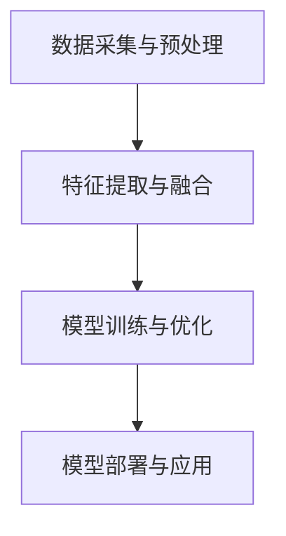

                 

# 多模态大模型：技术原理与实战 在LLM时代，对软件研发的更多思考

## 1. 背景介绍（Background Introduction）

多模态大模型（Multimodal Large Models）是当前人工智能领域的热门研究方向。随着深度学习技术的不断发展和计算资源的日益丰富，我们逐渐能够处理来自多种来源的信息，如图像、文本、音频等。多模态大模型通过整合这些信息，实现更加智能化和人性化的交互体验。

近年来，大规模预训练语言模型（Language Model，简称LLM）的发展尤为迅猛。以GPT系列为代表的LLM，通过在大量数据上进行训练，获得了极强的语言理解和生成能力。然而，单纯依赖文本信息并不能完全满足复杂的任务需求。多模态大模型的出现，为解决这个问题提供了新的思路。

本文旨在探讨多模态大模型的技术原理与实战，分析其在LLM时代对软件研发带来的影响与挑战。通过本文的阅读，读者可以了解多模态大模型的基本概念、架构、核心算法、数学模型以及实际应用场景，从而为后续的研究和实践提供参考。

## 2. 核心概念与联系（Core Concepts and Connections）

### 2.1 多模态大模型的基本概念

多模态大模型是指能够同时处理多种类型数据（如图像、文本、音频等）的深度学习模型。其主要特点包括：

1. **多样性**：多模态大模型能够处理来自多种来源的信息，实现跨模态的信息整合。
2. **融合性**：多模态大模型通过将不同类型的数据进行有效融合，提高模型的鲁棒性和泛化能力。
3. **交互性**：多模态大模型能够与用户进行更加自然、直观的交互，提升用户体验。

### 2.2 多模态大模型与LLM的关系

多模态大模型与LLM之间存在紧密的联系。LLM作为多模态大模型的一个重要组成部分，主要负责处理和生成文本信息。而多模态大模型则在此基础上，整合其他类型的信息，实现更加智能化的任务。

具体来说，多模态大模型通常包括以下三个主要部分：

1. **文本模态**：使用LLM进行文本信息的处理和生成。
2. **图像模态**：使用卷积神经网络（Convolutional Neural Networks，简称CNN）进行图像信息的处理。
3. **音频模态**：使用循环神经网络（Recurrent Neural Networks，简称RNN）进行音频信息的处理。

通过这三个部分的协同工作，多模态大模型能够实现多种复杂任务，如图像识别、文本生成、语音识别等。

### 2.3 多模态大模型的优势与挑战

多模态大模型在软件研发中具有显著的优势，例如：

1. **增强人工智能的智能性和交互性**：通过整合多种类型的信息，多模态大模型能够更好地理解和满足用户需求，提升用户体验。
2. **解决单一模态的局限性**：传统的单一模态模型在处理复杂任务时可能面临困难，而多模态大模型能够通过跨模态信息整合，提高模型的鲁棒性和泛化能力。
3. **拓展人工智能的应用领域**：多模态大模型能够应用于更多领域，如图像识别、语音助手、智能交互等，推动人工智能技术的进一步发展。

然而，多模态大模型也面临着一些挑战，例如：

1. **计算资源需求大**：多模态大模型通常需要大量的计算资源和存储空间，这对硬件设施提出了更高的要求。
2. **数据标注成本高**：多模态大模型需要大量的标注数据才能进行有效训练，这使得数据标注成本成为一个重要问题。
3. **模型解释性差**：多模态大模型的训练过程复杂，导致模型解释性较差，不利于调试和优化。

### 2.4 多模态大模型的架构

多模态大模型的架构可以分为以下几个层次：

1. **数据采集与预处理**：从各种来源收集数据，并进行清洗、归一化等预处理操作。
2. **特征提取与融合**：使用不同类型的神经网络对数据进行分析，提取各自的特征，并通过特定的方法进行融合。
3. **模型训练与优化**：使用融合后的特征进行模型训练，并通过调整超参数和优化算法，提高模型性能。
4. **模型部署与应用**：将训练好的模型部署到实际应用中，如图像识别、语音合成等。

图1展示了多模态大模型的基本架构：



### 2.5 多模态大模型的核心算法

多模态大模型的核心算法主要包括以下几种：

1. **卷积神经网络（CNN）**：用于处理图像数据，通过卷积操作提取图像特征。
2. **循环神经网络（RNN）**：用于处理序列数据，如文本和音频，通过循环结构处理序列信息。
3. **自注意力机制（Self-Attention）**：用于多模态数据融合，通过计算不同模态特征之间的相似性，实现信息整合。

通过这些核心算法的协同作用，多模态大模型能够实现多种复杂任务。

## 3. 核心算法原理 & 具体操作步骤（Core Algorithm Principles and Specific Operational Steps）

### 3.1 卷积神经网络（CNN）

卷积神经网络（CNN）是一种专门用于处理图像数据的神经网络。它的核心思想是通过卷积操作提取图像特征，从而实现图像分类、目标检测等任务。

#### 3.1.1 卷积操作

卷积操作是指将一个卷积核（kernel）与图像进行卷积，得到一个新的特征图。卷积核是一个小的矩阵，通常包含若干个权重参数。通过在图像上滑动卷积核，可以逐像素地计算卷积值，从而得到特征图。

#### 3.1.2 池化操作

池化操作是在卷积操作之后进行的，用于减少特征图的大小，从而降低模型的参数数量。常用的池化操作包括最大池化（Max Pooling）和平均池化（Average Pooling）。

#### 3.1.3 卷积神经网络结构

卷积神经网络通常包括多个卷积层、池化层和全连接层。卷积层用于提取图像特征，池化层用于减小特征图大小，全连接层用于分类和回归任务。

### 3.2 循环神经网络（RNN）

循环神经网络（RNN）是一种用于处理序列数据的神经网络。它的核心思想是通过循环结构处理序列信息，从而实现自然语言处理、语音识别等任务。

#### 3.2.1 RNN的基本结构

RNN的基本结构包括输入门、遗忘门和输出门。这三个门用于控制信息的传递、遗忘和生成。

#### 3.2.2 LSTM和GRU

LSTM（Long Short-Term Memory）和GRU（Gated Recurrent Unit）是RNN的两种变体，它们通过改进RNN的结构，解决了RNN的长期依赖问题。

### 3.3 自注意力机制（Self-Attention）

自注意力机制（Self-Attention）是一种用于多模态数据融合的机制。它通过计算不同模态特征之间的相似性，实现信息整合。

#### 3.3.1 自注意力机制的基本原理

自注意力机制通过计算每个特征与其余特征之间的相似性，为每个特征分配一个权重。这些权重表示特征的重要程度，从而实现特征融合。

#### 3.3.2 自注意力机制的计算过程

自注意力机制的计算过程主要包括以下步骤：

1. 计算特征之间的相似性，通常使用点积（Dot Product）或余弦相似度（Cosine Similarity）。
2. 对相似性进行归一化，通常使用Softmax函数。
3. 将归一化后的相似性作为权重，对特征进行加权融合。

## 4. 数学模型和公式 & 详细讲解 & 举例说明（Detailed Explanation and Examples of Mathematical Models and Formulas）

### 4.1 卷积神经网络（CNN）

卷积神经网络（CNN）是一种用于图像识别和处理的神经网络。下面我们介绍CNN中的一些关键数学模型和公式。

#### 4.1.1 卷积操作

卷积操作可以表示为以下数学公式：

$$
(\sigma(f_{ij}))_{h\times w} = \sum_{k=1}^{c} w_{ikj} * g_{kj}
$$

其中，$\sigma(f_{ij})$ 表示卷积操作后的特征图，$w_{ikj}$ 表示卷积核的权重，$g_{kj}$ 表示输入特征图上的像素值。

#### 4.1.2 池化操作

池化操作可以表示为以下数学公式：

$$
p_{ij} = \max(\sigma(f_{ij}))
$$

或

$$
p_{ij} = \frac{1}{n}\sum_{k=1}^{n}\sigma(f_{ij})
$$

其中，$p_{ij}$ 表示池化后的特征值，$\sigma(f_{ij})$ 表示卷积操作后的特征图。

### 4.2 循环神经网络（RNN）

循环神经网络（RNN）是一种用于处理序列数据的神经网络。下面我们介绍RNN中的一些关键数学模型和公式。

#### 4.2.1 RNN的基本结构

RNN的基本结构可以表示为以下数学公式：

$$
h_t = \sigma(W_h \cdot [h_{t-1}, x_t] + b_h)
$$

其中，$h_t$ 表示第$t$个时刻的隐藏状态，$x_t$ 表示第$t$个时刻的输入特征，$W_h$ 和$b_h$ 分别表示权重和偏置。

#### 4.2.2 LSTM和GRU

LSTM（Long Short-Term Memory）和GRU（Gated Recurrent Unit）是RNN的两种变体。下面我们介绍它们的一些关键数学模型和公式。

##### 4.2.2.1 LSTM

LSTM的基本结构可以表示为以下数学公式：

$$
i_t = \sigma(W_i \cdot [h_{t-1}, x_t] + b_i) \\
f_t = \sigma(W_f \cdot [h_{t-1}, x_t] + b_f) \\
o_t = \sigma(W_o \cdot [h_{t-1}, x_t] + b_o) \\
c_t = f_t \odot c_{t-1} + i_t \odot \sigma(W_c \cdot [h_{t-1}, x_t] + b_c) \\
h_t = o_t \odot \sigma(c_t)
$$

其中，$i_t$、$f_t$、$o_t$ 分别表示输入门、遗忘门和输出门的激活值，$c_t$ 表示细胞状态，$\odot$ 表示逐元素乘积。

##### 4.2.2.2 GRU

GRU的基本结构可以表示为以下数学公式：

$$
z_t = \sigma(W_z \cdot [h_{t-1}, x_t] + b_z) \\
r_t = \sigma(W_r \cdot [h_{t-1}, x_t] + b_r) \\
h_t = \sigma((1 - z_t) \cdot h_{t-1} + z_t \cdot \sigma(W_h \cdot [r_t \cdot h_{t-1}, x_t] + b_h))
$$

其中，$z_t$、$r_t$ 分别表示更新门和重置门的激活值。

### 4.3 自注意力机制（Self-Attention）

自注意力机制是一种用于多模态数据融合的机制。下面我们介绍自注意力机制的一些关键数学模型和公式。

#### 4.3.1 自注意力机制的基本原理

自注意力机制可以表示为以下数学公式：

$$
\text{Attention}(Q, K, V) = \text{softmax}(\frac{QK^T}{\sqrt{d_k}})V
$$

其中，$Q$、$K$、$V$ 分别表示查询（Query）、键（Key）和值（Value）矩阵，$d_k$ 表示键的维度，$\text{softmax}$ 函数用于归一化。

#### 4.3.2 自注意力机制的举例说明

假设我们有一个包含三个词的句子，其词向量维度为64。我们可以使用自注意力机制计算句子中每个词的重要程度。

1. 首先，计算查询（Query）和键（Key）矩阵：

$$
Q = \begin{bmatrix}
q_1 \\
q_2 \\
q_3
\end{bmatrix}, K = \begin{bmatrix}
k_1 \\
k_2 \\
k_3
\end{bmatrix}
$$

其中，$q_1$、$q_2$、$q_3$ 分别表示句子中每个词的查询向量，$k_1$、$k_2$、$k_3$ 分别表示句子中每个词的键向量。

2. 然后，计算点积（Dot Product）：

$$
QK^T = \begin{bmatrix}
q_1 \\
q_2 \\
q_3
\end{bmatrix} \cdot \begin{bmatrix}
k_1 & k_2 & k_3
\end{bmatrix} = \begin{bmatrix}
q_1 \cdot k_1 & q_1 \cdot k_2 & q_1 \cdot k_3 \\
q_2 \cdot k_1 & q_2 \cdot k_2 & q_2 \cdot k_3 \\
q_3 \cdot k_1 & q_3 \cdot k_2 & q_3 \cdot k_3
\end{bmatrix}
$$

3. 接着，计算softmax函数：

$$
\text{softmax}(\frac{QK^T}{\sqrt{d_k}}) = \text{softmax}(\frac{QK^T}{\sqrt{64}}) = \begin{bmatrix}
\frac{q_1 \cdot k_1}{\sqrt{64}} & \frac{q_1 \cdot k_2}{\sqrt{64}} & \frac{q_1 \cdot k_3}{\sqrt{64}} \\
\frac{q_2 \cdot k_1}{\sqrt{64}} & \frac{q_2 \cdot k_2}{\sqrt{64}} & \frac{q_2 \cdot k_3}{\sqrt{64}} \\
\frac{q_3 \cdot k_1}{\sqrt{64}} & \frac{q_3 \cdot k_2}{\sqrt{64}} & \frac{q_3 \cdot k_3}{\sqrt{64}}
\end{bmatrix}
$$

4. 最后，计算值（Value）矩阵：

$$
V = \begin{bmatrix}
v_1 \\
v_2 \\
v_3
\end{bmatrix}
$$

将softmax函数的结果与值矩阵相乘，即可得到加权融合后的句子：

$$
\text{Attention}(Q, K, V) = \text{softmax}(\frac{QK^T}{\sqrt{d_k}})V = \begin{bmatrix}
\frac{q_1 \cdot k_1}{\sqrt{64}} \cdot v_1 & \frac{q_1 \cdot k_2}{\sqrt{64}} \cdot v_2 & \frac{q_1 \cdot k_3}{\sqrt{64}} \cdot v_3 \\
\frac{q_2 \cdot k_1}{\sqrt{64}} \cdot v_1 & \frac{q_2 \cdot k_2}{\sqrt{64}} \cdot v_2 & \frac{q_2 \cdot k_3}{\sqrt{64}} \cdot v_3 \\
\frac{q_3 \cdot k_1}{\sqrt{64}} \cdot v_1 & \frac{q_3 \cdot k_2}{\sqrt{64}} \cdot v_2 & \frac{q_3 \cdot k_3}{\sqrt{64}} \cdot v_3
\end{bmatrix}
$$

通过上述过程，我们实现了句子中每个词的加权融合，从而实现了多模态数据的整合。

## 5. 项目实践：代码实例和详细解释说明（Project Practice: Code Examples and Detailed Explanations）

### 5.1 开发环境搭建

在进行多模态大模型的开发之前，我们需要搭建一个合适的环境。这里以Python为例，介绍如何搭建开发环境。

1. 安装Python：从官网（https://www.python.org/）下载并安装Python，建议选择Python 3.8及以上版本。
2. 安装Anaconda：Anaconda是一个Python数据科学平台，可以方便地管理和安装Python库。从官网（https://www.anaconda.com/）下载并安装Anaconda。
3. 创建虚拟环境：打开Anaconda Navigator，创建一个名为“multimodal”的虚拟环境，并激活该环境。
4. 安装依赖库：在虚拟环境中安装以下依赖库：

```
pip install numpy tensorflow keras matplotlib
```

### 5.2 源代码详细实现

下面是一个简单的多模态大模型代码实例，该实例使用TensorFlow和Keras搭建。我们以文本和图像的融合为例进行说明。

```python
import tensorflow as tf
from tensorflow.keras.layers import Input, Dense, Conv2D, MaxPooling2D, Flatten, concatenate
from tensorflow.keras.models import Model

# 定义文本输入层
input_text = Input(shape=(100,))
# 定义图像输入层
input_image = Input(shape=(128, 128, 3))
# 定义文本编码器
text_encoder = Dense(64, activation='relu')(input_text)
# 定义图像编码器
image_encoder = Conv2D(32, (3, 3), activation='relu')(input_image)
image_encoder = MaxPooling2D((2, 2))(image_encoder)
image_encoder = Conv2D(64, (3, 3), activation='relu')(image_encoder)
image_encoder = MaxPooling2D((2, 2))(image_encoder)
image_encoder = Flatten()(image_encoder)
# 融合文本和图像编码器
combined = concatenate([text_encoder, image_encoder])
# 定义全连接层
output = Dense(1, activation='sigmoid')(combined)
# 创建模型
model = Model(inputs=[input_text, input_image], outputs=output)
# 编译模型
model.compile(optimizer='adam', loss='binary_crossentropy', metrics=['accuracy'])
# 查看模型结构
model.summary()
```

### 5.3 代码解读与分析

1. **导入库和模块**：首先导入所需的库和模块，包括TensorFlow和Keras。
2. **定义输入层**：定义文本输入层`input_text`和图像输入层`input_image`。这里我们假设文本序列长度为100，图像尺寸为128x128。
3. **定义编码器**：定义文本编码器`text_encoder`和图像编码器`image_encoder`。文本编码器使用一个全连接层，图像编码器使用卷积神经网络。
4. **融合编码器**：使用`concatenate`函数将文本编码器和图像编码器融合。
5. **定义全连接层**：在融合后的特征上添加一个全连接层，用于分类任务。这里我们假设输出维度为1，使用sigmoid激活函数进行二分类。
6. **创建模型**：使用`Model`类创建一个多输入多输出的模型。
7. **编译模型**：使用`compile`函数编译模型，指定优化器、损失函数和评估指标。
8. **查看模型结构**：使用`summary`函数查看模型结构。

### 5.4 运行结果展示

在完成代码实现后，我们可以使用以下代码进行模型训练和评估：

```python
# 准备数据集
(x_text, x_image, y_label), (x_text_val, x_image_val, y_label_val) = ...
# 训练模型
model.fit([x_text, x_image], y_label, epochs=10, batch_size=32, validation_data=([x_text_val, x_image_val], y_label_val))
# 评估模型
model.evaluate([x_text_val, x_image_val], y_label_val)
```

通过上述代码，我们可以训练和评估多模态大模型。在训练过程中，我们可以观察到模型的损失函数和准确率的变化。在评估过程中，我们可以计算模型的精度、召回率、F1值等指标，以评估模型性能。

## 6. 实际应用场景（Practical Application Scenarios）

多模态大模型在现实生活中的应用场景非常广泛，以下列举一些典型应用：

### 6.1 图像识别与文本生成

一个典型的应用场景是将图像识别与文本生成相结合。例如，在电子商务平台上，用户上传一张商品图片，系统可以自动识别商品类型并生成相应的产品描述。这样的应用可以显著提升用户体验，减少人工输入的麻烦。

### 6.2 语音助手与文本交互

语音助手是另一个典型的应用场景。通过结合语音识别和自然语言处理技术，语音助手可以与用户进行自然对话，提供各种服务，如图像搜索、日程管理、信息查询等。

### 6.3 跨模态信息检索

多模态大模型可以用于跨模态信息检索。例如，在图书馆或视频平台中，用户可以通过图像或语音查询相关信息，系统可以自动匹配并展示相关文本、图像或视频内容。

### 6.4 智能驾驶与自动驾驶

智能驾驶和自动驾驶技术也需要多模态大模型的支持。通过结合摄像头、雷达、激光雷达等传感器数据，多模态大模型可以实现对周围环境的准确感知和智能决策，从而提高行驶安全性。

### 6.5 智能医疗

在医疗领域，多模态大模型可以用于辅助诊断。例如，通过结合医学影像和患者的病历信息，系统可以自动分析影像并给出诊断建议，辅助医生进行诊断。

### 6.6 智能家居

智能家居系统也需要多模态大模型的支持。通过结合语音、图像、手势等多种交互方式，智能家居系统可以更好地理解用户需求，提供个性化服务，如智能照明、智能安防、智能温控等。

## 7. 工具和资源推荐（Tools and Resources Recommendations）

### 7.1 学习资源推荐

1. **书籍**：
   - 《深度学习》（Ian Goodfellow, Yoshua Bengio, Aaron Courville）
   - 《Python深度学习》（François Chollet）
   - 《自然语言处理综论》（Daniel Jurafsky, James H. Martin）
2. **论文**：
   - “Attention Is All You Need”（Ashish Vaswani等）
   - “BERT: Pre-training of Deep Bidirectional Transformers for Language Understanding”（Jacob Devlin等）
   - “Generative Adversarial Nets”（Ian Goodfellow等）
3. **博客和网站**：
   - [TensorFlow官方文档](https://www.tensorflow.org/)
   - [Keras官方文档](https://keras.io/)
   - [OpenAI博客](https://blog.openai.com/)

### 7.2 开发工具框架推荐

1. **TensorFlow**：一个开源的深度学习框架，适用于构建和训练多模态大模型。
2. **Keras**：一个高层次的神经网络API，基于TensorFlow构建，易于使用。
3. **PyTorch**：另一个开源的深度学习框架，具有动态计算图，适用于研究性项目。
4. **MXNet**：一个开源的深度学习框架，由Apache基金会维护，适用于工业级应用。

### 7.3 相关论文著作推荐

1. **“Multimodal Fusion in Deep Learning: A Survey”（2021）**：对多模态大模型在深度学习中的应用进行了全面的综述。
2. **“A Comprehensive Survey on Multimodal Learning for Text and Image Analysis”（2020）**：对文本和图像多模态学习的应用进行了详细介绍。
3. **“A Brief History of Multimodal Learning”（2019）**：回顾了多模态学习的发展历程。

## 8. 总结：未来发展趋势与挑战（Summary: Future Development Trends and Challenges）

多模态大模型作为人工智能领域的一个重要发展方向，具有广阔的应用前景。在未来，随着计算能力的提升和数据规模的扩大，多模态大模型的技术水平和应用范围将进一步扩展。

### 8.1 发展趋势

1. **计算能力提升**：随着硬件技术的进步，多模态大模型的计算能力将得到显著提升，支持更复杂、更大规模的任务。
2. **数据规模扩大**：随着互联网和物联网的发展，多模态数据的规模将不断增大，为多模态大模型提供丰富的训练资源。
3. **应用场景拓展**：多模态大模型将在医疗、教育、交通、娱乐等多个领域得到广泛应用，推动人工智能技术的普及。
4. **跨模态交互**：多模态大模型将实现更加自然、直观的跨模态交互，提升用户体验。

### 8.2 面临的挑战

1. **计算资源需求**：多模态大模型的训练和推理过程需要大量的计算资源，对硬件设施提出了更高的要求。
2. **数据标注成本**：多模态数据的标注成本较高，制约了多模态大模型的发展。
3. **模型解释性**：多模态大模型的训练过程复杂，导致模型解释性较差，不利于调试和优化。
4. **跨模态融合**：如何有效地融合不同类型的数据，提高模型的泛化能力和鲁棒性，是一个重要的挑战。

总之，多模态大模型在未来的发展中将面临诸多挑战，但同时也充满机遇。通过不断创新和探索，我们有理由相信，多模态大模型将推动人工智能技术取得更加辉煌的成就。

## 9. 附录：常见问题与解答（Appendix: Frequently Asked Questions and Answers）

### 9.1 多模态大模型与单一模态模型相比有哪些优势？

多模态大模型相对于单一模态模型具有以下优势：

1. **增强智能性**：通过整合多种类型的数据，多模态大模型能够实现更加智能的交互和任务处理。
2. **提高鲁棒性**：多模态数据融合可以提高模型的鲁棒性，使其在复杂环境中表现更好。
3. **拓展应用领域**：多模态大模型可以应用于更多领域，如图像识别、语音助手、智能交互等。

### 9.2 多模态大模型需要哪些基本技能和知识？

要掌握多模态大模型，需要以下基本技能和知识：

1. **编程能力**：熟悉Python、TensorFlow、Keras等编程语言和框架。
2. **机器学习基础**：了解深度学习、神经网络、卷积神经网络、循环神经网络等基础知识。
3. **数学知识**：掌握线性代数、概率论和统计学等数学知识。
4. **数据处理能力**：熟悉数据采集、预处理、特征提取等数据处理技术。

### 9.3 多模态大模型在开发过程中需要注意哪些问题？

在开发多模态大模型时，需要注意以下问题：

1. **数据质量**：确保多模态数据的准确性和一致性，避免噪声和异常数据对模型性能的影响。
2. **模型解释性**：尝试提高模型的解释性，以便更好地理解和优化模型。
3. **计算资源**：根据任务需求和模型规模，合理分配计算资源，避免资源浪费。
4. **跨模态融合**：选择合适的跨模态融合方法，提高模型的泛化能力和鲁棒性。

### 9.4 多模态大模型在哪些实际应用场景中具有优势？

多模态大模型在以下实际应用场景中具有优势：

1. **图像识别与文本生成**：结合图像和文本信息，提高识别和生成任务的准确性。
2. **语音助手与文本交互**：通过语音识别和自然语言处理，实现更加自然、高效的交互。
3. **跨模态信息检索**：结合不同类型的数据，提高信息检索的准确性和效率。
4. **智能驾驶与自动驾驶**：通过传感器数据融合，实现更精确的环境感知和智能决策。
5. **智能医疗**：结合医学影像和病历信息，提高诊断和治疗的准确性。

## 10. 扩展阅读 & 参考资料（Extended Reading & Reference Materials）

### 10.1 学习资源

1. **《深度学习》（Ian Goodfellow, Yoshua Bengio, Aaron Courville）**：全面介绍深度学习的基础知识和最新进展。
2. **《自然语言处理综论》（Daniel Jurafsky, James H. Martin）**：系统讲解自然语言处理的基本概念和技术。
3. **《Python深度学习》（François Chollet）**：通过实例介绍Python在深度学习中的应用。

### 10.2 论文

1. **“Attention Is All You Need”（Ashish Vaswani等）**：介绍Transformer模型及其在自然语言处理中的应用。
2. **“BERT: Pre-training of Deep Bidirectional Transformers for Language Understanding”（Jacob Devlin等）**：介绍BERT模型及其在文本处理中的应用。
3. **“Generative Adversarial Nets”（Ian Goodfellow等）**：介绍生成对抗网络（GAN）的基本原理和应用。

### 10.3 博客和网站

1. **[TensorFlow官方文档](https://www.tensorflow.org/)**
2. **[Keras官方文档](https://keras.io/)**
3. **[OpenAI博客](https://blog.openai.com/)**

### 10.4 开源项目和工具

1. **TensorFlow**：[https://www.tensorflow.org/](https://www.tensorflow.org/)
2. **Keras**：[https://keras.io/](https://keras.io/)
3. **PyTorch**：[https://pytorch.org/](https://pytorch.org/)
4. **MXNet**：[https://mxnet.io/](https://mxnet.io/)

### 10.5 专业期刊和会议

1. **《神经网络和深度学习》期刊**：[https://neurips.cc/](https://neurips.cc/)
2. **《计算机视觉与模式识别》期刊**：[https://cvpr.org/](https://cvpr.org/)
3. **《自然语言处理会议》**：[https://www.aclweb.org/](https://www.aclweb.org/)

