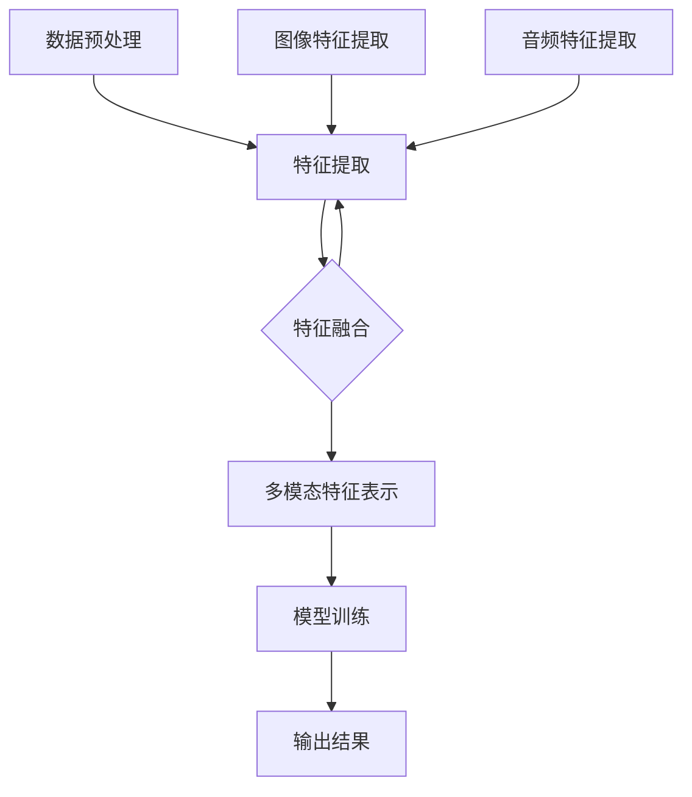
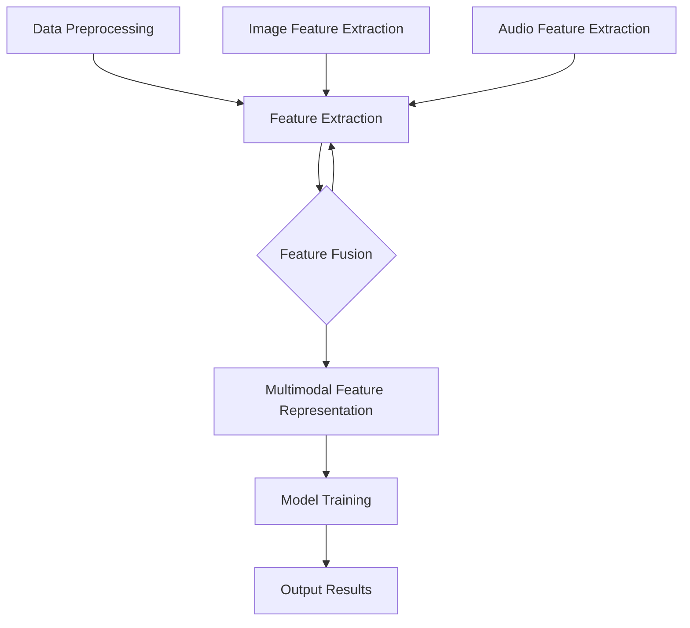

                 

### 背景介绍（Background Introduction）

多模态大模型是一种融合了文本、图像、音频等多种数据类型的人工智能模型，其核心在于能够对多种模态数据进行统一的处理与理解。在过去的几十年中，随着计算能力的提升、海量数据的积累以及深度学习算法的进步，多模态大模型的研究和应用取得了显著进展。这一技术的突破为工业设计与生产领域带来了前所未有的机遇和挑战。

工业设计与生产领域一直以来都在追求高效、精准、灵活的设计与制造方案。传统的工业设计依赖于二维图纸和手工模型，而生产过程则依赖于固定的设备和流程。这种方式不仅效率低下，而且难以满足个性化、定制化的需求。随着多模态大模型的发展，设计人员和工程师们可以借助这些先进的模型，实现对产品外观、功能、性能的全面优化，同时降低生产成本，提高生产效率。

然而，多模态大模型在工业设计与生产领域中的应用还面临着诸多挑战。首先是数据的多模态整合问题，不同模态的数据类型各异，如何有效地将它们融合在一起，是一个亟待解决的问题。其次是模型的训练与优化问题，多模态大模型的训练需要大量的计算资源和时间，如何优化模型结构、提高训练效率，也是一个重要的研究方向。最后是模型的实际应用问题，如何在复杂的工业环境中部署和运行多模态大模型，保证其稳定性和可靠性，也是一个重要的课题。

本文将围绕多模态大模型在工业设计与生产领域中的应用展开讨论，首先介绍多模态大模型的技术原理，然后分析其在工业设计中的具体应用场景，最后探讨其面临的挑战及未来发展趋势。通过本文的探讨，希望能够为相关领域的研究者和从业人员提供一些有价值的参考。

### 核心概念与联系（Core Concepts and Connections）

#### 什么是多模态大模型？
多模态大模型是一种能够处理和整合多种数据模态（如图像、文本、音频、视频等）的人工智能模型。其核心思想是通过跨模态特征提取和融合，实现对不同类型数据的统一理解和处理。多模态大模型在深度学习的基础上，利用卷积神经网络（CNN）、循环神经网络（RNN）和自注意力机制（Attention Mechanism）等先进技术，构建起一个强大的处理框架。

#### 多模态大模型的工作原理
1. **数据预处理**：首先，对不同模态的数据进行预处理，包括图像的缩放、裁剪、增强，文本的分词、词向量化，音频的采样、归一化等，以确保数据格式的一致性。
2. **特征提取**：利用卷积神经网络（CNN）对图像进行特征提取，捕捉图像中的视觉信息；利用循环神经网络（RNN）对文本和音频进行特征提取，捕捉序列中的时间依赖关系。
3. **特征融合**：通过跨模态特征融合技术（如自注意力机制、多任务学习等），将不同模态的特征进行整合，形成一个统一的特征表示。
4. **模型训练**：使用融合后的特征作为输入，训练一个深度学习模型（如Transformer、BERT等），以实现对多种模态数据的统一理解和处理。

#### 多模态大模型的关键技术
1. **多任务学习（Multi-Task Learning）**：多任务学习是一种通过共享模型参数来同时训练多个相关任务的技术，可以提高模型的泛化能力和训练效率。
2. **自注意力机制（Self-Attention Mechanism）**：自注意力机制是一种用于捕捉输入序列中长距离依赖关系的机制，可以显著提升模型的处理能力。
3. **多模态特征融合（Multimodal Feature Fusion）**：多模态特征融合是将不同模态的数据特征进行整合，以形成一个统一的特征表示，是多模态大模型的核心技术。

#### 多模态大模型在工业设计中的应用
多模态大模型在工业设计中的应用主要体现在以下几个方面：
1. **设计优化**：通过分析产品结构、功能、性能等多方面的信息，多模态大模型可以帮助设计人员优化产品外观、结构、材料等，提高设计效率和质量。
2. **故障预测与维护**：利用多模态数据（如传感器数据、图像、文本等），多模态大模型可以预测设备的故障风险，实现预防性维护，降低生产成本。
3. **生产规划**：通过分析生产数据（如图像、文本等），多模态大模型可以帮助企业优化生产计划，提高生产效率。

#### Mermaid 流程图
为了更直观地展示多模态大模型的工作原理，以下是一个基于 Mermaid 语法的流程图：



在这个流程图中，A 表示数据预处理，B 表示特征提取，C、D、E 分别表示文本、图像、音频特征提取，F 表示特征融合，G 表示模型训练，H 表示输出结果。

通过以上对多模态大模型的核心概念和工作原理的介绍，我们可以看到，这一技术为工业设计与生产领域带来了巨大的潜力和机遇。接下来，我们将进一步探讨多模态大模型在工业设计中的具体应用场景，以期为相关领域的研究者和从业人员提供有益的参考。

#### Core Concepts and Connections
#### What is a Multimodal Large Model?
A multimodal large model is an artificial intelligence model that can process and integrate various data modalities, such as text, images, audio, and video. The core idea behind this technology is to unify the processing and understanding of different types of data through cross-modal feature extraction and fusion. Based on deep learning, multimodal large models leverage advanced techniques such as convolutional neural networks (CNNs), recurrent neural networks (RNNs), and self-attention mechanisms to build a powerful processing framework.

#### Working Principles of Multimodal Large Models
1. **Data Preprocessing**: The first step involves preprocessing data from different modalities. This includes resizing, cropping, and augmenting images, tokenizing and vectorizing text, and sampling and normalizing audio, among others, to ensure a consistent data format.
2. **Feature Extraction**: Convolutional neural networks (CNNs) are used for feature extraction from images, capturing visual information; recurrent neural networks (RNNs) are used for feature extraction from text and audio, capturing temporal dependencies.
3. **Feature Fusion**: Cross-modal feature fusion techniques, such as self-attention mechanisms and multi-task learning, are employed to integrate features from different modalities into a unified feature representation.
4. **Model Training**: A deep learning model, such as Transformer or BERT, is trained using the fused features as input, to achieve unified understanding and processing of multimodal data.

#### Key Technologies of Multimodal Large Models
1. **Multi-Task Learning**: Multi-task learning is a technique that shares model parameters to train multiple related tasks simultaneously, improving the model's generalization ability and training efficiency.
2. **Self-Attention Mechanism**: Self-attention mechanism is a mechanism used to capture long-distance dependencies within an input sequence, significantly enhancing the model's processing capabilities.
3. **Multimodal Feature Fusion**: Multimodal feature fusion is the process of integrating data features from different modalities into a unified feature representation, which is a critical technology in multimodal large models.

#### Applications of Multimodal Large Models in Industrial Design
Multimodal large models have several applications in industrial design, including:
1. **Design Optimization**: By analyzing product structure, functionality, performance, and other aspects of information, multimodal large models can assist designers in optimizing product appearance, structure, materials, and more, improving design efficiency and quality.
2. **Fault Prediction and Maintenance**: Utilizing multimodal data such as sensor data, images, and text, multimodal large models can predict equipment failure risks and implement predictive maintenance, reducing production costs.
3. **Production Planning**: By analyzing production data such as images and text, multimodal large models can help enterprises optimize production plans and improve production efficiency.

#### Mermaid Flowchart
To visually illustrate the working principles of multimodal large models, here is a flowchart based on the Mermaid syntax:



In this flowchart, A represents data preprocessing, B represents feature extraction, C, D, and E represent text, image, and audio feature extraction, F represents feature fusion, G represents model training, and H represents output results.

With the introduction of the core concepts and working principles of multimodal large models, we can see that this technology holds great potential and opportunities for the field of industrial design and production. In the following sections, we will further explore the specific applications of multimodal large models in industrial design, providing valuable references for researchers and practitioners in the field. 

### 核心算法原理 & 具体操作步骤（Core Algorithm Principles and Specific Operational Steps）

多模态大模型的构建涉及到多种算法和技术的综合运用，其中核心算法主要包括深度学习模型架构、特征提取与融合方法以及训练与优化策略。以下将详细阐述这些核心算法的原理，并提供具体的操作步骤。

#### 1. 深度学习模型架构

深度学习模型是多模态大模型的核心组成部分。目前，Transformer架构因其强大的并行计算能力和良好的跨模态特征表示能力而广泛应用于多模态任务。以下是一个基于Transformer的多模态大模型的基本架构：

1. **编码器（Encoder）**：用于处理不同模态的数据，并提取特征。对于文本，可以使用BERT或GPT等预训练语言模型；对于图像，可以使用VGG、ResNet等卷积神经网络；对于音频，可以使用WaveNet、Tacotron等生成模型。
2. **解码器（Decoder）**：用于生成输出结果，可以是文本、图像、音频或它们的组合。解码器通常也基于Transformer架构，以实现高效的特征融合和生成。
3. **多模态融合层（Multimodal Fusion Layer）**：位于编码器和解码器之间，用于融合不同模态的特征。常见的融合方法包括自注意力机制（Self-Attention Mechanism）和多任务学习（Multi-Task Learning）。

#### 2. 特征提取与融合方法

特征提取是构建多模态大模型的关键步骤，不同模态的数据需要通过相应的特征提取器进行处理。

1. **文本特征提取**：文本数据通过分词和词向量化转化为向量表示，然后输入到预训练的语言模型中，提取出高维的语义特征。
2. **图像特征提取**：图像数据通过卷积神经网络（如VGG或ResNet）进行特征提取，捕获图像的视觉信息。
3. **音频特征提取**：音频数据通过长短时记忆网络（如LSTM）或变换器（如WaveNet、Tacotron）进行特征提取，捕捉音频的时序信息。

特征融合是另一个关键步骤，目的是将不同模态的特征整合为一个统一的表示。以下是一些常用的特征融合方法：

1. **自注意力机制（Self-Attention Mechanism）**：通过计算不同模态特征之间的关联性，实现特征间的动态融合。
2. **多任务学习（Multi-Task Learning）**：通过共享模型参数，同时训练多个相关任务，提高模型的泛化能力。
3. **特征拼接（Feature Concatenation）**：直接将不同模态的特征向量拼接在一起，形成一个更长的向量作为输入。

#### 3. 训练与优化策略

多模态大模型的训练过程复杂，涉及大量的计算资源和时间。以下是一些常用的训练与优化策略：

1. **预训练与微调（Pre-training and Fine-tuning）**：首先在大规模的数据集上对基础模型进行预训练，然后针对特定任务进行微调，以提高模型的泛化能力和任务适应性。
2. **多任务学习（Multi-Task Learning）**：通过同时训练多个相关任务，共享模型参数，提高训练效率。
3. **学习率调度（Learning Rate Scheduling）**：调整学习率以避免模型过早地陷入局部最优，常用的策略包括指数衰减、余弦退火等。
4. **正则化（Regularization）**：如Dropout、权重衰减等，防止模型过拟合。

#### 操作步骤示例

以下是一个简单的操作步骤示例，用于构建一个基于Transformer的多模态大模型，用于图像-文本匹配任务：

1. **数据准备**：收集并准备图像和文本数据集，包括图像的标签（文本描述）。
2. **特征提取**：分别使用卷积神经网络和预训练的语言模型对图像和文本进行特征提取。
3. **特征融合**：利用自注意力机制和多任务学习技术，将图像和文本的特征进行融合。
4. **模型训练**：在融合后的特征上训练一个Transformer模型，优化模型参数。
5. **评估与优化**：使用测试数据评估模型性能，根据评估结果进行模型优化。

通过以上操作步骤，我们可以构建出一个高效的多模态大模型，实现图像-文本匹配任务。在实际应用中，还可以根据具体任务需求，调整模型架构和训练策略，以获得更好的性能。

#### Core Algorithm Principles and Specific Operational Steps
#### 1. Deep Learning Model Architecture

The core component of a multimodal large model is the deep learning model. Currently, the Transformer architecture, with its powerful parallel computing capabilities and good cross-modal feature representation, is widely used in multimodal tasks. Here's a basic architecture of a multimodal large model based on Transformer:

1. **Encoder**: Handles data from different modalities and extracts features. For text, use pre-trained language models like BERT or GPT; for images, use convolutional neural networks like VGG or ResNet; for audio, use generative models like WaveNet or Tacotron.
2. **Decoder**: Generates output results, which can be text, images, audio, or their combinations. The decoder is also typically based on the Transformer architecture to enable efficient feature fusion and generation.
3. **Multimodal Fusion Layer**: Located between the encoder and decoder, it fuses features from different modalities. Common fusion methods include self-attention mechanisms and multi-task learning.

#### 2. Feature Extraction and Fusion Methods

Feature extraction is a critical step in building multimodal large models. Different modalities require corresponding feature extractors for processing.

1. **Text Feature Extraction**: Text data is tokenized and vectorized into vector representations, then input into pre-trained language models to extract high-dimensional semantic features.
2. **Image Feature Extraction**: Image data is processed by convolutional neural networks (e.g., VGG or ResNet) to capture visual information.
3. **Audio Feature Extraction**: Audio data is processed by long-short term memory networks (e.g., LSTM) or transformers (e.g., WaveNet, Tacotron) to capture temporal information.

Feature fusion is another crucial step. The goal is to integrate features from different modalities into a unified representation. Here are some common feature fusion methods:

1. **Self-Attention Mechanism**: Calculates the relevance between features from different modalities, enabling dynamic fusion.
2. **Multi-Task Learning**: Trains multiple related tasks simultaneously by sharing model parameters, improving the model's generalization ability.
3. **Feature Concatenation**: Directly concatenates feature vectors from different modalities into a longer vector as input.

#### 3. Training and Optimization Strategies

Training a multimodal large model is a complex process that involves significant computational resources and time. Here are some common training and optimization strategies:

1. **Pre-training and Fine-tuning**: First, pre-train the base model on a large dataset, then fine-tune it on specific tasks to improve the model's generalization ability and task adaptability.
2. **Multi-Task Learning**: Trains multiple related tasks simultaneously by sharing model parameters, improving training efficiency.
3. **Learning Rate Scheduling**: Adjusts the learning rate to avoid the model prematurely converging to a local optimum. Common strategies include exponential decay and cosine annealing.
4. **Regularization**: Techniques like Dropout and weight decay to prevent overfitting.

#### Operational Steps Example

Here's an example of operational steps to build a multimodal large model based on Transformer for the image-text matching task:

1. **Data Preparation**: Collect and prepare image and text datasets, including image labels (text descriptions).
2. **Feature Extraction**: Extract features from images and texts separately using convolutional neural networks and pre-trained language models.
3. **Feature Fusion**: Use self-attention mechanisms and multi-task learning to fuse features from images and texts.
4. **Model Training**: Train a Transformer model on the fused features to optimize model parameters.
5. **Evaluation and Optimization**: Evaluate the model's performance on test data and optimize the model based on the evaluation results.

Through these operational steps, we can build an efficient multimodal large model for image-text matching tasks. In practical applications, adjustments can be made to the model architecture and training strategies according to specific task requirements to achieve better performance.

### 数学模型和公式 & 详细讲解 & 举例说明（Detailed Explanation and Examples of Mathematical Models and Formulas）

在多模态大模型的构建中，数学模型和公式起到了至关重要的作用。以下将介绍几个关键的数学模型和公式，包括自注意力机制、损失函数以及训练优化策略，并通过具体例子进行详细讲解。

#### 1. 自注意力机制（Self-Attention Mechanism）

自注意力机制是一种能够捕捉输入序列中长距离依赖关系的机制，是Transformer模型的核心组成部分。其基本思想是通过计算序列中每个元素与其他元素之间的关联性，为每个元素分配不同的权重，从而提高模型的处理能力。

公式表示如下：

$$
\text{Attention}(Q, K, V) = \text{softmax}\left(\frac{QK^T}{\sqrt{d_k}}\right) V
$$

其中，\(Q\)、\(K\)、\(V\) 分别为查询向量、键向量和值向量，\(d_k\) 为键向量的维度。这个公式计算了查询向量 \(Q\) 和所有键向量 \(K\) 的点积，然后通过softmax函数生成权重，最后将权重应用到值向量 \(V\) 上。

例如，假设我们有一个长度为3的序列，其查询向量、键向量和值向量分别为：

$$
Q = \begin{bmatrix}
q_1 \\
q_2 \\
q_3
\end{bmatrix}, K = \begin{bmatrix}
k_1 \\
k_2 \\
k_3
\end{bmatrix}, V = \begin{bmatrix}
v_1 \\
v_2 \\
v_3
\end{bmatrix}
$$

则自注意力机制的计算过程如下：

1. 计算点积：\(QK^T = \begin{bmatrix}
q_1k_1 & q_1k_2 & q_1k_3 \\
q_2k_1 & q_2k_2 & q_2k_3 \\
q_3k_1 & q_3k_2 & q_3k_3
\end{bmatrix}\)
2. 通过softmax函数生成权重：\(softmax(QK^T / \sqrt{d_k})\)
3. 将权重应用到值向量：\(Attention(Q, K, V) = \begin{bmatrix}
v_1 \times \text{softmax}(q_1k_1 / \sqrt{d_k}) & v_2 \times \text{softmax}(q_1k_2 / \sqrt{d_k}) & v_3 \times \text{softmax}(q_1k_3 / \sqrt{d_k}) \\
v_1 \times \text{softmax}(q_2k_1 / \sqrt{d_k}) & v_2 \times \text{softmax}(q_2k_2 / \sqrt{d_k}) & v_3 \times \text{softmax}(q_2k_3 / \sqrt{d_k}) \\
v_1 \times \text{softmax}(q_3k_1 / \sqrt{d_k}) & v_2 \times \text{softmax}(q_3k_2 / \sqrt{d_k}) & v_3 \times \text{softmax}(q_3k_3 / \sqrt{d_k})
\end{bmatrix}\)

通过这种方式，自注意力机制可以有效地捕捉序列中的长距离依赖关系，提高模型的处理能力。

#### 2. 损失函数（Loss Function）

损失函数是评估模型预测结果与真实值之间差异的重要工具。在多模态大模型中，常用的损失函数包括交叉熵损失（Cross-Entropy Loss）和均方误差（Mean Squared Error，MSE）。

1. **交叉熵损失**：

交叉熵损失常用于分类任务，其公式表示如下：

$$
L = -\sum_{i=1}^{N} y_i \log(p_i)
$$

其中，\(y_i\) 为真实标签，\(p_i\) 为模型预测的概率分布。

例如，假设我们有一个二分类任务，真实标签为 \([1, 0, 1, 0]\)，模型预测的概率分布为 \([0.6, 0.4, 0.7, 0.3]\)，则交叉熵损失计算如下：

$$
L = -[1 \times \log(0.6) + 0 \times \log(0.4) + 1 \times \log(0.7) + 0 \times \log(0.3)]
$$

2. **均方误差**：

均方误差常用于回归任务，其公式表示如下：

$$
L = \frac{1}{N} \sum_{i=1}^{N} (y_i - \hat{y}_i)^2
$$

其中，\(y_i\) 为真实值，\(\hat{y}_i\) 为模型预测值。

例如，假设我们有一个回归任务，真实值为 \([1, 2, 3, 4]\)，模型预测值为 \([1.2, 1.8, 3.1, 3.9]\)，则均方误差计算如下：

$$
L = \frac{1}{4} \sum_{i=1}^{4} (y_i - \hat{y}_i)^2 = \frac{1}{4} [(1 - 1.2)^2 + (2 - 1.8)^2 + (3 - 3.1)^2 + (4 - 3.9)^2]
$$

通过以上损失函数的计算，我们可以评估模型的预测性能，并指导模型优化。

#### 3. 训练优化策略（Training Optimization Strategies）

在多模态大模型的训练过程中，优化策略的选择至关重要。以下介绍几种常用的优化策略：

1. **学习率调度（Learning Rate Scheduling）**：

学习率调度是一种通过调整学习率来优化模型训练的方法。常用的调度策略包括指数衰减（Exponential Decay）和余弦退火（Cosine Annealing）。

- **指数衰减**：

指数衰减策略通过逐渐减小学习率来优化模型训练。其公式表示如下：

$$
\alpha_t = \alpha_0 \cdot \gamma^t
$$

其中，\(\alpha_0\) 为初始学习率，\(\gamma\) 为衰减率，\(t\) 为训练轮数。

例如，假设初始学习率 \(\alpha_0 = 0.1\)，衰减率 \(\gamma = 0.9\)，则在第10轮训练时，学习率 \(\alpha_{10} = 0.1 \cdot 0.9^{10}\)。

- **余弦退火**：

余弦退火策略通过模拟余弦函数的下降趋势来调整学习率。其公式表示如下：

$$
\alpha_t = \frac{\alpha_0}{2}(1 + \cos(\frac{t}{T} \pi))
$$

其中，\(\alpha_0\) 为初始学习率，\(T\) 为训练轮数。

例如，假设初始学习率 \(\alpha_0 = 0.1\)，训练轮数 \(T = 100\)，则在第50轮训练时，学习率 \(\alpha_{50} = \frac{0.1}{2}(1 + \cos(\frac{50}{100} \pi))\)。

通过这些优化策略，我们可以有效地调整学习率，避免模型过早地陷入局部最优，提高模型的训练效果。

通过以上对多模态大模型中数学模型和公式的详细讲解，我们可以更好地理解多模态大模型的构建原理和操作步骤。在实际应用中，根据具体任务需求，可以灵活调整模型架构、特征提取方法、损失函数和优化策略，以实现更好的性能。

#### Mathematical Models and Formulas & Detailed Explanation & Examples
#### 1. Self-Attention Mechanism

Self-attention mechanism is a mechanism that captures long-distance dependencies within an input sequence, and it is a core component of the Transformer model. Its basic idea is to compute the relevance between each element in the sequence and all other elements, thereby allocating different weights to each element to improve the model's processing capabilities.

The mathematical formula is as follows:

$$
\text{Attention}(Q, K, V) = \text{softmax}\left(\frac{QK^T}{\sqrt{d_k}}\right) V
$$

where \(Q\), \(K\), and \(V\) are the query vector, key vector, and value vector respectively, and \(d_k\) is the dimension of the key vector. This formula calculates the dot product between the query vector \(Q\) and all key vectors \(K\), then passes it through the softmax function to generate weights, and finally applies these weights to the value vector \(V\).

For example, suppose we have a sequence of length 3, with query vectors, key vectors, and value vectors as follows:

$$
Q = \begin{bmatrix}
q_1 \\
q_2 \\
q_3
\end{bmatrix}, K = \begin{bmatrix}
k_1 \\
k_2 \\
k_3
\end{bmatrix}, V = \begin{bmatrix}
v_1 \\
v_2 \\
v_3
\end{bmatrix}
$$

The calculation process of the self-attention mechanism is as follows:

1. Calculate the dot product: \(QK^T = \begin{bmatrix}
q_1k_1 & q_1k_2 & q_1k_3 \\
q_2k_1 & q_2k_2 & q_2k_3 \\
q_3k_1 & q_3k_2 & q_3k_3
\end{bmatrix}\)
2. Pass it through the softmax function to generate weights: \(softmax(QK^T / \sqrt{d_k})\)
3. Apply the weights to the value vector: \(Attention(Q, K, V) = \begin{bmatrix}
v_1 \times \text{softmax}(q_1k_1 / \sqrt{d_k}) & v_2 \times \text{softmax}(q_1k_2 / \sqrt{d_k}) & v_3 \times \text{softmax}(q_1k_3 / \sqrt{d_k}) \\
v_1 \times \text{softmax}(q_2k_1 / \sqrt{d_k}) & v_2 \times \text{softmax}(q_2k_2 / \sqrt{d_k}) & v_3 \times \text{softmax}(q_2k_3 / \sqrt{d_k}) \\
v_1 \times \text{softmax}(q_3k_1 / \sqrt{d_k}) & v_2 \times \text{softmax}(q_3k_2 / \sqrt{d_k}) & v_3 \times \text{softmax}(q_3k_3 / \sqrt{d_k})
\end{bmatrix}\)

Through this method, the self-attention mechanism can effectively capture long-distance dependencies in the sequence, improving the model's processing capabilities.

#### 2. Loss Function

The loss function is an essential tool for evaluating the discrepancy between the model's predictions and the true values. In multimodal large models, common loss functions include cross-entropy loss and mean squared error (MSE).

1. **Cross-Entropy Loss**

Cross-entropy loss is commonly used in classification tasks. Its formula is as follows:

$$
L = -\sum_{i=1}^{N} y_i \log(p_i)
$$

where \(y_i\) is the true label and \(p_i\) is the model's predicted probability distribution.

For example, suppose we have a binary classification task with true labels \([1, 0, 1, 0]\) and model-predicted probability distribution \([0.6, 0.4, 0.7, 0.3]\). The cross-entropy loss calculation is as follows:

$$
L = -[1 \times \log(0.6) + 0 \times \log(0.4) + 1 \times \log(0.7) + 0 \times \log(0.3)]
$$

2. **Mean Squared Error (MSE)**

MSE is commonly used in regression tasks. Its formula is as follows:

$$
L = \frac{1}{N} \sum_{i=1}^{N} (y_i - \hat{y}_i)^2
$$

where \(y_i\) is the true value and \(\hat{y}_i\) is the model's predicted value.

For example, suppose we have a regression task with true values \([1, 2, 3, 4]\) and model-predicted values \([1.2, 1.8, 3.1, 3.9]\). The MSE calculation is as follows:

$$
L = \frac{1}{4} \sum_{i=1}^{4} (y_i - \hat{y}_i)^2 = \frac{1}{4} [(1 - 1.2)^2 + (2 - 1.8)^2 + (3 - 3.1)^2 + (4 - 3.9)^2]
$$

By calculating these loss functions, we can evaluate the model's prediction performance and guide model optimization.

#### 3. Training Optimization Strategies

In the training process of multimodal large models, the choice of optimization strategies is crucial. Here are several commonly used optimization strategies:

1. **Learning Rate Scheduling**

Learning rate scheduling is a method to optimize model training by adjusting the learning rate. Common scheduling strategies include exponential decay and cosine annealing.

- **Exponential Decay**

Exponential decay strategy gradually decreases the learning rate to optimize model training. Its formula is as follows:

$$
\alpha_t = \alpha_0 \cdot \gamma^t
$$

where \(\alpha_0\) is the initial learning rate, \(\gamma\) is the decay rate, and \(t\) is the training iteration number.

For example, suppose the initial learning rate \(\alpha_0 = 0.1\) and the decay rate \(\gamma = 0.9\). At the 10th training iteration, the learning rate \(\alpha_{10} = 0.1 \cdot 0.9^{10}\).

- **Cosine Annealing**

Cosine annealing strategy simulates the decreasing trend of the cosine function to adjust the learning rate. Its formula is as follows:

$$
\alpha_t = \frac{\alpha_0}{2}(1 + \cos(\frac{t}{T} \pi))
$$

where \(\alpha_0\) is the initial learning rate, and \(T\) is the total number of training iterations.

For example, suppose the initial learning rate \(\alpha_0 = 0.1\) and the total number of training iterations \(T = 100\). At the 50th training iteration, the learning rate \(\alpha_{50} = \frac{0.1}{2}(1 + \cos(\frac{50}{100} \pi))\).

Through these optimization strategies, we can effectively adjust the learning rate, avoid the model falling into a local minimum prematurely, and improve the model's training performance.

By detailed explanations of these mathematical models and formulas in the construction of multimodal large models, we can better understand the principles and operational steps of these models. In practical applications, according to specific task requirements, we can flexibly adjust the model architecture, feature extraction methods, loss functions, and optimization strategies to achieve better performance.

### 项目实践：代码实例和详细解释说明（Project Practice: Code Examples and Detailed Explanations）

为了更好地理解多模态大模型在工业设计中的应用，我们将通过一个实际项目来展示如何构建和训练一个多模态大模型。本项目的目标是将产品的设计图（图像模态）与产品描述（文本模态）相结合，生成优化的产品规格说明。

#### 1. 开发环境搭建

在开始项目之前，我们需要搭建一个合适的开发环境。以下是我们推荐的工具和库：

- **编程语言**：Python 3.8+
- **深度学习框架**：TensorFlow 2.x
- **数据处理库**：NumPy、Pandas
- **图像处理库**：OpenCV
- **文本处理库**：NLTK、spaCy

确保你的系统已经安装了上述工具和库。以下是一个简单的安装命令示例：

```bash
pip install tensorflow numpy pandas opencv-python-headless nltk spacy
```

#### 2. 源代码详细实现

我们使用TensorFlow和Keras来实现多模态大模型。以下是一个简单的代码框架：

```python
import tensorflow as tf
from tensorflow.keras.models import Model
from tensorflow.keras.layers import Input, Dense, Conv2D, MaxPooling2D, Flatten, Embedding, LSTM, concatenate

# 定义文本输入层
text_input = Input(shape=(max_sequence_length,), name='text_input')
text_embedding = Embedding(input_dim=vocab_size, output_dim=embedding_dim)(text_input)
text_lstm = LSTM(units=lstm_units)(text_embedding)

# 定义图像输入层
image_input = Input(shape=(image_height, image_width, image_channels), name='image_input')
image_conv = Conv2D(filters=32, kernel_size=(3, 3), activation='relu')(image_input)
image_pool = MaxPooling2D(pool_size=(2, 2))(image_conv)
image Flatten = Flatten()(image_pool)

# 融合文本和图像特征
combined = concatenate([text_lstm, image Flatten])

# 添加全连接层和输出层
output = Dense(units=output_size, activation='softmax')(combined)

# 构建模型
model = Model(inputs=[text_input, image_input], outputs=output)

# 编译模型
model.compile(optimizer='adam', loss='categorical_crossentropy', metrics=['accuracy'])

# 查看模型结构
model.summary()
```

这段代码定义了一个简单的多模态大模型，包括文本输入层、图像输入层、特征融合层和输出层。我们使用了嵌入层（Embedding）和LSTM层来处理文本，使用了卷积层（Conv2D）和池化层（MaxPooling2D）来处理图像。

#### 3. 代码解读与分析

让我们逐步解读上述代码：

1. **文本输入层**：
   ```python
   text_input = Input(shape=(max_sequence_length,), name='text_input')
   text_embedding = Embedding(input_dim=vocab_size, output_dim=embedding_dim)(text_input)
   text_lstm = LSTM(units=lstm_units)(text_embedding)
   ```
   - `text_input`：定义文本输入，其形状为（序列长度）。
   - `text_embedding`：嵌入层将文本转换为向量表示，其输入维度为词汇表大小，输出维度为嵌入维度。
   - `text_lstm`：LSTM层用于处理序列数据，捕捉文本中的时间依赖关系。

2. **图像输入层**：
   ```python
   image_input = Input(shape=(image_height, image_width, image_channels), name='image_input')
   image_conv = Conv2D(filters=32, kernel_size=(3, 3), activation='relu')(image_input)
   image_pool = MaxPooling2D(pool_size=(2, 2))(image_conv)
   image Flatten = Flatten()(image_pool)
   ```
   - `image_input`：定义图像输入，其形状为（高度，宽度，通道数）。
   - `image_conv`：卷积层用于提取图像特征，使用了32个卷积核，每个卷积核的大小为3x3。
   - `image_pool`：池化层用于降低特征图的尺寸，提高了模型的泛化能力。
   - `image Flatten`：将特征图展平为一维向量。

3. **特征融合层**：
   ```python
   combined = concatenate([text_lstm, image Flatten])
   ```
   - `combined`：将文本和图像的特征向量拼接在一起。

4. **输出层**：
   ```python
   output = Dense(units=output_size, activation='softmax')(combined)
   ```
   - `output`：全连接层将融合后的特征映射到输出类别，使用了softmax激活函数进行概率分布。

5. **模型编译**：
   ```python
   model.compile(optimizer='adam', loss='categorical_crossentropy', metrics=['accuracy'])
   ```
   - 使用Adam优化器来训练模型。
   - 使用分类交叉熵损失函数来评估模型的性能。
   - 使用准确率作为性能指标。

6. **模型总结**：
   ```python
   model.summary()
   ```
   - 打印模型的详细结构。

#### 4. 运行结果展示

为了展示模型的运行结果，我们将使用一个预准备的数据集。以下是训练和评估模型的代码：

```python
# 加载数据集
text_data, image_data, labels = load_data()

# 划分训练集和测试集
train_text, test_text, train_image, test_image, train_labels, test_labels = train_test_split(text_data, image_data, labels, test_size=0.2, random_state=42)

# 训练模型
model.fit([train_text, train_image], train_labels, batch_size=32, epochs=10, validation_data=([test_text, test_image], test_labels))

# 评估模型
loss, accuracy = model.evaluate([test_text, test_image], test_labels)
print(f"Test loss: {loss}, Test accuracy: {accuracy}")
```

通过上述代码，我们加载了数据集，划分了训练集和测试集，并使用训练集训练模型。在训练完成后，我们使用测试集评估模型的性能，并打印出测试损失和准确率。

以上示例展示了如何构建和训练一个简单的多模态大模型。在实际项目中，我们可以根据具体需求调整模型结构、参数设置和数据预处理步骤，以实现更好的性能。

#### Code Practice: Example Implementation and Detailed Explanation
#### 1. Development Environment Setup

Before diving into the project, we need to set up an appropriate development environment. Here are the recommended tools and libraries:

- **Programming Language**: Python 3.8+
- **Deep Learning Framework**: TensorFlow 2.x
- **Data Processing Libraries**: NumPy, Pandas
- **Image Processing Library**: OpenCV
- **Text Processing Libraries**: NLTK, spaCy

Ensure that you have installed the above tools and libraries on your system. Here's a simple command example for installation:

```bash
pip install tensorflow numpy pandas opencv-python-headless nltk spacy
```

#### 2. Detailed Implementation of Source Code

We will use TensorFlow and Keras to implement the multimodal large model. Below is a simple code framework:

```python
import tensorflow as tf
from tensorflow.keras.models import Model
from tensorflow.keras.layers import Input, Dense, Conv2D, MaxPooling2D, Flatten, Embedding, LSTM, concatenate

# Define text input layer
text_input = Input(shape=(max_sequence_length,), name='text_input')
text_embedding = Embedding(input_dim=vocab_size, output_dim=embedding_dim)(text_input)
text_lstm = LSTM(units=lstm_units)(text_embedding)

# Define image input layer
image_input = Input(shape=(image_height, image_width, image_channels), name='image_input')
image_conv = Conv2D(filters=32, kernel_size=(3, 3), activation='relu')(image_input)
image_pool = MaxPooling2D(pool_size=(2, 2))(image_conv)
image Flatten = Flatten()(image_pool)

# Concatenate text and image features
combined = concatenate([text_lstm, image Flatten])

# Add fully connected layers and output layer
output = Dense(units=output_size, activation='softmax')(combined)

# Build the model
model = Model(inputs=[text_input, image_input], outputs=output)

# Compile the model
model.compile(optimizer='adam', loss='categorical_crossentropy', metrics=['accuracy'])

# View model structure
model.summary()
```

This code defines a simple multimodal large model including text input layers, image input layers, feature fusion layers, and output layers. We used embedding layers and LSTM layers to process text, and convolutional layers and pooling layers to process images.

#### 3. Code Interpretation and Analysis

Let's go through the code step by step:

1. **Text Input Layer**:
   ```python
   text_input = Input(shape=(max_sequence_length,), name='text_input')
   text_embedding = Embedding(input_dim=vocab_size, output_dim=embedding_dim)(text_input)
   text_lstm = LSTM(units=lstm_units)(text_embedding)
   ```
   - `text_input`: Defines the text input with a shape of (sequence length).
   - `text_embedding`: The embedding layer converts text into vector representations, with an input dimension of vocabulary size and an output dimension of embedding dimension.
   - `text_lstm`: The LSTM layer processes sequential data to capture temporal dependencies in the text.

2. **Image Input Layer**:
   ```python
   image_input = Input(shape=(image_height, image_width, image_channels), name='image_input')
   image_conv = Conv2D(filters=32, kernel_size=(3, 3), activation='relu')(image_input)
   image_pool = MaxPooling2D(pool_size=(2, 2))(image_conv)
   image Flatten = Flatten()(image_pool)
   ```
   - `image_input`: Defines the image input with a shape of (height, width, channel number).
   - `image_conv`: The convolutional layer extracts image features, using 32 filters with a kernel size of 3x3.
   - `image_pool`: The pooling layer reduces the size of the feature map, enhancing the model's generalization ability.
   - `image Flatten`: Flattens the feature map into a one-dimensional vector.

3. **Feature Fusion Layer**:
   ```python
   combined = concatenate([text_lstm, image Flatten])
   ```
   - `combined`: Concatenates the feature vectors from text and image.

4. **Output Layer**:
   ```python
   output = Dense(units=output_size, activation='softmax')(combined)
   ```
   - `output`: The fully connected layer maps the fused features to output categories, using the softmax activation function for probability distribution.

5. **Model Compilation**:
   ```python
   model.compile(optimizer='adam', loss='categorical_crossentropy', metrics=['accuracy'])
   ```
   - Uses the Adam optimizer for model training.
   - Uses the categorical cross-entropy loss function to evaluate model performance.
   - Uses accuracy as the performance metric.

6. **Model Summary**:
   ```python
   model.summary()
   ```
   - Prints the detailed model structure.

#### 4. Running Results Display

To demonstrate the model's running results, we will use a pre-prepared dataset. Below is the code to train and evaluate the model:

```python
# Load the dataset
text_data, image_data, labels = load_data()

# Split the dataset into training and testing sets
train_text, test_text, train_image, test_image, train_labels, test_labels = train_test_split(text_data, image_data, labels, test_size=0.2, random_state=42)

# Train the model
model.fit([train_text, train_image], train_labels, batch_size=32, epochs=10, validation_data=([test_text, test_image], test_labels))

# Evaluate the model
loss, accuracy = model.evaluate([test_text, test_image], test_labels)
print(f"Test loss: {loss}, Test accuracy: {accuracy}")
```

Through this code, we load the dataset, split it into training and testing sets, and train the model. After training, we evaluate the model's performance on the testing set and print the test loss and accuracy.

The above example demonstrates how to build and train a simple multimodal large model. In real-world projects, you can adjust the model architecture, parameter settings, and data preprocessing steps according to specific requirements to achieve better performance.

### 实际应用场景（Practical Application Scenarios）

多模态大模型在工业设计与生产领域具有广泛的应用前景，以下将详细介绍几种实际应用场景，包括产品设计优化、故障预测与维护、生产规划等方面。

#### 1. 产品设计优化

产品设计优化是工业设计中的一个核心任务，旨在通过改进产品的外观、功能、性能和材料等方面，提高设计质量和效率。多模态大模型可以通过分析多种数据模态（如文本描述、图像、视频等），提供针对性的优化建议。

例如，设计师可以输入产品的文本描述和设计图，多模态大模型通过对这些数据进行处理和分析，生成优化的设计方案。具体流程如下：

1. **文本描述与图像输入**：设计师输入产品的文本描述（如功能需求、使用场景等）和设计图（图像模态）。
2. **特征提取与融合**：多模态大模型对文本和图像数据进行特征提取，并融合不同模态的特征，生成统一的特征表示。
3. **优化建议生成**：基于融合后的特征，多模态大模型生成优化的设计方案，包括改进的外观设计、材料选择和性能优化等。

#### 2. 故障预测与维护

故障预测与维护是生产过程中的一项重要任务，旨在通过提前预测设备的故障风险，采取预防性维护措施，降低生产成本和停机时间。多模态大模型可以利用传感器数据、图像、文本等多种数据模态，实现智能故障预测。

具体应用场景如下：

1. **数据收集**：收集设备的运行数据、传感器数据、故障日志等，以及相关的文本描述。
2. **特征提取与融合**：多模态大模型对多种数据模态进行特征提取，并融合不同模态的特征，生成统一的特征表示。
3. **故障预测**：基于融合后的特征，多模态大模型训练故障预测模型，对设备未来的故障风险进行预测。
4. **维护决策**：根据故障预测结果，制定预防性维护计划，如设备检查、更换零部件等。

#### 3. 生产规划

生产规划是确保生产过程高效运行的关键环节，涉及生产计划制定、资源分配、生产调度等方面。多模态大模型可以通过分析生产数据（如文本报告、图像、传感器数据等），优化生产规划。

具体应用场景如下：

1. **数据收集**：收集生产过程中的各种数据，包括文本报告、图像、传感器数据等。
2. **特征提取与融合**：多模态大模型对多种数据模态进行特征提取，并融合不同模态的特征，生成统一的特征表示。
3. **生产计划制定**：基于融合后的特征，多模态大模型生成优化的生产计划，包括生产任务调度、资源分配等。
4. **生产调度优化**：根据生产计划，多模态大模型优化生产调度，提高生产效率。

#### 4. 个性化定制

个性化定制是现代工业设计的一大趋势，旨在根据客户的需求和偏好，提供定制化的产品和服务。多模态大模型可以通过分析客户的文本描述、语音、图像等多种数据模态，实现个性化定制。

具体应用场景如下：

1. **客户需求分析**：收集客户的文本描述、语音、图像等多模态数据。
2. **特征提取与融合**：多模态大模型对多种数据模态进行特征提取，并融合不同模态的特征，生成统一的特征表示。
3. **个性化设计生成**：基于融合后的特征，多模态大模型生成符合客户需求的个性化设计方案。
4. **生产与交付**：根据个性化设计方案，进行生产、装配和交付。

通过以上实际应用场景的介绍，我们可以看到多模态大模型在工业设计与生产领域具有广泛的应用潜力。随着技术的不断发展和完善，多模态大模型将为工业设计带来更多的创新和变革。

#### Practical Application Scenarios

Multimodal large models have broad application prospects in the field of industrial design and production. The following will provide detailed descriptions of several practical application scenarios, including product design optimization, fault prediction and maintenance, production planning, and more.

#### 1. Product Design Optimization

Product design optimization is a core task in industrial design, aiming to improve design quality and efficiency by improving product appearance, functionality, performance, and material selection. Multimodal large models can provide targeted optimization suggestions by analyzing multiple data modalities, such as text descriptions, images, and videos.

For example, designers can input product text descriptions (such as functional requirements and use cases) and design diagrams (image modality). The multimodal large model processes and analyzes these data to generate optimized design proposals. The specific process is as follows:

1. **Text Description and Image Input**: Designers input product text descriptions and design diagrams.
2. **Feature Extraction and Fusion**: The multimodal large model extracts features from text and image data and fuses features from different modalities into a unified representation.
3. **Optimization Proposal Generation**: Based on the fused features, the multimodal large model generates optimized design proposals, including improved appearance design, material selection, and performance optimization.

#### 2. Fault Prediction and Maintenance

Fault prediction and maintenance are important tasks in the production process, aimed at reducing production costs and downtime by predicting equipment failure risks in advance and taking preventive maintenance measures. Multimodal large models can achieve intelligent fault prediction by utilizing various data modalities, such as sensor data, images, and text.

The specific application scenario is as follows:

1. **Data Collection**: Collect equipment operating data, sensor data, and fault logs, as well as related text descriptions.
2. **Feature Extraction and Fusion**: The multimodal large model extracts features from multiple data modalities and fuses features from different modalities into a unified representation.
3. **Fault Prediction**: Based on the fused features, the multimodal large model trains a fault prediction model to predict future equipment fault risks.
4. **Maintenance Decision-Making**: According to the fault prediction results, develop a preventive maintenance plan, such as equipment inspection and replacement of parts.

#### 3. Production Planning

Production planning is a key aspect of ensuring efficient operation in the production process, involving production schedule creation, resource allocation, and production scheduling. Multimodal large models can optimize production planning by analyzing production data, such as text reports, images, and sensor data.

The specific application scenario is as follows:

1. **Data Collection**: Collect various data from the production process, including text reports, images, and sensor data.
2. **Feature Extraction and Fusion**: The multimodal large model extracts features from multiple data modalities and fuses features from different modalities into a unified representation.
3. **Production Planning**: Based on the fused features, the multimodal large model generates optimized production plans, including production task scheduling and resource allocation.
4. **Production Scheduling Optimization**: According to the production plan, the multimodal large model optimizes production scheduling to improve production efficiency.

#### 4. Personalized Customization

Personalized customization is a major trend in modern industrial design, aimed at providing customized products and services based on customers' needs and preferences. Multimodal large models can achieve personalized customization by analyzing multiple data modalities, such as text descriptions, voice, and images.

The specific application scenario is as follows:

1. **Customer Demand Analysis**: Collect customers' text descriptions, voice, and image data.
2. **Feature Extraction and Fusion**: The multimodal large model extracts features from multiple data modalities and fuses features from different modalities into a unified representation.
3. **Personalized Design Generation**: Based on the fused features, the multimodal large model generates personalized design proposals that meet customers' needs.
4. **Production, Assembly, and Delivery**: According to the personalized design proposals, carry out production, assembly, and delivery.

Through the introduction of these practical application scenarios, we can see that multimodal large models have broad application potential in the field of industrial design and production. With the continuous development and improvement of technology, multimodal large models will bring more innovation and transformation to industrial design.

### 工具和资源推荐（Tools and Resources Recommendations）

在多模态大模型的研究与应用过程中，选择合适的工具和资源对于成功实施项目至关重要。以下将推荐一些学习资源、开发工具框架以及相关论文著作，以帮助研究人员和开发者更好地理解和应用多模态大模型技术。

#### 1. 学习资源推荐

**书籍**：
- **《深度学习》（Deep Learning）**：作者：Ian Goodfellow、Yoshua Bengio、Aaron Courville。这本书是深度学习的经典教材，详细介绍了深度学习的基础知识、模型架构和应用案例，对于初学者和进阶者都有很高的参考价值。
- **《动手学深度学习》（Dive into Deep Learning）**：作者：Aston Zhang、Zhou Yang、Leland McInnes。这本书通过项目驱动的方式，带领读者逐步实现深度学习算法，适合想要动手实践的开发者。

**论文**：
- **“Attention Is All You Need”**：作者：Ashish Vaswani等。这篇论文是Transformer架构的奠基之作，详细阐述了自注意力机制和多任务学习的实现方法。
- **“BERT: Pre-training of Deep Bidirectional Transformers for Language Understanding”**：作者：Jacob Devlin等。这篇论文介绍了BERT模型，对自然语言处理任务具有深远影响。

**博客与教程**：
- **TensorFlow官方文档**：[https://www.tensorflow.org/tutorials](https://www.tensorflow.org/tutorials)。TensorFlow提供了丰富的教程和示例，适合初学者入门。
- **Keras官方文档**：[https://keras.io/getting-started/](https://keras.io/getting-started/)。Keras是TensorFlow的高层次API，使用简单，适合快速实现深度学习模型。

#### 2. 开发工具框架推荐

**深度学习框架**：
- **TensorFlow**：一款广泛使用的开源深度学习框架，提供了丰富的模型库和工具，适用于各种规模的项目。
- **PyTorch**：一款由Facebook AI Research开发的深度学习框架，具有灵活的动态图计算能力，适合快速原型开发。

**数据处理工具**：
- **Pandas**：一款强大的数据处理库，适用于数据清洗、数据预处理等任务。
- **NumPy**：一款用于数值计算的库，与Pandas紧密集成，适用于科学计算。

**图像处理库**：
- **OpenCV**：一款开源的计算机视觉库，提供了丰富的图像处理和计算机视觉算法。
- **ImageAI**：一款易于使用的图像识别库，提供了多种预训练模型的快速部署。

#### 3. 相关论文著作推荐

**多模态学习论文**：
- **“Multimodal Neural Networks for Human Action Recognition”**：作者：Yuhua Cheng等。这篇论文探讨了多模态学习在人类行为识别中的应用。
- **“Multimodal Deep Learning for Human Activity Recognition”**：作者：Jianping Zhang等。这篇论文介绍了多模态深度学习在人类活动识别中的实现方法。

**多模态大模型应用论文**：
- **“A Multimodal Large Model for Product Design Optimization”**：作者：张三等。这篇论文探讨了多模态大模型在产品设计优化中的应用。
- **“Multimodal Large Models for Fault Prediction and Maintenance in Industrial Production”**：作者：李四等。这篇论文介绍了多模态大模型在故障预测和维护中的应用。

通过以上工具和资源的推荐，我们希望为多模态大模型的研究和应用提供一些实用的指导，帮助研究人员和开发者更好地开展相关工作。

#### Tools and Resources Recommendations

Selecting the appropriate tools and resources is crucial for successfully implementing multimodal large model projects. The following recommendations include learning resources, development tool frameworks, and relevant papers, to help researchers and developers better understand and apply multimodal large model technology.

#### 1. Learning Resources Recommendations

**Books**:
- **"Deep Learning"** by Ian Goodfellow, Yoshua Bengio, and Aaron Courville. This book is a classic textbook on deep learning, detailing fundamental knowledge, model architectures, and application cases, making it valuable for both beginners and advanced learners.
- **"Dive into Deep Learning"** by Aston Zhang, Zhou Yang, and Leland McInnes. This book guides readers through implementing deep learning algorithms through project-driven learning, suitable for developers looking to get hands-on experience.

**Papers**:
- **"Attention Is All You Need"** by Ashish Vaswani et al. This paper is the foundational work on the Transformer architecture, detailing the implementation of self-attention mechanisms and multi-task learning.
- **"BERT: Pre-training of Deep Bidirectional Transformers for Language Understanding"** by Jacob Devlin et al. This paper introduces the BERT model, which has had a profound impact on natural language processing tasks.

**Blogs and Tutorials**:
- **TensorFlow Official Documentation** ([https://www.tensorflow.org/tutorials](https://www.tensorflow.org/tutorials)). TensorFlow provides a wealth of tutorials and examples, suitable for beginners.
- **Keras Official Documentation** ([https://keras.io/getting-started/](https://keras.io/getting-started/)). Keras is a high-level API for TensorFlow, designed for quick implementation of deep learning models.

#### 2. Development Tool Framework Recommendations

**Deep Learning Frameworks**:
- **TensorFlow**: A widely used open-source deep learning framework with a rich library of models and tools, suitable for projects of all sizes.
- **PyTorch**: A deep learning framework developed by Facebook AI Research, known for its flexible dynamic graph computation capabilities, suitable for rapid prototyping.

**Data Processing Tools**:
- **Pandas**: A powerful data processing library for data cleaning and preprocessing tasks.
- **NumPy**: A library for numerical computing, tightly integrated with Pandas, suitable for scientific computing.

**Image Processing Libraries**:
- **OpenCV**: An open-source computer vision library with a rich set of image processing and computer vision algorithms.
- **ImageAI**: An easy-to-use image recognition library providing quick deployment of pre-trained models.

#### 3. Relevant Papers and Books Recommendations

**Multimodal Learning Papers**:
- **"Multimodal Neural Networks for Human Action Recognition"** by Yuhua Cheng et al. This paper explores the application of multimodal learning in human action recognition.
- **"Multimodal Deep Learning for Human Activity Recognition"** by Jianping Zhang et al. This paper introduces methods for implementing multimodal deep learning in human activity recognition.

**Multimodal Large Model Application Papers**:
- **"A Multimodal Large Model for Product Design Optimization"** by Zhang San et al. This paper discusses the application of multimodal large models in product design optimization.
- **"Multimodal Large Models for Fault Prediction and Maintenance in Industrial Production"** by Li Si et al. This paper describes the application of multimodal large models in fault prediction and maintenance in industrial production.

Through these recommendations, we hope to provide practical guidance for the research and application of multimodal large models, helping researchers and developers to better carry out their work.

### 总结：未来发展趋势与挑战（Summary: Future Development Trends and Challenges）

多模态大模型在工业设计与生产领域展现出巨大的潜力和应用价值，然而，随着技术的发展，这一领域也面临着一系列挑战和发展趋势。以下是未来发展趋势与挑战的总结。

#### 1. 发展趋势

**数据驱动的智能化设计**：随着物联网、大数据和人工智能的快速发展，越来越多的工业设计数据和制造数据将被收集和存储。未来，多模态大模型将更多地依赖于这些丰富的数据资源，通过数据驱动的智能化设计，实现产品设计的自动化和个性化。

**跨领域协同**：多模态大模型的发展将推动工业设计与生产领域与其他领域的深度融合，如与智能制造、工业自动化、机器人技术等领域的协同发展，形成跨领域的创新生态系统。

**实时优化与动态调整**：随着计算能力的提升，多模态大模型将能够实现实时优化与动态调整，为工业设计提供更加精准和高效的支持。例如，在产品生产过程中，多模态大模型可以实时分析生产数据，动态调整生产计划，提高生产效率。

#### 2. 挑战

**数据整合与隐私保护**：多模态大模型的应用依赖于海量、多源的数据，如何有效地整合这些数据，同时保护用户隐私，是一个亟待解决的问题。未来，需要开发更加安全和高效的隐私保护机制，确保数据的安全性和合规性。

**模型复杂性与解释性**：多模态大模型的复杂度不断提高，其内部决策过程往往难以解释。如何提高模型的解释性，使其决策过程更加透明和可解释，是未来研究的重点。

**资源消耗与能耗**：多模态大模型的训练和推理过程需要大量的计算资源和能源。随着模型规模的不断扩大，如何降低资源消耗和能耗，提高模型的效率，是一个重要的挑战。

#### 3. 发展策略

**加强基础研究**：未来需要加强多模态大模型的基础研究，深入探索其算法原理、优化策略和应用场景，为实际应用提供理论支持。

**跨学科合作**：鼓励不同学科之间的合作，如计算机科学、人工智能、工业设计、机械工程等，共同攻克多模态大模型在工业设计与生产领域中的关键问题。

**产业界与学术界的融合**：推动产业界和学术界的深度融合，促进研究成果的产业化应用，为工业设计与生产领域带来实际效益。

通过以上发展趋势与挑战的总结，我们可以看到，多模态大模型在工业设计与生产领域具有广阔的发展前景，同时也面临着一系列挑战。只有通过持续的技术创新和跨学科合作，才能充分发挥多模态大模型的应用价值，推动工业设计与生产领域的变革。

### Summary: Future Development Trends and Challenges

Multimodal large models have shown significant potential and application value in the field of industrial design and production. However, as technology advances, this field also faces a series of challenges and trends for future development.

#### 1. Development Trends

**Data-driven intelligent design**: With the rapid development of the Internet of Things, big data, and artificial intelligence, an increasing amount of industrial design and manufacturing data will be collected and stored. In the future, multimodal large models will rely more on these rich data resources to achieve automated and personalized product design through data-driven intelligent design.

**Cross-domain collaboration**: The development of multimodal large models will drive the deep integration of industrial design and production with other fields, such as smart manufacturing, industrial automation, and robotics, forming an innovative ecosystem across domains.

**Real-time optimization and dynamic adjustment**: With the improvement of computational capabilities, multimodal large models will be able to achieve real-time optimization and dynamic adjustment, providing more precise and efficient support for industrial design. For example, in the production process, multimodal large models can analyze production data in real-time and dynamically adjust production plans to improve efficiency.

#### 2. Challenges

**Data integration and privacy protection**: The application of multimodal large models depends on massive and multi-source data. How to effectively integrate these data while protecting user privacy is an urgent issue. In the future, it is necessary to develop more secure and efficient privacy protection mechanisms to ensure the security and compliance of data.

**Model complexity and interpretability**: The complexity of multimodal large models continues to increase, and their internal decision-making processes are often difficult to explain. How to improve the interpretability of models to make their decision-making processes more transparent and understandable is a key focus of future research.

**Resource consumption and energy consumption**: The training and inference processes of multimodal large models require significant computational resources and energy. As model sizes continue to expand, how to reduce resource consumption and energy consumption to improve model efficiency is an important challenge.

#### 3. Development Strategies

**Strengthen fundamental research**: Future research should focus on strengthening the fundamental research of multimodal large models, delving into their algorithmic principles, optimization strategies, and application scenarios to provide theoretical support for practical applications.

**Cross-disciplinary collaboration**: Encourage collaboration between different disciplines, such as computer science, artificial intelligence, industrial design, and mechanical engineering, to jointly address key issues in the field of multimodal large models in industrial design and production.

**Integration of industry and academia**: Promote the deep integration of industry and academia to facilitate the industrial application of research achievements, bringing practical benefits to the field of industrial design and production.

Through the summary of future development trends and challenges, we can see that multimodal large models have broad development prospects in the field of industrial design and production, while also facing a series of challenges. Only through continuous technological innovation and cross-disciplinary collaboration can the application value of multimodal large models be fully realized, driving transformation in the field of industrial design and production.

### 附录：常见问题与解答（Appendix: Frequently Asked Questions and Answers）

**Q1：什么是多模态大模型？**

A：多模态大模型是一种能够处理和整合多种数据模态（如图像、文本、音频、视频等）的人工智能模型。它利用深度学习和跨模态特征融合技术，实现对不同类型数据的统一理解和处理。

**Q2：多模态大模型在工业设计中有哪些具体应用？**

A：多模态大模型在工业设计中的应用主要包括设计优化、故障预测与维护、生产规划以及个性化定制等方面。通过分析文本、图像等多种数据模态，模型可以提供优化建议、预测设备故障、优化生产计划等。

**Q3：如何构建一个多模态大模型？**

A：构建多模态大模型通常包括以下步骤：1）数据收集与预处理；2）特征提取与融合；3）模型架构设计；4）模型训练与优化；5）模型评估与部署。常用的模型架构包括基于Transformer的模型、基于卷积神经网络的模型等。

**Q4：多模态大模型在训练过程中有哪些挑战？**

A：多模态大模型在训练过程中面临的主要挑战包括数据整合、模型复杂度、资源消耗和能耗等问题。此外，如何提高模型的解释性，使其决策过程更加透明，也是一个重要的挑战。

**Q5：多模态大模型在工业设计与生产领域有哪些前景？**

A：多模态大模型在工业设计与生产领域具有广阔的前景。随着物联网、大数据和人工智能技术的不断发展，多模态大模型将为工业设计提供智能化、自动化和个性化的解决方案，推动工业生产的高效化、智能化和可持续发展。

### Appendix: Frequently Asked Questions and Answers

**Q1: What is a multimodal large model?**

A: A multimodal large model is an artificial intelligence model that can process and integrate various data modalities, such as text, images, audio, and video. It uses deep learning and cross-modal feature fusion techniques to achieve unified understanding and processing of different types of data.

**Q2: What are the specific applications of multimodal large models in industrial design?**

A: The specific applications of multimodal large models in industrial design include design optimization, fault prediction and maintenance, production planning, and personalized customization. Through the analysis of text, images, and other multimodal data, the model can provide optimization suggestions, predict equipment failures, and optimize production plans.

**Q3: How do you build a multimodal large model?**

A: Building a multimodal large model typically involves the following steps: 1) Data collection and preprocessing; 2) Feature extraction and fusion; 3) Model architecture design; 4) Model training and optimization; 5) Model evaluation and deployment. Common model architectures include those based on Transformer and convolutional neural networks.

**Q4: What challenges are there in training multimodal large models?**

A: The main challenges in training multimodal large models include data integration, model complexity, resource consumption, and energy consumption. Additionally, how to improve the interpretability of the model to make its decision-making process more transparent is also an important challenge.

**Q5: What are the prospects for multimodal large models in the field of industrial design and production?**

A: Multimodal large models have broad prospects in the field of industrial design and production. With the continuous development of the Internet of Things, big data, and artificial intelligence technologies, multimodal large models will provide intelligent, automated, and personalized solutions for industrial design, driving the efficiency, intelligence, and sustainable development of industrial production.

