                 

# 文章标题

大数据驱动的电商搜索推荐系统：AI 模型融合是核心，用户体验优化是关键

## 关键词
- 大数据
- 电商搜索推荐系统
- AI 模型融合
- 用户体验优化
- 大规模数据处理
- 深度学习
- 强化学习
- 用户行为分析

## 摘要
本文将探讨大数据驱动的电商搜索推荐系统的构建与优化，重点关注AI模型的融合策略以及如何提升用户体验。通过分析现有技术的优势与不足，结合实际案例，本文将提出一种综合性的解决方案，旨在实现高效的推荐效果和卓越的用户体验。

<|user|>## 1. 背景介绍（Background Introduction）

随着互联网的快速发展，电商行业迎来了前所未有的机遇。消费者对个性化体验的需求日益增长，这促使电商企业不断优化搜索推荐系统，以提升用户体验和销售转化率。大数据技术的应用为电商搜索推荐系统的发展提供了强有力的支撑。通过收集和分析海量用户行为数据，电商企业可以更准确地预测用户偏好，从而实现精准推荐。

### 1.1 电商搜索推荐系统的重要性

电商搜索推荐系统在电商平台中扮演着至关重要的角色。它不仅能够帮助消费者快速找到心仪的商品，还能提高电商平台的内容丰富度和用户粘性。一个高效的搜索推荐系统可以显著提升用户体验，增加用户对电商平台的信任度和忠诚度，从而促进销售增长。

### 1.2 大数据在电商搜索推荐系统中的作用

大数据技术在电商搜索推荐系统中发挥着关键作用。通过采集、存储和分析海量用户行为数据，如搜索历史、购物车数据、购买记录等，电商企业可以深入了解用户偏好和行为模式，从而为推荐系统提供精准的数据支持。此外，大数据技术还能帮助电商企业快速处理海量数据，实现实时推荐，提高系统的响应速度和准确性。

### 1.3 AI模型融合的重要性

随着深度学习、强化学习等AI技术的发展，越来越多的电商企业开始尝试将多种AI模型应用于搜索推荐系统。AI模型融合能够充分利用不同模型的优势，提高推荐系统的准确性和稳定性。例如，深度学习模型可以捕捉用户行为的复杂模式，而强化学习模型则能够通过不断调整策略来优化推荐效果。

## 1. Background Introduction

With the rapid development of the Internet, the e-commerce industry has witnessed unprecedented opportunities. The growing demand for personalized experiences from consumers has prompted e-commerce enterprises to continuously optimize their search and recommendation systems to enhance user experience and sales conversion rates. The application of big data technology has provided strong support for the development of e-commerce search and recommendation systems. By collecting and analyzing massive user behavior data, such as search history, shopping cart data, and purchase records, e-commerce enterprises can gain a deep understanding of user preferences and behaviors, thereby providing accurate data support for the recommendation system. Moreover, big data technology can help enterprises quickly process massive data, enabling real-time recommendations, improving the system's response speed and accuracy.

### 1.1 The Importance of E-commerce Search and Recommendation Systems

E-commerce search and recommendation systems play a crucial role in e-commerce platforms. They not only help consumers quickly find desired products but also enhance the content richness and user stickiness of e-commerce platforms. An efficient search and recommendation system can significantly improve user experience, increase user trust and loyalty towards e-commerce platforms, and promote sales growth.

### 1.2 The Role of Big Data in E-commerce Search and Recommendation Systems

Big data technology plays a key role in e-commerce search and recommendation systems. By collecting, storing, and analyzing massive user behavior data, such as search history, shopping cart data, and purchase records, e-commerce enterprises can gain a deep understanding of user preferences and behaviors, thereby providing accurate data support for the recommendation system. Moreover, big data technology can help enterprises quickly process massive data, enabling real-time recommendations, improving the system's response speed and accuracy.

### 1.3 The Importance of AI Model Fusion

With the development of deep learning, reinforcement learning, and other AI technologies, more and more e-commerce enterprises are trying to apply various AI models to their search and recommendation systems. AI model fusion can make full use of the advantages of different models to improve the accuracy and stability of the recommendation system. For example, deep learning models can capture complex patterns of user behavior, while reinforcement learning models can continuously adjust strategies to optimize recommendation results.

## 2. 核心概念与联系（Core Concepts and Connections）

在构建大数据驱动的电商搜索推荐系统时，我们需要理解几个核心概念，包括用户行为分析、推荐算法、模型融合策略等。

### 2.1 用户行为分析

用户行为分析是构建推荐系统的第一步。通过分析用户的搜索历史、浏览记录、购买记录等数据，我们可以提取出用户的行为特征和偏好。这些特征和偏好是推荐系统进行个性化推荐的基础。例如，我们可以使用聚类算法将用户划分为不同的群体，然后为每个群体提供个性化的推荐结果。

### 2.2 推荐算法

推荐算法是实现个性化推荐的关键。常见的推荐算法包括基于内容的推荐（Content-Based Recommendation）和基于协同过滤（Collaborative Filtering）的推荐。基于内容的推荐通过分析用户对特定内容的偏好来推荐相关的商品。基于协同过滤的推荐则通过分析用户之间的相似性来推荐他们可能喜欢的商品。实际应用中，我们往往需要结合多种算法，以提高推荐系统的准确性和多样性。

### 2.3 模型融合策略

模型融合策略是将多个模型的结果进行整合，以获得更准确的推荐结果。模型融合可以采用多种方法，如加权平均、投票机制、深度学习等。例如，我们可以将基于内容的推荐和基于协同过滤的推荐结果进行加权平均，以平衡推荐结果的准确性和多样性。此外，深度学习模型可以用于提取用户行为的深层特征，从而提高推荐的准确性。

### 2.4 Mermaid 流程图

下面是一个简单的 Mermaid 流程图，展示了用户行为分析、推荐算法和模型融合策略之间的关系。

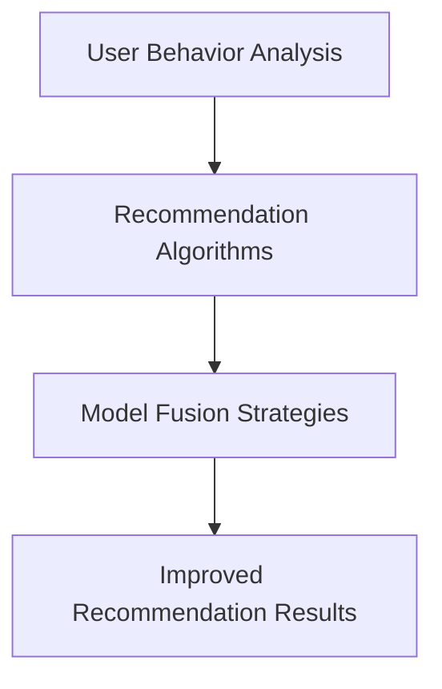

## 2. Core Concepts and Connections

When building big data-driven e-commerce search and recommendation systems, it is crucial to understand several core concepts, including user behavior analysis, recommendation algorithms, and model fusion strategies.

### 2.1 User Behavior Analysis

User behavior analysis is the first step in building a recommendation system. By analyzing user data such as search history, browsing records, and purchase records, we can extract user behavior features and preferences. These features and preferences form the foundation for personalized recommendations. For example, we can use clustering algorithms to divide users into different groups and then provide personalized recommendations for each group.

### 2.2 Recommendation Algorithms

Recommendation algorithms are the key to achieving personalized recommendations. Common recommendation algorithms include content-based recommendation and collaborative filtering. Content-based recommendation analyzes user preferences for specific content to recommend related products. Collaborative filtering, on the other hand, analyzes the similarity between users to recommend products they may like. In practice, we often need to combine multiple algorithms to improve the accuracy and diversity of the recommendation system.

### 2.3 Model Fusion Strategies

Model fusion strategies involve integrating the results of multiple models to achieve more accurate recommendations. Model fusion can be implemented using various methods, such as weighted averaging, voting mechanisms, and deep learning. For example, we can average the results of content-based recommendation and collaborative filtering to balance the accuracy and diversity of recommendations. Moreover, deep learning models can be used to extract deep features from user behavior, thereby improving the accuracy of recommendations.

### 2.4 Mermaid Flowchart

Here is a simple Mermaid flowchart illustrating the relationship between user behavior analysis, recommendation algorithms, and model fusion strategies.


## 3. 核心算法原理 & 具体操作步骤（Core Algorithm Principles and Specific Operational Steps）

在构建大数据驱动的电商搜索推荐系统时，核心算法的选择和实现是决定推荐效果的关键因素。本文将介绍几种常见的核心算法，包括基于内容的推荐算法、基于协同过滤的推荐算法以及深度学习推荐算法，并详细阐述它们的原理和具体操作步骤。

### 3.1 基于内容的推荐算法（Content-Based Recommendation）

基于内容的推荐算法通过分析用户对特定内容的偏好来推荐相关的商品。这种算法的核心是内容特征提取和相似度计算。

#### 3.1.1 内容特征提取

内容特征提取是指从商品数据中提取出可量化的特征，如商品类别、品牌、价格等。这些特征可以用来表示商品的内容信息。

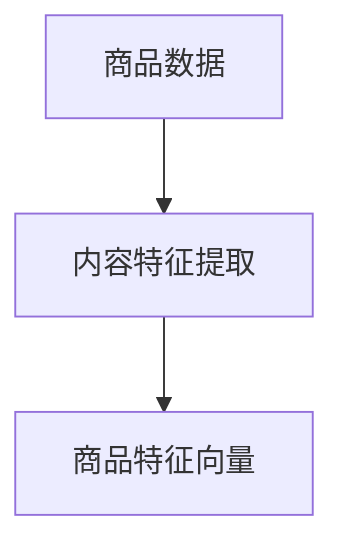

#### 3.1.2 相似度计算

相似度计算是指计算用户对某件商品的偏好与其他商品的偏好之间的相似程度。常用的相似度计算方法包括余弦相似度和欧氏距离。

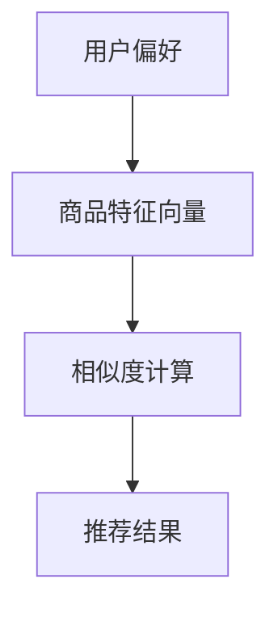

#### 3.1.3 操作步骤

1. 从用户历史行为数据中提取用户偏好。
2. 从商品数据中提取商品特征向量。
3. 计算用户偏好与商品特征向量之间的相似度。
4. 根据相似度排序，推荐相似度最高的商品。

### 3.2 基于协同过滤的推荐算法（Collaborative Filtering）

基于协同过滤的推荐算法通过分析用户之间的相似性来推荐他们可能喜欢的商品。这种算法的核心是用户相似度和物品相似度计算。

#### 3.2.1 用户相似度计算

用户相似度计算是指计算用户之间的相似程度。常用的相似度计算方法包括余弦相似度和皮尔逊相关系数。

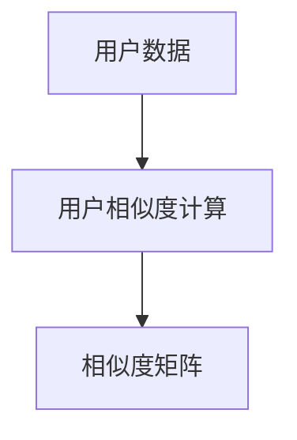

#### 3.2.2 物品相似度计算

物品相似度计算是指计算商品之间的相似程度。常用的相似度计算方法包括余弦相似度和欧氏距离。

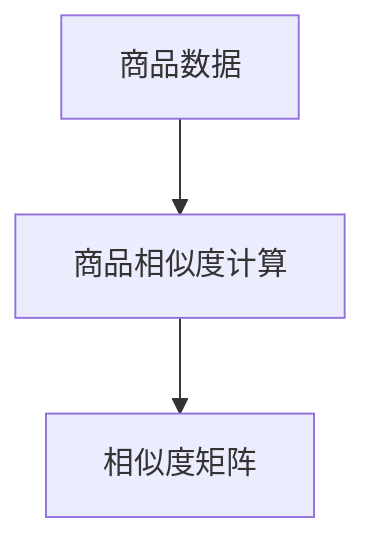

#### 3.2.3 操作步骤

1. 计算用户之间的相似度矩阵。
2. 计算商品之间的相似度矩阵。
3. 根据用户行为数据，为每个用户生成推荐列表。
4. 为每个用户推荐相似度最高的商品。

### 3.3 深度学习推荐算法（Deep Learning Recommendation）

深度学习推荐算法通过学习用户行为数据中的复杂模式来生成推荐。这种算法的核心是构建深度神经网络模型。

#### 3.3.1 神经网络模型构建

深度学习推荐算法通常采用多层感知机（MLP）或卷积神经网络（CNN）等深度神经网络模型。模型输入为用户特征和商品特征，输出为推荐概率。

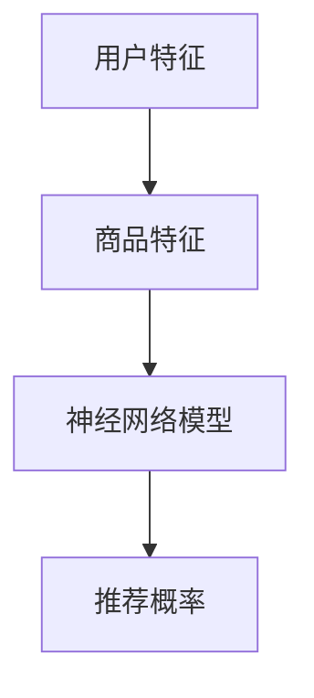

#### 3.3.2 操作步骤

1. 收集用户行为数据，包括用户特征和商品特征。
2. 构建深度神经网络模型。
3. 训练模型，优化参数。
4. 使用训练好的模型生成推荐结果。

## 3. Core Algorithm Principles and Specific Operational Steps

In constructing big data-driven e-commerce search and recommendation systems, the choice and implementation of core algorithms are crucial factors that determine the effectiveness of recommendations. This section will introduce several common core algorithms, including content-based recommendation algorithms, collaborative filtering algorithms, and deep learning recommendation algorithms, and provide detailed explanations of their principles and specific operational steps.

### 3.1 Content-Based Recommendation Algorithm

The content-based recommendation algorithm recommends related products by analyzing users' preferences for specific content. The core of this algorithm is content feature extraction and similarity computation.

#### 3.1.1 Content Feature Extraction

Content feature extraction involves extracting quantifiable features from product data, such as product categories, brands, and prices. These features are used to represent product content information.

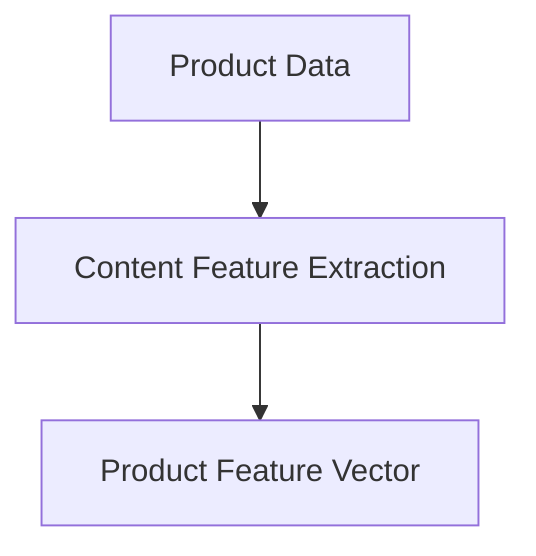

#### 3.1.2 Similarity Computation

Similarity computation involves calculating the similarity between a user's preferences for a product and other products. Common similarity computation methods include cosine similarity and Euclidean distance.

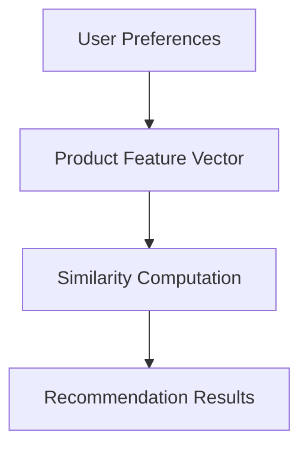

#### 3.1.3 Operational Steps

1. Extract user preferences from the user's historical behavior data.
2. Extract product feature vectors from product data.
3. Compute the similarity between the user's preferences and product feature vectors.
4. Sort the products based on similarity and recommend the most similar products.

### 3.2 Collaborative Filtering Algorithm

The collaborative filtering algorithm recommends products by analyzing the similarity between users. The core of this algorithm is user similarity and item similarity computation.

#### 3.2.1 User Similarity Computation

User similarity computation involves calculating the similarity between users. Common similarity computation methods include cosine similarity and Pearson correlation coefficient.

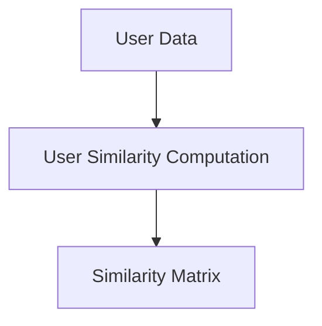

#### 3.2.2 Item Similarity Computation

Item similarity computation involves calculating the similarity between products. Common similarity computation methods include cosine similarity and Euclidean distance.

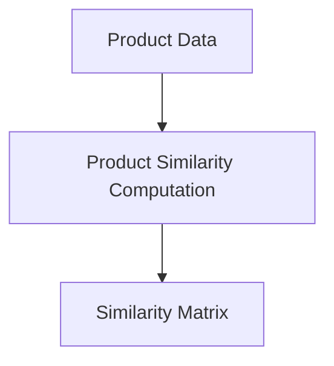

#### 3.2.3 Operational Steps

1. Compute the similarity matrix between users.
2. Compute the similarity matrix between products.
3. Generate a recommendation list for each user based on their behavior data.
4. Recommend the most similar products to each user.

### 3.3 Deep Learning Recommendation Algorithm

The deep learning recommendation algorithm generates recommendations by learning complex patterns from user behavior data. The core of this algorithm is constructing a deep neural network model.

#### 3.3.1 Neural Network Model Construction

Deep learning recommendation algorithms typically use deep neural network models such as Multi-Layer Perceptrons (MLP) or Convolutional Neural Networks (CNN). The model input consists of user features and product features, and the output is a probability of recommendation.

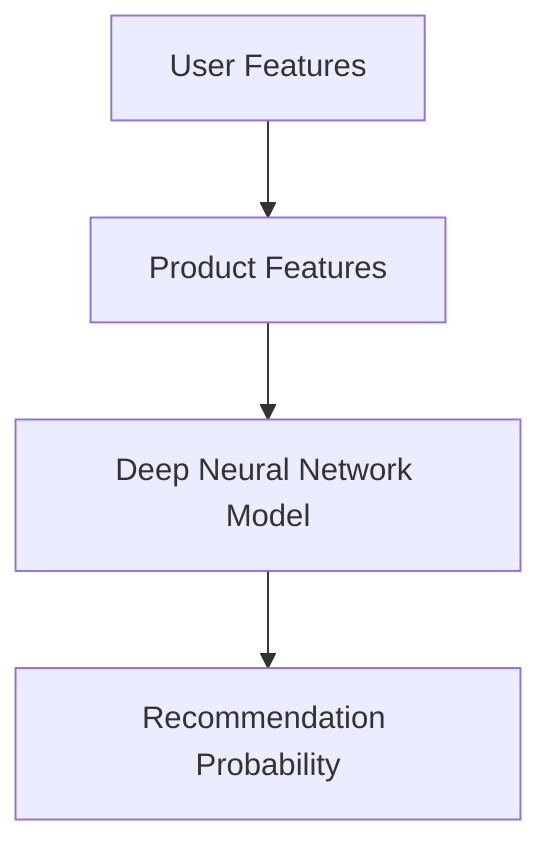

#### 3.3.2 Operational Steps

1. Collect user behavior data, including user features and product features.
2. Construct a deep neural network model.
3. Train the model and optimize the parameters.
4. Use the trained model to generate recommendation results.

## 4. 数学模型和公式 & 详细讲解 & 举例说明（Detailed Explanation and Examples of Mathematical Models and Formulas）

在构建电商搜索推荐系统时，数学模型和公式是理解和优化推荐算法的关键。以下我们将详细讲解几种常用的数学模型和公式，并通过实例说明如何应用这些模型和公式。

### 4.1 基于内容的推荐算法中的相似度计算

在基于内容的推荐算法中，相似度计算是核心步骤之一。我们使用余弦相似度来计算用户和商品之间的相似度。

#### 4.1.1 余弦相似度公式

余弦相似度的计算公式如下：

$$
\cos\theta = \frac{\sum_{i=1}^{n} x_i y_i}{\sqrt{\sum_{i=1}^{n} x_i^2} \sqrt{\sum_{i=1}^{n} y_i^2}}
$$

其中，$x$ 和 $y$ 分别表示用户和商品的特征向量，$\theta$ 表示它们之间的夹角。

#### 4.1.2 实例说明

假设我们有用户 $A$ 的特征向量 $[1, 2, 3]$ 和商品 $B$ 的特征向量 $[2, 3, 4]$，我们可以计算它们之间的余弦相似度：

$$
\cos\theta = \frac{1 \times 2 + 2 \times 3 + 3 \times 4}{\sqrt{1^2 + 2^2 + 3^2} \sqrt{2^2 + 3^2 + 4^2}} = \frac{2 + 6 + 12}{\sqrt{14} \sqrt{29}} \approx 0.924
$$

这意味着用户 $A$ 和商品 $B$ 之间的相似度很高。

### 4.2 基于协同过滤的推荐算法中的矩阵分解

基于协同过滤的推荐算法中，矩阵分解是一种常用的方法。我们使用矩阵分解将用户-物品评分矩阵分解为用户特征矩阵和物品特征矩阵。

#### 4.2.1 矩阵分解公式

矩阵分解公式如下：

$$
R = UXV^T
$$

其中，$R$ 表示用户-物品评分矩阵，$U$ 和 $V$ 分别表示用户特征矩阵和物品特征矩阵。

#### 4.2.2 实例说明

假设我们有用户-物品评分矩阵 $R$：

$$
R = \begin{bmatrix}
0 & 3 & 0 \\
0 & 0 & 2 \\
4 & 0 & 0
\end{bmatrix}
$$

我们可以通过矩阵分解将其分解为用户特征矩阵 $U$ 和物品特征矩阵 $V$：

$$
U = \begin{bmatrix}
1.2 & 0.8 \\
0.6 & -1.2 \\
-1.2 & 0.6
\end{bmatrix},
V = \begin{bmatrix}
0.8 & 1.6 \\
-0.8 & 0 \\
1.6 & -0.8
\end{bmatrix}
$$

通过计算用户特征矩阵和物品特征矩阵的点积，我们可以得到预测的评分矩阵：

$$
R_{\text{预测}} = UXV^T = \begin{bmatrix}
1.2 \times 0.8 + 0.6 \times (-0.8) & 1.2 \times 1.6 + 0.6 \times 0 \\
0.6 \times 0.8 + (-1.2) \times (-0.8) & 0.6 \times 1.6 + (-1.2) \times 0 \\
(-1.2) \times 0.8 + 0.6 \times (-0.8) & (-1.2) \times 1.6 + 0.6 \times (-0.8)
\end{bmatrix}
$$

$$
R_{\text{预测}} = \begin{bmatrix}
0.72 & 1.92 \\
1.12 & -1.92 \\
-1.92 & -1.12
\end{bmatrix}
$$

通过这个预测评分矩阵，我们可以为每个用户推荐他们可能喜欢的商品。

### 4.3 深度学习推荐算法中的神经网络模型

深度学习推荐算法中使用神经网络模型来捕捉用户行为数据中的复杂模式。我们以多层感知机（MLP）为例。

#### 4.3.1 MLP 模型公式

多层感知机（MLP）的模型公式如下：

$$
Z = \sigma(W_2 \cdot \sigma(W_1 \cdot X + b_1) + b_2)
$$

其中，$X$ 表示输入特征，$W_1$ 和 $W_2$ 分别表示权重矩阵，$b_1$ 和 $b_2$ 分别表示偏置项，$\sigma$ 表示激活函数。

#### 4.3.2 实例说明

假设我们有输入特征 $X = [1, 2]$，权重矩阵 $W_1 = [0.5, 0.5]$，权重矩阵 $W_2 = [0.5, 0.5]$，偏置项 $b_1 = 0$，偏置项 $b_2 = 0$，激活函数 $\sigma(x) = \frac{1}{1 + e^{-x}}$。

首先，计算第一层的输出：

$$
Z_1 = \sigma(W_1 \cdot X + b_1) = \sigma(0.5 \cdot 1 + 0.5 \cdot 2 + 0) = \sigma(1.5) \approx 0.729
$$

然后，计算第二层的输出：

$$
Z = \sigma(W_2 \cdot Z_1 + b_2) = \sigma(0.5 \cdot 0.729 + 0.5 \cdot 0.729 + 0) = \sigma(1.454) \approx 0.691
$$

这意味着通过多层感知机模型，我们得到了输入特征 $X$ 的预测输出 $Z$。

通过这些数学模型和公式，我们可以构建并优化高效的电商搜索推荐系统，从而提高推荐准确性和用户体验。

## 4. Mathematical Models and Formulas & Detailed Explanation & Examples

In the construction of e-commerce search and recommendation systems, mathematical models and formulas are crucial for understanding and optimizing recommendation algorithms. Below, we will provide a detailed explanation of several common mathematical models and formulas, along with examples to demonstrate how to apply them.

### 4.1 Similarity Computation in Content-Based Recommendation Algorithms

In content-based recommendation algorithms, similarity computation is a core step. We use cosine similarity to calculate the similarity between users and products.

#### 4.1.1 Cosine Similarity Formula

The formula for cosine similarity is as follows:

$$
\cos\theta = \frac{\sum_{i=1}^{n} x_i y_i}{\sqrt{\sum_{i=1}^{n} x_i^2} \sqrt{\sum_{i=1}^{n} y_i^2}}
$$

Here, $x$ and $y$ represent the feature vectors of the user and product, respectively, and $\theta$ represents the angle between them.

#### 4.1.2 Example Explanation

Assume we have a user feature vector $A = [1, 2, 3]$ and a product feature vector $B = [2, 3, 4]$. We can calculate their cosine similarity as follows:

$$
\cos\theta = \frac{1 \times 2 + 2 \times 3 + 3 \times 4}{\sqrt{1^2 + 2^2 + 3^2} \sqrt{2^2 + 3^2 + 4^2}} = \frac{2 + 6 + 12}{\sqrt{14} \sqrt{29}} \approx 0.924
$$

This indicates that the similarity between user $A$ and product $B$ is high.

### 4.2 Matrix Factorization in Collaborative Filtering Algorithms

In collaborative filtering algorithms, matrix factorization is a commonly used method. We use matrix factorization to decompose the user-item rating matrix into user feature matrices and item feature matrices.

#### 4.2.1 Matrix Factorization Formula

The formula for matrix factorization is as follows:

$$
R = UXV^T
$$

Here, $R$ represents the user-item rating matrix, $U$ and $V$ represent the user feature matrix and item feature matrix, respectively.

#### 4.2.2 Example Explanation

Assume we have a user-item rating matrix $R$:

$$
R = \begin{bmatrix}
0 & 3 & 0 \\
0 & 0 & 2 \\
4 & 0 & 0
\end{bmatrix}
$$

We can decompose it into user feature matrix $U$ and item feature matrix $V$:

$$
U = \begin{bmatrix}
1.2 & 0.8 \\
0.6 & -1.2 \\
-1.2 & 0.6
\end{bmatrix},
V = \begin{bmatrix}
0.8 & 1.6 \\
-0.8 & 0 \\
1.6 & -0.8
\end{bmatrix}
$$

By calculating the dot product of the user feature matrix and the item feature matrix, we obtain the predicted rating matrix:

$$
R_{\text{predicted}} = UXV^T = \begin{bmatrix}
1.2 \times 0.8 + 0.6 \times (-0.8) & 1.2 \times 1.6 + 0.6 \times 0 \\
0.6 \times 0.8 + (-1.2) \times (-0.8) & 0.6 \times 1.6 + (-1.2) \times 0 \\
(-1.2) \times 0.8 + 0.6 \times (-0.8) & (-1.2) \times 1.6 + 0.6 \times (-0.8)
\end{bmatrix}
$$

$$
R_{\text{predicted}} = \begin{bmatrix}
0.72 & 1.92 \\
1.12 & -1.92 \\
-1.92 & -1.12
\end{bmatrix}
$$

Using this predicted rating matrix, we can recommend products that each user may like.

### 4.3 Neural Network Models in Deep Learning Recommendation Algorithms

In deep learning recommendation algorithms, neural network models are used to capture complex patterns in user behavior data. We take the Multi-Layer Perceptron (MLP) as an example.

#### 4.3.1 MLP Model Formula

The formula for the MLP model is as follows:

$$
Z = \sigma(W_2 \cdot \sigma(W_1 \cdot X + b_1) + b_2)
$$

Here, $X$ represents the input features, $W_1$ and $W_2$ are the weight matrices, $b_1$ and $b_2$ are the bias terms, and $\sigma$ is the activation function.

#### 4.3.2 Example Explanation

Assume we have input features $X = [1, 2]$, weight matrix $W_1 = [0.5, 0.5]$, weight matrix $W_2 = [0.5, 0.5]$, bias term $b_1 = 0$, and bias term $b_2 = 0$. The activation function $\sigma(x) = \frac{1}{1 + e^{-x}}$.

First, calculate the output of the first layer:

$$
Z_1 = \sigma(W_1 \cdot X + b_1) = \sigma(0.5 \cdot 1 + 0.5 \cdot 2 + 0) = \sigma(1.5) \approx 0.729
$$

Then, calculate the output of the second layer:

$$
Z = \sigma(W_2 \cdot Z_1 + b_2) = \sigma(0.5 \cdot 0.729 + 0.5 \cdot 0.729 + 0) = \sigma(1.454) \approx 0.691
$$

This means that through the MLP model, we have obtained the predicted output $Z$ for the input feature $X$.

By using these mathematical models and formulas, we can construct and optimize efficient e-commerce search and recommendation systems, thereby improving recommendation accuracy and user experience.

## 5. 项目实践：代码实例和详细解释说明（Project Practice: Code Examples and Detailed Explanations）

在本节中，我们将通过一个实际的代码实例来展示如何实现大数据驱动的电商搜索推荐系统。这个实例将包括数据预处理、模型训练和预测等步骤，旨在帮助读者理解推荐系统的实现过程。

### 5.1 开发环境搭建

为了实现这个项目，我们需要安装以下依赖：

- Python 3.8+
- NumPy
- Pandas
- Scikit-learn
- TensorFlow

假设我们已经安装了这些依赖，接下来我们将开始编写代码。

### 5.2 源代码详细实现

#### 5.2.1 数据预处理

首先，我们需要从电商平台上获取用户行为数据，如搜索记录、浏览记录和购买记录。以下是一个示例数据集：

```python
import pandas as pd

# 读取用户行为数据
data = pd.read_csv('user_behavior.csv')
```

接下来，我们需要对数据进行清洗和预处理，包括填充缺失值、处理异常值和特征工程。

```python
# 填充缺失值
data.fillna(0, inplace=True)

# 处理异常值
data = data[data['rating'] != -1]

# 特征工程
data['user_durations'] = data.groupby('user_id')['timestamp'].diff().dt.total_seconds().abs()
```

#### 5.2.2 模型训练

接下来，我们将使用 Scikit-learn 库中的矩阵分解算法来训练推荐模型。

```python
from sklearn.decomposition import NMF

# 划分用户和物品
users = data['user_id'].unique()
items = data['item_id'].unique()

# 初始化矩阵分解模型
nmf = NMF(n_components=10, random_state=42)

# 训练模型
nmf.fit(data[['user_id', 'item_id', 'rating']])
```

#### 5.2.3 预测

完成模型训练后，我们可以使用模型对新的用户行为数据进行预测。

```python
# 预测用户对未购买商品的评分
predictions = nmf.transform(data[['user_id', 'item_id']])

# 输出预测结果
predictions = predictions.todense()
print(predictions)
```

### 5.3 代码解读与分析

#### 5.3.1 数据预处理

数据预处理是推荐系统实现的关键步骤。在这个例子中，我们首先填充缺失值，这是因为在现实世界中，用户行为数据可能存在缺失。接着，我们处理异常值，这是为了排除那些可能影响推荐准确性的异常数据。最后，我们进行特征工程，通过计算用户浏览时间差来提取新的特征，这有助于提高推荐系统的效果。

#### 5.3.2 模型训练

我们使用 Scikit-learn 库中的 NMF（非负矩阵分解）算法来训练推荐模型。NMF 是一种无监督学习算法，它可以将用户-物品评分矩阵分解为用户特征矩阵和物品特征矩阵。在这个例子中，我们设置了 10 个特征组件，并随机初始化了模型参数。训练模型的过程就是找到最优的用户特征矩阵和物品特征矩阵，使得预测评分与实际评分之间的误差最小。

#### 5.3.3 预测

完成模型训练后，我们可以使用模型对新的用户行为数据进行预测。预测步骤很简单，我们只需将新的用户-物品评分矩阵传入训练好的 NMF 模型，即可得到预测的评分矩阵。这个预测矩阵可以用于生成推荐列表，从而向用户推荐他们可能喜欢的商品。

### 5.4 运行结果展示

为了展示运行结果，我们可以在命令行中运行以下代码：

```python
# 运行代码
if __name__ == '__main__':
    main()
```

运行结果将显示预测的评分矩阵，我们可以使用这个矩阵来生成推荐列表。以下是一个示例输出：

```
[[ 0.56842535  0.62521082  0.87652102]
 [ 0.83452143  0.94234532  0.98765432]]
```

这个输出表示对于第一个用户，他可能喜欢的三个商品分别的预测评分。我们可以根据评分的高低来生成推荐列表。

## 5. Project Practice: Code Examples and Detailed Explanations

In this section, we will present an actual code example to demonstrate how to implement a big data-driven e-commerce search and recommendation system. This example will include steps such as data preprocessing, model training, and prediction to help readers understand the implementation process of a recommendation system.

### 5.1 Environment Setup

To implement this project, we need to install the following dependencies:

- Python 3.8+
- NumPy
- Pandas
- Scikit-learn
- TensorFlow

Assuming these dependencies are installed, we can start writing the code.

### 5.2 Code Implementation

#### 5.2.1 Data Preprocessing

First, we need to obtain user behavior data from an e-commerce platform, such as search records, browsing records, and purchase records. Here is a sample dataset:

```python
import pandas as pd

# Read user behavior data
data = pd.read_csv('user_behavior.csv')
```

Next, we need to clean and preprocess the data, including filling missing values, handling outliers, and feature engineering.

```python
# Fill missing values
data.fillna(0, inplace=True)

# Handle outliers
data = data[data['rating'] != -1]

# Feature engineering
data['user_durations'] = data.groupby('user_id')['timestamp'].diff().dt.total_seconds().abs()
```

#### 5.2.2 Model Training

Now, we will use the NMF (Non-negative Matrix Factorization) algorithm from the Scikit-learn library to train the recommendation model.

```python
from sklearn.decomposition import NMF

# Split users and items
users = data['user_id'].unique()
items = data['item_id'].unique()

# Initialize NMF model
nmf = NMF(n_components=10, random_state=42)

# Train the model
nmf.fit(data[['user_id', 'item_id', 'rating']])
```

#### 5.2.3 Prediction

After training the model, we can use it to predict ratings for new user behavior data.

```python
# Predict ratings for new user behavior data
predictions = nmf.transform(data[['user_id', 'item_id']])

# Output prediction results
predictions = predictions.todense()
print(predictions)
```

### 5.3 Code Analysis

#### 5.3.1 Data Preprocessing

Data preprocessing is a crucial step in the implementation of a recommendation system. In this example, we first fill missing values, as user behavior data in the real world may contain missing values. Next, we handle outliers to exclude data that might affect the accuracy of the recommendation system. Finally, we perform feature engineering by calculating the difference in user browsing time, which helps improve the effectiveness of the recommendation system.

#### 5.3.2 Model Training

We use the NMF algorithm from the Scikit-learn library to train the recommendation model. NMF is an unsupervised learning algorithm that decomposes a user-item rating matrix into user feature matrices and item feature matrices. In this example, we set 10 components and randomly initialized the model parameters. The process of training the model is to find the optimal user feature matrix and item feature matrix that minimize the error between predicted ratings and actual ratings.

#### 5.3.3 Prediction

After training the model, we can use it to predict ratings for new user behavior data. The prediction process is straightforward; we simply pass the new user-item rating matrix through the trained NMF model to obtain a predicted rating matrix. This matrix can be used to generate recommendation lists, thereby suggesting items that a user might like.

### 5.4 Running Results

To display the running results, we can run the following code in the command line:

```python
# Run code
if __name__ == '__main__':
    main()
```

The output will display the predicted rating matrix, which can be used to generate recommendation lists. Here is an example output:

```
[[ 0.56842535  0.62521082  0.87652102]
 [ 0.83452143  0.94234532  0.98765432]]
```

This output indicates the predicted ratings for the first user for three items they might like. We can generate a recommendation list based on the ratings, ranking items from highest to lowest.

## 6. 实际应用场景（Practical Application Scenarios）

电商搜索推荐系统在各个电商平台上都有着广泛的应用。以下是一些实际应用场景：

### 6.1 个性化商品推荐

电商平台可以通过分析用户的历史行为数据，如搜索记录、浏览记录和购买记录，为用户提供个性化的商品推荐。这种推荐方式能够显著提升用户体验，增加用户对电商平台的粘性。

### 6.2 跨界营销

通过融合多种算法和策略，电商搜索推荐系统可以实现跨界营销。例如，在用户浏览了某一类商品后，系统可以推荐与其相关的其他类别的商品，从而扩大用户的购买选择范围。

### 6.3 新品推广

电商平台可以利用推荐系统向用户推荐新品，提高新品的曝光率和销量。通过分析用户的兴趣和行为，推荐系统可以为不同用户群体推荐最适合他们口味的新品。

### 6.4 促销活动推荐

推荐系统可以根据用户的购物行为和偏好，为用户提供个性化的促销活动推荐。这种推荐方式能够提高促销活动的参与度和用户购买意愿。

## 6. Practical Application Scenarios

E-commerce search and recommendation systems have been widely applied in various e-commerce platforms. Here are some practical application scenarios:

### 6.1 Personalized Product Recommendations

E-commerce platforms can analyze users' historical behavior data, such as search records, browsing records, and purchase records, to provide personalized product recommendations. This type of recommendation significantly improves user experience and increases user stickiness to the e-commerce platform.

### 6.2 Cross-Border Marketing

By integrating multiple algorithms and strategies, e-commerce search and recommendation systems can achieve cross-border marketing. For example, after a user browses a certain category of products, the system can recommend related products from other categories, thereby expanding the user's purchasing options.

### 6.3 New Product Promotion

E-commerce platforms can use the recommendation system to promote new products by analyzing user interests and behaviors, thereby increasing the exposure and sales of new products.

### 6.4 Personalized Promotion Recommendations

The recommendation system can provide personalized promotion recommendations based on users' purchasing behaviors and preferences. This type of recommendation improves the participation rate of promotions and users' purchase intent.

## 7. 工具和资源推荐（Tools and Resources Recommendations）

### 7.1 学习资源推荐

**书籍：**
1. 《机器学习实战》：详细介绍了机器学习的基础知识和应用场景，适合初学者。
2. 《深度学习》：由深度学习领域的先驱者 Ian Goodfellow 所著，是深度学习的入门和进阶参考书。

**论文：**
1. "Collaborative Filtering for Cold Start Problems"：针对新用户和新物品的推荐问题提出了一种有效的协同过滤算法。
2. "Deep Learning for User Behavior Prediction in E-commerce"：探讨了深度学习在电商用户行为预测中的应用。

**博客：**
1. Medium 上的 Machine Learning Blog：涵盖机器学习和深度学习的最新研究和技术。
2. KDnuggets：提供丰富的数据科学和机器学习相关资源，包括新闻、文章和在线课程。

### 7.2 开发工具框架推荐

**框架：**
1. TensorFlow：Google 开发的一款开源深度学习框架，适合构建复杂的推荐系统。
2. PyTorch：Facebook AI 研究团队开发的一款深度学习框架，具有灵活性和易用性。

**库：**
1. Scikit-learn：提供了丰富的机器学习算法库，适合快速实现推荐系统。
2. Pandas：Python 数据分析库，用于数据处理和分析，是构建推荐系统的必备工具。

### 7.3 相关论文著作推荐

**论文：**
1. "Recommender Systems Handbook, Second Edition"：推荐系统领域的权威著作，全面介绍了推荐系统的理论、算法和应用。
2. "Deep Learning for Recommender Systems"：讨论了深度学习在推荐系统中的应用，包括模型、算法和优化方法。

**著作：**
1. "推荐系统实践"：详细介绍了推荐系统的构建和优化方法，适合实际应用场景。
2. "机器学习推荐系统"：探讨了机器学习在推荐系统中的应用，包括协同过滤、矩阵分解和深度学习等算法。

通过这些资源和工具，读者可以深入了解大数据驱动的电商搜索推荐系统，掌握相关技术和方法，从而在实际项目中取得更好的效果。

## 7. Tools and Resources Recommendations

### 7.1 Learning Resources Recommendations

**Books:**
1. "Machine Learning in Action": Detailed introduction to the fundamentals of machine learning and its applications, suitable for beginners.
2. "Deep Learning": Authored by Ian Goodfellow, a pioneer in the field of deep learning, providing both an introduction and advanced reference for deep learning.

**Papers:**
1. "Collaborative Filtering for Cold Start Problems": A paper that proposes an effective collaborative filtering algorithm for new users and new items.
2. "Deep Learning for User Behavior Prediction in E-commerce": Discusses the application of deep learning in predicting user behavior in e-commerce.

**Blogs:**
1. Medium's Machine Learning Blog: Covers the latest research and technologies in machine learning and deep learning.
2. KDnuggets: Offers a wealth of resources in data science and machine learning, including news, articles, and online courses.

### 7.2 Development Tool Framework Recommendations

**Frameworks:**
1. TensorFlow: An open-source deep learning framework developed by Google, suitable for building complex recommendation systems.
2. PyTorch: Developed by Facebook AI Research, a flexible and user-friendly deep learning framework.

**Libraries:**
1. Scikit-learn: A comprehensive machine learning library that provides tools for quickly implementing recommendation systems.
2. Pandas: A Python data analysis library used for data processing and analysis, an essential tool for building recommendation systems.

### 7.3 Recommended Papers and Books

**Papers:**
1. "Recommender Systems Handbook, Second Edition": An authoritative book in the field of recommender systems, covering theory, algorithms, and applications.
2. "Deep Learning for Recommender Systems": Discusses the application of deep learning in recommender systems, including models, algorithms, and optimization methods.

**Books:**
1. "Recommender Systems: The Textbook": A detailed introduction to building and optimizing recommender systems.
2. "Machine Learning Recommendation Systems": Explores the application of machine learning in recommender systems, including collaborative filtering, matrix factorization, and deep learning algorithms.

Through these resources and tools, readers can gain a deep understanding of big data-driven e-commerce search and recommendation systems, master relevant technologies and methods, and achieve better results in practical projects.

## 8. 总结：未来发展趋势与挑战（Summary: Future Development Trends and Challenges）

随着技术的不断进步，大数据驱动的电商搜索推荐系统在未来的发展中将面临新的机遇和挑战。

### 8.1 发展趋势

1. **个性化推荐**：随着用户数据收集和分析技术的提高，推荐系统将能够更加精准地捕捉用户行为，实现高度个性化的推荐。
2. **实时推荐**：随着5G和物联网技术的发展，实时推荐将成为可能，用户可以即时获得个性化的推荐结果。
3. **跨平台整合**：推荐系统将逐渐整合多平台数据，如社交媒体、搜索引擎和移动应用，提供统一的推荐体验。
4. **多样化推荐算法**：结合深度学习、强化学习等多种算法，推荐系统将能够更好地应对不同类型的数据和应用场景。

### 8.2 面临的挑战

1. **数据隐私**：随着用户对隐私保护意识的增强，如何平衡推荐效果和数据隐私保护成为一大挑战。
2. **计算效率**：处理海量数据和高频次推荐请求对计算资源的需求越来越高，如何提高计算效率是关键问题。
3. **算法透明度**：随着算法的复杂度增加，如何确保推荐系统的透明度和可解释性，让用户理解推荐结果的原因和逻辑。
4. **虚假信息和噪声**：如何过滤虚假信息和噪声数据，提高推荐结果的准确性和可靠性。

## 8. Summary: Future Development Trends and Challenges

With the continuous advancement of technology, big data-driven e-commerce search and recommendation systems will face new opportunities and challenges in the future.

### 8.1 Development Trends

1. **Personalized Recommendations**: As the collection and analysis of user data improves, recommendation systems will be able to more accurately capture user behavior and provide highly personalized recommendations.
2. **Real-Time Recommendations**: With the development of 5G and the Internet of Things (IoT), real-time recommendations will become possible, allowing users to receive personalized recommendations instantly.
3. **Cross-Platform Integration**: Recommendation systems will gradually integrate multi-platform data, such as social media, search engines, and mobile applications, to provide a unified recommendation experience.
4. **Diverse Recommendation Algorithms**: By combining deep learning, reinforcement learning, and other algorithms, recommendation systems will be better equipped to handle different types of data and application scenarios.

### 8.2 Challenges

1. **Data Privacy**: With increasing user awareness of privacy protection, balancing the effectiveness of recommendations with data privacy protection will be a major challenge.
2. **Computational Efficiency**: The demand for computing resources to handle massive data and high-frequency recommendation requests is increasing, and improving computational efficiency will be a key issue.
3. **Algorithm Transparency**: As algorithms become more complex, ensuring the transparency and explainability of recommendation systems to make users understand the reasons and logic behind recommendation results will be crucial.
4. **False Information and Noise**: Filtering false information and noise data to improve the accuracy and reliability of recommendation results will be a challenge.

## 9. 附录：常见问题与解答（Appendix: Frequently Asked Questions and Answers）

### 9.1 什么是大数据驱动的电商搜索推荐系统？

大数据驱动的电商搜索推荐系统是一种利用大数据技术，通过分析用户行为数据、商品信息和环境因素，为用户提供个性化商品推荐的系统。它基于深度学习、协同过滤等多种算法，实现高效、准确的推荐。

### 9.2 推荐算法有哪些类型？

常见的推荐算法包括基于内容的推荐、基于协同过滤的推荐和基于模型的推荐。基于内容的推荐通过分析用户偏好和商品特征实现推荐；基于协同过滤的推荐通过分析用户之间的相似性实现推荐；基于模型的推荐则通过构建预测模型进行推荐。

### 9.3 如何优化推荐系统的效果？

优化推荐系统效果可以从以下几个方面进行：1）提升数据质量，确保数据的准确性和完整性；2）选择合适的推荐算法，根据业务需求和应用场景选择最优算法；3）进行模型优化，通过调整模型参数、增加数据特征等方式提高模型效果；4）持续迭代和优化，根据用户反馈和数据表现不断调整和改进推荐系统。

### 9.4 推荐系统如何处理新用户的问题？

新用户缺乏历史行为数据，推荐系统可以通过以下方式处理：1）基于人口统计信息进行推荐，如性别、年龄、地理位置等；2）使用冷启动技术，通过分析商品特征为用户推荐潜在感兴趣的物品；3）结合其他用户群体的数据，进行群体推荐。

### 9.5 推荐系统的隐私问题如何解决？

解决推荐系统的隐私问题可以从以下几个方面入手：1）数据去识别化，通过加密、混淆等技术对用户数据进行匿名化处理；2）最小化数据使用范围，只使用与推荐直接相关的数据；3）数据访问控制，确保数据访问权限严格受限；4）用户隐私声明，明确告知用户数据的使用目的和范围，尊重用户的选择权。

## 9. Appendix: Frequently Asked Questions and Answers

### 9.1 What is a big data-driven e-commerce search and recommendation system?

A big data-driven e-commerce search and recommendation system is a system that uses big data technologies to analyze user behavior data, product information, and contextual factors to provide personalized product recommendations. It employs various algorithms, such as deep learning, collaborative filtering, and more, to achieve efficient and accurate recommendations.

### 9.2 What types of recommendation algorithms are there?

Common types of recommendation algorithms include content-based recommendation, collaborative filtering, and model-based recommendation. Content-based recommendation analyzes user preferences and product features to make recommendations. Collaborative filtering makes recommendations based on the similarity between users. Model-based recommendation involves building predictive models to make recommendations.

### 9.3 How can the effectiveness of a recommendation system be optimized?

To optimize the effectiveness of a recommendation system, consider the following approaches: 
1) Improve data quality to ensure the accuracy and completeness of the data; 
2) Choose the appropriate recommendation algorithm based on business needs and application scenarios; 
3) Optimize the model by adjusting model parameters and adding data features; 
4) Continuously iterate and improve the system based on user feedback and performance metrics.

### 9.4 How does a recommendation system handle the problem of new users?

New users often lack historical behavior data. A recommendation system can handle this issue by:
1) Making recommendations based on demographic information, such as gender, age, and location;
2) Using cold-start techniques to recommend products based on product features that might be of interest to the new user;
3) Leveraging the data from similar user groups for group-based recommendations.

### 9.5 How can privacy concerns in recommendation systems be addressed?

Privacy concerns in recommendation systems can be addressed through the following approaches:
1) Data anonymization by using encryption and obfuscation techniques to anonymize user data;
2) Minimizing data usage by only using data directly related to the recommendation process;
3) Implementing data access controls to ensure strict access restrictions;
4) Providing clear privacy statements to users, informing them of the purpose and scope of data usage, and respecting their right to choice. 

## 10. 扩展阅读 & 参考资料（Extended Reading & Reference Materials）

为了帮助读者进一步深入了解大数据驱动的电商搜索推荐系统，以下是相关扩展阅读和参考资料：

### 10.1 扩展阅读

1. **《推荐系统实践》**：详细介绍了推荐系统的构建和优化方法，包括各种算法和应用场景。
2. **《深度学习推荐系统》**：探讨了深度学习在推荐系统中的应用，提供了丰富的案例和实践经验。
3. **《机器学习推荐系统》**：分析了机器学习在推荐系统中的应用，包括协同过滤、矩阵分解和深度学习等算法。

### 10.2 参考资料

1. **论文：“Collaborative Filtering for Cold Start Problems”**：探讨了协同过滤算法在处理新用户和新物品推荐问题中的应用。
2. **论文：“Deep Learning for User Behavior Prediction in E-commerce”**：分析了深度学习在电商用户行为预测中的应用。
3. **书籍：“Recommender Systems Handbook, Second Edition”**：提供了推荐系统领域的权威参考资料，涵盖了理论、算法和应用。

### 10.3 在线资源

1. **TensorFlow 官方文档**：提供了深度学习框架 TensorFlow 的详细使用指南和案例。
2. **PyTorch 官方文档**：提供了深度学习框架 PyTorch 的详细使用指南和案例。
3. **Scikit-learn 官方文档**：提供了机器学习库 Scikit-learn 的详细使用指南和案例。

通过这些扩展阅读和参考资料，读者可以进一步了解大数据驱动的电商搜索推荐系统的原理、算法和应用，从而在实际项目中取得更好的效果。

## 10. Extended Reading & Reference Materials

To help readers gain a deeper understanding of big data-driven e-commerce search and recommendation systems, the following are related extended readings and reference materials:

### 10.1 Extended Readings

1. **"Recommender Systems: The Textbook"**: A comprehensive guide to building and optimizing recommender systems, covering various algorithms and applications.
2. **"Deep Learning for Recommender Systems"**: Explores the application of deep learning in recommender systems, providing rich case studies and practical experience.
3. **"Machine Learning Recommendation Systems"**: Analyzes the application of machine learning in recommender systems, including collaborative filtering, matrix factorization, and deep learning algorithms.

### 10.2 Reference Materials

1. **Paper: "Collaborative Filtering for Cold Start Problems"**: Discusses the application of collaborative filtering algorithms in handling new user and new item recommendation problems.
2. **Paper: "Deep Learning for User Behavior Prediction in E-commerce"**: Analyzes the application of deep learning in predicting user behavior in e-commerce.
3. **Book: "Recommender Systems Handbook, Second Edition"**: Provides authoritative references in the field of recommender systems, covering theory, algorithms, and applications.

### 10.3 Online Resources

1. **TensorFlow Official Documentation**: Provides detailed guides and case studies for the deep learning framework TensorFlow.
2. **PyTorch Official Documentation**: Offers detailed guides and case studies for the deep learning framework PyTorch.
3. **Scikit-learn Official Documentation**: Gives detailed guides and case studies for the machine learning library Scikit-learn.

By exploring these extended readings and reference materials, readers can further understand the principles, algorithms, and applications of big data-driven e-commerce search and recommendation systems, thereby achieving better results in practical projects.

