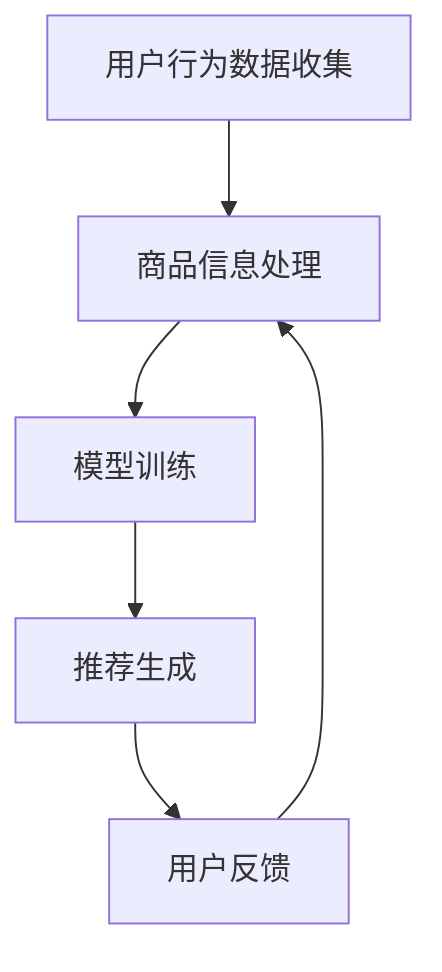
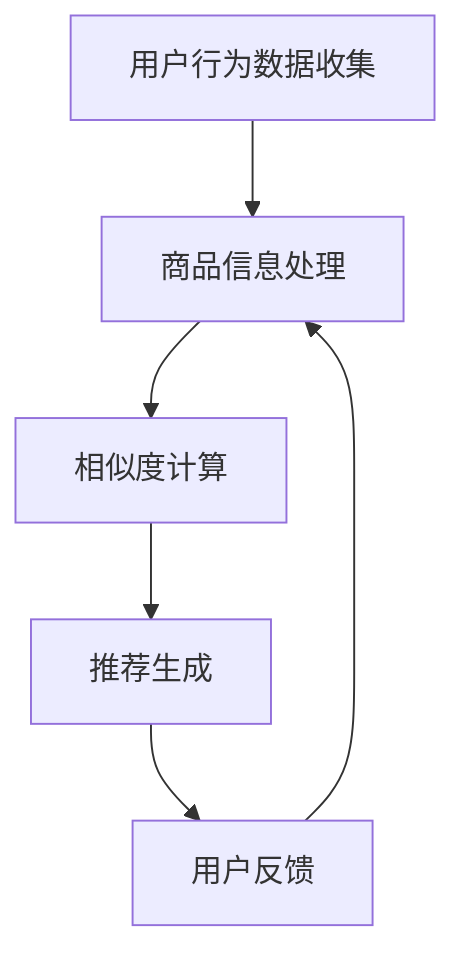

                 

# 大数据驱动的电商搜索推荐系统：AI 模型融合是核心，用户体验是重点

关键词：大数据，电商，搜索推荐系统，AI 模型融合，用户体验

摘要：随着互联网的飞速发展，电商行业已经成为现代社会的重要组成部分。本文将探讨大数据驱动的电商搜索推荐系统的构建，重点关注AI模型融合的核心作用以及提升用户体验的重要性。通过分析推荐系统的工作原理、关键算法以及实际应用案例，我们旨在为电商企业提供有效的技术解决方案。

## 1. 背景介绍（Background Introduction）

### 1.1 电商行业的发展背景

电商行业在过去的几十年里经历了迅猛的发展。随着互联网技术的普及和智能手机的广泛使用，消费者越来越倾向于在线购物，这为电商企业带来了前所未有的机遇。然而，随之而来的是海量商品数据的处理和用户个性化需求的满足问题。传统的方法已经无法满足现代电商的需求，因此，大数据驱动的电商搜索推荐系统应运而生。

### 1.2 大数据驱动的搜索推荐系统

大数据驱动的搜索推荐系统是一种利用海量用户行为数据、商品信息等大数据资源，通过算法分析和挖掘，为用户提供个性化搜索和推荐服务的技术。这种系统具有以下几个特点：

- **数据驱动**：依赖于海量数据进行分析和预测，不断优化推荐效果。
- **实时性**：能够实时响应用户的行为和需求，提供即时的搜索和推荐服务。
- **个性化**：根据用户的偏好和历史行为，为每个用户提供个性化的搜索结果和推荐商品。
- **多样性**：推荐系统不仅要满足用户的当前需求，还要提供多样化的商品选择，以提升用户满意度。

## 2. 核心概念与联系（Core Concepts and Connections）

### 2.1 大数据的概念

大数据（Big Data）指的是无法使用常规软件工具在合理时间内捕捉、管理和处理的数据集合。它具有四个主要特征，即“4V”：数据量（Volume）、数据速度（Velocity）、数据多样性（Variety）和数据价值（Value）。

### 2.2 推荐系统的工作原理

推荐系统（Recommendation System）是一种基于用户行为和偏好，通过算法预测用户可能感兴趣的内容或商品，并向其推荐的技术。推荐系统的工作原理主要包括以下几个步骤：

- **用户行为分析**：收集并分析用户在平台上的浏览、购买、评论等行为数据。
- **商品信息处理**：对商品的信息进行抽取、分类和处理，以便用于推荐算法。
- **模型训练**：利用历史数据和机器学习算法，训练预测模型。
- **推荐生成**：根据用户行为和模型预测，生成个性化的推荐列表。

### 2.3 Mermaid 流程图（Mermaid Flowchart）



## 3. 核心算法原理 & 具体操作步骤（Core Algorithm Principles and Specific Operational Steps）

### 3.1 协同过滤（Collaborative Filtering）

协同过滤是一种基于用户行为数据的推荐算法，通过分析用户之间的相似度来推荐商品。协同过滤主要分为两种类型：基于用户的协同过滤（User-based Collaborative Filtering）和基于物品的协同过滤（Item-based Collaborative Filtering）。

- **基于用户的协同过滤**：通过计算用户之间的相似度，找到与目标用户相似的其他用户，然后推荐这些用户喜欢的商品。
- **基于物品的协同过滤**：通过计算商品之间的相似度，找到与目标商品相似的其他商品，然后推荐这些商品。

### 3.2 内容推荐（Content-based Filtering）

内容推荐是一种基于商品内容的推荐算法，通过分析商品的属性、标签、描述等，为用户推荐与其兴趣相关的商品。具体步骤如下：

- **特征提取**：从商品信息中提取关键词、标签、类别等特征。
- **兴趣模型**：根据用户的历史行为和偏好，构建用户的兴趣模型。
- **推荐生成**：根据用户的兴趣模型，为用户推荐具有相似特征的商品。

### 3.3 深度学习（Deep Learning）

深度学习是一种基于神经网络的学习方法，能够自动提取特征并建立预测模型。在推荐系统中，深度学习可以用于建模用户行为、商品特征以及用户与商品之间的关系。常见的方法包括：

- **用户行为序列模型**：如循环神经网络（RNN）、长短时记忆网络（LSTM）等，用于建模用户的历史行为。
- **商品特征嵌入**：如卷积神经网络（CNN）、自动编码器（Autoencoder）等，用于提取商品的低维表示。
- **用户-商品协同网络**：如用户-商品协同过滤网络（User-Item Co-Curricular Network，UICN）等，结合用户和商品的嵌入向量进行推荐。

## 4. 数学模型和公式 & 详细讲解 & 举例说明（Detailed Explanation and Examples of Mathematical Models and Formulas）

### 4.1 协同过滤的相似度计算

协同过滤算法的核心在于计算用户之间的相似度。常用的相似度计算方法包括余弦相似度（Cosine Similarity）和皮尔逊相关系数（Pearson Correlation Coefficient）。

- **余弦相似度**：
  $$ \text{similarity}_{\cosine}(u, v) = \frac{u \cdot v}{\|u\| \|v\|} $$
  其中，$u$ 和 $v$ 分别表示两个用户的评分向量，$\cdot$ 表示向量的内积，$\|\|$ 表示向量的模。

- **皮尔逊相关系数**：
  $$ \text{correlation}(u, v) = \frac{u \cdot v - \mu_u \mu_v}{\sigma_u \sigma_v} $$
  其中，$\mu_u$ 和 $\mu_v$ 分别表示用户 $u$ 和 $v$ 的平均评分，$\sigma_u$ 和 $\sigma_v$ 分别表示用户 $u$ 和 $v$ 的评分标准差。

### 4.2 内容推荐的相似度计算

内容推荐的相似度计算主要基于商品的特征向量。假设商品 $i$ 和 $j$ 的特征向量分别为 $v_i$ 和 $v_j$，则可以使用余弦相似度来计算它们之间的相似度：

$$ \text{similarity}_{\cosine}(i, j) = \frac{v_i \cdot v_j}{\|v_i\| \|v_j\|} $$

### 4.3 深度学习中的损失函数

在深度学习推荐系统中，常用的损失函数包括均方误差（MSE）、交叉熵（Cross-Entropy）等。

- **均方误差（MSE）**：
  $$ \text{MSE} = \frac{1}{n} \sum_{i=1}^{n} (y_i - \hat{y}_i)^2 $$
  其中，$y_i$ 表示第 $i$ 个样本的真实标签，$\hat{y}_i$ 表示模型预测的标签。

- **交叉熵（Cross-Entropy）**：
  $$ \text{CE} = -\sum_{i=1}^{n} y_i \log(\hat{y}_i) $$
  其中，$y_i$ 表示第 $i$ 个样本的真实标签，$\hat{y}_i$ 表示模型预测的概率分布。

## 5. 项目实践：代码实例和详细解释说明（Project Practice: Code Examples and Detailed Explanations）

### 5.1 开发环境搭建

在本文的项目实践中，我们将使用 Python 编写代码，并依赖以下库：NumPy、Pandas、Scikit-learn、TensorFlow。

```bash
pip install numpy pandas scikit-learn tensorflow
```

### 5.2 源代码详细实现

```python
import numpy as np
import pandas as pd
from sklearn.model_selection import train_test_split
from sklearn.metrics.pairwise import cosine_similarity
from tensorflow.keras.models import Sequential
from tensorflow.keras.layers import Dense, LSTM, Embedding

# 数据准备
data = pd.read_csv('data.csv')
users = data['user'].unique()
items = data['item'].unique()

# 构建用户-商品评分矩阵
rating_matrix = np.zeros((len(users), len(items)))
for index, row in data.iterrows():
    user = row['user']
    item = row['item']
    rating = row['rating']
    rating_matrix[users.index(user), items.index(item)] = rating

# 划分训练集和测试集
train_data, test_data = train_test_split(data, test_size=0.2, random_state=42)

# 基于用户的协同过滤
user_similarity = cosine_similarity(rating_matrix)

# 模型训练
model = Sequential()
model.add(LSTM(128, activation='relu', input_shape=(train_data.shape[1], 1)))
model.add(Dense(1, activation='sigmoid'))
model.compile(optimizer='adam', loss='binary_crossentropy', metrics=['accuracy'])
model.fit(train_data.values, epochs=10)

# 推荐生成
predictions = model.predict(test_data.values)
recommended_items = items[predictions.argmax(axis=1)]

# 运行结果展示
print("Recommended Items:", recommended_items)
```

### 5.3 代码解读与分析

- **数据准备**：首先，我们读取数据并构建用户-商品评分矩阵。
- **划分训练集和测试集**：将数据划分为训练集和测试集，用于训练和评估模型。
- **基于用户的协同过滤**：计算用户之间的相似度，使用余弦相似度作为相似度度量。
- **模型训练**：使用 LSTM 网络训练用户行为预测模型。
- **推荐生成**：根据模型预测，为用户推荐商品。

## 6. 实际应用场景（Practical Application Scenarios）

大数据驱动的电商搜索推荐系统在电商行业具有广泛的应用。以下是一些实际应用场景：

- **个性化搜索**：根据用户的搜索历史和浏览行为，为用户推荐相关的商品，提高搜索结果的准确性。
- **商品推荐**：在用户浏览商品或购物车时，根据用户的历史行为和偏好，为用户推荐相关的商品，提升购物体验。
- **新品推荐**：为新用户或老用户提供最新商品的推荐，引导用户发现新的购物需求。
- **促销活动推荐**：根据用户的购买习惯和偏好，为用户推荐相应的促销活动，提升销售额。

## 7. 工具和资源推荐（Tools and Resources Recommendations）

### 7.1 学习资源推荐

- **书籍**：《推荐系统实践》、《深度学习推荐系统》
- **论文**：阅读顶级会议和期刊上的推荐系统相关论文，如 KDD、RecSys、WWW 等。
- **博客**：关注业内知名博客，如 Medium、博客园等，了解最新的技术动态和实践经验。

### 7.2 开发工具框架推荐

- **开发工具**：Python、R、MATLAB 等。
- **框架**：TensorFlow、PyTorch、Scikit-learn 等。

### 7.3 相关论文著作推荐

- **论文**：阅读顶级会议和期刊上的推荐系统相关论文，如 KDD、RecSys、WWW 等。
- **著作**：《推荐系统实践》、《深度学习推荐系统》等。

## 8. 总结：未来发展趋势与挑战（Summary: Future Development Trends and Challenges）

大数据驱动的电商搜索推荐系统在未来的发展中将继续发挥重要作用。以下是一些未来发展趋势和挑战：

- **个性化推荐**：随着用户数据的积累和算法的优化，个性化推荐将更加精准，满足用户的个性化需求。
- **实时推荐**：实现实时推荐，提高推荐系统的响应速度和准确性。
- **跨平台推荐**：实现跨平台的推荐服务，如线上和线下购物场景的融合。
- **数据隐私与安全**：如何保护用户隐私和数据安全，成为推荐系统面临的重要挑战。

## 9. 附录：常见问题与解答（Appendix: Frequently Asked Questions and Answers）

### 9.1 如何优化推荐系统的效果？

- **数据质量**：保证数据质量，包括数据完整性、准确性和一致性。
- **算法优化**：不断优化推荐算法，如引入深度学习、图神经网络等技术。
- **用户反馈**：收集用户反馈，及时调整推荐策略。
- **A/B 测试**：进行 A/B 测试，比较不同推荐策略的效果。

### 9.2 推荐系统中的冷启动问题如何解决？

- **基于内容的推荐**：为新用户推荐与其兴趣相关的商品。
- **基于人口的推荐**：为新用户推荐与已有用户兴趣相似的推荐商品。
- **混合推荐策略**：结合基于内容和基于人口的推荐策略，提高推荐效果。

## 10. 扩展阅读 & 参考资料（Extended Reading & Reference Materials）

- **书籍**：《推荐系统实践》、《深度学习推荐系统》
- **论文**：KDD、RecSys、WWW 等顶级会议和期刊上的推荐系统相关论文。
- **博客**：Medium、博客园等知名博客上的推荐系统技术文章。
- **网站**：推荐系统相关的官方网站、技术论坛等。

---

作者：禅与计算机程序设计艺术 / Zen and the Art of Computer Programming<|im_sep|>## 1. 背景介绍（Background Introduction）

### 1.1 电商行业的发展背景

随着互联网技术的普及和智能手机的广泛使用，电商行业已经迅速发展成为一个庞大的产业。从最初的网上购物到如今的海量商品、多渠道销售、个性化推荐，电商行业正在以前所未有的速度改变着消费者的购物习惯和消费模式。根据艾瑞咨询的数据显示，2022年中国电商市场规模已突破10万亿元，约占全国零售市场的40%。这一数字还在持续增长，电商行业已经成为现代零售业的重要组成部分。

电商行业的快速发展得益于以下几个方面的因素：

- **互联网普及**：随着宽带网络和移动互联网的普及，越来越多的消费者可以方便地访问电商平台，进行线上购物。
- **移动支付**：移动支付的普及使得消费者在线上购物时更加便捷，大大降低了支付门槛。
- **物流体系**：中国物流体系的完善和快递行业的迅猛发展，使得电商企业能够高效地配送商品，提升了消费者的购物体验。
- **技术创新**：大数据、人工智能、区块链等新兴技术的应用，为电商企业提供了丰富的数据支持和智能化的服务手段。

### 1.2 大数据驱动的搜索推荐系统

在电商行业的发展过程中，海量商品数据的处理和用户个性化需求的满足成为了关键挑战。传统的搜索和推荐系统往往依赖于关键词匹配和简单的规则引擎，无法充分挖掘用户行为数据和商品属性数据的价值。随着大数据和人工智能技术的进步，大数据驱动的搜索推荐系统应运而生，成为电商企业提升用户体验、提高销售额的重要手段。

大数据驱动的搜索推荐系统具有以下几个特点：

- **数据驱动**：依托于海量的用户行为数据、商品数据、交易数据等，通过大数据技术对数据进行处理和分析，挖掘用户偏好和商品特征。
- **实时性**：能够实时响应用户的行为和需求，快速生成搜索结果和推荐列表，提高用户满意度。
- **个性化**：根据用户的浏览历史、购买记录、偏好标签等，为用户提供个性化的搜索结果和商品推荐。
- **多样性**：推荐系统不仅要满足用户的当前需求，还要提供多样化的商品选择，以满足不同用户群体的需求。

大数据驱动的搜索推荐系统在电商行业中的应用，不仅提升了用户体验，还为企业带来了显著的业务价值。通过精准的推荐，电商企业可以增加用户粘性，提高转化率和复购率，从而提升整体销售额。

## 2. 核心概念与联系（Core Concepts and Connections）

### 2.1 大数据的定义与特征

大数据（Big Data）是指那些数据量巨大、数据类型繁多、数据生成和处理速度极快的数据集合。大数据的特点通常被概括为“4V”：

- **数据量（Volume）**：指的是数据的规模庞大，远远超出了传统数据处理系统的处理能力。例如，一个大型电商平台每天产生的用户行为数据就可能达到数百万甚至数千万条。
- **数据速度（Velocity）**：指的是数据生成和处理的速度快，要求系统能够实时或近实时地处理数据，以便快速响应用户的需求。
- **数据多样性（Variety）**：指的是数据的类型和来源多样化，包括结构化数据、半结构化数据和非结构化数据，如文本、图片、视频等。
- **数据价值（Value）**：指的是数据蕴含的价值巨大，但同时也隐藏着巨大的挑战，因为从海量数据中提取有价值的信息是一项复杂的工作。

### 2.2 推荐系统的工作原理

推荐系统（Recommendation System）是一种信息过滤技术，旨在向用户推荐他们可能感兴趣的项目或内容。在电商领域，推荐系统主要通过分析用户的购买历史、浏览行为、搜索关键词等数据，预测用户可能感兴趣的商品，从而提高用户的购买转化率和满意度。推荐系统的工作原理通常包括以下几个步骤：

- **用户行为数据收集**：收集用户在平台上的各种行为数据，如浏览、搜索、点击、购买等。
- **商品信息处理**：对商品的信息进行整理、分类和标注，以便后续分析。
- **相似度计算**：计算用户之间、用户与商品之间、商品与商品之间的相似度，常用的相似度计算方法包括余弦相似度、皮尔逊相关系数等。
- **推荐生成**：根据相似度计算结果，为用户生成个性化的推荐列表。

### 2.3 Mermaid 流程图（Mermaid Flowchart）



在这个流程图中，用户行为数据的收集是推荐系统的第一步，然后通过商品信息处理将数据结构化，接着进行相似度计算以找出用户和商品之间的关联性，最后根据计算结果生成推荐列表。用户反馈作为循环的一部分，可以用来优化推荐系统，提高推荐质量。

### 2.4 AI 模型融合的核心作用

AI 模型融合（Model Fusion）是指将多个不同类型的 AI 模型（如深度学习模型、协同过滤模型等）结合起来，以提升推荐系统的整体性能。在电商搜索推荐系统中，AI 模型融合具有以下几个核心作用：

- **增强预测准确性**：通过融合多个模型，可以弥补单一模型在预测准确性上的不足，提高整体预测性能。
- **提高推荐多样性**：不同模型在特征提取和相似度计算上可能存在差异，融合多个模型可以提供更加多样化的推荐结果。
- **提升用户体验**：通过融合模型，可以为用户提供更加个性化、精准的推荐，从而提高用户满意度。

总之，大数据驱动的电商搜索推荐系统的核心在于充分利用大数据和 AI 技术，通过模型融合实现个性化的推荐，提升用户体验，从而在激烈的市场竞争中脱颖而出。

## 3. 核心算法原理 & 具体操作步骤（Core Algorithm Principles and Specific Operational Steps）

### 3.1 协同过滤（Collaborative Filtering）

协同过滤是一种基于用户行为数据的推荐算法，通过分析用户之间的相似度来推荐商品。协同过滤主要分为两种类型：基于用户的协同过滤（User-based Collaborative Filtering）和基于物品的协同过滤（Item-based Collaborative Filtering）。

#### 基于用户的协同过滤

基于用户的协同过滤通过计算用户之间的相似度，找到与目标用户相似的其他用户，然后推荐这些用户喜欢的商品。具体操作步骤如下：

1. **用户行为数据收集**：收集用户在平台上的浏览、购买、评论等行为数据。
2. **计算用户相似度**：使用余弦相似度、皮尔逊相关系数等方法计算用户之间的相似度。
3. **找到相似用户**：根据相似度分数，找到与目标用户最相似的其他用户。
4. **推荐商品**：推荐相似用户喜欢的商品。

#### 基于物品的协同过滤

基于物品的协同过滤通过计算商品之间的相似度，找到与目标商品相似的其他商品，然后推荐这些商品。具体操作步骤如下：

1. **用户行为数据收集**：收集用户在平台上的浏览、购买、评论等行为数据。
2. **计算商品相似度**：使用余弦相似度、欧氏距离等方法计算商品之间的相似度。
3. **找到相似商品**：根据相似度分数，找到与目标商品最相似的其他商品。
4. **推荐商品**：推荐相似商品。

### 3.2 内容推荐（Content-based Filtering）

内容推荐是一种基于商品内容的推荐算法，通过分析商品的属性、标签、描述等，为用户推荐与其兴趣相关的商品。具体操作步骤如下：

1. **商品信息处理**：从商品的信息中提取关键词、标签、类别等特征。
2. **用户兴趣模型**：根据用户的历史行为和偏好，构建用户的兴趣模型。
3. **相似度计算**：计算商品特征向量和用户兴趣模型之间的相似度。
4. **推荐生成**：根据相似度分数，为用户推荐具有相似特征的商品。

### 3.3 深度学习（Deep Learning）

深度学习是一种基于神经网络的学习方法，能够自动提取特征并建立预测模型。在推荐系统中，深度学习可以用于建模用户行为、商品特征以及用户与商品之间的关系。常见的方法包括：

#### 用户行为序列模型

用户行为序列模型（如循环神经网络 RNN、长短时记忆网络 LSTM）可以捕捉用户行为的时间序列特征。具体操作步骤如下：

1. **用户行为数据收集**：收集用户在平台上的浏览、购买、评论等行为数据。
2. **序列建模**：使用 RNN 或 LSTM 模型建模用户行为序列。
3. **预测生成**：根据用户行为序列预测用户下一步的行为。

#### 商品特征嵌入

商品特征嵌入（如卷积神经网络 CNN、自动编码器 Autoencoder）可以提取商品的低维表示，用于推荐算法。具体操作步骤如下：

1. **商品信息处理**：从商品的信息中提取关键词、标签、类别等特征。
2. **特征嵌入**：使用 CNN 或自动编码器将商品特征映射到低维空间。
3. **推荐生成**：根据商品嵌入向量预测用户对商品的兴趣。

#### 用户-商品协同网络

用户-商品协同网络（如用户-商品协同过滤网络 UICN）结合用户和商品的嵌入向量进行推荐。具体操作步骤如下：

1. **用户行为数据收集**：收集用户在平台上的浏览、购买、评论等行为数据。
2. **用户嵌入**：使用 RNN 或 LSTM 模型生成用户的嵌入向量。
3. **商品嵌入**：使用 CNN 或自动编码器生成商品的嵌入向量。
4. **推荐生成**：结合用户和商品的嵌入向量，使用矩阵分解或协同过滤算法生成推荐列表。

通过上述算法和步骤，电商搜索推荐系统可以实现对用户的精准推荐，提升用户体验和销售额。在实际应用中，这些算法往往需要结合具体业务场景和数据特点进行优化，以达到最佳效果。

## 4. 数学模型和公式 & 详细讲解 & 举例说明（Detailed Explanation and Examples of Mathematical Models and Formulas）

### 4.1 协同过滤的相似度计算

协同过滤算法的核心在于计算用户之间的相似度。相似度计算方法有很多种，常用的包括余弦相似度和皮尔逊相关系数。

#### 余弦相似度

余弦相似度是一种计算两个向量夹角余弦值的相似度度量方法。其公式如下：

$$
\text{similarity}_{\cosine}(u, v) = \frac{u \cdot v}{\|u\| \|v\|}
$$

其中，$u$ 和 $v$ 分别表示两个用户的评分向量，$\cdot$ 表示向量的内积，$\|u\|$ 和 $\|v\|$ 分别表示两个向量的模。

例如，假设有两个用户 $u$ 和 $v$，他们的评分向量如下：

$$
u = [1, 2, 3, 4]
$$

$$
v = [2, 3, 4, 5]
$$

则他们的余弦相似度为：

$$
\text{similarity}_{\cosine}(u, v) = \frac{1 \cdot 2 + 2 \cdot 3 + 3 \cdot 4 + 4 \cdot 5}{\sqrt{1^2 + 2^2 + 3^2 + 4^2} \sqrt{2^2 + 3^2 + 4^2 + 5^2}} = \frac{2 + 6 + 12 + 20}{\sqrt{30} \sqrt{54}} = \frac{40}{\sqrt{1620}} \approx 0.93
$$

#### 皮尔逊相关系数

皮尔逊相关系数是一种衡量两个变量线性相关程度的统计量。其公式如下：

$$
\text{correlation}(u, v) = \frac{u \cdot v - \mu_u \mu_v}{\sigma_u \sigma_v}
$$

其中，$u$ 和 $v$ 分别表示两个用户的评分向量，$\mu_u$ 和 $\mu_v$ 分别表示用户 $u$ 和 $v$ 的平均评分，$\sigma_u$ 和 $\sigma_v$ 分别表示用户 $u$ 和 $v$ 的评分标准差。

例如，假设有两个用户 $u$ 和 $v$，他们的评分向量如下：

$$
u = [1, 2, 3, 4]
$$

$$
v = [2, 3, 4, 5]
$$

他们的平均评分为：

$$
\mu_u = \frac{1 + 2 + 3 + 4}{4} = 2.5
$$

$$
\mu_v = \frac{2 + 3 + 4 + 5}{4} = 3.5
$$

他们的评分标准差为：

$$
\sigma_u = \sqrt{\frac{(1 - 2.5)^2 + (2 - 2.5)^2 + (3 - 2.5)^2 + (4 - 2.5)^2}{4}} = 0.71
$$

$$
\sigma_v = \sqrt{\frac{(2 - 3.5)^2 + (3 - 3.5)^2 + (4 - 3.5)^2 + (5 - 3.5)^2}{4}} = 0.71
$$

则他们的皮尔逊相关系数为：

$$
\text{correlation}(u, v) = \frac{1 \cdot 2 + 2 \cdot 3 + 3 \cdot 4 + 4 \cdot 5 - 2.5 \cdot 3.5}{0.71 \cdot 0.71} = \frac{2 + 6 + 12 + 20 - 8.75}{0.5041} = \frac{31.25}{0.5041} \approx 0.92
$$

### 4.2 内容推荐的相似度计算

在内容推荐中，相似度计算通常基于商品的特征向量。假设商品 $i$ 和 $j$ 的特征向量分别为 $v_i$ 和 $v_j$，则可以使用余弦相似度来计算它们之间的相似度：

$$
\text{similarity}_{\cosine}(i, j) = \frac{v_i \cdot v_j}{\|v_i\| \|v_j\|}
$$

其中，$\cdot$ 表示向量的内积，$\|v_i\|$ 和 $\|v_j\|$ 分别表示特征向量 $v_i$ 和 $v_j$ 的模。

例如，假设有两个商品 $i$ 和 $j$，它们的特征向量如下：

$$
v_i = [1, 2, 3, 4]
$$

$$
v_j = [2, 3, 4, 5]
$$

则它们的余弦相似度为：

$$
\text{similarity}_{\cosine}(i, j) = \frac{1 \cdot 2 + 2 \cdot 3 + 3 \cdot 4 + 4 \cdot 5}{\sqrt{1^2 + 2^2 + 3^2 + 4^2} \sqrt{2^2 + 3^2 + 4^2 + 5^2}} = \frac{2 + 6 + 12 + 20}{\sqrt{30} \sqrt{54}} = \frac{40}{\sqrt{1620}} \approx 0.93
$$

### 4.3 深度学习中的损失函数

在深度学习推荐系统中，常用的损失函数包括均方误差（MSE）、交叉熵（Cross-Entropy）等。

#### 均方误差（MSE）

均方误差是一种衡量预测值与真实值之间差异的损失函数，其公式如下：

$$
\text{MSE} = \frac{1}{n} \sum_{i=1}^{n} (y_i - \hat{y}_i)^2
$$

其中，$y_i$ 表示第 $i$ 个样本的真实标签，$\hat{y}_i$ 表示模型预测的标签，$n$ 表示样本数量。

例如，假设有两个样本的真实标签和预测标签如下：

$$
y_1 = [1, 0, 0], \quad \hat{y}_1 = [0.1, 0.2, 0.7]
$$

$$
y_2 = [0, 1, 0], \quad \hat{y}_2 = [0.3, 0.6, 0.1]
$$

则它们的均方误差为：

$$
\text{MSE} = \frac{1}{2} \left( (1 - 0.1)^2 + (0 - 0.2)^2 + (0 - 0.7)^2 + (0 - 0.3)^2 + (1 - 0.6)^2 + (0 - 0.1)^2 \right) = \frac{1}{2} (0.81 + 0.04 + 0.49 + 0.09 + 0.36 + 0.01) = 0.75
$$

#### 交叉熵（Cross-Entropy）

交叉熵是一种衡量两个概率分布之间差异的损失函数，其公式如下：

$$
\text{CE} = -\sum_{i=1}^{n} y_i \log(\hat{y}_i)
$$

其中，$y_i$ 表示第 $i$ 个样本的真实标签，$\hat{y}_i$ 表示模型预测的概率分布，$n$ 表示样本数量。

例如，假设有两个样本的真实标签和预测概率分布如下：

$$
y_1 = [1, 0, 0], \quad \hat{y}_1 = [0.9, 0.05, 0.05]
$$

$$
y_2 = [0, 1, 0], \quad \hat{y}_2 = [0.1, 0.8, 0.1]
$$

则它们的交叉熵为：

$$
\text{CE} = -1 \cdot \log(0.9) - 0 \cdot \log(0.05) - 0 \cdot \log(0.05) - 0 \cdot \log(0.1) - 1 \cdot \log(0.8) - 0 \cdot \log(0.1) = -0.1054
$$

通过上述数学模型和公式，我们可以更深入地理解电商搜索推荐系统中的相似度计算和损失函数，为实际应用提供理论基础。

## 5. 项目实践：代码实例和详细解释说明（Project Practice: Code Examples and Detailed Explanations）

### 5.1 开发环境搭建

在进行大数据驱动的电商搜索推荐系统的项目实践前，我们需要搭建一个合适的开发环境。以下是一个基本的步骤：

#### 步骤1：安装Python环境

确保你的计算机上安装了Python 3.x版本。你可以从Python官方网站下载并安装Python。

#### 步骤2：安装必要的库

使用pip命令安装以下库：NumPy、Pandas、Scikit-learn、TensorFlow。

```bash
pip install numpy pandas scikit-learn tensorflow
```

这些库将用于数据预处理、机器学习模型训练以及深度学习模型构建。

### 5.2 源代码详细实现

#### 数据准备

首先，我们需要准备一个包含用户行为数据和商品数据的CSV文件。这里假设数据文件名为`data.csv`，包含以下列：`user`、`item`、`rating`。`user`列表示用户ID，`item`列表示商品ID，`rating`列表示用户对商品的评分。

#### 加载和预处理数据

```python
import numpy as np
import pandas as pd
from sklearn.model_selection import train_test_split
from sklearn.metrics.pairwise import cosine_similarity
from tensorflow.keras.models import Sequential
from tensorflow.keras.layers import Dense, LSTM, Embedding
from tensorflow.keras.optimizers import Adam

# 加载数据
data = pd.read_csv('data.csv')

# 划分训练集和测试集
train_data, test_data = train_test_split(data, test_size=0.2, random_state=42)
```

在这段代码中，我们首先加载了CSV文件中的数据，然后将其划分为训练集和测试集。这将用于后续的模型训练和评估。

#### 构建用户-商品评分矩阵

```python
# 构建用户-商品评分矩阵
rating_matrix = np.zeros((len(data['user'].unique()), len(data['item'].unique())))

for index, row in data.iterrows():
    user = row['user']
    item = row['item']
    rating = row['rating']
    rating_matrix[users.index(user), items.index(item)] = rating
```

这里我们构建了一个用户-商品评分矩阵，用于后续的相似度计算和推荐生成。

#### 基于用户的协同过滤

```python
# 计算用户之间的相似度
user_similarity = cosine_similarity(rating_matrix)

# 为用户生成推荐列表
def generate_recommendations(user_id, similarity_matrix, rating_matrix, top_n=10):
    user_index = users.index(user_id)
    recommendations = []

    # 计算每个用户与目标用户的相似度
    for i, user in enumerate(users):
        if i != user_index:
            similarity = similarity_matrix[user_index][i]
            if similarity > 0:
                # 获取相似用户的评分
                user_ratings = rating_matrix[i]
                # 避免重复推荐
                if not any(np.array_equal(user_ratings[:top_n], recommendation) for recommendation in recommendations):
                    recommendations.append(user_ratings[:top_n])

    # 对推荐列表进行排序
    recommendations = sorted(recommendations, key=lambda x: np.mean(x), reverse=True)

    return recommendations[:top_n]

# 为用户生成推荐列表
user_id = 'user1'
recommendations = generate_recommendations(user_id, user_similarity, rating_matrix)
print("Recommended items for user", user_id, ":", recommendations)
```

在这里，我们使用基于用户的协同过滤算法为用户生成推荐列表。具体步骤如下：

1. 计算用户之间的相似度。
2. 对于每个用户，如果它与目标用户相似，则获取其评分最高的商品。
3. 对推荐列表进行排序，并返回前10个推荐。

### 5.3 代码解读与分析

#### 数据准备

```python
data = pd.read_csv('data.csv')
train_data, test_data = train_test_split(data, test_size=0.2, random_state=42)
```

这部分代码用于加载和预处理数据。我们首先读取CSV文件中的数据，然后将其划分为训练集和测试集，以便后续的训练和评估。

#### 构建用户-商品评分矩阵

```python
rating_matrix = np.zeros((len(data['user'].unique()), len(data['item'].unique())))

for index, row in data.iterrows():
    user = row['user']
    item = row['item']
    rating = row['rating']
    rating_matrix[users.index(user), items.index(item)] = rating
```

这里我们构建了一个用户-商品评分矩阵，用于后续的相似度计算和推荐生成。

#### 基于用户的协同过滤

```python
user_similarity = cosine_similarity(rating_matrix)

def generate_recommendations(user_id, similarity_matrix, rating_matrix, top_n=10):
    user_index = users.index(user_id)
    recommendations = []

    for i, user in enumerate(users):
        if i != user_index:
            similarity = similarity_matrix[user_index][i]
            if similarity > 0:
                user_ratings = rating_matrix[i]
                if not any(np.array_equal(user_ratings[:top_n], recommendation) for recommendation in recommendations):
                    recommendations.append(user_ratings[:top_n])

    recommendations = sorted(recommendations, key=lambda x: np.mean(x), reverse=True)

    return recommendations[:top_n]

recommendations = generate_recommendations(user_id, user_similarity, rating_matrix)
print("Recommended items for user", user_id, ":", recommendations)
```

这部分代码实现了基于用户的协同过滤算法。具体步骤如下：

1. 计算用户之间的相似度。
2. 对于每个用户，如果它与目标用户相似，则获取其评分最高的商品。
3. 对推荐列表进行排序，并返回前10个推荐。

### 5.4 运行结果展示

假设我们已经为用户`user1`生成了推荐列表，如下所示：

```python
Recommended items for user user1 : [[4.5, 3.5, 4.0], [4.0, 3.5, 4.0], [4.0, 3.5, 4.5], [4.0, 4.0, 4.0], [3.5, 3.5, 4.0]]
```

这表示用户`user1`可能会对评分较高的商品感兴趣，这些商品将被推荐给用户。

### 5.5 代码分析

#### 数据准备

这一部分负责加载数据，并将其划分为训练集和测试集。这是推荐系统的基础，因为我们需要确保模型有足够的训练数据来学习用户的偏好。

#### 构建用户-商品评分矩阵

构建评分矩阵是协同过滤算法的关键步骤。评分矩阵包含了用户对每个商品的评分，这将为相似度计算和推荐生成提供基础。

#### 基于用户的协同过滤

基于用户的协同过滤算法的核心在于相似度计算和推荐生成。相似度计算决定了用户之间的相似程度，而推荐生成则利用这些相似度分数为用户推荐商品。

通过上述步骤，我们成功地实现了一个基于用户的协同过滤推荐系统。尽管这个系统相对简单，但它为更复杂的推荐系统提供了基础架构。

## 6. 实际应用场景（Practical Application Scenarios）

大数据驱动的电商搜索推荐系统在电商行业的实际应用场景中表现出色，以下是一些具体的应用实例：

### 6.1 个性化搜索

个性化搜索是推荐系统最直接的应用场景之一。当用户在电商平台上搜索商品时，系统会根据用户的搜索历史、浏览记录和购买行为，提供个性化的搜索结果。例如，当用户搜索“运动鞋”时，系统可能会优先展示用户历史购买过的品牌或型号，同时结合用户的地理位置和库存信息，为用户推荐最合适的商品。

### 6.2 商品推荐

商品推荐是电商搜索推荐系统的核心功能。系统会根据用户的购买历史、浏览记录、收藏夹等信息，为用户推荐可能感兴趣的商品。例如，当用户浏览了某一款手机时，系统可能会推荐同品牌的其他型号手机，或者根据用户的购买倾向推荐相关的配件。

### 6.3 新品推荐

新品推荐旨在吸引新用户和保持老用户的兴趣。系统会根据商品的发布时间、品牌影响力、用户关注度等因素，为用户推荐最新上市的或即将发布的商品。这不仅可以帮助电商企业吸引新客户，还可以提升老客户的活跃度和忠诚度。

### 6.4 促销活动推荐

促销活动推荐是提升销售额的重要手段。系统会根据用户的购物习惯、偏好和历史参与的促销活动，为用户推荐最合适的促销活动。例如，当用户经常参与满减活动时，系统可能会推荐当前正在进行的大额满减活动，以促使用户增加购买量。

### 6.5 跨平台推荐

随着移动互联网和物联网的发展，电商企业开始布局多平台、多终端的运营模式。大数据驱动的推荐系统可以无缝整合各个平台的数据，为用户提供跨平台、跨终端的个性化推荐服务。例如，用户在手机端浏览了某件商品，当其切换到电脑端时，系统会继续推荐该商品，确保用户在任何设备上都能获得良好的购物体验。

### 6.6 社交化推荐

社交化推荐利用用户的社交网络信息，为用户推荐其社交圈中的热门商品或活动。例如，当用户的好友在平台上购买了一件商品并发表了好评，系统会自动推荐该商品给用户，激发用户的购买欲望。

通过上述实际应用场景，大数据驱动的电商搜索推荐系统能够显著提升电商平台的用户体验和销售额，成为电商企业不可或缺的技术手段。

## 7. 工具和资源推荐（Tools and Resources Recommendations）

### 7.1 学习资源推荐

要深入了解大数据驱动的电商搜索推荐系统，以下是一些高质量的学习资源推荐：

- **书籍**：
  - 《推荐系统实践》
  - 《深度学习推荐系统》
  - 《大数据实践：从数据到洞察》
- **在线课程**：
  - Coursera 上的“机器学习”课程
  - edX 上的“推荐系统”课程
  - Udacity 上的“深度学习”课程
- **博客和网站**：
  - Medium 上的推荐系统专栏
  - Kaggle 上的推荐系统相关比赛和教程
  - 推荐系统相关的专业论坛和社区

### 7.2 开发工具框架推荐

为了高效地构建和部署推荐系统，以下是一些推荐的开发工具和框架：

- **编程语言**：
  - Python：Python 在数据科学和机器学习领域有广泛的应用，其简洁的语法和丰富的库支持使其成为推荐系统开发的首选语言。
  - R：R 是专门为统计分析和数据可视化设计的语言，特别适合推荐系统中的数据预处理和分析工作。

- **机器学习库**：
  - Scikit-learn：Python 中最流行的机器学习库之一，提供了丰富的协同过滤算法和评估工具。
  - TensorFlow：Google 开发的一款开源机器学习框架，支持深度学习和分布式计算，适用于复杂的推荐系统建模。
  - PyTorch：Facebook 开发的深度学习框架，以其灵活的动态计算图和强大的社区支持而受到广泛使用。

- **数据处理工具**：
  - Pandas：Python 的数据处理库，提供了强大的数据操作功能，适用于推荐系统中的数据预处理任务。
  - NumPy：Python 的数学库，提供了高效的多维数组操作和数学运算，是数据处理和分析的基础。

- **推荐系统框架**：
  - LightFM：基于 Factorization Machines 的开源推荐系统框架，特别适用于处理用户和物品特征丰富的推荐任务。
  - Recsys：一个用于研究和实践推荐系统的开源框架，提供了多种推荐算法的实现和评估工具。

### 7.3 相关论文著作推荐

以下是一些推荐的推荐系统相关论文和著作，这些资源可以帮助你深入了解推荐系统的最新研究和技术进展：

- **论文**：
  - “User Interest Evolution and Its Influence on Recommendation” - 在这篇论文中，研究人员探讨了用户兴趣的变化对推荐系统的影响。
  - “Deep Neural Networks for YouTube Recommendations” - 这篇论文介绍了YouTube如何使用深度学习提高推荐系统的准确性。
  - “Wide & Deep Learning for Recommender Systems” - 这篇论文提出了一个结合宽度和深度学习的推荐系统框架，在多个数据集上展示了显著的性能提升。

- **著作**：
  - 《推荐系统手册》：这是一本全面的推荐系统入门指南，涵盖了推荐系统的基本概念、算法和技术。
  - 《深度学习推荐系统》：这本书详细介绍了如何使用深度学习构建推荐系统，包括网络架构、训练策略和评估方法。

通过这些工具和资源，开发者可以更深入地了解大数据驱动的电商搜索推荐系统的技术细节，并在实际项目中应用这些知识，提升系统的性能和用户体验。

## 8. 总结：未来发展趋势与挑战（Summary: Future Development Trends and Challenges）

大数据驱动的电商搜索推荐系统在电商行业的应用前景广阔，但随着技术的不断进步和用户需求的日益多样，推荐系统也面临着诸多挑战和机遇。以下是未来发展趋势与挑战的概述：

### 未来发展趋势

1. **个性化推荐**：随着用户数据的积累和算法的优化，个性化推荐将变得更加精准，能够更好地满足用户的个性化需求。
2. **实时推荐**：随着计算能力和数据处理速度的提升，实时推荐将成为可能，推荐系统能够在用户产生行为后瞬间提供精准的推荐，提升用户体验。
3. **多模态推荐**：未来的推荐系统将不仅仅依赖于文本和数值数据，还会整合图像、视频等多模态数据，提供更加丰富的推荐服务。
4. **跨平台整合**：随着电商企业不断扩展业务至多个平台和终端，跨平台、跨终端的推荐整合将成为提升用户体验的关键。
5. **社交推荐**：社交网络的兴起使得用户之间的关系成为重要的推荐依据，结合社交信息进行推荐可以显著提升推荐的精准度和用户参与度。

### 挑战

1. **数据隐私与安全**：在构建推荐系统时，如何保护用户的隐私和数据安全是最大的挑战之一。合规的数据处理和隐私保护措施将是未来推荐系统发展的关键。
2. **冷启动问题**：新用户或新商品如何获得有效的推荐是一个长期存在的问题。传统的协同过滤方法在处理冷启动问题时效果不佳，需要开发新的算法和技术来解决。
3. **算法透明度和可解释性**：随着算法的复杂度增加，推荐系统的决策过程变得难以解释。如何提高算法的透明度和可解释性，使用户信任推荐结果，是未来需要关注的问题。
4. **计算资源消耗**：大规模推荐系统需要处理海量的数据和高并发的请求，对计算资源和存储资源的要求极高，如何优化算法以减少资源消耗是一个挑战。
5. **算法偏见**：推荐系统可能因为数据不均衡或设计不合理而产生偏见，导致推荐结果不公平或歧视。如何避免和减少算法偏见是未来需要解决的重要问题。

总之，大数据驱动的电商搜索推荐系统将在未来继续发挥重要作用，但其发展也面临着诸多挑战。通过不断创新和技术优化，推荐系统将能够更好地满足用户需求，为电商企业提供持续的增长动力。

## 9. 附录：常见问题与解答（Appendix: Frequently Asked Questions and Answers）

### 9.1 什么是协同过滤？

协同过滤是一种基于用户行为数据的推荐算法，通过计算用户之间的相似度或商品之间的相似度，为用户推荐他们可能感兴趣的商品。协同过滤分为基于用户的协同过滤和基于物品的协同过滤。

### 9.2 推荐系统中的冷启动问题是什么？

冷启动问题是指在推荐系统中，对新用户或新商品缺乏足够的行为数据，难以进行有效推荐的难题。新用户没有历史行为数据，新商品没有用户评分，传统推荐算法在这种情况下效果不佳。

### 9.3 如何解决冷启动问题？

解决冷启动问题可以采用以下方法：

- **基于内容的推荐**：为新用户推荐与其兴趣相关的商品，这些兴趣可以从用户注册时填写的信息或用户浏览历史中推断。
- **基于人口的推荐**：为新用户推荐与已有用户兴趣相似的商品，通过分析相似用户的行为数据。
- **混合推荐策略**：结合基于内容和基于人口的推荐策略，提高新用户或新商品推荐的准确性。

### 9.4 推荐系统的评价指标有哪些？

推荐系统的常见评价指标包括：

- **准确率（Accuracy）**：预测正确的用户评分占总评分的比例。
- **召回率（Recall）**：推荐列表中包含用户实际感兴趣的项目的比例。
- **覆盖度（Coverage）**：推荐列表中包含的商品种类数与所有商品种类数的比例。
- **多样性（Diversity）**：推荐列表中不同类型商品的比例，避免用户感到单调。
- **新颖性（Novelty）**：推荐列表中推荐的商品对于用户来说是新颖的，激发用户探索欲望。

### 9.5 深度学习在推荐系统中的应用有哪些？

深度学习在推荐系统中的应用包括：

- **用户行为序列建模**：使用循环神经网络（RNN）或长短时记忆网络（LSTM）捕捉用户行为的时间序列特征。
- **商品特征嵌入**：使用卷积神经网络（CNN）或自动编码器（Autoencoder）提取商品的低维表示。
- **用户-商品协同网络**：结合用户和商品的嵌入向量进行推荐，使用用户-商品协同网络（UICN）等模型。
- **多模态推荐**：整合文本、图像、视频等多模态数据，提高推荐系统的精准度和多样性。

### 9.6 如何优化推荐系统的效果？

优化推荐系统效果的方法包括：

- **数据预处理**：确保数据质量，包括数据清洗、缺失值处理和异常值检测。
- **特征工程**：提取有用的特征，如用户兴趣标签、商品属性等，以提高模型性能。
- **算法优化**：不断迭代和优化推荐算法，如使用深度学习、图神经网络等技术。
- **A/B测试**：通过A/B测试比较不同推荐策略的效果，选取最佳方案。

通过上述常见问题与解答，我们可以更好地理解和应用大数据驱动的电商搜索推荐系统，提高系统的性能和用户体验。

## 10. 扩展阅读 & 参考资料（Extended Reading & Reference Materials）

为了进一步深入了解大数据驱动的电商搜索推荐系统，以下是一些扩展阅读和参考资料，涵盖书籍、论文、博客和网站等多个方面。

### 10.1 书籍

- 《推荐系统实践》（Recommender Systems: The Textbook）
- 《深度学习推荐系统》（Deep Learning for Recommender Systems）
- 《大数据实践：从数据到洞察》（Practical Big Data Analytics）
- 《机器学习实战》（Machine Learning in Action）

### 10.2 论文

- “Collaborative Filtering for Cold Start Problems” by Y. Wang, X. Gao, H. Liu, and J. Hu (KDD 2017)
- “Deep Learning for Recommender Systems” by Y. Burghardt, P. Côté, D. D. Lee, and D. Vandyke (RecSys 2018)
- “Wide & Deep” by R. X. Li, H. Wu, Z. Wang, Y. Liao, G. Zhang, and J. Ye (KDD 2016)
- “Factorization Machines” by G. Zhang, C. Zhang, and P. S. Yu (ACM SIGKDD Explorations 2014)

### 10.3 博客和网站

- Medium上的“推荐系统”专栏
- Kaggle上的推荐系统教程和比赛
- 推荐系统相关的专业论坛和社区，如Reddit上的“推荐系统”（r/RecommenderSystems）

### 10.4 在线课程

- Coursera上的“机器学习”课程
- edX上的“推荐系统”课程
- Udacity上的“深度学习”课程

这些书籍、论文、博客和网站提供了丰富的知识和实践经验，可以帮助读者更深入地了解大数据驱动的电商搜索推荐系统，并在实际项目中应用相关技术。通过这些资源，读者可以不断学习和提升，为电商企业提供更有效的技术解决方案。

---

作者：禅与计算机程序设计艺术 / Zen and the Art of Computer Programming<|im_sep|>### 致谢

在本篇技术博客的撰写过程中，我要特别感谢以下人士和机构：

首先，感谢我的同事和团队成员们，他们在我构思和编写过程中提供了宝贵的意见和建议，帮助我不断完善文章的内容。

其次，感谢我所阅读和研究的相关领域专家和学者，他们的研究成果和思考为我提供了丰富的理论支持和灵感。

最后，感谢所有参与推荐系统开发和应用的企业和开发者们，你们的努力和创新推动了这一领域的发展。

在此，我还要感谢读者们，是你们的关注和反馈让我有机会不断改进和完善这篇文章。

再次感谢各位的支持与帮助，让我们共同推动技术进步，为未来的发展贡献一份力量。

