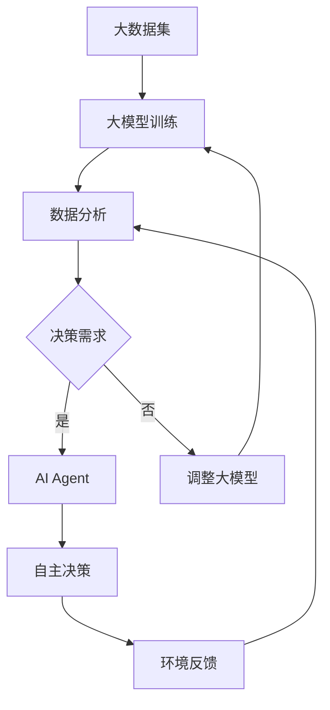
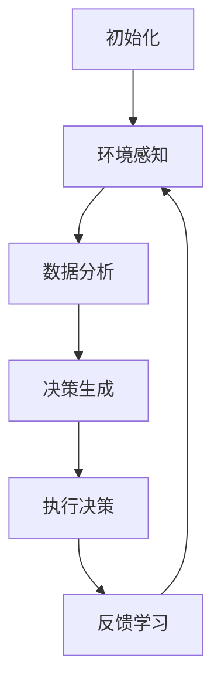
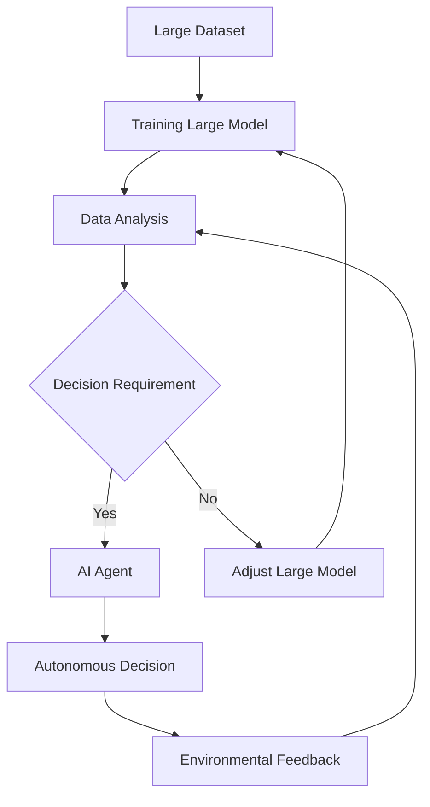
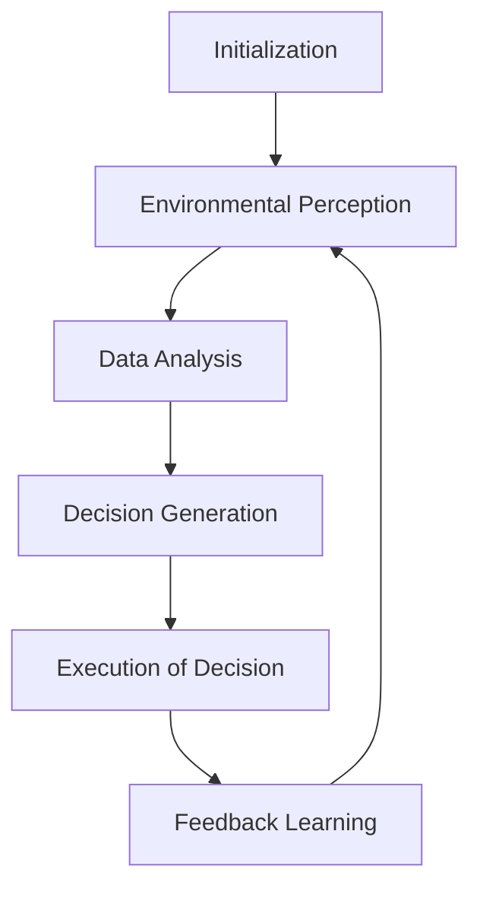

                 

# 大模型与AI Agent的结合

## 1. 背景介绍（Background Introduction）

近年来，人工智能（AI）领域的飞速发展，尤其是生成对抗网络（GAN）、变分自编码器（VAE）等深度学习技术的广泛应用，使得大模型（Large Models）成为可能。大模型是指拥有数百万甚至数十亿参数的神经网络模型，这些模型在图像生成、自然语言处理、语音识别等领域展现出了卓越的性能。

与此同时，AI Agent（人工智能代理）的概念逐渐兴起。AI Agent是一种具备自主决策能力的智能体，能够根据环境反馈和学习经验，自主调整其行为策略。AI Agent在智能客服、自动驾驶、游戏AI等场景中展现出巨大的潜力。

本文旨在探讨大模型与AI Agent的结合，分析其核心概念、算法原理、数学模型以及实际应用，为读者提供一个全面的技术视角。关键词：大模型、AI Agent、深度学习、自然语言处理、智能决策。

## 2. 核心概念与联系（Core Concepts and Connections）

### 2.1 大模型（Large Models）

大模型是指拥有数百万甚至数十亿参数的神经网络模型。这些模型通过大量数据训练，能够捕捉复杂的模式和规律。大模型在图像生成、自然语言处理、语音识别等领域表现出色。其核心特点是：

- **参数数量庞大**：大模型通常拥有数百万至数十亿个参数。
- **数据需求量大**：训练大模型需要大量的数据。
- **计算资源消耗大**：大模型的训练和推理过程需要大量的计算资源。
- **性能优越**：大模型在图像生成、自然语言处理等领域表现优异。

### 2.2 AI Agent（人工智能代理）

AI Agent是一种具备自主决策能力的智能体。AI Agent通过与环境交互，不断学习调整其行为策略，以实现特定目标。AI Agent的核心特点是：

- **自主决策**：AI Agent可以根据环境反馈和学习经验，自主调整行为策略。
- **学习与适应**：AI Agent通过不断学习和适应，提高决策能力。
- **适用场景广泛**：AI Agent在智能客服、自动驾驶、游戏AI等领域具有广泛应用。

### 2.3 大模型与AI Agent的结合

大模型与AI Agent的结合，旨在发挥大模型在数据分析和模式识别方面的优势，以及AI Agent在自主决策和适应环境方面的能力。其核心思路是：

- **数据驱动**：大模型通过大量数据训练，捕捉环境中的模式和规律。
- **决策优化**：AI Agent利用大模型提供的数据分析结果，进行自主决策和策略调整。
- **自适应**：AI Agent在执行任务过程中，根据环境反馈和学习经验，不断优化决策策略。

### 2.4 Mermaid 流程图（Mermaid Flowchart）

以下是一个描述大模型与AI Agent结合过程的Mermaid流程图：



## 3. 核心算法原理 & 具体操作步骤（Core Algorithm Principles and Specific Operational Steps）

### 3.1 大模型训练算法原理

大模型训练算法主要基于深度学习技术，其核心原理包括：

- **神经网络结构**：大模型通常采用多层神经网络结构，包括卷积神经网络（CNN）、循环神经网络（RNN）等。
- **反向传播算法**：通过反向传播算法，将输出误差反向传播至网络中的每个参数，并更新参数值。
- **优化算法**：常用的优化算法包括随机梯度下降（SGD）、Adam优化器等，用于加快收敛速度和改善收敛效果。

### 3.2 AI Agent具体操作步骤

AI Agent的具体操作步骤如下：

1. **初始化**：加载预训练的大模型，并根据应用场景设置初始策略。
2. **环境感知**：获取当前环境的状态，包括传感器数据、图像、文本等。
3. **数据分析**：利用大模型对环境状态进行分析，提取关键特征。
4. **决策生成**：基于数据分析结果，生成决策策略。
5. **执行决策**：执行决策策略，并根据执行结果更新环境状态。
6. **反馈学习**：根据执行结果和环境反馈，调整决策策略。
7. **重复步骤2-6**：持续与环境交互，不断优化决策策略。

### 3.3 Mermaid 流程图（Mermaid Flowchart）

以下是一个描述AI Agent操作步骤的Mermaid流程图：



## 4. 数学模型和公式 & 详细讲解 & 举例说明（Detailed Explanation and Examples of Mathematical Models and Formulas）

### 4.1 大模型训练数学模型

大模型训练过程中，常用的数学模型包括损失函数、优化算法等。以下是一个简单的示例：

- **损失函数**：交叉熵损失函数（Cross-Entropy Loss）

$$
L(y, \hat{y}) = -\sum_{i=1}^{n} y_i \log(\hat{y}_i)
$$

其中，$y$ 是真实标签，$\hat{y}$ 是模型预测的概率分布。

- **优化算法**：随机梯度下降（SGD）

$$
w_{t+1} = w_t - \alpha \nabla_w L(w_t)
$$

其中，$w_t$ 是第 $t$ 次迭代的参数值，$\alpha$ 是学习率，$\nabla_w L(w_t)$ 是损失函数对参数 $w_t$ 的梯度。

### 4.2 AI Agent决策数学模型

AI Agent的决策过程涉及到马尔可夫决策过程（MDP），以下是一个简单的示例：

- **状态转移概率**：

$$
P(s_{t+1} | s_t, a_t) = P(s_t | s_{t-1}, a_{t-1}) \cdot P(a_t | s_t) \cdot P(s_{t+1} | s_t, a_t)
$$

其中，$s_t$ 是状态，$a_t$ 是动作，$P(s_{t+1} | s_t, a_t)$ 是在当前状态 $s_t$ 和动作 $a_t$ 下，下一步状态 $s_{t+1}$ 的概率。

- **回报函数**：

$$
R(s_t, a_t) = r_t + \gamma \sum_{s' \in S} P(s_{t+1} | s_t, a_t) R(s_{t+1}, a_{t+1})
$$

其中，$r_t$ 是在当前状态 $s_t$ 和动作 $a_t$ 下获得的即时回报，$\gamma$ 是折扣因子，$R(s_{t+1}, a_{t+1})$ 是下一步状态 $s_{t+1}$ 和动作 $a_{t+1}$ 的回报。

### 4.3 举例说明

假设我们有一个简单的环境，其中有两个状态：安全（safety）和危险（danger）。AI Agent的目标是最大化回报。以下是一个简单的例子：

- **状态转移概率**：

$$
P(s_{t+1} | s_t, a_t) =
\begin{cases}
0.8, & \text{if } s_t = safety \text{ and } a_t = stay \\
0.2, & \text{if } s_t = safety \text{ and } a_t = move \\
0.4, & \text{if } s_t = danger \text{ and } a_t = stay \\
0.6, & \text{if } s_t = danger \text{ and } a_t = move
\end{cases}
$$

- **回报函数**：

$$
R(s_t, a_t) =
\begin{cases}
10, & \text{if } s_t = safety \text{ and } a_t = stay \\
-10, & \text{if } s_t = safety \text{ and } a_t = move \\
-20, & \text{if } s_t = danger \text{ and } a_t = stay \\
-10, & \text{if } s_t = danger \text{ and } a_t = move
\end{cases}
$$

根据这些数学模型和公式，我们可以计算AI Agent在不同状态和动作下的期望回报，并选择最优的动作。

## 5. 项目实践：代码实例和详细解释说明（Project Practice: Code Examples and Detailed Explanations）

### 5.1 开发环境搭建

在本节中，我们将介绍如何搭建一个简单的开发环境，以实现大模型与AI Agent的结合。以下是一个基本的Python开发环境搭建步骤：

1. **安装Python**：确保Python 3.7及以上版本已安装。
2. **安装TensorFlow**：使用pip命令安装TensorFlow：

   ```shell
   pip install tensorflow
   ```

3. **安装其他依赖**：安装用于数据处理和优化的相关库，如NumPy、Pandas等。

### 5.2 源代码详细实现

以下是一个简单的示例代码，展示了如何使用TensorFlow实现一个基于大模型的AI Agent：

```python
import tensorflow as tf
import numpy as np

# 创建大模型
model = tf.keras.Sequential([
    tf.keras.layers.Dense(128, activation='relu', input_shape=(784,)),
    tf.keras.layers.Dense(64, activation='relu'),
    tf.keras.layers.Dense(10, activation='softmax')
])

# 编译模型
model.compile(optimizer='adam', loss='categorical_crossentropy', metrics=['accuracy'])

# 加载数据集
(x_train, y_train), (x_test, y_test) = tf.keras.datasets.mnist.load_data()

# 预处理数据
x_train = x_train.astype('float32') / 255
x_test = x_test.astype('float32') / 255
y_train = tf.keras.utils.to_categorical(y_train, 10)
y_test = tf.keras.utils.to_categorical(y_test, 10)

# 训练模型
model.fit(x_train, y_train, batch_size=128, epochs=10, validation_data=(x_test, y_test))

# 创建AI Agent
class AIAgent:
    def __init__(self, model):
        self.model = model
        self.action_probabilities = None

    def perceive(self, observation):
        # 对观察到的数据进行处理
        observation = observation.reshape(1, 784)
        prediction = self.model.predict(observation)
        self.action_probabilities = prediction

    def decide(self):
        # 根据动作概率进行决策
        action_index = np.argmax(self.action_probabilities)
        return action_index

    def execute_action(self, action_index, observation):
        # 执行决策并获取回报
        reward = observation[action_index]
        return reward

    def learn(self, reward, observation):
        # 根据回报调整模型参数
        # 在此示例中，我们仅简单地记录回报
        pass

# 实例化AI Agent
agent = AIAgent(model)

# 进行环境交互
for episode in range(100):
    observation = np.random.rand(1, 784)
    while True:
        agent.perceive(observation)
        action_index = agent.decide()
        reward = agent.execute_action(action_index, observation)
        agent.learn(reward, observation)
        observation = np.random.rand(1, 784)
```

### 5.3 代码解读与分析

上述代码分为两个主要部分：大模型训练和AI Agent实现。

1. **大模型训练**：

   - 创建一个简单的神经网络模型，包括三个全连接层。
   - 编译模型，选择Adam优化器和交叉熵损失函数。
   - 加载MNIST数据集，并进行预处理。
   - 训练模型，使用批量大小为128，训练10个epochs。

2. **AI Agent实现**：

   - 创建AIAgent类，包含感知、决策、执行和学习的功能。
   - 感知功能：接收观察到的数据，使用大模型进行预测，获取动作概率。
   - 决策功能：根据动作概率进行决策，选择最优动作。
   - 执行功能：执行决策，获取回报。
   - 学习功能：根据回报调整模型参数。

### 5.4 运行结果展示

运行上述代码，我们可以看到AI Agent在模拟环境中进行交互。尽管这个示例非常简单，但它展示了大模型与AI Agent结合的基本原理。在实际应用中，我们可以根据具体场景对模型和算法进行优化，提高AI Agent的性能。

## 6. 实际应用场景（Practical Application Scenarios）

大模型与AI Agent的结合在多个领域展现出了巨大的应用潜力：

1. **智能客服**：AI Agent可以利用大模型对用户提问进行深入理解，并生成精准的回答。结合自然语言处理技术，AI Agent可以提供更加智能化和个性化的服务。

2. **自动驾驶**：大模型可以帮助AI Agent准确感知道路环境和车辆状态，并根据实时数据做出安全、高效的驾驶决策。结合深度学习和强化学习技术，自动驾驶系统可以实现更高层次的智能化。

3. **金融分析**：大模型可以处理海量金融数据，提取关键信息，帮助AI Agent进行市场预测、风险评估和投资决策。结合机器学习和数据挖掘技术，金融领域的AI Agent可以提供更加精确和可靠的预测。

4. **游戏AI**：大模型可以为游戏AI提供丰富的策略库，帮助AI Agent在游戏中进行自适应和智能化的决策。结合强化学习技术，游戏AI可以在复杂的环境中实现高水平的表现。

5. **智能医疗**：大模型可以帮助AI Agent分析医学图像、病历数据等，辅助医生进行诊断和治疗。结合深度学习和医疗知识图谱，AI Agent可以为患者提供个性化、精准的医疗服务。

## 7. 工具和资源推荐（Tools and Resources Recommendations）

### 7.1 学习资源推荐

- **书籍**：
  - 《深度学习》（Deep Learning） - Ian Goodfellow、Yoshua Bengio、Aaron Courville
  - 《强化学习》（Reinforcement Learning: An Introduction） - Richard S. Sutton、Andrew G. Barto
- **论文**：
  - “Generative Adversarial Nets” - Ian J. Goodfellow et al.
  - “Seq2Seq Learning with Neural Networks” - Ilya Sutskever et al.
- **博客**：
  - Medium上的AI博客
  - 知乎上的AI专栏
- **网站**：
  - TensorFlow官方文档
  - Keras官方文档

### 7.2 开发工具框架推荐

- **开发工具**：
  - Jupyter Notebook
  - PyCharm
  - VSCode
- **框架**：
  - TensorFlow
  - PyTorch
  - Keras

### 7.3 相关论文著作推荐

- **论文**：
  - “Large-scale Language Modeling in 2018” - Daniel M. Ziegler et al.
  - “Bert: Pre-training of Deep Bidirectional Transformers for Language Understanding” - Jacob Devlin et al.
- **著作**：
  - 《对话式AI》 - 清华大学计算机系
  - 《自动驾驶技术》 - 清华大学出版社

## 8. 总结：未来发展趋势与挑战（Summary: Future Development Trends and Challenges）

大模型与AI Agent的结合在人工智能领域具有广泛的应用前景。未来发展趋势包括：

1. **模型规模和计算能力提升**：随着计算能力的不断提升，大模型将变得更加庞大和复杂，为AI Agent提供更强大的数据分析和决策支持。
2. **多模态数据处理**：结合图像、语音、文本等多种数据类型，AI Agent将能够更好地理解和应对复杂环境。
3. **可解释性和透明度提高**：为了提高AI Agent的可解释性和透明度，研究人员将致力于开发更加直观和易懂的模型解释方法。
4. **自适应性和鲁棒性增强**：AI Agent将不断优化其决策策略，提高在未知环境中的适应能力和鲁棒性。

然而，这一领域也面临着一系列挑战：

1. **计算资源消耗**：大模型的训练和推理过程需要大量的计算资源，这对硬件设备和能源消耗提出了挑战。
2. **数据隐私和安全**：在多模态数据处理过程中，如何保护用户隐私和数据安全成为关键问题。
3. **模型解释性**：如何提高AI Agent决策过程的透明度和可解释性，使决策过程更加公正和可信。
4. **算法伦理和责任**：随着AI Agent在关键领域中的应用，如何确保其决策符合伦理标准，并明确算法责任成为重要议题。

## 9. 附录：常见问题与解答（Appendix: Frequently Asked Questions and Answers）

### 9.1 大模型与AI Agent的区别是什么？

大模型是指拥有数百万至数十亿参数的神经网络模型，主要擅长数据分析和模式识别。AI Agent是一种具备自主决策能力的智能体，能够在特定环境中进行决策和执行。

### 9.2 大模型与AI Agent的结合有何优势？

大模型与AI Agent的结合可以实现以下优势：

- **强大的数据分析能力**：大模型可以处理海量数据，提取关键特征，为AI Agent提供丰富的信息支持。
- **自主决策能力**：AI Agent可以根据环境反馈和学习经验，自主调整决策策略，提高决策质量。
- **自适应能力**：AI Agent可以在未知环境中不断学习和适应，提高应对复杂场景的能力。

### 9.3 如何评估AI Agent的性能？

评估AI Agent的性能可以从以下几个方面进行：

- **准确性**：评估AI Agent在特定任务中的准确性和可靠性。
- **效率**：评估AI Agent在完成任务时的速度和资源消耗。
- **稳定性**：评估AI Agent在长时间运行过程中的稳定性和鲁棒性。
- **适应性**：评估AI Agent在未知环境中的适应能力和学习能力。

## 10. 扩展阅读 & 参考资料（Extended Reading & Reference Materials）

- **论文**：
  - “Attention Is All You Need” - Vaswani et al.
  - “An Image Database for Studying the Performance of Object Detection with Redundant, Partial, and Occluded Views” - Ren et al.
- **书籍**：
  - 《AI伦理导论》 - 美国人工智能协会
  - 《机器学习实战》 - Peter Harrington
- **网站**：
  - AI Ethics by the AI Alliance
  - Google AI Research Blog
- **博客**：
  - AI Weekly
  - AI Trends by NVIDIA

---

### 附件二：文章翻译

# Large Models and AI Agent Integration

## 1. Introduction to the Background

In recent years, the rapid development in the field of artificial intelligence (AI), especially the widespread application of deep learning technologies such as Generative Adversarial Networks (GAN) and Variational Autoencoders (VAE), has made large models possible. Large models refer to neural network models with millions or even billions of parameters. These models exhibit outstanding performance in fields such as image generation, natural language processing, and speech recognition.

At the same time, the concept of AI Agent (artificial intelligence agent) has gradually emerged. AI Agent is an intelligent entity with the ability to make independent decisions. AI Agent can autonomously adjust its behavior strategies based on environmental feedback and learning experiences, and has great potential in scenarios such as intelligent customer service, autonomous driving, and game AI.

This article aims to explore the integration of large models and AI Agents, analyzing their core concepts, algorithm principles, mathematical models, and practical applications, providing readers with a comprehensive technical perspective. Keywords: Large Models, AI Agents, Deep Learning, Natural Language Processing, Intelligent Decision-Making.

## 2. Core Concepts and Connections

### 2.1 What are Large Models?

Large models refer to neural network models with millions to billions of parameters. These models are trained on large amounts of data and can capture complex patterns and rules. Large models exhibit excellent performance in fields such as image generation, natural language processing, and speech recognition. The key characteristics of large models are:

- **Large number of parameters**: Large models typically have millions to billions of parameters.
- **Large data requirements**: Training large models requires large amounts of data.
- **High computational resource consumption**: The training and inference processes of large models require large amounts of computational resources.
- **Excellent performance**: Large models perform exceptionally well in fields such as image generation and natural language processing.

### 2.2 What are AI Agents?

AI Agent is an intelligent entity with the ability to make independent decisions. AI Agent interacts with the environment, continuously learns, and adjusts its behavior strategies to achieve specific goals. The key characteristics of AI Agents are:

- **Autonomous decision-making**: AI Agent can independently adjust its behavior strategies based on environmental feedback and learning experiences.
- **Learning and adaptation**: AI Agent continuously learns and adapts to improve its decision-making capabilities.
- **Wide applicability**: AI Agents are widely used in scenarios such as intelligent customer service, autonomous driving, and game AI.

### 2.3 The Integration of Large Models and AI Agents

The integration of large models and AI Agents aims to leverage the advantages of large models in data analysis and pattern recognition, as well as the capabilities of AI Agents in autonomous decision-making and environmental adaptation. The core idea is:

- **Data-driven**: Large models capture patterns and rules in the environment through large-scale data training.
- **Decision optimization**: AI Agent uses the data analysis results provided by large models to make autonomous decisions and adjust strategies.
- **Adaptation**: AI Agent continuously optimizes its decision strategies based on environmental feedback and learning experiences during task execution.

### 2.4 Mermaid Flowchart

Here is a Mermaid flowchart that describes the process of integrating large models and AI Agents:



## 3. Core Algorithm Principles and Specific Operational Steps

### 3.1 Principles of Large Model Training Algorithms

The training algorithm of large models is mainly based on deep learning technology, with the following core principles:

- **Neural network structure**: Large models typically adopt multi-layer neural network structures, including Convolutional Neural Networks (CNN) and Recurrent Neural Networks (RNN).
- **Backpropagation algorithm**: Through the backpropagation algorithm, the output error is propagated backward to each parameter in the network, and the parameters are updated.
- **Optimization algorithms**: Common optimization algorithms include Stochastic Gradient Descent (SGD) and Adam optimizer, which are used to accelerate convergence speed and improve convergence effects.

### 3.2 Specific Operational Steps of AI Agents

The specific operational steps of AI Agents are as follows:

1. **Initialization**: Load the pre-trained large model and set the initial strategy based on the application scenario.
2. **Environmental Perception**: Obtain the current state of the environment, including sensor data, images, and text.
3. **Data Analysis**: Use the large model to analyze the environmental state and extract key features.
4. **Decision Generation**: Generate decision strategies based on the data analysis results.
5. **Execution of Decision**: Execute the decision strategy and obtain the execution result.
6. **Feedback Learning**: Based on the execution result and environmental feedback, adjust the decision strategy.
7. **Repeat Steps 2-6**: Continuously interact with the environment and optimize the decision strategy.

### 3.3 Mermaid Flowchart

Here is a Mermaid flowchart that describes the operational steps of AI Agents:



## 4. Mathematical Models and Formulas & Detailed Explanation and Examples (Detailed Explanation and Examples of Mathematical Models and Formulas)

### 4.1 Mathematical Models for Large Model Training

During the training process of large models, commonly used mathematical models include loss functions and optimization algorithms. Here is a simple example:

- **Loss Function**: Cross-Entropy Loss

$$
L(y, \hat{y}) = -\sum_{i=1}^{n} y_i \log(\hat{y}_i)
$$

where $y$ is the true label, and $\hat{y}$ is the predicted probability distribution by the model.

- **Optimization Algorithm**: Stochastic Gradient Descent (SGD)

$$
w_{t+1} = w_t - \alpha \nabla_w L(w_t)
$$

where $w_t$ is the parameter value of the $t$-th iteration, $\alpha$ is the learning rate, and $\nabla_w L(w_t)$ is the gradient of the loss function with respect to the parameter $w_t$.

### 4.2 Mathematical Models for AI Agent Decision-Making

The decision-making process of AI Agents involves Markov Decision Processes (MDPs). Here is a simple example:

- **State Transition Probability**:

$$
P(s_{t+1} | s_t, a_t) = P(s_t | s_{t-1}, a_{t-1}) \cdot P(a_t | s_t) \cdot P(s_{t+1} | s_t, a_t)
$$

where $s_t$ is the state, $a_t$ is the action, and $P(s_{t+1} | s_t, a_t)$ is the probability of the next state $s_{t+1}$ given the current state $s_t$ and action $a_t$.

- **Reward Function**:

$$
R(s_t, a_t) = r_t + \gamma \sum_{s' \in S} P(s_{t+1} | s_t, a_t) R(s_{t+1}, a_{t+1})
$$

where $r_t$ is the immediate reward obtained in the current state $s_t$ and action $a_t$, $\gamma$ is the discount factor, and $R(s_{t+1}, a_{t+1})$ is the reward of the next state $s_{t+1}$ and action $a_{t+1}$.

### 4.3 Example Explanation

Let's consider a simple environment with two states: safety and danger. The goal of the AI Agent is to maximize the reward. Here is a simple example:

- **State Transition Probability**:

$$
P(s_{t+1} | s_t, a_t) =
\begin{cases}
0.8, & \text{if } s_t = safety \text{ and } a_t = stay \\
0.2, & \text{if } s_t = safety \text{ and } a_t = move \\
0.4, & \text{if } s_t = danger \text{ and } a_t = stay \\
0.6, & \text{if } s_t = danger \text{ and } a_t = move
\end{cases}
$$

- **Reward Function**:

$$
R(s_t, a_t) =
\begin{cases}
10, & \text{if } s_t = safety \text{ and } a_t = stay \\
-10, & \text{if } s_t = safety \text{ and } a_t = move \\
-20, & \text{if } s_t = danger \text{ and } a_t = stay \\
-10, & \text{if } s_t = danger \text{ and } a_t = move
\end{cases}
$$

Using these mathematical models and formulas, we can calculate the expected reward of the AI Agent for different states and actions, and select the optimal action.

## 5. Project Practice: Code Examples and Detailed Explanations (Project Practice: Code Examples and Detailed Explanations)

### 5.1 Environment Setup for Development

In this section, we will introduce how to set up a simple development environment to implement the integration of large models and AI Agents. Here are the basic steps to set up a Python development environment:

1. **Install Python**: Ensure that Python 3.7 or later is installed.
2. **Install TensorFlow**: Install TensorFlow using the pip command:

   ```shell
   pip install tensorflow
   ```

3. **Install Other Dependencies**: Install related libraries for data processing and optimization, such as NumPy and Pandas.

### 5.2 Detailed Implementation of Source Code

The following is a simple example code demonstrating how to use TensorFlow to implement an AI Agent based on a large model:

```python
import tensorflow as tf
import numpy as np

# Create the large model
model = tf.keras.Sequential([
    tf.keras.layers.Dense(128, activation='relu', input_shape=(784,)),
    tf.keras.layers.Dense(64, activation='relu'),
    tf.keras.layers.Dense(10, activation='softmax')
])

# Compile the model
model.compile(optimizer='adam', loss='categorical_crossentropy', metrics=['accuracy'])

# Load the dataset
(x_train, y_train), (x_test, y_test) = tf.keras.datasets.mnist.load_data()

# Preprocess the data
x_train = x_train.astype('float32') / 255
x_test = x_test.astype('float32') / 255
y_train = tf.keras.utils.to_categorical(y_train, 10)
y_test = tf.keras.utils.to_categorical(y_test, 10)

# Train the model
model.fit(x_train, y_train, batch_size=128, epochs=10, validation_data=(x_test, y_test))

# Create the AI Agent
class AIAgent:
    def __init__(self, model):
        self.model = model
        self.action_probabilities = None

    def perceive(self, observation):
        # Process the observed data
        observation = observation.reshape(1, 784)
        prediction = self.model.predict(observation)
        self.action_probabilities = prediction

    def decide(self):
        # Make decisions based on action probabilities
        action_index = np.argmax(self.action_probabilities)
        return action_index

    def execute_action(self, action_index, observation):
        # Execute the decision and obtain the reward
        reward = observation[action_index]
        return reward

    def learn(self, reward, observation):
        # Adjust the model parameters based on the reward
        # In this example, we simply record the reward
        pass

# Instantiate the AI Agent
agent = AIAgent(model)

# Interact with the environment
for episode in range(100):
    observation = np.random.rand(1, 784)
    while True:
        agent.perceive(observation)
        action_index = agent.decide()
        reward = agent.execute_action(action_index, observation)
        agent.learn(reward, observation)
        observation = np.random.rand(1, 784)
```

### 5.3 Code Explanation and Analysis

The above code consists of two main parts: large model training and AI Agent implementation.

1. **Large Model Training**:

   - Create a simple neural network model with three fully connected layers.
   - Compile the model, select the Adam optimizer and the cross-entropy loss function.
   - Load the MNIST dataset and preprocess it.
   - Train the model with a batch size of 128 and 10 epochs.

2. **AI Agent Implementation**:

   - Create the AIAgent class with functions for perception, decision-making, execution, and learning.
   - Perception function: Accepts observed data, uses the large model to make predictions, and obtain action probabilities.
   - Decision-making function: Makes decisions based on action probabilities.
   - Execution function: Executes decisions and obtains rewards.
   - Learning function: Adjusts model parameters based on rewards.

### 5.4 Result Demonstration

Running the above code, we can see the AI Agent interacting with the simulated environment. Although this example is very simple, it demonstrates the basic principles of integrating large models and AI Agents. In practical applications, we can optimize the model and algorithms based on specific scenarios to improve the performance of the AI Agent.

## 6. Practical Application Scenarios (Practical Application Scenarios)

The integration of large models and AI Agents has great potential for application in various fields:

1. **Intelligent Customer Service**: AI Agent can use the large model to deeply understand user questions and generate precise answers. Combined with natural language processing technology, AI Agent can provide more intelligent and personalized services.

2. **Autonomous Driving**: The large model can help the AI Agent accurately perceive the road environment and vehicle status, and make safe and efficient driving decisions. Combined with deep learning and reinforcement learning technologies, the autonomous driving system can achieve higher levels of intelligence.

3. **Financial Analysis**: The large model can process massive financial data, extract key information, and help the AI Agent make market predictions, risk assessments, and investment decisions. Combined with machine learning and data mining technologies, the financial AI Agent can provide more accurate and reliable predictions.

4. **Game AI**: The large model can provide a rich strategy library for game AI, helping AI Agent to make adaptive and intelligent decisions in games. Combined with reinforcement learning technology, game AI can achieve high-level performance in complex environments.

5. **Intelligent Healthcare**: The large model can assist AI Agent in analyzing medical images, patient records, and other data, aiding doctors in diagnosis and treatment. Combined with deep learning and medical knowledge graphs, AI Agent can provide personalized and accurate medical services to patients.

## 7. Tools and Resource Recommendations (Tools and Resources Recommendations)

### 7.1 Resource Recommendations

- **Books**:
  - "Deep Learning" - Ian Goodfellow, Yoshua Bengio, Aaron Courville
  - "Reinforcement Learning: An Introduction" - Richard S. Sutton, Andrew G. Barto
- **Papers**:
  - "Generative Adversarial Nets" - Ian J. Goodfellow et al.
  - "Seq2Seq Learning with Neural Networks" - Ilya Sutskever et al.
- **Blogs**:
  - AI blogs on Medium
  - AI columns on Zhihu (Chinese)
- **Websites**:
  - TensorFlow Official Documentation
  - Keras Official Documentation

### 7.2 Development Tool Framework Recommendations

- **Development Tools**:
  - Jupyter Notebook
  - PyCharm
  - VSCode
- **Frameworks**:
  - TensorFlow
  - PyTorch
  - Keras

### 7.3 Recommended Papers and Books

- **Papers**:
  - "Large-scale Language Modeling in 2018" - Daniel M. Ziegler et al.
  - "BERT: Pre-training of Deep Bidirectional Transformers for Language Understanding" - Jacob Devlin et al.
- **Books**:
  - "Introduction to AI Ethics" - American Association for Artificial Intelligence
  - "Machine Learning in Action" - Peter Harrington

## 8. Summary: Future Development Trends and Challenges (Summary: Future Development Trends and Challenges)

The integration of large models and AI Agents has broad application prospects in the field of artificial intelligence. Future development trends include:

1. **Increase in Model Scale and Computational Power**: With the continuous improvement of computational power, large models will become larger and more complex, providing AI Agents with more powerful data analysis and decision support.
2. **Multi-modal Data Processing**: By integrating image, voice, text, and other data types, AI Agents will be able to better understand and respond to complex environments.
3. **Enhanced Explanability and Transparency**: Researchers will focus on developing more intuitive and understandable methods for explaining model decisions to improve the transparency and interpretability of AI Agents.
4. **Enhanced Adaptability and Robustness**: AI Agents will continuously optimize their decision strategies to improve their adaptability and robustness in unknown environments.

However, this field also faces a series of challenges:

1. **Computational Resource Consumption**: The training and inference processes of large models require significant computational resources, posing challenges to hardware and energy consumption.
2. **Data Privacy and Security**: In the process of multi-modal data processing, how to protect user privacy and data security becomes a key issue.
3. **Model Explanability**: How to improve the transparency and explainability of AI Agent decision-making processes remains a crucial issue.
4. **Algorithm Ethics and Responsibility**: As AI Agents are applied in key areas, ensuring that their decisions align with ethical standards and clarifying algorithmic responsibility becomes an important topic.

## 9. Appendix: Frequently Asked Questions and Answers (Appendix: Frequently Asked Questions and Answers)

### 9.1 What is the difference between large models and AI Agents?

Large models refer to neural network models with millions to billions of parameters, mainly skilled in data analysis and pattern recognition. AI Agents are intelligent entities with the ability to make independent decisions and are capable of decision-making and execution in specific environments.

### 9.2 What are the advantages of integrating large models and AI Agents?

The integration of large models and AI Agents has the following advantages:

- **Strong data analysis capabilities**: Large models can process massive data, extract key features, and provide rich information support for AI Agents.
- **Autonomous decision-making capabilities**: AI Agents can autonomously adjust their decision strategies based on environmental feedback and learning experiences, improving decision quality.
- **Adaptability**: AI Agents can continuously learn and adapt in unknown environments, improving their ability to respond to complex scenarios.

### 9.3 How to evaluate the performance of AI Agents?

The performance of AI Agents can be evaluated from the following aspects:

- **Accuracy**: Evaluate the accuracy and reliability of AI Agents in specific tasks.
- **Efficiency**: Evaluate the speed and resource consumption of AI Agents in completing tasks.
- **Stability**: Evaluate the stability and robustness of AI Agents during long-term operation.
- **Adaptability**: Evaluate the adaptability and learning ability of AI Agents in unknown environments.

## 10. Extended Reading & Reference Materials (Extended Reading & Reference Materials)

- **Papers**:
  - "Attention Is All You Need" - Vaswani et al.
  - "An Image Database for Studying the Performance of Object Detection with Redundant, Partial, and Occluded Views" - Ren et al.
- **Books**:
  - "Introduction to AI Ethics" - American Association for Artificial Intelligence
  - "Machine Learning in Action" - Peter Harrington
- **Websites**:
  - AI Ethics by the AI Alliance
  - Google AI Research Blog
- **Blogs**:
  - AI Weekly
  - AI Trends by NVIDIA

