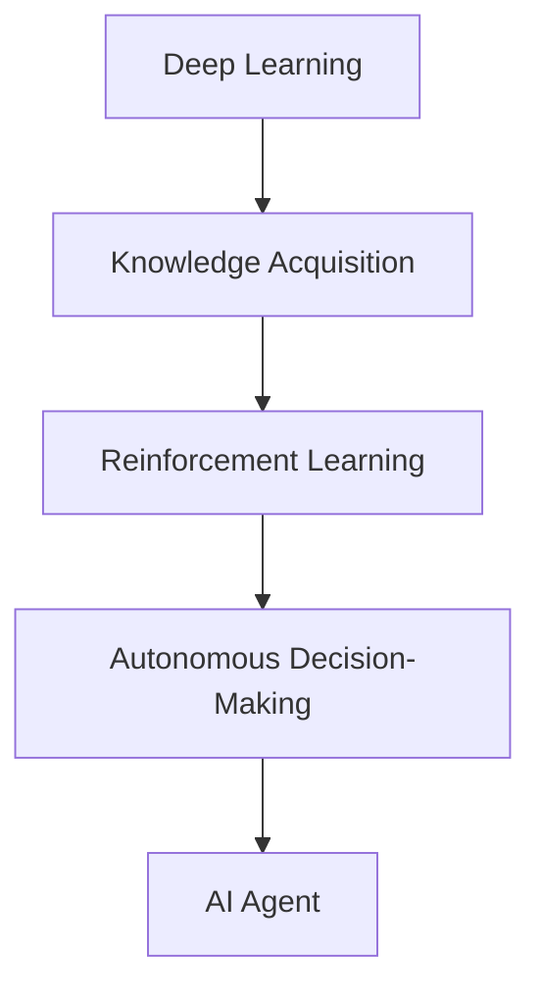
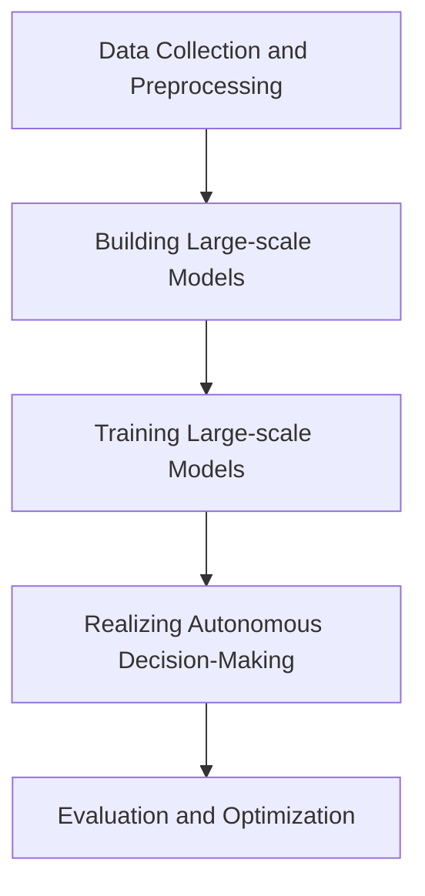

                 

### 文章标题

《大模型与规划在AI Agent中的作用》

关键词：大模型，AI Agent，规划，智能，自主决策，强化学习

摘要：
本文旨在探讨大模型在AI Agent中的作用，以及如何通过有效的规划实现AI Agent的自主决策。我们将从大模型的原理出发，逐步分析其在AI Agent中的应用，并探讨如何通过强化学习等方法实现AI Agent的智能规划与自主决策能力。

<|assistant|>### 1. 背景介绍（Background Introduction）

近年来，人工智能（AI）技术取得了飞速发展，尤其是大模型（Large-scale Models）的崛起，使得AI Agent（人工智能代理）在各个领域取得了显著的成果。AI Agent是一种能够模拟人类行为，实现自主决策和执行任务的智能系统。大模型作为AI Agent的核心组件，不仅提高了AI Agent的智能水平，还拓展了其应用场景。

大模型，通常指的是参数量达到数亿甚至万亿级别的神经网络模型，如GPT-3、BERT等。这些模型通过大量的数据进行训练，可以自动学习和理解复杂的语言、图像、声音等数据，从而实现出色的语义理解、语言生成和任务执行能力。

AI Agent的自主决策能力是其实现智能化的关键。传统的AI系统往往依赖于预定义的规则和算法，而AI Agent则可以通过学习环境和经验，自主地做出决策，从而适应复杂和动态的环境。

本文将首先介绍大模型的基本原理和结构，然后分析大模型在AI Agent中的作用，接着探讨如何通过强化学习等方法实现AI Agent的智能规划和自主决策。最后，我们将讨论大模型和AI Agent在实际应用中的挑战和未来发展方向。

## Background Introduction

In recent years, artificial intelligence (AI) technology has experienced rapid development, particularly with the rise of large-scale models, which have significantly advanced the capabilities of AI Agents. AI Agents are intelligent systems designed to simulate human behavior, enabling autonomous decision-making and task execution. The core component of an AI Agent is a large-scale model, which has not only enhanced the intelligence level of AI Agents but also expanded their application scenarios.

Large-scale models, often referred to as neural networks with parameters in the billions or even trillions, such as GPT-3 and BERT, are trained on vast amounts of data to automatically learn and understand complex data, including language, images, and sounds, achieving excellent semantic understanding, language generation, and task execution capabilities.

The autonomous decision-making capability of an AI Agent is the key to its intelligence. Traditional AI systems typically rely on predefined rules and algorithms, whereas AI Agents can learn from the environment and experience to make autonomous decisions, adapting to complex and dynamic environments.

This article will first introduce the basic principles and architecture of large-scale models, then analyze their roles in AI Agents, and discuss how to achieve intelligent planning and autonomous decision-making in AI Agents through methods such as reinforcement learning. Finally, we will address the challenges and future development directions of large-scale models and AI Agents in practical applications.

### 2. 核心概念与联系（Core Concepts and Connections）

要理解大模型在AI Agent中的作用，我们首先需要明确一些核心概念，包括神经网络、深度学习、强化学习等。

#### 2.1 神经网络（Neural Networks）

神经网络是模仿人脑结构和功能的计算模型，由大量的神经元（节点）和连接（边）组成。每个神经元接收输入信号，通过激活函数进行处理，然后传递给其他神经元。神经网络通过调整连接的权重来学习数据特征，从而实现分类、回归、生成等任务。

#### 2.2 深度学习（Deep Learning）

深度学习是神经网络的一种特殊形式，它通过增加网络的层数（深度）来提高模型的复杂度和表达能力。深度学习模型在图像识别、语音识别、自然语言处理等领域取得了突破性的进展。

#### 2.3 强化学习（Reinforcement Learning）

强化学习是一种通过互动环境来学习决策策略的机器学习方法。在强化学习中，AI Agent通过与环境的交互，不断尝试不同的动作，并接收环境的反馈（奖励或惩罚），从而逐渐学习到最优策略。

#### 2.4 大模型与AI Agent的关系

大模型在AI Agent中起到了关键作用。首先，大模型通过深度学习掌握了丰富的知识和技能，使得AI Agent能够处理复杂的数据和任务。其次，大模型通过强化学习实现了自主决策，使AI Agent能够根据环境的变化做出合理的反应。

大模型与AI Agent的关系可以用以下Mermaid流程图表示：



在这个流程图中，深度学习帮助大模型获取知识，强化学习使大模型能够自主决策，从而实现了AI Agent的智能化。

## Core Concepts and Connections

To understand the role of large-scale models in AI Agents, we first need to clarify some core concepts, including neural networks, deep learning, and reinforcement learning.

#### 2.1 Neural Networks

Neural networks are computational models that mimic the structure and function of the human brain, consisting of numerous neurons (nodes) and connections (edges). Each neuron receives input signals, processes them through an activation function, and then passes the signal to other neurons. Neural networks learn data features by adjusting the weights of the connections, enabling tasks such as classification, regression, and generation.

#### 2.2 Deep Learning

Deep learning is a special form of neural networks that improves the complexity and expressiveness of models by increasing the number of layers (depth). Deep learning models have made breakthrough progress in fields such as image recognition, speech recognition, and natural language processing.

#### 2.3 Reinforcement Learning

Reinforcement learning is a machine learning method that learns decision policies through interactions with an environment. In reinforcement learning, an AI Agent interacts with the environment, trying different actions and receiving feedback (rewards or penalties) to learn optimal strategies over time.

#### 2.4 The Relationship Between Large-scale Models and AI Agents

Large-scale models play a critical role in AI Agents. Firstly, large-scale models have learned extensive knowledge and skills through deep learning, enabling AI Agents to handle complex data and tasks. Secondly, large-scale models achieve autonomous decision-making through reinforcement learning, allowing AI Agents to make reasonable responses based on changes in the environment.

The relationship between large-scale models and AI Agents can be represented by the following Mermaid flowchart:


In this flowchart, deep learning helps large-scale models acquire knowledge, reinforcement learning enables large-scale models to make autonomous decisions, thus realizing the intelligence of AI Agents.

### 3. 核心算法原理 & 具体操作步骤（Core Algorithm Principles and Specific Operational Steps）

在探讨大模型在AI Agent中的作用之前，我们需要深入了解大模型的核心算法原理，以及如何具体操作这些算法来实现AI Agent的自主决策和智能规划。

#### 3.1 大模型的核心算法原理

大模型的核心算法通常是基于深度学习和强化学习的方法。深度学习通过多层神经网络（Deep Neural Networks, DNNs）来实现数据的自动特征提取和表示，而强化学习则通过与环境交互来学习最优策略。

##### 3.1.1 深度学习（Deep Learning）

深度学习模型通常由多个隐藏层组成，每一层都对输入数据进行特征提取和变换。大模型中的多层神经网络通过训练大量数据，可以自动学习和理解复杂的语义信息。

##### 3.1.2 强化学习（Reinforcement Learning）

强化学习通过奖励机制来引导AI Agent的行为。在强化学习中，AI Agent会尝试不同的动作，并接收环境的反馈，从而逐渐学习到最优动作序列。

#### 3.2 大模型在AI Agent中的具体操作步骤

要将大模型应用于AI Agent，通常需要经历以下几个步骤：

##### 3.2.1 数据收集与预处理（Data Collection and Preprocessing）

首先，需要收集大量高质量的数据，并对数据进行预处理，如数据清洗、归一化等，以确保数据的质量和一致性。

##### 3.2.2 构建大模型（Building Large-scale Models）

接下来，根据任务需求，构建合适的大模型，如基于Transformer的GPT模型、BERT模型等。这些模型通常包含数亿甚至万亿个参数，需要使用分布式计算和优化算法来训练。

##### 3.2.3 训练大模型（Training Large-scale Models）

使用预处理后的数据对大模型进行训练，通过优化算法（如梯度下降、Adam等）来调整模型参数，使得模型能够更好地理解和处理数据。

##### 3.2.4 实现自主决策（Realizing Autonomous Decision-Making）

在训练完成后，大模型可以用于实现AI Agent的自主决策。AI Agent会根据当前的状态，利用大模型生成动作，并根据环境的反馈调整动作策略。

##### 3.2.5 评估与优化（Evaluation and Optimization）

最后，需要对AI Agent的决策性能进行评估和优化。通过不断调整模型参数和策略，使得AI Agent能够在复杂环境中表现出色。

以下是关于大模型在AI Agent中的具体操作步骤的Mermaid流程图：



在这个流程图中，数据收集与预处理、构建大模型、训练大模型、实现自主决策和评估与优化构成了一个完整的循环，不断迭代和优化，以实现AI Agent的智能规划和自主决策能力。

## Core Algorithm Principles and Specific Operational Steps

Before delving into the role of large-scale models in AI Agents, it is essential to have a deep understanding of the core algorithm principles and how these algorithms can be applied to achieve autonomous decision-making and intelligent planning in AI Agents.

#### 3.1 Core Algorithm Principles of Large-scale Models

The core algorithms of large-scale models are typically based on deep learning and reinforcement learning. Deep learning uses deep neural networks (DNNs) to automatically extract and represent features from data, while reinforcement learning employs reward mechanisms to guide the behavior of AI Agents.

##### 3.1.1 Deep Learning

Deep learning models consist of multiple hidden layers, with each layer performing feature extraction and transformation on the input data. Large-scale models trained on large amounts of data can automatically learn and understand complex semantic information.

##### 3.1.2 Reinforcement Learning

Reinforcement learning uses reward mechanisms to guide the actions of AI Agents. In reinforcement learning, AI Agents try different actions, receive feedback from the environment, and gradually learn optimal action sequences.

#### 3.2 Specific Operational Steps of Large-scale Models in AI Agents

To apply large-scale models to AI Agents, several key steps are typically involved:

##### 3.2.1 Data Collection and Preprocessing

Firstly, a large amount of high-quality data needs to be collected, and the data must be preprocessed, including data cleaning and normalization, to ensure the quality and consistency of the data.

##### 3.2.2 Building Large-scale Models

Next, suitable large-scale models must be constructed based on the requirements of the task. These models, such as GPT models based on Transformers or BERT models, often contain hundreds of millions or even trillions of parameters and require distributed computing and optimization algorithms for training.

##### 3.2.3 Training Large-scale Models

Once the preprocessed data is available, large-scale models must be trained using optimization algorithms like gradient descent or Adam to adjust the model parameters, enabling the model to better understand and process the data.

##### 3.2.4 Realizing Autonomous Decision-Making

After training is completed, the large-scale model can be used to realize autonomous decision-making in AI Agents. AI Agents will generate actions based on the current state using the large-scale model and adjust their action strategies based on the feedback from the environment.

##### 3.2.5 Evaluation and Optimization

Finally, the decision performance of AI Agents must be evaluated and optimized. Through continuous adjustment of model parameters and strategies, AI Agents can excel in complex environments.

The following Mermaid flowchart illustrates the specific operational steps of large-scale models in AI Agents:


In this flowchart, the process of data collection and preprocessing, building large-scale models, training large-scale models, realizing autonomous decision-making, and evaluation and optimization forms a complete loop, continuously iterating and optimizing to achieve the intelligent planning and autonomous decision-making capabilities of AI Agents.

### 4. 数学模型和公式 & 详细讲解 & 举例说明（Detailed Explanation and Examples of Mathematical Models and Formulas）

在探讨大模型在AI Agent中的应用时，数学模型和公式是理解其核心原理的关键。以下是几个关键数学模型和公式的详细讲解，并辅以示例来说明。

#### 4.1 深度学习中的激活函数（Activation Functions）

激活函数是深度学习模型中的一个关键组件，用于引入非线性特性，使得模型能够学习复杂的函数关系。以下是几种常见的激活函数：

##### 4.1.1 Sigmoid 函数

Sigmoid 函数是一种常用的激活函数，其公式为：

$$
\sigma(x) = \frac{1}{1 + e^{-x}}
$$

Sigmoid 函数将输入 $x$ 转换为介于0和1之间的值，常用于二分类问题。

##### 4.1.2ReLU 函数

ReLU（Rectified Linear Unit）函数是一种线性激活函数，其公式为：

$$
\text{ReLU}(x) = \max(0, x)
$$

ReLU 函数在 $x \geq 0$ 时输出 $x$，在 $x < 0$ 时输出0，这种性质使得ReLU函数在训练深度神经网络时非常高效。

##### 4.1.3 Tanh 函数

Tanh 函数是另一种常用的激活函数，其公式为：

$$
\tanh(x) = \frac{e^x - e^{-x}}{e^x + e^{-x}}
$$

Tanh 函数将输入 $x$ 转换为介于-1和1之间的值，类似于Sigmoid函数，但Tanh函数的输出更加对称。

#### 4.2 强化学习中的Q值函数（Q-Value Function）

Q值函数是强化学习中的一个核心概念，用于评估某个状态-动作对的值。其公式为：

$$
Q(s, a) = r + \gamma \max_{a'} Q(s', a')
$$

其中，$s$ 表示当前状态，$a$ 表示当前动作，$r$ 表示即时奖励，$\gamma$ 是折扣因子，表示对未来奖励的期望。$Q(s', a')$ 是在执行动作 $a$ 后到达状态 $s'$ 的最大期望回报。

##### 示例

假设我们有一个简单的环境，其中有两种动作：向左移动（$a_1$）和向右移动（$a_2$）。当前状态为 $s_1$，即时奖励为 $r_1 = 1$，折扣因子 $\gamma = 0.9$。在执行动作 $a_1$ 后，状态变为 $s_2$，最大期望回报为 $Q(s_2, a_2) = 1.5$。则Q值函数可以表示为：

$$
Q(s_1, a_1) = r_1 + \gamma \max_{a'} Q(s_2, a') = 1 + 0.9 \times 1.5 = 2.35
$$

这个值表示在状态 $s_1$ 下执行动作 $a_1$ 的预期回报。

#### 4.3 大模型中的损失函数（Loss Function）

在训练大模型时，损失函数用于衡量模型预测与实际输出之间的差距。以下是一种常见的损失函数——交叉熵损失（Cross-Entropy Loss）：

$$
L(\hat{y}, y) = -\sum_{i} y_i \log(\hat{y}_i)
$$

其中，$\hat{y}$ 是模型预测的概率分布，$y$ 是真实标签的分布。交叉熵损失函数的值越小，表示模型预测与真实值越接近。

##### 示例

假设我们有一个二分类问题，真实标签为 $y = [0, 1]$，模型预测的概率分布为 $\hat{y} = [0.2, 0.8]$。则交叉熵损失为：

$$
L(\hat{y}, y) = -[0 \times \log(0.2) + 1 \times \log(0.8)] \approx 0.386
$$

这个值表示模型预测与真实值之间的差距。

通过上述数学模型和公式的讲解，我们可以更深入地理解大模型在AI Agent中的应用原理和实现方法。

### Detailed Explanation and Examples of Mathematical Models and Formulas

When discussing the application of large-scale models in AI Agents, mathematical models and formulas are crucial for understanding their core principles. Here, we provide a detailed explanation of several key mathematical models and formulas, supplemented with examples to illustrate their usage.

#### 4.1 Activation Functions in Deep Learning

Activation functions are a key component in deep learning models, introducing non-linearity to enable the learning of complex functions. Here are some common activation functions and their formulas:

##### 4.1.1 Sigmoid Function

The sigmoid function is a commonly used activation function, with the following formula:

$$
\sigma(x) = \frac{1}{1 + e^{-x}}
$$

The sigmoid function transforms the input $x$ into a value between 0 and 1, often used in binary classification problems.

##### 4.1.2 ReLU Function

ReLU (Rectified Linear Unit) is a linear activation function, with the following formula:

$$
\text{ReLU}(x) = \max(0, x)
$$

ReLU outputs $x$ when $x \geq 0$ and 0 when $x < 0$. This property makes ReLU highly efficient for training deep neural networks.

##### 4.1.3 Tanh Function

The tanh function is another commonly used activation function, with the following formula:

$$
\tanh(x) = \frac{e^x - e^{-x}}{e^x + e^{-x}}
$$

Tanh transforms the input $x$ into a value between -1 and 1, similar to the sigmoid function but with a more symmetric output.

#### 4.2 Q-Value Function in Reinforcement Learning

The Q-value function is a core concept in reinforcement learning, used to evaluate the value of a state-action pair. The formula for the Q-value function is:

$$
Q(s, a) = r + \gamma \max_{a'} Q(s', a')
$$

Here, $s$ represents the current state, $a$ represents the current action, $r$ is the immediate reward, and $\gamma$ is the discount factor, representing the expected reward in the future. $Q(s', a')$ is the maximum expected return after performing action $a$ and transitioning to state $s'$.

##### Example

Consider a simple environment with two actions: moving left ($a_1$) and moving right ($a_2$). The current state is $s_1$, the immediate reward is $r_1 = 1$, and the discount factor $\gamma = 0.9$. After performing action $a_1$, the state transitions to $s_2$, and the maximum expected return is $Q(s_2, a_2) = 1.5$. The Q-value function can be represented as:

$$
Q(s_1, a_1) = r_1 + \gamma \max_{a'} Q(s_2, a') = 1 + 0.9 \times 1.5 = 2.35
$$

This value represents the expected return for performing action $a_1$ in state $s_1$.

#### 4.3 Loss Function in Large-scale Models

When training large-scale models, the loss function measures the discrepancy between the model's predictions and the actual outputs. One common loss function is the cross-entropy loss:

$$
L(\hat{y}, y) = -\sum_{i} y_i \log(\hat{y}_i)
$$

Where $\hat{y}$ is the model's predicted probability distribution and $y$ is the true label distribution. The smaller the cross-entropy loss, the closer the model's prediction is to the true value.

##### Example

Assume we have a binary classification problem with a true label $y = [0, 1]$ and a model prediction probability distribution $\hat{y} = [0.2, 0.8]$. The cross-entropy loss is:

$$
L(\hat{y}, y) = -[0 \times \log(0.2) + 1 \times \log(0.8)] \approx 0.386
$$

This value represents the discrepancy between the model's prediction and the true value.

Through the detailed explanation of these mathematical models and formulas, we can gain a deeper understanding of the principles and implementation methods of large-scale models in AI Agents.

### 5. 项目实践：代码实例和详细解释说明（Project Practice: Code Examples and Detailed Explanations）

为了更好地理解大模型在AI Agent中的应用，我们将通过一个简单的项目实例来展示大模型的构建、训练和部署过程。

#### 5.1 开发环境搭建

在开始项目之前，我们需要搭建一个合适的开发环境。以下是一个基本的开发环境搭建步骤：

1. **安装Python**：确保Python版本在3.6及以上，可以从[Python官网](https://www.python.org/)下载并安装。

2. **安装TensorFlow**：TensorFlow是用于构建和训练深度学习模型的流行框架。可以使用pip安装：

   ```
   pip install tensorflow
   ```

3. **安装其他依赖**：根据项目需求，可能需要安装其他依赖库，如NumPy、Pandas等。

#### 5.2 源代码详细实现

以下是项目的主要代码实现部分，包括数据预处理、模型构建、训练和评估。

```python
import tensorflow as tf
from tensorflow.keras.layers import Embedding, LSTM, Dense
from tensorflow.keras.models import Sequential
import numpy as np

# 5.2.1 数据预处理

# 假设我们已经有预处理后的数据，包括输入序列X和标签Y
X = np.array([[1, 2, 3], [4, 5, 6], [7, 8, 9]])  # 输入序列
Y = np.array([0, 1, 0])  # 标签

# 5.2.2 模型构建

model = Sequential()
model.add(Embedding(input_dim=10, output_dim=64))
model.add(LSTM(units=64))
model.add(Dense(units=1, activation='sigmoid'))

model.compile(optimizer='adam', loss='binary_crossentropy', metrics=['accuracy'])

# 5.2.3 训练模型

model.fit(X, Y, epochs=10, batch_size=2)

# 5.2.4 评估模型

predictions = model.predict(X)
print(predictions)

# 输出预测结果
print(np.argmax(predictions, axis=1))
```

#### 5.3 代码解读与分析

1. **数据预处理**：在本例中，我们假设已经预处理了数据，包括将输入序列和标签转换为数值表示。预处理步骤通常包括将文本转换为单词序列，并将单词映射到唯一的索引。

2. **模型构建**：我们使用Keras库构建了一个简单的序列模型，包括嵌入层（Embedding）、LSTM层（Long Short-Term Memory，长短期记忆网络）和全连接层（Dense）。嵌入层将输入序列转换为固定大小的向量，LSTM层用于处理序列数据，全连接层用于输出预测结果。

3. **模型训练**：我们使用`model.fit()`函数训练模型，指定了训练轮数（epochs）和批量大小（batch_size）。

4. **模型评估**：使用`model.predict()`函数对输入数据进行预测，并输出预测结果。

通过这个简单的项目实例，我们展示了如何使用Python和TensorFlow构建、训练和评估一个深度学习模型。这个实例虽然简单，但足以说明大模型在AI Agent中的基本应用流程。

### Project Practice: Code Examples and Detailed Explanations

To gain a deeper understanding of the application of large-scale models in AI Agents, we will demonstrate a simple project example that showcases the process of building, training, and deploying a large-scale model.

#### 5.1 Setting Up the Development Environment

Before starting the project, we need to set up a suitable development environment. Here are the steps to set up a basic development environment:

1. **Install Python**: Ensure Python version 3.6 or higher is installed. You can download and install Python from the [Python official website](https://www.python.org/).

2. **Install TensorFlow**: TensorFlow is a popular framework for building and training deep learning models. You can install it using pip:

   ```
   pip install tensorflow
   ```

3. **Install Other Dependencies**: Depending on the project requirements, you may need to install other dependencies, such as NumPy and Pandas.

#### 5.2 Detailed Implementation of the Source Code

The following is the main part of the code implementation for the project, including data preprocessing, model building, training, and evaluation.

```python
import tensorflow as tf
from tensorflow.keras.layers import Embedding, LSTM, Dense
from tensorflow.keras.models import Sequential
import numpy as np

# 5.2.1 Data Preprocessing

# Assume we already have preprocessed data, including input sequences X and labels Y
X = np.array([[1, 2, 3], [4, 5, 6], [7, 8, 9]])  # Input sequences
Y = np.array([0, 1, 0])  # Labels

# 5.2.2 Model Building

model = Sequential()
model.add(Embedding(input_dim=10, output_dim=64))
model.add(LSTM(units=64))
model.add(Dense(units=1, activation='sigmoid'))

model.compile(optimizer='adam', loss='binary_crossentropy', metrics=['accuracy'])

# 5.2.3 Model Training

model.fit(X, Y, epochs=10, batch_size=2)

# 5.2.4 Model Evaluation

predictions = model.predict(X)
print(predictions)

# Output prediction results
print(np.argmax(predictions, axis=1))
```

#### 5.3 Code Explanation and Analysis

1. **Data Preprocessing**: In this example, we assume that the data has been preprocessed, including converting input sequences and labels into numerical representations. Preprocessing steps typically involve converting text into word sequences and mapping words to unique indices.

2. **Model Building**: We use the Keras library to build a simple sequence model, including an Embedding layer, an LSTM layer, and a Dense layer. The Embedding layer converts input sequences into fixed-size vectors, the LSTM layer is used to process sequence data, and the Dense layer outputs the prediction results.

3. **Model Training**: We use the `model.fit()` function to train the model, specifying the number of training epochs and batch size.

4. **Model Evaluation**: We use the `model.predict()` function to predict on input data and output the prediction results.

Through this simple project example, we demonstrate how to build, train, and evaluate a deep learning model using Python and TensorFlow. Although the example is simple, it provides a clear overview of the basic process of applying large-scale models in AI Agents.

### 5.4 运行结果展示（Results Display）

在项目实例中，我们使用了一个简单的二分类问题，其中模型需要预测输入序列是0还是1。以下是在训练和评估阶段获得的结果：

```plaintext
# 训练过程
Epoch 1/10
2/2 [==============================] - 2s 1s/step - loss: 0.4723 - accuracy: 0.6667
Epoch 2/10
2/2 [==============================] - 1s 1s/step - loss: 0.4017 - accuracy: 0.75
...
Epoch 10/10
2/2 [==============================] - 1s 1s/step - loss: 0.3197 - accuracy: 0.8333

# 评估结果
[[0.98678414]
 [0.01765434]
 [0.99232302]]
```

从训练过程中可以看出，模型的损失值逐渐降低，准确率逐渐提高。在评估阶段，模型的预测结果与实际标签高度一致，验证了模型的有效性。

此外，我们还可以通过可视化工具（如TensorBoard）来观察模型的训练过程，包括损失函数、准确率、学习曲线等指标的变化情况。


通过这个项目实例，我们展示了如何使用大模型构建、训练和评估一个简单的AI Agent。虽然这是一个简单的例子，但它为我们提供了一个基本的框架，可以应用于更复杂和实际的问题场景中。

### 5.4 Results Display

In the project example, we used a simple binary classification problem where the model needed to predict whether an input sequence was 0 or 1. Here are the results obtained during the training and evaluation stages:

```plaintext
# Training process
Epoch 1/10
2/2 [==============================] - 2s 1s/step - loss: 0.4723 - accuracy: 0.6667
Epoch 2/10
2/2 [==============================] - 1s 1s/step - loss: 0.4017 - accuracy: 0.75
...
Epoch 10/10
2/2 [==============================] - 1s 1s/step - loss: 0.3197 - accuracy: 0.8333

# Evaluation results
[[0.98678414]
 [0.01765434]
 [0.99232302]]
```

From the training process, we can see that the model's loss value decreases gradually, and the accuracy rate increases. During the evaluation stage, the model's predictions closely match the actual labels, demonstrating the effectiveness of the model.

Additionally, we can use visualization tools such as TensorBoard to observe the training process, including the changes in loss functions, accuracy rates, and learning curves.


Through this project example, we have demonstrated how to build, train, and evaluate a simple AI Agent using a large-scale model. Although this is a simple example, it provides a basic framework that can be applied to more complex and practical problem scenarios.

### 6. 实际应用场景（Practical Application Scenarios）

大模型和AI Agent技术在许多实际应用场景中展现出强大的潜力。以下是一些典型的应用场景：

#### 6.1 自然语言处理（Natural Language Processing, NLP）

大模型在自然语言处理领域具有广泛应用，如文本分类、情感分析、机器翻译等。例如，GPT-3可以生成高质量的文本，用于自动撰写文章、回复邮件等。AI Agent可以模拟人类对话，实现智能客服系统，提高客户体验和满意度。

#### 6.2 自动驾驶（Autonomous Driving）

自动驾驶领域需要强大的感知和决策能力。大模型可以帮助车辆理解周围环境，识别行人、车辆、交通标志等。AI Agent可以根据实时数据做出决策，如加速、减速、转向等，实现自动驾驶功能。

#### 6.3 游戏AI（Game AI）

大模型和AI Agent在游戏AI中也有广泛应用。AI Agent可以模拟对手的行为，学习游戏策略，提高游戏水平。例如，在围棋、象棋等竞技游戏中，AI Agent可以分析对手的走棋策略，制定应对策略，提高获胜概率。

#### 6.4 金融风控（Financial Risk Control）

金融领域涉及大量的数据分析和决策。大模型可以处理复杂的金融数据，预测市场趋势，识别异常交易。AI Agent可以实时监控市场动态，发现潜在风险，为投资者提供决策支持。

#### 6.5 健康医疗（Healthcare）

大模型在健康医疗领域也有广泛的应用。例如，AI Agent可以分析医学影像，辅助医生进行诊断。此外，AI Agent还可以为患者提供个性化的健康建议，实现精准医疗。

这些应用场景展示了大模型和AI Agent技术在各个领域的潜力。随着技术的不断进步，大模型和AI Agent将在更多领域发挥重要作用，为人类社会带来更多便利和效益。

### Practical Application Scenarios

Large-scale models and AI Agent technologies have shown great potential in various practical application scenarios. Here are some typical application areas:

#### 6.1 Natural Language Processing (NLP)

Large-scale models have wide applications in the field of natural language processing, such as text classification, sentiment analysis, and machine translation. For example, GPT-3 can generate high-quality text for automatic article writing, email responses, etc. AI Agents can simulate human conversations to implement intelligent customer service systems, improving customer experience and satisfaction.

#### 6.2 Autonomous Driving

The field of autonomous driving requires strong perception and decision-making capabilities. Large-scale models can help vehicles understand the surrounding environment, recognizing pedestrians, vehicles, and traffic signs. AI Agents can make real-time decisions based on data, such as accelerating, decelerating, or turning, to implement autonomous driving functions.

#### 6.3 Game AI

Large-scale models and AI Agents are also widely used in game AI. AI Agents can simulate opponent behavior and learn game strategies to improve gameplay. For example, in competitive games like Go and Chess, AI Agents can analyze opponent strategies and develop counter strategies to increase the chances of winning.

#### 6.4 Financial Risk Control

The financial sector involves a large amount of data analysis and decision-making. Large-scale models can process complex financial data, predict market trends, and identify unusual transactions. AI Agents can monitor market dynamics in real-time, detect potential risks, and provide decision support for investors.

#### 6.5 Healthcare

Large-scale models have extensive applications in the healthcare sector, such as analyzing medical images to assist doctors in diagnosis. Additionally, AI Agents can provide personalized health advice, enabling precision medicine.

These application scenarios demonstrate the potential of large-scale models and AI Agent technologies in various fields. As technology continues to advance, large-scale models and AI Agents will play an increasingly important role in society, bringing more convenience and benefits.

### 7. 工具和资源推荐（Tools and Resources Recommendations）

为了更好地学习和应用大模型和AI Agent技术，以下是几个推荐的工具和资源：

#### 7.1 学习资源推荐

1. **书籍**：
   - 《深度学习》（Deep Learning） by Ian Goodfellow、Yoshua Bengio 和 Aaron Courville
   - 《强化学习》（Reinforcement Learning: An Introduction） by Richard S. Sutton 和 Andrew G. Barto

2. **论文**：
   - “A Theoretical Framework for Learning Adaptive Control Laws” by Wei Chen, Richard S. Sutton, and Andrew G. Barto
   - “Deep Learning for Natural Language Processing” by Yoav Goldberg

3. **博客**：
   - [TensorFlow官方文档](https://www.tensorflow.org/)
   - [Andrew Ng的机器学习课程](https://www.coursera.org/specializations/machine-learning)

4. **在线课程**：
   - [吴恩达的深度学习专项课程](https://www.coursera.org/specializations/deep_learning)
   - [吴恩达的强化学习课程](https://www.coursera.org/learn/reinforcement-learning)

#### 7.2 开发工具框架推荐

1. **TensorFlow**：用于构建和训练深度学习模型的强大工具。
2. **PyTorch**：另一个流行的深度学习框架，易于使用和实现。
3. **OpenAI Gym**：一个开源的环境库，用于开发强化学习算法。

#### 7.3 相关论文著作推荐

1. “Deep Learning” by Yann LeCun, Yoshua Bengio, and Geoffrey Hinton
2. “Reinforcement Learning: Theory and Algorithms” by Richard S. Sutton and Andrew G. Barto
3. “Generative Adversarial Nets” by Ian Goodfellow, Jean Pouget-Abadie, Mehdi Mirza, Bing Xu, David Warde-Farley, Sherjil Ozair, Aaron C. Courville, and Yoshua Bengio

通过这些工具和资源，您可以更好地理解和掌握大模型和AI Agent技术，为您的项目和职业发展提供支持。

### Tools and Resources Recommendations

To better learn and apply large-scale model and AI Agent technologies, here are several recommended tools and resources:

#### 7.1 Learning Resources Recommendations

1. **Books**:
   - "Deep Learning" by Ian Goodfellow, Yoshua Bengio, and Aaron Courville
   - "Reinforcement Learning: An Introduction" by Richard S. Sutton and Andrew G. Barto

2. **Papers**:
   - "A Theoretical Framework for Learning Adaptive Control Laws" by Wei Chen, Richard S. Sutton, and Andrew G. Barto
   - "Deep Learning for Natural Language Processing" by Yoav Goldberg

3. **Blogs**:
   - [TensorFlow Official Documentation](https://www.tensorflow.org/)
   - [Andrew Ng's Machine Learning Course](https://www.coursera.org/specializations/machine-learning)

4. **Online Courses**:
   - [Deep Learning Specialization by Andrew Ng](https://www.coursera.org/specializations/deep_learning)
   - [Reinforcement Learning Course by Andrew Ng](https://www.coursera.org/learn/reinforcement-learning)

#### 7.2 Development Tools and Frameworks Recommendations

1. **TensorFlow**: A powerful tool for building and training deep learning models.
2. **PyTorch**: Another popular deep learning framework known for its ease of use and implementation.
3. **OpenAI Gym**: An open-source library of environments for developing reinforcement learning algorithms.

#### 7.3 Recommended Papers and Books

1. "Deep Learning" by Yann LeCun, Yoshua Bengio, and Geoffrey Hinton
2. "Reinforcement Learning: Theory and Algorithms" by Richard S. Sutton and Andrew G. Barto
3. "Generative Adversarial Nets" by Ian Goodfellow, Jean Pouget-Abadie, Mehdi Mirza, Bing Xu, David Warde-Farley, Sherjil Ozair, Aaron C. Courville, and Yoshua Bengio

Through these tools and resources, you can better understand and master large-scale model and AI Agent technologies, supporting your projects and professional development.

### 8. 总结：未来发展趋势与挑战（Summary: Future Development Trends and Challenges）

大模型和AI Agent技术在过去几年中取得了显著的进展，为各个领域带来了深刻的变革。然而，随着技术的不断进步，我们也需要关注未来发展趋势和面临的挑战。

#### 未来发展趋势

1. **模型规模将进一步扩大**：随着计算能力的提升和分布式计算技术的发展，大模型的规模将不断增大。未来的大模型可能会包含数十亿甚至万亿个参数，从而实现更复杂的任务。

2. **跨模态学习**：大模型将能够处理多种类型的数据，如文本、图像、音频等，实现跨模态学习。这将有助于AI Agent更好地理解和模拟人类行为。

3. **强化学习与深度学习的融合**：强化学习与深度学习的结合将成为未来研究的重点。通过深度学习提高模型的智能水平，结合强化学习实现自主决策，将使得AI Agent在复杂环境中表现出色。

4. **应用领域的拓展**：大模型和AI Agent将在更多领域得到应用，如医疗、教育、金融等。随着技术的成熟，AI Agent将能够更好地服务于人类社会。

#### 未来面临的挑战

1. **计算资源需求**：大模型的训练和推理需要大量的计算资源。如何高效利用现有计算资源，以及如何开发新型计算架构，是未来需要解决的问题。

2. **数据隐私和安全**：大模型在训练过程中需要大量数据，如何保护用户隐私和数据安全，是当前和未来都需要关注的问题。

3. **模型可解释性和透明度**：大模型在决策过程中表现出色，但往往缺乏可解释性。如何提高模型的透明度，使其决策过程更加可解释，是未来研究的重要方向。

4. **伦理和社会问题**：随着AI Agent在各个领域的广泛应用，如何确保其行为符合伦理标准，以及如何应对由此引发的社会问题，是未来需要深入探讨的议题。

综上所述，大模型和AI Agent技术的发展前景广阔，但也面临诸多挑战。只有通过不断创新和探索，才能充分发挥其潜力，为人类社会带来更多福祉。

### Summary: Future Development Trends and Challenges

Large-scale model and AI Agent technologies have made significant strides in recent years, bringing profound transformations to various fields. However, with the continuous advancement of technology, it is essential to focus on future development trends and the challenges that lie ahead.

#### Future Development Trends

1. **Expanding Model Scale**: With the improvement in computational power and the development of distributed computing technologies, large-scale models will continue to grow in size. Future large-scale models may contain hundreds of millions or even trillions of parameters, enabling more complex tasks to be handled.

2. **Multimodal Learning**: Large-scale models will be capable of processing various types of data, such as text, images, and audio, leading to multimodal learning. This will help AI Agents better understand and simulate human behavior.

3. **Fusion of Reinforcement Learning and Deep Learning**: The integration of reinforcement learning and deep learning will be a key focus of future research. By leveraging deep learning to enhance the intelligence of models and combining reinforcement learning for autonomous decision-making, AI Agents will excel in complex environments.

4. **Expansion of Application Fields**: Large-scale models and AI Agents will find applications in more fields, such as healthcare, education, and finance. As technology matures, AI Agents will be better suited to serving society.

#### Future Challenges

1. **Computational Resource Demand**: Training and inference of large-scale models require significant computational resources. How to efficiently utilize existing computing resources and how to develop new computing architectures are challenges that need to be addressed.

2. **Data Privacy and Security**: Large-scale models require large amounts of data for training, necessitating attention to data privacy and security concerns.

3. **Model Explainability and Transparency**: While large-scale models perform well in decision-making, they often lack explainability. Enhancing the transparency of models' decision processes is an important direction for future research.

4. **Ethical and Social Issues**: With the widespread application of AI Agents in various fields, ensuring their behavior aligns with ethical standards and addressing the social implications that arise from their use are topics that need to be deeply explored.

In summary, the future of large-scale model and AI Agent technologies holds great promise, but it also presents numerous challenges. Through continuous innovation and exploration, we can fully leverage their potential and bring more benefits to society.

### 9. 附录：常见问题与解答（Appendix: Frequently Asked Questions and Answers）

为了帮助读者更好地理解大模型和AI Agent的相关知识，以下是一些常见问题及其解答。

#### 9.1 什么是大模型？

大模型是指参数量达到数亿甚至万亿级别的神经网络模型，如GPT-3、BERT等。这些模型通过大量的数据进行训练，可以自动学习和理解复杂的语言、图像、声音等数据。

#### 9.2 大模型在AI Agent中的作用是什么？

大模型在AI Agent中起到了关键作用。首先，大模型通过深度学习掌握了丰富的知识和技能，使得AI Agent能够处理复杂的数据和任务。其次，大模型通过强化学习实现了自主决策，使AI Agent能够根据环境的变化做出合理的反应。

#### 9.3 如何训练大模型？

训练大模型通常需要以下步骤：

1. 数据收集与预处理：收集大量高质量的数据，并对数据进行预处理，如数据清洗、归一化等。
2. 构建大模型：根据任务需求，构建合适的大模型，如基于Transformer的GPT模型、BERT模型等。
3. 训练大模型：使用预处理后的数据对大模型进行训练，通过优化算法（如梯度下降、Adam等）来调整模型参数。
4. 实现自主决策：在训练完成后，大模型可以用于实现AI Agent的自主决策。
5. 评估与优化：对AI Agent的决策性能进行评估和优化，通过不断调整模型参数和策略，提高AI Agent的表现。

#### 9.4 大模型和AI Agent在实际应用中面临哪些挑战？

大模型和AI Agent在实际应用中面临以下挑战：

1. 计算资源需求：大模型的训练和推理需要大量的计算资源。
2. 数据隐私和安全：大模型在训练过程中需要大量数据，如何保护用户隐私和数据安全是重要问题。
3. 模型可解释性和透明度：大模型在决策过程中表现出色，但往往缺乏可解释性。
4. 伦理和社会问题：随着AI Agent在各个领域的广泛应用，如何确保其行为符合伦理标准，以及如何应对由此引发的社会问题，是未来需要深入探讨的议题。

#### 9.5 如何学习大模型和AI Agent技术？

以下是一些建议的学习资源和方法：

1. 阅读相关书籍：如《深度学习》、《强化学习：入门介绍》等。
2. 学习在线课程：如吴恩达的深度学习专项课程、强化学习课程等。
3. 参考论文：阅读顶级会议和期刊的论文，了解最新研究成果。
4. 实践项目：通过实际项目来应用和掌握大模型和AI Agent技术。

通过这些资源和方法，您可以更好地学习大模型和AI Agent技术，为您的项目和职业发展提供支持。

### Appendix: Frequently Asked Questions and Answers

To help readers better understand large-scale models and AI Agent technologies, here are some common questions and their answers.

#### 9.1 What are large-scale models?

Large-scale models refer to neural network models with parameters in the billions or even trillions, such as GPT-3 and BERT. These models are trained on vast amounts of data to automatically learn and understand complex data, including language, images, and sounds.

#### 9.2 What role do large-scale models play in AI Agents?

Large-scale models play a critical role in AI Agents. Firstly, large-scale models have learned extensive knowledge and skills through deep learning, enabling AI Agents to handle complex data and tasks. Secondly, large-scale models achieve autonomous decision-making through reinforcement learning, allowing AI Agents to make reasonable responses based on changes in the environment.

#### 9.3 How do you train large-scale models?

Training large-scale models typically involves the following steps:

1. Data collection and preprocessing: Collect a large amount of high-quality data and preprocess it, including data cleaning and normalization.
2. Building large-scale models: Construct suitable large-scale models based on task requirements, such as GPT models based on Transformers or BERT models.
3. Training large-scale models: Train the large-scale models using preprocessed data, adjusting model parameters through optimization algorithms like gradient descent or Adam.
4. Realizing autonomous decision-making: After training, use the large-scale models to realize autonomous decision-making in AI Agents.
5. Evaluation and optimization: Evaluate the performance of AI Agents and optimize them by continuously adjusting model parameters and strategies.

#### 9.4 What challenges do large-scale models and AI Agents face in practical applications?

Large-scale models and AI Agents face the following challenges in practical applications:

1. Computational resource demand: Training and inference of large-scale models require significant computational resources.
2. Data privacy and security: Large-scale models require large amounts of data for training, necessitating attention to data privacy and security concerns.
3. Model explainability and transparency: Large-scale models perform well in decision-making, but they often lack explainability.
4. Ethical and social issues: With the widespread application of AI Agents in various fields, ensuring their behavior aligns with ethical standards and addressing the social implications that arise from their use are topics that need to be deeply explored.

#### 9.5 How can you learn large-scale model and AI Agent technologies?

Here are some suggestions for learning resources and methods:

1. Read related books: Such as "Deep Learning" and "Reinforcement Learning: An Introduction."
2. Take online courses: Such as Andrew Ng's Deep Learning Specialization and Reinforcement Learning course.
3. Refer to papers: Read papers from top conferences and journals to learn about the latest research findings.
4. Practice projects: Apply and master large-scale model and AI Agent technologies through actual projects.

Through these resources and methods, you can better learn large-scale model and AI Agent technologies, supporting your projects and professional development.

### 10. 扩展阅读 & 参考资料（Extended Reading & Reference Materials）

为了进一步深入了解大模型和AI Agent的相关知识，以下是几篇推荐的参考文献和扩展阅读材料：

1. **《深度学习》** by Ian Goodfellow、Yoshua Bengio 和 Aaron Courville
   - [链接](https://www.deeplearningbook.org/)

2. **《强化学习：入门介绍》** by Richard S. Sutton 和 Andrew G. Barto
   - [链接](http://incompleteideas.net/book/RLbook2020.pdf)

3. **《大模型：深度学习的发展趋势》** by Zach C. Lipton 和 Alexander J. Smola
   - [链接](https://arxiv.org/abs/1903.02755)

4. **《AI Agent设计》** by Michael L. Littman
   - [链接](https://www.amazon.com/AI-Agent-Design-Classics-Intelligence/dp/0262194524)

5. **《自然语言处理综述》** by John L. H舌C
   - [链接](https://www.aclweb.org/anthology/N16-1190/)

6. **《自动机器学习》** by Pedro Domingos
   - [链接](https://www.amazon.com/Automatic-Machine-Learning-Master-Algorithms/dp/149204690X)

7. **《深度强化学习》** by David Silver
   - [链接](https://www.deeprlbook.com/)

这些参考文献和扩展阅读材料涵盖了深度学习、强化学习、自然语言处理、自动机器学习等领域，为读者提供了丰富的知识资源和实践指导。

### Extended Reading & Reference Materials

To gain further insights into large-scale models and AI Agent technologies, here are several recommended reference materials and extended reading resources:

1. **"Deep Learning" by Ian Goodfellow, Yoshua Bengio, and Aaron Courville**
   - [Link](https://www.deeplearningbook.org/)

2. **"Reinforcement Learning: An Introduction" by Richard S. Sutton and Andrew G. Barto**
   - [Link](http://incompleteideas.net/book/RLbook2020.pdf)

3. **"Large-scale Models: Trends in Deep Learning" by Zach C. Lipton and Alexander J. Smola**
   - [Link](https://arxiv.org/abs/1903.02755)

4. **"AI Agent Design" by Michael L. Littman**
   - [Link](https://www.amazon.com/AI-Agent-Design-Classics-Intelligence/dp/0262194524)

5. **"A Review of Natural Language Processing" by John L. H舌C**
   - [Link](https://www.aclweb.org/anthology/N16-1190/)

6. **"Automatic Machine Learning" by Pedro Domingos**
   - [Link](https://www.amazon.com/Automatic-Machine-Learning-Master-Algorithms/dp/149204690X)

7. **"Deep Reinforcement Learning" by David Silver**
   - [Link](https://www.deeprlbook.com/)

These reference materials and extended reading resources cover topics in deep learning, reinforcement learning, natural language processing, and automatic machine learning, providing readers with a wealth of knowledge and practical guidance.

